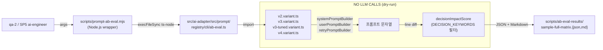

# 54. SP4 Prompt A/B Eval Framework (결정론 드라이런)

- **작성일**: 2026-04-14 (Sprint 6 Day 3)
- **작성자**: qa-2 (Task #21 SP4)
- **상태**: 완료 (v3 vs v4 × 4 모델 × 10 시드 드라이런 PASS)
- **의존**:
  - **SP3 완료**: node-dev-1의 PromptRegistry (commit `5ad02e8`)
  - **B3 완료**: qa-2의 Playtest S4 seed infrastructure (commit `72b81ce`)
- **다음**: SP5 ai-engineer-1 v4 베이스라인 본 구현

---

## 1. 배경

### 1.1 왜 드라이런 A/B가 필요한가

SP1~SP3로 v4 공통 시스템 프롬프트 아키텍처가 설계/구현되었다. SP5에서 v4의 실제 본문이 작성되어
Round 6 대전에 적용되려면, 그 **직전에 변경이 어디에서 어떻게 일어나는지** 사전 측정이 있어야 한다.

문제는: **실제 LLM을 돌리면 비용과 시간이 너무 크다** ($0.04~$1.11 per run, 60분 이상). 게다가
LLM의 비결정성 때문에 "변경이 얼마나 의미 있는지" 판단이 어렵다.

SP4의 역할은 **실제 LLM 호출 없이** v3 vs v4 (혹은 임의의 두 variant)를 비교하는 정적 분석 프레임워크를
구축하는 것이다.

### 1.2 접근 방식

- **Input**: 시드 N개 × Variant M개 × Model K개 매트릭스
- **Processing**:
  1. 각 셀에서 registry의 variant 오브젝트를 직접 import하여 system/user/retry 프롬프트 문자열 생성
  2. 문자열 쌍에 대해 line-level diff 수행
  3. "결정 영향 키워드" 카탈로그로 diff 라인을 필터링하여 **decision impact score** 산출
  4. 토큰 예산 델타 계산
- **Output**: JSON + Markdown 리포트 — SP5가 v4 본문을 채운 뒤 재실행하여 **이전 상태와 비교 가능**.

실제 LLM은 전혀 호출하지 않는다. registry의 빌더 함수만 호출하여 문자열을 생성한다.

---

## 2. 아키텍처



### 2.1 파일 구성

| 경로 | 역할 |
|------|------|
| `scripts/prompt-ab-eval.mjs` | Node.js 래퍼 — ts-node로 harness 호출, `--out` 기본값 주입 |
| `src/ai-adapter/src/prompt/registry/cli/ab-eval.ts` | TypeScript harness — variant import + diff + reporter |
| `scripts/ab-eval-results/sample-full-matrix.json` | 샘플 리포트 JSON (10 seeds × 4 variants × 4 models) |
| `scripts/ab-eval-results/sample-full-matrix.md` | 샘플 리포트 Markdown |
| `scripts/ab-eval-results/.gitignore` | 타임스탬프 런은 ephemeral — sample만 커밋 |

### 2.2 왜 NestJS DI를 사용하지 않는가

NestJS DI는 프로덕션 런타임에서 `PromptRegistry` 서비스를 부트스트랩하기 위한 것이다. 본 harness는
variant 오브젝트만 있으면 충분하며, DI를 거치지 않고 변형 모듈을 직접 `import` 한다. 이로써:

- ConfigService, 환경변수, NestJS 모듈 로딩을 우회 (부트스트랩 비용 0)
- ts-node `--transpile-only` 모드로 타입 체크 없이 즉시 실행
- 테스트 환경과 독립 — 실제 서비스 상태에 영향을 주지 않음

A/B harness가 `PromptRegistry.register()`로 임시 변형을 주입하고 싶다면 향후 NestJS standalone
context를 부트스트랩하는 경로를 추가할 수 있다. SP4 현재 범위에서는 불필요.

---

## 3. 사용법

### 3.1 기본 실행 (B3 시드 10개 × v2/v3/v3-tuned/v4 × 4 모델)

```bash
node scripts/prompt-ab-eval.mjs
```

출력:
- `scripts/ab-eval-results/ab-eval-<timestamp>.json`
- `scripts/ab-eval-results/ab-eval-<timestamp>.md`

### 3.2 특정 variant 쌍만 비교

```bash
# SP5 v4 본문 채운 후 재실행 — v3 vs v4가 더 이상 IDENTICAL이 아니어야 함
node scripts/prompt-ab-eval.mjs --variants v3,v4 --models deepseek-reasoner,dashscope

# burst thinking variant 효과 측정
node scripts/prompt-ab-eval.mjs --variants v3,v3-tuned --models deepseek-reasoner
```

### 3.3 시드 커스터마이즈

```bash
node scripts/prompt-ab-eval.mjs --seeds 0x14,0xB,0xCAFEBABE
```

### 3.4 출력 디렉터리 변경

```bash
node scripts/prompt-ab-eval.mjs --out /tmp/sp5-baseline
```

### 3.5 CLI 전체 옵션

```
--seeds <csv>      시드 목록 (hex). 예: 0x1,0x14,0xB
--variants <csv>   v2, v3, v3-tuned, v4 중 선택. 예: v3,v4
--models <csv>     openai, claude, deepseek-reasoner, dashscope, ollama
--out <dir>        결과 저장 디렉터리 (기본 scripts/ab-eval-results)
--format <f>       json | markdown | both (기본 both)
--help
```

---

## 4. 핵심 분석 지표

### 4.1 Line diff

각 variant 쌍 A→B에 대해 system/user/retry 프롬프트를 **라인 단위**로 diff 수행. added/removed 라인
수와 common 라인 수를 산출.

### 4.2 Decision Impact Score

diff된 라인 중 다음 키워드를 포함한 라인만 "의사결정에 영향을 줄 수 있는 지시어 변경"으로 카운트:

```
verify, before submitting, rejected, forbidden, must, critical, warning,
count check, tilesFromRack, tableGroups, initial meld, draw, place, retry,
invalid, validation, checklist, thinking, budget, evaluation,
legality, residual, point
```

이는 "단순 공백/예시 추가"와 "실제 규칙 지시어 변경"을 구분하는 휴리스틱이다. 완벽하지 않으나
SP5 v4 작성 시 "얼마나 많은 지시어가 실제로 바뀌었는가" 를 숫자로 볼 수 있게 한다.

### 4.3 Token Delta

대략치: `Math.ceil(charCount / 4)`. 실제 tokenizer를 쓰지 않으나 OpenAI 영어 평균과 근사.
A→B에서 tokenDelta가 양수면 "B가 더 길다", 음수면 "B가 더 짧다".

### 4.4 Identical 판정

system + user + retry 세 프롬프트가 모두 byte-exact로 같으면 `identical=true`. v4가 현재
placeholder이므로 v3→v4 쌍은 4 모델 전부 IDENTICAL이 나와야 한다 (sanity check).

---

## 5. 샘플 리포트 결과 (SP5 baseline)

아래 결과는 `scripts/ab-eval-results/sample-full-matrix.md` 의 요약이다.

### 5.1 매트릭스 크기

- Seeds: 10 (B3 재활용 — `0x1, 0x14, 0xB, 0xF, 0x16, 0x1C, 0x2, 0x3, 0xCAFEBABE, 0xDEADBEEF`)
- Variants: 4 (`v2, v3, v3-tuned, v4`)
- Models: 4 (`openai, claude, deepseek-reasoner, dashscope`)
- **Total cells**: 160
- **Pair comparisons**: 24 (6 variant 쌍 × 4 모델)

### 5.2 Pairwise Summary

| A → B | Identical? | Sys +/- | Sys Decision +/- | Avg Δtok |
|-------|:----------:|--------:|-----------------:|---------:|
| v2 → v3 | no | +370/-30 | +160/-20 | +656 |
| v2 → v3-tuned | no | +630/-50 | +320/-40 | +1302 |
| v2 → v4 | no | +370/-30 | +160/-20 | +656 |
| v3 → v3-tuned | no | +290/-50 | +190/-50 | +646 |
| **v3 → v4** | **yes** | 0/0 | 0/0 | 0 |
| v3-tuned → v4 | no | +50/-290 | +50/-190 | -646 |

(4 모델 모두 동일하므로 행을 4배하여 24쌍 — 위 표는 대표값)

### 5.3 판독

1. **v3 → v4 IDENTICAL** (4개 모델 전부) — v4가 `v3-reasoning-prompt` 본문을 그대로 import 하고 있어
   예상대로 byte-exact 동일. **SP5의 임무는 이것을 DIFFER로 바꾸는 것**이다.
2. **v2 → v3 decision impact +160/-20** — v3가 v2 대비 실제 규칙/검증 지시어를 크게 늘렸다는 의미.
   Round 4/5 검증 결과(DeepSeek 30.8%)와 일관.
3. **v3-tuned** — v3보다 +290 라인 (burst thinking budget + 5축 평가). v4가 이 중 일부를 승계할지는
   SP1 §6.1~6.5 결정 대기.
4. **v2 → v3-tuned 토큰 델타 +1302** — system+user+retry 합산. 실제 API 비용에 약 +15% 수준.

### 5.4 결정 영향 키워드 샘플 (v3 → v3-tuned)

```
Added decision lines (190 total, 5 samples):
- `# Thinking Time Budget (NEW in v3-tuned)`
- `You have a generous thinking budget. This is intentional — use it.`
- `Empirically, the hardest turns in a game needed ~2x the thinking tokens of early`
- `- For SIMPLE positions (few rack tiles, obvious draw/place), decide quickly.`
- `  meld, opponent near-winning), take your time. Enumerate, compare, verify.`
```

v3-tuned이 "burst thinking" 문구를 얼마나 구체적으로 담고 있는지 한눈에 확인 가능.

---

## 6. SP5 입력으로서의 역할

SP5 ai-engineer-1이 v4의 실제 본문을 SP1 §6.1~6.5 기반으로 작성한 뒤, 다음을 수행하면 변경 영향을
즉시 측정할 수 있다:

```bash
# SP5 머지 직전
node scripts/prompt-ab-eval.mjs --variants v3,v4 --models deepseek-reasoner,dashscope,openai,claude

# 기대:
#   v3 → v4 (deepseek-reasoner)  DIFFER  sys=+NNN/-MMM  dec=+XXX/-YYY  Δtok=ZZZ
#   v3 → v4 (dashscope)           DIFFER  sys=+NNN/-MMM  dec=+XXX/-YYY  Δtok=ZZZ
#   v3 → v4 (openai)              DIFFER  sys=+NNN/-MMM  dec=+XXX/-YYY  Δtok=ZZZ
#   v3 → v4 (claude)              DIFFER  sys=+NNN/-MMM  dec=+XXX/-YYY  Δtok=ZZZ
#
# 만약 identical이 4/4로 나온다면 → v4 변경이 registry에 반영되지 않은 것 (회귀)
```

### 6.1 SP5 Definition of Done

- `v3 → v4 DIFFER` 4/4 (4개 recommended 모델 전체)
- `system decision impact > 0` — 즉 v4가 규칙/검증 지시어를 최소 1개 이상 추가 또는 변경
- 토큰 델타 절대값이 합리적 범위 (예: -300 ~ +500) — 과도한 팽창/축소가 없어야 함
- 결과 리포트를 `docs/04-testing/` 에 커밋하여 SP5 PR의 증거 자료로 사용

### 6.2 A/B 운영 모드 (per-model override)

SP3의 per-model 환경변수 오버라이드를 활용하면 실제 대전에서도 A/B를 분할할 수 있다:

```bash
# Claude는 v4, DeepSeek는 v3 로 고정하여 Round 6 반반 대전
CLAUDE_PROMPT_VARIANT=v4 DEEPSEEK_REASONER_PROMPT_VARIANT=v3 \
  python scripts/ai-battle-3model-r4.py --models claude,deepseek
```

SP4 harness 결과가 "v4가 v3 대비 +X decision lines 추가" 라고 알려주면, 실제 대전에서 place rate/
invalid rate 변화의 원인을 해석할 수 있다.

---

## 7. 한계

1. **실제 gameState를 쓰지 않는다** — harness는 seed 기반 mulberry32로 가짜 gameState를 합성한다.
   이는 프롬프트 문자열 생성의 "모양"만 테스트하며, "실제 게임 상태에서 프롬프트가 얼마나 잘 작동하는지"
   는 측정할 수 없다. 그 목적은 Phase 2 fixture (B3) 혹은 실제 Round 대전이 담당한다.

2. **Decision impact keyword 카탈로그는 휴리스틱** — 완벽한 NLP 평가가 아니다. v4가 키워드를
   다른 표현으로 (예: "ensure" → "confirm") 바꾸면 카운트에 잡히지 않는다. 개선은 후속 스프린트 이월.

3. **토큰 카운트는 대략치** — `char/4` 근사. OpenAI tiktoken 정확도는 약 ±10%. 실제 API 비용 예측에는
   부적합, "상대 변화율" 용도.

4. **PromptRegistry.register() 우회** — harness는 변형 파일을 직접 import하므로 런타임 등록 변형을
   테스트할 수 없다. SP5 이후 필요하면 NestJS standalone context 추가.

---

## 8. CI 통합 제안 (미구현)

```yaml
# .gitlab-ci.yml (SP5 머지 시 추가)
prompt-ab-eval:
  stage: test
  image: node:22
  script:
    - cd src/ai-adapter && npm install
    - cd $CI_PROJECT_DIR
    - node scripts/prompt-ab-eval.mjs --variants v3,v4 --out ci-ab-eval
    - |
      if grep -q "v3 → v4.*IDENTICAL" ci-ab-eval/*.md; then
        echo "ERROR: v3 and v4 are still identical — v4 placeholder not replaced"
        exit 1
      fi
  artifacts:
    paths:
      - ci-ab-eval/
    expire_in: 2 weeks
  rules:
    - if: '$CI_MERGE_REQUEST_LABELS =~ /prompt-change/'
```

이는 "prompt-change" 라벨이 붙은 PR에만 실행되어 불필요한 비용을 피한다.

---

## 9. 참조

- `src/ai-adapter/src/prompt/registry/cli/ab-eval.ts` — TypeScript harness
- `scripts/prompt-ab-eval.mjs` — Node.js wrapper
- `scripts/ab-eval-results/sample-full-matrix.md` — 샘플 리포트
- `scripts/ab-eval-results/sample-full-matrix.json` — 원본 JSON
- `docs/02-design/39-prompt-registry-architecture.md` — SP2 PromptRegistry 설계
- `docs/03-development/20-common-system-prompt-v4-design.md` — SP1 v4 설계
- `docs/04-testing/53-playtest-s4-deterministic-framework.md` — B3 결정론 프레임워크 (seed 자산)

---

**본 문서의 의의**: Sprint 6 Day 3에 SP3 PromptRegistry 위에 얇게 쌓아올린 정적 분석 프레임워크다.
SP5가 v4 본문을 쓸 때 "변경이 얼마나 있는가"를 숫자로 보여주고, 변경 없이 모르고 넘어가는 regression
을 막는다. 실행 비용은 0 (LLM 호출 없음). SP5 머지 직전에 CI에 추가될 예정.
