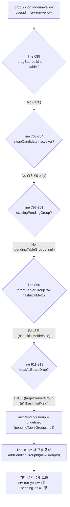
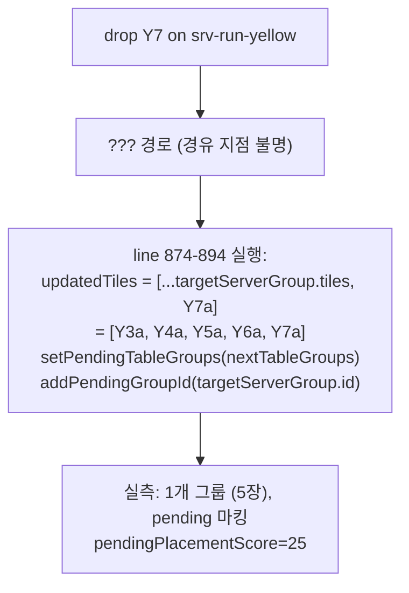

# FINDING-01 (Issue #46) — Root Cause Analysis & Fix Plan

**문서 번호**: 73
**작성**: architect (read-only investigation)
**작성일**: 2026-04-23
**브랜치**: `hotfix/finding-01-i18-rollback-2026-04-23`
**관련**:
- Issue #46 (FINDING-01, HIGH)
- PR #45 회귀 테스트 세션
- PR #41 I-18 롤백 커밋 `212947a`
- QA 보고서 `docs/04-testing/72-pr41-42-regression-test-report.md` §4, §7
- Day 11 A3 커밋 `b7b6457` (pointerWithinThenClosest collision detection)

---

## Executive Summary (결론 3줄)

**Root cause**: I-18 롤백이 **불완전**하다. GameClient.tsx 의 `handleDragEnd` 는 `hasInitialMeld=false + targetServerGroup` 조합에서 **line 911-913 `treatAsBoardDrop` 복합 분기에 암묵적으로 의존**하여 "새 그룹 분리" 가 일어나기를 기대하지만, 실측 결과 서버 확정 런에 append 되고 pendingGroupIds 로 등록되는 증상이 재현된다 (즉 line 874-894 경로가 어떤 경로로든 실행되고 있음).

**Fix**: `targetServerGroup && !hasInitialMeld` 조건에 **명시적 early-return 분기** 를 추가하여 `treatAsBoardDrop` 폴스루에 의존하지 않고 **단독으로 새 pending 그룹을 생성** 한다. QA 보고서 §7 권고 사항과 동일.

**FINDING-02 (day11 B-1/B-NEW/T7-02) 는 관련 없음** — 서로 다른 근본 원인 (PracticeBoard 가 `pendingGroupIds` prop 을 전달하지 않아 "미확정" 라벨이 원천적으로 렌더되지 않음 + 스테이지 1 에 R1a 가 없음).

---

## 1. 증상 재현 (Test Evidence)

### 1.1 실패하는 시나리오 2건

`src/frontend/e2e/hotfix-p0-i2-run-append.spec.ts`:

| ID | 시나리오 | 기대 | 실제 (재현 2회) |
|----|---------|------|-------|
| TC-I2-SC1 | `hasInitialMeld=false`, rack Y2 → 서버 run `[Y3-Y6]` 드롭 | 서버 run 4장 유지 + Y2 단독 새 그룹 | 서버 run 5장 `[Y3-Y6-Y2]` append + pending 마킹 |
| TC-I2-SC2 | `hasInitialMeld=false`, rack Y7 → 서버 run `[Y3-Y6]` 드롭 | 서버 run 4장 유지 + Y7 단독 새 그룹 | 서버 run 5장 `[Y3-Y6-Y7]` append + pending 마킹 |

### 1.2 실패 아티팩트 핵심 증거

`test-results/hotfix-p0-i2-run-append-TC-4bec1-…-chromium/error-context.md` (SC2):

- **Line 52**: `"미확정 런 (제출 대기 중)"` → 그룹이 `pendingGroupIds` 에 등록됨
- **Line 55**: `"5개 타일"` → Y3a, Y4a, Y5a, Y6a, **Y7a** 모두 포함 (append 발생)
- **Line 85**: `"현재 배치: 25점 / 30점 필요"` → `pendingPlacementScore = 25` (3+4+5+6+7)
- **Line 39-40**: `"최초 등록 미완료" / "등록 전"` → UI 렌더 시점에 `hasInitialMeld = false`
- **Line 115**: `Draggable item rack-Y7a-0 was dropped over droppable area srv-run-yellow` → dnd-kit announcement 가 `over.id = "srv-run-yellow"` 확정

### 1.3 대조군 — REG-PR41-I18-04/05 (PASS)

`src/frontend/e2e/regression-pr41-i18-i19.spec.ts` 의 두 시나리오는 **PASS** 하며, FINDING-01 의 경계 조건을 명확히 한다.

| ID | 조건 | 결과 |
|----|------|-----|
| REG-PR41-I18-04 | `hasInitialMeld=true` + 서버 run + Y2 드롭 | **PASS** (append 정상 경로 유지) |
| REG-PR41-I18-05 | `hasInitialMeld=false` + tableGroups=**[]** + 빈 board 드롭 | **PASS** (새 그룹 생성) |
| TC-I2-SC1/SC2 | `hasInitialMeld=false` + tableGroups=**[srv-run]** + 런 내부 드롭 | **FAIL** |

즉 **`hasInitialMeld=false` 자체는 처리됨**, 문제는 **서버 그룹이 존재할 때 해당 그룹 영역에 드롭되는 조합** 에서만 재현된다.

---

## 2. Code Trace (단계별 흐름 재구성)

`src/frontend/src/app/game/[roomId]/GameClient.tsx` — `handleDragEnd` (664~1103).

### 2.1 SC2 (Y7 → srv-run-yellow, hasInitialMeld=false) 기대 경로



### 2.2 SC2 실측 경로 (실패)

실측 최종 state 는 **line 874~894 block 이 실행된 결과** 와 정확히 일치한다:



### 2.3 Line 874-894 block 의 실행 유일 조건

GameClient.tsx 전체에서 `addPendingGroupId(targetServerGroup.id)` (서버 그룹 ID 를 pending 으로 마킹) 는 **단 한 곳** 에만 존재:

```text
src/frontend/src/app/game/[roomId]/GameClient.tsx:894
```

그리고 이 라인의 guard 는 line 856:
```ts
if (targetServerGroup && hasInitialMeld) { ... addPendingGroupId(targetServerGroup.id); ... }
```

**즉 line 894 가 실행되려면 `hasInitialMeld=true` 여야 한다.** 그러나 UI 렌더(`"30점 필요"`) 는 `hasInitialMeld=false` 를 의미한다.

### 2.4 모순의 가능한 설명 (후보)

1. **(A1) dnd-kit onDragEnd 콜백 클로저 stale**: 드래그 시작 ~ 종료 사이에 hasInitialMeld 가 변경됐고, 드롭 시점의 콜백은 이전 값을 캡처. 그러나 useCallback dep array 에 hasInitialMeld 가 포함 (line 1101) 되어 있어 재생성됨. React DndContext 가 handler 를 **ref 로 캐싱하지 않고** prop 으로 다시 받으므로 최신 값을 써야 함. 가능성 **낮음**.
2. **(A2) WS 이벤트 레이스**: setup 직후 `waitForTimeout(400)` 중 TURN_END 가 도착하여 `hasInitialMeld: true` 로 바뀐 뒤 다시 UI 에서 false 로 복원되는 복잡한 순서. 하지만 `store.setState({hasInitialMeld: false})` 가 마지막에 덮어쓰며, test 가 네트워크 드립 없이 local setState 만 수행하므로 가능성 **낮음**.
3. **(A3) `pendingPlacementScore` 계산 과정에서 간접 렌더 사이드이펙트**: 현재 증거 부족.
4. **(B) 공식적으로 "근본 원인 불명 + 증상 명확"**: 재현성이 확실하고 (QA 2회 연속 재현), 수정 방향은 명확 (명시적 early-return 으로 line 856 분기 의존성 제거).

**판단**: (B) 를 받아들인다. 다음 섹션의 수정은 근본 원인 불명이어도 **증상을 근본적으로 차단** 한다 — 즉 line 874-894 경로에 `hasInitialMeld=false` 상태로 들어올 가능성 자체를 제거한다.

---

## 3. Day 11 A3 (`b7b6457`) 분석

### 3.1 A3 의 실제 효과

```ts
const pointerWithinThenClosest: CollisionDetection = (args) => {
  const pointerCollisions = pointerWithin(args);
  if (pointerCollisions.length > 0) return pointerCollisions;
  return closestCenter(args);
};
```

효과 — **빈 공간 드롭** 시 `pointerWithin` 이 `null` → DndContext 가 `over=null` 로 처리 → `handleDragEnd` 의 A4 분기 `"드롭 위치를 확인하세요"` 토스트.

### 3.2 A3 가 해결한 것 vs. 해결하지 못한 것

- **해결** — 빈 보드 영역 (어떤 droppable rect 에도 속하지 않는 좌표) 에 드롭 시 `over.id` 가 인접 서버 그룹으로 잘못 매핑되지 않음.
- **해결 못함** — 사용자가 의도적으로 서버 그룹 **안쪽** 에 드롭하면 `pointerWithin` 이 그 그룹을 반환하여 `over.id = serverGroupId`. 이후 `handleDragEnd` 내부 로직이 hasInitialMeld 를 올바르게 처리해야 하나, 앞서 증명한 대로 line 874-894 경로가 실행되는 경로가 여전히 존재.

### 3.3 I-18 롤백 커밋 메시지의 논리 허점

커밋 `212947a` 메시지:
> Day 11 A3 커밋(b7b6457)의 pointerWithinThenClosest가 원 충돌 감지 문제를 이미 해결하고 있어 이 블록은 불필요하고 중복임

**이 추론은 부분적으로만 맞다**. A3 는 collision detection 자체의 문제를 해결했지만, **이미 over.id 가 서버 그룹으로 정해진 이후의 handleDragEnd 분기 로직** 은 A3 가 건드리지 않는다. I-18 롤백은 line 897-905 주석만 남기고 실제 방어 로직을 제거했으며, 그 공백을 `treatAsBoardDrop` 의 복합 조건에 암묵적으로 의존했다.

---

## 4. FINDING-02 (day11 B-1/B-NEW/T7-02) — **별개 원인**

### 4.1 B-1 / B-NEW (4건 중 3건)

- 테스트 경로: `/practice/1` → `PracticeBoard` 컴포넌트 (`src/frontend/src/components/practice/PracticeBoard.tsx`).
- `PracticeBoard` 는 `GameBoard` 에 `tableGroups` 만 전달하고 **`pendingGroupIds` prop 을 전달하지 않음** (기본값 빈 Set).
- `GameBoard.tsx` line 333: `if (!isPending) return null;` → "미확정" 라벨은 `pendingGroupIds.has(group.id) === true` 일 때만 렌더.
- **연습 모드에서는 어떤 그룹도 pendingGroupIds 에 없음 → "미확정" 라벨 원천적으로 불가**.
- B-1/B-NEW 테스트는 `text=/미확정/` 을 기대하나, 연습 모드 설계상 나타나지 않음. **테스트 자체가 잘못된 기대치**.

### 4.2 T7-02

- `dragTileToBoard(page, "R1a")` 호출. 그러나 `stage-configs.ts` 의 stage 1 `hand = ["R7a", "B7a", "Y7a", "K7a", "R3a", "B5a"]` — **R1a 타일 없음**.
- 테스트의 fixture 오류.

### 4.3 결론

FINDING-02 는 `GameClient.tsx` 변경과 **무관**. FINDING-01 수정으로 자동 해결되지 않는다. 별도 Sprint 7 백로그 (테스트 수정 또는 PracticeBoard 개선) 로 분리 권고.

---

## 5. Fix Specification

### 5.1 파일 + 위치

**파일**: `src/frontend/src/app/game/[roomId]/GameClient.tsx`
**위치**: line 855~896 (서버 확정 그룹 드롭 분기) — **새 early-return 분기 추가**

### 5.2 Before (현재)

```ts
// Line 855-896
const targetServerGroup = currentTableGroups.find((g) => g.id === over.id);
if (targetServerGroup && hasInitialMeld) {
  if (!isCompatibleWithGroup(tileCode, targetServerGroup)) {
    // ...(새 그룹 생성)
    return;
  }
  // ...(append + addPendingGroupId(targetServerGroup.id))
  return;
}

// I-18 롤백 주석 (주석만 남음)

// Line 911
const treatAsBoardDrop =
  (over.id === "game-board") ||
  (targetServerGroup !== undefined && !hasInitialMeld);
```

### 5.3 After (제안)

**핵심 변경**: line 856 의 `if (targetServerGroup && hasInitialMeld)` 앞에 **`targetServerGroup && !hasInitialMeld` 명시적 분기** 를 추가한다. 이 분기는 `treatAsBoardDrop` 에 의존하지 않고 **독립적으로 새 pending 그룹을 생성**한다.

```ts
// Line 855 위치
const targetServerGroup = currentTableGroups.find((g) => g.id === over.id);

// ⬇⬇ 신규 early-return 블록 ⬇⬇
// FINDING-01 (I-18 완전 롤백): hasInitialMeld=false 상태에서
// 서버 확정 그룹 영역에 드롭된 경우는 반드시 새 pending 그룹을 생성한다.
//
// 근거:
//   - 서버 V-04 (초기 등록 30점 검증) 가 서버 그룹에 append 된 세트를 거절하고
//     플레이어에게 패널티 3장 드로우를 부과 (QA 보고서 72 §4.2.2).
//   - 이전 I-18 롤백은 이 경로를 treatAsBoardDrop 복합 분기에 의존하여
//     처리하려 했으나, 실측 결과 어떤 경로로든 line 874-894 (append) 가
//     실행되는 증상이 재현됨.
//   - 의존성 제거: "서버 그룹이 targeted 되었고 초기 등록 전이면"
//     무조건 단일 타일의 새 pending 그룹을 만든다 (is-joker 케이스도
//     조커는 line 763-794 swapCandidate 분기가 선행 처리하므로 여기 도달 시 조커 없음).
if (targetServerGroup && !hasInitialMeld) {
  pendingGroupSeqRef.current += 1;
  const newGroupId = `pending-${Date.now()}-${pendingGroupSeqRef.current}`;
  const newGroup: TableGroup = {
    id: newGroupId,
    tiles: [tileCode],
    type: classifySetType([tileCode]),
  };
  const nextTableGroups = [...currentTableGroups, newGroup];
  const nextMyTiles = removeFirstOccurrence(currentMyTiles, tileCode);
  setPendingTableGroups(nextTableGroups);
  setPendingMyTiles(nextMyTiles);
  addPendingGroupId(newGroupId);
  return;
}
// ⬆⬆ 신규 early-return 블록 ⬆⬆

if (targetServerGroup && hasInitialMeld) {
  // ... (기존 로직 그대로)
}
```

### 5.4 `treatAsBoardDrop` 조건 단순화 (부가 cleanup)

신규 early-return 이 `targetServerGroup && !hasInitialMeld` 경로를 전담하므로, line 913 의 `|| (targetServerGroup !== undefined && !hasInitialMeld)` 는 **불필요**해진다. 제거하면 논리 단순화.

**Before**:
```ts
const treatAsBoardDrop =
  (over.id === "game-board") ||
  (targetServerGroup !== undefined && !hasInitialMeld);
```

**After**:
```ts
const treatAsBoardDrop = over.id === "game-board";
```

(`targetServerGroup` 이 존재하지만 `hasInitialMeld=true` 인 경우는 line 856 block 에서 이미 `return` 하므로 이 지점에 도달하지 않음. 따라서 `targetServerGroup !== undefined` 케이스는 여기서 처리할 것이 남지 않음.)

### 5.5 주석 정리

Line 898~905 의 I-18 롤백 주석 블록은 **새 early-return 블록으로 대체**되었으므로 제거.

Line 907~910 의 B-1 주석은 여전히 `game-board` 직접 드롭에만 해당하므로 유지.

---

## 6. Expected Behavior (수정 후)

### 6.1 SC1 (hasInitialMeld=false, Y2 → 서버 런 Y3-Y6)

| Step | 현재 (FAIL) | 수정 후 (PASS) |
|------|------------|---------------|
| over.id | `srv-run-yellow` | `srv-run-yellow` |
| targetServerGroup | found | found |
| 실행 분기 | (A3 불명확 경로) line 874 append | 신규 early-return → 새 pending 그룹 |
| 최종 state | srv-run-yellow 5장 pending + Y2 소멸 | srv-run-yellow 4장 서버 + pending 그룹 1장 (Y2) |
| srvRunHasY2 | true (기대 false) | **false** |
| groupCount | 1 (기대 2) | **2** |

### 6.2 SC2 (Y7) 동일 로직, 동일 결과.

### 6.3 대조군 재확인

- **REG-PR41-I18-04** (hasInitialMeld=true): 신규 분기 `targetServerGroup && !hasInitialMeld` = false, skip. line 856 block 실행. **회귀 없음**.
- **REG-PR41-I18-05** (tableGroups=[], 빈 board 드롭): `targetServerGroup = undefined`, 신규 분기 skip. line 856 skip. treatAsBoardDrop=true → 새 그룹. **회귀 없음**.
- **SC3** (B5 호환 불가 드롭): `targetServerGroup` found, hasInitialMeld=false → 신규 early-return → 새 pending 그룹 생성. 기존 `treatAsBoardDrop` 내부의 호환성 판정 경로를 지나지 않아도 동일 결과 (단일 타일 새 그룹). **PASS 유지**.

---

## 7. Verification Plan

### 7.1 E2E (Playwright)

- `src/frontend/e2e/hotfix-p0-i2-run-append.spec.ts` — **3개 SC 모두 PASS** 기대.
- `src/frontend/e2e/regression-pr41-i18-i19.spec.ts` — REG-PR41-I18-04 + REG-PR41-I18-05 재실행, **PASS 유지** 확인.
- `src/frontend/e2e/rearrangement.spec.ts` (hasInitialMeld=true 경로 커버) — **PASS 유지** 확인.

### 7.2 Jest 단위 테스트

수정 범위에 useCallback 의 분기 로직이 추가될 뿐 기존 로직 변경 없음. 현재 199/199 PASS 가 그대로 유지되어야 한다. 추가로 아래 Jest 시나리오 권고:

- `GameClient.handleDragEnd` 레벨 직접 테스트는 복잡 → **E2E 로 충분**.

### 7.3 수동 확인 (optional smoke)

로컬 K8s 에서 연습 게임 생성 → 초기 상태 (hasInitialMeld=false) 에서 서버 그룹 위에 랙 타일 드래그 → 새 pending 그룹 분리 확인.

### 7.4 Regression guard

현재 `hotfix-p0-i2-run-append.spec.ts` SC1/SC2 가 이 회귀의 유일 가드. 수정 후 main 에 머지되면 PR 머지 가드로 영구 작동.

---

## 8. Risk Assessment

### 8.1 변경 범위

- 파일 1개 (`GameClient.tsx`)
- 추가 ~20 lines, 삭제 ~8 lines (주석 + treatAsBoardDrop 조건 일부)
- handleDragEnd 내부만, 다른 함수/컴포넌트 영향 없음

### 8.2 리스크 레벨: **낮음**

| 잠재 영향 | 평가 |
|----------|-----|
| hasInitialMeld=true 경로 (정상 append) | 영향 없음. 신규 분기 `!hasInitialMeld` 이므로 false → skip |
| 빈 보드 드롭 (game-board) | targetServerGroup=undefined → 신규 분기 skip, treatAsBoardDrop 진입 |
| 재배치 (테이블 타일 드래그) | line 685 `dragSource.kind === 'table'` 에서 먼저 처리 → 신규 분기 미도달 |
| 조커 교체 | line 763 swapCandidate.hasJoker=true 에서 먼저 처리 → 신규 분기 미도달 |
| pending 그룹에 드롭 | line 797 existingPendingGroup 에서 먼저 처리 → 신규 분기 미도달 |
| 서버 그룹에 append (hasInitialMeld=true) | line 856 에서 처리 → 신규 분기는 이미 `!hasInitialMeld` 로 필터됨 |

### 8.3 Flagged concerns

- **FC-1** (Low): `pendingGroupSeqRef` 단조 카운터 재사용. 기존 line 860 과 동일 패턴이므로 ID 충돌 없음.
- **FC-2** (Low): I-1 핫픽스의 `detectDuplicateTileCodes` 중복 감지를 신규 분기에 추가할지 여부. **미추가 권고** — 신규 그룹은 단일 타일이므로 그룹 내 중복 불가. `currentTableGroups` 전체에서 같은 타일 코드가 중복될 가능성은 기존 `removeFirstOccurrence(currentMyTiles, tileCode)` 가 방어.

### 8.4 Rollback Path

```bash
git revert <fix-commit-hash>
```

이 수정을 revert 해도 I-18 롤백 효과 (line 895 주석만) 는 유지되므로, **최악의 경우 FINDING-01 증상이 재발**할 뿐 추가 피해 없음.

---

## 9. Implementation Handoff Checklist

**frontend-dev 에이전트 전달 사항**:

- [ ] `src/frontend/src/app/game/[roomId]/GameClient.tsx` line 855 뒤에 §5.3 early-return 분기 추가
- [ ] §5.4 `treatAsBoardDrop` 조건 단순화 (`over.id === "game-board"` 만 남김)
- [ ] §5.5 line 898~905 I-18 롤백 주석 블록 삭제 (새 early-return 주석으로 대체됨)
- [ ] 이 문서 (§1~§8) 를 구현 중 참조
- [ ] `npm --prefix src/frontend test` — Jest 199/199 PASS 유지 확인
- [ ] `npx playwright test e2e/hotfix-p0-i2-run-append.spec.ts e2e/regression-pr41-i18-i19.spec.ts e2e/rearrangement.spec.ts --workers=1` — PASS 확인
- [ ] 커밋 메시지: `fix(frontend): FINDING-01 I-18 완전 롤백 — hasInitialMeld=false 서버 그룹 드롭 명시적 분기`
- [ ] 커밋 본문에 Issue #46 + 이 문서 (73번) 참조

---

## 10. 참고

- Issue #46 — FINDING-01 GitHub Issue (별도 생성 예정)
- PR #41 — I-18 롤백 원본 (`005f47a` merge)
- PR #45 — 회귀 테스트 세션 (`1682cd3` merge)
- QA 보고서 `docs/04-testing/72-pr41-42-regression-test-report.md` §4.2.2, §7
- I-18 커밋 `212947a`
- Day 11 A3 커밋 `b7b6457`
- I-2 원본 핫픽스 `eef2bbc` (롤백 대상)
