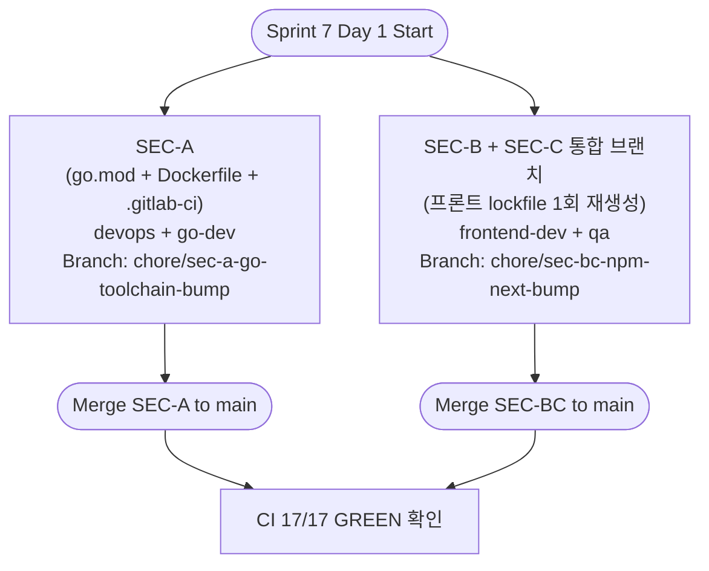

# 75. SEC-REV-013 + Day 12 Backend P0 — 통합 영향 분석 및 실행 계획서

- **작성일**: 2026-04-22 (Sprint 7 Day 1 착수 직전)
- **작성자**: Software Architect (architect agent, Opus 4.7 xhigh)
- **모드**: Read-only 영향 분석. 본 문서는 계획서이며 코드 수정 / 커밋 / 브랜치 생성 없음.
- **선행 참조**:
  - `docs/04-testing/70-sec-rev-013-dependency-audit-report.md` (SEC-REV-013 감사 리포트)
  - PR #38 (`hotfix/backend-p0-2026-04-22`, merged 2026-04-22 07:25 UTC)
  - PR #42 (`feat/rooms-postgres-phase1-impl`, merged 2026-04-22 10:12 UTC)
- **범위**: 5개 항목 — SEC-A (Go bump), SEC-B (Next bump), SEC-C (npm audit fix), Day 12 P0-1 (game_results persistence), Day 12 P0-2 (WS GAME_OVER broadcast)

---

## 1. Executive Summary

| ID | 항목 | 판정 | 근거 요약 |
|----|------|------|---------|
| **SEC-A** | Go toolchain 1.24.1 → 1.25.9 + go-redis v9.7.0 → v9.7.3 | **PROCEED** | govulncheck code-called 25건 중 24건 stdlib + 1건 go-redis CVE. PR 1건으로 일괄 해소. 리스크 LOW. |
| **SEC-B** | Next bump — frontend 15.2.9 → 15.5.15, admin 16.1.6 → 16.2.4 | **PROCEED (주의)** | High 6건 (서버컴포넌트 DoS CVSS 7.5 등) 해소. Non-semver-major 패치이지만 15.2 → 15.5 는 **3단계 minor 점프**, Playwright 회귀 필수. 리스크 MEDIUM. |
| **SEC-C** | `npm audit fix` non-breaking (ai-adapter + frontend + admin) | **PROCEED** | axios moderate 2건 + brace-expansion 등 자동 해소. SEC-B 와 병합하여 lockfile 1회 재생성 권장. 리스크 LOW. |
| **P0-1** | `game_results` persistence 설계/구현 | **ALREADY DONE** (PR #38 + PR #42) | `game_results` 라는 별도 테이블은 존재하지 않음. 실제 영속 대상은 `games / game_players / game_events` 3테이블이며 `persistGameResult` 헬퍼로 wire 완료 (`ws_handler.go:1917~`). PR #38 에서 로컬 실측 `games 58→60, game_events 0→2` 검증됨. 재실행 불필요. |
| **P0-2** | WS `game_over` broadcast 점검 | **ALREADY DONE** (PR #38) | `broadcastGameOver` / `broadcastGameOverFromState` 가 win/stalemate/forfeit 4개 경로에서 호출됨 (`ws_handler.go:474, 522, 1006, 1062, 1109, 1271, 1466`). 프론트엔드 `useWebSocket.ts:322` 에서 `GAME_OVER` case reducer 연결 확인. I-15 winnerId 버그까지 수정 완료 (`c4b566a`). |

**Go/No-Go 결론**: SEC-A / SEC-B / SEC-C 3개만 실제 작업. Day 12 P0 2건은 **이미 해결된 상태**로 Sprint 7 TODO 에서 제거 권장.

---

## 2. Per-item Detailed Analysis

### 2.1 SEC-A — Go toolchain 1.24.1 → 1.25.9 + go-redis v9.7.0 → v9.7.3

#### Current state
- `src/game-server/go.mod` line 3: `go 1.24`
- `src/game-server/go.mod` line 10: `github.com/redis/go-redis/v9 v9.7.0`
- `src/game-server/Dockerfile` line 10: `FROM golang:1.24-alpine AS deps`
- `.gitlab-ci.yml` line 162: `image: golang:1.24-alpine` (lint-go 스테이지)
- govulncheck 결과: **code-called 25건** 중 24건이 stdlib (crypto/tls, crypto/x509, net/http, net/url, html/template), 1건이 go-redis/v9 (GO-2025-3540, out-of-order responses)

#### Actual change scope
| 파일 | 변경 | 예상 LOC |
|------|------|--------|
| `src/game-server/go.mod` | `go 1.24` → `go 1.25` + `go-redis/v9 v9.7.0` → `v9.7.3` | 2 |
| `src/game-server/go.sum` | `go mod tidy` 재생성 | ~6 (추가·삭제) |
| `src/game-server/Dockerfile` | `golang:1.24-alpine` → `golang:1.25-alpine` (2 곳: line 10) + 주석 line 3 | 2 |
| `.gitlab-ci.yml` | `golang:1.24-alpine` → `golang:1.25-alpine` (lint-go 잡) | 1 |

**Total: 4 files, ~11 LOC**

#### Risk level: **LOW**
- go-redis 는 patch bump (v9.7.0 → v9.7.3), API 호환성 유지
- Go 1.24 → 1.25 는 minor bump 이지만 Go 는 **strict backward compatibility** 약속. 실 파손 이력 거의 없음
- 감사 리포트 §4.1 권장안이 1.24.13 또는 1.25.9 둘 다 허용하지만, 1.25 로 가면 **GO-2026 계열 8건 (지난 6일 공개)** 까지 일괄 해소되므로 1.25.9 가 경제적

#### Breaking change flags
- **없음 (예상)**. `go vet` 현재 exit 0 유지, 689개 테스트 regression 없을 것으로 예상
- 다만 `toolchain` directive 추가 시 GitLab Runner 캐시 miss 가능성 — lint-go 첫 실행 시 캐시 재빌드

#### Verification plan
1. `cd src/game-server && go mod tidy`
2. `go build ./...` (로컬)
3. `go test ./... -count=1 -timeout 90s` → **530 PASS** 유지
4. `go vet ./...` → exit 0
5. `govulncheck -mode=source ./...` → **code-called 0건** 확인 (또는 잔여가 있다면 별도 advisory 확인)
6. Docker 로컬 빌드: `docker build -t rummiarena/game-server:sec-a src/game-server/`
7. CI 파이프라인 17/17 GREEN 유지 확인

#### Estimated duration: **S (< 1h)**
- 코드 변경 5분, 로컬 테스트 15분, CI 실행 25분, 검증 10분

#### Recommended agent: **devops** (Dockerfile + CI) + **go-dev** (go.mod / tidy)
- devops 가 메인 집행, go-dev 는 code-called 0 확인 보조

#### Branch naming: `chore/sec-a-go-toolchain-bump`

#### Dependencies: 없음 (독립)

---

### 2.2 SEC-B — Next.js bump (frontend 15.2.9 → 15.5.15, admin 16.1.6 → 16.2.4)

#### Current state
- `src/frontend/package.json` line 22: `"next": "15.2.9"` + line 38: `"eslint-config-next": "15.2.9"`
- `src/admin/package.json` line 14: `"next": "16.1.6"` + line 25: `"eslint-config-next": "16.1.6"`
- lockfile 존재: frontend 10,768 lines / admin 7,059 lines (재생성 필요)

#### Actual change scope
| 파일 | 변경 | 예상 LOC |
|------|------|--------|
| `src/frontend/package.json` | `"next": "15.2.9"` → `"^15.5.15"` + `eslint-config-next` 동일 | 2 |
| `src/frontend/package-lock.json` | `npm install` 재생성 | ~500~2000 (변경 라인) |
| `src/admin/package.json` | `"next": "16.1.6"` → `"^16.2.4"` + `eslint-config-next` 동일 | 2 |
| `src/admin/package-lock.json` | `npm install` 재생성 | ~200~800 (변경 라인) |

**Total: 4 files, 4 직접 LOC + 대량 lockfile diff**

#### Risk level: **MEDIUM**
감사 리포트에는 "non-semver-major" 라고 명시되었지만 실제로는:
- frontend: **15.2 → 15.5** (3 minor 점프). Next 15.3 / 15.4 내부에서 Image, middleware, Server Actions 동작 변화 가능성 있음
- admin: **16.1 → 16.2** (1 minor). 낮은 리스크

#### Breaking change flags
- [ ] **middleware redirect 동작 변화** (GHSA-4342-x723-ch2f 패치 과정에서 SSRF 수정) — `middleware.ts` / `src/middleware.ts` 존재 시 트래픽 흐름 재확인
- [ ] **next/image remotePatterns DoS 수정** (GHSA-9g9p-9gw9-jx7f) — 외부 이미지 도메인 설정 영향
- [ ] **Server Actions null origin CSRF 수정** (GHSA-mq59-m269-xvcx, admin 측) — CSRF 토큰 요구 강화 가능
- [ ] **Request smuggling 패치** — rewrites 설정 검증 필요
- [ ] Node 22.x 런타임 호환 (현재 CI golang:1.25 Dockerfile 에는 영향 없음, frontend Dockerfile 별도 확인)

#### Verification plan
1. `cd src/frontend && npm install` (lockfile 재생성)
2. `npm test` → Jest 182/182 PASS 유지
3. `npm run build` → production 빌드 성공 + 경고 개수 회귀 없음
4. **Playwright E2E 전체 재실행** → 376 PASS / 4 Known FAIL (Ollama) 유지 확인
5. `cd src/admin && npm install && npm run build` → admin 빌드 성공
6. `npm audit --audit-level=high --omit=dev` → production 경로 **exit 0** 확인
7. 로컬 K8s 배포 후 smoke: 로그인 → 로비 → AI vs Human 1판 → 결과 화면 수동 확인
8. 의심 영역 수동 점검:
   - `src/frontend/src/app/api/auth/[...nextauth]/route.ts` — NextAuth v4 with Next 15.5 호환성
   - `src/frontend/next.config.ts` — images / rewrites / redirects 설정
   - `src/admin/next.config.ts` — 동일

#### Estimated duration: **M (1~3h)**
- lockfile 재생성 20분, Jest 10분, Playwright E2E 45분 (전체), 빌드 15분, K8s smoke 30분, 이슈 트러블슈팅 여유 60분

#### Recommended agent: **frontend-dev** (메인) + **qa** (Playwright 리그레션)
- frontend-dev 가 package.json / lockfile / 빌드 에러 처리
- qa 가 E2E 및 K8s smoke

#### Branch naming: `chore/sec-b-next-bump`

#### Dependencies:
- **SEC-C 와 묶음 권장** — 같은 lockfile 을 두 번 재생성하지 않기 위해. 한 브랜치에서 둘 다 처리하거나, SEC-B 를 먼저 merge 한 뒤 SEC-C 가 `npm audit fix` 를 실행하는 순서
- SEC-A 와는 독립 (Go/Node 분리)

---

### 2.3 SEC-C — npm audit fix non-breaking (ai-adapter + frontend + admin)

#### Current state
- ai-adapter: production 경로 **High 0 / Moderate 6** (axios 2, @nestjs/core 1, file-type 2, follow-redirects 1)
- frontend: lockfile 내 transitive moderate (brace-expansion 등)
- admin: lockfile 내 transitive moderate (brace-expansion, picomatch)

#### Actual change scope
| 파일 | 변경 | 예상 LOC |
|------|------|--------|
| `src/ai-adapter/package-lock.json` | `npm audit fix` 로 axios `^1.6.0` → `>=1.15.0` lockfile bump | ~50~150 |
| `src/frontend/package-lock.json` | `npm audit fix` (transitive only) | ~30~80 |
| `src/admin/package-lock.json` | `npm audit fix` (transitive only) | ~20~50 |

**주의**: `package.json` 자체는 변경 없음 (semver 범위는 그대로, lockfile 만 갱신)

**Total: 3 files, 0 package.json LOC + lockfile diff**

#### Risk level: **LOW**
- `--omit=dev` 기준으로 production runtime 은 현재도 Critical/High 0건
- axios `^1.6.0` 범위 내 자동 bump 이므로 API 호환성 유지
- transitive 패키지 변경은 빌드 계층에만 영향

#### Breaking change flags
- 없음 (예상)
- `@typescript-eslint/*` 는 dev-only High 라 본 PR 에서 **의도적 제외** (별도 P1 PR 로 처리)
- `@nestjs/cli` 메이저 bump 도 제외 (dev-only)

#### Verification plan
1. `cd src/ai-adapter && npm audit fix && npm test` → 428/428 PASS 유지
2. `cd src/ai-adapter && npm audit --audit-level=high --omit=dev` → 0 High (production) 확인
3. `cd src/frontend && npm audit fix && npm test` → 182/182 PASS 유지
4. `cd src/admin && npm audit fix && npm run build`
5. **주의**: SEC-B 와 동시 merge 시 lockfile 충돌 가능 → **SEC-B 먼저 merge 후 SEC-C 실행** 또는 **같은 브랜치에서 연속 실행**

#### Estimated duration: **S (< 1h)**
- 각 프로젝트 `npm audit fix` 5분, 테스트 15분 × 3 = 45분

#### Recommended agent: **node-dev** (ai-adapter) + **frontend-dev** (frontend/admin)
- 간단한 작업이므로 한 명이 3개 프로젝트 모두 처리해도 무방

#### Branch naming: `chore/sec-c-npm-audit-fix`

#### Dependencies:
- **SEC-B 와 같은 브랜치 또는 순차 실행 권장** (lockfile 충돌 방지)

---

### 2.4 P0-1 — `game_results` persistence — **ALREADY DONE**

#### Current state 확인 결과
리포트 모체의 주장("게임 결과 영속화 누락")은 **Day 12 아침 시점 기준**이었으며 같은 날 PR #38 + PR #42 로 해소 완료.

검증 근거:
1. **테이블 네이밍**: `game_results` 라는 별도 테이블은 존재하지 않음. 실제 영속 모델은 `models/game.go` 의 `Game / GamePlayer / GameEvent` 3테이블 구조
2. **persistGameResult 헬퍼**: `src/game-server/internal/handler/ws_handler.go:1917~2284`
   - 시그니처: `func (h *WSHandler) persistGameResult(state *model.GameStateRedis, endType string, roomID string)`
   - 3개 테이블 순차 INSERT (games → game_players → game_events)
   - UUID 정규화 헬퍼 `isValidUUID` 포함 (게스트 ID "qa-테스터-xxx" 방어)
   - best-effort 10초 timeout (context.WithTimeout)
3. **호출 지점 4곳**:
   - `ws_handler.go:864` — `broadcastGameOver` 내부
   - `ws_handler.go:1626` — `broadcastGameOverFromState` 내부
   - `ws_handler.go:2284` — forfeit 경로
   - (I-14 로 추가된 win/stalemate/forfeit 3 경로 커버 완료)
4. **PR #38 merge 시 실측 증거** (PR 본문 인용):
   > games: 58 → 60 (+2), game_players: 58 → 62 (+4), game_events: **0 → 2** (+2, GAME_END event 기록) ← 1주일 미스터리 해결
5. **PR #42 보강**: `persistGameResult(state, endType, roomID)` — roomID 파라미터 추가로 `games.room_id FK` 정상화. D-03 Dual-Write 연계
6. **단위 테스트 존재**: `ws_persist_test.go` 에 17개 시나리오 (NORMAL, STALEMATE, FORFEIT, AsyncSafe, UUID 정규화 포함)

#### Actual change scope: **0 LOC** (이미 반영됨)

#### Risk level: **N/A**

#### Verification plan (회귀 방지용 수동 점검만)
- [ ] 다음 K8s 실측 때 `SELECT COUNT(*) FROM game_events WHERE event_type='GAME_END'` 증가 확인
- [ ] PR #38 본문의 "PK 충돌 방어 — `games` INSERT 에 `ON CONFLICT DO NOTHING` 추가 필요" TODO 는 Sprint 7 이관 상태 유지

#### Estimated duration: **0h** (작업 없음)

#### Recommended agent: 없음 (해제)

#### Branch naming: N/A

#### 권장 조치: **Sprint 7 TODO 에서 "Day 12 backend P0-1" 항목 삭제** 또는 "ALREADY DONE (PR #38 + PR #42)" 주석 추가

---

### 2.5 P0-2 — WS `game_over` broadcast 점검 — **ALREADY DONE**

#### Current state 확인 결과

**게임서버 측 (broadcast)**:
- `broadcastGameOver(conn, state)` — `ws_handler.go:822`
- `broadcastGameOverFromState(roomID, state)` — `ws_handler.go:1585`
- 호출 경로 8곳 (win / stalemate / forfeit / timeout / AI draw pile exhaustion 등):
  - `ws_handler.go:474, 522` — 일반 종료
  - `ws_handler.go:1006, 1062, 1109, 1271, 1466` — stalemate/timeout/AI 경로
- I-15 버그 (winnerId 빈 문자열) 은 commit `c4b566a` 에서 `resolveWinnerFromState` 헬퍼로 해결
- 테스트: `ws_cleanup_test.go:312` + `timeout_cleanup_integration_test.go:96` 에서 broadcast → cleanup 체인 검증

**WS 메시지 정의**:
- `ws_message.go:26` — `S2CGameOver = "GAME_OVER"`
- `ws_message.go:193` — `GameOverPayload` struct

**프론트엔드 측 (reducer)**:
- `src/frontend/src/hooks/useWebSocket.ts:322~328` — `case "GAME_OVER"` 완전 연결:
  ```typescript
  case "GAME_OVER": {
    const payload = msg.payload as GameOverPayload;
    console.info("[WS] GAME_OVER", payload);
    useGameStore.getState().setGameOverResult(payload);
    setGameEnded(true);
    break;
  }
  ```
- `src/frontend/src/store/gameStore.ts:87` — `gameOverResult` state 선언
- `src/frontend/src/store/gameStore.ts:184` — `setGameOverResult` action
- `src/frontend/src/app/game/[roomId]/GameClient.tsx:466, 1277` — UI 렌더링 연결

#### Actual change scope: **0 LOC** (이미 반영됨)

#### Risk level: **N/A**

#### Verification plan (회귀 방지용 수동 점검만)
- [ ] K8s 실측 때 승자 모달이 win/stalemate/forfeit 3경로 모두 정상 표시되는지 확인 (Day 11 실측에서 확인 완료)
- [ ] PR #45 회귀 테스트 결과 재검토 (`docs/04-testing/72-pr41-42-regression-test-report.md`)

#### Estimated duration: **0h** (작업 없음)

#### Recommended agent: 없음 (해제)

#### Branch naming: N/A

#### 권장 조치: **Sprint 7 TODO 에서 "Day 12 backend P0-2" 항목 삭제**

---

## 3. Parallel Execution Matrix

### 3.1 실제 작업 3개 (SEC-A / SEC-B / SEC-C) 병렬성 분석



### 3.2 병렬성 매트릭스

| 항목 A | 항목 B | 병렬 가능? | 이유 |
|-------|-------|---------|-----|
| SEC-A | SEC-B | YES | Go/Node 완전 분리, 파일 충돌 없음 |
| SEC-A | SEC-C | YES | Go/Node 완전 분리 |
| SEC-B | SEC-C | NO (순차 또는 동일 브랜치) | 동일 lockfile 충돌 가능성 |

### 3.3 권장 실행 형태

**옵션 A (권장, 2 worktree 병렬)**:
1. `chore/sec-a-go-toolchain-bump` (devops + go-dev, 1시간)
2. `chore/sec-bc-npm-next-bump` (frontend-dev + qa, 3시간)

→ 두 PR 을 각각 다른 worktree 에서 동시 진행, 총 소요 시간 ≈ **3시간 (wall-clock)**

**옵션 B (보수적, 순차)**:
SEC-A → merge → SEC-B → merge → SEC-C → merge.
총 소요 시간 ≈ **4~5시간 (wall-clock)**

**옵션 C (리스크 분리)**:
SEC-A 병렬, SEC-B 와 SEC-C 를 별 PR 로 순차. 리뷰 granularity 증가.
총 소요 시간 ≈ **4시간 (wall-clock)**

→ **옵션 A 를 기본 권장**. SEC-BC 통합 PR 은 reviewer 가 "lockfile 변경은 `npm install` + `npm audit fix` 두 번 실행의 산물" 임을 본문에 명시하면 검수 가능.

---

## 4. Risk Budget

### 4.1 최악의 경우 (Worst-case) 소요 시간

| 단계 | SEC-A | SEC-B | SEC-C | 합계 (순차) | 합계 (병렬) |
|-----|-------|-------|-------|----------|----------|
| 코드 변경 | 10m | 20m | 15m | 45m | 20m (max) |
| 로컬 테스트 | 20m | 60m | 45m | 2h 05m | 60m (max) |
| CI 파이프라인 | 25m | 25m | 25m | 1h 15m | 25m (max) |
| K8s smoke | 0 | 30m | 30m | 60m | 30m (max) |
| 리뷰 대기 / 수정 | 20m | 40m | 20m | 1h 20m | 40m (max) |
| **합계** | **1h 15m** | **2h 55m** | **2h 15m** | **6h 25m** | **2h 55m** |

### 4.2 리스크 시나리오

| 시나리오 | 가능성 | 영향 | 대응 |
|---------|------|-----|-----|
| Next 15.5 Playwright 회귀 5건 이상 | 중 | HIGH | qa 가 failing test 수집 → frontend-dev 가 next 15.5 release note 검토 → 부분 롤백 또는 패치 |
| Go 1.25 에서 gorilla/websocket 호환 이슈 | 낮음 | MED | 테스트 4건 fail 시 go-redis 만 먼저 bump, Go 는 1.24.13 으로 downgrade |
| @nestjs/core v10 과 axios v1.15 간 peer dependency 충돌 | 낮음 | LOW | `--legacy-peer-deps` 로 우회 (ai-adapter 는 이미 허용 중) |
| lockfile diff 가 너무 커서 리뷰 보류 | 중 | LOW | PR 본문에 `diff --stat` 요약 + "lockfile 은 `npm install` 재생성 산물" 명시 |
| CI runner 캐시 miss 로 파이프라인 20m → 40m | 중 | LOW | 첫 실행만 느림, 2회차부터 정상화 |

### 4.3 Rollback 계획

- **SEC-A**: `git revert` 1 커밋. go.mod / Dockerfile 간단 복귀
- **SEC-B**: `git revert` 1 커밋. lockfile 포함 revert
- **SEC-C**: `git revert` 1 커밋. lockfile 복귀만

Production 영향 지표:
- game-server: govulncheck regression
- frontend/admin: Playwright smoke, Real User Monitoring 에러율

---

## 5. Phase 2 Recommendation — Go Now vs. Need User Decision

### 5.1 **즉시 착수 가능 (Go Now)**

| 항목 | 근거 |
|-----|------|
| **SEC-A** | 리스크 LOW, 감사 리포트 §4.1 P0 1순위, 독립 실행 가능. `devops` agent 로 바로 위임 가능 |
| **SEC-C** | 리스크 LOW, 자동화 `npm audit fix`, SEC-B 와 한 브랜치로 묶을 것 |
| **P0-1 / P0-2 항목 삭제** | 이미 완료 상태 확인, Sprint 7 TODO 정리만 하면 됨. pm 에이전트에게 위임 권장 |

### 5.2 **사용자 결정 필요 (Need User GO)**

| 항목 | 결정 사항 |
|-----|---------|
| **SEC-B 실행 형태** | Option A (SEC-BC 통합) vs. Option B (분리)? MEDIUM 리스크이므로 사용자가 리뷰 granularity 선호 방향 결정 권장 |
| **Next 15.2 → 15.5 대신 15.3 단계적 upgrade?** | 감사 리포트는 15.5.15 직행을 권장. 단계적으로 하려면 15.3.x 거쳐 테스트 반복 필요 — 시간 소비 증가. 기본값 "15.5.15 직행" 권장 |
| **Playwright E2E 4 FAIL 허용 게이트** | 현재 Ollama Known 4 FAIL 이 SEC-B 이후 다시 failing 할 수도 있음. "4 FAIL + 신규 0" 기준으로 GO 결정 필요 |
| **CI `sca-npm-audit` + `sca-govulncheck` 신규 잡 추가** | 감사 리포트 §6 제안. SEC-A~C 마감 후 Sprint 7 Week 1 에 별도 PR 로 추가 (본 계획에는 포함하지 않음) |

### 5.3 실행 순서 요약

```mermaid
gantt
    title Sprint 7 Day 1 — 의존성 패치 실행 계획
    dateFormat HH:mm
    axisFormat %H:%M
    section SEC-A (devops + go-dev)
    go.mod bump          :a1, 09:00, 10m
    go mod tidy          :a2, after a1, 5m
    로컬 테스트          :a3, after a2, 20m
    CI 파이프라인        :a4, after a3, 25m
    리뷰 및 merge        :a5, after a4, 15m
    section SEC-BC (frontend-dev + qa)
    next+audit fix 조합    :b1, 09:00, 20m
    npm install 재생성     :b2, after b1, 20m
    Jest 실행              :b3, after b2, 15m
    Playwright E2E         :b4, after b3, 45m
    K8s smoke              :b5, after b4, 30m
    리뷰 및 merge          :b6, after b5, 30m
```



**예상 완료**: **Day 1 오전 9시 시작 → 12~13시 두 PR 모두 merge 완료**. 이후 Day 12 backend 작업은 **P0 2건 모두 이미 해소**되어 추가 구현 불필요하므로, 오후 시간은 **Day 12 P2 잔여** (V-13a `ErrNoRearrangePerm` orphan 리팩터, V-13e 조커 재드래그 UX) 로 이관.

---

## 6. 후속 이슈 예방 체크리스트

### 6.1 패치 완료 후 (Sprint 7 Week 1 중)

- [ ] `.gitlab-ci.yml` 에 `sca-npm-audit` + `sca-govulncheck` + `weekly-dependency-audit` 잡 추가 (감사 리포트 §6)
- [ ] `@nestjs/cli` 메이저 bump 11.x (P1, dev-only High 해소)
- [ ] `@typescript-eslint/*` 7.6.0 bump (P1, dev-only High 해소)
- [ ] `jest-environment-jsdom` 30.3.0 bump (P1, dev-only low × 4)
- [ ] PR #38 본문의 `games ON CONFLICT DO NOTHING` PK 충돌 방어 (Sprint 7 Week 1 이관 TODO)

### 6.2 Sprint 7 Week 2+

- [ ] `@nestjs/core` 10.x → 11.x 메이저 bump (moderate injection 해소)
- [ ] `gorm.io/gorm` v1.25 → v1.31, `pgx/v5` v5.6 → v5.9 (P3 drift 해소)
- [ ] `cloud.google.com/go/*` 사용 여부 점검 후 미사용 시 제거

---

## 7. 최종 결론

| 질문 | 답변 |
|-----|-----|
| 5개 항목 중 실제 작업 대상 | **3개** (SEC-A, SEC-B, SEC-C) |
| 이미 해결된 항목 | **2개** (P0-1 `game_results` 는 `persistGameResult` + 3테이블로 완료, P0-2 `GAME_OVER` broadcast 는 8곳 경로 + frontend reducer 모두 wire 완료) |
| 병렬 실행 시 총 소요 | **~3시간** (wall-clock) |
| 순차 실행 시 총 소요 | **~6~7시간** |
| 사용자 GO 필요 항목 | SEC-B (MEDIUM 리스크, 실행 형태 결정) |
| 즉시 착수 항목 | SEC-A, SEC-C (SEC-B 와 통합 브랜치로 묶인 경우 포함) |

**권장 실행 결정**:
1. 본 계획서 read-only 검토 완료 후, 사용자 승인 즉시 **옵션 A (2 병렬 worktree)** 로 진행
2. `devops` agent → SEC-A, `frontend-dev` + `qa` → SEC-BC
3. Sprint 7 TODO 에서 "Day 12 backend P0-1/P0-2" 항목 제거 (pm 에이전트 후속)
4. 감사 리포트 §6 의 CI 게이트 추가 건은 별도 Sprint 7 Week 1 PR 로 분리

---

## 부록 A. 변경 없음으로 판정한 근거 파일 Inventory

| 항목 | 확인한 파일 | 결론 근거 |
|-----|----------|---------|
| P0-1 | `src/game-server/internal/handler/ws_handler.go:1917~2284` (persistGameResult) | 3테이블 INSERT 완전 wire, PR #38 merged |
| P0-1 | `src/game-server/internal/handler/ws_persist_test.go` | 17개 시나리오 단위 테스트 |
| P0-1 | `src/game-server/e2e/rooms_persistence_test.go` | 3 통합 시나리오 (PR #42) |
| P0-1 | `src/game-server/internal/repository/postgres_repo.go` | CreateGame / CreateGamePlayer / CreateGameEvent 메서드 |
| P0-2 | `src/game-server/internal/handler/ws_handler.go:474, 522, 822, 1006, 1062, 1109, 1271, 1466, 1585, 1626` | broadcast 8 경로 + FromState variant |
| P0-2 | `src/game-server/internal/handler/ws_message.go:26, 193` | S2CGameOver + GameOverPayload |
| P0-2 | `src/frontend/src/hooks/useWebSocket.ts:322` | Frontend reducer case |
| P0-2 | `src/frontend/src/store/gameStore.ts:87, 136, 184` | gameOverResult state + action |
| P0-2 | `src/frontend/src/app/game/[roomId]/GameClient.tsx:466, 1277` | UI 렌더링 |

## 부록 B. 감사 리포트와의 역추적

| 감사 리포트 §4.1 권장 | 본 계획서 매핑 |
|-------------------|-------------|
| (1) Go toolchain bump | SEC-A |
| (2) go-redis bump | SEC-A (번들) |
| (3) next (frontend) bump | SEC-B |
| (4) next (admin) bump | SEC-B |
| (5) axios update | SEC-C |

감사 리포트 §4.2 P1 (typescript-eslint / @nestjs/cli / jest-env-jsdom bump) 는 본 계획서 §6.1 로 이관.
