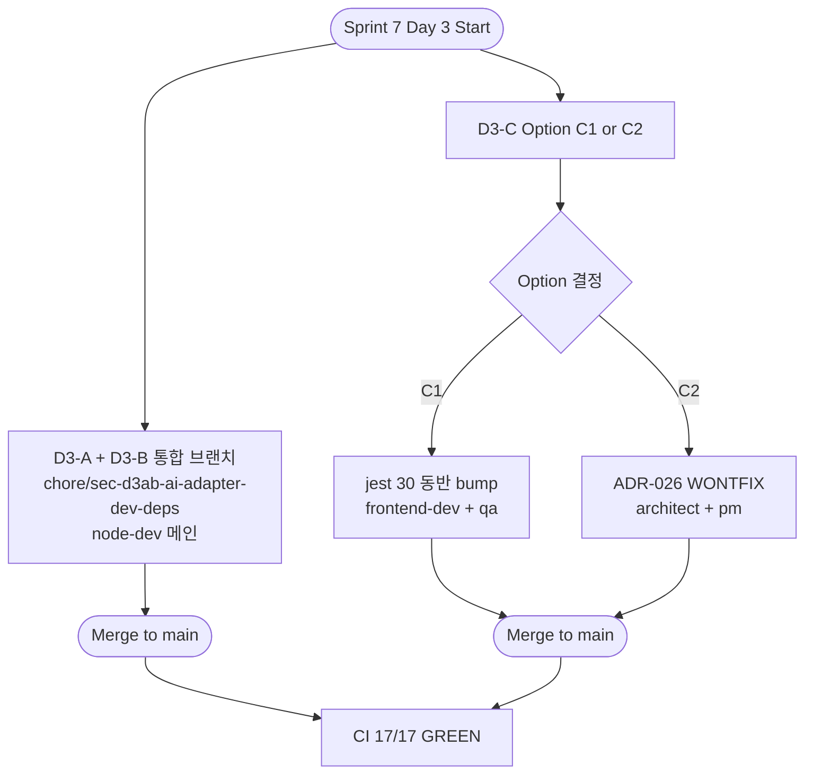

# 79. Sprint 7 Day 3 — dev-only High/Low 의존성 3건 영향 분석 및 실행 계획서

- **작성일**: 2026-04-23 (Sprint 7 Day 2 마감 직후, Day 3 착수 전)
- **작성자**: Software Architect (architect agent, Opus 4.7 xhigh)
- **모드**: Read-only 영향 분석. 본 문서는 계획서이며 코드 수정 / 커밋 / 브랜치 생성 없음.
- **선행 참조**:
  - `docs/04-testing/70-sec-rev-013-dependency-audit-report.md` (SEC-REV-013 감사 리포트)
  - `docs/04-testing/75-sec-day12-impact-and-plan.md` §6.1 (본 계획 항목을 Sprint 7 Week 1 이관으로 명시)
  - `docs/04-testing/78-sec-a-b-c-audit-delta.md` (Day 2 SEC-A/B/C 실행 후 audit delta)
- **범위**: 3건 — D3-A (`@typescript-eslint/*` bump), D3-B (`@nestjs/cli` major bump), D3-C (`jest-environment-jsdom` bump)
- **모두 dev-only**: 세 패키지 모두 `devDependencies` 에만 존재. production runtime 위험 없음

---

## 1. Executive Summary

| ID | 항목 | 현재 설치 | 목표 | 판정 | 근거 요약 |
|----|------|---------|------|------|---------|
| **D3-A** | `@typescript-eslint/eslint-plugin` + `/parser` ^6.0.0 → ^7.18.0 | 6.21.0 | 7.18.0 | **PROCEED** | CVE 3건 (minimatch ReDoS High). eslint@8.42 호환 유지, rule config 변경 없음 예상. 리스크 LOW. |
| **D3-B** | `@nestjs/cli` ^10.0.0 → ^11.0.21 (SemVer major) | 10.4.9 | 11.0.21 | **PROCEED (주의)** | CVE 1건 (glob command injection High) + dev transitive 다수 해소. Node >= 20.11 engine 요구 (현재 22.x 사용 중 OK). nest-cli.json 포맷 변경 없음 확인. 리스크 MEDIUM. |
| **D3-C** | `jest-environment-jsdom` ^29.7.0 → ^30.3.0 (SemVer major) | 29.7.0 | **HOLD (조건부)** | 30.3.0 | CVE 4건 (@tootallnate/once CWE-705 Low 등). **peer mismatch**: v30 은 `@jest/environment@30.3.0` + `jsdom@^26.1.0` 요구. frontend `jest@29.7.0` 과 비호환 → **jest 30 동반 bump 필수**. 리스크 HIGH. |

**Go/No-Go 결론**:
- **D3-A / D3-B** 는 Day 3 오전 착수 가능 (총 ~3시간 병렬)
- **D3-C** 는 **jest@30 동반 bump 필수** — 이를 별건 구현으로 뗄지, Low 4건 WONTFIX 로 유지할지 사용자 결정 필요

---

## 2. Per-item Detailed Analysis

### 2.1 D3-A — `@typescript-eslint/*` ^6.0.0 → ^7.18.0

#### Current state (source of truth: installed lockfile)
- `src/ai-adapter/package.json:48-49`
  ```json
  "@typescript-eslint/eslint-plugin": "^6.0.0",
  "@typescript-eslint/parser": "^6.0.0",
  ```
- Installed: `6.21.0` (eslint-plugin + parser 둘 다, `node_modules/@typescript-eslint/{eslint-plugin,parser}/package.json` 확인)
- eslint 버전: `eslint@^8.42.0` (ai-adapter)
- `.eslintrc.js`: `extends: ['plugin:@typescript-eslint/recommended', 'plugin:prettier/recommended']`, rule 4건 off
- **적용 범위**: ai-adapter 만 (`@typescript-eslint/*` 사용). frontend/admin 은 eslint 9 + eslint-config-next 로 독자 스택이며 `@typescript-eslint/*` 직접 의존성 없음

#### CVE / Advisory 매핑
`@typescript-eslint/eslint-plugin@6.x` 의 High 취약점은 모두 transitive `minimatch` 경유:
- **GHSA-3ppc-4f35-3m26** — minimatch ReDoS via repeated wildcards with non-matching literal (High)
- **GHSA-7r86-cg39-jmmj** — minimatch matchOne() combinatorial backtracking (High)
- **GHSA-23c5-xmqv-rm74** — minimatch nested *() extglob catastrophic backtracking (High)

npm audit `fixAvailable` 필드는 `@typescript-eslint/eslint-plugin@7.x` upgrade 를 권장. (Day 2 `78-sec-a-b-c-audit-delta.md` 잔존 High 4건 중 3건이 여기에 속함.)

#### Actual change scope
| 파일 | 변경 | 예상 LOC |
|------|------|--------|
| `src/ai-adapter/package.json` | `"^6.0.0"` → `"^7.18.0"` (2줄) | 2 |
| `src/ai-adapter/package-lock.json` | `npm install` 재생성 | ~120~250 |
| `src/ai-adapter/.eslintrc.js` | 미변경 예상 (rule 설정 변경 없음) | 0 |

**Total: 2 files, 2 직접 LOC + lockfile diff**

#### Risk level: **LOW**

#### Breaking change flags (6.x → 7.x)
- [x] **ESLint peer**: 7.x 는 `eslint@^8.56.0` 요구. 현재 `eslint@^8.42.0` — **8.42 ≤ 8.56 이라 peer 경고 가능**. eslint 도 `^8.56.0` 이상으로 동반 올릴지 검토
- [x] **TypeScript peer**: 7.x 는 `typescript>=4.7.4 <5.5.0` 권장 (7.18.0 은 5.4 까지). 현재 `typescript@^5.1.3` → 설치 lockfile 실제 버전 확인 필요. 만약 TS 5.5+ 이면 parser 경고 발생 가능 (기능은 동작)
- [x] **Rule deprecation**: 7.x 에서 `@typescript-eslint/no-throw-literal` → `@typescript-eslint/only-throw-error` 로 rename. `.eslintrc.js` 현재 해당 rule 미사용 → 영향 없음
- [ ] 나머지 deprecated rule 은 `recommended` preset 에 포함되지 않음 — 영향 없음 예상
- [ ] eslint 9 로는 올리지 않음 (7.x 는 eslint 9 미지원). eslint 9 이관은 Sprint 7+ 별건

#### Verification plan
1. `cd src/ai-adapter && npm install @typescript-eslint/eslint-plugin@^7.18.0 @typescript-eslint/parser@^7.18.0 --save-dev`
2. `npm run lint` → 오류 0 / 경고 회귀 없음 확인
3. `npm test` → **428/428 PASS** 유지 (lint 가 test 에 영향 없음 확인용)
4. `npm audit --audit-level=high` → minimatch ReDoS High 3건 **모두 소멸** 확인
5. 경고 텍스트 확인: `npm install` 출력에 `peer dep` warning 0건 (있다면 eslint 8.56 로 동반 bump)

#### Estimated duration: **S (30m~45m)**
- npm install 5분, lint 실행 5분, test 15분, audit 확인 5분, 트러블슈팅 여유 15분

#### Recommended agent: **node-dev**

#### Branch naming: `chore/sec-d3a-typescript-eslint-bump`

#### Dependencies: 독립 (D3-B, D3-C 와 파일 충돌 없음)

---

### 2.2 D3-B — `@nestjs/cli` ^10.0.0 → ^11.0.21 (SemVer major)

#### Current state
- `src/ai-adapter/package.json:41`: `"@nestjs/cli": "^10.0.0"`
- Installed: `10.4.9` (`node_modules/@nestjs/cli/package.json`)
- 용도: `npm run start`, `start:dev`, `start:debug` 에서 `nest start` CLI 실행
- `nest-cli.json`:
  ```json
  {
    "$schema": "https://json.schemastore.org/nest-cli",
    "collection": "@nestjs/schematics",
    "sourceRoot": "src",
    "compilerOptions": { "deleteOutDir": true }
  }
  ```
- `@nestjs/schematics@^10.0.0` (현재) — CLI 11 은 `@nestjs/schematics@^11.0.1` 요구 → **schematics 도 동반 bump 필수**
- `@nestjs/common / core / platform-express / testing` 는 모두 `^10.0.0` 유지 (본 PR 에서 건드리지 않음)

#### CVE / Advisory 매핑
- **GHSA-5j98-mcp5-4vw2** — glob CLI Command injection via `-c/--cmd` executes matches with shell:true (High, transitive `glob@<10.3.0` 경유)
  - `@nestjs/cli@10.4.9` 는 `glob@10.4.5` 를 사용하지만, 내부 CLI 는 `-c/--cmd` 기능을 사용하지 않음 — **이론적 위험 낮음**이나 npm audit 는 경로 존재만으로 High 판정
- 추가 transitive: `@angular-devkit/core` ajv ReDoS (Moderate), picomatch ReDoS (High), webpack buildHttp 2건 (Low), tmp symlink (Low), inquirer 관련

npm audit `fixAvailable`: `@nestjs/cli@11.0.0+` upgrade (SemVer major)

#### Actual change scope
| 파일 | 변경 | 예상 LOC |
|------|------|--------|
| `src/ai-adapter/package.json` | `"@nestjs/cli": "^10.0.0"` → `"^11.0.21"` + `"@nestjs/schematics": "^10.0.0"` → `"^11.0.2"` (2줄) | 2 |
| `src/ai-adapter/package-lock.json` | `npm install` 재생성 (Angular DevKit + webpack 등 transitive 대량 교체) | ~400~900 |
| `src/ai-adapter/nest-cli.json` | 변경 없음 (포맷 유지) | 0 |
| `src/ai-adapter/tsconfig.build.json` | 변경 없음 예상 | 0 |
| `src/ai-adapter/Dockerfile` | 변경 없음 (runtime 에 영향 없음, CLI 는 build-time only) | 0 |

**Total: 2 files, 2 직접 LOC + 대량 lockfile diff**

#### Risk level: **MEDIUM**

#### Breaking change flags (CLI 10 → 11)
공식 릴리즈 노트 (https://github.com/nestjs/nest-cli/releases) 및 설치된 `@nestjs/cli@11.0.21` 패키지 메타데이터 기반:

- [x] **Node engine 요구**: 10.x `>= 16.14` → 11.x `>= 20.11`
  - 현재 개발 환경 `node v22.21.1`, CI Dockerfile `node:20-alpine` 이상 → OK
- [x] **TypeScript 내장 버전**: CLI 10 은 ts 5.7.2 번들, CLI 11 은 ts 5.9.3 번들. `start:dev` watch 모드에서 체감 변화 가능 (더 엄격한 타입 체크)
- [x] **Webpack 번들 버전**: 5.97 → 5.106. 대부분 backward compatible 하나, 프로젝트에 `webpack.config.js` 가 있을 경우 확인 필요 (**현재 ai-adapter 에 해당 파일 없음** 확인)
- [x] **glob 13 로 bump**: `@nestjs/cli` 내부 glob 사용 패턴이 `-c/--cmd` 를 사용하지 않으므로 CLI 동작 변경 없음
- [x] **`@inquirer/prompts` 로 교체**: CLI 10 `inquirer@8.2.6` → CLI 11 `@inquirer/prompts@7.10.1`. `nest new` / `nest generate` 의 interactive prompt UI 가 바뀌지만 **CI 및 본 프로젝트 스크립트는 non-interactive 만 사용** → 영향 없음
- [x] **`fork-ts-checker-webpack-plugin` 9.0.2 → 9.1.0**: watch 성능 개선 (breaking 없음)
- [ ] **nest-cli.json schema**: `$schema` URL 동일 유지. `compilerOptions.deleteOutDir` 옵션 유지
- [ ] **schematics 10 → 11**: `@nestjs/schematics@11.x` 는 `nest generate` 의 생성 파일 포맷 변경 가능 — **본 PR 에서는 기존 코드만 빌드하고 `nest generate` 는 실행하지 않으므로 영향 없음**

#### Verification plan
1. `cd src/ai-adapter && npm install @nestjs/cli@^11.0.21 @nestjs/schematics@^11.0.2 --save-dev`
2. `npm install` peer warning 확인 (없어야 함)
3. `npm run build` → dist 생성 성공. `dist/main.js` 파일 크기 편차 확인 (참고용)
4. `npm run start` (백그라운드 10초) → 부팅 로그에 `Nest application successfully started` 확인 → Ctrl+C
5. `npm test` → **428/428 PASS** 유지
6. `npm audit --audit-level=high` → glob High 1건 **소멸** 확인
7. Docker 로컬 빌드: `docker build -t rummiarena/ai-adapter:d3b src/ai-adapter/` → 성공 확인
8. CI 파이프라인: `quality-node-ai-adapter` + `build-ai-adapter` + `test-node-ai-adapter` 3 잡 GREEN 확인

#### Estimated duration: **M (1.5h~2h)**
- npm install 10분, 빌드 검증 15분, start 스모크 10분, test 20분, Docker 빌드 15분, CI 실행 25분, 트러블슈팅 여유 30분

#### Recommended agent: **node-dev** (메인) + **devops** (Docker/CI 검증)

#### Branch naming: `chore/sec-d3b-nestjs-cli-major-bump`

#### Dependencies: 독립. D3-A 와 lockfile 충돌 가능 → **같은 브랜치 통합 권장** (lockfile 1회 재생성)

---

### 2.3 D3-C — `jest-environment-jsdom` ^29.7.0 → ^30.3.0 (SemVer major) — **HOLD (조건부)**

#### Current state
- `src/frontend/package.json:40`: `"jest-environment-jsdom": "^29.7.0"`
- Installed: `29.7.0`
- `src/frontend/package.json:39`: `"jest": "^29.7.0"` — 함께 묶인 dep
- `src/frontend/jest.config.js:9`: `testEnvironment: "jsdom"` 지정
- `src/admin/package.json`: jest 및 jest-environment-jsdom **미사용** (admin 은 Playwright 전용, unit test 프레임워크 없음 확인)
- frontend 테스트 파일: **12 \*.test.tsx** (`src/frontend/src/**/__tests__/`)

#### CVE / Advisory 매핑
jest-environment-jsdom@29.7.0 기준 transitive 4건 (모두 Low, dev-only):
- **GHSA-vpq2-c234-7xj6** — `@tootallnate/once` Incorrect Control Flow Scoping (CWE-705, CVSS 3.3 Low)
- transitive `http-proxy-agent@4.x` (`@tootallnate/once` 경유)
- transitive `jsdom@<23` (http-proxy-agent 경유)
- jest-environment-jsdom 자체 범위 `27.0.1 - 30.0.0-rc.1`

npm audit `fixAvailable`: `jest-environment-jsdom@30.3.0` (SemVer major)

#### Actual change scope — **여기가 문제**

jest-environment-jsdom@30.3.0 의 실제 의존성:
```json
{
  "@jest/environment": "30.3.0",
  "@jest/environment-jsdom-abstract": "30.3.0",
  "jsdom": "^26.1.0"
}
```

현재 frontend 의 jest 의존성 체인:
- `jest@29.7.0` → `@jest/environment@29.7.0` → **고정 major 29**
- `jest-environment-jsdom@30` 이 요구하는 `@jest/environment@30.3.0` 과 **버전 불일치**

**결론**: jest-environment-jsdom 만 v30 으로 올릴 수 없다. `npm install` 은 peer warning + 런타임 에러 (e.g., `TypeError: ... is not a function`) 를 발생시킬 가능성 높음.

#### 선택지 분석

**Option C1 — jest 30 동반 bump (권장)**
| 파일 | 변경 | 예상 LOC |
|------|------|--------|
| `src/frontend/package.json:39-40` | `"jest": "^29.7.0"` → `"^30.3.0"` + `"jest-environment-jsdom": "^29.7.0"` → `"^30.3.0"` | 2 |
| `src/frontend/package.json:30` | `"@testing-library/jest-dom": "^6.9.1"` — jest 30 호환 재확인 (6.9+ 는 jest 30 지원) | 0 |
| `src/frontend/package.json:33` | `"@types/jest": "^29.5.14"` → `"^30.0.0"` 동반 | 1 |
| `src/frontend/package-lock.json` | `npm install` 재생성 | ~200~500 |
| `src/frontend/jest.config.js` | 미변경 (testEnvironment 지정 동일) | 0 |

- **추가 리스크**: jest 29 → 30 은 SemVer major. next/jest (next.js 번들 jest transformer) 의 jest 30 호환성 확인 필요. Next 15.5 에는 jest 30 호환 transformer 포함 (검증 필요)
- **Breaking change 가능성**: `jest.useFakeTimers('modern')` 기본값 변경, Node 18 미만 drop, snapshot serializer 계약 미세 변경 등
- **중요**: `next/jest.js` (jest.config.js 1행) 가 jest 30 과 호환되는지는 코드 검증 필요

**Option C2 — WONTFIX (Low × 4 허용)**
- Low 4건 모두 dev-only, frontend test 실행 시에만 로드
- production 에 영향 없음, CI 게이트 기준 `--audit-level=high` 이므로 파이프라인도 통과
- ADR-025 스타일 WONTFIX 문서화 + Issue 로 백로그

**Option C3 — jest-environment-jsdom 만 v29 내 최신 유지**
- 실제로 `jest-environment-jsdom@29.7.0` 이 이미 v29 최신. 우회로 없음
- **불가능** — 이 옵션은 배제

#### Risk level
- **Option C1**: **HIGH** (jest 30 메이저 동반 bump — 12 test file 회귀 가능성)
- **Option C2**: **NONE** (현상 유지)

#### Verification plan (Option C1 기준)
1. `cd src/frontend && npm install jest@^30.3.0 jest-environment-jsdom@^30.3.0 @types/jest@^30.0.0 --save-dev`
2. peer warning 확인 (next/jest 가 jest 30 허용해야 함)
3. `npm test` → **12 테스트 파일 전부 PASS** 확인 (기존 182/182 기준선 유지)
4. `npm run build` → Next 빌드 성공 (jest 는 build-time 영향 없음, 회귀 탐지용)
5. Playwright E2E 전체 (SEC-B 성공 기준 재사용, ~376 PASS / 4 Known FAIL)
6. `npm audit --audit-level=high --omit=dev` → exit 0 유지
7. `npm audit` 전수 → Low 4건 소멸 확인

#### Verification plan (Option C2 기준)
1. `docs/ADR-026-jest-env-jsdom-low-4-wontfix.md` 작성 (Low 4건 목록, rationale, 재평가 조건)
2. GitHub Issue open — `wontfix` 라벨 + `sec-rev-013-phase2` milestone

#### Estimated duration
- **Option C1**: **M~L (2h~4h)** — jest 30 breaking change 조사 + Next 15.5 호환성 검증 + 회귀 테스트
- **Option C2**: **S (< 30m)** — ADR 1건 + Issue 1건

#### Recommended agent
- Option C1: **frontend-dev** + **qa** (회귀)
- Option C2: **architect** (ADR) + **pm** (Issue)

#### Branch naming
- Option C1: `chore/sec-d3c-jest-major-bump`
- Option C2: `docs/adr-026-jest-env-jsdom-wontfix`

#### Dependencies: D3-A, D3-B 와 완전 독립 (ai-adapter vs frontend 파일 분리)

---

## 3. Parallel Execution Matrix

### 3.1 병렬성 매트릭스

| 항목 A | 항목 B | 병렬 가능? | 이유 |
|-------|-------|---------|-----|
| D3-A | D3-B | **NO (통합 권장)** | 동일 lockfile (`src/ai-adapter/package-lock.json`) 충돌 |
| D3-A | D3-C | YES | ai-adapter vs frontend 파일 분리 |
| D3-B | D3-C | YES | ai-adapter vs frontend 파일 분리 |

### 3.2 권장 실행 형태

**옵션 P1 (권장, 2 worktree 병렬 — C1 선택 시)**
1. `chore/sec-d3ab-ai-adapter-dev-deps` — D3-A + D3-B 통합 (node-dev, lockfile 1회 재생성, ~2.5h)
2. `chore/sec-d3c-jest-major-bump` — D3-C Option C1 (frontend-dev + qa, ~3h)

→ 두 PR 병렬, 총 소요 시간 ≈ **3시간 (wall-clock)**

**옵션 P2 (보수적, D3-C WONTFIX)**
1. `chore/sec-d3ab-ai-adapter-dev-deps` — D3-A + D3-B 통합 (~2.5h)
2. `docs/adr-026-jest-env-jsdom-wontfix` — D3-C WONTFIX (~30m)

→ 총 소요 시간 ≈ **2.5~3시간 (wall-clock)**

**옵션 P3 (순차)**
D3-A → D3-B → D3-C 순서 (4~5h)

→ **옵션 P1 또는 P2 중 사용자 결정 필요** (§5 참조)

### 3.3 실행 흐름도



---

## 4. Risk Budget

### 4.1 최악의 경우 (Worst-case) 소요 시간

| 단계 | D3-A | D3-B | D3-C (C1) | D3-C (C2) |
|-----|------|------|-----------|-----------|
| 코드 변경 | 5m | 10m | 15m | 10m (ADR) |
| 로컬 테스트 | 20m | 30m | 45m | 0 |
| CI 파이프라인 | 25m | 25m | 25m | 0 |
| K8s smoke | 0 | 10m | 0 | 0 |
| 리뷰 대기 / 수정 | 15m | 30m | 40m | 20m |
| **합계** | **1h 05m** | **1h 45m** | **2h 05m** | **30m** |

통합 (D3-A+B) + 병렬 (D3-C): **~3h wall-clock**

### 4.2 리스크 시나리오

| 시나리오 | 가능성 | 영향 | 대응 |
|---------|------|-----|-----|
| `@typescript-eslint@7` + `eslint@8.42` peer warning | 중 | LOW | `eslint@^8.57.0` 동반 bump (~+3 LOC), eslint 8 내 최종 버전 |
| `@nestjs/cli@11` schematics 불일치로 `start:dev` 실패 | 낮음 | MED | `@nestjs/schematics@11.0.2` 동반 bump 이미 계획 |
| Next `next/jest` 가 jest 30 미지원 | 중 | HIGH (C1) | Next 15.5.15 릴리즈 노트 재확인, 미지원 시 C2 WONTFIX 전환 |
| jest 30 에서 snapshot serializer 차이로 12 test 중 3+ 건 fail | 중 | MED (C1) | `--updateSnapshot` 로 snapshot 갱신 + reviewer 에게 "snapshot 변경 사유" PR 본문 명시 |
| `@types/jest@30` 이 없을 수 있음 | 낮음 | LOW (C1) | `@types/jest@^29.5.14` 유지하고 jest 30 과 `ts-jest` 호환성 확인 |
| transitive ajv/picomatch 잔존 audit finding | 중 | LOW | D3-B 로 대부분 소멸, 잔여는 별건 WONTFIX |

### 4.3 Rollback 계획

- **D3-A**: `git revert` 1 커밋. package.json + lockfile 복원
- **D3-B**: `git revert` 1 커밋. CLI 10 복원. 개발 환경 즉시 `npm install` 후 정상화
- **D3-C (C1)**: `git revert` 1 커밋. jest 29 복원. 12 test 파일의 snapshot 파일이 jest 30 에서 생성되었을 수 있으므로 snapshot 도 회귀 확인
- **D3-C (C2)**: ADR 삭제만. 코드 영향 없음

---

## 5. Phase 2 Recommendation — Go Now vs. Need User Decision

### 5.1 **즉시 착수 가능 (Go Now)**

| 항목 | 근거 |
|-----|------|
| **D3-A + D3-B 통합 PR** | 리스크 LOW~MED, Day 2 SEC-A/B/C 와 동일 패턴. node-dev 에이전트로 즉시 위임 가능 |
| lockfile 1회 재생성 규율 | D3-A 와 D3-B 를 같은 브랜치에서 `npm install` 한 번에 처리 (SEC-BC 와 동일 교훈) |

### 5.2 **사용자 결정 필요 (Need User GO)**

| 항목 | 결정 사항 |
|-----|---------|
| **D3-C Option C1 vs C2** | Low × 4 취약점 수용 여부. C1 (jest 30 동반 bump) 은 ~3h + 회귀 리스크 HIGH. C2 (WONTFIX) 는 30m + production 영향 없음. **기본 권장: C2 (WONTFIX) + Sprint 8 에 jest 30 + next-jest 호환 확인 후 재추진** |
| **eslint 8.42 → 8.57 동반 bump** | D3-A 의 peer warning 해소용. LOC +3, 리스크 LOW. **기본 권장: 동반 bump** |
| **@types/jest@30 bump (C1 선택 시만)** | jest@30 과 타입 정합성. LOC +1, 리스크 LOW |
| **NestJS core/common/platform-express 10 → 11 메이저 bump** | 본 계획에 **포함하지 않음** (Moderate injection GHSA-36xv-jgw5-4q75 해소용, §75 에서 Sprint 7 Week 2 이관). Day 3 와 분리 |

### 5.3 실행 순서 요약

```mermaid
gantt
    title Sprint 7 Day 3 — dev-only 의존성 패치 실행 계획
    dateFormat HH:mm
    axisFormat %H:%M
    section D3-A+B (node-dev)
    typescript-eslint 7 + eslint 8.57  :a1, 09:00, 15m
    npm install lockfile              :a2, after a1, 10m
    lint + test 실행                   :a3, after a2, 20m
    nestjs/cli 11 bump                :b1, after a3, 10m
    npm install + build               :b2, after b1, 20m
    test + start:dev smoke            :b3, after b2, 25m
    CI 파이프라인                      :b4, after b3, 25m
    리뷰 및 merge                      :b5, after b4, 20m
    section D3-C (frontend-dev + qa) — Option 결정 후
    Option C2 ADR 작성                :c1, 09:00, 20m
    Issue open + label                :c2, after c1, 10m
    리뷰 및 merge                      :c3, after c2, 10m
```



**예상 완료 (Option P2 기준)**: **Day 3 오전 9시 시작 → 11~12시 두 PR 모두 merge**. 오후는 Sprint 7 Day 3 P2 (V-13a `ErrNoRearrangePerm` orphan 리팩터, V-13e 조커 재드래그 UX) 착수 가능.

---

## 6. 후속 이슈 예방 체크리스트

### 6.1 Day 3 패치 완료 후

- [ ] Day 3 마감 시 `npm audit --json` 결과를 `docs/04-testing/80-sec-d3-audit-delta.md` 로 저장 (78 패턴 재사용)
- [ ] Option C2 선택 시 `docs/02-design/ADR-026-jest-env-jsdom-wontfix.md` 생성 + 재평가 조건 명시 ("Next 16 이관 또는 Sprint 8 Week 2 에 jest 30 재추진")
- [ ] `@nestjs/cli@11` merge 후 `nest --version` 출력을 개발 가이드에 반영 (`docs/03-development/01-setup-manual.md`)

### 6.2 Sprint 7 Week 2+

- [ ] `@nestjs/core / common / platform-express / testing` 10 → 11 메이저 bump (GHSA-36xv-jgw5-4q75 Moderate injection 해소, §75 §6.1 인용)
- [ ] `file-type` Moderate 2건 해소 (`@nestjs/common` 내부 경로)
- [ ] `next-auth@4` → `@auth/nextjs` 전환 검토 (next-auth uuid Moderate GHSA-w5hq-g745-h8pq, frontend 본체)
- [ ] eslint 8 → 9 이관 + `@typescript-eslint@7` → `@typescript-eslint/utils@8` 재평가

### 6.3 CI 게이트 강화 (§75 §6.1 과 통합)

- [ ] `.gitlab-ci.yml` 에 `sca-npm-audit` 잡 추가 — `--audit-level=high --omit=dev` 기준 fail
- [ ] `weekly-dependency-audit` cron 잡 — 매주 월요일 npm/Go 양쪽 audit 결과를 Issue 로 기록

---

## 7. 최종 결론

| 질문 | 답변 |
|-----|-----|
| 3건 중 실제 작업 대상 | **2~3건** (D3-A, D3-B 확정 + D3-C Option 결정 대기) |
| 병렬 실행 시 총 소요 | **~3시간** (wall-clock, Option P1 기준) |
| 순차 실행 시 총 소요 | **~4~5시간** |
| 사용자 GO 필요 항목 | D3-C Option C1 vs C2 결정 (권장: C2 WONTFIX), eslint 8.57 동반 bump 여부 (권장: 포함) |
| 즉시 착수 항목 | D3-A + D3-B 통합 브랜치 (node-dev 위임 가능) |
| 발견한 핵심 주의점 | **jest-environment-jsdom@30 은 `@jest/environment@30.3.0` + `jsdom@^26.1.0` 를 요구 → jest 29 와 비호환, 단독 bump 불가.** Option C1 은 jest 30 동반 bump + Next 15.5 의 `next/jest` 호환성 재검증 필수. Option C2 (WONTFIX) 선택 시 Low 4건 모두 dev-only 라 production 안전하며 Sprint 8 로 이관 가능 |

**권장 실행 결정**:
1. 사용자는 D3-C 의 C1/C2 중 선택한다 (default: **C2 WONTFIX** + Sprint 8 재추진)
2. D3-A + D3-B 는 즉시 `node-dev` agent 에게 위임 — `chore/sec-d3ab-ai-adapter-dev-deps` 브랜치, lockfile 1회 재생성
3. eslint `^8.42.0` → `^8.57.0` 동반 bump (D3-A peer warning 예방)
4. Day 3 오후는 `V-13a` (`ErrNoRearrangePerm` orphan 리팩터) + `V-13e` (조커 재드래그 UX) 착수
5. 본 계획서 채택 시 다음 세션 시작 시 Day 3 Plan 상단에 링크 (`docs/04-testing/79-dev-only-deps-impact.md`)

---

## 부록 A. 조사한 read-only 근거 Inventory

| 확인 대상 | 파일 / 명령 | 확인한 사실 |
|---------|-----------|----------|
| 현재 설치 버전 | `src/ai-adapter/node_modules/@typescript-eslint/eslint-plugin/package.json` | 6.21.0 |
| 현재 설치 버전 | `src/ai-adapter/node_modules/@typescript-eslint/parser/package.json` | 6.21.0 |
| 현재 설치 버전 | `src/ai-adapter/node_modules/@nestjs/cli/package.json` | 10.4.9 |
| 현재 설치 버전 | `src/frontend/node_modules/jest-environment-jsdom/package.json` | 29.7.0 |
| 현재 설치 버전 | `src/frontend/node_modules/jest/package.json` | 29.7.0 |
| admin 의 jest 부재 | `src/admin/package.json` | devDependencies 에 jest 없음 (Playwright 전용) |
| 최신 npm 버전 | `npm view @typescript-eslint/eslint-plugin version` | 8.59.0 (본 계획은 7.18.0 선택, eslint 8 호환) |
| 최신 npm 버전 | `npm view @nestjs/cli version` | 11.0.21 |
| 최신 npm 버전 | `npm view jest-environment-jsdom version` | 30.3.0 |
| peer dep 충돌 | `npm view jest-environment-jsdom@30.3.0 dependencies` | `@jest/environment@30.3.0` 고정 → jest 29 비호환 |
| Node engine | `npm view @nestjs/cli@11.0.21 engines` | `>= 20.11` (현재 개발 `v22.21.1` OK) |
| peer 요구 | `npm view @typescript-eslint/eslint-plugin@7.18.0 peerDependencies` | eslint `^8.56.0` + parser `^7.0.0` |
| Advisory | GHSA-3ppc-4f35-3m26, GHSA-7r86-cg39-jmmj, GHSA-23c5-xmqv-rm74 (minimatch ReDoS) | `@typescript-eslint/*` transitive |
| Advisory | GHSA-5j98-mcp5-4vw2 (glob CLI command injection) | `@nestjs/cli` transitive |
| Advisory | GHSA-vpq2-c234-7xj6 (@tootallnate/once control flow) | `jest-environment-jsdom` transitive |

## 부록 B. 감사 리포트 §4.2 P1 과의 매핑

| 감사 리포트 §4.2 P1 권장 | 본 계획서 매핑 | 상태 |
|-------------------|-------------|-----|
| (1) `@typescript-eslint/*` 7.6.0+ bump | D3-A | PROCEED |
| (2) `@nestjs/cli` 11.1+ bump | D3-B (11.0.21 으로 조정, 11.1 은 현재 미출시) | PROCEED |
| (3) `jest-environment-jsdom` 30.3.0 bump | D3-C | HOLD (Option 결정 대기) |

## 부록 C. Day 2 SEC-A/B/C 완료 이후 잔존 high 4건 소멸 매핑

본 계획 완료 시 잔존 High 는 다음과 같이 처리된다 (78 세부 audit delta 기준):

| Day 2 잔존 High | 처리 | 본 계획 적용 후 |
|---------------|-----|---------------|
| `@typescript-eslint/*` minimatch ReDoS × 3 | D3-A | 소멸 |
| `@nestjs/cli` glob command injection × 1 | D3-B | 소멸 |

→ Day 3 완료 후 `npm audit --audit-level=high` = **0 High (전체)** 목표 달성 가능. production (`--omit=dev`) 은 이미 Day 2 SEC-C 로 0 High 확보. 전체 audit 깨끗 상태는 Sprint 7 Week 1 마감 시점 달성.
