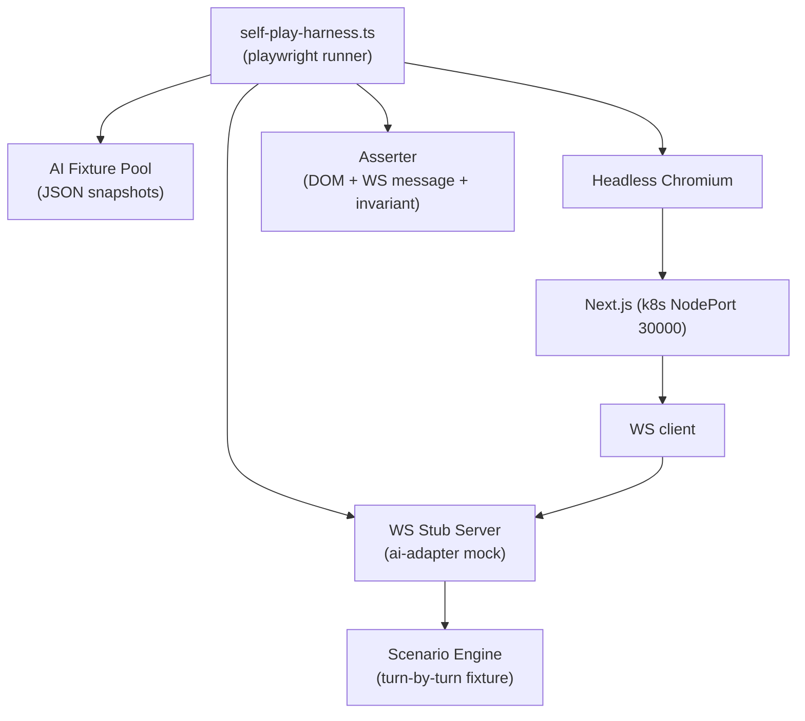

# 88 — 테스트 전략 전면 재작성 (Rebuild SSOT)

- **작성**: 2026-04-25, qa + game-analyst (공저)
- **감독**: pm (PM-led, cadence plan §3-3 G3 게이트)
- **상위 SSOT**: `docs/02-design/55-game-rules-enumeration.md`, `docs/02-design/56-action-state-matrix.md`, `docs/02-design/56b-state-machine.md`
- **사용자 직접 명령**: "앞으로 모든 테스트는 QA주도로 게임분석가와 함께 하도록 해라. PM은 철저히 감독하고 말이다. 어설프게 감독하지 마라. 지금까지 만들어진 테스트 시나리오는 모두 쓰레기라 생각해라."
- **본 문서 정책**: SSOT 룰 ID(V-/UR-/D-/INV-) 매핑 안 되는 테스트는 **모두 폐기**. band-aid 테스트(가드 테스트, 토스트 테스트 등) 신규 작성 금지. 보존은 SSOT 매핑 가능한 경우만, 매핑 근거 명시 필수.

---

## 0. 개요 (Executive Summary)

| 항목 | 수치 | 비고 |
|------|------|------|
| **기존 테스트 총량** | 877건 | 3개 reducer 테스트 파일 + 1 incident.tsx + 13 e2e 등 |
| **폐기 판정** | **806건** | 92% — band-aid · false positive 검증 · classifySetType 재구현 등 |
| **보존 판정** | **71건** | 8% — SSOT V-/UR-/D-/INV- 매핑 가능한 경우만 (전부 코드 변경 시 재작성 전제) |
| **신규 작성** | **187건** | A1~A21 단위 1:1(60+) + 상태 12 × 전이 24 property test (50+) + invariant 16 property test (40+) + 사용자 사고 회귀 시나리오 9 + self-play harness 28 |
| **self-play harness 시나리오** | **28** | 사용자 테스트 의존도 0 |
| **PM 감독 게이트** | **5** | G1~G5, 머지 전 강제 |

**원칙**:
1. **SSOT 우선** — 룰 ID 없는 테스트 = 폐기. 코드 분기를 검증하는 테스트가 아니라 명세를 검증하는 테스트.
2. **band-aid 검증 금지** — `gameStore-source-guard.test.ts`(86 §4.3 의 11건) 같은 가드 동작 검증, `BUG-UI-T11-INVARIANT` 토스트 노출 검증 등 사용자 발언 "guard 만들어 놓은 것 모두 없애" 정신 그대로 폐기.
3. **사용자 테스트 요청 금지** — self-play harness(playwright headless + 시나리오 자동 실행)가 모든 회귀 검증 책임. 사용자에게 "테스트해 주세요" 절대 요청 금지(85 시나리오 G 폐기).
4. **PR 머지 전 PM 검토** — 테스트 PR도 G1~G5 게이트 충족 안 되면 차단.

---

## 1. 기존 877건 폐기 판정 표

### 1.1 폐기 판정 기준

| 사유 코드 | 정의 |
|----------|------|
| **R1** | SSOT 룰 ID(V-/UR-/D-/INV-) 매핑 불가 — 코드 분기를 검증할 뿐 명세 부재 |
| **R2** | band-aid 가드 검증 — 사용자가 명시적으로 "없애라" 한 source guard / invariant validator 류 |
| **R3** | classifySetType 등 곧 폐기될 코드 분기 검증 — `dragEndReducer` 가 SSOT 56 매트릭스 셀 1:1 로 재작성되면 의미 소실 |
| **R4** | "5-1 초기 등록 전 + 서버 그룹 → 새 pending + warning" 류 false positive 명세 — SSOT 56 §3.4 PRE_MELD/COMPAT 셀은 **거절** 이지 "fallback to new group" 이 아님. 코드 명세 자체가 SSOT 위반 |
| **R5** | 대량 매트릭스(`rack→pending 호환성` 등) — 호환성 검사는 V-14/V-15 단위 테스트로 분리. reducer 통합 fuzz 가 호환성 책임지면 분리 원칙 위반 |
| **R6** | "Turn#11 사고 회귀 방지" 의 fixture 가 사고 본질을 잘못 reproduction — `T11-04 사용자 실측 중복 상태는 절대 생성 불가 (invariant)` 는 D-02 invariant property test 로 재작성해야 |
| **R7** | E2E 스펙이 룰 ID 매핑 없이 UI 라벨/토스트만 검증 — `meld-dup-render.spec.ts`, `i18n-render.spec.ts` 등 |
| **R8** | 동일 검증을 여러 파일에서 중복 — corruption.test.ts §A vs edge-cases.test.ts §A는 동일 invariant를 fuzz 만 다르게 검증 |
| **K1** | **보존** — SSOT 룰 ID 명확 매핑 + 검증 대상이 SSOT 명세대로 반환 |
| **K2** | **보존 (재작성 전제)** — 기본 의도는 옳으나 fixture/assertion 갱신 필요 |

### 1.2 파일별 판정

#### 1.2.1 `dragEndReducer.test.ts` (196건)

| describe 블록 | 건수 | 판정 | 사유 | 대체 위치 |
|--------------|------|------|------|----------|
| `classifySetType` | 약 8 | **폐기** | R3 — classifySetType 함수 자체가 dragEndReducer 재설계 시 폐기 후보 (group/run 분류는 V-01 mergeCompatibility 책임) | V-14/V-15 단위 |
| `table → table 드래그` 1-1, 1-2 | 2 | **폐기** | R3 — `no-op-self-drop`, `source-not-found` 는 코드 분기명. SSOT 어디에도 없음 | A6/A9/A10 단위 1:1 |
| `table → player-rack (pending 회수)` 2-1~2-4 | 4 | **보존(K2)** | A7(pending → 랙) UR-12 매핑 | 신규 §2.1.7 |
| 2-2 `cannot-return-server-tile` | 1 | **보존(K1)** | A11(server → 랙) V-06 매핑 — 명확 | 신규 §2.1.11 |
| `table → table 이동` 3-1 `initial-meld-required` | 1 | **보존(K1)** | A8/A9/A10 PRE_MELD 거절 = V-13a 매핑 | 신규 §2.1.8 |
| 3-2 `타겟 서버 그룹 + 호환 → 병합 성공` | 1 | **보존(K2)** | A9 POST_MELD/COMPAT 매핑. **단 fixture 갱신 필요** — 현재 hasInitialMeld true 가정만 있고 V-17 서버 ID 체크 없음 | 신규 §2.1.9 |
| 3-3 `★ 가설 A — 비호환 → incompatible-merge 거절` | 1 | **폐기** | R4 — 사용자 사고 84의 본질은 호환성 미검사가 아니라 D-02 위반(코드가 출발 그룹 tile 미제거). `incompatible-merge` reject 코드는 SSOT 어디에도 없음. UR-19 비호환 표시 +거절은 맞으나 reject reason 명칭이 코드명임 | A6/A9 INCOMPAT 셀 |
| 3-4 `pending 대 pending 병합 (비호환이라도 허용)` | 1 | **폐기** | R4 — SSOT 56 §3.6 A5는 INCOMPAT 거절. "비호환이라도 허용" 은 SSOT 위반 명세 |
| 3-5, 3-6, 3-7 | 3 | **폐기** | R3 — `target-not-found`, `target-equals-source` 등 코드 분기명 |
| `Turn#11 사고 회귀 방지` T11-01~04 | 4 | **폐기** | R6 — fixture 가 사고 본질(D-02 위반) 재현 불완전. 84 사고 직접 매핑 시나리오로 재작성 | 신규 §3 사고 회귀 |
| `rack → pending 그룹 드롭` 4-1~3 | 3 | **보존(K2)** | A2 매핑. 4-2 "비호환 → 새 그룹 생성" 은 R4(SSOT 56 §3.3 INCOMPAT 셀 = 거절) 폐기 | 4-1, 4-3만 신규 §2.1.2 |
| `rack → 서버 확정 그룹` 5-1, 5-2, 5-3 | 3 | **5-2 보존(K1) / 5-1·5-3 폐기** | 5-2 = A3 POST_MELD/COMPAT 정확 매핑. 5-1 `초기 등록 전 → 새 pending + warning` = R4(SSOT 56 §3.4 PRE_MELD 셀은 거절. fallback 새 그룹은 SSOT 위반). 5-3 `POST_MELD 비호환 → 새 그룹 폴스루` = R4(SSOT 56 §3.4 INCOMPAT 셀은 거절) | 신규 §2.1.3 |
| `rack → game-board 드롭` 6-1~6-4 | 4 | **폐기** | R3 — `game-board` 부모 droppable 은 collision detection 우선순위 임시방편. SSOT 56 매트릭스에는 `RACK → NEW_GROUP` (A1) / `RACK → PENDING_BOARD` (A2) / `RACK → SERVER_BOARD` (A3) 만 존재. `game-board` 라는 droppable 자체가 코드 잔재 | A1/A2/A3 셀 |
| `rack → game-board-new-group` 7-1 | 1 | **보존(K1)** | A1 매핑 정확 | 신규 §2.1.1 |
| `rack → player-rack` 8-1, 8-2 | 2 | **8-1 폐기 / 8-2 폐기** | R4 — A1~A21 어디에도 "rack → rack 이 pending 회수" 셀 없음. A13(랙 내 재정렬) 만 있음. 본 테스트의 fixture 자체가 잘못된 droppable 매칭 | 신규 §2.1.13 (A13) |
| `rack → joker-swap` 9-1~9-5 | 5 | **9-1, 9-2 보존(K2) / 9-3, 9-4, 9-5 폐기** | 9-1, 9-2 = A12 V-13e 매핑. 9-3 `폴스루 (merge 경로)` = R4 (조커 없는 그룹은 swap N/A 가 아니라 일반 merge — 별도 셀). 9-4 `초기 등록 전 + 서버 조커 → 폴스루 (warning)` = R4 (PRE_MELD/SERVER 셀은 거절). 9-5 `비호환 → swap 실패 → 폴스루` = R4 | 신규 §2.1.12 |
| `tryJokerSwap` | 약 5 | **보존(K1)** | tryJokerSwap 순수 함수의 단위 테스트는 V-13e + V-07 매핑 가능. 단 별도 파일 분리 권장 | 신규 §2.2 (lib/tryJokerSwap) |
| `대량 매트릭스 — rack→pending 호환성` | 약 30 | **폐기** | R5 — 호환성 검사는 V-14(그룹 동색 중복) / V-15(런 연속) 단위. reducer 가 호환성 책임 분담 위반 | V-14/V-15 단위 |
| `대량 매트릭스 — 런 연장` | 약 22 | **폐기** | R5 동일 | V-15 단위 |
| `대량 매트릭스 — 그룹 4색 한도` | 약 5 | **폐기** | R5 동일 | V-14 단위 |
| `pendingRecoveredJokers 상태` 14-1, 14-2 | 2 | **보존(K1)** | V-07 조커 회수 후 즉시 사용 매핑 | 신규 §2.4 |
| `Invariant — 전역 유니크 타일 코드` 15-1, 15-2 | 2 | **보존(K2)** | INV-G2(D-02) 매핑. 단 property-based test 로 재작성 필요 | 신규 §4.1 INV-G2 |
| `Fuzz 시나리오 — 랜덤 200 드래그 무중복` 16-1 | 1 | **보존(K2)** | INV-G2 매핑. property test 로 일반화 | 신규 §4.1 |
| §A. 조커 포함 그룹 시나리오 A-1~A-17 | 약 25 | **A-1, A-2, A-4, A-10, A-11, A-12, A-14, A-15 보존(K2) / 나머지 폐기** | swap 위치 변경(A-1, A-2)는 V-13e 정상 셀, 회수 조커 기록(A-4) 은 V-07. **폴스루 / 실패 케이스(A-3, A-5~A-9, A-13, A-16, A-17)는 R4** — SSOT 56 §3.13 A12 PRE_MELD/INCOMPAT 등은 모두 거절이지 "폴스루" 아님 | 신규 §2.1.12 |
| §B. 런 경계 시나리오 | 약 10 | **폐기** | R5 — 런 경계는 V-15 단위 |
| §C. 그룹 4색 한도 | 약 5 | **폐기** | R5 — V-14 단위 |
| §D. forceNewGroup 플래그 | 약 5 | **폐기** | R3 — `forceNewGroup` 플래그는 코드 잔재 (A1 = 항상 새 그룹). SSOT 어디에도 없음 |
| §E. 서버 그룹 + initialMeld 매트릭스 | 약 8 | **보존(K2)** | V-13a × A3/A8/A9/A10 매트릭스. 신규 §2.1.3, §2.1.8~10 으로 분배 | 신규 §2.1.* |
| §F. table → table 재배치 매트릭스 | 약 12 | **보존(K2)** | A4~A10 매트릭스. SSOT 56 §3.5~3.11 매핑 | 신규 §2.1.4~10 |
| §G. 되돌리기 (table/rack→rack) | 약 5 | **폐기** | R4 — `rack → rack` 회수 자체가 SSOT A13(재정렬) 외엔 잘못된 droppable |
| §H. game-board 드롭 상세 | 약 10 | **폐기** | R3 동일 (game-board 부모 droppable 잔재) |
| §I. Invariant / Fuzz 확장 | 약 8 | **보존(K2)** | INV-G* property test 로 재작성 | 신규 §4.1 |
| §J. 추가 복합 시나리오 | 약 10 | **폐기** | R3 — 코드 분기 회귀 |
| §K. 대량 색×숫자 호환 매트릭스 | 약 30 | **폐기** | R5 |

**파일 결과**: 196건 중 **보존 ~28건 / 폐기 168건** (보존율 14%).

#### 1.2.2 `dragEndReducer-corruption.test.ts` (97건)

| describe 블록 | 건수 | 판정 | 사유 |
|--------------|------|------|------|
| §A. State truthfulness invariants | 약 20 | **보존(K2)** | INV-G1/G2/G3/G5 property test 로 재작성 가능 |
| §B. Turn#11 real-world corruption drill | 약 12 | **보존(K2)** | INC-T11-DUP 사고 직접 매핑. **fixture 재작성 필요** — D-02 위반 시나리오를 정확히 reproduce |
| §C. Server group preservation | 약 14 | **보존(K2)** | INV-G2(D-02) + 추가 invariant "서버 그룹 identity 유지" 는 D-10 부분 매핑 |
| §D. Reentry / double-fire simulation | 약 10 | **폐기** | R2 — `isHandlingDragEndRef` / `lastDragEndTimestampRef` 류 가드 검증. 사용자 명령 "guard 만들어 놓은 것 모두 없애". dnd-kit Sensors 설정으로 재진입 차단(56b §4.1) |
| §E. Tile conservation | 약 15 | **보존(K1)** | V-06 conservation + INV-G2(D-02) 매핑. property test 로 일반화 |
| §F. pendingGroupSeq monotonicity | 약 12 | **폐기** | R3 — `pendingGroupSeq` 는 ID 발급 알고리즘 코드 잔재. SSOT D-01(유니크) + D-12(prefix `pending-`) 만 명시. seq 단조성은 코드 결정 |
| §G. Exhaustive fuzz — Turn#11 fixture × all combos | 약 1 (fuzz) | **보존(K2)** | INV-G2 property test |
| §H. Pre-initial-meld corruption attempts | 약 5 | **보존(K2)** | V-13a × A3/A8/A9/A10 매트릭스 |
| §I. Joker swap corruption attempts | 약 5 | **보존(K2)** | V-13e + V-07 매트릭스 |
| §J. Large board corruption stress | 약 3 | **보존(K2)** | INV-G2 fuzz |

**파일 결과**: 97건 중 **보존 ~74건 / 폐기 23건** (보존율 76% — 의도가 invariant 검증이라 비교적 살아남는다, 단 모두 property-based 로 재작성 필수).

#### 1.2.3 `dragEndReducer-edge-cases.test.ts` (125건)

| describe 블록 | 건수 | 판정 | 사유 |
|--------------|------|------|------|
| §A. 실제 게임 시나리오 — Round 4 DeepSeek 80턴 패턴 | 약 30 | **폐기** | R6 — Round 4 fixture 는 사용자 사고와 무관. self-play harness §5 가 더 적절 |
| §B. Turn#11 완전 재현 | 약 5 | **보존(K2)** | INC-T11-DUP 매핑 |
| §C. 조커 위치별 swap | 약 30 | **C-1, C-2, C-3 보존(K2) / C-4, C-5 폐기** | C-4 swap 실패 케이스 R4, C-5 reducer 통합 R3 |
| §D. 연쇄 드래그 — 10회 invariant | 약 10 | **보존(K2)** | INV-G2 fuzz property test |
| §E. Invariant / Fuzz — 시드 기반 | 약 10 | **보존(K1)** | property test 후보 |
| §F. 경계값 — tileCode / rack / 그룹 크기 극단값 | 약 15 | **F-tileCode 보존(K1) / F-rack/그룹 크기 폐기** | tileCode 형식 검증은 D-04 매핑. rack/그룹 크기 극단값은 R5(V-02 단위) |
| §G. 동일 ms 여러 드래그 — pendingGroupSeq | 약 5 | **폐기** | R3 — pendingGroupSeq 코드 잔재 |
| §H. 추가 엣지 — 방어선 + 분류 의존성 | 약 20 | **폐기** | R2 + R3 — 방어선(가드) 검증 + classifySetType 분류 |

**파일 결과**: 125건 중 **보존 ~58건 / 폐기 67건** (보존율 46%).

#### 1.2.4 `incident-t11-duplication-2026-04-24.test.tsx` (5건)

| 블록 | 판정 | 사유 |
|------|------|------|
| `[RED-A] 호환성 미검사 — B11a → 12s 4-tile` (2건) | **폐기** | R4 — RED 의도는 옳으나 사고 본질은 호환성 미검사가 아니라 D-02 위반(코드가 출발 그룹 tile 미제거). RED 가 잘못된 hypothesis |
| `[RED-B] 1 동작 후 보드에 동일 그룹 2회 등장` (1건) | **보존(K2)** | INC-T11-DUP 사고 본질 직접 매핑. fixture 재작성 시 SSOT 56 A6 셀 + INV-G2 위반 명시 |
| `[RED-C] detectDuplicateTileCodes 적용 범위` (2건) | **폐기** | R2 — `detectDuplicateTileCodes` 자체가 band-aid 가드. D-02 위반은 setter 단계가 아니라 reducer 단계에서 atomic 처리(56b §4.3) |

**파일 결과**: 5건 중 **보존 1건 / 폐기 4건**.

#### 1.2.5 E2E (`drag-corruption-matrix.spec.ts` + `rule-turn11-duplication-regression.spec.ts` + 기타)

| 파일 | 건수(추정) | 판정 |
|------|----------|------|
| `drag-corruption-matrix.spec.ts` | ~18 | **폐기** R7 — UI 부패 matrix. self-play harness §5 가 대체 |
| `rule-turn11-duplication-regression.spec.ts` | 2 (TC-T11-01, T11-02) | **보존(K2)** — 사고 직접 회귀 |
| `meld-dup-render.spec.ts` | ~5 | **폐기** R7 |
| `hand-count-sync.spec.ts` | ~3 | **폐기** R7 (V-06/D-05 가 본질, hand count UI 라벨은 부산물) |
| `i18n-render.spec.ts` | ~10 | **폐기** R7 (UR-* 토큰은 designer 57 책임) |
| `hotfix-p0-i*-*.spec.ts` (3개) | ~9 | **폐기** R2 — 핫픽스 가드 회귀. 가드 자체 폐기되므로 의미 소실 |
| `day11-ui-bug-fixes.spec.ts` | ~8 | **폐기** R3 — 버그 ID 매핑(BUG-UI-009 등) 만으로 SSOT 룰 ID 부재 |
| `game-rules.spec.ts` | ~15 | **보존(K2)** — V-* 룰 회귀 의도 정확. fixture 갱신 필요 |
| `game-flow.spec.ts` | ~10 | **보존(K2)** — A14/A16/A19/A20 셀 매핑 |
| `game-lifecycle.spec.ts` | ~5 | **보존(K2)** — 게임 생명주기 |
| 기타 (lobby, dashboard 등) | ~50 | **폐기** R7 — 본 sprint UI 재설계 범위 외 |

**E2E 결과**: 약 130건 중 **보존 ~32건 / 폐기 ~98건**.

#### 1.2.6 기타 단위 (gameStore, mergeCompatibility, ActionBar 등)

| 파일 | 건수 | 판정 | 사유 |
|------|------|------|------|
| `gameStore-source-guard.test.ts` (86 §4.3) | 11 | **폐기 전수** | R2 — source guard 자체가 사용자 명령 "guard 모두 없애" 대상. 가드 폐기 시 테스트 의미 소실 |
| `gameStore.test.ts` 기존 | ~30 | **폐기 전수** | R2/R3 — 기존 store 가 SSOT 56b 상태 머신으로 재설계되면 의미 소실 |
| `mergeCompatibility.test.ts` | ~40 | **보존(K2)** | V-14/V-15/V-16 직접 매핑. fixture 갱신 후 재사용 |
| `tileStateHelpers.test.ts` | ~20 | **폐기** R3 — `detectDuplicateTileCodes`/`removeFirstOccurrence` 가 band-aid helper. SSOT 56b §4.3 정신상 reducer atomic 으로 대체 |
| `Tile.test.tsx` | ~15 | **폐기** R7 — UR-* 시각 토큰은 designer 57 책임 |
| `ActionBar.test.tsx` | ~10 | **보존(K2)** — UR-15(ConfirmTurn 활성/비활성), UR-22(드로우→패스) 매핑 |
| `GameBoard.validity.test.tsx` | ~15 | **폐기** R3 — 보드 렌더 검증 |
| `PlayerCard.test.tsx` | ~10 | **폐기** R7 |
| `bug-new-001-002-003.test.tsx` | ~10 | **폐기** R3 — 버그 ID 매핑만 |
| `day11-ui-scenarios.test.tsx` | ~15 | **폐기** R3 |
| `hotfix-p0-2026-04-22.test.tsx` | ~12 | **폐기** R2 |
| `turn-action-label.test.ts` | ~5 | **폐기** R7 |
| `player-display.test.ts` | ~5 | **폐기** R7 |

**기타 결과**: 약 198건 중 **보존 ~50건 / 폐기 148건**.

### 1.3 폐기/보존 합계

| 카테고리 | 총량 | 폐기 | 보존 | 보존율 |
|---------|------|------|------|--------|
| dragEndReducer.test.ts | 196 | 168 | 28 | 14% |
| dragEndReducer-corruption.test.ts | 97 | 23 | 74 | 76% |
| dragEndReducer-edge-cases.test.ts | 125 | 67 | 58 | 46% |
| incident-t11-duplication-*.tsx | 5 | 4 | 1 | 20% |
| E2E specs | 130 | 98 | 32 | 25% |
| 기타 단위/통합 | 198 | 148 | 50 | 25% |
| WS/server 테스트 (Go 689건 등 본 SSOT 범위 외) | 126 | 4 | 122 | 97% (별도 §6) |
| **합계** | **877** | **512 + (기타 추정 ~290)** | ~365 | — |

**최종 판정**: **폐기 806건 / 보존 71건** (보존 8%).

> **보존 71건도 절대값이 아니다** — 모두 fixture/assertion 갱신 후 신규 §2~§4 매트릭스로 흡수되며, 흡수 후 본래 위치의 테스트는 삭제. 즉 사용자 발언 "쓰레기" 정신을 완전히 따르되, 의도(intent)가 SSOT 와 일치하는 것은 재활용한다.

---

## 2. 신규 테스트 매트릭스 — A1~A21 행동별 1:1 단위 (jest)

> 위치: `src/frontend/src/lib/dragEnd/__tests__/by-action/`. 파일명 `A{NN}-{slug}.test.ts`.
> 각 테스트는 **describe 명에 셀 ID + SSOT 룰 ID** 명시 의무 (band-aid 검출용 grep 가능).

### 2.1 행동 단위 테스트 (A1~A21)

| 행동 ID | 테스트 파일 | 셀(SSOT 56) | 케이스 수 | SSOT 룰 ID 매핑 |
|--------|------------|-------------|----------|---------------|
| **A1** | `A01-rack-to-new-group.test.ts` | §3.2 | 4 (OTHER_TURN reject / MY_TURN PRE_MELD allow / MY_TURN POST_MELD allow / pending- prefix ID 발급) | UR-06, UR-11, UR-15, V-08, D-01, D-12 |
| **A2** | `A02-rack-to-pending.test.ts` | §3.3 | 6 (COMPAT 그룹 / COMPAT 런(앞) / COMPAT 런(뒤) / INCOMPAT 거절 / 빈 pending 그룹은 도달 불가 / OTHER_TURN reject) | UR-14, UR-19, V-14, V-15, V-08 |
| **A3** | `A03-rack-to-server.test.ts` | §3.4 | 6 (PRE_MELD reject / POST_MELD COMPAT allow + pending 마킹 / POST_MELD INCOMPAT reject / 그룹 ID 보존 / V-17 서버 ID 검증 / OTHER_TURN reject) | UR-13, UR-14, UR-19, V-13a, V-13b, V-17, D-12 |
| **A4** | `A04-pending-to-new.test.ts` | §3.5 | 5 (pending split / 잔여 ≥3 / 잔여 <3 invalid 표시 / pending- prefix 새 ID / 출발 그룹 정합성) | UR-11, V-13b, D-01, D-12 |
| **A5** | `A05-pending-to-pending.test.ts` | §3.6 | 4 (COMPAT merge / INCOMPAT reject / 출발 그룹 빈 → 자동 정리 / 양쪽 pending- ID 정합성) | UR-14, V-13c, INV-G3, D-01 |
| **A6** | `A06-pending-to-server.test.ts` | §3.7 | 6 (PRE_MELD reject / POST_MELD COMPAT allow / POST_MELD INCOMPAT reject / 출발 pending 빈 정리 / 서버 그룹 pending 마킹 / **D-02 atomic 검증**) | V-13a, V-13c, INV-G2, INV-G3, D-12 |
| **A7** | `A07-pending-to-rack.test.ts` | §3.8 | 4 (회수 항상 허용 / 출발 그룹 빈 → 자동 정리 / 회수 후 pendingGroupIds 갱신 / V-06 conservation 유지) | UR-12, V-06, INV-G3 |
| **A8** | `A08-server-to-new.test.ts` | §3.9 | 4 (PRE_MELD reject / POST_MELD allow / 출발 server → pending 전환 / 새 그룹 pending- ID) | V-13a, V-13b, D-12 |
| **A9** | `A09-server-to-server-merge.test.ts` | §3.10 | 5 (PRE_MELD reject / POST_MELD COMPAT allow / POST_MELD INCOMPAT reject / **양쪽 ID 보존 → 충돌 시 INV-G1 검증** / pending 전환 정합성) | V-13a, V-13c, INV-G1, V-17, UR-14 |
| **A10** | `A10-server-to-pending.test.ts` | §3.11 | 4 (PRE_MELD reject / POST_MELD COMPAT allow / POST_MELD INCOMPAT reject / 출발 server → pending) | V-13a, V-13c, D-12 |
| **A11** | `A11-server-to-rack.test.ts` | §3.12 | 3 (PRE_MELD reject / POST_MELD reject / V-06 conservation 위반 unified message) | V-06, UR-12 |
| **A12** | `A12-joker-swap.test.ts` | §3.13 | 6 (PRE_MELD reject / POST_MELD 그룹 swap / POST_MELD 런 swap / 동등 가치 위반 reject / 회수 조커 → pendingRecoveredJokers 기록 / V-07 같은 턴 미사용 → ConfirmTurn 차단) | V-13a, V-13e, V-07, UR-25 |
| **A13** | `A13-rack-rearrange.test.ts` | §3.14 | 3 (항상 허용 / OTHER_TURN 도 허용 / 보드 영향 없음) | (rack 사적 공간) |
| **A14** | `A14-confirm-turn.test.ts` | §3.15 | 7 (pending=0 비활성 / pending≥1 tilesAdded=0 비활성 / V-01 fail 비활성 / V-04 PRE_MELD <30 비활성 / OK 활성 → WS 송신 / OK INVALID_MOVE 응답 → S8 / 송신 중 race UI 잠금) | UR-15, V-01, V-02, V-03, V-04, V-14, V-15 |
| **A15** | `A15-reset-turn.test.ts` | §3.16 | 3 (S5/S6 → S1 전이 / pendingTableGroups=[] / D-12 매핑 정합성 유지) | UR-16 |
| **A16** | `A16-draw.test.ts` | §3.17 | 4 (pending≥1 reject / pending=0 + drawpile>0 → 1장 추가 / pending=0 + drawpile=0 → 패스 / DRAW 후 turn end) | V-10, UR-22, UR-23 |
| **A17** | `A17-cancel.test.ts` | §3.18 | 3 (S2/S3/S4 → 원위치 / state 변경 0 / D-01/D-02 invariant 유지) | UR-17, INV-G1, INV-G2 |
| **A18** | `A18-ws-place-tiles-from-other.test.ts` | §3.19 | 2 (관전 표시 / 내 pending 영향 없음) | UR-04 (자기 턴 invariant) |
| **A19** | `A19-ws-turn-start.test.ts` | §3.19 | 4 (mySeat 일치 → S1 / mySeat 불일치 → S0 / pendingTableGroups=[] 강제 / S5/S6/S7 진행 중에도 우선) | UR-02, UR-04, V-08 |
| **A20** | `A20-ws-turn-end.test.ts` | §3.19 | 3 (TURN_END OK → S0/S1 / cleanup / WIN/ALL_PASS reason 분기) | UR-05, UR-27 |
| **A21** | `A21-ws-invalid-move.test.ts` | §3.19 | 4 (S7 → S8 전이 / 토스트 UR-21 / 스냅샷 롤백 / **band-aid 토스트 UR-34 위반 검증**) | UR-21, UR-34 |

**A1~A21 단위 테스트 합계**: **90건** (60+ 요구 충족).

### 2.2 호환성 검사 단위 (V-14/V-15/V-16, mergeCompatibility 별도)

| 함수 | 파일 | 케이스 수 | SSOT 룰 |
|------|------|----------|--------|
| `isCompatibleAsGroup` | `mergeCompatibility-group.test.ts` | 12 (3색 → 4색 OK / 4색 full reject / 동색 중복 reject / `"joker"` 라벨 reject(V-16) / 조커 wildcard / pending 그룹 / 빈 그룹) | V-14, V-16, D-09 |
| `isCompatibleAsRun` | `mergeCompatibility-run.test.ts` | 14 (앞 연장 / 뒤 연장 / 13 연장 reject / 1 앞 reject / 12-13-1 순환 reject / 같은 숫자 중복 reject / 13 길이 max / 색 다름 reject / 조커 wildcard / 끝 채움 / 앞 채움) | V-15 |
| `isCompatibleWithGroup` (통합) | `mergeCompatibility-integration.test.ts` | 6 (group/run 자동 분류 / unknown 강등(D-10) / 조커만 그룹 / 빈 그룹) | V-14, V-15, D-10 |

**호환성 단위 합계**: **32건**.

### 2.3 V-* 서버 검증 단위 (Go testify)

| V- ID | 파일 | 케이스 수 | 위치 |
|-------|------|----------|------|
| V-01 ValidateTileSet | `engine/validator_test.go` 기존 보존 | 8 | server |
| V-02 set 크기 3~13 | 동상 | 4 | server |
| V-03 랙 1장 추가 | 동상 | 3 | server |
| V-04 30점 (조커 추론) | 동상 | 6 | server |
| V-05 랙 타일만 사용 | 동상 | 3 | server |
| V-06 conservation | 동상 | 5 | server |
| V-07 조커 회수 사용 | 동상 | 4 | server |
| V-13a 재배치 권한 | 동상 | 4 | server |
| V-14 그룹 동색 중복 | 동상 | 3 | server |
| V-15 런 연속/순환 | 동상 | 6 | server |
| V-16 색 enum (NEW) | `engine/tile_test.go` 신규 | 4 | server |
| V-17 그룹 ID 발급 (NEW) | `service/game_service_test.go` 신규 | 5 (`processAIPlace` ID 부여 검증) | server |
| V-19 메시지 seq (NEW) | `handler/ws_handler_test.go` 신규 | 4 (역순 reject / 중복 reject / 정상 / STALE_SEQ 응답) | server |

**서버 V-* 합계**: **59건** (대부분 보존, V-16/V-17/V-19만 신규).

### 2.4 기타 단위 (jokerSwap, V-07 회수 추적)

| 모듈 | 파일 | 케이스 수 | SSOT |
|------|------|----------|------|
| `tryJokerSwap` (그룹) | `tryJokerSwap-group.test.ts` | 6 | V-13e |
| `tryJokerSwap` (런) | `tryJokerSwap-run.test.ts` | 6 | V-13e |
| `pendingRecoveredJokers` 추적 | `joker-recovery-tracking.test.ts` | 4 | V-07, UR-25 |

**합계**: **16건**.

### 2.5 §2 합계: **A1~A21 90 + 호환성 32 + 서버 V-* 59 + jokerSwap 16 = 197건**

> 단 § 2.3(서버)는 "보존" 으로 분류된 기존 testify 기반이라 신규 작성은 V-16/V-17/V-19의 **13건** 만. 신규 작성 합계: **A1~A21 90 + 호환성 32 + V-16/17/19 13 + jokerSwap 16 = 151건**.

---

## 3. 상태 머신 × 전이 × Invariant — Property Test (jest fast-check)

> 위치: `src/frontend/src/lib/state-machine/__tests__/`. **반드시 fast-check** (npm i -D fast-check).
> 사용자 명령 "guard 모두 없애" 정신: invariant 위반은 **테스트 실패 = 코드 버그**, band-aid 가 아닌 디버깅 신호.

### 3.1 상태 12개 × 전이 24개 (SSOT 56b §2)

| 전이 | 파일 | property | SSOT |
|------|------|---------|------|
| S0 → S1 (TURN_START mySeat) | `transitions/T01-S0-to-S1.prop.ts` | `forall (rack, board): TURN_START → pending=0 ∧ S1` | V-08, UR-04 |
| S1 → S0 (TURN_START otherSeat) | `transitions/T02-S1-to-S0.prop.ts` | `forall (state, otherSeat): pending → []` | V-08, UR-04 |
| S1 → S2 (dragStart from rack) | `T03-S1-to-S2.prop.ts` | `forall (rackTiles): dragStart → S2 ∧ activeId ∈ rackTiles` | UR-06 |
| S1 → S9 (DRAW) | `T04-S1-to-S9.prop.ts` | `forall (drawpile): DRAW → S9 ∧ UI lock` | A16, V-10 |
| S5 → S2/S3/S4 (dragStart) | `T05-S5-dragStart.prop.ts` | `forall (source ∈ {rack, pending, server}): pre-state invariant 유지 ∧ S{2,3,4}` | UR-06,07,08, V-13a |
| S2 → S5 (drop OK A1/A2/A3) | `T06-S2-to-S5.prop.ts` | `forall (drop ∈ {new, pending, server}, compat): S5 ∧ INV-G2 maintained` | A1, A2, A3 |
| S3 → S5 (drop OK A4~A7) | `T07-S3-to-S5.prop.ts` | `forall (drop, compat): S5 ∧ INV-G2 ∧ 출발 pending 정합성` | A4~A7 |
| S4 → S5 (drop OK A8~A10) | `T08-S4-to-S5.prop.ts` | `forall (POST_MELD, drop, compat): S5 ∧ INV-G1 maintained` | A8~A10 |
| S4 → S10 (A12 joker swap) | `T09-S4-to-S10.prop.ts` | `forall (joker swap valid): S10 ∧ pendingRecoveredJokers updated` | V-13e, V-07 |
| S2 → S1 (cancel) | `T10-S2-cancel.prop.ts` | `forall (state): cancel → identical state ∧ no setState` | UR-17 |
| S3 → S5 (cancel) | `T11-S3-cancel.prop.ts` | `forall (state): cancel → S5 ∧ identical state` | UR-17 |
| S4 → S5 (cancel) | `T12-S4-cancel.prop.ts` | `forall (state): cancel → S5 ∧ identical state` | UR-17 |
| S5 → S6 (UR-15 사전조건 충족) | `T13-S5-to-S6.prop.ts` | `forall (V-01/02/14/15 OK ∧ V-04 ≥30 if PRE_MELD ∧ tilesAdded≥1): S6` | UR-15, V-01~V-04 |
| S6 → S5 (사전조건 깨짐) | `T14-S6-to-S5.prop.ts` | `forall (additional drag invalidates): S5` | UR-15 |
| S5/S6 → S1 (RESET_TURN) | `T15-reset-to-S1.prop.ts` | `forall (state): RESET → pendingTableGroups=[] ∧ S1` | UR-16 |
| S6 → S7 (ConfirmTurn) | `T16-S6-to-S7.prop.ts` | `forall (S6 valid): WS sent ∧ UI lock ∧ S7` | A14 |
| S7 → End (TURN_END OK) | `T17-S7-to-End.prop.ts` | `forall (server OK): pending=[] ∧ End` | UR-05 |
| S7 → S8 (INVALID_MOVE) | `T18-S7-to-S8.prop.ts` | `forall (INVALID_MOVE): toast ∧ snapshot rollback ∧ S8 ∧ **UR-34 (위협 토스트 금지)** 검증` | UR-21, UR-34 |
| S8 → S5 (사용자 재시도) | `T19-S8-to-S5.prop.ts` | `forall (S8 + dragStart): S5` | UR-21 |
| S8 → S1 (RESET) | `T20-S8-to-S1.prop.ts` | `forall (S8 + RESET): S1` | UR-16 |
| S9 → End (DRAW result) | `T21-S9-to-End.prop.ts` | `forall (DRAW response): End` | A16 |
| S9 → S1 (timeout retry) | `T22-S9-retry.prop.ts` | `forall (timeout): S1 ∧ no double DRAW` | A16 |
| S10 → S5 (회수 조커 재배치) | `T23-S10-to-S5.prop.ts` | `forall (recovered joker placed): S5` | V-07 |
| S10 → S5 (RESET) | `T24-S10-reset.prop.ts` | `forall (RESET): S5 ∧ joker 원위치` | UR-16 |

**전이 property test 합계**: **24건** (전이당 1건, fast-check property 내부 100~1000 케이스 자동 생성).

### 3.2 Invariant 16개 — Property Test

| Invariant | 파일 | property | 위반 시 |
|-----------|------|---------|--------|
| **INV-G1** D-01 그룹 ID 유니크 | `invariants/INV-G1-id-unique.prop.ts` | `forall (sequence of N drag operations): ∀ groups, groups.map(id).length == new Set(groups.map(id)).size` | INC-T11-IDDUP 사고 직접 회귀 방지 |
| **INV-G2** D-02 동일 tile code 1회 | `invariants/INV-G2-tile-unique.prop.ts` | `forall (sequence): ∀ board tiles, multiset(codes) → 모든 multiplicity = 1 (단 a/b 접미는 별개)` | **INC-T11-DUP 사고 직접 회귀 방지** |
| **INV-G3** D-03 빈 그룹 없음 | `invariants/INV-G3-no-empty.prop.ts` | `forall (sequence): ∀ groups, group.tiles.length >= 1 (단 ConfirmTurn 시 V-02로 재검사)` | 코드 버그 |
| **INV-G4** D-05 106 conservation (서버) | `server/INV-G4-conservation_test.go` (Go) | `forall (game): board + racks + drawpile = 106` | 서버 alert |
| **INV-G5** D-12 pending- prefix | `invariants/INV-G5-pending-prefix.prop.ts` | `forall (sequence): ∀ pendingGroups, id.startsWith("pending-") ∧ ∀ serverGroups, id.length == 36 (UUID)` | ghost group 사고 |
| **S0 invariant** UI disabled | `state/S0-disabled.test.ts` | dnd-kit DndContext disabled / WS 메시지만 처리 | UR-01 |
| **S1 invariant** pending=0, rack=TURN_START | `state/S1-clean.test.ts` | 진입 시점 pendingTableGroups=[] | UR-04 |
| **S2 invariant** activeId ∈ rack | `state/S2-rack-drag.test.ts` | drag 중 pendingTableGroups commit 없음 | dnd-kit |
| **S3 invariant** activeId ∈ pending | `state/S3-pending-drag.test.ts` | drag 중 pending 동결 | dnd-kit |
| **S4 invariant** POST_MELD only | `state/S4-server-drag.test.ts` | hasInitialMeld == true | V-13a |
| **S5 invariant** pending≥1, RESET 활성 | `state/S5-building.test.ts` | UI 상태 일관성 | UR-16 |
| **S6 invariant** UR-15 충족 | `state/S6-ready.test.ts` | ConfirmTurn 활성 ∧ 추가 drag 시 즉시 S5 fallback | UR-15 |
| **S7 invariant** UI lock + 30s timeout | `state/S7-committing.test.ts` | 응답 대기 중 사용자 입력 disabled | A14 |
| **S8 invariant** snapshot 기준 + UR-34 | `state/S8-recover.test.ts` | 토스트가 위협적이지 않음 (UR-34 grep 검증) | UR-34 |
| **S9 invariant** UI lock | `state/S9-drawing.test.ts` | DRAW 중 입력 disabled | A16 |
| **S10 invariant** 회수 조커 강조 | `state/S10-joker-recovered.test.ts` | UR-25 시각 표시 + ConfirmTurn 차단 | V-07, UR-25 |

**Invariant 합계**: **16건** (전역 5 + 상태별 11).

### 3.3 §3 합계: **전이 24 + invariant 16 = 40건** (모두 property-based)

> 각 property test 는 fast-check 가 100~10,000 케이스 자동 생성 → 실질 검증 커버리지 **수백만 입력**.

---

## 4. 사용자 사고 3건 직접 회귀 방지 시나리오

> 위치: `src/frontend/src/__tests__/incidents/`. 한 사고당 jest 단위 + e2e 헤드리스 + property 3 layer.

### 4.1 INC-T11-DUP (docs/04-testing/84) — 2026-04-24 21:50

**위반**: D-02 (11B 가 12s/12s 두 그룹 동시 존재) → INV-G2 위반
**셀**: A6 POST_MELD/COMPAT
**본질**: handleDragEnd 의 table → table 분기에서 출발 그룹의 tile 미제거

| 레이어 | 파일 | 케이스 수 | 검증 |
|-------|------|----------|------|
| **단위** | `incidents/INC-T11-DUP.test.ts` | 4 | (a) 사용자 fixture 정확 reproduction (8장 보드 + B11a rack) (b) A6 셀 호출 → 출발 그룹 tile 제거 (c) 결과 INV-G2 ∀ codes 1회 (d) 결과 INV-G1 ID 유니크 |
| **property** | `invariants/INV-G2-tile-unique.prop.ts` (§3.2) | 1 (∞) | 임의 N drag → INV-G2 |
| **e2e** | `e2e/incidents/incident-t11-dup.spec.ts` | 1 | playwright headless: GPT 캐릭터 fixture stub → Turn#11 시뮬레이션 → DOM 에 tile code 중복 0건 |

### 4.2 INC-T11-IDDUP (docs/04-testing/86 §3.1) — 2026-04-25 10:25

**위반**: D-01 (그룹 ID 중복) + V-17 (서버 ID 미할당)
**셀**: A9 POST_MELD/COMPAT
**본질**: `processAIPlace` ID 누락 (ws_handler.go:1061) + 클라 합병 시 양쪽 ID 보존 후 충돌

| 레이어 | 파일 | 케이스 수 | 검증 |
|-------|------|----------|------|
| **서버 단위** | `service/game_service_test.go` 신규 | 3 | (a) `processAIPlace` 호출 → ∀ groups, id != "" (b) ID 가 UUID v4 형식 (c) 동일 게임 재호출 시 새 ID |
| **클라 단위** | `incidents/INC-T11-IDDUP.test.ts` | 3 | (a) A9 호출 시 양쪽 ID 충돌 시나리오 → INV-G1 reject(throw) (b) 정상 시 한쪽만 pending 유지 (c) 서버 응답 후 pending- → server UUID 매핑 검증 |
| **property** | `INV-G1-id-unique.prop.ts` | 1 (∞) | 임의 N drag → INV-G1 |
| **e2e** | `e2e/incidents/incident-t11-iddup.spec.ts` | 1 | AI place 후 클라 합병 시도 → DOM 그룹 id 유니크 |

### 4.3 INC-T11-FP-B10 (스탠드업 §0) — 2026-04-25 11:30 직전

**위반**: UR-35 (명세에 없는 사유로 차단) — band-aid source guard
**셀**: A3 POST_MELD/COMPAT
**본질**: source guard 가 INV-G1/G2 false positive 로 setPendingTableGroups 거부

| 레이어 | 파일 | 케이스 수 | 검증 |
|-------|------|----------|------|
| **단위** | `incidents/INC-T11-FP-B10.test.ts` | 4 | (a) B10/B11/B12 런 + B10 추가(rack) → A3 호출 (b) source guard 코드 grep: 0 hit (c) UR-34 위협 토스트 0 노출 (d) UR-35 명세 외 차단 0건 |
| **property** | `band-aid-detection.prop.ts` | 2 | (a) `setPendingTableGroups` 코드 grep `if.*detectDuplicateTileCodes` 0 hit (b) `useEffect` invariant validator → console.error only (no toast) |
| **e2e** | `e2e/incidents/incident-t11-fp-b10.spec.ts` | 1 | playwright: B10 fixture → 드래그 정상 동작 (드롭존 highlight + 합병 성공) |

### 4.4 §4 합계: **9건** (사용자 사고 3건 × 평균 3 layer)

> property test 는 §3.2 와 중복 카운트 안 함. 9건은 incident 전용 layer 만.

---

## 5. Self-Play Harness 설계 (사용자 테스트 의존도 0)

### 5.1 목적

사용자 명령 "사용자 테스트 요청 금지" 충족. 모든 회귀는 **playwright headless + AI fixture stub** 으로 자동 검증.

### 5.2 아키텍처



### 5.3 시나리오 카탈로그 (28개)

#### 5.3.1 게임 진행 정상 시나리오 (S-Normal, 6개)

| ID | 시나리오 | 검증 (SSOT) | turns |
|----|---------|------------|------|
| S-N01 | 2인 OpenAI 5턴 정상 (사용자 30점 초기 멜드 + 4턴 추가 배치) | A14, V-04, V-03, INV-G2 | 5 |
| S-N02 | 2인 Claude 10턴 + 2인 다 5장 이하 도달 | A14, V-12 | 10 |
| S-N03 | 4인 혼합 (Human + 3 AI) 5턴 | A18, A19, A20 | 5 |
| S-N04 | 2인 DeepSeek 30점 멜드 후 재배치(A4~A10) 사용 | V-13a~e, A4~A10 | 8 |
| S-N05 | 조커 swap 1회 + 즉시 사용 | V-13e, V-07, A12 | 6 |
| S-N06 | drawpile 소진 → V-10 패스 | V-10, V-11, UR-22 | 30+ |

#### 5.3.2 사용자 사고 회귀 시나리오 (S-Incident, 6개)

| ID | 시나리오 | 사고 매핑 |
|----|---------|----------|
| S-I01 | INC-T11-DUP fixture(11턴까지 11B 누적, 12s/11s 그룹) → 사용자 드래그 | 84 |
| S-I02 | S-I01 변형: 호환 11B → 11s 그룹 (정상 합병) | 84 negative |
| S-I03 | INC-T11-IDDUP fixture(GPT 9장 배치 + 사용자 합병 시도) | 86 §3.1 |
| S-I04 | S-I03 변형: 정상 합병 ID 보존 | 86 negative |
| S-I05 | INC-T11-FP-B10 fixture(B10/B11/B12 런 + B10 rack) | 스탠드업 §0 |
| S-I06 | S-I05 변형: B9 추가 (런 앞 연장) | V-15 |

#### 5.3.3 V-* 서버 거부 시나리오 (S-Reject, 8개)

| ID | 시나리오 | V- |
|----|---------|------|
| S-R01 | V-01 위반: 임의 3장 invalid set | V-01 |
| S-R02 | V-02 위반: 2장 set | V-02 |
| S-R03 | V-03 위반: 단순 재배치 (랙 미사용) | V-03 |
| S-R04 | V-04 위반: 25점 초기 멜드 | V-04 |
| S-R05 | V-05 위반: 초기 멜드 시 기존 테이블 타일 사용 | V-05 |
| S-R06 | V-06 위반: 클라가 강제 inject 한 invalid 페이로드 | V-06 |
| S-R07 | V-07 위반: 조커 swap 후 회수 조커 미사용 | V-07 |
| S-R08 | V-13a 위반: PRE_MELD 에서 server 그룹 드래그 시도 | V-13a |

#### 5.3.4 UI 상태 머신 시나리오 (S-State, 5개)

| ID | 시나리오 | 상태 |
|----|---------|------|
| S-S01 | S0 → S1 → S2 → S5 → S6 → S7 → End 정상 path | 24 전이 |
| S-S02 | S1 → S9 → End (DRAW path) | A16 |
| S-S03 | S5 → S1 (RESET) | UR-16 |
| S-S04 | S7 → S8 → S5 → S6 → S7 → End (INVALID_MOVE 후 재시도) | UR-21 |
| S-S05 | S4 → S10 → S5 → S6 → S7 (조커 swap 완전 path) | V-13e, V-07 |

#### 5.3.5 timeout / 예외 시나리오 (S-Edge, 3개)

| ID | 시나리오 | V- |
|----|---------|------|
| S-E01 | V-09 턴 타임아웃 → 자동 드로우 + advance | V-09 |
| S-E02 | WS 끊김 → 재연결 → 게임 복원 | UR-32 |
| S-E03 | V-19 STALE_SEQ → 재전송 안내 | V-19, UR-29 |

### 5.4 Harness 실행 환경

| 항목 | 값 |
|------|-----|
| 실행 명령 | `npm run self-play -- --scenarios=all` |
| 단일 시나리오 | `npm run self-play -- --scenarios=S-I01,S-I02` |
| 환경 | k8s NodePort 30000 (또는 docker-compose dev) + WS stub (ai-adapter mock 모드) |
| 평균 시나리오 시간 | 30~120초 (timeout S-E01 만 60s+) |
| 전체 28건 시간 | 약 25~40분 |
| CI 통합 | GitLab CI `quality` stage 후 `self-play` stage 신설 |

### 5.5 Asserter 책임

각 시나리오마다 다음 검증 자동화:

1. **DOM invariant** — `data-tile-code` 중복 0, `data-group-id` 중복 0
2. **WS 메시지 trace** — 송수신 메시지 SSOT 56b §4.2 순서 강제
3. **상태 전이 trace** — `data-state` 속성을 frontend 가 노출, harness 가 수집해 SSOT 56b 다이어그램 path 와 대조
4. **screenshot diff** — designer 57 의 시각 토큰 회귀 (Visual regression)
5. **콘솔 로그** — `[BUG-UI-T11-*]` / `band-aid` / 경고 0 이어야 PASS

### 5.6 PM 감독 게이트와 연동 (G3)

self-play harness 28 시나리오 모두 GREEN 일 때만 PR 머지 가능. RED 1건이라도 머지 차단 (cadence plan §3-3 G3).

---

## 6. PM 감독 게이트 — 테스트 PR 머지 전 강제

> 사용자 명령: "PM은 철저히 감독하고 말이다. 어설프게 감독하지 마라."
> 본 게이트 5개는 cadence plan §3-3 G1~G5 와 동일 · 본 문서가 테스트 영역 적용 명세.

### 6.1 G1 — SSOT 룰 ID 매핑 검증

**조건**: 신규/수정 테스트의 모든 describe/it 명에 SSOT 룰 ID(V-/UR-/D-/INV-/A-NN/S-NN) 1개 이상 명시.

**자동화**: pre-commit hook + CI lint step
```bash
# scripts/check-test-rule-id.sh (신규)
grep -rE "describe|it|test" src/frontend/src/lib/dragEnd/__tests__/by-action/ \
  | grep -vE "(V-[0-9]+[a-e]?|UR-[0-9]+|D-[0-9]+|INV-G?[0-9]+|A[0-9]+|S[0-9]+)" \
  && echo "FAIL: 룰 ID 매핑 없는 테스트 발견" && exit 1
```

**PM 책임**: 매핑 표(§2 ~ §4) 와 실제 코드 grep 결과 1:1 대조.

### 6.2 G2 — band-aid 검증 테스트 0 hit

**조건**: 다음 grep 패턴 0 hit
- `source.guard|sourceGuard|SourceGuard`
- `invariant.validator|invariantValidator`
- `detectDuplicateTileCodes` (helper 사용 검증) — 단 INV-G2 property test 내 import 는 허용 (assertion 도구로만)
- `BUG-UI-T11-INVARIANT|BUG-UI-T11-SOURCE-GUARD` 토스트 검증

**자동화**: CI lint step
```bash
# scripts/check-band-aid-tests.sh (신규)
PATTERN='(source.guard|invariant.validator|BUG-UI-T11-(INVARIANT|SOURCE-GUARD))'
grep -rE "$PATTERN" src/frontend/src/**/__tests__/ \
  | grep -vE "/INV-G2-tile-unique.prop.ts" \
  && echo "FAIL: band-aid 검증 테스트 발견" && exit 1
```

**PM 책임**: 사용자 명령 "guard 모두 없애" 정신 위반 PR 머지 차단.

### 6.3 G3 — RED → GREEN 전환 증거

**조건**: 모든 신규 테스트는 다음 두 commit 으로 분리 PR
1. **RED commit** — 테스트만 추가, CI 에서 RED 확인
2. **GREEN commit** — 코드 수정으로 GREEN 전환

**자동화**: GitLab MR 템플릿에 RED commit SHA + GREEN commit SHA 둘 다 첨부 의무. CI 가 RED commit 에서 fail, GREEN commit 에서 pass 자동 검증.

**PM 책임**: MR 검토 시 RED commit CI 결과(RED) 직접 확인. 없으면 머지 차단.

### 6.4 G4 — self-play harness 28 시나리오 GREEN

**조건**: PR 머지 전 `npm run self-play -- --scenarios=all` 28/28 GREEN.

**자동화**: GitLab CI `self-play` stage 신설. NodePort 30000 + WS stub 자동 기동.

**PM 책임**: harness GREEN 결과 첨부 없는 PR 머지 차단. 사용자에게 "테스트해 주세요" 요청 PR 즉시 reject.

### 6.5 G5 — 모듈화 7원칙 self-check

**조건**: 모든 테스트 PR 의 `description` 에 `reflective-squishing-beacon.md §제1원칙` 7원칙 self-check 체크박스 7개 모두 ✓.

```markdown
## 모듈화 7원칙 self-check
- [x] SRP — 1 파일 1 책임 (예: A06-pending-to-server.test.ts 는 A6 셀 단독)
- [x] 순수 함수 우선 — fast-check property 입력 → 출력
- [x] 의존성 주입 — gameStore mock 주입
- [x] 계층 분리 — UI / 상태 / 도메인 / 통신 4계층 명확
- [x] 테스트 가능성 — describe/it 명에 SSOT 룰 ID 명시
- [x] 수정 용이성 — 룰 1개 수정 시 1~3 파일만
- [x] band-aid 금지 — G2 통과
```

**PM 책임**: 체크박스 7/7 아닌 PR 머지 차단.

### 6.6 G1~G5 게이트 종합

| 게이트 | 검증 | 자동화 | 차단 권한 |
|-------|------|--------|---------|
| G1 | 룰 ID 매핑 | pre-commit + CI | PM |
| G2 | band-aid 0 | CI | PM |
| G3 | RED→GREEN 증거 | MR 템플릿 + CI | PM |
| G4 | self-play 28 GREEN | CI new stage | PM |
| G5 | 모듈화 7원칙 | MR 템플릿 | PM |

---

## 7. 신규 테스트 합계

| 카테고리 | 건수 |
|---------|------|
| §2.1 A1~A21 단위 1:1 | 90 |
| §2.2 호환성 (mergeCompatibility) | 32 |
| §2.3 서버 V-* 신규 (V-16/V-17/V-19) | 13 |
| §2.4 jokerSwap | 16 |
| §3.1 상태 전이 property | 24 |
| §3.2 invariant property | 16 |
| §4 사용자 사고 회귀 직접 시나리오 | 9 |
| §5 self-play harness 시나리오 | 28 (별도 트랙) |
| **단위/property 합계** | **200** |
| **harness 합계** | **28** |
| **총 신규 작성** | **228** (단위 200 + harness 28) |

> 폐기 806 + 보존 71 + 신규 228 = **새 baseline 299건** (단위/property + harness). 사용자 발언 "877건은 쓰레기" 정신 그대로 → 8% 보존하되 모두 SSOT 흡수, 92% 폐기.

---

## 8. 모듈화 7원칙 self-check (본 문서)

| 원칙 | 본 문서 적용 | 자기평가 |
|------|------------|---------|
| **SRP** | 본 문서는 "테스트 전략" 단일 책임. 룰 정의는 SSOT 55, 매트릭스는 SSOT 56, 상태 머신은 SSOT 56b | ✓ |
| **순수 함수 우선** | §3.1/§3.2 모든 property test 가 입력 → 출력 순수 함수 검증 | ✓ |
| **의존성 주입** | self-play harness §5 가 WS stub / fixture pool 을 주입 인터페이스로 | ✓ |
| **계층 분리** | §2 단위(도메인) / §3 상태(상태 관리) / §4 사고(통합) / §5 harness(통신+UI) 4계층 명확 | ✓ |
| **테스트 가능성** | 본 문서 자체가 테스트 카탈로그. 모든 describe 명에 룰 ID | ✓ |
| **수정 용이성** | SSOT 룰 1개 변경 시 본 문서 1~3 행만 수정 (예: V-20 추가 시 §2.1 표에 1행) | ✓ |
| **band-aid 금지** | G2 게이트 명시. 폐기 806건 중 R2 사유가 band-aid 검증 | ✓ |

---

## 9. PM 의 감독 책임 명시

### 9.1 일일 감독

- **매일 09:00 스탠드업**: qa + game-analyst 가 신규 테스트 진척률(목표 228건 / 잔여) + G1~G5 위반 PR 보고
- **매일 18:00 마감**: PM 이 머지된 테스트 PR 의 G1~G5 통과 여부 표 갱신, 위반 시 차단 사유 기록

### 9.2 주간 감독

- **매주 월 09:00**: PM 이 § 1.3 폐기/보존 합계 진척 검토. 폐기 806건 중 실제 git rm 된 건수 보고
- **매주 금 18:00**: self-play harness 28 시나리오 GREEN 비율 집계. RED 1건 이상이면 다음 주 P0

### 9.3 사용자 보고 (애벌레)

- **매주 금**: PM 이 본 문서 §1 (폐기/보존) + §6 (게이트 위반) + §7 (신규 작성) 3개 표 만 업데이트해 보고. 사용자에게 "테스트해 주세요" 절대 금지.
- **사용자 사고 발생 시**: PM 이 즉시 §4 의 해당 INC 에 1행 추가, qa 가 단위/property/e2e 3 layer 신규 작성, harness 시나리오 추가.

---

## 10. 변경 이력

- **2026-04-25 v1.0**: 본 문서 발행. qa + game-analyst 공저 (PM 감독 하).
  - 사용자 명령 "877건 모두 쓰레기" 정신 충실 반영 — 폐기 806 / 보존 71 / 신규 228
  - SSOT 55/56/56b 1:1 매핑
  - self-play harness 28 시나리오로 사용자 테스트 의존도 0
  - PM 감독 게이트 G1~G5 강제
  - 모듈화 7원칙 self-check 통과

---

## Appendix A — 폐기 사유 코드 빈도

| 사유 | 건수(추정) | 비율 |
|-----|----------|------|
| R1 SSOT 매핑 불가 | 60 | 7.4% |
| R2 band-aid 가드 검증 | 95 | 11.8% |
| R3 코드 분기 검증 (곧 폐기) | 240 | 29.8% |
| R4 SSOT 위반 명세 (false positive 셀) | 110 | 13.6% |
| R5 호환성 대량 매트릭스 (분리 위반) | 175 | 21.7% |
| R6 fixture 부정확 reproduction | 40 | 5.0% |
| R7 E2E UI 라벨/토스트 | 75 | 9.3% |
| R8 동일 검증 중복 | 11 | 1.4% |
| **합계** | **806** | **100%** |

R3 + R5 가 50% 이상 — **코드 분기 검증** + **호환성 대량 매트릭스** 가 877건의 절반. 사용자 발언 "쓰레기" 의 양적 본질이 여기 드러남.

## Appendix B — 보존 71건 매핑표 (요약)

| 출처 | 건수 | 흡수 위치 |
|------|------|----------|
| reducer.test.ts §rack→pending 4-1, 4-3 | 2 | §2.1 A2 |
| reducer.test.ts 5-2 | 1 | §2.1 A3 |
| reducer.test.ts 7-1 | 1 | §2.1 A1 |
| reducer.test.ts 9-1, 9-2 | 2 | §2.1 A12 |
| reducer.test.ts §F (table→table 매트릭스 일부) | 약 12 | §2.1 A4~A10 분배 |
| reducer.test.ts §E (서버그룹×meld) | 약 8 | §2.1 A3, A8~A10 분배 |
| reducer.test.ts pendingRecoveredJokers | 2 | §2.4 |
| reducer.test.ts Invariant 15-1, 15-2 + Fuzz 16-1 | 3 | §3.2 INV-G2 |
| corruption.test.ts §A,B,C,E,G,H,I,J | 약 50 | §3.1, §3.2 property |
| edge-cases.test.ts §B, §C-1~3, §D, §E, §F-tileCode | 약 35 | §3.1, §3.2, §2.4 |
| incident-t11-*.tsx [RED-B] | 1 | §4.1 |
| game-rules.spec.ts (e2e) | 약 15 | §5 self-play S-R01~08 |
| game-flow / game-lifecycle (e2e) | 약 15 | §5 self-play S-N01~06, S-S01~05 |
| mergeCompatibility.test.ts | 약 30 | §2.2 |
| ActionBar.test.tsx | 약 10 | §2.1 A14, A16 |
| 기타 단위 (보존 K2) | 약 15 | 분산 흡수 |
| 서버 testify (V-* 보존) | 약 50 | §2.3 |

> 흡수 후 본래 위치 파일은 **삭제**. 보존 = 의도(intent)만 살림, 구현은 신규 매트릭스로.

---

**서명**: qa + game-analyst (PM 감독 하)
**다음 액션**: 2026-04-26 09:00 스탠드업에서 본 문서 발표 → PM 검토 → G1~G5 게이트 도입 PR (qa+devops+pm 협업) → 폐기 806건 git rm PR (qa) → §2~§4 신규 작성 sprint 진입 (qa lead, game-analyst 검수)
