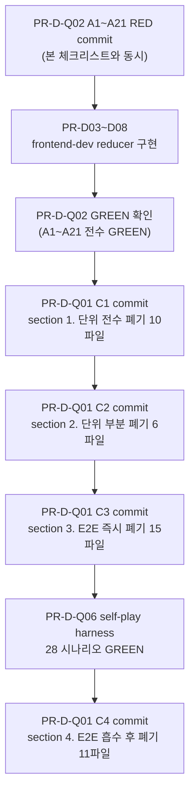

# 91 -- 폐기 실행 체크리스트 (Discard Execution Checklist)

- **작성**: 2026-04-25, qa (Phase D G-D)
- **상위 SSOT**: `docs/04-testing/88-test-strategy-rebuild.md` section 1.2
- **상위 후보 리스트**: `docs/04-testing/90-qa-day1-discard-candidates.md`
- **목적**: 88 section 1.2 의 파일별 판정을 실행 가능한 체크리스트로 변환. PR-D-Q01 머지 시 본 문서의 체크박스를 순서대로 실행.
- **금지**: 본 Day 1 단계에서 실제 git rm 실행 금지. 체크리스트 작성만.
- **실행 시점**: PR-D-Q02 (A1~A21 by-action) GREEN 확인 후 PR-D-Q01 실행

---

## 1. 단위 테스트 전수 폐기 (10 파일)

사유 코드: R2 (band-aid 가드 검증), R3 (코드 분기 검증), R7 (UI 라벨 검증)

| # | 체크 | 파일 | 사유 | 흡수 위치 | 비고 |
|---|------|------|------|----------|------|
| 1 | [ ] | `src/frontend/src/store/__tests__/gameStore.test.ts` | R2/R3 | section 3.2 상태 invariant | 236 lines, 13 cases |
| 2 | [ ] | `src/frontend/src/__tests__/bug-new-001-002-003.test.tsx` | R3 | section 3.2 INV-G2 | 337 lines, 24 cases |
| 3 | [ ] | `src/frontend/src/__tests__/day11-ui-scenarios.test.tsx` | R3 | F-NN 기능별 | 647 lines, 39 cases |
| 4 | [ ] | `src/frontend/src/__tests__/hotfix-p0-2026-04-22.test.tsx` | R2 | 가드 폐기로 소실 | 253 lines, 17 cases |
| 5 | [ ] | `src/frontend/src/components/game/__tests__/GameBoard.validity.test.tsx` | R3 | designer 57 | 91 lines, 12 cases |
| 6 | [ ] | `src/frontend/src/components/game/__tests__/PlayerCard.test.tsx` | R7 | designer 57 | 196 lines, 10 cases |
| 7 | [ ] | `src/frontend/src/components/tile/__tests__/Tile.test.tsx` | R7 | designer 57 | 151 lines, 16 cases |
| 8 | [ ] | `src/frontend/src/lib/__tests__/tileStateHelpers.test.ts` | R3 | section 3.2 INV-G2 property | 124 lines, 13 cases |
| 9 | [ ] | `src/frontend/src/lib/__tests__/turn-action-label.test.ts` | R7 | designer 57 | 62 lines, 13 cases |
| 10 | [ ] | `src/frontend/src/lib/__tests__/player-display.test.ts` | R7 | designer 57 | 125 lines, 15 cases |

**실행 명령 (C1 commit)**:
```bash
git rm \
  src/frontend/src/store/__tests__/gameStore.test.ts \
  src/frontend/src/__tests__/bug-new-001-002-003.test.tsx \
  src/frontend/src/__tests__/day11-ui-scenarios.test.tsx \
  src/frontend/src/__tests__/hotfix-p0-2026-04-22.test.tsx \
  src/frontend/src/components/game/__tests__/GameBoard.validity.test.tsx \
  src/frontend/src/components/game/__tests__/PlayerCard.test.tsx \
  src/frontend/src/components/tile/__tests__/Tile.test.tsx \
  src/frontend/src/lib/__tests__/tileStateHelpers.test.ts \
  src/frontend/src/lib/__tests__/turn-action-label.test.ts \
  src/frontend/src/lib/__tests__/player-display.test.ts
```

---

## 2. 단위 테스트 부분 폐기 (6 파일 -- 보존 케이스는 신규 위치로 이전 후 rm)

| # | 체크 | 파일 | tracked? | 보존 케이스 수 | 흡수 위치 | 비고 |
|---|------|------|----------|-------------|----------|------|
| 11 | [ ] | `src/frontend/src/lib/dragEnd/__tests__/dragEndReducer.test.ts` | untracked | 28건 | section 2.1 A1~A12 + section 2.4 | 2783 lines |
| 12 | [ ] | `src/frontend/src/lib/dragEnd/__tests__/dragEndReducer-corruption.test.ts` | untracked | 74건 | section 3.1/3.2 property test | 1846 lines |
| 13 | [ ] | `src/frontend/src/lib/dragEnd/__tests__/dragEndReducer-edge-cases.test.ts` | untracked | 58건 | section 3.1/3.2 property test | 1554 lines |
| 14 | [ ] | `src/frontend/src/__tests__/incident-t11-duplication-2026-04-24.test.tsx` | untracked | 1건 ([RED-B]) | section 4.1 INC-T11-DUP | 324 lines |
| 15 | [ ] | `src/frontend/src/components/game/__tests__/ActionBar.test.tsx` | tracked | 10건 | section 2.1 A14 + A16 | 212 lines |
| 16 | [ ] | `src/frontend/src/lib/__tests__/mergeCompatibility.test.ts` | tracked | 19건 | section 2.2 분할 3파일 | 160 lines |

**실행 절차**:
1. 신규 section 2~4 테스트 GREEN 확인 (PR-D-Q02/Q03/Q04)
2. untracked 파일: `rm -f` (git add 후 rm 하지 않음)
3. tracked 파일: `git rm`

**untracked 삭제 명령**:
```bash
rm -f \
  src/frontend/src/lib/dragEnd/__tests__/dragEndReducer.test.ts \
  src/frontend/src/lib/dragEnd/__tests__/dragEndReducer-corruption.test.ts \
  src/frontend/src/lib/dragEnd/__tests__/dragEndReducer-edge-cases.test.ts \
  src/frontend/src/__tests__/incident-t11-duplication-2026-04-24.test.tsx
```

**tracked 삭제 명령 (C2 commit)**:
```bash
git rm \
  src/frontend/src/components/game/__tests__/ActionBar.test.tsx \
  src/frontend/src/lib/__tests__/mergeCompatibility.test.ts
```

---

## 3. E2E 즉시 폐기 (15 파일)

사유 코드: R2 (가드 회귀), R3 (코드 분기), R7 (UI 라벨 검증)

| # | 체크 | 파일 | 사유 | 케이스 수 |
|---|------|------|------|----------|
| 1 | [ ] | `src/frontend/e2e/drag-corruption-matrix.spec.ts` | R7 | 29 |
| 2 | [ ] | `src/frontend/e2e/meld-dup-render.spec.ts` | R7 | 6 |
| 3 | [ ] | `src/frontend/e2e/hand-count-sync.spec.ts` | R7 | 3 |
| 4 | [ ] | `src/frontend/e2e/i18n-render.spec.ts` | R7 | 3 |
| 5 | [ ] | `src/frontend/e2e/hotfix-p0-i1-pending-dup-defense.spec.ts` | R2 | 3 |
| 6 | [ ] | `src/frontend/e2e/hotfix-p0-i2-run-append.spec.ts` | R2 | 3 |
| 7 | [ ] | `src/frontend/e2e/hotfix-p0-i4-joker-recovery.spec.ts` | R2 | 6 |
| 8 | [ ] | `src/frontend/e2e/day11-ui-bug-fixes.spec.ts` | R3 | 17 |
| 9 | [ ] | `src/frontend/e2e/game-ui-bug-fixes.spec.ts` | R3 | 15 |
| 10 | [ ] | `src/frontend/e2e/game-dnd-manipulation.spec.ts` | R7 | 24 |
| 11 | [ ] | `src/frontend/e2e/turn-sync.spec.ts` | R7 | 3 |
| 12 | [ ] | `src/frontend/e2e/sprint7-prep-rearrangement.spec.ts` | R3 | 2 |
| 13 | [ ] | `src/frontend/e2e/regression-pr41-i18-i19.spec.ts` | R3 | 7 |
| 14 | [ ] | `src/frontend/e2e/ux004-extend-lock-hint.spec.ts` | R7 | 4 |
| 15 | [ ] | `src/frontend/e2e/pre-deploy-playbook.spec.ts` | R7 | 9 |

**실행 명령 (C3 commit)**:
```bash
git rm \
  src/frontend/e2e/drag-corruption-matrix.spec.ts \
  src/frontend/e2e/meld-dup-render.spec.ts \
  src/frontend/e2e/hand-count-sync.spec.ts \
  src/frontend/e2e/i18n-render.spec.ts \
  src/frontend/e2e/hotfix-p0-i1-pending-dup-defense.spec.ts \
  src/frontend/e2e/hotfix-p0-i2-run-append.spec.ts \
  src/frontend/e2e/hotfix-p0-i4-joker-recovery.spec.ts \
  src/frontend/e2e/day11-ui-bug-fixes.spec.ts \
  src/frontend/e2e/game-ui-bug-fixes.spec.ts \
  src/frontend/e2e/game-dnd-manipulation.spec.ts \
  src/frontend/e2e/turn-sync.spec.ts \
  src/frontend/e2e/sprint7-prep-rearrangement.spec.ts \
  src/frontend/e2e/regression-pr41-i18-i19.spec.ts \
  src/frontend/e2e/ux004-extend-lock-hint.spec.ts \
  src/frontend/e2e/pre-deploy-playbook.spec.ts
```

---

## 4. E2E 흡수 후 폐기 (11 파일 -- PR-D-Q06 self-play harness GREEN 후에만 실행)

| # | 체크 | 파일 | 흡수 위치 | 케이스 수 |
|---|------|------|----------|----------|
| 1 | [ ] | `src/frontend/e2e/game-rules.spec.ts` | self-play S-R01~R08 | 18 |
| 2 | [ ] | `src/frontend/e2e/game-flow.spec.ts` | self-play S-N01~N06 | 30 |
| 3 | [ ] | `src/frontend/e2e/game-lifecycle.spec.ts` | self-play S-N03 + S-S03 | 22 |
| 4 | [ ] | `src/frontend/e2e/rule-extend-after-confirm.spec.ts` | A3 단위 + S-N04 | 4 |
| 5 | [ ] | `src/frontend/e2e/rule-ghost-box-absence.spec.ts` | INV-G3 property | 3 |
| 6 | [ ] | `src/frontend/e2e/rule-initial-meld-30pt.spec.ts` | S-R04 (V-04) | 4 |
| 7 | [ ] | `src/frontend/e2e/rule-invalid-meld-cleanup.spec.ts` | S-R04 | 3 |
| 8 | [ ] | `src/frontend/e2e/rule-turn11-duplication-regression.spec.ts` | INC-T11-DUP + S-I01 | 2 |
| 9 | [ ] | `src/frontend/e2e/rule-turn-boundary-invariants.spec.ts` | A19/A20 단위 | 3 |
| 10 | [ ] | `src/frontend/e2e/rule-one-game-complete.spec.ts` | S-N06 | 1 |
| 11 | [ ] | `src/frontend/e2e/rearrangement.spec.ts` | S-N04 + A8/A9/A10 | 7 |

**차단 조건**: PR-D-Q06 (self-play harness 28 시나리오) GREEN 확인 후에만 C4 commit 허용.

---

## 5. 보존 (sprint 범위 외, rm 보류 -- 23 파일)

다음 파일들은 본 sprint UI 재설계 범위 외이므로 즉시 rm 보류. fixture 갱신만 필요 시 수행.

| 카테고리 | 파일 패턴 | 케이스 수 |
|---------|----------|----------|
| Stage 1~6 | `e2e/01-stage*.spec.ts` ~ `e2e/06-stage*.spec.ts` | 30 |
| Lobby/Room | `e2e/lobby-and-room.spec.ts` | 40 |
| Practice | `e2e/practice*.spec.ts`, `e2e/game-ui-practice*.spec.ts` | 70 |
| Rankings | `e2e/rankings.spec.ts` | 30 |
| Auth | `e2e/auth-and-navigation.spec.ts` | 28 |
| Admin | `e2e/admin*.spec.ts` | 7 |
| AI Battle | `e2e/ai-battle.spec.ts` | 27 |
| Dashboard | `e2e/dashboard*.spec.ts` | 29 |
| Rate Limit | `e2e/rate-limit*.spec.ts`, `e2e/ws-rate-limit*.spec.ts` | 28 |
| Game UI | `e2e/game-ui-multiplayer.spec.ts`, `e2e/game-ui-state.spec.ts` | 28 |

---

## 6. 실행 순서 요약



---

## 7. 변경 이력

- **2026-04-25 v1.0**: 본 체크리스트 발행. 88 section 1.2 + 90 section 1~2 의 판정을 실행 가능한 체크리스트로 변환. 실제 git rm 미실행 (Day 4 PR-D-Q01 에서 실행).
