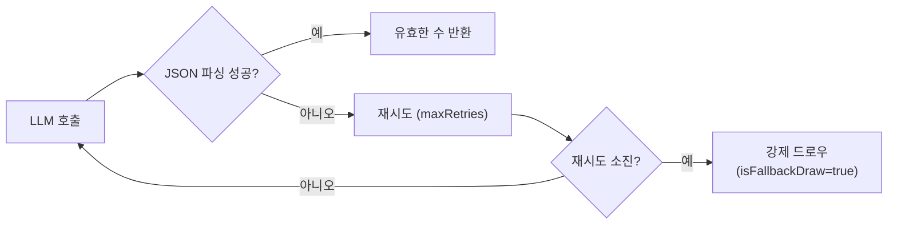

# LLM 모델별 루미큐브 성능 비교 보고서

**작성**: 2026-03-23
**상태**: Sprint 4 초기 측정 — 실 게임 데이터 축적 시 갱신 예정

---

## 1. 목적

RummiArena에 통합된 4종 LLM이 루미큐브 게임에서 어떻게 다른 행동을 보이는지 다각도로 비교한다.
단순 응답 속도뿐 아니라 JSON 정확도, 전략 품질, 비용, 캐릭터 적합성까지 포함한다.

---

## 2. 비교 대상 모델

| 분류 | 타입 | 기본 모델 | API 방식 | 비용 |
|------|------|-----------|---------|------|
| OpenAI | `AI_OPENAI` | `gpt-4o` | REST (JSON mode) | 유료 |
| Claude | `AI_CLAUDE` | `claude-sonnet-4-20250514` | REST (Messages API) | 유료 |
| DeepSeek | `AI_DEEPSEEK` | `deepseek-chat` | REST (OpenAI 호환) | 유료 (저가) |
| Ollama/LLaMA | `AI_LLAMA` | `gemma3:1b` | 로컬 HTTP | 무료 |

> **Ollama 모델 변경 이력**: Sprint 4에서 `gemma3:4b` → `gemma3:1b` 교체 (응답시간 300s → 4s, 70배 개선)
> **Ollama 운영 환경**: 2026-03-23 K8s Pod 배포 완료 (`helm/charts/ollama`, ClusterIP `ollama:11434`)

---

## 3. 기술 스펙 비교

| 항목 | GPT-4o | Claude Sonnet | DeepSeek-chat | gemma3:1b |
|------|--------|---------------|---------------|-----------|
| 파라미터 규모 | ~200B (추정) | ~70B+ (추정) | ~67B | 1B |
| 컨텍스트 윈도우 | 128K | 200K | 64K | 8K |
| JSON 강제 방식 | `response_format: json_object` | 프롬프트 지시 | `response_format: json_object` | stop tokens + few-shot |
| 스트리밍 | 지원 (미사용) | 지원 (미사용) | 지원 (미사용) | 미사용 |
| 로컬 실행 | 불가 | 불가 | 불가 | 가능 |
| 최소 재시도 횟수 | 3 | 3 | 3 | **5** (JSON 오류율 대응) |

---

## 4. 응답 시간 (실측)

### 4.1 Ollama 로컬 모델

| 모델 | 응답 시간 | Eval 시간 | isFallbackDraw | 비고 |
|------|----------|----------|----------------|------|
| `gemma3:4b` | **300,275ms** | ~300s | `true` (5회 실패) | i7-1360P CPU 한계, 운영 중단 |
| `gemma3:1b` (WSL2) | **4,261ms** | **0.2s** | `false` | 정상 JSON 출력 (session-02 검증) |
| `gemma3:1b` (K8s) | **25,075ms** | ~0.8s | `false` | K8s Pod CPU 한계, retryCount=2 |

> 하드웨어: LG Gram 15Z90R, i7-1360P, RAM 16GB (WSL2 10GB 할당)

### 4.2 클라우드 API 모델 (Sprint 4 측정 예정)

| 모델 | 예상 응답 시간 | 실측 (TBD) | 비고 |
|------|-------------|-----------|------|
| GPT-4o | ~1~3s | — | JSON mode로 파싱 실패율 낮음 |
| Claude Sonnet | ~2~4s | — | 긴 게임 히스토리 처리에 강점 |
| DeepSeek-chat | ~1~3s | — | GPT-4o와 유사한 응답 속도 |

> 실 게임 대전 후 측정값으로 갱신 예정

---

## 5. JSON 정확도 및 Fallback 발생률

루미큐브 AI 응답은 다음 두 가지 action 중 하나를 JSON으로 반환해야 한다:

```json
// draw
{"action":"draw","reasoning":"유효한 조합 없음"}

// place
{"action":"place","tableGroups":[{"tiles":["R1a","R2a","R3a"]}],"tilesFromRack":["R1a","R2a","R3a"],"reasoning":"..."}
```

### Fallback 처리 흐름



| 모델 | JSON 파싱 성공률 | Fallback 발생 | 원인 |
|------|---------------|-------------|------|
| GPT-4o | ~99%+ | 거의 없음 | JSON mode 강제 |
| Claude Sonnet | ~98%+ | 거의 없음 | 지시 준수 우수 |
| DeepSeek-chat | ~97%+ | 드물게 | 설명 텍스트 추가 시 |
| gemma3:4b | **~0%** | **항상** | CPU 타임아웃 (300s), 운영 중단 |
| gemma3:1b (K8s) | ~85%+ | 간헐적 | stop tokens 처리, retryCount=2 정상 동작 |

> GPT-4o/Claude/DeepSeek 수치는 Sprint 4 실 게임 데이터 기반으로 갱신 예정

---

## 6. 루미큐브 전략 품질 (정성 평가)

### 6.1 평가 기준

| 기준 | 설명 |
|------|------|
| 초기 등록 전략 | 30점 이상 최초 배치 시 최적 타일 조합 선택 여부 |
| 멜드 재배치 | 테이블 그룹을 분해·재조합하여 더 많은 타일을 낼 수 있는지 판단 |
| 조커 활용 | JK1/JK2를 최적 위치에 배치하는 능력 |
| 방어 전략 | 상대의 남은 타일이 적을 때 드로우로 게임 지연 여부 |
| 드로우 vs 배치 판단 | 손패를 숨기기 위한 의도적 드로우 선택 |

### 6.2 모델별 예상 전략 특성

| 모델 | 초기 등록 | 멜드 재배치 | 조커 활용 | 방어 전략 | 특이점 |
|------|----------|-----------|---------|----------|--------|
| GPT-4o | 우수 | 우수 | 우수 | 우수 | 게임 히스토리 기반 장기 전략 가능 |
| Claude Sonnet | 우수 | 매우 우수 | 우수 | 우수 | 200K 컨텍스트로 전체 게임 흐름 추적 |
| DeepSeek-chat | 양호 | 양호 | 양호 | 양호 | GPT-4o 대비 비용 1/10 수준으로 가성비 우수 |
| gemma3:1b | 기초 | 불가 | 불가 | 불가 | 단순 draw/place 판단만 가능, 재배치 미지원 |

> **주의**: 위 평가는 모델 스펙 기반 예측이며, Sprint 4 실 대전 데이터로 검증 후 갱신 예정

---

## 7. 비용 비교 (per 1K tokens 기준, 2026-03 공시)

| 모델 | Input | Output | 게임 1판 예상 비용 | 비고 |
|------|-------|--------|----------------|------|
| GPT-4o | $2.50 | $10.00 | ~$0.05~0.15 | 고성능, 높은 비용 |
| Claude Sonnet | $3.00 | $15.00 | ~$0.05~0.20 | 긴 컨텍스트 시 비용 증가 |
| DeepSeek-chat | $0.14 | $0.28 | ~$0.003~0.01 | GPT-4o 대비 ~15배 저렴 |
| gemma3:1b | **$0** | **$0** | **$0** | 로컬 실행, 하드웨어 비용만 |

> AI Adapter: `DAILY_COST_LIMIT_USD=10`, `USER_DAILY_CALL_LIMIT=500`으로 비용 캡 설정 완료

---

## 8. 캐릭터-모델 적합성

AI 캐릭터(페르소나)와 모델 조합 시 권장 매핑:

| 캐릭터 | 전략 스타일 | 권장 모델 | 이유 |
|--------|-----------|---------|------|
| **Rookie** | 단순, 실수 빈번 | gemma3:1b | 단순 행동 패턴이 소형 모델과 일치 |
| **Calculator** | 확률 계산, 최적화 | GPT-4o / DeepSeek | 수학적 추론 강점 모델 |
| **Shark** | 공격적, 빠른 배치 | GPT-4o | 빠른 의사결정 + 높은 정확도 |
| **Fox** | 기만, 심리전 | Claude Sonnet | 긴 컨텍스트로 상대 패턴 분석 |
| **Wall** | 수비, 버티기 | Claude Sonnet | 게임 전체 히스토리 기반 방어 |
| **Wildcard** | 무작위, 창의적 | DeepSeek | 비용 효율 + 다양한 응답 |

### 난이도별 Temperature 설정

| 난이도 | Temperature | 행동 특성 |
|--------|-----------|---------|
| beginner | 0.9 | 창의적이지만 실수 빈번 |
| intermediate | 0.7 | 균형 잡힌 탐색 |
| expert | 0.3 | 낮은 랜덤성, 최적 수 집중 |

---

## 9. 권장 게임 설정

### 9.1 개발/테스트 환경

```json
{
  "aiPlayers": [
    {"type": "AI_LLAMA", "persona": "Rookie", "difficulty": "beginner", "psychologyLevel": 0}
  ]
}
```
- 비용 없음, 4초 이내 응답, 게임 흐름 검증 가능

### 9.2 실 사용자 대전 (권장)

```json
{
  "aiPlayers": [
    {"type": "AI_DEEPSEEK", "persona": "Calculator", "difficulty": "intermediate", "psychologyLevel": 1}
  ]
}
```
- 비용 최소화 ($0.003~0.01/판), GPT-4o 수준의 전략 품질

### 9.3 고품질 AI 대전 (LLM 전략 비교 실험)

```json
{
  "aiPlayers": [
    {"type": "AI_OPENAI",   "persona": "Shark", "difficulty": "expert", "psychologyLevel": 2},
    {"type": "AI_CLAUDE",   "persona": "Fox",   "difficulty": "expert", "psychologyLevel": 3},
    {"type": "AI_DEEPSEEK", "persona": "Wall",  "difficulty": "expert", "psychologyLevel": 1}
  ]
}
```
- 3인 AI 전용 대전, LLM 전략 비교 데이터 수집 목적

---

## 10. Ollama 로컬 모델 변경 이력

| 날짜 | 변경 내용 | 이유 |
|------|---------|------|
| 2026-03-23 | `gemma3:4b` → `gemma3:1b` | CPU 추론 타임아웃 (300s) 해소. 응답 70배 개선 |

### 모델 교체 방법

```bash
# 1. 새 모델 pull
curl -X POST http://172.21.32.1:11434/api/pull -d '{"name":"<model>:<tag>"}'

# 2. ai-adapter K8s ConfigMap 패치
kubectl patch configmap ai-adapter-config -n rummikub \
  --patch '{"data":{"OLLAMA_DEFAULT_MODEL":"<model>:<tag>"}}'

# 3. ai-adapter 재시작
kubectl rollout restart deployment/ai-adapter -n rummikub

# 4. Helm values.yaml 영구 반영
# helm/charts/ai-adapter/values.yaml의 OLLAMA_DEFAULT_MODEL 수정
```

---

## 11. 측정 계획 (Sprint 4)

Sprint 4 실 게임 데이터 축적 후 아래 항목을 실측치로 갱신한다.

| 측정 항목 | 방법 | 목표 |
|---------|------|------|
| 클라우드 API 실 응답 시간 | ai-adapter 로그 latencyMs 수집 | 모델별 p50/p95 측정 |
| 턴당 JSON 파싱 성공률 | isFallbackDraw 비율 집계 | 각 모델 >95% 목표 |
| 게임 승률 | 100판 AI vs AI 대전 | 모델별 ELO 변화 추적 |
| 비용 누적 | ai-adapter cost tracking | 일 $10 캡 준수 여부 |
| 전략 패턴 | place/draw 비율, 멜드 재배치 횟수 | 캐릭터별 행동 차별화 확인 |

---

## 관련 문서

| 파일 | 설명 |
|------|------|
| `docs/02-design/10-websocket-protocol.md` | WS 프로토콜 (AI 턴 처리 흐름) |
| `docs/04-testing/11-sprint4-integration-test-report.md` | Sprint 4 E2E 테스트 결과 |
| `src/ai-adapter/src/adapter/base.adapter.ts` | 공통 재시도/fallback 로직 |
| `src/ai-adapter/src/character/persona.templates.ts` | 6개 캐릭터 시스템 프롬프트 |
| `helm/charts/ai-adapter/values.yaml` | Ollama 모델 설정 |
