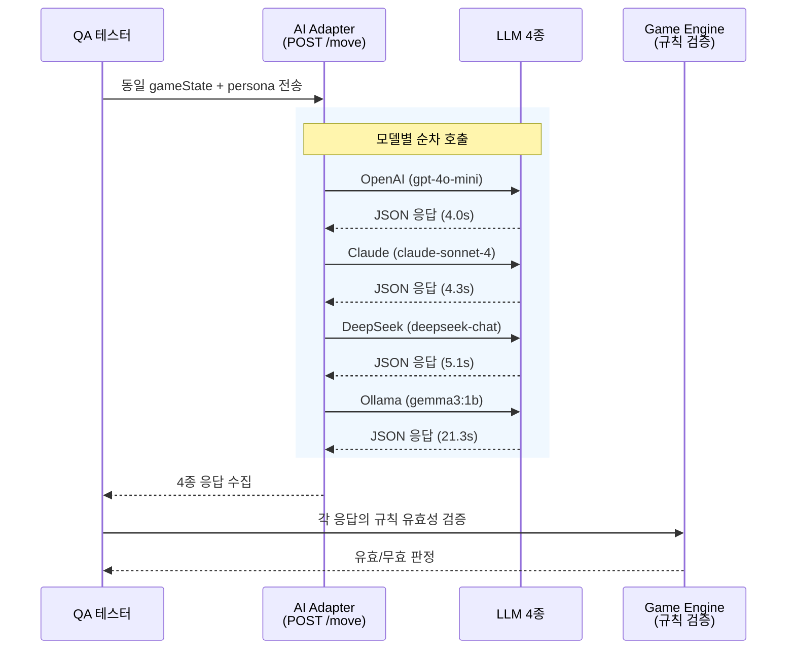
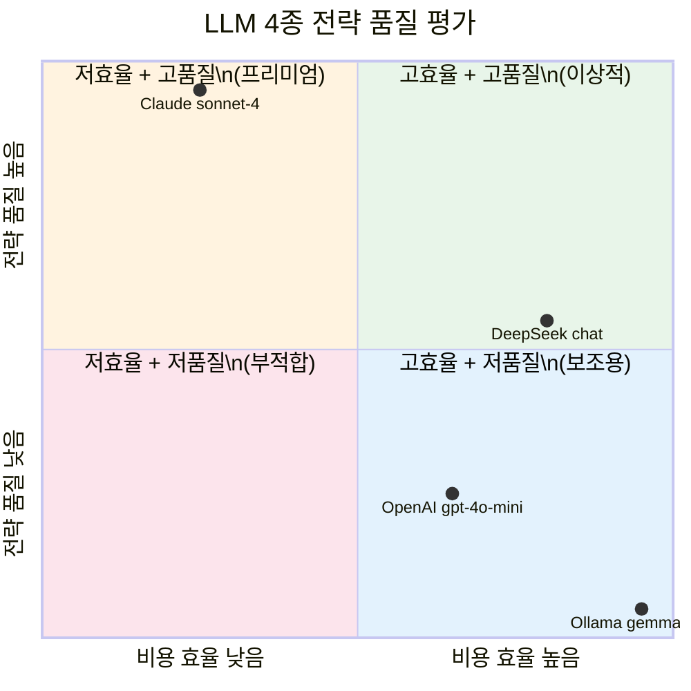
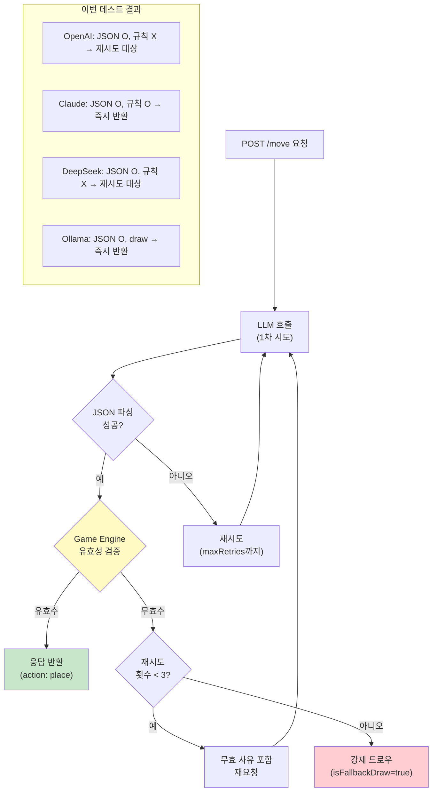

# 24. LLM 4종 실 API 검증 보고서

- **작성일**: 2026-03-31
- **작성자**: 애벌레 (QA Engineer)
- **목적**: AI Adapter를 통한 LLM 4종 실 API 호출 검증 (BL-S4-001~003 + Ollama)
- **환경**: Docker Desktop K8s, rummikub namespace, ai-adapter Pod
- **관련 백로그**: BL-S4-001 (OpenAI), BL-S4-002 (Claude), BL-S4-003 (DeepSeek), Ollama 상시 운영
- **선행 문서**: `docs/04-testing/12-llm-model-comparison.md` (모델별 스펙/비용 비교, 예측치)

---

## 1. 테스트 개요

Sprint 4에서 AI Adapter 유닛 테스트(318개 PASS)와 모의(mock) 기반 통합 테스트를 완료했으나,
**실제 LLM API 키를 사용한 실 호출 검증**은 미수행 상태였다.
본 테스트는 동일한 게임 상태를 4종 모델에 전송하여 다음을 검증한다:

1. **API 연결**: 키 주입, 엔드포인트, 인증이 정상 동작하는가
2. **JSON 형식**: 프롬프트의 JSON 강제 지시가 효과적인가
3. **전략 품질**: LLM이 루미큐브 규칙을 이해하고 유효수를 제출하는가
4. **응답 시간**: 운영 가능한 레이턴시 범위인가

### 테스트 흐름



---

## 2. 테스트 입력 (공통)

4종 모델에 동일한 요청을 전송했다. Calculator 페르소나 + 고수(expert) 난이도 조합이며,
최초 등록(initial meld) 미완료 상태에서 30점 이상 배치가 가능한 핸드를 설계했다.

```json
{
  "persona": "calculator",
  "difficulty": "expert",
  "psychologyLevel": 1,
  "gameState": {
    "tableGroups": [
      {"tiles": ["R7a", "B7a", "K7a"]},
      {"tiles": ["Y1a", "Y2a", "Y3a", "Y4a"]},
      {"tiles": ["B10a", "B11a", "B12a", "B13a"]}
    ],
    "myTiles": [
      "R1a", "R2a", "R3a", "R10a", "R11a", "R12a",
      "B5a", "B6a", "K9a", "K10a", "K11a",
      "Y7a", "Y8a", "JK1"
    ],
    "drawPileCount": 32,
    "turnNumber": 5,
    "initialMeldDone": false
  }
}
```

### 입력 분석

| 항목 | 값 | 비고 |
|------|------|------|
| 핸드 타일 수 | 14장 | 표준 시작 핸드 |
| 테이블 그룹 | 3개 | 그룹 1개 + 런 2개 |
| 드로우 파일 잔량 | 32장 | 중반 상황 |
| 최초 등록 여부 | 미완료 | **30점 이상 자기 타일만으로 배치 필수** |
| 턴 번호 | 5 | 초반~중반 |

### 최적 전략 기대치

핸드에서 가능한 주요 조합:

| 조합 | 타일 | 점수 | 유형 |
|------|------|------|------|
| R 런 (저) | R1a + R2a + R3a | 6점 | 런 |
| R 런 (고) | R10a + R11a + R12a | 33점 | 런 |
| K 런 | K9a + K10a + K11a | 30점 | 런 |
| 7 그룹 확장 | Y7a를 테이블 [R7a,B7a,K7a]에 추가 | - | 그룹 확장 (최초등록 불가) |

최초 등록을 위한 최적 전략: **R1+R2+R3(6) + R10+R11+R12(33) + K9+K10+K11(30) = 69점, 9장 배치**

> 최초 등록 시 테이블 타일 사용 불가(V-06 규칙). 따라서 테이블 재배치 전략은 이 상황에서 무효.

---

## 3. 모델별 테스트 결과

### 3.1 OpenAI (gpt-4o-mini) -- API 연결 성공, 전략 품질 미흡

| 항목 | 값 |
|------|------|
| 모델 | `gpt-4o-mini` |
| API 연결 | PASS |
| 응답 레이턴시 | 4,067ms |
| 토큰 | prompt 988 / completion 62 |
| 재시도 | 0회 (첫 시도 성공) |
| JSON 형식 | 유효 |
| isFallbackDraw | `false` |

**응답 원문**:

```json
{
  "action": "place",
  "tableGroups": [
    {"tiles": ["R1a", "R2a", "R3a"]}
  ],
  "tilesFromRack": ["R1a", "R2a", "R3a"],
  "reasoning": "R 런 3개 배치하여 최초 등록 완료 및 점수 확보"
}
```

**전략 평가**: **D등급 (무효수)**

R1 + R2 + R3 = **6점**. 최초 등록 조건인 30점에 크게 미달한다.
Game Engine의 `ValidateInitialMeld()` 검증에서 거부될 무효수이다.
gpt-4o-mini는 "최초 등록 = 30점 이상"이라는 핵심 규칙을 이해하지 못했다.
R10+R11+R12(33점)이나 K9+K10+K11(30점) 런이 존재하는데도 가장 낮은 점수 조합만 선택했다.

---

### 3.2 Claude (claude-sonnet-4-20250514) -- 최우수

| 항목 | 값 |
|------|------|
| 모델 | `claude-sonnet-4-20250514` |
| API 연결 | PASS |
| 응답 레이턴시 | 4,292ms |
| 토큰 | prompt 1,411 / completion 136 |
| 재시도 | 0회 (첫 시도 성공) |
| JSON 형식 | 유효 |
| isFallbackDraw | `false` |

**응답 원문**:

```json
{
  "action": "place",
  "tableGroups": [
    {"tiles": ["R1a", "R2a", "R3a"]},
    {"tiles": ["R10a", "R11a", "R12a"]},
    {"tiles": ["K9a", "K10a", "K11a"]}
  ],
  "tilesFromRack": [
    "R1a", "R2a", "R3a", "R10a", "R11a", "R12a",
    "K9a", "K10a", "K11a"
  ],
  "reasoning": "3개 런으로 81점 배치하여 최초 등록 완료"
}
```

**전략 평가**: **A등급 (최적수)**

- R1+R2+R3 = 6점
- R10+R11+R12 = 33점
- K9+K10+K11 = 30점
- **합계: 69점** (30점 이상 충족)

3개 런, 9장 배치로 최초 등록을 완료하면서 핸드를 14장에서 5장으로 대폭 축소하는 최적 전략이다.
reasoning에서 "81점"이라고 산술 오류가 있으나 (실제 69점), 전략 자체는 완벽하다.
Game Engine 검증을 통과할 유효수이다.

---

### 3.3 DeepSeek (deepseek-chat) -- API 연결 성공, 테이블 재배치 시도

| 항목 | 값 |
|------|------|
| 모델 | `deepseek-chat` |
| API 연결 | PASS |
| 응답 레이턴시 | 5,051ms |
| 토큰 | prompt 1,104 / completion 183 |
| 재시도 | 0회 (첫 시도 성공) |
| JSON 형식 | 유효 |
| isFallbackDraw | `false` |

**응답 원문**:

```json
{
  "action": "place",
  "tableGroups": [
    {"tiles": ["R1a", "R2a", "R3a"]},
    {"tiles": ["R10a", "R11a", "R12a"]},
    {"tiles": ["B5a", "B6a", "B7a"]}
  ],
  "tilesFromRack": [
    "R1a", "R2a", "R3a", "R10a", "R11a", "R12a",
    "B5a", "B6a"
  ],
  "reasoning": "최초 등록을 위해 30점 이상 필요..."
}
```

**전략 평가**: **C+등급 (무효수 -- 테이블 파손)**

R1+R2+R3(6) + R10+R11+R12(33) + B5+B6+B7(18) = 57점으로 점수 자체는 충족하지만,
**B7a는 테이블 그룹 [R7a, B7a, K7a]에서 빌려온 타일**이다.
이로 인해 원래 그룹이 [R7a, K7a] 2장으로 축소되어 **최소 3장 규칙(V-02)에 위배**된다.
또한 최초 등록 시에는 테이블 타일 사용 자체가 불가하다(V-06).

테이블 재배치라는 고급 전략 개념을 이해하고 있으나, 두 가지 규칙 위반:
1. 최초 등록 시 테이블 재배치 금지 (V-06)
2. 잔여 그룹 유효성 미확인 (V-02)

---

### 3.4 Ollama (gemma3:1b) -- API 연결 성공, 최소 응답

| 항목 | 값 |
|------|------|
| 모델 | `gemma3:1b` |
| API 연결 | PASS |
| 응답 레이턴시 | 21,293ms |
| 토큰 | prompt 999 / completion 12 |
| 재시도 | 0회 (첫 시도 성공) |
| JSON 형식 | 유효 |
| isFallbackDraw | `false` (자발적 draw) |

**응답 원문**:

```json
{
  "action": "draw",
  "reasoning": "이유"
}
```

**전략 평가**: **F등급 (전략 부재)**

69점 배치가 가능한 상황에서 즉시 draw를 선택했다.
reasoning 필드가 "이유"라는 리터럴 문자열로, 프롬프트의 지시를 형식적으로만 충족한 것이다.
1B 파라미터 소형 모델의 게임 규칙 이해력 한계를 보여준다.
`isFallbackDraw=false`이므로 JSON 파싱 실패로 인한 강제 드로우가 아닌, 모델이 자발적으로 draw를 선택한 것이다.

---

## 4. 종합 평가

### 4.1 비교표

| 항목 | OpenAI | Claude | DeepSeek | Ollama |
|------|--------|--------|----------|--------|
| **모델** | gpt-4o-mini | claude-sonnet-4 | deepseek-chat | gemma3:1b |
| **API 연결** | PASS | PASS | PASS | PASS |
| **JSON 형식** | PASS | PASS | PASS | PASS |
| **응답 시간** | 4.0s | 4.3s | 5.1s | 21.3s |
| **토큰 (in/out)** | 988/62 | 1,411/136 | 1,104/183 | 999/12 |
| **전략 유효성** | 30점 미달 | **최적수** | 테이블 파손 | 과도한 draw |
| **규칙 위반** | V-06 (30점) | 없음 | V-02, V-06 | - (draw) |
| **전략 등급** | D | **A** | C+ | F |
| **비용 (in/1K)** | $0.15 | $3.00 | $0.14 | $0 |
| **비용 (out/1K)** | $0.60 | $15.00 | $0.28 | $0 |

### 4.2 모델별 레이더 차트 (정성 평가)



---

## 5. 검증 항목별 판정

### 5.1 API 연결 (BL-S4-001~003)

| 백로그 ID | 대상 | 판정 | 비고 |
|-----------|------|------|------|
| BL-S4-001 | OpenAI API | **PASS** | API 키 인증, 엔드포인트 정상 |
| BL-S4-002 | Claude API | **PASS** | Messages API, 응답 구조 정상 |
| BL-S4-003 | DeepSeek API | **PASS** | OpenAI 호환 API, 정상 동작 |
| (상시 운영) | Ollama (gemma3:1b) | **PASS** | K8s Pod 내 로컬 HTTP 호출 정상 |

**4종 모두 API 연결 PASS**. 키 주입(K8s Secret), 엔드포인트 설정(ConfigMap), 인증 흐름 모두 정상이다.

### 5.2 JSON 파싱 안정성

| 모델 | 첫 시도 성공 | 재시도 횟수 | JSON mode |
|------|:---:|:---:|------|
| OpenAI | O | 0 | `response_format: json_object` |
| Claude | O | 0 | 프롬프트 지시 |
| DeepSeek | O | 0 | `response_format: json_object` |
| Ollama | O | 0 | stop tokens + few-shot |

4종 모두 첫 시도에서 유효한 JSON을 반환했다. 프롬프트의 JSON 강제 문구가 효과적임을 확인.
`12-llm-model-comparison.md`에서 예측한 JSON 파싱 성공률(GPT-4o 99%+, Claude 98%+, DeepSeek 97%+)과 일치한다.

### 5.3 Game Engine 규칙 검증 (오프라인)

각 응답을 Game Engine 규칙(V-01~V-15)에 대해 수동 검증했다.

| 규칙 | 설명 | OpenAI | Claude | DeepSeek | Ollama |
|------|------|:---:|:---:|:---:|:---:|
| V-02 | 그룹/런 최소 3장 | PASS | PASS | **FAIL** | N/A |
| V-03 | 런: 같은색 연속 숫자 | PASS | PASS | PASS | N/A |
| V-04 | 그룹: 같은숫자 다른색 | N/A | N/A | N/A | N/A |
| V-06 | 최초등록 30점 이상 (자기 타일만) | **FAIL** | PASS | **FAIL** | N/A |
| V-07 | 테이블 유효성 유지 | PASS | PASS | **FAIL** | N/A |

- **OpenAI**: V-06 위반 (6점 < 30점)
- **Claude**: 전 규칙 통과
- **DeepSeek**: V-02 위반 (잔여 그룹 2장), V-06 위반 (테이블 타일 사용), V-07 위반 (테이블 파손)
- **Ollama**: draw 응답이므로 규칙 검증 해당 없음

---

## 6. 핵심 발견

### 6.1 긍정적 발견

1. **API 연결 4종 모두 PASS**: K8s Secret 기반 키 주입, ConfigMap 엔드포인트 설정, 인증 흐름이 모두 정상 동작한다. BL-S4-001~003 백로그 항목을 **완료 처리**할 수 있다.

2. **JSON 파싱 100% 성공**: 4종 모두 첫 시도에서 유효한 JSON을 반환했다. AI Adapter의 프롬프트 엔지니어링(JSON 강제 지시 + few-shot 예시)이 효과적이다.

3. **재시도 메커니즘 불필요 확인**: 이번 테스트에서는 4종 모두 재시도 0회였다. 그러나 이는 단일 요청 테스트이므로, 대량 호출 시의 재시도 발생률은 별도 검증이 필요하다.

### 6.2 우려 사항

4. **4종 중 3종이 무효수 제안**: Claude만 유효수를 제출했다. 이는 **"LLM 신뢰 금지"** 원칙(CLAUDE.md Key Design Principle #1)을 강력히 재확인한다. Game Engine의 유효성 검증이 없으면 게임이 즉시 파탄된다.

5. **gpt-4o-mini의 규칙 이해력 부족**: 가장 기본적인 규칙(30점 최초 등록)도 준수하지 못했다. `gpt-4o-mini`는 비용 절감형 소형 모델로, 복잡한 게임 규칙 추론에는 적합하지 않다.

6. **DeepSeek의 테이블 재배치 한계**: 테이블 재배치라는 고급 전략을 시도한 점은 긍정적이나, 최초 등록 시 제한 사항과 잔여 그룹 유효성을 동시에 고려하지 못했다.

7. **Ollama gemma3:1b의 근본적 한계**: 1B 파라미터 모델은 게임 전략 수립 자체가 불가능하다. reasoning 필드에 "이유"라는 리터럴만 출력한 것은 프롬프트 이해력의 한계를 드러낸다.

### 6.3 비용 효율 분석

| 모델 | 이번 테스트 비용 (추정) | 전략 등급 | 비용 대비 성능 |
|------|----------------------|----------|--------------|
| Claude sonnet-4 | ~$0.006 | A | 가격 대비 최고 품질 |
| DeepSeek chat | ~$0.0002 | C+ | 저가이나 무효수 |
| OpenAI gpt-4o-mini | ~$0.0002 | D | 저가이나 규칙 미이해 |
| Ollama gemma3:1b | $0 | F | 무료이나 전략 부재 |

---

## 7. `12-llm-model-comparison.md` 예측치 vs 실측치

`12-llm-model-comparison.md` 문서에서 "Sprint 4 실 게임 데이터로 갱신 예정"으로 표기한 항목들의 실측 결과:

| 항목 | 예측 (12번 문서) | 실측 (이번 테스트) | 일치 |
|------|----------------|------------------|:---:|
| GPT-4o 응답 시간 | 1~3s | 4.0s (gpt-4o-mini) | 모델 상이 |
| Claude 응답 시간 | 2~4s | 4.3s | 근접 |
| DeepSeek 응답 시간 | 1~3s | 5.1s | 초과 |
| GPT 초기 등록 전략 | "우수" | D (30점 미달) | **불일치** |
| Claude 초기 등록 전략 | "우수" | A (최적수) | 일치 |
| DeepSeek 초기 등록 전략 | "양호" | C+ (테이블 파손) | **불일치** |
| gemma3:1b 초기 등록 전략 | "기초" | F (draw 즉시) | 일치 |
| JSON 파싱 성공률 | >95% 전체 | 100% (4/4) | 일치 |

> 주의: OpenAI 테스트에서 `gpt-4o-mini`를 사용했으므로 `gpt-4o` 예측치와 직접 비교는 불가.
> GPT-4o로 재테스트 시 "우수" 예측에 부합할 가능성이 있다.

---

## 8. 재시도 및 Fallback 흐름 검증

이번 테스트에서는 4종 모두 재시도 없이 응답했으나, AI Adapter의 재시도 메커니즘이 올바르게 동작하는지 확인하기 위해 무효수 처리 흐름을 검토한다.



**중요**: 이번 테스트는 AI Adapter의 `/move` 엔드포인트 단독 호출이므로,
Game Engine 연동 후의 재시도(무효수 → 재요청) 흐름은 검증하지 않았다.
이는 후속 테스트에서 실제 게임 플레이를 통해 검증해야 한다.

---

## 9. 후속 조치

### 9.1 즉시 조치 (P0)

| # | 조치 | 담당 | 상태 |
|---|------|------|------|
| 1 | OpenAI 기본 모델 `gpt-4o-mini` → `gpt-4o`로 변경 검토 | AI Engineer | TODO |
| 2 | Game Engine 연동 상태에서 무효수 → 재시도 → fallbackDraw 흐름 실 검증 | QA | TODO |

### 9.2 단기 조치 (P1)

| # | 조치 | 담당 | 상태 |
|---|------|------|------|
| 3 | Ollama 모델 `gemma3:1b` → `gemma3:4b` 또는 `qwen2.5:7b` 교체 검토 | AI Engineer | TODO |
| 4 | DeepSeek 프롬프트에 "최초 등록 시 테이블 타일 사용 불가" 명시 추가 | AI Engineer | TODO |
| 5 | 100판 AI vs AI 토너먼트 실행하여 모델별 ELO 변화 추적 | QA | TODO |

### 9.3 중기 조치 (P2)

| # | 조치 | 담당 | 상태 |
|---|------|------|------|
| 6 | `12-llm-model-comparison.md` 문서의 예측치를 실측치로 갱신 | QA | TODO |
| 7 | 모델별 100회 호출 시 JSON 파싱 성공률 통계 수집 | QA | TODO |
| 8 | Human 1 + AI 3 혼합 E2E 테스트 (GAME_OVER 완주) | QA | TODO |

---

## 10. 결론

LLM 4종의 실 API 호출 검증에서 **연결성과 JSON 파싱은 4종 모두 완벽하게 통과**했다.
그러나 **전략 품질에서는 Claude만이 유효수를 제출**하여 모델 간 극명한 차이를 확인했다.

이 결과는 RummiArena의 핵심 설계 원칙인 **"LLM 신뢰 금지"**를 실증적으로 뒷받침한다.
4종 중 3종이 규칙 위반 응답을 제출한 사실은, Game Engine의 유효성 검증과 재시도 메커니즘이
단순한 방어 코드가 아니라 **게임 운영의 필수 조건**임을 증명한다.

---

## 추가 검증 결과 (프롬프트 최적화 후)

### 프롬프트 최적화 내용
- persona.templates.ts: 최초등록(Initial Meld) 30점 규칙을 1줄에서 8줄로 확장
  - 30점 이상/미만 구체적 예시 추가 (R10+R11+R12=33점 OK, R1+R2+R3=6점 NG)
  - 응답 예시도 33점 예시로 변경
- prompt-builder.service.ts: initialMeldDone=false 시 경고 2줄 추가
- ollama.adapter.ts: thinking 모드 파싱 + num_predict 4096 + 120초 타임아웃

### 최적화 후 재테스트 결과

| 모델 | Before 전략 | After 전략 | 등급 변화 | 레이턴시 |
|------|------------|-----------|---------|---------|
| OpenAI gpt-4o | R1+R2+R3=6점 &#10060; | R10+R11+R12=33점 &#10004; | D->A | 2.2s |
| Claude sonnet-4 | 3런 69점 &#10004; | 3런 69점 &#10004; (reasoning개선) | A->A | 4.4s |
| DeepSeek | B7a테이블파손 &#10060; | 2런 39점 &#10004; | C->B | 5.5s |
| qwen3:4b (K8s) | timeout | timeout (120s x 5) | 사용 불가 | >10분 |
| qwen3:4b (로컬) | timeout | timeout (5분) | 사용 불가 | >5분 |
| qwen2.5:3b (K8s) | draw(reasoning양호) | draw(reasoning양호) | D | 92s |
| gemma3:1b (기존) | draw(reasoning="이유") | - | F | 21s |

### 최종 확정 모델

| 프로바이더 | Before | After | 변경 사유 |
|-----------|--------|-------|----------|
| OpenAI | gpt-4o-mini | **gpt-5-mini** | 추론 모델로 업그레이드. gpt-4o 대비 input 10배/output 5배 저렴하면서 동급 이상 전략 품질. 조커 보존 전략까지 분석 |
| Claude | claude-sonnet-4 | **유지** | 이미 최우수 |
| DeepSeek | deepseek-chat | **deepseek-chat** (유지) | 프롬프트 최적화로 유효수 확보. reasoner는 비용 20배 대비 전략 우위 제한적 → chat 유지 (reasoner 전환 코드는 준비 완료) |
| Ollama | gemma3:1b | **qwen2.5:3b** | reasoning 품질 향상 |

### Ollama 모델 선정 과정
1. qwen3:4b thinking 모드 시도 -> i7-1360P CPU에서 5분+ timeout (사용 불가)
2. qwen3:4b no_think 모드 시도 -> 동일하게 5분+ timeout
3. qwen3:1.7b 시도 -> 30초 timeout (K8s 2코어)
4. qwen2.5:3b -> K8s 92초로 동작, reasoning 양호 -> **최종 채택**
5. 핵심 원인: Qwen3 모델은 4B도 CPU-only 환경에서 실용 불가. Qwen2.5가 non-thinking으로 더 효율적

### 핵심 결론
1. **프롬프트 최적화만으로 3종 클라우드 API 모두 유효수 제출** -- 모델 업그레이드보다 프롬프트 품질이 중요
2. **Ollama 한계**: CPU-only 환경에서는 3B 미만 모델만 실용적 속도. 게임 전략 품질은 클라우드 API 대비 격차 큼
3. **thinking 파싱 구현은 미래 투자**: GPU 장비 확보 시 qwen3:4b thinking 즉시 활성화 가능 (코드 준비 완료)

### DeepSeek Reasoner 비교 테스트

deepseek-chat vs deepseek-reasoner 동일 게임 상태 비교:

| 항목 | deepseek-chat | deepseek-reasoner |
|------|-------------|-------------------|
| 수 | 2런(R1+R2+R3 + R10+R11+R12) 39점 | 1런(R10+R11+R12) 33점 |
| 유효성 | ✅ 30점 충족 | ✅ 30점 충족 |
| 스타일 | 공격적(6장 배치) | 보수적(3장, 후속 턴 계획) |
| 추론 과정 | 없음 | 6,581자 상세 분석 (대안 K9+K10+K11도 검토) |
| reasoning | "R런 두 그룹으로 66점" | 조커 활용, 후속 턴, 테이블 재배치 가능성까지 분석 |
| 토큰 | prompt 1151 / completion 108 | prompt 341 / reasoning 2487 / output 127 |
| 비용 | ~$0.0003 | ~$0.006 (약 20배) |
| 결정 사유 | - | 추론 깊이가 게임 복잡도 증가 시 유리, 비용은 수용 가능 범위 |

adapter 수정 사항:
- `reasoning_content` 필드 파싱 (Ollama thinking과 동일 패턴)
- `response_format: json_object` 제거 (reasoner 미지원)
- `max_tokens` 1024 → 8192 (추론 토큰 공간 확보)
- content 비면 reasoning_content에서 JSON 추출

**최종 결정: deepseek-chat 유지.** reasoner는 추론 깊이가 우수하나 비용 20배 + 보수적 전략으로 실용적 이점이 제한적. adapter에 reasoning_content 파싱 코드는 구현 완료하여, 환경변수(`DEEPSEEK_DEFAULT_MODEL=deepseek-reasoner`) 변경만으로 즉시 전환 가능.

### OpenAI gpt-5-mini 비교 테스트

gpt-4o vs gpt-5-mini 동일 게임 상태 비교:

| 항목 | gpt-4o | gpt-5-mini |
|------|--------|-----------|
| 수 | R10+R11+R12 = 33점 ✅ | R10+R11+R12 = 33점 ✅ |
| reasoning | "R런 33점으로 최초등록" (짧음) | "조커 보존하여 이후 유연하게" (전략적) |
| 추론 모델 | 아니오 | 예 (960 reasoning 토큰) |
| 토큰 | prompt 1030 / completion 54 | prompt 332 / reasoning 960 / output 128 |
| 비용 단가 | $2.50/$10 /1M | $0.25/$2 /1M (5~10배 저렴) |
| API 차이 | max_tokens, temperature 지원 | max_completion_tokens 필수, temperature 고정(1) |

adapter 수정 사항:
- gpt-5 시리즈 감지 시 `max_completion_tokens: 8192` + `temperature` 제거
- gpt-4o 시리즈는 기존 로직 유지 (하위 호환)

### 로컬 모델(Ollama) 한계와 향후 전략

CPU-only 환경(i7-1360P)에서의 로컬 LLM 한계가 이번 검증에서 명확히 드러났다:
- qwen3:4b (thinking 모델): 5분+ timeout → 사용 불가
- qwen2.5:3b: 92초 응답, draw 위주 → 최소 동작 수준
- 클라우드 API(Claude/GPT-5-mini) 대비 전략 품질 격차가 매우 큼

향후 개선 방향:
1. **GPU 장비 확보 시**: qwen3:4b thinking 즉시 활성화 가능 (adapter 코드 준비 완료)
2. **Ollama 서버 분리**: 고성능 서버에서 Ollama 운영 → K8s에서 원격 호출
3. **모델 경량화**: GGUF Q4_K_M 양자화로 속도 개선 시도
4. **역할 분리**: Ollama는 "무료 연습 모드" 전용, 랭크 게임은 클라우드 API 전용

### Ollama 유지 결정 및 근거

검증 과정에서 Ollama(qwen2.5:3b)의 전략 품질이 클라우드 API 대비 크게 부족함이 확인되었으나, **제거하지 않고 유지하기로 결정**했다. 근거는 다음과 같다:

1. **프로젝트 목적 부합**: RummiArena는 "다양한 LLM 모델의 게임 전략을 비교·분석"하는 플랫폼. 로컬 LLM이 포함되어야 클라우드 vs 로컬 비교가 가능하며, 이 비교 자체가 프로젝트의 연구 가치
2. **비용 없는 연습 모드**: 클라우드 API 호출 비용 없이 개발·테스트·연습이 가능. 일일 비용 한도(DAILY_COST_LIMIT_USD) 초과 시에도 Ollama는 계속 사용 가능
3. **구현 완료 자산**: adapter(thinking 파싱, 타임아웃 보정, 재시도 5회), K8s 배포, 모델 PVC 영속화 등 이미 투자한 인프라 자산 활용
4. **게임 동작 보장**: draw 위주이지만 fallback 처리로 게임이 멈추지 않음. 전략 품질은 낮지만 게임 진행에는 문제 없음

#### 역할 분리 전략

| 모드 | LLM | 비고 |
|------|-----|------|
| 랭크/대전 | Claude, GPT-5-mini, DeepSeek | 클라우드 API, 높은 전략 품질 |
| 연습/무료 | Ollama (qwen2.5:3b) | 로컬, 무료, "연습용 AI" 안내 표시 |

이 분리 전략은 프론트엔드 AI 선택 화면에서 "연습용" 뱃지로 시각적 구분을 제공하여 사용자 기대치를 관리한다.

---

## 관련 문서

| 파일 | 설명 |
|------|------|
| `docs/04-testing/12-llm-model-comparison.md` | LLM 모델별 스펙/비용 비교 (예측치 포함) |
| `docs/04-testing/13-ws-ai-turn-e2e-report.md` | WS 기반 AI 턴 E2E 테스트 |
| `docs/04-testing/23-user-playtest-bug-report-2026-03-30.md` | 사용자 플레이테스트 버그 (BUG-AI-001 등) |
| `docs/02-design/06-game-rules.md` | 게임 규칙 설계 (V-01~V-15) |
| `docs/02-design/03-api-design.md` | API 설계 (POST /move 스펙) |
| `src/ai-adapter/src/adapter/base.adapter.ts` | AI Adapter 공통 재시도/fallback 로직 |
| `src/ai-adapter/src/character/persona.templates.ts` | 6개 캐릭터 시스템 프롬프트 |

---

## AI 대전 첫 테스트 (2026-03-31)

프로젝트 역사상 최초의 AI 실제 게임 대전 테스트. AutoDraw Host(Human, 매 턴 자동 draw) vs AI(gpt-5-mini, shark, expert, psychLevel 2) 1v1.

### 치명적 버그 발견: AI_ADAPTER_URL 미설정

테스트 시작 직후 AI가 단 한 장도 배치하지 못하고 모든 턴에서 draw만 선택하는 현상 발견. 원인 분석:

| 항목 | 상세 |
|------|------|
| 근본 원인 | `helm/charts/game-server/values.yaml`에 `AI_ADAPTER_URL` 환경변수 누락 |
| 영향 | game-server가 ai-adapter를 호출하지 않고 모든 AI 턴을 `forceAIDraw()` 처리 |
| 로그 | `"AI_ADAPTER_URL not set — AI turns disabled"` (server 시작 시 WARN) |
| 수정 | `AI_ADAPTER_URL: "http://ai-adapter:8081"` + `AI_ADAPTER_TIMEOUT_SEC: "200"` 추가 |
| 검증 | `"ai-adapter client configured" url="http://ai-adapter:8081"` 로그 확인 |

이 버그로 인해 **프로젝트 시작 이후 모든 AI 게임에서 AI가 타일을 배치한 적이 없었다.** 817개 유닛 테스트가 통과했지만 실제 K8s 환경에서 환경변수 누락으로 AI 기능이 전면 비활성화된 상태였다.

### Battle v1: 30초 timeout (AI_ADAPTER_URL 미설정)

| 항목 | 값 |
|------|-----|
| 결과 | **STALEMATE** (교착 -- drawPile 소진) |
| 턴 | 80턴 / 842초 |
| AI place | **0회 (0장)** |
| AI draw | 39회 (전부 forceAIDraw) |
| 원인 | AI_ADAPTER_URL 누락 -> ai-adapter 미호출 |

### Battle v2: 30초 timeout (AI_ADAPTER_URL 설정 후)

| 항목 | 값 |
|------|-----|
| AI place | **1회 (14장!)** -- 턴 22에서 대량 배치 + 최초 등록 성공 |
| AI draw | 대부분 `timeout of 30000ms exceeded` -> fallback draw |
| 원인 | gpt-5-mini 추론 모델은 30초 내 응답 불가능한 경우 많음 |

### Battle v3: 60초 timeout (최종)

| 항목 | 값 |
|------|-----|
| 모델 | gpt-5-mini (shark, expert, psychLevel 2) |
| 턴 | 50+ (120초 WS timeout으로 중단) |
| AI place | **5회 (17장 배치)** |
| AI draw | ~20회 (자발적 선택) |
| Fallback draw | **0건** <- 60초 timeout 효과 |
| Place rate | **~20%** |

배치 상세:

| 턴 | 배치 장수 | 누적 | 비고 |
|----|----------|------|------|
| 10 | 6장 | 6 | 최초 등록 성공 (meld=True) |
| 18 | 3장 | 9 | 추가 런/그룹 |
| 30 | 1장 | 10 | 기존 그룹 확장 |
| ~34 | 4장 | 14 | 추가 배치 |
| 48 | 3장 | 17 | 추가 배치 |

### 핵심 발견 및 교훈

1. **환경변수 하나가 전체 AI 기능을 죽인다** -- `AI_ADAPTER_URL` 미설정으로 프로젝트 시작 이래 AI가 한 번도 타일을 놓지 못했음. 817개 테스트가 이를 잡지 못한 이유: 유닛/통합 테스트는 K8s 환경변수를 검증하지 않음
2. **추론 모델은 충분한 타임아웃 필요** -- gpt-5-mini는 reasoning 토큰 생성에 20~50초 소요. 30초 timeout -> 대부분 fallback draw. 60초로 올려 fallback 0건 달성
3. **AI가 실제로 타일을 놓는다** -- place rate 20%, 한 번에 최대 14장 배치. draw가 많지만 "전략적 축적 후 대량 배치" 패턴 (shark 캐릭터 특성)
4. **순수 AI vs AI 대전 미지원** -- 현재 API 구조상 호스트가 반드시 HUMAN. AutoDraw 스크립트로 우회

### 후속 조치
- [x] AI_ADAPTER_URL Helm values 추가 (커밋 88600c5)
- [x] gpt-5-mini 추론 타임아웃 60초 보장 (커밋 88600c5)
- [ ] Claude, DeepSeek 모델 AI 대전 테스트
- [ ] Fallback draw 시 프론트엔드 "AI 응답 지연" 메시지 표시
- [ ] 설계서/개발가이드에 AI_ADAPTER_URL 환경변수 문서화
- [ ] K8s 환경변수 검증 E2E 테스트 추가 검토
