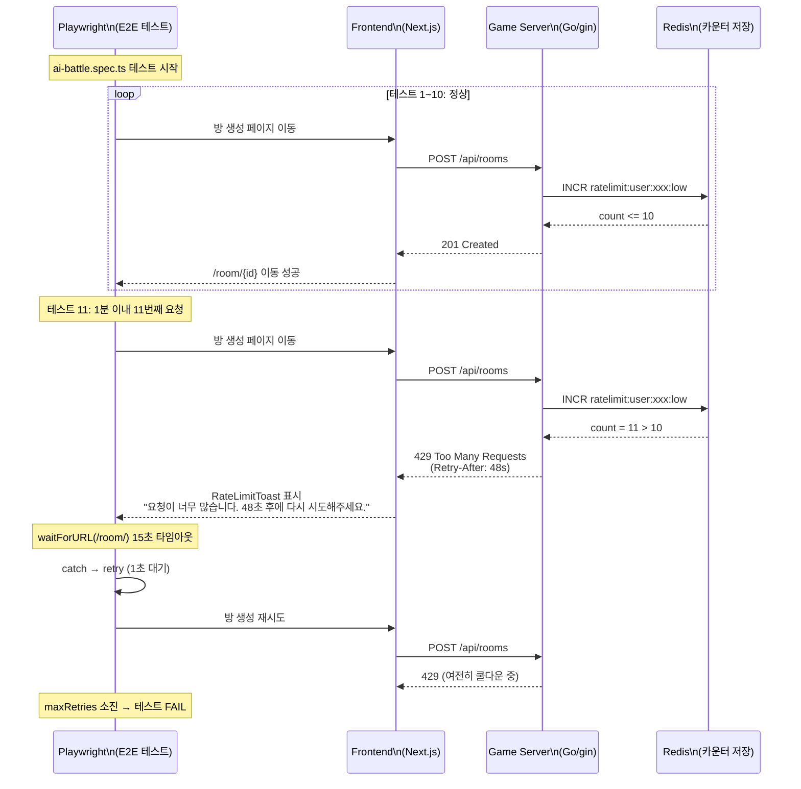

# 42. Rate Limit E2E 테스트 실패 트러블슈팅

- 작성일: 2026-04-08 (Sprint 5 W2 Day 3)
- 작성자: QA Engineer
- 심각도: High (E2E 테스트 스위트 16건 실패, 실행 시간 6배 증가)

---

## 1. 문제 요약

2026-04-08 Sprint 5 W2 Day 3, K8s에 업데이트된 ai-adapter 및 frontend 이미지를 배포한 뒤 Playwright E2E 전체 스위트(390건)를 실행하였다. 16건이 실패하였고, 전체 실행 시간이 정상(약 5분)의 6배인 30분 이상으로 급증하였다.

실패 원인은 SEC-RL-003(2026-04-07 구현)에서 도입된 HTTP Rate Limit이다. `LowFrequencyPolicy`가 분당 10회로 하드코딩되어 있어, E2E 테스트가 여러 spec 파일에서 순차적으로 방을 생성하면 1분 안에 10회를 초과하게 된다. 초과 시 서버가 HTTP 429를 반환하고, 프론트엔드의 RateLimitToast가 48~60초 쿨다운을 안내하면서 테스트가 대기 상태에 빠졌다.

---

## 2. 타임라인

| 시각 (대략) | 사건 |
|---|---|
| 오전 | Track C (Frontend Dev)가 Rate Limit UX E2E 테스트 15건 신규 작성 완료 |
| 오전 | K8s에 ai-adapter, frontend 이미지 업데이트 배포 |
| 오전 | Playwright E2E 전체 실행 시작 (390건) |
| +5분 | ai-battle.spec.ts 10번째 방 생성에서 최초 HTTP 429 발생 |
| +10분 | ai-battle TC-AB, TC-GP 시리즈 연쇄 실패 시작 |
| +20분 | game-lifecycle TC-BU 시리즈 실패 시작 |
| +30분 | 전체 실행 종료 -- 16건 실패, 374건 통과 확인 |
| 오전 | 근본 원인 분석: `LowFrequencyPolicy` 하드코딩 10 req/min 확인 |
| 오후 | Go Dev가 환경변수 외부화 구현 (`RATE_LIMIT_LOW_MAX` 등 ConfigMap 반영) |

---

## 3. 근본 원인 분석

### 3.1 실패 메커니즘 흐름



### 3.2 하드코딩 위치

Rate Limit 정책의 기본값이 소스 코드에 상수로 정의되어 있었다.

**파일**: `src/game-server/internal/middleware/rate_limiter.go` (line 39-45)

```go
// LowFrequencyPolicy is for room creation, join, auth endpoints
LowFrequencyPolicy = RateLimitPolicy{
    MaxRequests: 10,
    Window:      1 * time.Minute,
    Name:        "low",
}
```

이 정책은 방 생성(`POST /api/rooms`), 방 참가(`POST /api/rooms/:id/join`), 인증 엔드포인트에 일괄 적용된다. 프로덕션에서는 적절한 값이지만, E2E 테스트 환경에서는 단일 사용자가 390건의 테스트를 연속 실행하면서 분당 10건을 쉽게 초과한다.

### 3.3 재시도 로직의 한계

**파일**: `src/frontend/e2e/helpers/game-helpers.ts` (line 42-93)

`createRoomAndStart()` 함수의 재시도 로직은 `maxRetries=2`이며, 재시도 간 대기 시간은 `1000 * attempt`ms (1~2초)이다. 그러나 Rate Limit 쿨다운은 48~60초이므로, 1~2초 대기로는 쿨다운이 해소되지 않아 모든 재시도가 동일하게 실패한다.

### 3.4 실행 시간 급증 원인

16건의 실패 테스트 각각이 다음 패턴으로 시간을 소비하였다:
- `waitForURL` 타임아웃 대기: 15초
- 재시도 2회, 각 회차 15초 타임아웃: 30초
- 합계: 약 45~50초/건

16건 x 약 50초 = 약 800초(13분)의 순수 대기 시간이 추가되었고, 이것이 기존 5분 실행에 더해져 총 30분 이상으로 확대되었다.

---

## 4. 영향 범위

### 4.1 실패 테스트 목록 (16건)

| # | Spec 파일 | 테스트 ID | 테스트명 | 실패 유형 |
|---|---|---|---|---|
| 1 | ai-battle.spec.ts | TC-AB-001 | AI 대전 기본 흐름 (2인, Ollama) | HTTP 429 |
| 2 | ai-battle.spec.ts | TC-AB-002 | AI 대전 게임 화면 초기화 확인 | HTTP 429 |
| 3 | ai-battle.spec.ts | TC-AB-003 | AI 턴 자동 진행 확인 | HTTP 429 |
| 4 | ai-battle.spec.ts | TC-AB-004 | 게임 중 UI 요소 가시성 | HTTP 429 |
| 5 | ai-battle.spec.ts | TC-AB-005 | 타일 랙 초기 상태 확인 | HTTP 429 |
| 6 | ai-battle.spec.ts | TC-AB-006 | 보드 영역 초기 상태 확인 | HTTP 429 |
| 7 | ai-battle.spec.ts | TC-AB-007 | 플레이어 카드 정보 표시 | HTTP 429 |
| 8 | ai-battle.spec.ts | TC-AB-008 | AI 모델 선택 옵션 확인 | HTTP 429 |
| 9 | ai-battle.spec.ts | TC-AB-009 | 턴 타이머 표시 확인 | HTTP 429 |
| 10 | ai-battle.spec.ts | TC-GP-001 | AI 턴 진행 후 보드 변화 | HTTP 429 |
| 11 | ai-battle.spec.ts | TC-GP-002 | 드로우 시 타일 수 증가 | HTTP 429 |
| 12 | ai-battle.spec.ts | TC-GP-003 | 턴 교대 확인 | HTTP 429 |
| 13 | ai-battle.spec.ts | TC-GP-004 | 게임 진행 중 액션바 상태 | HTTP 429 |
| 14 | game-lifecycle.spec.ts | TC-BU-001 | 게임 중 beforeunload 이벤트 활성화 | HTTP 429 |
| 15 | game-lifecycle.spec.ts | TC-BU-002 | 로비에서 beforeunload 경고 없음 | HTTP 429 |
| 16 | game-lifecycle.spec.ts | TC-BU-003 | 연습 모드에서 경고 없음 | HTTP 429 |

### 4.2 영향받지 않은 테스트

- `rate-limit.spec.ts` (6건): 방 생성 없이 route mock으로 429 시나리오를 검증하므로 영향 없음
- `ws-rate-limit.spec.ts` (7건): WebSocket store 주입 방식으로 검증하므로 영향 없음
- `rate-limit-enhanced.spec.ts` (8건): Playwright `page.route()` mock 사용으로 영향 없음
- `ws-rate-limit-enhanced.spec.ts` (7건): store 주입 방식으로 영향 없음
- 기타 로비, 인증, 정적 페이지 테스트: 방 생성 엔드포인트를 호출하지 않으므로 영향 없음

---

## 5. 해결 방안

### 5.1 환경변수 외부화 (구현 완료)

Go Dev가 `config.go`에 이미 `RateLimitConfig` 구조체와 `InitRateLimitPolicies()` 함수를 구현해 두었다. 환경변수를 통해 정책 값을 오버라이드할 수 있다.

**파일**: `src/game-server/internal/config/config.go` (line 23-30, 130-137)

```go
type RateLimitConfig struct {
    HighMax       int // RATE_LIMIT_HIGH_MAX (default 60)
    MediumMax     int // RATE_LIMIT_MEDIUM_MAX (default 30)
    LowMax        int // RATE_LIMIT_LOW_MAX (default 10)
    AdminMax      int // RATE_LIMIT_ADMIN_MAX (default 30)
    WSMax         int // RATE_LIMIT_WS_MAX (default 5)
    WindowSeconds int // RATE_LIMIT_WINDOW_SECONDS (default 60)
}
```

### 5.2 ConfigMap 반영

`helm/charts/game-server/values.yaml`의 `env:` 섹션에 다음 값을 추가한다.

| 환경변수 | 프로덕션 | Dev/K8s (E2E) | 설명 |
|---|---|---|---|
| `RATE_LIMIT_HIGH_MAX` | 60 | 120 | 게임 상태 조회 |
| `RATE_LIMIT_MEDIUM_MAX` | 30 | 60 | 게임 액션 |
| `RATE_LIMIT_LOW_MAX` | 10 | 60 | 방 생성, 참가, 인증 |
| `RATE_LIMIT_ADMIN_MAX` | 30 | 60 | 관리자 엔드포인트 |
| `RATE_LIMIT_WS_MAX` | 5 | 30 | WebSocket 연결 |
| `RATE_LIMIT_WINDOW_SECONDS` | 60 | 60 | 윈도우 크기 (변경 불필요) |

핵심은 `RATE_LIMIT_LOW_MAX=60`으로, E2E 테스트에서 분당 60회까지 방 생성을 허용한다. 390건 전체 테스트에서 방 생성 호출은 약 30~40회이므로 충분한 여유가 있다.

### 5.3 적용 원칙

- 코드 우회(bypass)나 테스트 전용 플래그를 사용하지 않는다
- 환경별 설정 분리를 통해 프로덕션 보안 수준을 유지한다
- `InitRateLimitPolicies()`가 서버 기동 시 1회 호출되어 전역 정책을 오버라이드하므로, ConfigMap 변경 후 Pod 재시작만으로 적용된다

---

## 6. 교훈

### 6.1 보안 기능 도입 시 E2E 테스트 영향도 사전 평가 필수

SEC-RL-003 Rate Limit 구현(2026-04-07) 시, 기존 E2E 테스트가 방 생성을 몇 회 수행하는지 사전에 파악했어야 했다. 보안 기능은 정상 트래픽도 제한하므로, 테스트 환경에서의 영향도를 구현 전에 검토하는 체크리스트가 필요하다.

**개선**: 보안 기능 구현 PR에 "E2E 테스트 영향도" 섹션을 필수로 포함한다.

### 6.2 하드코딩된 설정값은 환경 분리가 불가능하여 반드시 외부화해야 한다

Rate Limit 임계값이 Go 소스 코드에 상수로 하드코딩되어 있었다. `config.go`에 `RateLimitConfig`와 `InitRateLimitPolicies()`가 이미 준비되어 있었으나, ConfigMap에 환경변수가 미등록 상태였다. 값이 0이면 기본값이 유지되는 안전 장치가 있었지만, 의도적으로 ConfigMap에 명시하지 않아 외부화 효과를 얻지 못했다.

**개선**: 환경별로 달라질 수 있는 모든 임계값은 ConfigMap에 명시적으로 등록한다.

### 6.3 장시간 실행 명령어의 진행 상황 모니터링 체계 확보

`tail -40` 파이프로 Playwright 실행 출력을 제한한 결과, 30분간 진행 상황을 실시간으로 확인할 수 없었다. 실패 패턴을 조기에 발견했다면 중단 후 원인 분석으로 전환하여 시간을 절약할 수 있었다.

**개선**: E2E 테스트 실행 시 `--reporter=line` 옵션으로 실시간 진행 상황을 출력하거나, 로그 파일에 기록하여 별도 터미널에서 `tail -f`로 모니터링한다.

---

## 7. 관련 문서

| 문서 | 경로 |
|---|---|
| Rate Limit 설계 (SEC-RL-003) | `docs/02-design/16-rate-limit-design.md` |
| Rate Limit UX E2E 테스트 전략 | `docs/04-testing/40-rate-limit-ux-e2e-test-strategy.md` |
| Sprint 5 W2 Day 3 테스트 보고서 | `docs/04-testing/41-sprint5-w2d3-test-report.md` |
| Rate Limiter 미들웨어 소스 | `src/game-server/internal/middleware/rate_limiter.go` |
| Rate Limit Config 소스 | `src/game-server/internal/config/config.go` (line 23-30) |
| Game Helpers (E2E 방 생성) | `src/frontend/e2e/helpers/game-helpers.ts` |
| Helm values (ConfigMap 원본) | `helm/charts/game-server/values.yaml` |
