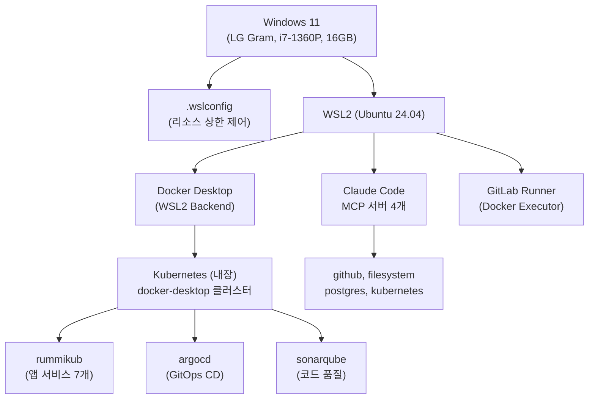
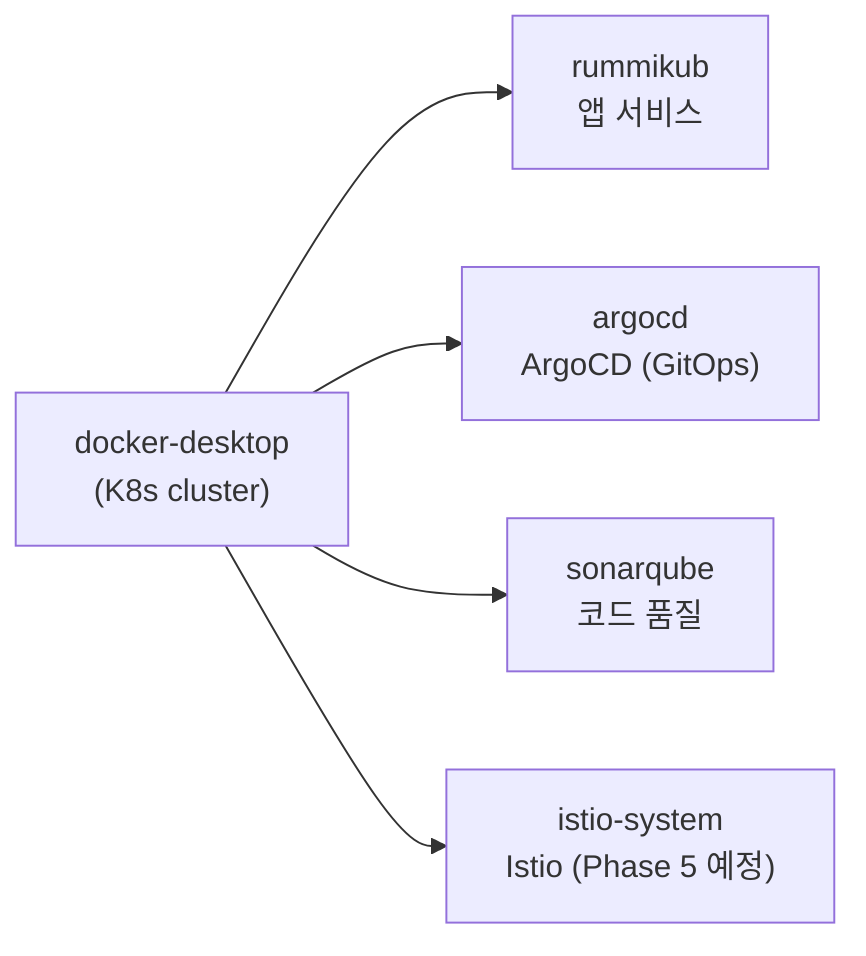
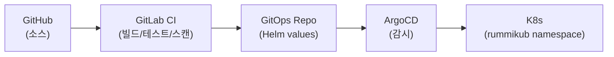
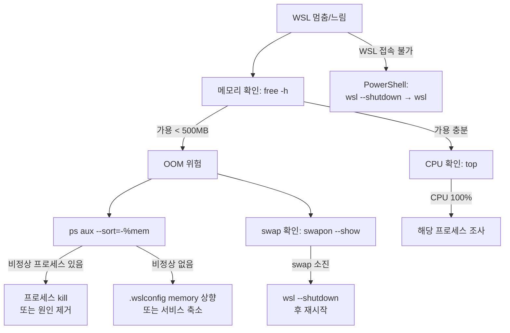
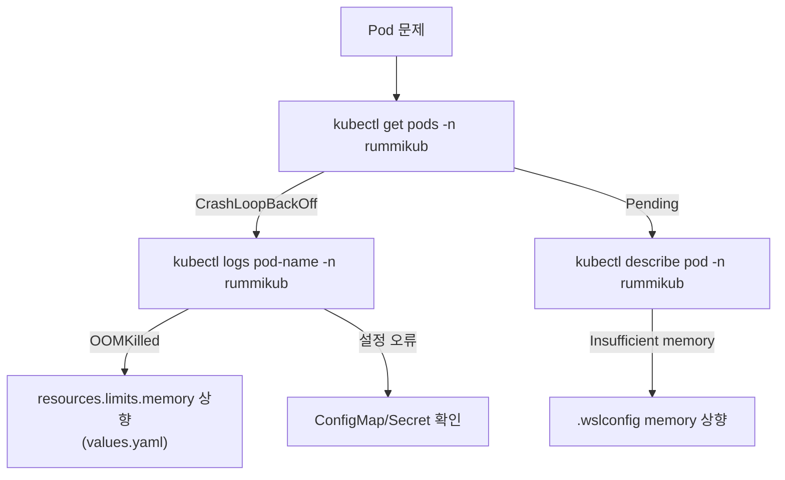
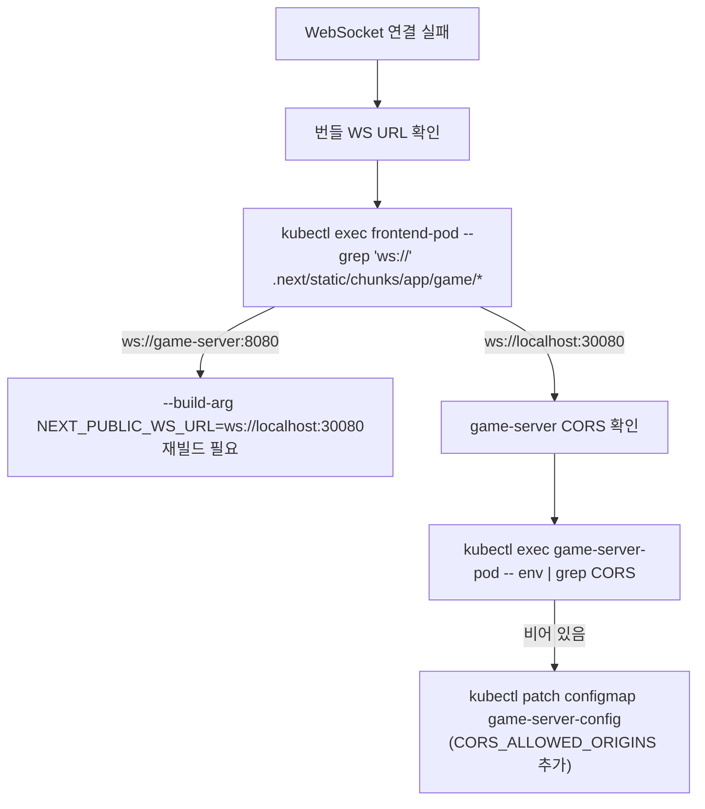

# 로컬 인프라 구성 가이드

## 1. 개요

RummiArena의 로컬 개발/테스트 인프라 전체 구성을 정리한다.
개별 도구의 설치·설정은 [도구 매뉴얼](../00-tools/00-index.md)을 참조하고, 이 문서는 **전체 흐름과 통합 지점**에 집중한다.

> **현재 상태 (Sprint 4 기준)**: 모든 서비스가 K8s(rummikub namespace)에서 Running. Docker Compose는 더 이상 사용하지 않음.

## 2. 인프라 스택 구조



## 3. 리소스 할당 전략

### 3.1 하드웨어 제약

| 항목 | 사양 |
|------|------|
| CPU | Intel i7-1360P (4P+8E = 12코어, 16스레드) |
| RAM | 16GB (LPDDR5) |
| Storage | NVMe SSD |

### 3.2 .wslconfig 리소스 배분 (현재)

```ini
[wsl2]
memory=10GB       # WSL2에 10GB, Windows에 ~6GB
swap=4GB          # OOM 안전 마진
processors=6      # 12코어 중 50%

[experimental]
autoMemoryReclaim=dropcache   # 미사용 캐시 메모리 즉시 반환
sparseVhd=true                # VHD 디스크 자동 축소
```

> 상세: [23-wslconfig.md](../00-tools/23-wslconfig.md)

### 3.3 서비스별 메모리 실측 (Sprint 4 기준)

| 서비스 | 메모리 | 비고 |
|--------|--------|------|
| WSL2 커널 + systemd | ~300MB | 고정 |
| Docker Engine | ~200MB | 고정 |
| Claude Code + MCP | ~400MB | MCP 4개 기준 |
| K8s 컴포넌트 | ~500MB | API server, etcd, scheduler 등 |
| PostgreSQL (K8s) | ~100MB | idle 기준 |
| Redis (K8s) | ~50MB | |
| frontend (K8s) | ~200MB | Next.js standalone |
| game-server (K8s) | ~128MB | Go (limits 256Mi) |
| ai-adapter (K8s) | ~256MB | NestJS |
| ollama (K8s) | ~800MB | gemma3:1b 모델 로드 시 |
| admin (K8s) | ~200MB | Next.js standalone |
| ArgoCD | ~400MB | 실행 시 |
| **합계** | **~3.5GB** | ArgoCD 제외 ~3.1GB |
| **가용 여유** | **~6.5GB** | SonarQube, 빌드 등에 활용 |

### 3.4 교대 실행 전략

| 모드 | 실행 서비스 | 메모리 예상 |
|------|------------|------------|
| **개발/테스트 모드 (기본)** | K8s 앱 7개 + Claude Code | ~4GB |
| CI 모드 | K8s 앱 + GitLab Runner + SonarQube | ~6GB |
| AI 실험 모드 | K8s 앱 + Ollama gemma3:1b | ~4GB |
| 전체 스택 | K8s 앱 + ArgoCD + Claude | ~5GB |

> SonarQube와 Ollama 동시 실행 시 ~8GB → .wslconfig memory 상향 필요

## 4. Kubernetes 구성 현황 (Sprint 4)

### 4.1 네임스페이스 구조



### 4.2 rummikub namespace 현재 Pod 목록

```
NAME                           READY   STATUS    AGE
admin-xxxxx                    1/1     Running   -
ai-adapter-xxxxx               1/1     Running   -
frontend-xxxxx                 1/1     Running   -
game-server-xxxxx              1/1     Running   -
ollama-xxxxx                   1/1     Running   -
postgres-xxxxx                 1/1     Running   -
redis-xxxxx                    1/1     Running   -
```

```bash
# 현재 상태 확인
kubectl get pods -n rummikub
kubectl get svc -n rummikub
```

### 4.3 배포 방식



### 4.4 로컬 빌드 & 배포 (개발 시)

```bash
# Frontend 재빌드 (NEXT_PUBLIC_WS_URL 필수 build-arg)
cd src/frontend
docker build \
  --build-arg NEXT_PUBLIC_WS_URL=ws://localhost:30080 \
  -t rummiarena/frontend:dev .
kubectl rollout restart deployment/frontend -n rummikub

# game-server 재빌드
cd src/game-server
docker build -t rummiarena/game-server:dev .
kubectl rollout restart deployment/game-server -n rummikub

# AI Adapter 재빌드
cd src/ai-adapter
docker build -t rummiarena/ai-adapter:dev .
kubectl rollout restart deployment/ai-adapter -n rummikub
```

> **주의**: `NEXT_PUBLIC_WS_URL`은 빌드 타임에 번들에 베이킹됨. `--build-arg` 없이 빌드하면 `ws://game-server:8080`(클러스터 내부 DNS)으로 고정되어 브라우저에서 WS 연결 불가.

## 5. 서비스 포트 매핑 (현재)

| 서비스 | 접근 방법 | 포트 | 비고 |
|--------|----------|------|------|
| Frontend | NodePort | **30000** | http://localhost:30000 |
| game-server | NodePort | **30080** | REST API + WebSocket |
| admin | NodePort | **30001** | http://localhost:30001 |
| PostgreSQL | ClusterIP 내부 전용 | 5432 | postgres.rummikub.svc.cluster.local |
| Redis | ClusterIP 내부 전용 | 6379 | redis.rummikub.svc.cluster.local |
| ai-adapter | ClusterIP 내부 전용 | 8081 | game-server에서 직접 호출 |
| ollama | ClusterIP 내부 전용 | 11434 | ollama.rummikub.svc.cluster.local |

> **Traefik Ingress Gateway**: Sprint 4 이후 도입 예정. 현재는 NodePort로 직접 접근. 상세: [02-gateway-architecture.md](./02-gateway-architecture.md)

## 6. Docker Compose (레거시)

Sprint 2 이전에는 `docker-compose.yml`로 PostgreSQL을 로컬 실행했으나, **Sprint 2부터 PostgreSQL이 K8s로 이전**되어 Docker Compose는 더 이상 사용하지 않는다.

```bash
# (레거시) 로컬 PostgreSQL 확인 — 현재 미사용
docker compose ps
```

> K8s PostgreSQL 접근: `kubectl exec -it postgres-xxxxx -n rummikub -- psql -U rummikub -d rummikub`

## 7. 트러블슈팅 의사결정 트리

### WSL이 멈추거나 응답 없음


### K8s Pod 문제


### WS 연결 실패 시


## 8. 주의사항

1. **다른 프로젝트 컨테이너 관리**: `kp-*` 등 다른 프로젝트 컨테이너 절대 삭제 금지
2. **MCP 서버 주의**: `@thelord/mcp-server-docker-npx`는 프로세스 fork 버그가 있어 사용 금지. Docker 연동은 Bash 명령으로 대체
3. **.wslconfig 변경 시**: 반드시 `wsl --shutdown` 후 재시작 필요. Docker Desktop도 함께 재시작됨
4. **switch-wslconfig.sh**: RummiArena/hybrid-rag 프로젝트 간 .wslconfig 프로파일 전환 스크립트 사용
5. **NEXT_PUBLIC_WS_URL 빌드 타임 베이킹**: 프론트엔드 이미지 빌드 시 반드시 `--build-arg` 지정 필요

## 9. 관련 문서

| 문서 | 내용 |
|------|------|
| [23-wslconfig.md](../00-tools/23-wslconfig.md) | .wslconfig 상세 설정 |
| [01-docker-desktop.md](../00-tools/01-docker-desktop.md) | Docker Desktop 설치·설정 |
| [02-kubernetes.md](../00-tools/02-kubernetes.md) | kubectl 사용법 |
| [03-helm.md](../00-tools/03-helm.md) | Helm Chart 관리 |
| [05-gitlab-ci.md](../00-tools/05-gitlab-ci.md) | CI 파이프라인 |
| [06-argocd.md](../00-tools/06-argocd.md) | GitOps CD |
| [02-gateway-architecture.md](./02-gateway-architecture.md) | API 게이트웨이 (Traefik) 계획 |
| [01-architecture.md](../02-design/01-architecture.md) | 시스템 아키텍처 |

> **문서 이력**
> | 버전 | 날짜 | 작성자 | 내용 |
> |------|------|--------|------|
> | 1.0 | 2026-03-13 | Claude | 초안 (Docker Compose + K8s 계획) |
> | 2.0 | 2026-03-23 | Claude | Sprint 4 현행화 — 모든 서비스 K8s 이전 완료, NodePort 포트 매핑, 빌드 주의사항 추가 |
