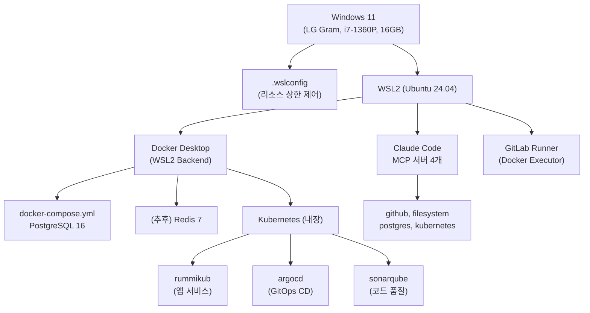
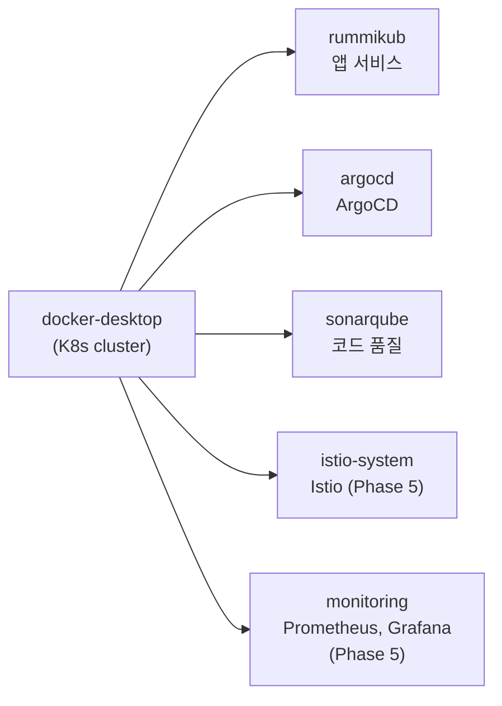
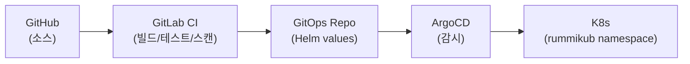
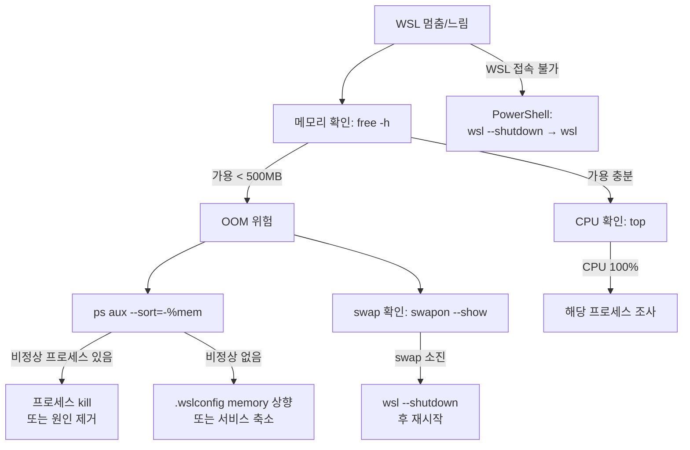
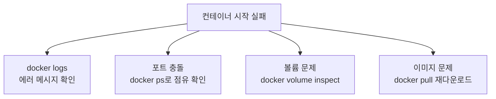

# 로컬 인프라 구성 가이드

## 1. 개요

RummiArena의 로컬 개발/테스트 인프라 전체 구성을 정리한다.
개별 도구의 설치·설정은 [도구 매뉴얼](../00-tools/00-index.md)을 참조하고, 이 문서는 **전체 흐름과 통합 지점**에 집중한다.

## 2. 인프라 스택 구조



## 3. 리소스 할당 전략

### 3.1 하드웨어 제약

| 항목 | 사양 |
|------|------|
| CPU | Intel i7-1360P (4P+8E = 12코어, 16스레드) |
| RAM | 16GB (LPDDR5) |
| Storage | NVMe SSD |

### 3.2 .wslconfig 리소스 배분 (현재)

```ini
[wsl2]
memory=10GB       # WSL2에 10GB, Windows에 ~6GB
swap=4GB          # OOM 안전 마진
processors=6      # 12코어 중 50%

[experimental]
autoMemoryReclaim=dropcache   # 미사용 캐시 메모리 즉시 반환
sparseVhd=true                # VHD 디스크 자동 축소
```

> 상세: [23-wslconfig.md](../00-tools/23-wslconfig.md)

### 3.3 서비스별 메모리 예산 (10GB 기준)

| 서비스 | 예상 사용량 | 비고 |
|--------|------------|------|
| WSL2 커널 + systemd | ~300MB | 고정 |
| Docker Engine | ~200MB | 고정 |
| Claude Code + MCP | ~400MB | MCP 4개 기준 |
| PostgreSQL | ~100MB | idle 기준 |
| Redis | ~50MB | 추후 추가 |
| K8s 컴포넌트 | ~500MB | API server, etcd, scheduler 등 |
| ArgoCD | ~300MB | 추후 |
| 앱 서비스 (frontend, server, adapter) | ~1.5GB | 추후, 동시 3개 기준 |
| **합계** | **~3.4GB** | 현재 Phase (Sprint 0) |
| **가용 여유** | **~6.6GB** | 빌드, 테스트 등에 활용 |

### 3.4 교대 실행 전략

16GB RAM에서 모든 서비스를 동시에 실행할 수 없다. Phase별로 서비스를 교대 운영한다.

| 모드 | 실행 서비스 | 메모리 예상 |
|------|------------|------------|
| 개발 모드 | PG + Redis + 앱 서비스 + Claude Code | ~5GB |
| CI 모드 | PG + GitLab Runner + SonarQube | ~6GB |
| 배포 테스트 모드 | PG + Redis + K8s 앱 + ArgoCD | ~6GB |
| AI 실험 모드 | PG + Redis + AI Adapter + Ollama | ~8GB (Ollama 모델 크기에 따라) |

> SonarQube와 Ollama는 동시 실행 불가. 순차 사용.

## 4. Docker Compose 구성

### 4.1 현재 구성 (Sprint 0)

```yaml
# docker-compose.yml
services:
  postgres:
    image: postgres:16-alpine
    container_name: rummikub-postgres
    environment:
      POSTGRES_USER: rummikub
      POSTGRES_PASSWORD: rummikub123
      POSTGRES_DB: rummikub
    ports:
      - "5432:5432"
    volumes:
      - rummikub_pgdata:/var/lib/postgresql/data
    restart: unless-stopped

volumes:
  rummikub_pgdata:
    external: true
```

### 4.2 확장 계획 (Sprint 1~)

```yaml
# 추후 추가 예정
services:
  redis:
    image: redis:7-alpine
    ports:
      - "6379:6379"
    restart: unless-stopped
```

### 4.3 주요 명령어

```bash
# 시작
docker compose up -d

# 상태 확인
docker compose ps

# 로그
docker compose logs -f postgres

# 중지
docker compose down

# 볼륨 포함 완전 삭제 (주의!)
docker compose down -v
```

## 5. Kubernetes 구성 계획

### 5.1 네임스페이스 구조



### 5.2 배포 방식



> 상세: [06-argocd.md](../00-tools/06-argocd.md), [05-gitlab-ci.md](../00-tools/05-gitlab-ci.md)

## 6. 서비스 포트 매핑

| 서비스 | 포트 | 프로토콜 |
|--------|------|----------|
| PostgreSQL | 5432 | TCP |
| Redis | 6379 | TCP (추후) |
| Frontend (Next.js) | 3000 | HTTP (추후) |
| Game Server | 8080 | HTTP/WS (추후) |
| AI Adapter | 8081 | HTTP (추후) |
| Admin Panel | 3001 | HTTP (추후) |
| SonarQube | 9000 | HTTP (추후) |
| ArgoCD | 8443 | HTTPS (추후) |

## 7. 트러블슈팅 의사결정 트리

### WSL이 멈추거나 응답 없음


### Docker 컨테이너 문제


## 8. 주의사항

1. **다른 프로젝트 컨테이너 관리**: `kp-*` 등 다른 프로젝트 컨테이너가 중지 상태로 남아 있을 수 있음. 디스크만 차지하므로 필요 시 `docker rm`으로 정리
2. **MCP 서버 주의**: `@thelord/mcp-server-docker-npx`는 프로세스 fork 버그가 있어 사용 금지. Docker 연동은 Bash 명령으로 대체
3. **.wslconfig 변경 시**: 반드시 `wsl --shutdown` 후 재시작 필요. Docker Desktop도 함께 재시작됨
4. **switch-wslconfig.sh**: RummiArena/hybrid-rag 프로젝트 간 .wslconfig 프로파일 전환 스크립트 사용

## 9. 관련 문서

| 문서 | 내용 |
|------|------|
| [23-wslconfig.md](../00-tools/23-wslconfig.md) | .wslconfig 상세 설정 |
| [01-docker-desktop.md](../00-tools/01-docker-desktop.md) | Docker Desktop 설치·설정 |
| [02-kubernetes.md](../00-tools/02-kubernetes.md) | kubectl 사용법 |
| [03-helm.md](../00-tools/03-helm.md) | Helm Chart 관리 |
| [05-gitlab-ci.md](../00-tools/05-gitlab-ci.md) | CI 파이프라인 |
| [06-argocd.md](../00-tools/06-argocd.md) | GitOps CD |
| [01-architecture.md](../02-design/01-architecture.md) | 시스템 아키텍처 |
