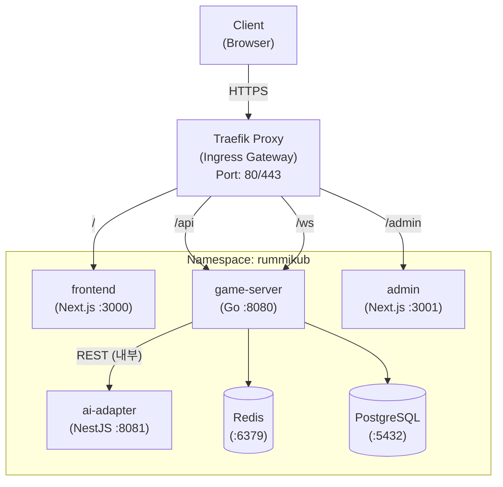
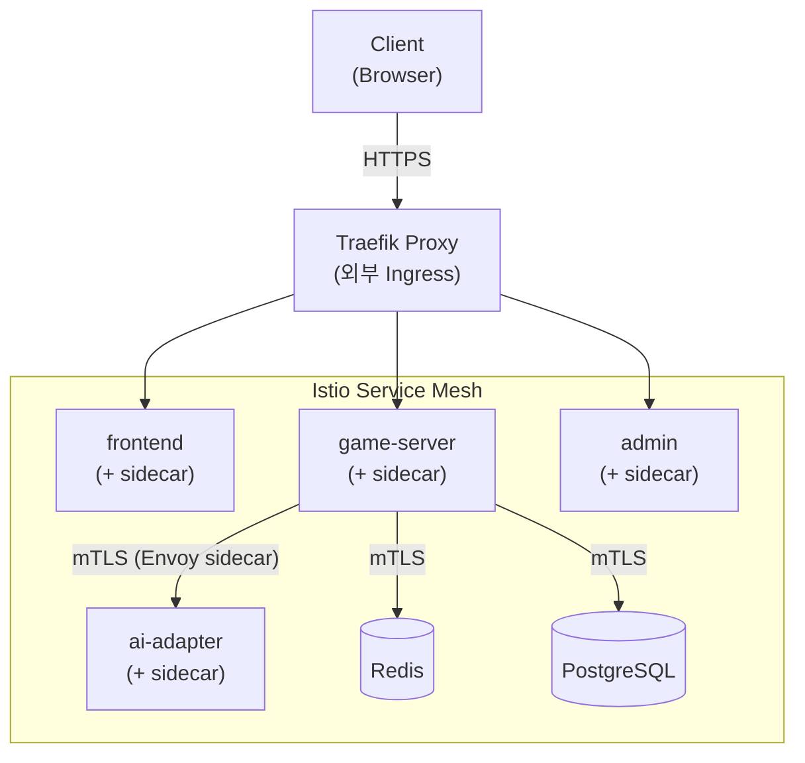
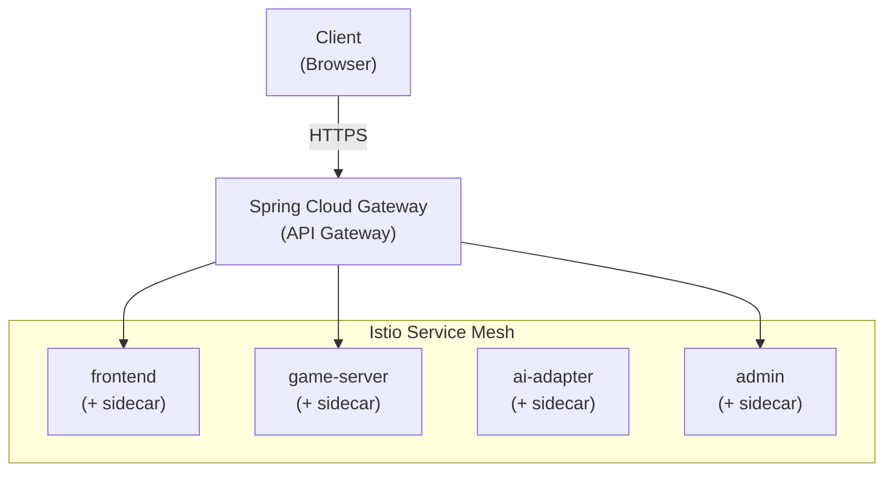
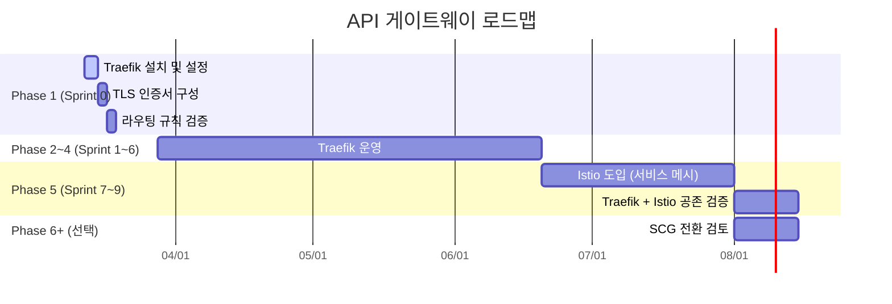
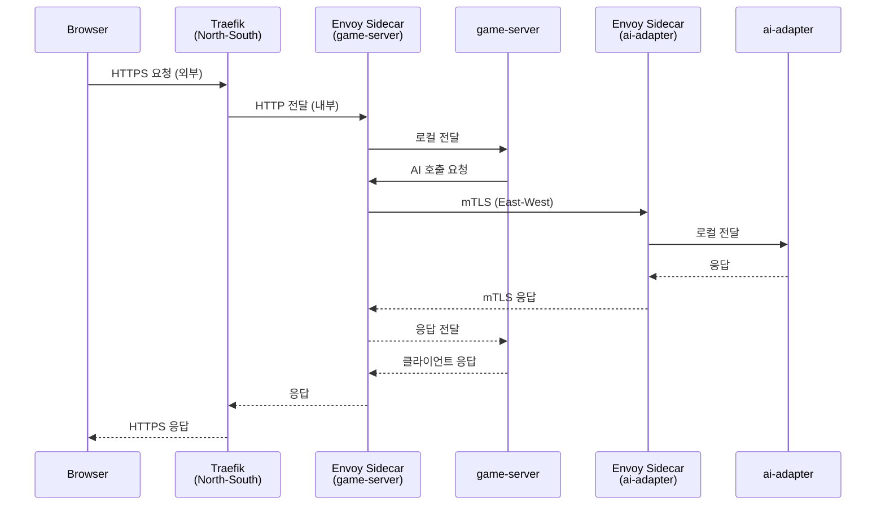

# API 게이트웨이 구축계획서

## 현재 상태 (Sprint 4 기준)

> **Traefik은 아직 배포되지 않았다.** 현재는 K8s NodePort로 직접 접근 중.

| 서비스 | 현재 접근 방식 | URL |
|--------|--------------|-----|
| Frontend | NodePort 30000 | http://localhost:30000 |
| game-server REST | NodePort 30080 | http://localhost:30080 |
| game-server WS | NodePort 30080 | ws://localhost:30080/ws |
| admin | NodePort 30001 | http://localhost:30001 |

**Traefik 도입 시점**: Sprint 5+ (현재 NodePort로 테스트 충분)
- 로컬 개발 환경에서는 NodePort 직접 접근이 더 단순하고 빠름
- 단일 도메인(`rummikub.localhost`)으로 통합 접근이 필요해지는 시점에 도입
- TLS 인증서 자동화가 필요한 시점(클라우드 배포)에 필수화

---

## 1. 개요

### 1.1 배경

Kubernetes 커뮤니티가 **Ingress NGINX 프로젝트의 지원 종료(EOL)**를 **2026년 3월**부로 공식 발표하였다.
종료 후에는 업데이트, 버그 수정, 보안 패치가 모두 중단된다.

**주요 종료 배경**:
- 소수 개발자(1~2명)의 야간/주말 유지보수에 의존하는 구조적 한계
- IngressNightmare 보안 취약점 발생 (CVE-2025-1974)
- 커뮤니티 프로젝트 지속 가능성 부재

이에 따라 RummiArena 프로젝트에서는 NGINX Ingress Controller를 채택하지 않고, 대안 게이트웨이를 선정한다.

### 1.2 목적

본 문서는 RummiArena의 API 게이트웨이 전략을 정의한다.

- Phase 1~4: **Traefik**을 Ingress 게이트웨이로 사용
- Phase 5: **Istio**를 서비스 메시(서비스 간 통신)로 도입
- Phase 6+: **Spring Cloud Gateway** 전환 가능성 검토

### 1.3 적용 범위

| 구분 | 범위 |
|------|------|
| 프로젝트 | RummiArena |
| 환경 | Docker Desktop Kubernetes (로컬) |
| 대상 서비스 | frontend, game-server, ai-adapter, admin |
| 적용 시점 | Sprint 0 (환경 구축) |

---

## 2. 게이트웨이 선정

### 2.1 후보 비교 분석

| 기준 | NGINX Ingress | Traefik | Envoy Gateway | Spring Cloud Gateway |
|------|--------------|---------|---------------|---------------------|
| 상태 | **EOL (2026-03)** | 활발한 개발 | 활발한 개발 | 활발한 개발 |
| 언어 | Go/C | **Go** | C++ | **Java** |
| K8s 통합 | Ingress API | Ingress + **Gateway API** | Gateway API | 자체 라우팅 |
| 메모리 | ~100MB | **~80MB** | ~150MB | **~300MB+ (JVM)** |
| 설치 복잡도 | 쉬움 | **쉬움 (Helm 한 줄)** | 중간 | 높음 (Spring Boot 앱) |
| WebSocket | 지원 | **지원** | 지원 | 지원 |
| TLS 종단 | 지원 | **지원 + Let's Encrypt 자동** | 지원 | 지원 |
| Dashboard | 없음 | **내장 (8080)** | 없음 | Spring Actuator |
| Istio 관계 | 별개 | **별개 (분리 깔끔)** | 같은 Envoy → 역할 혼동 | 별개 |

### 2.2 선정 결과: Traefik

**확정**: Traefik Proxy v3.x

**선정 근거**:

1. **NGINX Ingress EOL 회피**: 보안 패치/업데이트 중단 리스크 제거
2. **경량성**: ~80MB 메모리, 16GB RAM 장비에서 부담 최소
3. **Go 네이티브**: game-server(Go)와 기술 계열 일치
4. **Istio와 깔끔한 분리**: Envoy Gateway와 달리 Envoy 엔진을 공유하지 않아, Phase 5 Istio 도입 시 역할 혼동 없음
5. **간편한 설치/제거**: Helm chart 한 줄로 설치, 제거 시 깔끔
6. **내장 Dashboard**: 라우팅 상태를 UI로 즉시 확인 가능
7. **Gateway API 지원**: Kubernetes 차세대 표준 호환

**탈락 사유**:

| 후보 | 탈락 사유 |
|------|----------|
| NGINX Ingress | 2026-03 EOL, 보안 취약점 이력 |
| Envoy Gateway | Istio(Envoy)와 앞뒤 이중 구성 → 역할 혼동, 메모리 추가 부담 |
| Spring Cloud Gateway | Java/JVM 도입 → 폴리글랏 3언어, JVM 메모리 부담 (~300MB+) |

---

## 3. 트래픽 아키텍처

### 3.1 Phase 1~4: Traefik 단독 구성



> Redis, PostgreSQL, AI Adapter는 ClusterIP 서비스로 내부 통신만 허용. Traefik을 거치지 않는다.

### 3.2 Phase 5: Traefik + Istio 공존



**역할 분리**:

| 계층 | 담당 | 역할 |
|------|------|------|
| 외부 진입 (North-South) | **Traefik** | TLS 종단, 외부 라우팅, 인증 |
| 서비스 간 (East-West) | **Istio (Envoy sidecar)** | mTLS, 트래픽 관리, 관측성, Circuit Breaker |

> Istio Ingress Gateway는 사용하지 않는다. Traefik이 외부 트래픽을 담당하고, Istio는 서비스 간 통신(East-West)에만 집중한다.

### 3.3 Phase 6+: Spring Cloud Gateway 전환 (선택)



**전환 조건** (모두 충족 시 검토):
- Phase 5 Istio 도입 완료 후 안정화
- API 게이트웨이 수준의 고급 기능 필요 (Rate Limiting, API Key 관리, 요청 변환 등)
- JVM 메모리 여유 확보 (별도 서버 또는 32GB+ 장비)
- Java/Spring 학습 목적 추가

**전환 불필요 시**: Traefik을 계속 사용. Traefik 자체로도 충분한 Ingress 기능 제공.

---

## 4. Traefik 배포 계획

### 4.1 설치 방법

Helm chart를 이용하여 Docker Desktop Kubernetes에 설치한다.

```bash
# Traefik Helm 저장소 추가
helm repo add traefik https://traefik.github.io/charts
helm repo update

# Namespace 생성
kubectl create namespace traefik

# Traefik 설치 (커스텀 values)
helm install traefik traefik/traefik \
  --namespace traefik \
  --values helm/traefik/values.yaml
```

### 4.2 Helm Values 설정

```yaml
# helm/traefik/values.yaml

# 리소스 제한 (16GB RAM 장비 최적화)
resources:
  requests:
    cpu: "100m"
    memory: "64Mi"
  limits:
    cpu: "500m"
    memory: "128Mi"

# 포트 설정
ports:
  web:
    port: 8000
    expose:
      default: true
    exposedPort: 80
    protocol: TCP
  websecure:
    port: 8443
    expose:
      default: true
    exposedPort: 443
    protocol: TCP

# Dashboard 활성화 (개발 환경)
ingressRoute:
  dashboard:
    enabled: true
    matchRule: Host(`traefik.localhost`)

# 로그 설정
logs:
  general:
    level: INFO
  access:
    enabled: true
    format: json

# Gateway API 활성화 (차세대 표준 대비)
providers:
  kubernetesIngress:
    enabled: true
  kubernetesGateway:
    enabled: true

# replicas (로컬 환경이므로 1)
deployment:
  replicas: 1
```

### 4.3 라우팅 규칙

#### Ingress 리소스 (Phase 1~4)

```yaml
# helm/rummikub/templates/ingress.yaml
apiVersion: networking.k8s.io/v1
kind: Ingress
metadata:
  name: rummikub-ingress
  namespace: rummikub
  annotations:
    traefik.ingress.kubernetes.io/router.entrypoints: websecure
    traefik.ingress.kubernetes.io/router.tls: "true"
spec:
  ingressClassName: traefik
  tls:
    - hosts:
        - rummikub.localhost
      secretName: rummikub-tls
  rules:
    - host: rummikub.localhost
      http:
        paths:
          - path: /
            pathType: Prefix
            backend:
              service:
                name: frontend
                port:
                  number: 3000
          - path: /api
            pathType: Prefix
            backend:
              service:
                name: game-server
                port:
                  number: 8080
          - path: /ws
            pathType: Prefix
            backend:
              service:
                name: game-server
                port:
                  number: 8080
          - path: /admin
            pathType: Prefix
            backend:
              service:
                name: admin
                port:
                  number: 3001
```

#### WebSocket 지원 설정

```yaml
# Traefik Middleware - WebSocket 연결 유지
apiVersion: traefik.io/v1alpha1
kind: Middleware
metadata:
  name: websocket-headers
  namespace: rummikub
spec:
  headers:
    customRequestHeaders:
      Connection: "Upgrade"
      Upgrade: "websocket"
```

### 4.4 TLS 설정

개발 환경에서는 자체 서명 인증서(self-signed)를 사용한다.

```bash
# 자체 서명 인증서 생성
openssl req -x509 -nodes -days 365 \
  -newkey rsa:2048 \
  -keyout tls.key \
  -out tls.crt \
  -subj "/CN=rummikub.localhost"

# K8s Secret으로 등록
kubectl create secret tls rummikub-tls \
  --cert=tls.crt \
  --key=tls.key \
  -n rummikub
```

### 4.5 라우팅 규칙 상세

| 경로 | 대상 서비스 | 포트 | 프로토콜 | 설명 |
|------|-----------|------|----------|------|
| `/` | frontend | 3000 | HTTP | 게임 UI |
| `/api/*` | game-server | 8080 | HTTP | REST API |
| `/ws/*` | game-server | 8080 | WebSocket | 실시간 게임 통신 |
| `/admin/*` | admin | 3001 | HTTP | 관리자 대시보드 |
| `traefik.localhost` | Traefik Dashboard | 8080 | HTTP | 라우팅 상태 모니터링 |

---

## 5. 리소스 영향 분석

### 5.1 메모리 예산

기존 로컬 인프라 가이드(`05-deployment/01-local-infra-guide.md`)의 메모리 예산에 Traefik을 반영한다.

| 서비스 | 기존 예산 | 변경 |
|--------|----------|------|
| WSL 커널 | ~300MB | 변경 없음 |
| Docker 엔진 | ~200MB | 변경 없음 |
| Claude Code + MCP | ~400MB | 변경 없음 |
| PostgreSQL | ~100MB | 변경 없음 |
| Redis | ~50MB | 변경 없음 |
| K8s 시스템 | ~500MB | 변경 없음 |
| **Traefik** | - | **+80MB (신규)** |
| ArgoCD | ~300MB | 변경 없음 |
| App 서비스 | ~1.5GB | 변경 없음 |
| **합계** | ~3.4GB | **~3.5GB** |

> Traefik의 메모리 추가 부담은 ~80MB로 미미하다. 기존 10GB WSL 프로파일 내에서 여유 충분.

### 5.2 교대 실행 전략 반영

| 모드 | 서비스 구성 | 예상 메모리 |
|------|-----------|------------|
| Dev 모드 | PG + Redis + **Traefik** + App + Claude | ~6.5GB |
| CI 모드 | PG + GitLab Runner + SonarQube | ~6GB |
| Deploy 테스트 | PG + Redis + K8s + **Traefik** + ArgoCD | ~5GB |
| AI 실험 | PG + Redis + **Traefik** + AI Adapter + Ollama | ~7GB |

---

## 6. Phase 별 게이트웨이 로드맵



| Phase | 기간 | 게이트웨이 | 서비스 메시 | 비고 |
|-------|------|-----------|-----------|------|
| Phase 0~4 (Sprint 0~4) | 현재 | **NodePort 직접 접근** | 없음 | 로컬 개발 단순화 |
| Phase 5 (Sprint 5~6) | 미정 | **Traefik 도입** | 없음 | 단일 도메인 통합 필요 시 |
| Phase 6~7 (Sprint 7~9) | 미정 | Traefik (외부) | **Istio (내부)** | 역할 분리 공존 |
| Phase 8+ | 미정 | Traefik 또는 **SCG** | Istio | 전환은 선택 사항 |

---

## 7. Traefik ↔ Istio 역할 분리 상세

### 7.1 트래픽 흐름



### 7.2 역할 매트릭스

| 기능 | Traefik | Istio |
|------|---------|-------|
| 외부 트래픽 수신 | **O** | X |
| TLS 종단 | **O** | X (내부는 mTLS) |
| URL 기반 라우팅 | **O** | X |
| Host 기반 라우팅 | **O** | X |
| 서비스 간 mTLS | X | **O** |
| 트래픽 가중치 분배 | X | **O** |
| Circuit Breaker | X | **O** |
| 분산 트레이싱 | X | **O** |
| Rate Limiting | **O** (기본) | **O** (고급) |

---

## 8. 설치 검증 체크리스트

### 8.1 Traefik 설치 확인

```bash
# Pod 상태 확인
kubectl get pods -n traefik

# Service 확인 (LoadBalancer 또는 NodePort)
kubectl get svc -n traefik

# 대시보드 접속 확인
# http://traefik.localhost (또는 port-forward)
kubectl port-forward -n traefik svc/traefik 9000:9000
```

### 8.2 라우팅 검증

| 테스트 | 명령 | 기대 결과 |
|--------|------|----------|
| Frontend 접근 | `curl -k https://rummikub.localhost/` | 200 OK (Next.js) |
| API 접근 | `curl -k https://rummikub.localhost/api/health` | 200 OK (Go) |
| WebSocket | `wscat -c wss://rummikub.localhost/ws` | 연결 성공 |
| Admin 접근 | `curl -k https://rummikub.localhost/admin/` | 200 OK (Next.js) |
| Dashboard | `http://traefik.localhost:9000/dashboard/` | Traefik UI |

### 8.3 리소스 확인

```bash
# Traefik Pod 메모리 사용량 확인
kubectl top pod -n traefik

# 전체 리소스 현황
kubectl top nodes
```

---

## 9. 트러블슈팅

| 증상 | 원인 | 해결 |
|------|------|------|
| 503 Service Unavailable | 백엔드 서비스 미배포 | `kubectl get pods -n rummikub` 확인 |
| WebSocket 연결 끊김 | 타임아웃 설정 부족 | Traefik `readTimeout`/`writeTimeout` 조정 |
| TLS 인증서 오류 | Secret 미생성 또는 만료 | `kubectl get secret rummikub-tls -n rummikub` 확인 |
| Dashboard 접근 불가 | IngressRoute 미활성화 | `values.yaml`의 `ingressRoute.dashboard.enabled` 확인 |
| 404 Not Found | 라우팅 규칙 미매칭 | Traefik Dashboard에서 라우터 목록 확인 |
| Pod OOMKilled | 메모리 limit 초과 | `resources.limits.memory` 상향 조정 |

---

## 10. 참고 문서

| 문서 | 링크/위치 |
|------|----------|
| Ingress NGINX EOL 공지 | [nginxstore.com 안내](https://nginxstore.com/blog/kubernetes/ingress-nginx-지원-종료-안내-kubernetes-ingress-controller/) |
| Traefik 공식 문서 | https://doc.traefik.io/traefik/ |
| Traefik Helm Chart | https://github.com/traefik/traefik-helm-chart |
| Kubernetes Gateway API | https://gateway-api.sigs.k8s.io/ |
| 시스템 아키텍처 | `docs/02-design/01-architecture.md` |
| 로컬 인프라 가이드 | `docs/05-deployment/01-local-infra-guide.md` |
| 도구 체인 | `docs/01-planning/04-tool-chain.md` |
| Istio 구성 계획 | `docs/01-planning/04-tool-chain.md` §9 |

---

> **문서 이력**
> | 버전 | 날짜 | 작성자 | 내용 |
> |------|------|--------|------|
> | 1.0 | 2026-03-12 | Claude | 초안 작성 (Traefik 선정, 배포 계획, Phase별 로드맵) |
> | 1.1 | 2026-03-23 | Claude | Sprint 4 현행화 — Traefik 미배포 현황 반영, NodePort 직접 접근 상태 명시, Phase 로드맵 일정 갱신 |
