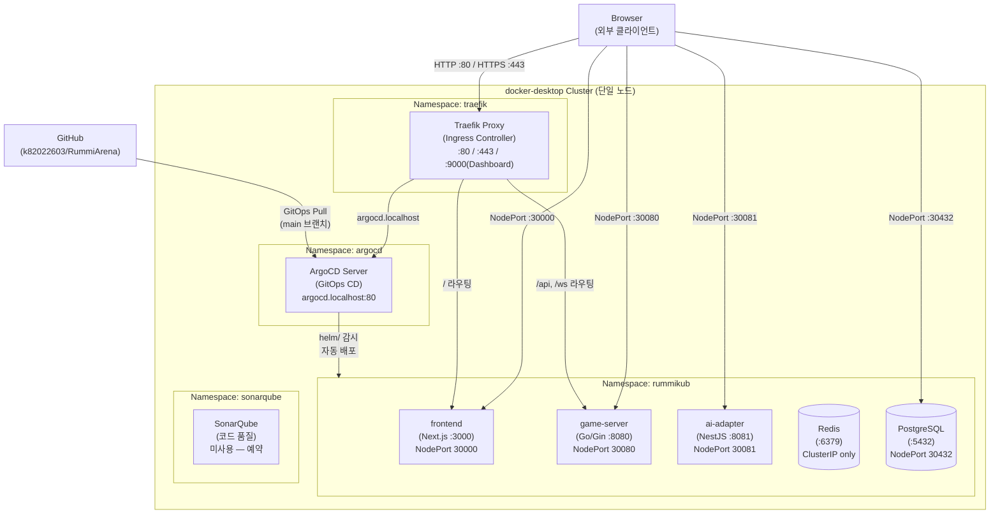
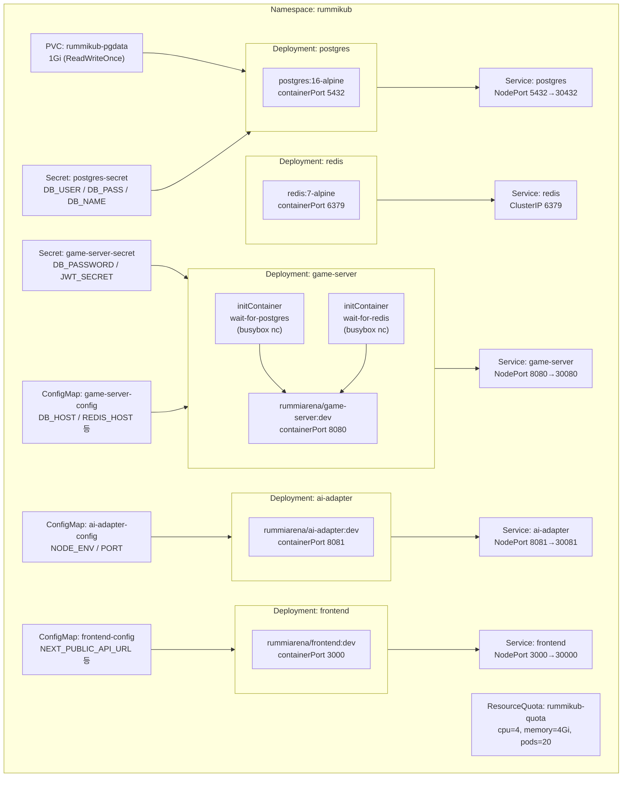
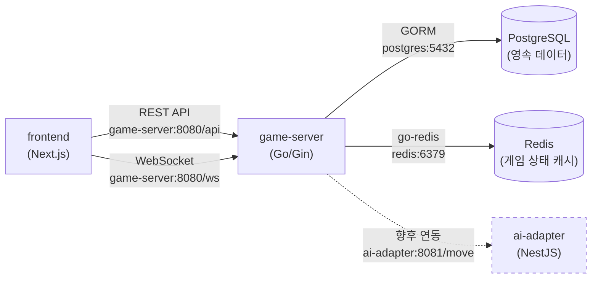
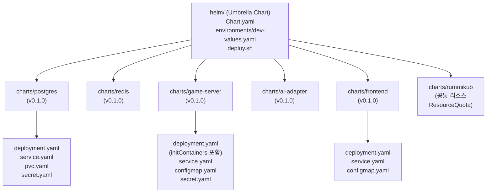
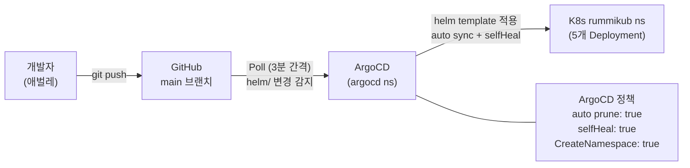
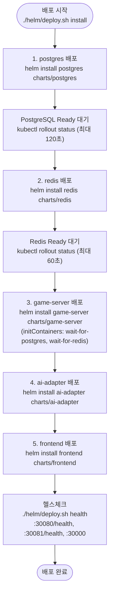

# K8s 인프라 구성도 및 배포 프로세스

> Phase 1 (Sprint 0) 완료 기준 문서
> 작성일: 2026-03-13 | 작성자: DevOps Agent

---

## 1. 클러스터 전체 구성도

RummiArena는 Docker Desktop Kubernetes(단일 노드) 위에서 실행된다.
클러스터는 4개 네임스페이스로 역할이 분리되어 있으며, 외부 트래픽은 Traefik Ingress를 통해 진입한다.



---

## 2. rummikub 네임스페이스 상세도

### 2.1 Deployment 및 Service 관계



### 2.2 서비스 간 내부 통신



> Redis와 PostgreSQL은 ClusterIP 또는 NodePort로 노출되나, 실제 앱 통신은 `svc.cluster.local` DNS를 통한 클러스터 내부 통신만 사용한다.
> ai-adapter 연동은 Sprint 1에서 구현 예정이다.

---

## 3. Helm Chart 구조



---

## 4. 배포 프로세스

### 4.1 GitOps 배포 흐름 (자동)



### 4.2 수동 배포 순서 (deploy.sh)

의존성 순서에 따라 하위 인프라부터 배포한다.



### 4.3 주요 배포 명령어

```bash
# 전체 설치 (최초)
./helm/deploy.sh install

# 업그레이드 (코드/설정 변경 후)
./helm/deploy.sh upgrade

# 상태 확인
./helm/deploy.sh status

# 헬스체크
./helm/deploy.sh health

# 전체 제거 (PVC는 수동 삭제 필요)
./helm/deploy.sh uninstall

# 개별 서비스 업그레이드
helm upgrade game-server helm/charts/game-server -n rummikub

# ArgoCD 수동 동기화 (자동 sync 대기 없이 즉시 반영)
argocd app sync rummikub
```

---

## 5. 포트 매핑 테이블

| 서비스 | 이미지 | ClusterIP Port | NodePort | 프로토콜 | 외부 접근 URL |
|--------|--------|---------------|----------|----------|-------------|
| frontend | rummiarena/frontend:dev | 3000 | **30000** | HTTP | http://localhost:30000 |
| game-server | rummiarena/game-server:dev | 8080 | **30080** | HTTP / WebSocket | http://localhost:30080 |
| ai-adapter | rummiarena/ai-adapter:dev | 8081 | **30081** | HTTP | http://localhost:30081 |
| postgres | postgres:16-alpine | 5432 | **30432** | TCP | localhost:30432 |
| redis | redis:7-alpine | 6379 | — (ClusterIP만) | TCP | 클러스터 내부 전용 |
| traefik | traefik:v3.x | 80, 443 | — (LoadBalancer) | HTTP/HTTPS | http://localhost |
| traefik dashboard | — | 9000 | — | HTTP | http://localhost:9000/dashboard/ |
| argocd | argocd:latest | 80 | — | HTTP | http://argocd.localhost |

> Redis는 ClusterIP 전용으로, 외부에서 직접 접근하지 않는다.
> NodePort는 개발/디버그 목적이며, 운영 환경에서는 Traefik Ingress를 통해서만 접근한다.

---

## 6. ResourceQuota 및 리소스 할당

### 6.1 rummikub 네임스페이스 ResourceQuota

```yaml
# helm/charts/rummikub/templates/resource-quota.yaml
spec:
  hard:
    requests.cpu: "2"
    requests.memory: 2Gi
    limits.cpu: "4"
    limits.memory: 4Gi
    pods: "20"
```

### 6.2 서비스별 리소스 할당

| 서비스 | CPU Request | CPU Limit | Memory Request | Memory Limit | 비고 |
|--------|------------|-----------|----------------|--------------|------|
| postgres | 100m | 250m | 128Mi | 256Mi | PVC 1Gi |
| redis | 50m | 200m | 64Mi | 192Mi | maxmemory 128mb |
| game-server | 100m | 300m | 128Mi | 256Mi | initContainers +2 |
| ai-adapter | 100m | 250m | 128Mi | 256Mi | NestJS |
| frontend | 100m | 250m | 128Mi | 256Mi | Next.js SSR |
| **합계 (요청)** | **450m** | **1250m** | **576Mi** | **1.2Gi** | Quota 여유 충분 |

> initContainers (wait-for-postgres, wait-for-redis)는 각 64Mi/50m 상한으로 기동 후 종료된다.

### 6.3 16GB RAM 교대 실행 전략

| 모드 | 가동 서비스 | WSL 프로파일 | 예상 메모리 |
|------|-----------|-------------|------------|
| Dev 모드 | PG + Redis + Traefik + App(5개) + Claude | RummiArena (10GB) | ~6.5GB |
| CI 모드 | PG + GitLab Runner + SonarQube | RummiArena (10GB) | ~6GB |
| Deploy 테스트 | PG + Redis + K8s + Traefik + ArgoCD | RummiArena (10GB) | ~5GB |
| AI 실험 | PG + Redis + Traefik + AI Adapter + Ollama | RummiArena (10GB) | ~7GB |

> `switch-wslconfig.sh`로 hybrid-rag (14GB) ↔ RummiArena (10GB) 프로파일을 전환한다.

---

## 7. Health/Readiness Probe 구성

| 서비스 | Liveness Probe | Readiness Probe | 초기 대기 |
|--------|---------------|----------------|----------|
| postgres | `pg_isready -U rummikub` | `pg_isready -U rummikub` | Liveness: 30s |
| redis | `redis-cli ping` | `redis-cli ping` | Liveness: 15s |
| game-server | GET /health | GET /ready | Liveness: 30s |
| ai-adapter | GET /health | GET /health | Liveness: 30s |
| frontend | GET / | GET / | Liveness: 30s |

> game-server는 /health(생존 확인)와 /ready(준비 확인)를 분리하여, DB/Redis 연결이 완료된 후에만 트래픽을 수신한다.

---

## 8. Traefik 라우팅 규칙

Traefik은 `traefik` 네임스페이스에 설치되며, `rummikub` 네임스페이스의 서비스로 트래픽을 분배한다.

| 요청 경로 / 호스트 | 대상 서비스 | 포트 | 설명 |
|-------------------|-----------|------|------|
| `rummikub.localhost/` | frontend | 3000 | 게임 UI |
| `rummikub.localhost/api/*` | game-server | 8080 | REST API |
| `rummikub.localhost/ws/*` | game-server | 8080 | WebSocket |
| `rummikub.localhost/admin/*` | admin | 3001 | 관리자 UI (Sprint 2+) |
| `argocd.localhost` | argocd-server | 80 | GitOps UI |
| `traefik.localhost:9000/dashboard/` | Traefik | 9000 | 라우팅 모니터링 |

---

## 9. ArgoCD GitOps 설정 요약

```yaml
# argocd/application.yaml 핵심 설정
spec:
  source:
    repoURL: https://github.com/k82022603/RummiArena.git
    targetRevision: main
    path: helm
    helm:
      valueFiles:
        - environments/dev-values.yaml
  destination:
    namespace: rummikub
  syncPolicy:
    automated:
      prune: true      # Git 삭제 → K8s 삭제 연동
      selfHeal: true   # 수동 변경 자동 복구
```

Traefik IngressRoute는 `argocd/ingress-route.yaml`로 별도 관리한다.
`argocd.localhost:80`으로 ArgoCD UI에 접근하며, Traefik이 argocd 네임스페이스로 라우팅한다.

---

## 10. 참고 문서

| 문서 | 경로 |
|------|------|
| 로컬 인프라 가이드 | `docs/05-deployment/01-local-infra-guide.md` |
| API 게이트웨이 (Traefik) | `docs/05-deployment/02-gateway-architecture.md` |
| 인프라 설치 체크리스트 | `docs/05-deployment/03-infra-setup-checklist.md` |
| 시스템 아키텍처 | `docs/02-design/01-architecture.md` |
| 도구 체인 | `docs/01-planning/04-tool-chain.md` |
| Helm Umbrella Chart | `helm/Chart.yaml` |
| ArgoCD Application | `argocd/application.yaml` |
| 배포 스크립트 | `helm/deploy.sh` |

---

> **문서 이력**
> | 버전 | 날짜 | 작성자 | 내용 |
> |------|------|--------|------|
> | 1.0 | 2026-03-13 | DevOps Agent | 초안 작성 (K8s 구성도, Helm 구조, 배포 프로세스, 포트 매핑, ResourceQuota) |
