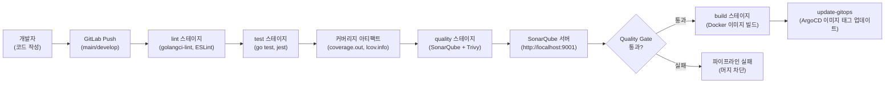
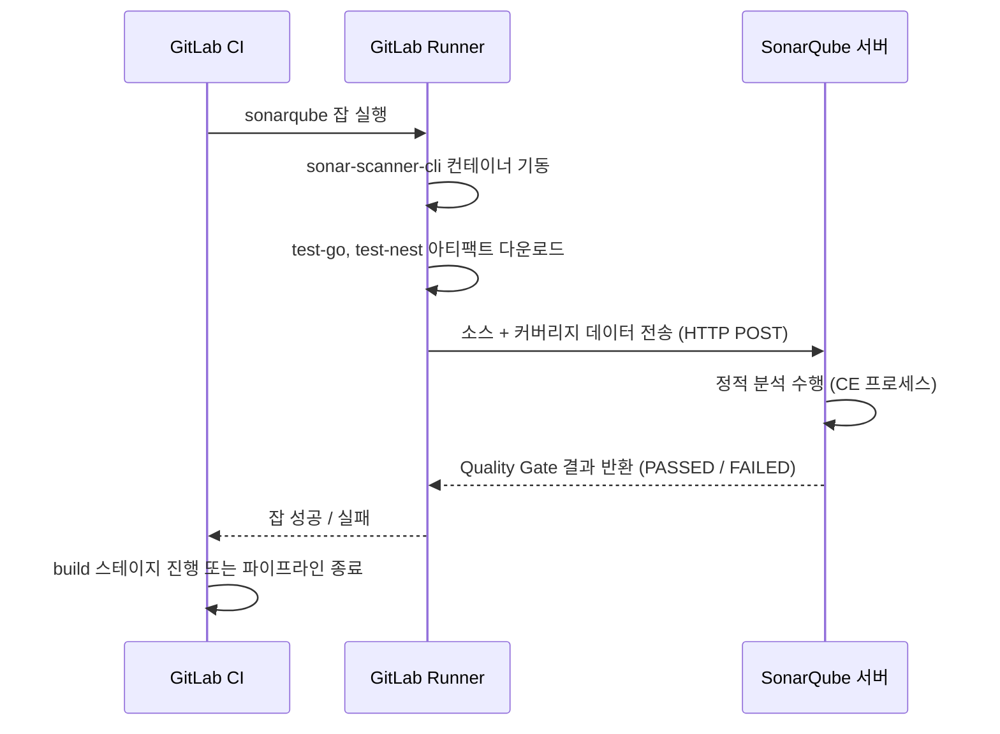

# SonarQube 설치 및 사용 가이드

> docs/05-deployment/05-sonarqube-guide.md
> 작성일: 2026-03-15 | 작성자: Backend Agent (AI Adapter 담당)

---

## 1. 개요

### 1.1 SonarQube 역할

SonarQube는 소스 코드의 정적 분석을 수행하여 버그·취약점·코드 스멜을 탐지하고, 테스트 커버리지를 측정하는 코드 품질 게이트다.

RummiArena에서는 다음 세 가지 목적으로 활용한다.

| 목적 | 설명 |
|------|------|
| 코드 품질 게이트 | main / develop 브랜치 머지 전 Quality Gate 통과 필수 |
| 커버리지 측정 | Go (game-server), TypeScript (ai-adapter, frontend) 커버리지 수집 |
| 보안 취약점 탐지 | OWASP Top 10 수준의 취약점 및 하드코딩 시크릿 탐지 |

### 1.2 CI/CD 파이프라인에서의 위치

SonarQube는 GitLab CI 파이프라인의 `quality` 스테이지에서 실행된다. test 스테이지가 생성한 커버리지 아티팩트를 소비하여 분석 결과를 SonarQube 서버로 전송한다.



### 1.3 환경 구성 요약

| 항목 | 값 |
|------|-----|
| 이미지 | `sonarqube:lts-community` |
| 접속 URL | `http://localhost:9001` |
| 포트 변경 이유 | Traefik K8s Dashboard가 호스트 9000번 점유 |
| 컴포즈 파일 | `docker-compose.cicd.yml` |
| 실행 모드 | CI 모드 (교대 실행 전략 — Dev 모드와 동시 실행 금지) |
| 프로젝트 키 | `rummiarena` |
| 설정 파일 | `sonar-project.properties` (프로젝트 루트) |

---

## 2. 설치 및 기동

### 2.1 사전 조건 확인

SonarQube는 내장 Elasticsearch를 포함하고 있어 커널 가상 메모리 맵 수를 262144 이상으로 설정해야 한다.

```bash
# 현재 값 확인 (262144 이상이어야 함)
cat /proc/sys/vm/max_map_count

# 부족한 경우 즉시 적용 (재부팅 후 초기화됨)
sudo sysctl -w vm.max_map_count=262144

# 영구 적용 (WSL 재시작 시에도 유지)
echo "vm.max_map_count=262144" | sudo tee -a /etc/sysctl.conf
sudo sysctl -p
```

> RummiArena 환경에서는 이미 262144로 설정되어 있으므로 확인만 수행한다.

WSL 메모리 여유를 확인한다. SonarQube + sonarqube-db 합산 약 2.5GB 소요.

```bash
# 여유 메모리 확인 (2.5GB 이상 필요)
free -h

# K8s 서비스가 실행 중이라면 중지 후 CI 모드 진입
# (교대 실행 전략 — 10GB WSL 제약)
```

### 2.2 환경 변수 파일 준비

```bash
# 루트 디렉토리에서
cp .env.cicd.example .env.cicd

# 또는 직접 생성
cat > .env.cicd << 'EOF'
CI_SONAR_DB_PASSWORD=sonarpass
EOF
```

> `.env.cicd`는 Git에 커밋하지 않는다. `.gitignore`에 등록 여부를 확인한다.

### 2.3 SonarQube 기동

```bash
# SonarQube + 전용 DB만 기동 (GitLab Runner 제외)
docker compose -f docker-compose.cicd.yml up -d sonarqube-db sonarqube

# 전체 기동 (Runner 포함 — GitLab CI 연동 시)
docker compose -f docker-compose.cicd.yml up -d
```

### 2.4 상태 확인

```bash
# 컨테이너 상태 확인 (healthy 상태가 될 때까지 약 2~3분 소요)
docker compose -f docker-compose.cicd.yml ps

# 예상 출력
# NAME            IMAGE                    STATUS
# sonarqube-db    postgres:16-alpine       Up (healthy)
# sonarqube       sonarqube:lts-community  Up (healthy)
```

### 2.5 기동 로그 확인

```bash
# 실시간 로그 확인
docker compose -f docker-compose.cicd.yml logs -f sonarqube

# SonarQube가 정상 기동되면 아래와 같은 로그가 출력됨
# SonarQube is operational
# Process[ce] is up
# Process[web] is up
# Process[search] is up
```

SonarQube는 내부적으로 3개 프로세스(web, compute engine, search)가 모두 UP 상태가 되어야 접속 가능하다. healthcheck 기준: `/api/system/status` 응답에 `"status":"UP"` 포함 여부.

---

## 3. 초기 설정 (최초 1회)

### 3.1 웹 UI 접속 및 비밀번호 변경

```
브라우저: http://localhost:9001
초기 계정: admin / admin
```

최초 로그인 시 비밀번호 변경을 강제한다.

```
현재 비밀번호: admin
새 비밀번호:   RummiArena2026!
```

> 비밀번호는 프로젝트 내부에서만 사용하는 로컬 환경이더라도 반드시 변경한다.

### 3.2 프로젝트 생성

1. 상단 메뉴 > **Projects** > **Create project**
2. **Manually** 선택
3. 입력값:

| 필드 | 값 |
|------|----|
| Project display name | `RummiArena` |
| Project key | `rummiarena` |
| Main branch name | `main` |

4. **Set Up** 클릭

### 3.3 분석 토큰 발급

```
우측 상단 프로필 아이콘 > My Account > Security > Generate Tokens
```

| 필드 | 값 |
|------|----|
| Token name | `rummiarena-local` |
| Type | Project Analysis Token |
| Project | RummiArena |
| Expires in | No expiration (로컬 환경) |

**Generate** 클릭 후 토큰을 복사하여 안전한 곳에 저장한다. 이 토큰은 이후 로컬 분석 및 GitLab CI 변수 등록에 사용된다.

> 토큰은 생성 직후에만 전체 값을 확인할 수 있다. 화면을 벗어나기 전에 반드시 복사한다.

### 3.4 Quality Gate 확인

```
상단 메뉴 > Quality Gates
```

기본 Quality Gate인 **Sonar way**가 적용되어 있는지 확인한다. 커스텀 기준은 섹션 6에서 별도 설명한다.

---

## 4. 로컬 분석 실행

### 4.1 sonar-scanner 설치

**방법 A: npm global 설치 (권장)**

```bash
npm install -g sonar-scanner

# 설치 확인
sonar-scanner --version
```

**방법 B: Docker 컨테이너 실행 (설치 없이 즉시 사용)**

```bash
# 프로젝트 루트에서 실행
docker run --rm \
  -e SONAR_HOST_URL=http://host.docker.internal:9001 \
  -e SONAR_TOKEN=<발급된토큰> \
  -v "$(pwd):/usr/src" \
  sonarsource/sonar-scanner-cli
```

> WSL 환경에서 Docker 컨테이너 내부에서 호스트의 9001 포트에 접근할 때는 `localhost` 대신 `host.docker.internal`을 사용한다.

### 4.2 sonar-project.properties 확인

프로젝트 루트의 `sonar-project.properties` 파일이 다음과 같이 구성되어 있는지 확인한다.

```properties
# 프로젝트 식별
sonar.projectKey=rummiarena
sonar.projectName=RummiArena
sonar.projectVersion=0.1.0

# 소스 루트
sonar.sources=src

# 제외 패턴
sonar.exclusions=\
  **/node_modules/**,\
  **/*.test.go,\
  **/*.spec.ts,\
  **/*.spec.js,\
  **/dist/**,\
  **/coverage/**,\
  **/build/**,\
  **/.next/**

# 커버리지 리포트 경로
sonar.go.coverage.reportPaths=src/game-server/coverage.out
sonar.javascript.lcov.reportPaths=\
  src/ai-adapter/coverage/lcov.info,\
  src/frontend/coverage/lcov.info

sonar.qualitygate.wait=true
sonar.qualitygate.timeout=300
```

### 4.3 분석 전 커버리지 리포트 생성

SonarQube는 커버리지 리포트 파일을 직접 생성하지 않는다. 분석 전에 각 프로젝트에서 테스트를 실행하여 리포트를 먼저 생성해야 한다.

```bash
# game-server (Go)
cd src/game-server
go test ./... -coverprofile=coverage.out -covermode=atomic
cd ../..

# ai-adapter (NestJS)
cd src/ai-adapter
npm run test:cov
cd ../..

# frontend (Next.js)
cd src/frontend
npm run test:cov
cd ../..
```

### 4.4 분석 실행

```bash
# 프로젝트 루트에서 실행 (sonar-project.properties 자동 참조)
sonar-scanner \
  -Dsonar.host.url=http://localhost:9001 \
  -Dsonar.token=<발급된토큰>

# 특정 소스만 분석 (ai-adapter만 분석할 때)
sonar-scanner \
  -Dsonar.host.url=http://localhost:9001 \
  -Dsonar.token=<발급된토큰> \
  -Dsonar.sources=src/ai-adapter/src \
  -Dsonar.exclusions="**/node_modules/**,**/*.spec.ts,**/dist/**"
```

분석이 완료되면 `http://localhost:9001/dashboard?id=rummiarena`에서 결과를 확인한다.

---

## 5. GitLab CI 연동

### 5.1 CI/CD Variables 등록

GitLab 레포 > **Settings** > **CI/CD** > **Variables** 에서 아래 변수를 등록한다.

| 변수명 | 값 | Protected | Masked | 비고 |
|--------|----|-----------|--------|------|
| `SONAR_HOST_URL` | `http://host.docker.internal:9001` | No | No | Runner 컨테이너 내부에서 호스트 접근 |
| `SONAR_TOKEN` | 섹션 3.3에서 발급한 토큰 | Yes | Yes | 반드시 Masked 설정 |

> GitLab Runner가 Docker Executor로 실행되므로 컨테이너 내부에서 호스트의 9001 포트에 접근하려면 `host.docker.internal`을 사용한다.

### 5.2 .gitlab-ci.yml quality 스테이지

`.gitlab-ci.yml`의 `quality` 스테이지 중 SonarQube 관련 설정은 다음과 같다.

```yaml
sonarqube:
  stage: quality
  image: sonarsource/sonar-scanner-cli:latest
  variables:
    SONAR_HOST_URL: $SONAR_HOST_URL   # GitLab CI Variable로 주입
    SONAR_TOKEN: $SONAR_TOKEN         # GitLab CI Variable로 주입
    SONAR_SCANNER_OPTS: "-server -Xmx512m"
  script:
    - sonar-scanner
        -Dsonar.projectKey=$SONAR_PROJECT_KEY
        -Dsonar.projectName="RummiArena"
        -Dsonar.host.url=$SONAR_HOST_URL
        -Dsonar.login=$SONAR_TOKEN
        -Dsonar.qualitygate.wait=true
        -Dsonar.sources=src/
        -Dsonar.exclusions="**/node_modules/**,**/*.test.go,**/*.spec.ts,**/*.spec.js,**/dist/**,**/coverage/**"
        -Dsonar.go.coverage.reportPaths=src/game-server/coverage.out
        -Dsonar.javascript.lcov.reportPaths=src/ai-adapter/coverage/lcov.info,src/frontend/coverage/lcov.info
  needs:
    - test-go
    - test-nest
  allow_failure: false
  rules:
    - if: $CI_COMMIT_BRANCH == "main"
    - if: $CI_COMMIT_BRANCH == "develop"
```

- `needs: [test-go, test-nest]`: test 스테이지 아티팩트(커버리지 파일)를 소비하기 위해 선행 의존 설정
- `allow_failure: false`: Quality Gate 실패 시 파이프라인 전체 실패 처리
- `sonar.qualitygate.wait=true`: 분석 결과가 확정될 때까지 스캐너가 대기

### 5.3 CI 파이프라인 흐름 요약



---

## 6. Quality Gate 기준

### 6.1 기본 기준 (Sonar way 커스터마이즈)

RummiArena에 적용하는 Quality Gate 기준은 다음과 같다.

| 항목 | 기준 | 적용 조건 |
|------|------|-----------|
| Coverage | 신규 코드 ≥ 60% | New Code |
| Bugs | 0 | New Code |
| Vulnerabilities | 0 | New Code |
| Security Hotspots Reviewed | 100% | New Code |
| Code Smells | A 등급 (Maintainability Rating) | New Code |
| Duplications | ≤ 3% | New Code |

> SonarQube Community Edition은 New Code 기준(마지막 분석 이후 변경된 코드)을 기본 적용한다.

### 6.2 커스텀 Quality Gate 생성 (선택)

Sonar way를 직접 수정할 수 없으므로 복사 후 커스터마이즈한다.

```
Quality Gates > Sonar way > Copy
이름: RummiArena Gate
조건 추가/수정 (위 표 참조)
Projects 탭 > Add Project > RummiArena
```

### 6.3 Coverage 기준 안내

| 모듈 | 목표 커버리지 | 비고 |
|------|-------------|------|
| `src/game-server` | 70% 이상 | 규칙 검증 로직 핵심 |
| `src/ai-adapter` | 60% 이상 | LLM 어댑터 인터페이스 |
| `src/frontend` | 40% 이상 | UI 컴포넌트 특성상 낮게 설정 |

---

## 7. 중지 및 재시작

### 7.1 SonarQube만 재시작 (데이터 유지)

```bash
# SonarQube 컨테이너만 재시작 (DB 데이터 유지)
docker compose -f docker-compose.cicd.yml restart sonarqube

# 상태 확인
docker compose -f docker-compose.cicd.yml ps
```

### 7.2 전체 중지 (데이터 유지)

```bash
# 컨테이너 중지 (볼륨 데이터 유지)
docker compose -f docker-compose.cicd.yml down

# 재기동
docker compose -f docker-compose.cicd.yml up -d sonarqube-db sonarqube
```

### 7.3 전체 삭제 (데이터 포함)

```bash
# 컨테이너 + 볼륨 모두 삭제 (분석 이력 초기화)
docker compose -f docker-compose.cicd.yml down -v

# 주의: 볼륨 삭제 후 재기동 시 초기 설정(섹션 3)을 다시 수행해야 함
```

### 7.4 교대 실행 전략 적용

WSL 10GB 제약으로 인해 CI 모드와 Dev/Deploy 모드를 동시 실행하지 않는다.

```bash
# Dev 모드 종료 후 CI 모드 전환
docker compose -f docker-compose.dev.yml down
docker compose -f docker-compose.cicd.yml up -d sonarqube-db sonarqube

# CI 모드 종료 후 Dev 모드 전환
docker compose -f docker-compose.cicd.yml down
docker compose -f docker-compose.dev.yml up -d
```

---

## 8. 트러블슈팅

### 8.1 Elasticsearch 부팅 실패

**증상**: SonarQube 컨테이너가 `Restarting` 상태를 반복하거나 로그에 `max virtual memory areas vm.max_map_count [65530] is too low` 메시지 출력.

```bash
# 원인 확인
docker compose -f docker-compose.cicd.yml logs sonarqube | grep "max_map_count"

# 해결: 즉시 적용
sudo sysctl -w vm.max_map_count=262144

# 현재 값 재확인
cat /proc/sys/vm/max_map_count
# 출력: 262144

# SonarQube 재시작
docker compose -f docker-compose.cicd.yml restart sonarqube
```

### 8.2 포트 충돌 (9001)

**증상**: `docker compose up` 시 `Bind for 0.0.0.0:9001 failed: port is already allocated` 오류.

```bash
# 9001 포트를 점유 중인 프로세스 확인
sudo lsof -i :9001
# 또는
sudo ss -tlnp | grep 9001

# 프로세스 확인 후 중지 또는 docker-compose.cicd.yml의 포트 변경
# (9001 → 9002 등 미사용 포트로 변경)
```

> Traefik K8s Dashboard는 9000번을 점유하므로 SonarQube는 9001로 설정되어 있다. K8s가 중지된 CI 모드에서는 9000번도 사용 가능하지만, 포트 일관성을 위해 9001을 유지한다.

### 8.3 메모리 부족으로 SonarQube OOM

**증상**: 컨테이너가 `Exited (137)` 상태. `docker stats`에서 메모리 한계 초과 확인.

```bash
# 메모리 사용 확인
free -h
docker stats --no-stream

# 해결: K8s 서비스 및 Dev 모드 컨테이너 중지 후 재시도
docker compose -f docker-compose.dev.yml down
kubectl scale deployment --all --replicas=0 -n rummikub 2>/dev/null || true

# SonarQube 재기동
docker compose -f docker-compose.cicd.yml up -d sonarqube-db sonarqube
```

`docker-compose.cicd.yml`의 JVM 옵션은 이미 WSL 10GB 제약에 맞게 최소화되어 있다.

```yaml
# 현재 적용된 JVM 설정 (참고용)
SONAR_WEB_JAVAOPTS:    "-Xms256m -Xmx512m"
SONAR_CE_JAVAOPTS:     "-Xms128m -Xmx256m"
SONAR_SEARCH_JAVAOPTS: "-Xms256m -Xmx512m -XX:+UseG1GC"
```

### 8.4 DB 연결 실패

**증상**: SonarQube 로그에 `Cannot create PoolableConnectionFactory` 또는 `Connection refused to sonarqube-db:5432` 출력.

```bash
# sonarqube-db 상태 확인
docker compose -f docker-compose.cicd.yml ps sonarqube-db
docker compose -f docker-compose.cicd.yml logs sonarqube-db

# DB가 healthy 상태가 될 때까지 기다린 후 SonarQube 재시작
docker compose -f docker-compose.cicd.yml restart sonarqube
```

`docker-compose.cicd.yml`에 `depends_on.condition: service_healthy`가 설정되어 있으므로, DB healthcheck가 통과되기 전에는 SonarQube가 기동하지 않는다. 재시작 시에도 이 조건이 적용된다.

### 8.5 Quality Gate 항상 실패

**증상**: 분석은 성공하지만 Quality Gate가 `FAILED` 상태.

```bash
# SonarQube 웹 UI에서 확인
# http://localhost:9001/dashboard?id=rummiarena
# Issues 탭에서 New Code 기준 위반 항목 확인
```

일반적인 원인:

| 원인 | 해결 방법 |
|------|-----------|
| 커버리지 리포트 미생성 | 분석 전 `go test -coverprofile` 및 `npm run test:cov` 선행 실행 |
| 커버리지 경로 불일치 | `sonar-project.properties`의 `reportPaths` 경로 확인 |
| 신규 코드에 버그 존재 | Issues 탭에서 해당 버그 수정 |
| Quality Gate 기준 과도 | 섹션 6.2에 따라 커스텀 Gate 생성 및 기준 완화 |

### 8.6 sonar-scanner 명령어를 찾을 수 없음

```bash
# npm global 설치 경로 확인
npm list -g sonar-scanner
which sonar-scanner

# PATH에 없는 경우
export PATH="$(npm root -g)/../bin:$PATH"

# 또는 Docker 방식으로 대체 (섹션 4.1 방법 B)
```

---

## 9. sonar-project.properties 전체 참조

```properties
# sonar-project.properties (프로젝트 루트)

# 프로젝트 식별
sonar.projectKey=rummiarena
sonar.projectName=RummiArena
sonar.projectVersion=0.1.0

# 소스 루트
sonar.sources=src

# 제외 패턴
sonar.exclusions=\
  **/node_modules/**,\
  **/*.test.go,\
  **/*.spec.ts,\
  **/*.spec.js,\
  **/dist/**,\
  **/coverage/**,\
  **/build/**,\
  **/.next/**,\
  **/out/**

# 테스트 파일 패턴
sonar.tests=src
sonar.test.inclusions=\
  **/*_test.go,\
  **/*.spec.ts,\
  **/*.spec.js,\
  **/*.test.ts,\
  **/*.test.js

# 커버리지 리포트
sonar.go.coverage.reportPaths=src/game-server/coverage.out
sonar.javascript.lcov.reportPaths=\
  src/ai-adapter/coverage/lcov.info,\
  src/frontend/coverage/lcov.info

# 인코딩
sonar.sourceEncoding=UTF-8

# 중복 코드 분석 제외
sonar.cpd.exclusions=\
  **/node_modules/**,\
  **/*.spec.ts,\
  **/*.test.go

# Quality Gate 대기
sonar.qualitygate.wait=true
sonar.qualitygate.timeout=300
```

---

## 10. 참고 문서

| 문서 | 내용 |
|------|------|
| `docs/05-deployment/01-local-infra-guide.md` | 로컬 인프라 전체 구성 |
| `docs/05-deployment/03-infra-setup-checklist.md` | 교대 실행 전략 및 메모리 예산 |
| `docs/00-tools/07-sonarqube.md` | SonarQube 도구 매뉴얼 |
| `docs/00-tools/05-gitlab-ci.md` | GitLab CI 파이프라인 |
| `docker-compose.cicd.yml` | SonarQube + GitLab Runner Compose 정의 |
| `sonar-project.properties` | SonarQube 프로젝트 분석 설정 |
| `.gitlab-ci.yml` | CI 파이프라인 quality 스테이지 정의 |

---

> **문서 이력**
> | 버전 | 날짜 | 작성자 | 내용 |
> |------|------|--------|------|
> | 1.0 | 2026-03-15 | Backend Agent | 초안 작성 (설치, 초기 설정, 분석, CI 연동, 트러블슈팅) |
