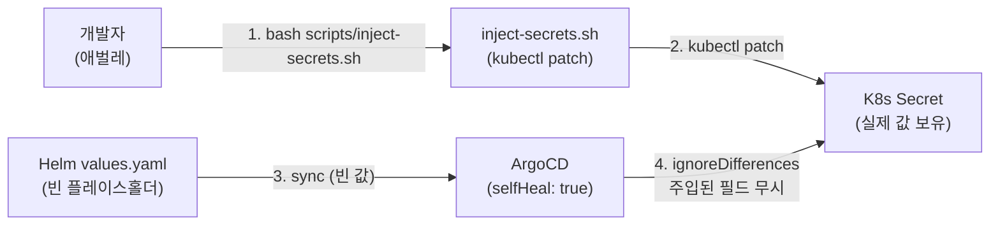
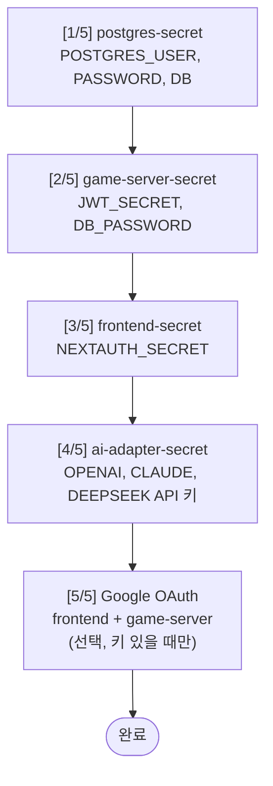
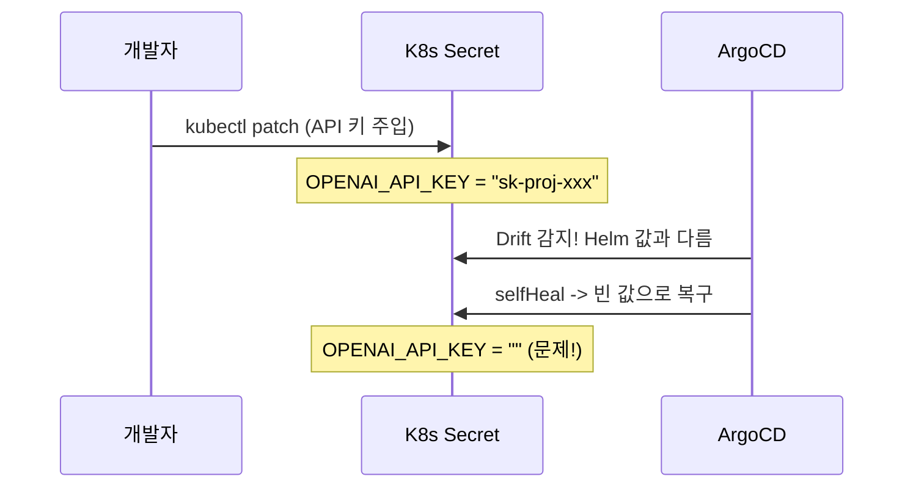
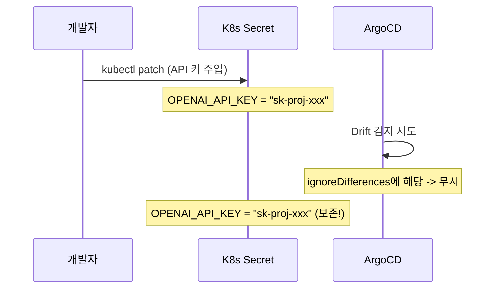
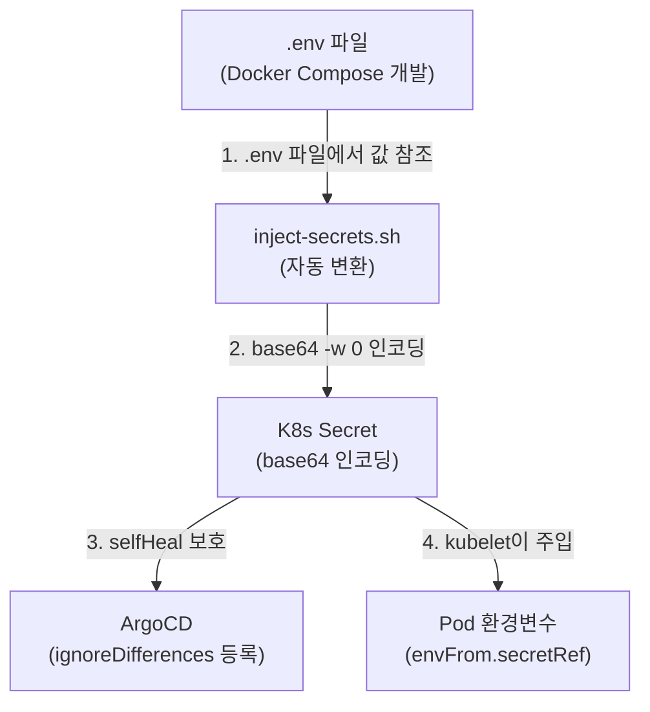
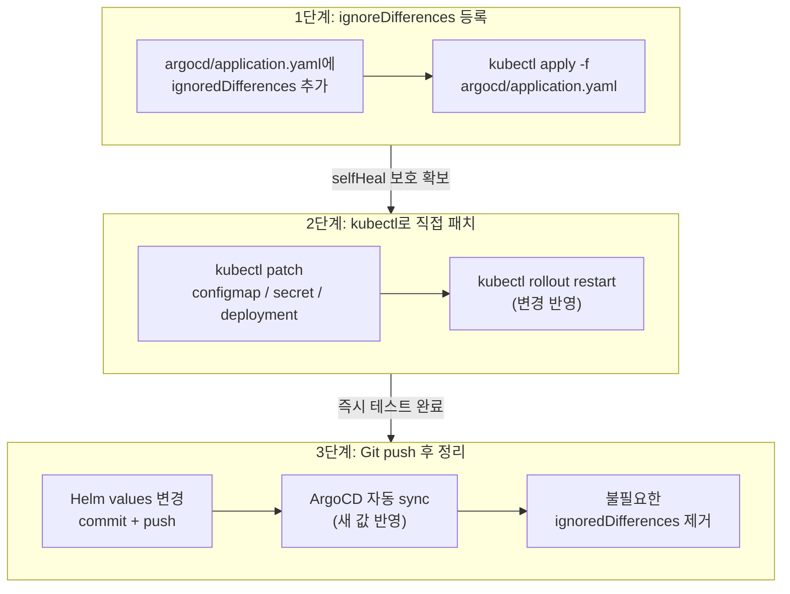

# Secret 주입 가이드

> 작성일: 2026-03-31 | 작성자: DevOps Agent
> RummiArena K8s 개발 환경에서 민감 정보(API 키, 비밀번호, 토큰)를 안전하게 관리하는 방법을 다룬다.

---

## 1. 설계 원칙

RummiArena는 **GitOps 기반 배포**를 사용한다. ArgoCD가 GitHub의 `helm/` 디렉토리를 감시하고, Helm Chart에 정의된 리소스를 K8s 클러스터에 동기화한다.

민감 정보는 다음 원칙에 따라 관리한다.

| 원칙 | 설명 |
|------|------|
| Git에 시크릿 커밋 금지 | Helm values.yaml에는 빈 문자열 `""` 플레이스홀더만 둔다 |
| kubectl patch로 주입 | 실제 값은 `inject-secrets.sh`로 클러스터에 직접 주입한다 |
| ArgoCD ignoreDifferences | 주입된 값이 selfHeal로 덮어써지지 않도록 드리프트 감지를 제외한다 |
| RespectIgnoreDifferences | syncOptions에 이 플래그를 활성화하여 ignoreDifferences가 sync 시에도 적용되게 한다 |



---

## 2. 관리 대상 Secret 전체 목록

`inject-secrets.sh`가 관리하는 K8s Secret 리소스와 각 필드는 다음과 같다.

### 2.1 postgres-secret

| 필드 | 값 소스 | 필수 |
|------|---------|------|
| POSTGRES_USER | 고정값 `rummikub` | Y |
| POSTGRES_PASSWORD | 환경변수 `DB_PASSWORD` 또는 랜덤 생성 | Y |
| POSTGRES_DB | 고정값 `rummikub` | Y |

### 2.2 game-server-secret

| 필드 | 값 소스 | 필수 |
|------|---------|------|
| JWT_SECRET | 환경변수 `JWT_SECRET` 또는 랜덤 생성 | Y |
| DB_PASSWORD | 환경변수 `DB_PASSWORD` (postgres-secret과 동일 값) | Y |
| GOOGLE_CLIENT_ID | `src/frontend/.env.local` 또는 환경변수 | N |
| GOOGLE_CLIENT_SECRET | `src/frontend/.env.local` 또는 환경변수 | N |

### 2.3 frontend-secret

| 필드 | 값 소스 | 필수 |
|------|---------|------|
| NEXTAUTH_SECRET | 환경변수 `NEXTAUTH_SECRET` 또는 랜덤 생성 | Y |
| GOOGLE_CLIENT_SECRET | `src/frontend/.env.local` 또는 환경변수 | N |

### 2.4 ai-adapter-secret

| 필드 | 값 소스 | 필수 |
|------|---------|------|
| OPENAI_API_KEY | `src/ai-adapter/.env` 또는 환경변수 | N (경고만) |
| CLAUDE_API_KEY | `src/ai-adapter/.env` 또는 환경변수 | N (경고만) |
| DEEPSEEK_API_KEY | `src/ai-adapter/.env` 또는 환경변수 | N (경고만) |

### 2.5 frontend-config (ConfigMap)

| 필드 | 값 소스 | 필수 |
|------|---------|------|
| GOOGLE_CLIENT_ID | `src/frontend/.env.local` 또는 환경변수 | N |

> frontend-config는 Secret이 아닌 ConfigMap이지만, ArgoCD ignoreDifferences 관리 대상이므로 함께 기술한다.

---

## 3. inject-secrets.sh 실행 방법

### 3.1 기본 실행 (로컬 파일 자동 참조)

```bash
bash scripts/inject-secrets.sh
```

스크립트는 다음 파일에서 값을 자동으로 읽는다.

| 파일 | 읽어오는 키 |
|------|-----------|
| `src/frontend/.env.local` | GOOGLE_CLIENT_ID, GOOGLE_CLIENT_SECRET |
| `src/ai-adapter/.env` | OPENAI_API_KEY, CLAUDE_API_KEY, DEEPSEEK_API_KEY |

### 3.2 환경변수로 직접 전달

```bash
JWT_SECRET="my-jwt-secret" \
DB_PASSWORD="my-db-password" \
OPENAI_API_KEY="sk-proj-xxx" \
CLAUDE_API_KEY="sk-ant-xxx" \
DEEPSEEK_API_KEY="sk-xxx" \
bash scripts/inject-secrets.sh
```

환경변수가 설정되어 있으면 파일의 값보다 우선한다.

### 3.3 실행 순서 (5단계)



### 3.4 ai-adapter-secret 주입 상세

ai-adapter-secret은 다른 Secret과 달리 **개별 키 단위로 선택적 주입**을 지원한다.

- 3개 키(OPENAI, CLAUDE, DEEPSEEK) 중 설정된 키만 패치한다.
- 설정되지 않은 키는 `[WARNING]` 메시지를 출력하고 건너뛴다.
- 3개 모두 미설정이면 패치 자체를 건너뛴다 (`[SKIP]`).
- 1개 이상 패치 성공 시 ai-adapter Pod를 자동으로 재시작한다.

이 동작은 LLM API 키를 점진적으로 확보하는 개발 환경을 고려한 설계이다. 예를 들어 OpenAI 키만 먼저 발급받아 테스트하고, 나중에 Claude/DeepSeek 키를 추가할 수 있다.

---

## 4. ArgoCD ignoreDifferences 규칙

### 4.1 문제: selfHeal이 주입된 값을 빈 문자열로 덮어쓴다

ArgoCD의 `selfHeal: true` 설정은 K8s 리소스가 Git의 Helm 정의와 다르면 자동으로 "치유"한다. 그런데 Helm values.yaml에는 시크릿 값이 빈 문자열이므로, selfHeal이 `kubectl patch`로 주입한 실제 API 키를 빈 값으로 덮어쓰는 현상이 발생한다.



### 4.2 해결: ignoreDifferences + RespectIgnoreDifferences

`argocd/application.yaml`에 `ignoreDifferences` 블록을 추가하면, 지정된 JSON 경로에 대해 드리프트 감지를 건너뛴다.

```yaml
# argocd/application.yaml (발췌)
ignoreDifferences:
  - kind: Secret
    name: game-server-secret
    namespace: rummikub
    jsonPointers:
      - /data/JWT_SECRET
      - /data/DB_PASSWORD
      - /data/GOOGLE_CLIENT_ID
      - /data/GOOGLE_CLIENT_SECRET
  - kind: Secret
    name: postgres-secret
    namespace: rummikub
    jsonPointers:
      - /data/POSTGRES_PASSWORD
  - kind: Secret
    name: frontend-secret
    namespace: rummikub
    jsonPointers:
      - /data/NEXTAUTH_SECRET
      - /data/GOOGLE_CLIENT_SECRET
  - kind: Secret
    name: ai-adapter-secret
    namespace: rummikub
    jsonPointers:
      - /data/OPENAI_API_KEY
      - /data/CLAUDE_API_KEY
      - /data/DEEPSEEK_API_KEY
  - kind: ConfigMap
    name: frontend-config
    namespace: rummikub
    jsonPointers:
      - /data/GOOGLE_CLIENT_ID
```

`syncOptions`에도 `RespectIgnoreDifferences=true`가 반드시 있어야 한다.

```yaml
syncPolicy:
  syncOptions:
    - RespectIgnoreDifferences=true
```

이 두 설정이 함께 작동하여, selfHeal과 수동 sync 모두에서 주입된 값을 보존한다.



### 4.3 새 시크릿 필드 추가 시 체크리스트

새로운 민감 정보 필드를 추가할 때는 반드시 다음 3곳을 모두 수정해야 한다.

1. **Helm values.yaml** -- 빈 플레이스홀더 추가
2. **argocd/application.yaml** -- ignoreDifferences에 jsonPointer 추가
3. **scripts/inject-secrets.sh** -- 주입 로직 추가

하나라도 누락하면 selfHeal 덮어쓰기가 발생한다. 이 문서의 6장 트러블슈팅에 실제 사례를 기술했다.

---

## 5. K8s Secret vs Docker Compose 환경변수 비교

로컬 개발 시 Docker Compose의 `.env` 파일로 환경변수를 관리하는 것과, K8s 클러스터에서 Secret 리소스로 관리하는 것은 근본적으로 다른 패러다임이다. 이 섹션에서는 두 방식의 차이를 정리하고, RummiArena에서 실제로 어떻게 매핑되는지를 기술한다.

### 5.1 비교표

| 항목 | Docker Compose | Kubernetes |
|------|---------------|------------|
| 시크릿 저장 | `.env` 파일 직접 참조 | K8s Secret (base64 인코딩) |
| 주입 방식 | `env_file:` 또는 `environment:` | `secretRef` / `envFrom` |
| 버전 관리 | `.env`는 `.gitignore`에 등록 | Helm values에 빈 값 `""` + `kubectl patch` |
| 갱신 방법 | `docker-compose restart` | `kubectl patch` + `kubectl rollout restart` |
| 암호화 | 평문 파일 (파일 권한으로 보호) | etcd 저장 시 base64 인코딩 (EncryptionConfig으로 암호화 가능) |
| GitOps 충돌 | 해당 없음 | ArgoCD selfHeal 덮어쓰기 위험 -- `ignoreDifferences` 필수 |

### 5.2 RummiArena 구체적 매핑

다음 표는 로컬 개발 환경(Docker Compose)의 `.env` 변수가 K8s 배포 환경에서 어떤 리소스의 어떤 필드에 대응하는지를 보여준다.

| 로컬 `.env` 파일 | 환경변수 | K8s Secret 리소스 | Secret 필드 경로 |
|------------------|----------|-------------------|-----------------|
| `src/ai-adapter/.env` | `OPENAI_API_KEY` | ai-adapter-secret | `/data/OPENAI_API_KEY` |
| `src/ai-adapter/.env` | `CLAUDE_API_KEY` | ai-adapter-secret | `/data/CLAUDE_API_KEY` |
| `src/ai-adapter/.env` | `DEEPSEEK_API_KEY` | ai-adapter-secret | `/data/DEEPSEEK_API_KEY` |
| `src/frontend/.env.local` | `GOOGLE_CLIENT_ID` | frontend-config (ConfigMap) | `/data/GOOGLE_CLIENT_ID` |
| `src/frontend/.env.local` | `GOOGLE_CLIENT_SECRET` | frontend-secret | `/data/GOOGLE_CLIENT_SECRET` |
| `src/frontend/.env.local` | `NEXTAUTH_SECRET` | frontend-secret | `/data/NEXTAUTH_SECRET` |

**주입 방식의 차이**:

- **Docker Compose**: `env_file: .env`로 파일 전체를 컨테이너 환경에 로드한다. `docker-compose up` 시점에 값이 결정된다.
- **Kubernetes**: Deployment 매니페스트에서 `envFrom.secretRef`로 Secret 리소스를 참조한다. Pod 생성 시점에 kubelet이 Secret에서 값을 읽어 환경변수로 주입한다.

```yaml
# Helm 템플릿에서의 secretRef 사용 예시 (ai-adapter)
envFrom:
  - secretRef:
      name: ai-adapter-secret
```

### 5.3 Docker Compose에서 K8s로 전환 시 주의사항

#### (1) inject-secrets.sh를 활용한 자동 변환

`scripts/inject-secrets.sh`는 로컬 `.env` 파일에서 값을 읽어 K8s Secret에 주입하는 역할을 한다. Docker Compose 환경에서 사용하던 `.env` 값을 수동으로 base64 변환할 필요 없이, 스크립트가 자동으로 처리한다.

```bash
# .env 파일의 값을 자동으로 읽어 K8s Secret에 주입
bash scripts/inject-secrets.sh
```

#### (2) ArgoCD selfHeal 덮어쓰기 방지

Docker Compose에는 없는 문제이지만, K8s + ArgoCD 환경에서는 selfHeal이 Helm 정의(빈 값)로 복원하는 현상이 발생한다. 새로운 Secret 필드를 추가할 때는 반드시 `argocd/application.yaml`의 `ignoreDifferences`에 사전 등록해야 한다.

> 이 문서의 4.3장 "새 시크릿 필드 추가 시 체크리스트"를 반드시 참조할 것.

#### (3) Base64 인코딩 주의

K8s Secret의 `data` 필드는 base64 인코딩된 값을 저장한다. `kubectl patch`로 직접 주입할 때 줄바꿈 문자가 포함되면 인코딩이 깨진다. 반드시 `-w 0` 옵션으로 줄바꿈 없이 인코딩해야 한다.

```bash
# 올바른 방법: -w 0으로 줄바꿈 없이 인코딩
printf 'sk-proj-xxx' | base64 -w 0

# 잘못된 방법: echo 사용 시 줄바꿈이 포함됨
echo 'sk-proj-xxx' | base64    # 끝에 \n이 포함된 base64 값이 생성된다
```

#### (4) 전환 흐름 요약



---

## 6. 트러블슈팅

### 6.1 증상: AI Adapter에서 LLM API 호출 시 401/403 오류

**원인**: ai-adapter-secret의 API 키가 빈 문자열이다.

**진단**:

```bash
# Secret의 실제 값 확인 (base64 디코딩)
kubectl get secret ai-adapter-secret -n rummikub \
  -o jsonpath='{.data.OPENAI_API_KEY}' | base64 -d

# Pod의 환경변수 확인
kubectl exec -n rummikub deploy/ai-adapter -- printenv | grep API_KEY
```

**해결**:

```bash
# 방법 1: inject-secrets.sh로 일괄 주입
bash scripts/inject-secrets.sh

# 방법 2: 개별 키만 직접 패치
kubectl patch secret ai-adapter-secret -n rummikub \
  --type='json' \
  -p='[{"op":"replace","path":"/data/OPENAI_API_KEY","value":"'"$(printf 'sk-proj-xxx' | base64 -w 0)"'"}]'

# Pod 재시작 (Secret 변경 후 필수)
kubectl rollout restart deployment/ai-adapter -n rummikub
```

### 6.2 증상: inject-secrets.sh 실행 후 값이 곧바로 사라짐

**원인**: `argocd/application.yaml`의 ignoreDifferences에 해당 필드가 등록되지 않았다. ArgoCD selfHeal이 3분 이내에 Helm의 빈 값으로 복원한다.

**진단**:

```bash
# ArgoCD 앱 상태 확인 -- Sync Status가 OutOfSync인 필드 확인
argocd app get rummikub --refresh

# ArgoCD 앱의 diff 확인
argocd app diff rummikub
```

**해결**:

1. `argocd/application.yaml`의 `ignoreDifferences`에 해당 Secret/필드 추가
2. `kubectl apply -f argocd/application.yaml` 적용
3. `bash scripts/inject-secrets.sh` 재실행

### 6.3 증상: kubectl patch 시 "path not found" 오류

**원인**: Helm 템플릿에 해당 필드가 정의되지 않아 Secret 리소스에 키 자체가 존재하지 않는다.

**해결**:

```bash
# replace 대신 add 사용
kubectl patch secret ai-adapter-secret -n rummikub \
  --type='json' \
  -p='[{"op":"add","path":"/data/NEW_KEY","value":"'"$(printf 'value' | base64 -w 0)"'"}]'
```

그러나 근본 해결은 Helm 템플릿(`helm/charts/ai-adapter/templates/secret.yaml`)에 해당 필드를 빈 플레이스홀더로 추가하는 것이다.

### 6.4 실제 사례: ai-adapter-secret selfHeal 덮어쓰기 (2026-03-31)

**발생 경위**:

1. `inject-secrets.sh`에 ai-adapter-secret 처리 로직이 없었다.
2. 개발자가 `kubectl patch`로 직접 OPENAI_API_KEY를 주입했다.
3. `argocd/application.yaml`의 ignoreDifferences에 ai-adapter-secret이 없었다.
4. ArgoCD selfHeal이 약 3분 후 Helm 정의(빈 값)로 복원했다.
5. AI Adapter Pod가 빈 API 키로 LLM 호출을 시도하여 실패했다.

**수정 사항**:

| 파일 | 수정 내용 |
|------|----------|
| `argocd/application.yaml` | ai-adapter-secret에 대한 ignoreDifferences 3개 필드 추가 |
| `scripts/inject-secrets.sh` | `[4/5]` ai-adapter-secret 주입 블록 추가, `src/ai-adapter/.env` 자동 로드 |

이 패턴은 앞서 Google OAuth의 GOOGLE_CLIENT_ID에서 동일하게 발생했던 문제(2026-03-29)와 같은 근본 원인이다. 새로운 외부 주입 필드가 추가될 때마다 이 체크리스트를 반드시 따라야 한다.

### 6.5 Git Push 전 로컬 Helm 변경 -> K8s 즉시 반영 워크플로우

**배경**:

RummiArena는 ArgoCD가 GitHub 원격 저장소의 Helm chart를 감시하여 K8s 클러스터에 자동 배포(`selfHeal: true`)한다. 따라서 로컬에서 Helm values를 수정해도 `git push` 전까지 ArgoCD에 반영되지 않는다. 개발 중 즉시 테스트가 필요할 때는 다음 3단계 워크플로우를 사용한다.



**1단계: ArgoCD ignoreDifferences 등록**

변경하려는 리소스(ConfigMap, Deployment, ResourceQuota 등)를 `argocd/application.yaml`의 `ignoreDifferences`에 추가한다. 이 단계 없이 `kubectl patch`를 실행하면 ArgoCD selfHeal이 즉시 원래 값으로 되돌린다.

```bash
# application.yaml 수정 후 ArgoCD에 적용
kubectl apply -f argocd/application.yaml
```

**2단계: kubectl로 직접 패치**

ignoreDifferences가 등록된 상태에서 `kubectl patch`로 원하는 값을 즉시 적용한다.

```bash
# ConfigMap 패치 예시 (AI 모델 변경)
kubectl patch configmap ai-adapter-config -n rummikub \
  --type='json' \
  -p='[{"op":"replace","path":"/data/OPENAI_DEFAULT_MODEL","value":"gpt-4o"}]'

# Deployment 패치 예시 (Ollama 메모리 증설)
kubectl patch deployment ollama -n rummikub \
  --type='json' \
  -p='[{"op":"replace","path":"/spec/template/spec/containers/0/resources/limits/memory","value":"4Gi"}]'

# 변경 반영을 위한 rollout restart
kubectl rollout restart deployment/ai-adapter -n rummikub
```

**3단계: Git push 후 ignoreDifferences 정리**

테스트가 끝나면 Helm values 변경을 commit + push한다. ArgoCD가 새 값으로 자동 sync하므로, 더 이상 필요 없는 `ignoreDifferences` 항목은 제거하여 깔끔하게 유지한다.

```bash
# Helm values 변경 커밋 및 푸시
git add helm/charts/ai-adapter/values.yaml
git commit -m "chore: update OPENAI_DEFAULT_MODEL to gpt-4o"
git push origin main

# ArgoCD가 자동 sync 완료 후, 임시 ignoreDifferences 제거
# (application.yaml 수정 후)
kubectl apply -f argocd/application.yaml
```

**실제 사례 (2026-03-31)**:

다음 표는 이 워크플로우를 적용한 실제 변경 내역이다.

| 변경 항목 | Helm 파일 | kubectl patch 대상 | ignoreDifferences 경로 |
|-----------|-----------|-------------------|----------------------|
| OpenAI 모델 gpt-4o-mini -> gpt-4o | `helm/charts/ai-adapter/values.yaml` | `configmap ai-adapter-config` | `/data/OPENAI_DEFAULT_MODEL` |
| Ollama 모델 gemma3:1b -> qwen3:4b | `helm/charts/ai-adapter/values.yaml` | `configmap ai-adapter-config` | `/data/OLLAMA_DEFAULT_MODEL` |
| Ollama 메모리 2Gi -> 4Gi | `helm/charts/ollama/values.yaml` | `deployment ollama` | `/spec/template/spec/containers/0/resources/limits/memory` |
| ResourceQuota 4Gi -> 8Gi | `helm/templates/resource-quota.yaml` | `resourcequota rummikub-quota` | `/spec/hard` |
| LLM API 키 주입 | (Git에 저장하지 않음) | `secret ai-adapter-secret` | `/data/OPENAI_API_KEY` 등 |

**주의사항**:

- `ignoreDifferences`는 개발 중 임시 조치이다. push 후에는 반드시 정리한다.
- 단, API 키처럼 Git에 저장하지 않는 값은 **영구적으로 ignoreDifferences를 유지**해야 한다. 이 문서의 4장 참조.
- `syncOptions`에 `RespectIgnoreDifferences=true`가 반드시 설정되어 있어야 한다. 이 옵션이 없으면 수동 sync 시 ignoreDifferences가 무시되어 값이 덮어써진다.

---

## 7. 관련 파일 참조

| 파일 | 역할 |
|------|------|
| `scripts/inject-secrets.sh` | Secret 일괄 주입 스크립트 |
| `argocd/application.yaml` | ArgoCD Application 정의 (ignoreDifferences 포함) |
| `helm/charts/ai-adapter/templates/secret.yaml` | ai-adapter-secret Helm 템플릿 |
| `helm/charts/ai-adapter/values.yaml` | ai-adapter Helm 기본값 (빈 플레이스홀더) |
| `helm/charts/game-server/templates/secret.yaml` | game-server-secret Helm 템플릿 |
| `helm/charts/frontend/templates/secret.yaml` | frontend-secret Helm 템플릿 |
| `helm/charts/postgres/templates/secret.yaml` | postgres-secret Helm 템플릿 |
| `src/ai-adapter/.env` | AI Adapter 로컬 환경변수 (Git 추적 주의) |
| `src/frontend/.env.local` | Frontend 로컬 환경변수 (Git 추적 주의) |
| `docs/05-deployment/04-k8s-architecture.md` | K8s 전체 아키텍처 (Secret 관계도 포함) |

---

> **문서 이력**
> | 버전 | 날짜 | 작성자 | 내용 |
> |------|------|--------|------|
> | 1.0 | 2026-03-31 | DevOps Agent | 초안 작성 (ai-adapter-secret selfHeal 이슈 해결 문서화) |
> | 1.1 | 2026-03-31 | DevOps Agent | 5장 "K8s Secret vs Docker Compose 환경변수 비교" 섹션 추가 |
> | 1.2 | 2026-03-31 | DevOps Agent | 6.5장 "Git Push 전 로컬 Helm 변경 -> K8s 즉시 반영 워크플로우" 추가 |
