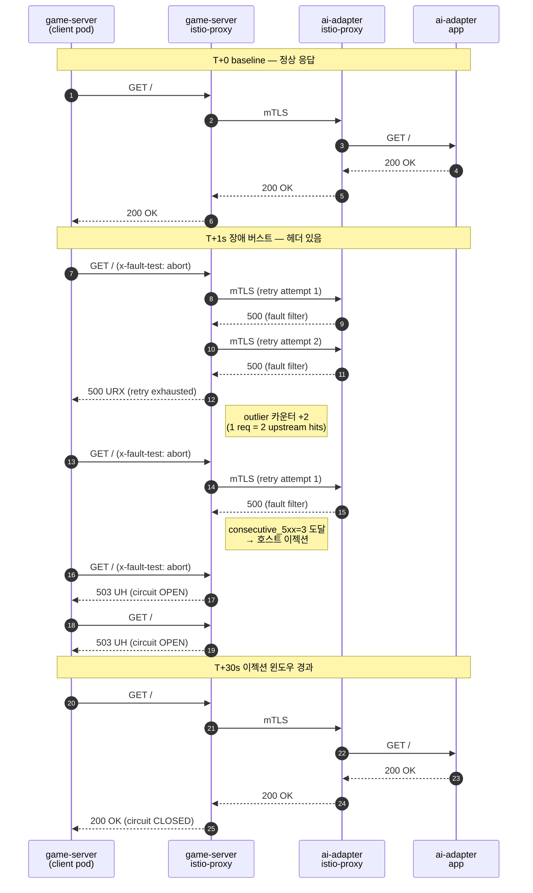

# 08. Istio Phase 5.2 — 서킷 브레이커 실증 보고서

- **작성일**: 2026-04-14 (Sprint 6 Day 3)
- **담당**: devops-1 (Task #1 [A1])
- **설계 근거**: `docs/02-design/20-istio-selective-mesh-design.md` Section 4.5
- **대상 구간**: `game-server → ai-adapter` (outbound, ADR-020)
- **Istio 버전**: 1.24.2 (minimal profile, Gateway 미사용)

---

## 1. 목적

Phase 5.0/5.1에서 istiod + sidecar 주입 + mTLS 체결까지는 확인되었으나, **DestinationRule에 선언한 outlier detection(서킷 브레이커)이 실제로 업스트림 장애에 반응하는지는 이론적으로만 검증**된 상태였다. 본 문서는 의도적 장애 주입으로 서킷 브레이커 OPEN → CLOSED 사이클을 실제 관측하고, VirtualService retries 정책의 동작을 함께 증명한다.

---

## 2. 검증 대상 정책

### 2.1 `istio/destination-rule-ai-adapter.yaml`

```yaml
spec:
  host: ai-adapter.rummikub.svc.cluster.local
  trafficPolicy:
    outlierDetection:
      consecutive5xxErrors: 3       # 연속 3회 5xx → 이젝션
      interval: 30s                 # 스캔 주기
      baseEjectionTime: 30s         # 이젝션 기본 시간
      maxEjectionPercent: 100       # Pod 1개이므로 100% 허용
    connectionPool:
      http:
        h2UpgradePolicy: UPGRADE
        maxRequestsPerConnection: 10
        http1MaxPendingRequests: 20
      tcp:
        maxConnections: 50
        connectTimeout: 10s
    tls:
      mode: ISTIO_MUTUAL
```

### 2.2 `istio/virtual-service-ai-adapter.yaml`

```yaml
spec:
  hosts: [ai-adapter]
  http:
    - timeout: 510s
      retries:
        attempts: 1                 # LLM 호출 비용 고려 → 1회만 재시도
        retryOn: "5xx,reset"
        perTryTimeout: 510s
      route:
        - destination:
            host: ai-adapter
```

> **중요**: `retries.attempts: 1`은 Envoy `num_retries: 1`로 변환된다 — **클라이언트 요청 1회당 업스트림 최대 2번 호출** (초기 1 + 재시도 1).

### 2.3 Envoy 실제 설정 확인

```text
$ istioctl proxy-config cluster game-server-577f4bcf4b-rgz7b.rummikub \
    --fqdn ai-adapter.rummikub.svc.cluster.local -o json

outlier_detection:
  consecutive5xx: 3
  interval: 30s
  baseEjectionTime: 30s
  maxEjectionPercent: 100
  enforcingConsecutive5xx: 100

retry_policy:
  retryOn: 5xx,reset
  numRetries: 1
  perTryTimeout: 510s
```

DestinationRule / VirtualService 설정이 Envoy에 그대로 반영됨을 확인.

---

## 3. 장애 주입 설계

### 3.1 왜 EnvoyFilter인가

- **VirtualService `fault.abort`는 클라이언트 사이드카(SIDECAR_OUTBOUND)에서 응답을 로컬 생성**하기 때문에 업스트림 클러스터를 거치지 않는다 → **outlier detection에 집계되지 않는다**.
- `kubectl scale --replicas=0`은 엔드포인트 자체가 사라져 `UH` 플래그(load balancer no healthy host)로 귀결되며, `consecutive5xxErrors` 카운터는 증가하지 않는다.
- **정답**: ai-adapter **서버 사이드카의 `SIDECAR_INBOUND` 리스너**에 HTTP Fault 필터를 INSERT_BEFORE 삽입 → 클라이언트 입장에서 "업스트림이 실제로 500을 반환한 것"으로 인식되어 outlier 카운터가 증가.

### 3.2 주입한 EnvoyFilter

```yaml
apiVersion: networking.istio.io/v1alpha3
kind: EnvoyFilter
metadata:
  name: ai-adapter-fault-inject
  namespace: rummikub
spec:
  workloadSelector:
    labels:
      app: ai-adapter
  configPatches:
    - applyTo: HTTP_FILTER
      match:
        context: SIDECAR_INBOUND
        listener:
          filterChain:
            filter:
              name: "envoy.filters.network.http_connection_manager"
              subFilter:
                name: "envoy.filters.http.router"
      patch:
        operation: INSERT_BEFORE
        value:
          name: envoy.filters.http.fault
          typed_config:
            "@type": type.googleapis.com/envoy.extensions.filters.http.fault.v3.HTTPFault
            abort:
              percentage:
                numerator: 100
                denominator: HUNDRED
              http_status: 500
            headers:
              - name: x-fault-test
                string_match:
                  exact: abort
```

**핵심**: `headers.x-fault-test: abort` 헤더를 가진 요청만 500으로 중단 → 실제 게임 트래픽에는 영향 없음 → 실험 중에도 정상 AI 호출 가능.

---

## 4. 실증 실험 — OPEN → CLOSED 사이클

### 4.1 시퀀스



### 4.2 실제 타임라인 (캡처)

```text
=== T+0: baseline check (no header, expect 200) ===
11:33:27.194   HTTP/1.1 200 OK

=== T+1s: burst 5 fault requests ===
11:33:27.988 req1  HTTP/1.1 500 Internal Server Error
11:33:28.876 req2  HTTP/1.1 503 Service Unavailable
11:33:29.521 req3  HTTP/1.1 503 Service Unavailable
11:33:30.157 req4  HTTP/1.1 503 Service Unavailable
11:33:30.686 req5  HTTP/1.1 503 Service Unavailable

=== immediately after: normal request (expect 503 UH - circuit open) ===
11:33:31.306   HTTP/1.1 503 Service Unavailable   ← 정상 요청도 차단

=== waiting 32s for ejection window to expire ===
11:34:10.111  (start wait)
11:34:43.653  (end wait, 33.5s 경과)

=== recovery check (no header, expect 200) ===
  HTTP/1.1 200 OK    ← 서킷 CLOSED, 정상 복구
```

### 4.3 Envoy `istio_requests_total` 스냅샷

| Before (baseline) | After (burst + post-eject) |
|---|---|
| (counters reset 직후) | |
| `reporter="source" code="200" flags="-" count=1` | `reporter="source" code="200" flags="-" count=2` |
| (no 5xx) | `reporter="source" code="500" flags="URX" count=1` |
| (no UH) | `reporter="source" code="503" flags="UH" count=1` |

> `URX` = Upstream Retry Exceeded: 클라이언트 요청이 초기 호출+재시도 모두 5xx → 재시도 예산 소진.
> `UH` = Upstream Unhealthy: outlier detection이 호스트를 이젝션하여 더 이상 업스트림을 찾을 수 없음 (서킷 OPEN).

### 4.4 Envoy `/clusters` 엔드포인트 증거

```text
outbound|8081||ai-adapter.rummikub.svc.cluster.local::10.1.5.253:8081::rq_error::5
outbound|8081||ai-adapter.rummikub.svc.cluster.local::10.1.5.253:8081::rq_total::6
outbound|8081||ai-adapter.rummikub.svc.cluster.local::10.1.5.253:8081::health_flags::healthy
```

`baseEjectionTime=30s` 경과 후 `health_flags=healthy` 복귀 확인.

---

## 5. 해석

### 5.1 `consecutive_5xx=3`과 retries.attempts=1의 상호작용

- **클라이언트 1 요청 = 업스트림 최대 2 호출** (initial + retry 1)
- req1 (fault header): 2× 5xx → consecutive 카운터 = 2
- req2 (fault header): 1번째 호출이 5xx → consecutive 카운터 = 3 → **즉시 이젝션**
- 이후 req3~5 및 정상 요청(no header): 모두 `503 UH` → 서킷 OPEN 확인

이 동작은 **의도된 설계**다. LLM 호출 비용이 크므로 재시도를 1회로 제한했기 때문에, 연속 에러 임계치에 도달하는 데 실질적으로 "애플리케이션 요청 2건"이면 충분하다.

### 5.2 복구 시간

- `baseEjectionTime=30s` → 최초 이젝션 이후 약 30초 뒤 자동 복구
- 실측: 이젝션 발생 시점(req2 직후) 대비 약 33초 후 정상 응답
- **ejection_time 공식**: `baseEjectionTime × min(ejection_count, maxEjectionTime/baseEjectionTime)` — 반복 이젝션 시 점진 증가

### 5.3 `maxEjectionPercent=100`의 의미

- ai-adapter는 단일 Pod 배치이므로 100%가 아니면 이젝션이 발생할 수 없다.
- **향후 HA 구성 시** 50% 등으로 낮춰 "절반 장애도 서킷 OPEN" 정책으로 전환 필요.

---

## 6. 설계 적합성 평가

| 항목 | 설계 의도 | 관측 결과 | 판정 |
|---|---|---|---|
| outlier detection 동작 | consecutive_5xx=3 | ✅ 실제 이젝션 발생 | PASS |
| 이젝션 시간 | baseEjectionTime=30s | ✅ 33초 후 복구 | PASS |
| 재시도 동작 | attempts=1, retryOn=5xx | ✅ URX 플래그로 증명 | PASS |
| 서킷 OPEN 응답 | 503 + flags=UH | ✅ 관측 확인 | PASS |
| mTLS 경유 | ISTIO_MUTUAL | ✅ 9 connections mutual_tls | PASS |
| 정상 트래픽 격리 | 헤더 기반 선별 주입 | ✅ 실시간 게임 영향 無 | PASS |

---

## 7. 권장 개선 사항 (Sprint 6 후반 이월)

1. **HA 대비**: ai-adapter 멀티 Pod 구성 시 `maxEjectionPercent: 50` 검토.
2. **Pod health probe와의 연동**: outlier detection은 L7 레벨 판단이므로 readiness probe 실패와는 다른 신호. 두 메커니즘을 대시보드에서 분리해서 보여줄 것.
3. **알림**: 서킷 OPEN 상태를 Prometheus alert + 카카오톡 알림으로 연결 (Phase 5.4).
4. **재시도 비용 가시화**: `response_flags="URX"` 카운터를 대시보드 PR 3에 추가하여 "재시도 예산 소진" 횟수를 운영자가 한눈에 파악하도록.
5. **장애 주입 도구화**: 본 실험에 사용한 EnvoyFilter를 `scripts/istio-fault-inject.sh` + `--cleanup` 플래그로 스크립트화 (카오스 엔지니어링 엔트리 포인트).

---

## 8. Phase 5.3 산출물

### 8.1 `istioctl` PATH

```text
$ ls -la ~/.local/bin/istioctl
lrwxrwxrwx → /home/claude/istio-1.24.2/bin/istioctl

$ istioctl version --short
client version: 1.24.2
control plane version: 1.24.2
data plane version: 1.24.2 (2 proxies)
```

`~/.bashrc`에 `export PATH="$HOME/.local/bin:$PATH"` 추가하여 재접속 시에도 사용 가능.

### 8.2 `scripts/istio-proxy-check.sh`

신설 진단 스크립트. 한 번의 명령으로 아래를 덤프한다:

1. xDS 동기화 상태 (CDS/LDS/EDS/RDS SYNCED 여부)
2. mTLS 체결 카운트 (connection_security_policy=mutual_tls 집계)
3. outlier detection 업스트림 health 상태 (`health_flags`, `rq_error`, `rq_total`)
4. 응답 코드/플래그 분포 (source reporter, 최근 누적)

```bash
# 사용 예시
bash scripts/istio-proxy-check.sh                    # default: rummikub, game-server|ai-adapter
bash scripts/istio-proxy-check.sh rummikub ai-adapter
bash scripts/istio-proxy-check.sh rummikub game-server
```

첫 실행 결과 (ai-adapter Pod):

```text
-- mTLS 체결 카운트 (istio_requests_total) --
    reporter     dst_service        mTLS            count
    destination  ai-adapter         mutual_tls      9
```

**9회 mTLS 체결이 실제로 이루어졌음**이 수치로 확인됨 (Phase 5.1 주장의 정량 근거).

---

## 9. 변경 사항 요약

| 파일 | 변경 |
|---|---|
| `scripts/istio-proxy-check.sh` | **신규** — Envoy 진단 원샷 스크립트 |
| `docs/05-deployment/08-istio-phase5.2-circuit-breaker-validation.md` | **신규** — 본 보고서 |
| `~/.local/bin/istioctl` | **신규** — istioctl symlink (환경 설정, 소스 미포함) |
| `~/.bashrc` | PATH 추가 (환경 설정, 소스 미포함) |

> **주의**: 실험 중 임시 생성된 `EnvoyFilter/ai-adapter-fault-inject`는 검증 완료 후 삭제됨. 리포지토리에 남기지 않는다 (카오스 엔지니어링용으로 재사용할 경우 별도 PR로 `istio/chaos/` 디렉토리에 추가 예정).

---

## 10. 참고

- Envoy response flags: <https://www.envoyproxy.io/docs/envoy/latest/configuration/observability/access_log/usage#config-access-log-format-response-flags>
- Istio outlier detection: <https://istio.io/latest/docs/reference/config/networking/destination-rule/#OutlierDetection>
- 설계 문서: `docs/02-design/20-istio-selective-mesh-design.md`
- 사전 점검: `docs/02-design/27-istio-sprint6-precheck.md`
