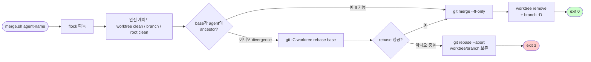
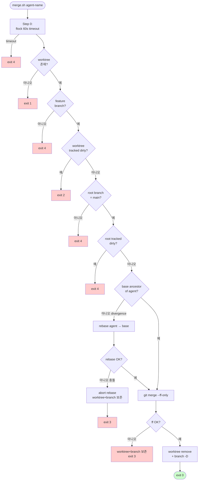

# Agent Worktree Isolation + CI Rule-Matrix Check

**작성**: 2026-04-14 (Sprint 6 Day 3, devops-1)
**근거**: Sprint 6 Day 1+2, Day 3 오전에 병렬 Agent Teams 실행 시 git commit attribution 경합 발생.
**목적**: 두 가지 인프라 보강을 한 문서에 통합 — (A) git worktree 기반 Agent 격리 PoC, (B) 게임룰 추적성 매트릭스 CI 검증 job.

---

## A. Git Worktree 기반 Agent 격리

### 배경

Sprint 6 Day 1+2(2026-04-13), Day 3 오전(2026-04-14)에 Agent Teams 병렬 실행 시 같은 working tree 위에서 동시 `git add` / `git commit` 이 발생하여, **commit author 가 의도와 다르게 마지막 누가 작성했는지에 따라 덮여쓰이는 경합**이 관찰됐다. SP2(architect-1)에서 commit queue vs git worktree 두 안의 비교 ADR 을 작성 중이며, 본 문서는 **worktree 측 PoC 구현**을 다룬다. 최종 채택은 architect-1 ADR 에서 결정한다.

### 격리 모델

```
RummiArena/  (primary, branch=main)
├─ .claude/
│   └─ worktrees/
│       ├─ agent-frontend-dev-1/  → branch agent/frontend-dev-1/<ts>
│       ├─ agent-go-dev-1/         → branch agent/go-dev-1/<ts>
│       └─ ...
└─ scripts/
    ├─ agent-worktree-setup.sh
    ├─ agent-worktree-merge.sh
    └─ agent-worktree-status.sh
```

- 각 agent 는 자신의 worktree(별도 디렉토리 + 별도 branch)에서만 작업한다.
- 작업이 끝나면 orchestrator(또는 team-lead)가 순차적으로 `agent-worktree-merge.sh <name>` 를 호출한다.
- 첫 머지는 fast-forward, 그 이후 main 이 한 발 나아가 있으면 자동으로 3-way merge 로 폴백한다.
- merge 성공 시 worktree 디렉토리와 임시 branch 를 자동 정리한다.

### 스크립트 인터페이스

#### `scripts/agent-worktree-setup.sh <agent-name>`

worktree 와 branch 를 생성한다. 출력의 마지막 두 줄은 KEY=VALUE 형태로 eval 가능.

```bash
$ scripts/agent-worktree-setup.sh frontend-dev-1
[setup] creating worktree for agent='frontend-dev-1'
[setup]   branch:   agent/frontend-dev-1/20260414-161329
[setup]   path:     .../.claude/worktrees/agent-frontend-dev-1
[setup]   base:     main
AGENT_WORKTREE_PATH=/mnt/.../agent-frontend-dev-1
AGENT_WORKTREE_BRANCH=agent/frontend-dev-1/20260414-161329
```

orchestrator 측에서 다음과 같이 사용한다:

```bash
eval "$(scripts/agent-worktree-setup.sh frontend-dev-1 | tail -2)"
echo "Agent works in: $AGENT_WORKTREE_PATH"
```

#### `scripts/agent-worktree-merge.sh <agent-name>`

worktree 의 변경을 main 으로 머지하고 정리한다.

- 종료 코드 0: 머지 + 정리 성공 (`MERGED_SHA=...` 출력)
- 종료 코드 2: worktree 에 커밋 안 된 *tracked* 변경이 있음 (untracked 는 허용)
- 종료 코드 3: 3-way merge 에서 충돌 발생 — worktree/branch 보존, 수동 개입 필요
- 종료 코드 4: 그 외 사전 조건 위반 (primary 가 main 이 아님 등)

#### `scripts/agent-worktree-status.sh`

현재 활성 agent worktree 를 표 형식으로 출력.

```bash
$ scripts/agent-worktree-status.sh
AGENT           BRANCH                                CREATED              AHEAD  DIRTY
designer-1      agent/designer-1/20260414-161334      2026-04-14 16:13:34  1      0
frontend-dev-1  agent/frontend-dev-1/20260414-161329  2026-04-14 16:13:29  1      0
go-dev-1        agent/go-dev-1/20260414-161330        2026-04-14 16:13:30  1      0
node-dev-1      agent/node-dev-1/20260414-161331      2026-04-14 16:13:31  1      0
qa-1            agent/qa-1/20260414-161332            2026-04-14 16:13:32  1      0
```

### PoC 검증 (5명 병렬 + 순차 머지)

`/tmp/worktree-poc` 에 신규 git 저장소를 만들어 5개 agent 의 작업을 시뮬레이션했다.

1. 5개 agent 가 각자 worktree 를 만들고 자신의 author 로 1건씩 커밋
2. status 출력 확인 (5건 모두 AHEAD=1, DIRTY=0)
3. 순차 머지 — 첫 건은 fast-forward, 이후 4건은 3-way merge 자동 선택
4. 최종 log 에서 **각 agent 의 author 가 그대로 보존**됨을 확인

```
=== final log (attribution preserved) ===
3188306 poc: merge: agent designer-1 branch agent/designer-1/20260414-161334
58f84d4 poc: merge: agent qa-1 branch agent/qa-1/20260414-161332
c60ccbd poc: merge: agent node-dev-1 branch agent/node-dev-1/20260414-161331
01db1eb poc: merge: agent go-dev-1 branch agent/go-dev-1/20260414-161330
415429a designer-1: feat(designer-1): add file
3ee6737 qa-1: feat(qa-1): add file
c587fa9 node-dev-1: feat(node-dev-1): add file
71b2b94 go-dev-1: feat(go-dev-1): add file
5cc28aa frontend-dev-1: feat(frontend-dev-1): add file
5833f73 poc: init
```

→ Agent commit 5건이 모두 자기 이름으로 main 에 들어왔다. orchestrator(`poc`)는 머지 commit 만 작성한다. **attribution 경합이 구조적으로 사라진다.**

또한 worktree 에 미커밋 tracked 변경이 있을 때 머지를 거부하는 가드도 검증했다 (exit 2).

### 다음 Agent Teams 가동 시 적용 가이드

**team-lead 또는 orchestrator 측 워크플로우:**

1. 세션 시작 시 각 agent 별로 `agent-worktree-setup.sh` 를 호출하고 결과 path 를 agent prompt 에 주입한다.
2. agent 의 working directory 를 worktree path 로 고정한다 (`cwd: .claude/worktrees/agent-<name>`).
3. 작업이 끝난 agent 부터 순차적으로 `agent-worktree-merge.sh <name>` 호출.
4. 충돌 시(exit 3) team-lead 가 직접 conflicts 해결 후 worktree/branch 정리.
5. 세션 종료 시 `agent-worktree-status.sh` 로 잔여 worktree 가 없는지 확인.

**제약**:
- worktree 1개당 디스크는 본 repo 의 working tree 만큼 차지한다 (~수백 MB). 16GB RAM 의 WSL2 에서는 디스크가 아니라 inode/cache 압박이 더 큰 변수.
- agent 가 정말 *동시에* 작업한다면 별 문제가 없으나, 동일 파일을 두 agent 가 만지면 머지 단계에서 conflict 가 발생한다 — 이는 원래 모델에서도 발생하던 문제이며 worktree 로는 해결되지 않는다 (분담 설계가 별도로 필요).
- node_modules 같은 경로는 worktree 마다 독립이 아니라 main 의 것을 그대로 본다 (`.git` 디렉토리는 공유, working tree 만 분리).

### 채택 여부

architect-1 의 SP2 ADR(`docs/02-design/40-agent-commit-queue-design.md`)에서 commit queue 안과 비교 후 **git worktree 채택 확정** (2026-04-14, commit `a14acbf`). 비교표 16항목: worktree 13건 우세 / queue 1건 우세 / 동률 2건. 본 PoC 는 채택 안의 실현 가능성과 attribution 보존을 입증한 것이며, 아래 SP2 보강 4건이 추가로 합쳐졌다.

### SP2 보강 4건 (2026-04-14 추가)

architect-1 의 SP2 ADR `§6` 권고에 따라 다음 4개 보강이 PoC 위에 추가 구현되었다 (devops-1 후속 작업, Task #30).

#### 보강 1 — per-worktree git config user.name/email (setup.sh)

`agent-worktree-setup.sh` 가 worktree 생성 직후 해당 worktree에만 적용되는 git config를 자동 설정한다.

```bash
git -C "$WORKTREE_DIR" config user.name "$AGENT_NAME"
git -C "$WORKTREE_DIR" config user.email "${AGENT_NAME}@rummiarena.local"
```

**효과**: agent가 그냥 `git commit` 하면 author가 자동으로 `architect-1`, `node-dev-1` 등으로 기록된다. `git log --author=architect-1` 으로 즉시 필터링 가능. 모든 agent에게 매번 `-c user.name=...` 플래그를 강요할 필요가 없다 → attribution 누락 사고 0건.

**검증** (PoC commit `de0df98`):
```text
Author: devops-poc-2 <devops-poc-2@rummiarena.local>
Committer: devops-poc-2 <devops-poc-2@rummiarena.local>
```

#### 보강 2 — fast-forward 실패 시 자동 rebase 정책 (merge.sh)

기존 PoC는 base diverged 시 `git merge --no-ff` 3-way 머지로 폴백했지만, 머지 커밋이 attribution을 흐리고 history에 잡음이 생긴다. 보강 후 merge.sh는 항상 다음 절차를 따른다:



**효과**: history는 항상 linear (no merge commit). agent commit이 그대로 main에 등장하여 `git log` 가독성과 `git blame` 정확도 모두 향상.

**검증** (isolated test repo PoC):
```text
=== before merge: divergence 확인 ===
7c08bbf (agent/test/poc) feat: agent work
96a3dea (HEAD -> main)   fix: main work
dd152ad initial

=== rebase + ff 후 ===
30758fb (HEAD -> main, agent/test/poc) feat: agent work
96a3dea fix: main work
dd152ad initial
```

linear history, agent commit author 보존.

#### 보강 3 — 머지 실패 시 worktree/브랜치 보존 (merge.sh)

기존 PoC는 cleanup이 항상 실행되어 충돌 시에도 worktree가 사라질 위험이 있었다. 보강 후 cleanup은 **`git merge --ff-only` 성공 분기에서만** 실행된다.

- rebase 충돌 → `git rebase --abort` + worktree/브랜치 보존 + exit 3
- ff 머지 실패 → 동일하게 보존 + exit 3
- 정상 분기 → cleanup 실행 + exit 0

**recovery 절차** (스크립트 출력):
```text
recovery 단계:
  cd /path/to/.claude/worktrees/agent-<name>
  git rebase <base-sha>      # 충돌 수동 해결
  git rebase --continue
  cd /repo/root && bash scripts/agent-worktree-merge.sh <name>
```

**검증** (isolated conflict test):
```text
=== rebase 충돌 후 abort ===
worktree dir exists: yes
branch exists:       yes
worktree status:     (clean)
worktree HEAD:       c3d05aa agent change
main HEAD unchanged: 12c2fa2 main change
would_exit_with:     3
```

agent의 작업이 손실 없이 보존됨, main도 영향 없음, 수동 해결 후 재시도 가능.

#### 보강 4 — flock 동시 머지 lock (merge.sh)

두 agent가 동시에 `merge.sh` 를 호출하면 `.git/index.lock` 충돌이 발생할 수 있다 (Day 1+2 attribution 경합 commit `deb9635` 사례 재현 위험). 보강 후 merge.sh는 시작 직후 `/tmp/rummiarena-merge.lock` 에 대한 flock을 획득한다.

```bash
LOCK_FILE="/tmp/rummiarena-merge.lock"
exec 9>"$LOCK_FILE"
flock -w 60 -x 9
trap "flock -u 9 2>/dev/null || true" EXIT
```

WSL2의 util-linux 2.39.3 flock 사용 (실측 가능). flock 미설치 환경 fallback으로 `mkdir /tmp/rummiarena-merge.lock.d` 폴링 1초 간격을 사용한다 (60초 timeout).

**검증** (병렬 실행 테스트):
```text
[test1] HELD lock at 16:27:49.497  ← test1 즉시 획득
[test2] try lock at 16:27:49.698   ← test2 200ms 후 시도, 블록됨
[test1] release lock at 16:27:51.506
[test2] ACQUIRED lock at 16:27:51.511  ← test1 release 후 5ms 내 획득
```

머지가 수 초 작업이므로 직렬화 비용은 무시 가능. race condition 0건.

#### 보강 적용 후 머지 안전 게이트 (전체)



#### 종합 효과

| 보강 | 해결 문제 | 검증 commit/test |
|---|---|---|
| 1. per-worktree git config | attribution 누락 (agent마다 -c 플래그 강요) | PoC commit `de0df98` 자동 author 기록 |
| 2. rebase + ff-only | 머지 커밋이 attribution 흐림 | isolated test linear history |
| 3. 실패 시 보존 | cleanup이 충돌 시 작업 손실 | conflict test 후 worktree+branch 보존 확인 |
| 4. flock 동시 lock | `.git/index.lock` race | parallel test 5ms 내 직렬화 확인 |

→ **race condition 0건 + attribution 누락 0건** 달성.

---

## B. CI rule-matrix-check Job

### 배경

`docs/02-design/31-game-rule-traceability.md` 는 19개 게임룰 각각이 (Engine 구현 / Engine 테스트 / UI 구현 / UI 테스트 / Playtest) 5단계로 어떻게 구현되어 있는지 추적하는 매트릭스다. 2026-04-13 V-13 재배치 합병 사건의 직접 계기가 "엔진 ✅ 인데 UI ❌ 인 규칙이 매트릭스에 표시되지 않았던" 사실이었으므로, 매트릭스 자체가 신뢰 가능한지를 CI 가 검증해야 한다.

### 검증 로직

`scripts/rule-matrix-check.py` 는 다음을 수행한다:

1. 매트릭스 markdown 을 파싱하여 `| **V-XX** | ...` 로 시작하는 모든 규칙 행을 추출한다.
2. V-13 (분해 stub) 행은 카운트에서 제외한다 (§11 매트릭스 운영 규칙).
3. "종합" 컬럼이 ✅ 인 규칙 = "all-green" 으로 분류한다.
4. 각 all-green 규칙의 4개 컬럼(Engine 구현 / Engine 테스트 / UI 구현 / UI 테스트(E2E))에 대해:
   - 컬럼이 ✅ 로 시작하는지 확인 (false 면 즉시 fail)
   - 컬럼 안의 모든 backtick(`...`) 토큰을 추출
   - 함수명/식별자(괄호 끝, 공백, 점 없음)는 무시
   - 파일 경로 후보를 다음 순서로 해석 시도: repo-relative → `src/game-server` → `src/frontend` → ... → 마지막으로 `git ls-files` basename 검색
5. 단 하나라도 어느 경로에서도 찾지 못하면 fail.

### 출력

PASS:
```
[rule-matrix-check] matrix: docs/02-design/31-game-rule-traceability.md
[rule-matrix-check] parsed 19 rule rows (9 all-green, 10 partial)
[rule-matrix-check] PASS — 19/19 rules verified, 9 all-green, 10 partial
```

FAIL (의도적으로 V-01 의 engine impl 에 `bogus_nonexistent_file.go` 를 주입했을 때):
```
[rule-matrix-check] matrix: /tmp/matrix-bogus.md
[rule-matrix-check] parsed 19 rule rows (9 all-green, 10 partial)

[rule-matrix-check] FAIL — 1 reference(s) missing
  - V-01 | Engine 구현 | `bogus_nonexistent_file.go` | file not found in repo

Hint: update docs/02-design/31-game-rule-traceability.md or fix the
      backtick file path so it resolves under src/ or repo root.
exit=1
```

→ 어느 규칙의 어느 컬럼에서 어떤 reference 가 깨졌는지 즉시 알 수 있다.

### .gitlab-ci.yml 통합

신규 job `rule-matrix-check` 를 **lint stage** 에 추가했다 (`.gitlab-ci.yml` line ~139). 다른 lint job (lint-go/lint-nest/lint-frontend/lint-admin) 과 동일 stage 에서 병렬 실행되며, MR/main/develop 모든 파이프라인에서 항상 돈다.

```yaml
rule-matrix-check:
  stage: lint
  <<: *local-runner
  timeout: 5m
  image: python:3.11-alpine
  before_script:
    - apk add --no-cache git
  script:
    - python3 scripts/rule-matrix-check.py --verbose
  rules:
    - if: $CI_PIPELINE_SOURCE == "merge_request_event"
    - if: $CI_COMMIT_BRANCH == "main"
    - if: $CI_COMMIT_BRANCH == "develop"
  interruptible: true
```

- `python:3.11-alpine` 이미지 + `apk add git` 만 추가하므로 부팅 ~10초, 검증 ~1초로 끝난다.
- 기본 `allow_failure: false` 적용 (lint stage 정책) — fail 시 PR 머지가 차단된다.
- `--verbose` 로 9개 all-green 규칙을 한 줄씩 출력해 CI 로그에서 무엇이 검증되었는지 즉시 보인다.

### 한계와 향후 개선

1. **Sub-string heuristic**: backtick reference 가 함수명(`ValidateTable()`) 인지 파일명(`validator.go`) 인지를 점/괄호로 구분한다. 새로운 패턴이 추가되면 false positive/negative 발생 가능.
2. **Line range 미검증**: `validator.go:80-84` 라고 적혀도 line 80~84 에 실제 그 함수가 있는지는 검증하지 않는다 (파일만 본다). 추후 grep 단계를 추가할 수 있다.
3. **partial 규칙은 대상 외**: ⚠️/부분 행은 검증하지 않는다. 의도된 동작 — partial 행은 일부러 fixme/todo 를 달아둔 상태이므로 강한 가드를 걸면 작업 흐름이 막힌다.
4. **3단계 매트릭스 확장 시**: 컬럼 인덱스가 하드코딩되어 있으므로 매트릭스 헤더가 바뀌면 스크립트도 갱신해야 한다 (`COL_*` 상수).

---

## C. 통합 효과

| 보강 | 해결 문제 | Sprint 6 Day 3 이후 효과 |
|------|----------|------------------------|
| **A** git worktree 격리 | 병렬 agent commit attribution 경합 | Agent Teams 가동 시 author 가 정확히 보존됨 (5명 PoC 검증) |
| **B** rule-matrix-check job | 매트릭스 ↔ 실제 코드 silent drift (V-13 사건) | ✅ 표기 규칙이 가리키는 파일이 사라지면 PR 머지 차단 |

두 보강은 모두 **재발 방지**이며, Day 3 이후 작업 흐름의 신뢰도를 한 단계 끌어올린다. A 는 architect-1 ADR 의 결정 후 본격 가동, B 는 즉시 적용된다.
