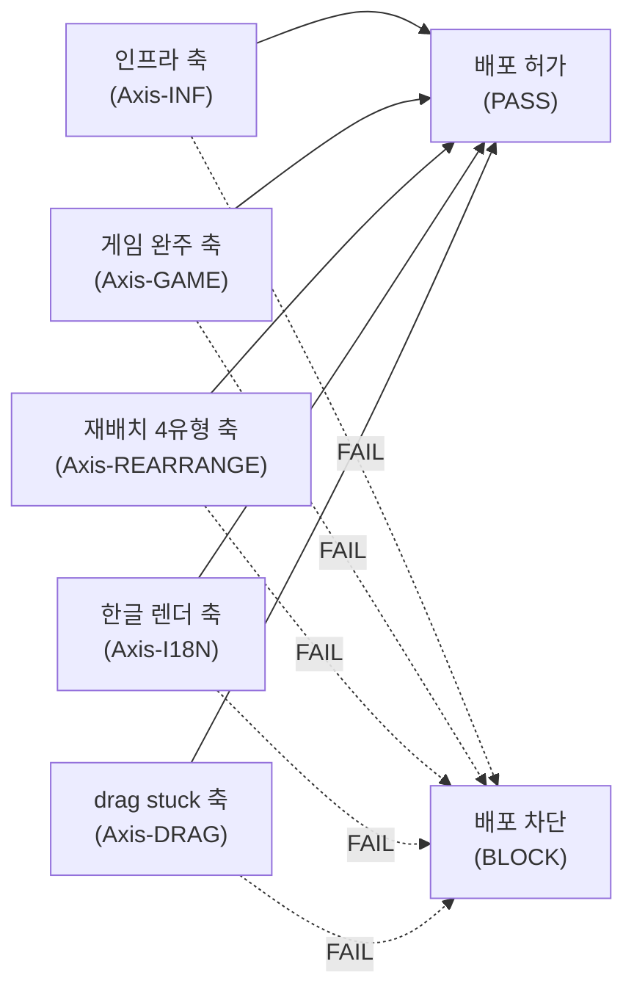
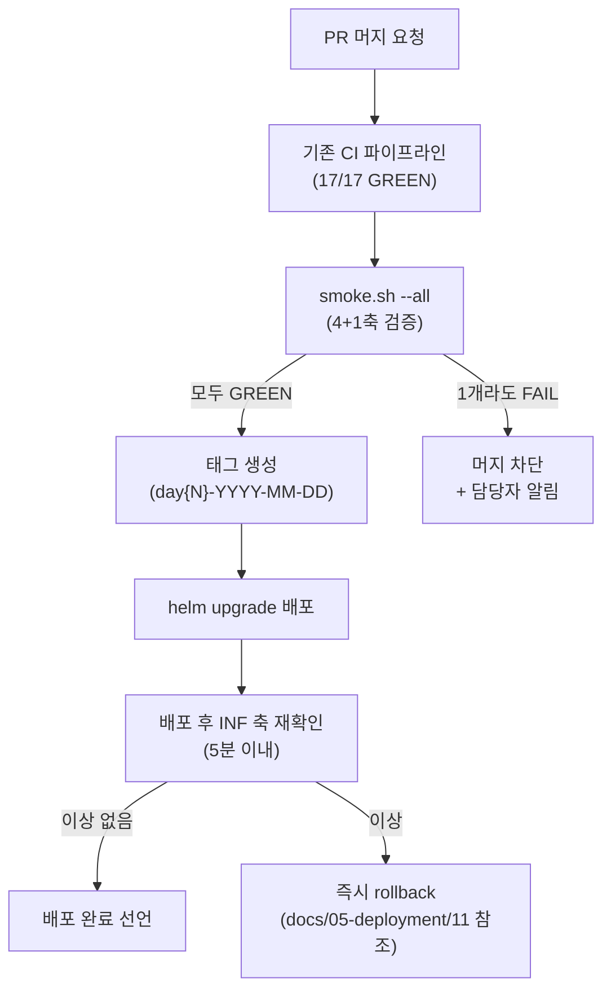

# 10. 배포 Smoke 기준 (상향 개정판)

> 최종 업데이트: 2026-04-24
> 작성 배경: `day2-2026-04-23` 태그 배포 smoke PASS 직후 같은 날 22:04 플레이테스트에서
> BUG-UI-009~014 6건 발견. 구 기준(`/health 200 + helm list DEPLOYED`)이 "Pod 살아있음"만
> 확인하고 "게임이 제대로 동작하는가"를 묻지 않았음. 본 문서는 그 공백을 닫는다.
> 근거 스탠드업: `work_logs/scrums/2026-04-24-01.md` §devops 반성

---

## 1. 구 기준 (폐기)

```bash
# 구 smoke — "Pod 살아있음" 수준. 배포 게이트로 불충분.
kubectl get pods -n rummikub | grep -v Running && exit 1
helm list -n rummikub | grep DEPLOYED || exit 1
curl -sf http://localhost:30080/api/health || exit 1
```

위 기준은 다음을 보증하지 않는다.

- 실제 게임 로직이 작동하는지
- UI 재배치 시나리오가 사용자에게 정상 렌더되는지
- 한글 문자열이 mojibake 없이 표시되는지
- drag-and-drop 이벤트가 stuck 상태 없이 종료되는지

---

## 2. 신규 Smoke 기준 (4축 모두 GREEN = 배포 허가)



### Axis-INF — 인프라 생존 확인 (기존 유지)

| 체크 | 명령 | 합격 기준 |
|------|------|---------|
| Pod 상태 | `kubectl get pods -n rummikub` | 전체 Running, RESTARTS < 3 |
| Health endpoint | `curl -sf http://localhost:30080/api/health` | HTTP 200 |
| Helm 배포 | `helm list -n rummikub` | STATUS=deployed |
| Redis 연결 | `kubectl exec -n rummikub deploy/game-server -- wget -qO- localhost:8080/api/health/redis` | `{"redis":"ok"}` |

### Axis-GAME — 1 게임 완주 (신규)

Claude가 사용자 역할(Human)로 진입, Ollama AI 1명과 2인전 진행.
20~30턴 이내 게임 종료 또는 정상 드로우 순환 확인.

```bash
# 실행 (smoke 스크립트 호출)
scripts/smoke.sh --axis game
```

합격 기준:

- WS 연결 유지 20~30턴 이상
- `GAME_STATE` 이벤트 정상 수신 (누락 없음)
- 게임 정상 종료 또는 최대 턴 도달 (crash-loop 아님)
- 실행 시간 10분 이내

### Axis-REARRANGE — 재배치 4유형 각 1회 성공 (신규)

| 유형 | 설명 | E2E spec |
|------|------|---------|
| I-1 | 순수 새 그룹 구성 (손패 타일만으로 새 meld 생성) | `e2e/rearrange-i1-new-group.spec.ts` |
| I-2 | 보드 이어붙이기 (기존 meld 에 손패 타일 extend) | `e2e/rearrange-i2-extend.spec.ts` |
| I-3 | 조커 교체 (조커 포함 meld 에서 조커 탈환) | `e2e/rearrange-i3-joker-swap.spec.ts` |
| I-4 | 멀티 재배치 (보드 타일 재조합 + 새 meld 동시) | `e2e/rearrange-i4-multi.spec.ts` |

```bash
scripts/smoke.sh --axis rearrange
# 내부: npx playwright test e2e/rearrange-*.spec.ts --project=chromium
```

합격 기준: 4개 spec 전부 PASS. 하나라도 FAIL = 배포 차단.

### Axis-I18N — 한글 렌더 diff (신규)

`src/frontend/src/locales/ko.json` 의 핵심 키 N개를 브라우저에 렌더해
mojibake(깨진 문자) 0건 확인.

```bash
scripts/smoke.sh --axis i18n
# 내부: npx playwright test e2e/i18n-render.spec.ts
```

체크 항목 (Phase 1 qa 가 `e2e/i18n-render.spec.ts` 에 구현):

- 게임 상태 메시지 (`당신의 턴`, `타일을 놓으세요` 등) 정확 렌더
- 에러 토스트 (`유효하지 않은 조합입니다` 등) UTF-8 그대로 표시
- 기권 모달 버튼 라벨 (`기권하기`, `취소`) 정상 표시
- 이전 배포 대비 diff: `ko.json` 변경 키가 실제로 UI 에 반영됐는지

합격 기준: mojibake 0건, placeholder 치환 누락 0건.

### Axis-DRAG — drag stuck 재현 0건 (신규)

`meld-dup-render.spec.ts` (PR #70 신규 spec) 6개 시나리오 전부 GREEN.

```bash
scripts/smoke.sh --axis drag
# 내부: npx playwright test e2e/meld-dup-render.spec.ts
```

합격 기준: 6/6 GREEN. stuck 1건이라도 = 배포 차단.

---

## 3. 측정 자동화 명령

### 전체 4축 일괄 실행

```bash
# 배포 전 smoke 전체 실행 (순서: INF → GAME → REARRANGE → I18N → DRAG)
scripts/smoke.sh --all

# 실패 축만 재실행
scripts/smoke.sh --retry-failed

# 특정 축만
scripts/smoke.sh --axis game
scripts/smoke.sh --axis rearrange
scripts/smoke.sh --axis i18n
scripts/smoke.sh --axis drag
```

### Playwright 직접 실행 (CI 환경)

```bash
# 재배치 + i18n + drag 3축 Playwright 서브셋
npx playwright test \
  e2e/rearrange-i1-new-group.spec.ts \
  e2e/rearrange-i2-extend.spec.ts \
  e2e/rearrange-i3-joker-swap.spec.ts \
  e2e/rearrange-i4-multi.spec.ts \
  e2e/i18n-render.spec.ts \
  e2e/meld-dup-render.spec.ts \
  --project=chromium \
  --reporter=html \
  --grep-invert @flaky

# 결과 확인
npx playwright show-report
```

### 게임 완주 자동 실행 (기존 스크립트 활용)

```bash
# Ollama AI 와 2인전 20~30턴 완주
python3 scripts/smoke-rooms-phase1.py --max-turns 30 --timeout 600
```

---

## 4. 배포 게이트 적용 시점



적용 시점:

1. `main` 브랜치 머지 전 (PR 리뷰 단계)
2. `helm upgrade` 실행 직후 (배포 후 검증)
3. 야간 배포 또는 태그 생성 시

---

## 5. pre-deploy-playbook 연동

`.claude/skills/pre-deploy-playbook/` 스킬 실행 증거를 PR 본문에 필수 첨부.

```markdown
## Smoke 체크리스트 (PR 본문 필수)
- [ ] Axis-INF: `kubectl get pods` ALL Running
- [ ] Axis-GAME: 게임 완주 스크립트 로그 첨부
- [ ] Axis-REARRANGE: Playwright 4 spec PASS 스크린샷 첨부
- [ ] Axis-I18N: `i18n-render.spec.ts` PASS 로그 첨부
- [ ] Axis-DRAG: `meld-dup-render.spec.ts` 6/6 GREEN 첨부
```

증거 없으면 머지 거부 (pm + devops 공동 게이트).

---

## 6. Phase 3 저녁 통합 smoke 분담

Day 3 저녁 `integration/day3-2026-04-24` 브랜치 통합 smoke 시:

| 담당 | 축 | 도구 |
|------|----|------|
| devops | Axis-INF | kubectl, helm |
| devops | Axis-GAME | `smoke-rooms-phase1.py` |
| qa | Axis-REARRANGE | Playwright `rearrange-*.spec.ts` |
| qa | Axis-I18N | Playwright `i18n-render.spec.ts` |
| qa | Axis-DRAG | Playwright `meld-dup-render.spec.ts` |
| qa + devops 공동 | 종합 판정 | 5축 전부 GREEN = `day3-2026-04-24` 태그 허가 |

---

## 변경 이력

| 날짜 | 내용 | 담당 |
|------|------|------|
| 2026-04-24 | 신규 작성 — 4+1축 smoke 기준 상향 (DevOps Day 3 반성 산출) | devops |
| (구 기준) | `/health 200 + helm list` — 폐기 | devops |
