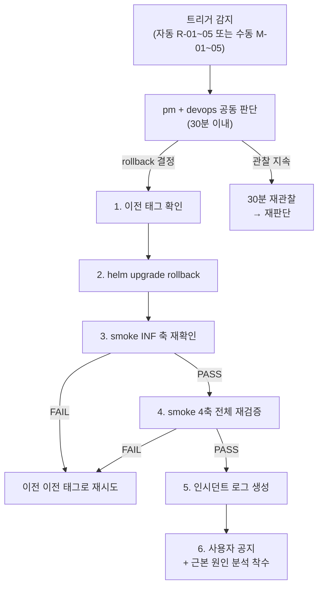

# 11. Rollback 기준 및 절차

> 최종 업데이트: 2026-04-24
> 작성 배경: `day2-2026-04-23` 태그 배포 후 회귀 발생 시 rollback 기준이 부재해
> 사용자가 플레이테스트 스크린샷 16장으로 직접 발견·보고하는 구조가 되었음.
> SRE 기본 원칙 위반. 본 문서는 자동·수동 rollback 트리거와 절차를 정의한다.
> 근거 스탠드업: `work_logs/scrums/2026-04-24-01.md` §devops 반성

---

## 1. Rollback 트리거 기준

### 1-A. 자동 Rollback 트리거 (즉시 실행)

K8s Probe 또는 Prometheus Alert 조건 충족 시 on-call devops 가 즉시 rollback.
현재 Prometheus 미정의 항목은 수동 확인으로 대체 (별도 티켓으로 메트릭 추가 예정).

| # | 트리거 | 임계치 | 측정 방법 | 조치 |
|---|--------|--------|---------|------|
| R-01 | `/api/health` 5xx 연속 | 30초 이상 | `curl` 루프 또는 Prometheus `http_requests_total` | 즉시 rollback |
| R-02 | WS 에러율 급증 | 5% 초과 30초 | game-server 로그 `ws_error` 카운트 | 즉시 rollback |
| R-03 | game-server crash-loop | 3회 (5분 이내) | `kubectl get pods -n rummikub` RESTARTS | 즉시 rollback |
| R-04 | ai-adapter crash-loop | 3회 (5분 이내) | `kubectl get pods -n rummikub` RESTARTS | 즉시 rollback |
| R-05 | Redis 연결 실패 | `/api/health/redis` 비정상 30초 | health endpoint | 즉시 rollback |

```bash
# 자동 트리거 확인 스크립트 (배포 후 5분간 모니터링)
scripts/smoke.sh --watch --duration 300
```

### 1-B. 수동 Rollback 트리거 (pm + devops 공동 판단)

| # | 트리거 | 판단 기준 | 조치 |
|---|--------|---------|------|
| M-01 | 사용자 스크린샷/영상 기반 회귀 | 동일 사용자 2건 이상 또는 critical path 1건 | 30분 이내 rollback 결정 |
| M-02 | Critical Path 차단 | 로그인 / 방 생성 / 게임 진행 / 저장 중 하나라도 막힘 | 즉시 rollback |
| M-03 | Smoke 4축 중 1축 FAIL | 배포 후 smoke 재검증 실패 | 즉시 rollback |
| M-04 | 데이터 정합성 오류 | PostgreSQL 또는 Redis 상태 불일치 | 즉시 rollback + DBA 개입 |
| M-05 | 보안 취약점 배포 | Critical CVE 또는 인증 우회 경로 확인 | 즉시 rollback + security 개입 |

**Critical Path 정의:**
- 로그인: Google OAuth 또는 dev-login 성공 → JWT 발급
- 방 생성: `POST /api/rooms` 200 OK → 방 목록 노출
- 게임 진행: WS 연결 → `GAME_STATE` 수신 → 타일 놓기 → `CONFIRM_TURN` 성공
- 저장: 게임 종료 → PostgreSQL game_sessions 레코드 생성

### 1-C. 판단 유보 (관찰 지속)

아래 상황은 즉시 rollback 대신 30분 관찰 후 재판단:

- 단일 사용자 1건 버그 보고 (재현 불가 수준)
- Ollama Known Flaky 4건 범위 내 에러
- 비 critical path 의 UX 불편 (i18n 오타 등 — hotfix 로 처리)

---

## 2. Rollback 절차



### 단계별 명령

#### 1. 이전 태그 확인

```bash
# 배포 히스토리 확인
helm history rummiarena -n rummikub

# Git 태그 목록 (날짜 역순)
git tag -l "day*" | sort -r | head -10
```

#### 2. helm upgrade rollback

```bash
# 방법 A: helm rollback (이전 revision 으로 복구)
helm rollback rummiarena 0 -n rummikub
# 0 = 이전 revision. 특정 revision 지정 가능 (helm history 에서 REVISION 번호 확인)

# 방법 B: 특정 태그 이미지로 강제 업그레이드
PREV_TAG="day2-2026-04-23"  # 이전 정상 태그
helm upgrade rummiarena helm/ \
  -n rummikub \
  --set gameServer.image.tag=${PREV_TAG} \
  --set frontend.image.tag=${PREV_TAG} \
  --set aiAdapter.image.tag=${PREV_TAG} \
  --wait \
  --timeout 5m
```

#### 3. 배포 후 즉시 확인

```bash
# Pod 상태 확인 (2분 이내 Running 기대)
kubectl rollout status deployment/game-server -n rummikub --timeout=120s
kubectl rollout status deployment/frontend -n rummikub --timeout=120s
kubectl rollout status deployment/ai-adapter -n rummikub --timeout=120s

# Health 체크
curl -sf http://localhost:30080/api/health
```

#### 4. smoke 재검증

```bash
scripts/smoke.sh --all
```

#### 5. 인시던트 로그 생성

```bash
# 파일 경로 규칙: work_logs/incidents/YYYY-MM-DD.md
# 내용 필수 항목:
#   - 트리거 종류 (R-0N / M-0N)
#   - 발견 시각 및 최초 보고자
#   - 영향 범위 (어느 critical path)
#   - rollback 완료 시각
#   - 임시 조치 및 근본 원인 가설
#   - 후속 조치 (이슈 번호)
```

---

## 3. Rollback 기준 요약표

| 구분 | 트리거 | 임계치 | 판단자 | 목표 시간 |
|------|--------|--------|--------|---------|
| 자동 R-01 | `/health` 5xx | 30초 연속 | devops | 즉시 |
| 자동 R-02 | WS 에러율 | 5% 초과 30초 | devops | 즉시 |
| 자동 R-03 | game-server crash | 3회/5분 | devops | 즉시 |
| 자동 R-04 | ai-adapter crash | 3회/5분 | devops | 즉시 |
| 자동 R-05 | Redis 연결 실패 | 30초 | devops | 즉시 |
| 수동 M-01 | 사용자 회귀 보고 | 2건 이상 | pm + devops | 30분 내 결정 |
| 수동 M-02 | Critical Path 차단 | 1건 | pm + devops | 즉시 |
| 수동 M-03 | Smoke 축 FAIL | 1축 이상 | pm + devops | 즉시 |
| 수동 M-04 | 데이터 정합성 | 불일치 확인 | pm + devops | 즉시 |
| 수동 M-05 | 보안 취약점 배포 | Critical CVE | security + devops | 즉시 |

---

## 4. 책임 구조

| 역할 | 책임 |
|------|------|
| devops (on-call) | 자동 트리거 감지, rollback 명령 실행, 인시던트 로그 초안 |
| pm | 수동 트리거 최종 판단 공동 서명, 사용자 공지, 이슈 등록 |
| qa | smoke 재검증 실행 및 PASS/FAIL 판정 |
| go-dev | 근본 원인 분석 (game-server 관련) |
| frontend-dev | 근본 원인 분석 (UI 관련) |

---

## 5. Grafana 대시보드 연결 (현재 상태 및 계획)

**현재**: Prometheus + Grafana 기본 지표(`/metrics` endpoint) 기반.
게임 UX 메트릭(WS drag stuck률, meld 성공률 등)은 미정의 — 별도 티켓 예정.

**임시 모니터링 명령** (메트릭 대시보드 구축 전):

```bash
# WS 에러 카운트 실시간 추적
kubectl logs -n rummikub deployment/game-server --follow | grep -E "ws_error|crash|panic"

# Pod 재시작 감시
watch -n 10 'kubectl get pods -n rummikub'

# Health endpoint 루프 체크 (30초 간격)
while true; do
  STATUS=$(curl -so /dev/null -w "%{http_code}" http://localhost:30080/api/health)
  echo "$(date) health=$STATUS"
  [ "$STATUS" != "200" ] && echo "ALERT: health non-200 for 30s monitoring" 
  sleep 10
done
```

**Week 2 예정**: Grafana에 `ws_error_rate`, `game_turn_duration_seconds`, `meld_success_rate` 패널 추가.

---

## 6. 인시던트 로그 템플릿

`work_logs/incidents/YYYY-MM-DD.md` 생성 시 아래 형식 사용:

```markdown
# 인시던트 YYYY-MM-DD

- **트리거**: R-0N / M-0N
- **발견 시각**: HH:MM KST
- **최초 보고**: (사용자명 또는 시스템)
- **영향 배포 태그**: dayN-YYYY-MM-DD
- **영향 Critical Path**: (로그인/방생성/게임진행/저장)
- **Rollback 완료**: HH:MM KST (이전 태그: ...)
- **근본 원인 가설**: ...
- **후속 이슈**: #XXX
- **재발 방지**: ...
```

---

## 변경 이력

| 날짜 | 내용 | 담당 |
|------|------|------|
| 2026-04-24 | 신규 작성 — 자동 R-01~05 + 수동 M-01~05 rollback 기준 정의 | devops |
