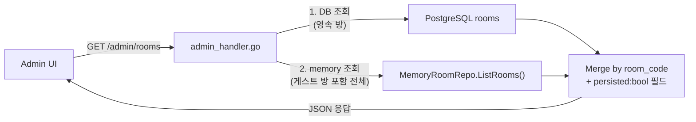

# RummiArena Admin FAQ (관리자 자주 묻는 질문)

> **대상**: 운영자 · 관리자 · 디버깅 중인 개발자
> **목적**: 설계상 의도된 동작이지만 UI/쿼리 결과만 보면 "버그처럼" 보이는 사례를 정리한다. "버그 신고" 전에 본 문서에서 먼저 해당 증상이 설명되어 있는지 확인한다.
> **작성일**: 2026-04-22 (Sprint 7 D+1)
> **유지보수**: architect + devops 공동 책임
> **참고**:
> - `docs/06-operations/01-container-operations-guide.md`
> - `docs/06-operations/02-recovery-runbook.md`
> - `docs/06-operations/04-pr-workflow-operations-guide.md`

---

## 목차

1. [DB / 영속 관련](#1-db--영속-관련)
   - 1.1 [게스트 방이 rooms 테이블에 없다 (ADR-025)](#11-게스트-방이-rooms-테이블에-없다-adr-025)
2. [공통 확인 절차](#2-공통-확인-절차)

---

## 1. DB / 영속 관련

### 1.1 게스트 방이 rooms 테이블에 없다 (ADR-025)

#### 증상

- admin DB 쿼리(`SELECT * FROM rooms;`) 결과에 방 일부가 누락된 것처럼 보인다.
- 공개 `GET /api/rooms` 응답에서는 보이는 방이 DB 에는 없다.
- 미래 admin rooms 페이지 도입 후: "운영자 화면에서 전체 방 수 < 실제 활동 방 수" 로 오차 발생.

#### 원인 (설계상 의도된 동작)

**게스트(비-UUID 호스트) 가 생성한 방은 `rooms` 테이블에 기록하지 않는다.** 이는 FK 제약(`rooms.host_user_id → users.id`) 무결성을 지키기 위한 영구 설계 결정이다.

- 전체 배경과 대안 검토: **`docs/02-design/48-adr-025-guest-room-persistence.md` (ADR-025)**
- 관련 코드: `src/game-server/internal/service/room_converter.go:14-18` — `roomStateToModel` 이 `HostID` 가 UUID 형식이 아니면 `nil` 반환 → 호출자가 DB INSERT 스킵
- 관련 WARN: WARN-04 (`docs/04-testing/74-warn-items-impact-assessment.md`)
- 관련 PR: #42 (D-03 Phase 1 Dual-Write)

#### 영향 받는 호스트 식별자 예시

| HostID 형식 | 예시 | `rooms` 기록 여부 |
|-------------|------|-------------------|
| UUID v4 (Google OAuth 로그인) | `3f2e9a11-0d4c-4e8a-...` | ✅ 기록됨 |
| 게스트 / QA 테스터 | `qa-테스터-12`, `guest-a3f1` | ❌ **기록 안 됨 (설계 의도)** |

#### 확인 방법

**Step 1 — DB 쿼리로 "영속된 방" 확인**

```bash
# PostgreSQL 에 기록된 방(로그인 사용자 호스트만)
kubectl exec -n rummikub deploy/postgres -- \
  psql -U rummikub -d rummikub -c \
  "SELECT id, room_code, name, host_user_id, status, created_at
   FROM rooms
   ORDER BY created_at DESC
   LIMIT 20;"
```

**Step 2 — memory repo(게스트 방 포함 전체) 확인**

```bash
# game-server 의 공개 ListRooms API (memory repo 경유)
# 게스트 방까지 모두 포함된다.
kubectl exec -n rummikub deploy/game-server -- \
  curl -s http://localhost:8080/api/rooms | jq '.'
```

**Step 3 — 차이 집합 해석**

- Step 2 에만 있고 Step 1 에 없는 방 = **게스트 호스트 방** → 정상 (ADR-025)
- Step 1 에 있고 Step 2 에 없는 방 = **종료 또는 GC 된 영속 방** → 정상 (memory repo TTL)
- 양쪽 모두 있음 = **로그인 사용자 방** → 정상

#### 버그 vs 설계의도 판별 체크리스트

다음 중 **하나라도** 해당하면 **설계 의도(정상)** 이므로 이슈 생성 불필요.

- [ ] 누락된 방의 호스트가 게스트(`qa-*`, `guest-*`, 자유문자열)다.
- [ ] 공개 `ListRooms` API 에서는 해당 방이 보인다.
- [ ] `roomStateToModel` 호출 직후 game-server 로그에 `nil room_state, skipping DB write` 류 DEBUG 로그가 있다 (로그 레벨 DEBUG 인 경우).

다음 중 **하나라도** 해당하면 **실제 버그 가능성** — 이슈 생성 권장.

- [ ] 호스트가 **UUID 형식인데도** `rooms` 테이블에 없다.
- [ ] `games.room_id` 는 설정되어 있는데 참조된 `rooms.id` 가 없다 (FK violation 정황).
- [ ] Dual-Write INSERT 에서 에러 로그(`failed to insert room`)가 나왔는데 UUID 호스트 방이다.

#### 미래 admin rooms 페이지 구현 시 반드시 지킬 규약

admin 대시보드에 rooms 조회 UI 를 도입할 때, **DB 쿼리만으로 방을 나열하면 안 된다.** 반드시 다음 흐름을 따른다.



- 응답 DTO 에 `persisted: boolean` 플래그를 포함하여 UI 가 게스트 방을 시각적으로 구분(뱃지 등) 한다.
- 구현 PR 설명에 반드시 **ADR-025 를 인용** 한다.
- 상세: `docs/02-design/48-adr-025-guest-room-persistence.md` §6.3

#### 완화 정책 요약

| 완화 수단 | 상태 |
|-----------|------|
| ADR-025 문서화 | ✅ (`docs/02-design/48-*`) |
| 코드 주석 — `roomStateToModel` 독스트링 | ✅ (`room_converter.go:8-11`) |
| 운영 FAQ 등재 | ✅ (본 섹션) |
| admin rooms UI 설계 지침 | ✅ (ADR-025 §6.3) |

---

## 2. 공통 확인 절차

FAQ 에 없는 증상일 경우 다음 순서로 진단한다.

1. **파드 상태 확인** — `kubectl get pods -n rummikub` (Runbook §1)
2. **로그 확인** — `kubectl logs -n rummikub deploy/game-server --tail 200`
3. **WARN 리포트 검토** — `docs/04-testing/74-warn-items-impact-assessment.md` (최신)
4. **ADR 목록 검색** — `grep -rn "ADR-0" docs/02-design/` 으로 해당 영역 결정 이력 확인
5. 위 모두 해당 없음 → **이슈 생성** (GitHub `bug-report.yml` 템플릿)

---

> **문서 이력**
>
> | 버전 | 날짜 | 작성자 | 내용 |
> |------|------|--------|------|
> | 1.0 | 2026-04-22 | architect (Opus 4.7 xhigh) | 초안 — ADR-025 WARN-04 완화 FAQ 등재 |
