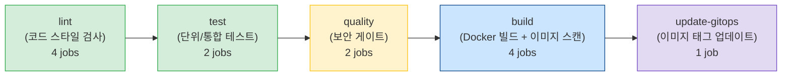
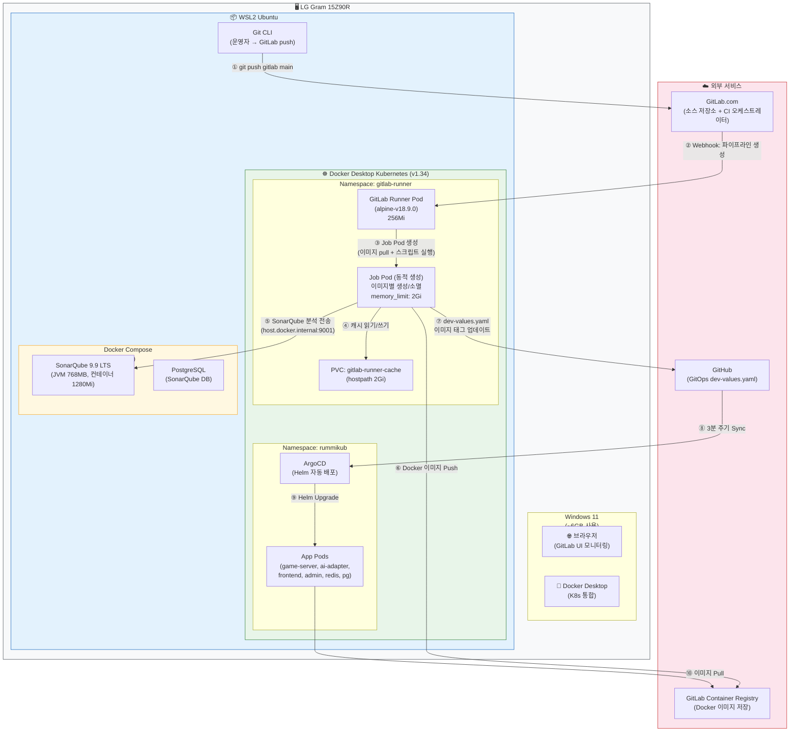
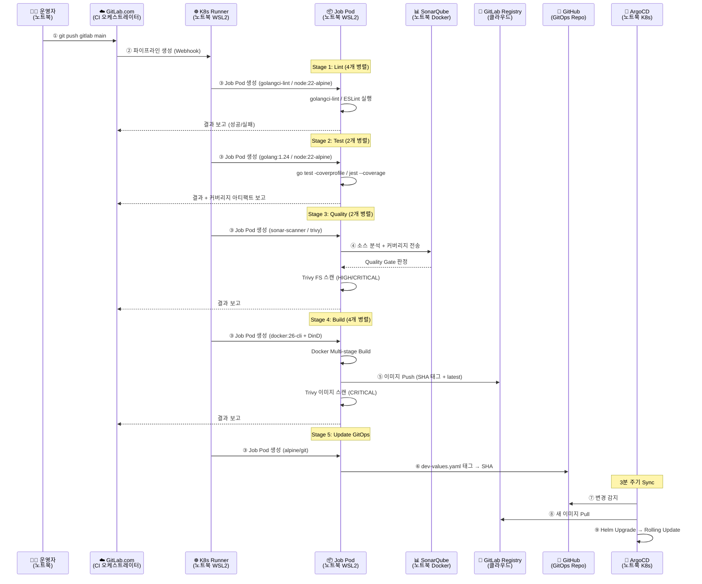
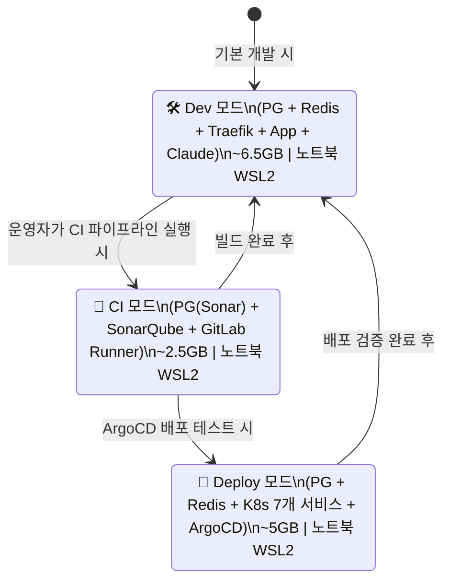
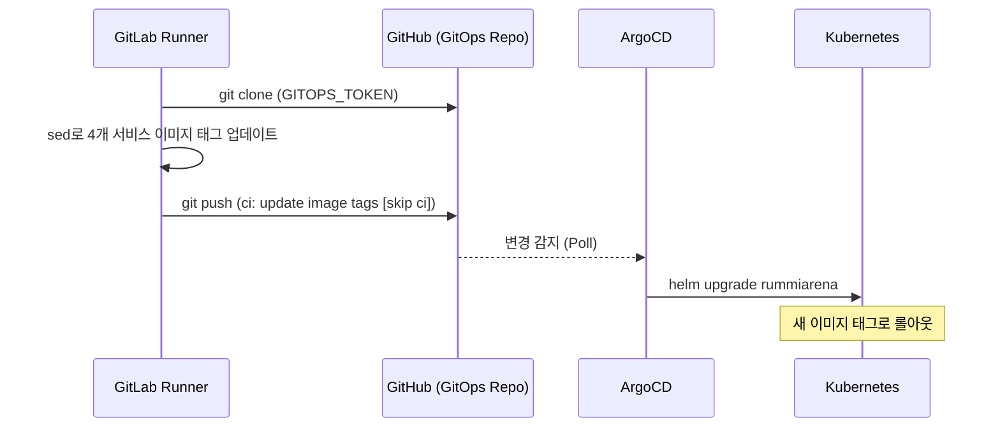

# GitLab CI/CD 운영 매뉴얼

**문서 번호**: OPS-003
**작성일**: 2026-04-02
**작성자**: DevOps Agent
**적용 대상**: RummiArena GitLab CI/CD 파이프라인 (WSL2 + Docker Desktop K8s)

---

## 1. 개요

### 1.1 파이프라인 구조

RummiArena CI/CD 파이프라인은 5단계로 구성된다. 각 단계는 이전 단계가 성공해야 진행되며, `allow_failure: false`인 job이 실패하면 이후 단계가 즉시 중단된다.



총 13개 job이 병렬/직렬로 조합되어 실행된다. 전체 파이프라인 완주 시 GitLab Container Registry에 이미지가 등록되고, ArgoCD가 감시하는 `dev-values.yaml`의 이미지 태그가 자동 업데이트된다.

### 1.2 물리 아키텍처 — CI/CD 실행 환경

운영자의 노트북에서 파이프라인이 실행되는 전체 물리 구조:



### 1.3 실행 환경 요약

| 항목 | 값 | 물리 위치 |
|------|-----|----------|
| CI 플랫폼 | GitLab.com (SaaS) | 클라우드 (파이프라인 오케스트레이션) |
| Runner | rummiarena-k8s-runner (K8s Executor) | 노트북 → WSL2 → K8s `gitlab-runner` NS |
| Job Pod | 동적 생성/소멸 (이미지별) | 노트북 → WSL2 → K8s `gitlab-runner` NS |
| Job Pod 메모리 | request 512Mi / limit 2Gi | 노트북 RAM에서 할당 |
| SonarQube | docker-compose (localhost:9001) | 노트북 → WSL2 → Docker Compose |
| Container Registry | `registry.gitlab.com/k82022603/rummiarena` | GitLab 클라우드 |
| GitOps 저장소 | `github.com/k82022603/RummiArena` | GitHub 클라우드 |
| ArgoCD | K8s `rummikub` namespace | 노트북 → WSL2 → K8s |
| PVC 캐시 | gitlab-runner-cache (hostpath 2Gi) | 노트북 SSD |

### 1.4 데이터 흐름 시퀀스



### 1.5 교대 실행 전략 (10GB WSL 제약)

16GB 물리 RAM에서 WSL2에 10GB를 할당한 환경이므로, 모든 서비스를 동시에 실행할 수 없다. 세 가지 모드를 교대로 사용한다.



**핵심 규칙**: Dev/Deploy 모드와 CI 모드를 동시에 실행하지 않는다. 모든 모드는 **동일한 노트북의 WSL2** 위에서 실행된다.

---

## 2. 파이프라인 스테이지별 설명

### 2.1 lint Stage (코드 스타일 검사)

4개 job이 **병렬 실행**된다. 캐시 정책은 `pull-push`로 캐시를 읽고 갱신한다.

#### lint-go

| 항목 | 값 |
|------|-----|
| 목적 | Go 코드 정적 분석 (golangci-lint) |
| 이미지 | `golangci/golangci-lint:v2.1` |
| timeout | 15m |
| 작업 경로 | `src/game-server/` |
| 캐시 | `go.sum` 파일 해시 기반, `.cache/go/` 경로 |
| 주요 설정 | `GOGC=50` (GC 빈도 증가로 메모리 절감), `-j 1` (단일 스레드 빌드) |
| 성공 기준 | golangci-lint 규칙 위반 0건 |
| 실행 조건 | main, develop, MR |

```bash
# 주요 실행 명령
golangci-lint run ./... --timeout 10m --build-tags="" -j 1
```

> `v2.1` 선택 이유: Go 1.24 지원. v1.62는 Go 1.23 기반으로 toolchain 버전 불일치 발생.
> `-j 1` 설정 이유: 10GB WSL 환경에서 병렬 빌드 시 OOM Kill 발생 방지.

#### lint-nest

| 항목 | 값 |
|------|-----|
| 목적 | AI Adapter NestJS 코드 ESLint 검사 |
| 이미지 | `node:22-alpine` |
| timeout | 15m |
| 작업 경로 | `src/ai-adapter/` |
| 캐시 | `package-lock.json` 해시 기반, `node_modules/` + `.cache/npm/` |
| 성공 기준 | ESLint 경고/오류 0건 |
| 실행 조건 | main, develop, MR |

#### lint-frontend

| 항목 | 값 |
|------|-----|
| 목적 | Frontend Next.js 코드 ESLint 검사 |
| 이미지 | `node:22-alpine` |
| timeout | 15m |
| 작업 경로 | `src/frontend/` |
| 캐시 | `package-lock.json` 해시 기반 |
| 성공 기준 | ESLint 경고/오류 0건 |
| 실행 조건 | main, develop, MR |

#### lint-admin

| 항목 | 값 |
|------|-----|
| 목적 | Admin Dashboard Next.js 코드 ESLint 검사 |
| 이미지 | `node:22-alpine` |
| timeout | 15m |
| 작업 경로 | `src/admin/` |
| 캐시 | `package-lock.json` 해시 기반 |
| 성공 기준 | ESLint 경고/오류 0건 |
| 실행 조건 | main, develop, MR |

### 2.2 test Stage (단위/통합 테스트)

2개 job이 **병렬 실행**된다. 캐시 정책은 `pull`(읽기 전용)이며, 커버리지 아티팩트를 7일간 보관한다.

#### test-go

| 항목 | 값 |
|------|-----|
| 목적 | Go 단위/통합 테스트 + 커버리지 수집 |
| 이미지 | `golang:1.24-alpine` |
| timeout | 15m |
| before_script | `apk add --no-cache gcc musl-dev` |
| 주요 설정 | `GOGC=50`, `-p 1` (패키지 순차 빌드/테스트, 메모리 피크 방지) |
| 성공 기준 | 전체 테스트 PASS, 커버리지 프로파일 생성 |
| 산출물 | `coverage.out`, `coverage_sonar.out` (SonarQube용 경로 변환), `coverage.xml` (Cobertura) |
| 아티팩트 보관 | 7일 |

```bash
# 핵심 실행 명령
go build -p 1 ./...
go test ./... -p 1 -coverprofile=coverage.out -covermode=atomic -timeout 120s
go tool cover -func=coverage.out
GOBIN=/usr/local/bin go install github.com/boumenot/gocover-cobertura@latest
gocover-cobertura < coverage.out > coverage.xml
# SonarQube용 경로 변환
sed "s|github.com/k82022603/RummiArena/game-server/|src/game-server/|g" coverage.out > coverage_sonar.out
```

> `GOBIN=/usr/local/bin` 명시 이유: CI 환경에서 `$GOPATH/bin`이 PATH에 포함되지 않아 `gocover-cobertura` 명령을 찾지 못하는 것을 방지.

#### test-nest

| 항목 | 값 |
|------|-----|
| 목적 | AI Adapter Jest 단위 테스트 + 커버리지 수집 |
| 이미지 | `node:22-alpine` |
| timeout | 10m |
| 성공 기준 | 전체 테스트 PASS |
| 산출물 | `coverage/cobertura-coverage.xml`, `coverage/lcov.info` |
| 아티팩트 보관 | 7일 |

```bash
npm ci --prefer-offline
npx jest --coverage --coverageReporters=text --coverageReporters=lcov --coverageReporters=cobertura
```

### 2.3 quality Stage (보안 게이트)

`sonarqube`와 `trivy-fs` 2개 job이 **병렬 실행**된다. 이 단계가 DevSecOps의 핵심이다.

#### sonarqube

| 항목 | 값 |
|------|-----|
| 목적 | 정적 코드 분석 + Quality Gate 검증 |
| 이미지 | `sonarsource/sonar-scanner-cli:5.0` |
| timeout | 20m |
| 의존 job | `test-go`, `test-nest` (커버리지 아티팩트 소비) |
| JVM 메모리 | Scanner `-Xmx384m`, Node `-max-old-space-size=256` |
| 성공 기준 | Quality Gate PASSED |
| 실행 조건 | main, develop (MR 제외) |

SonarQube 서버 기동 확인 로직이 내장되어 있다. 서버가 UP 상태가 될 때까지 최대 12회(2분) 대기하며, 미기동 시 조기 실패한다.

Quality Gate 조건 (`RummiArena-Dev` 커스텀 게이트):

| 지표 | 기준 | 대상 |
|------|------|------|
| 신규 코드 커버리지 | 30% 이상 | New Code |
| 새 버그 | 0건 (등급 A) | New Code |
| 새 취약점 | 0건 (등급 A) | New Code |
| 새 코드 스멜 | 등급 A | New Code |
| 중복 코드 | 10% 미만 | New Code |

> `sonar-scanner-cli:5.0` 고정 이유: SonarQube 9.9 LTS 호환. `:latest`는 v2 API를 사용하여 `v2 API not found` 오류 발생.

#### trivy-fs

| 항목 | 값 |
|------|-----|
| 목적 | 소스 코드 파일시스템 취약점 스캔 |
| 이미지 | `aquasec/trivy:0.58.2` (entrypoint: [""]) |
| timeout | 10m |
| 스캔 대상 | `src/` 디렉토리 |
| 차단 기준 | HIGH 또는 CRITICAL CVE 발견 시 exit code 1 |
| 캐시 | `trivy-db-cache` 고정 키, DB 재다운로드 방지 |
| 제외 경로 | `node_modules`, `.cache` |
| 실행 조건 | main, MR |

```bash
trivy fs --exit-code 1 --severity HIGH,CRITICAL --no-progress --format table \
    --cache-dir "$TRIVY_CACHE_DIR" \
    --skip-dirs "src/ai-adapter/node_modules,src/frontend/node_modules,src/admin/node_modules,.cache" \
    src/
```

### 2.4 build Stage (Docker 빌드 + 이미지 스캔)

4개 job이 **병렬 실행**된다. `.build-common` YAML 앵커로 공통 설정을 재사용한다. **main 브랜치에서만 실행**된다.

#### 공통 설정

| 항목 | 값 |
|------|-----|
| 이미지 | `docker:26-cli` + `docker:26-dind` (DinD 서비스) |
| timeout | 15m |
| before_script | GitLab Container Registry 로그인 |
| 태그 전략 | `$CI_COMMIT_SHA` + `latest` 이중 태그 |
| 레이어 캐시 | `--cache-from $DOCKER_IMAGE/<서비스>:latest` |

#### 각 서비스별 빌드

| Job | 빌드 컨텍스트 | Dockerfile target | 이미지 태그 |
|-----|-------------|-------------------|------------|
| build-game-server | `src/game-server/` | `runner` | `$DOCKER_IMAGE/game-server:$CI_COMMIT_SHA` |
| build-ai-adapter | `src/ai-adapter/` | `runner` | `$DOCKER_IMAGE/ai-adapter:$CI_COMMIT_SHA` |
| build-frontend | `src/frontend/` | `runner` | `$DOCKER_IMAGE/frontend:$CI_COMMIT_SHA` |
| build-admin | `src/admin/` | `runner` | `$DOCKER_IMAGE/admin:$CI_COMMIT_SHA` |

각 빌드 완료 후 **Trivy 이미지 스캔**이 즉시 실행된다. CRITICAL 취약점 발견 시 파이프라인이 중단된다.

```bash
docker run --rm \
    -v /var/run/docker.sock:/var/run/docker.sock \
    aquasec/trivy:0.58.2 image \
    --exit-code 1 --severity CRITICAL --no-progress \
    $DOCKER_IMAGE/game-server:$CI_COMMIT_SHA
```

> 파일시스템 스캔(trivy-fs)은 HIGH+CRITICAL, 이미지 스캔은 CRITICAL만 차단하는 이유: 이미지 스캔은 런타임 의존성만 포함하므로 CRITICAL만 차단하여 빌드 실패를 최소화한다.

### 2.5 update-gitops Stage (GitOps 이미지 태그 업데이트)

| 항목 | 값 |
|------|-----|
| 목적 | ArgoCD가 감시하는 `dev-values.yaml` 이미지 태그를 커밋 SHA로 업데이트 |
| 이미지 | `alpine/git:latest` (entrypoint: [""]) |
| timeout | 5m |
| 의존 job | build 4개 모두 성공 필요 (`needs:`) |
| 실행 조건 | main 브랜치, `when: on_success` |
| 커밋 메시지 | `ci: update image tags to $CI_COMMIT_SHA [skip ci]` |



> `[skip ci]` 마커: GitHub에 push 후 GitLab이 이 커밋을 감지하여 무한 루프 파이프라인이 트리거되는 것을 방지한다.

### 2.6 브랜치별 실행 범위 요약

| Job | main | develop | MR |
|-----|:----:|:-------:|:--:|
| lint-go / lint-nest / lint-frontend / lint-admin | O | O | O |
| test-go / test-nest | O | O | O |
| sonarqube | O | O | X |
| trivy-fs | O | X | O |
| build-game-server / build-ai-adapter / build-frontend / build-admin | O | X | X |
| update-gitops | O | X | X |

---

## 3. Runner 관리

### 3.1 Runner 상태 확인

```bash
# Runner Pod 상태 확인 (Running이어야 함)
kubectl get pods -n gitlab-runner -l app=gitlab-runner

# Runner Pod 로그 확인
kubectl logs -n gitlab-runner deploy/gitlab-runner --tail=30

# Helm 릴리스 상태
helm status gitlab-runner -n gitlab-runner

# GitLab.com에서 Runner 온라인 상태 확인
# 프로젝트 -> Settings -> CI/CD -> Runners -> Runner 목록
```

Job Pod 상태 확인 (파이프라인 실행 중):

```bash
# 현재 실행 중인 Job Pod 목록
kubectl get pods -n gitlab-runner --field-selector=status.phase=Running

# 모든 Job Pod 확인 (Completed, Error 포함)
kubectl get pods -n gitlab-runner
```

### 3.2 Runner 재시작 절차

```bash
# Runner Deployment 재시작 (Pod 순차 교체)
kubectl rollout restart deploy/gitlab-runner -n gitlab-runner

# 재시작 완료 대기
kubectl rollout status deploy/gitlab-runner -n gitlab-runner --timeout=120s

# 재시작 후 상태 확인
kubectl get pods -n gitlab-runner -l app=gitlab-runner
kubectl logs -n gitlab-runner deploy/gitlab-runner --tail=10
```

### 3.3 Helm values 변경 및 업그레이드

Runner 설정을 변경할 때는 `helm/gitlab-runner-values.yaml` 파일을 수정한 후 업그레이드한다.

```bash
# values 파일 위치
# /mnt/d/Users/KTDS/Documents/06.과제/RummiArena/helm/gitlab-runner-values.yaml

# dry-run으로 변경 사항 검증
helm upgrade gitlab-runner gitlab/gitlab-runner \
    -n gitlab-runner \
    -f helm/gitlab-runner-values.yaml \
    --dry-run

# 실제 업그레이드 적용
helm upgrade gitlab-runner gitlab/gitlab-runner \
    -n gitlab-runner \
    -f helm/gitlab-runner-values.yaml

# 롤아웃 상태 확인
kubectl rollout status deploy/gitlab-runner -n gitlab-runner --timeout=120s
```

주요 설정값 (현재 적용 중):

```yaml
gitlabUrl: https://gitlab.com
runners:
  executor: kubernetes
  name: rummiarena-k8s-runner
  tags: "k8s,rummiarena,docker"
  runUntagged: true
  config: |
    [[runners]]
      cache_dir = "/cache"
      [runners.kubernetes]
        namespace = "gitlab-runner"
        image = "alpine"
        cpu_request = "200m"
        cpu_limit = "1"
        memory_request = "256Mi"
        memory_limit = "1Gi"
        [[runners.kubernetes.volumes.pvc]]
          name = "gitlab-runner-cache"
          mount_path = "/cache"
```

> `--set runnerToken=glrt-xxx.01.yyy` 사용 금지: `.`이 Helm 경로 구분자로 해석되어 오류 발생. 반드시 values 파일로 전달한다.

### 3.4 PVC 캐시 관리

Runner Job Pod는 PVC(`gitlab-runner-cache`)를 `/cache`에 마운트하여 빌드 캐시를 공유한다.

```bash
# PVC 상태 확인
kubectl get pvc -n gitlab-runner

# PVC 사용량 확인 (Pod 내부에서)
kubectl exec -n gitlab-runner deploy/gitlab-runner -- df -h /cache 2>/dev/null || \
    echo "Runner Pod에서 직접 확인 필요"

# 캐시 초기화가 필요한 경우 (PVC 삭제 후 재생성)
kubectl delete pvc gitlab-runner-cache -n gitlab-runner
kubectl apply -f - <<EOF
apiVersion: v1
kind: PersistentVolumeClaim
metadata:
  name: gitlab-runner-cache
  namespace: gitlab-runner
spec:
  accessModes: [ReadWriteOnce]
  storageClassName: hostpath
  resources:
    requests:
      storage: 2Gi
EOF
```

### 3.5 Error/Zombie Pod 정리

파이프라인 실행 중 실패하거나 타임아웃된 Job Pod가 잔류할 수 있다.

```bash
# Error 상태 Pod 확인
kubectl get pods -n gitlab-runner --field-selector=status.phase=Failed

# Error/Completed Pod 일괄 삭제
kubectl delete pods -n gitlab-runner --field-selector=status.phase=Failed
kubectl delete pods -n gitlab-runner --field-selector=status.phase=Succeeded

# 특정 Pod 강제 삭제 (Terminating 상태에서 멈춘 경우)
kubectl delete pod <pod-name> -n gitlab-runner --force --grace-period=0

# 1시간 이상 경과한 Completed Pod 정리
kubectl get pods -n gitlab-runner --no-headers | \
    awk '/Completed|Error/ {print $1}' | \
    xargs -r kubectl delete pod -n gitlab-runner
```

---

## 4. CI 모드 전환

### 4.1 전환 원칙

Dev/Deploy 모드와 CI 모드를 동시에 실행하면 OOM Kill이 발생한다. 반드시 다른 모드의 서비스를 중지한 후 CI 모드로 진입한다.

### 4.2 Dev 모드에서 CI 모드로 전환

```bash
# 1. K8s 서비스 스케일 다운 (선택: K8s Pod 메모리 회수)
kubectl scale deployment --all --replicas=0 -n rummikub

# 2. 메모리 여유 확인 (최소 2.5GB 필요)
free -h

# 3. SonarQube + DB 기동
./scripts/setup-cicd.sh sonarqube

# 4. SonarQube 기동 확인
curl -sf http://localhost:9001/api/system/status
# 기대 응답: {"status":"UP"}

# 5. GitLab에 push (파이프라인 트리거)
git push origin main
# (origin에 GitHub + GitLab 동시 push가 설정된 경우 한 번으로 충분)
```

### 4.3 CI 모드 종료 후 Dev 모드 복귀

```bash
# 1. SonarQube 환경 중지 (볼륨 데이터 유지)
./scripts/setup-cicd.sh down
# 또는
docker compose -f docker-compose.cicd.yml down

# 2. K8s 서비스 스케일 업 (Dev/Deploy 모드 복귀)
kubectl scale deployment --all --replicas=1 -n rummikub

# 3. 서비스 정상 확인
kubectl get pods -n rummikub
```

### 4.4 SonarQube 단독 시작/중지

```bash
# SonarQube + 전용 DB만 기동
docker compose -f docker-compose.cicd.yml up -d sonarqube-db sonarqube

# 상태 확인
docker compose -f docker-compose.cicd.yml ps

# SonarQube 로그 실시간 확인
docker compose -f docker-compose.cicd.yml logs -f sonarqube

# SonarQube만 재시작 (DB 유지)
docker compose -f docker-compose.cicd.yml restart sonarqube

# 전체 중지 (데이터 유지)
docker compose -f docker-compose.cicd.yml down

# 데이터 포함 삭제 (분석 이력 초기화 -- 주의)
docker compose -f docker-compose.cicd.yml down -v
```

### 4.5 switch-wslconfig.sh 사용법

RummiArena와 hybrid-rag-knowledge-ops 프로젝트 간 WSL2 메모리 프로파일을 전환한다.

```bash
# RummiArena용 프로파일 적용 (10GB, K8s 개발)
bash scripts/switch-wslconfig.sh rummiarena

# hybrid-rag용 프로파일 적용 (14GB, 임베딩 파이프라인)
bash scripts/switch-wslconfig.sh hybrid-rag

# 현재 설정 확인
bash scripts/switch-wslconfig.sh status
```

> 프로파일 전환 후 PowerShell에서 `wsl --shutdown` 실행이 필요하다. 모든 WSL2 인스턴스와 Docker Desktop이 종료된다.

---

## 5. 트러블슈팅

### 5.1 lint-go OOM Kill

**증상**: lint-go job Pod가 `OOMKilled` 상태로 종료. 로그에 `signal: killed` 출력.

**원인**: golangci-lint가 기본 병렬 빌드를 수행하면서 메모리를 초과 사용.

**해결**:

```yaml
# .gitlab-ci.yml lint-go job
variables:
  GOGC: "50"           # GC 빈도를 2배로 증가 (기본 100 -> 50)
script:
  - golangci-lint run ./... --timeout 10m -j 1   # 단일 스레드로 빌드
```

- `GOGC=50`: Go GC가 더 자주 실행되어 메모리 피크를 낮춘다
- `-j 1`: 병렬 빌드 대신 순차 빌드로 동시 메모리 사용량을 절감한다

### 5.2 test-go OOM Kill

**증상**: test-go job Pod가 `OOMKilled` 상태. `go test` 도중 프로세스 종료.

**원인**: 다수 패키지를 동시 테스트하면서 메모리 피크 발생.

**해결**:

```yaml
variables:
  GOGC: "50"
script:
  - go build -p 1 ./...        # 패키지별 순차 빌드
  - go test ./... -p 1          # 패키지별 순차 테스트
      -coverprofile=coverage.out
      -covermode=atomic
      -timeout 120s
```

- `-p 1`: 패키지 빌드/테스트 병렬도를 1로 제한한다
- verbose 로그(`-v`)를 제거하면 메모리 및 실행 시간이 추가로 절감된다

### 5.3 SonarQube OOM Kill

**증상**: SonarQube 컨테이너가 `Exited (137)` 상태를 반복. `docker stats`에서 메모리 한계 초과.

**원인**: JVM 힙 설정이 10GB WSL 환경에 비해 과도.

**해결**: `docker-compose.cicd.yml`의 JVM 힙을 최소화한다.

```yaml
# 현재 적용된 최적화 설정
SONAR_WEB_JAVAOPTS:    "-Xms128m -Xmx256m -XX:+UseSerialGC"
SONAR_CE_JAVAOPTS:     "-Xms64m  -Xmx128m -XX:+UseSerialGC"
SONAR_SEARCH_JAVAOPTS: "-Xms256m -Xmx384m -XX:+UseSerialGC"
# 합산: Web(256) + CE(128) + ES(384) = 768MB
# 컨테이너 mem_limit: 1280m
```

- `UseSerialGC`: GC 스레드 1개로 메모리 오버헤드를 최소화한다
- 이전 설정(3.3GB 총합)에서 768MB로 축소하여 OOM Kill을 해결했다

추가 조치:

```bash
# Dev 모드 서비스 중지 후 재시도
docker compose -f docker-compose.dev.yml down
kubectl scale deployment --all --replicas=0 -n rummikub
docker compose -f docker-compose.cicd.yml up -d sonarqube-db sonarqube
```

### 5.4 lint timeout

**증상**: lint-go job이 기본 timeout(1h)에 도달하여 취소됨.

**원인**: 첫 실행 시 캐시가 없어 Go 모듈 다운로드 + 빌드에 오래 걸림.

**해결**:

```yaml
lint-go:
  timeout: 15m              # job 레벨 timeout 명시
  script:
    - golangci-lint run ./... --timeout 10m -j 1   # lint 자체 timeout
```

PVC 캐시가 생성되면 2회차부터는 크게 단축된다.

### 5.5 golangci-lint "no export data" 오류

**증상**: lint-go 로그에 `could not load export data` 또는 `no export data` 출력.

**원인**: golangci-lint가 바이너리 캐시 없이 분석을 시도하면 패키지 export data를 찾지 못함.

**해결**: `-j 1` 옵션으로 순차 빌드하거나, 사전에 `go build ./...`를 실행하여 캐시를 생성한다.

```yaml
script:
  - cd src/game-server
  - go build ./...    # export data 사전 생성 (선택)
  - golangci-lint run ./... --timeout 10m -j 1
```

### 5.6 cache miss (WARNING: Cache file does not exist)

**증상**: job 로그에 `WARNING: Cache file does not exist` 경고.

**원인**: 해당 캐시 키로 저장된 캐시가 아직 없음 (첫 실행 또는 의존성 파일 변경).

**해결**: 정상 동작이다. `pull-push` 정책의 lint job이 실행 완료되면 캐시가 생성되며, 이후 실행부터는 캐시가 적중한다. test job은 `pull` 정책이므로 lint가 먼저 완료되어야 캐시를 활용할 수 있다.

### 5.7 Runner 등록 실패 (DNS 오류)

**증상**: Runner Pod 로그에 `dial tcp: lookup gitlab.com: no such host` 출력.

**원인**: K8s CoreDNS가 외부 DNS를 해석하지 못함.

**해결**:

```bash
# CoreDNS Pod 상태 확인
kubectl get pods -n kube-system -l k8s-app=kube-dns

# CoreDNS 로그 확인
kubectl logs -n kube-system -l k8s-app=kube-dns --tail=20

# CoreDNS 재시작
kubectl rollout restart deploy/coredns -n kube-system

# DNS 테스트 (Runner Pod 내부)
kubectl exec -n gitlab-runner deploy/gitlab-runner -- nslookup gitlab.com
```

Docker Desktop K8s에서는 WSL2 네트워크 문제로 DNS가 일시적으로 실패할 수 있다. Docker Desktop 재시작으로 해결되는 경우가 많다.

### 5.8 Error Pod 잔류

**증상**: `kubectl get pods -n gitlab-runner`에 Error/Completed 상태 Pod가 누적.

**해결**:

```bash
# Error Pod 일괄 삭제
kubectl delete pods -n gitlab-runner --field-selector=status.phase=Failed

# Completed Pod 일괄 삭제
kubectl delete pods -n gitlab-runner --field-selector=status.phase=Succeeded
```

### 5.9 SonarQube v2 API not found

**증상**: sonarqube job 로그에 `ERROR: v2 API not found`.

**원인**: `sonar-scanner-cli:latest`가 SonarQube 10.x API를 사용하지만, 로컬 서버는 9.9 LTS.

**해결**: 이미지 버전을 `5.0`으로 고정한다.

```yaml
sonarqube:
  image: sonarsource/sonar-scanner-cli:5.0   # :latest 사용 금지
```

### 5.10 SonarQube 서버 미기동

**증상**: sonarqube job에서 `ERROR: SonarQube server not available` 출력 후 실패.

**원인**: CI 모드 전환 시 SonarQube를 기동하지 않고 파이프라인을 트리거.

**해결**:

```bash
# SonarQube 기동
./scripts/setup-cicd.sh sonarqube

# 기동 확인 (UP이 나올 때까지 대기)
curl -sf http://localhost:9001/api/system/status
# {"status":"UP"}

# 이후 파이프라인 재시도
```

### 5.11 update-gitops GITOPS_TOKEN 권한 부족

**증상**: update-gitops job에서 `remote: Permission to k82022603/RummiArena.git denied`.

**원인**: GitHub PAT에 Contents write 권한이 없거나 토큰이 만료됨.

**해결**:

1. GitHub.com -> Settings -> Developer settings -> Personal access tokens
2. `gitlab-ci-gitops` 토큰 확인
3. Repository access: `k82022603/RummiArena`
4. Permissions: Contents **Read and write**
5. 토큰 갱신 후 GitLab Variables에서 `GITOPS_TOKEN` 값 업데이트

### 5.12 Elasticsearch vm.max_map_count 부족

**증상**: SonarQube 컨테이너가 `Restarting` 반복. 로그에 `max virtual memory areas vm.max_map_count [65530] is too low`.

**해결**:

```bash
# 즉시 적용 (재부팅 후 초기화)
sudo sysctl -w vm.max_map_count=262144

# 영구 적용
echo "vm.max_map_count=262144" | sudo tee -a /etc/sysctl.conf
sudo sysctl -p

# SonarQube 재시작
docker compose -f docker-compose.cicd.yml restart sonarqube
```

---

## 6. 파이프라인 모니터링

### 6.1 GitLab API로 상태 확인

```bash
# 최근 파이프라인 목록 (상위 5개)
curl -s --header "PRIVATE-TOKEN: $GITLAB_PAT" \
    "https://gitlab.com/api/v4/projects/k82022603%2Frummiarena/pipelines?per_page=5" \
    | python3 -m json.tool

# 특정 파이프라인 상태 확인
PIPELINE_ID=12345
curl -s --header "PRIVATE-TOKEN: $GITLAB_PAT" \
    "https://gitlab.com/api/v4/projects/k82022603%2Frummiarena/pipelines/$PIPELINE_ID" \
    | python3 -m json.tool

# 특정 파이프라인의 job 목록
curl -s --header "PRIVATE-TOKEN: $GITLAB_PAT" \
    "https://gitlab.com/api/v4/projects/k82022603%2Frummiarena/pipelines/$PIPELINE_ID/jobs" \
    | python3 -c "import sys,json; [print(f'{j[\"name\"]:25s} {j[\"status\"]:10s} {j.get(\"duration\",0):6.0f}s') for j in json.load(sys.stdin)]"
```

### 6.2 glab CLI로 모니터링

```bash
# 파이프라인 목록
glab pipeline list

# 파이프라인 상태 대시보드 (TUI)
glab pipeline ci view

# 특정 job 로그 확인
glab ci view
```

### 6.3 Job 재시도

```bash
# GitLab API로 특정 job 재시도
JOB_ID=67890
curl -s --request POST \
    --header "PRIVATE-TOKEN: $GITLAB_PAT" \
    "https://gitlab.com/api/v4/projects/k82022603%2Frummiarena/jobs/$JOB_ID/retry" \
    | python3 -m json.tool

# 전체 파이프라인 재시도
curl -s --request POST \
    --header "PRIVATE-TOKEN: $GITLAB_PAT" \
    "https://gitlab.com/api/v4/projects/k82022603%2Frummiarena/pipelines/$PIPELINE_ID/retry" \
    | python3 -m json.tool
```

### 6.4 파이프라인 수동 트리거

```bash
# main 브랜치 파이프라인 수동 생성
curl -s --request POST \
    --header "PRIVATE-TOKEN: $GITLAB_PAT" \
    --header "Content-Type: application/json" \
    --data '{"ref": "main"}' \
    "https://gitlab.com/api/v4/projects/k82022603%2Frummiarena/pipeline" \
    | python3 -m json.tool

# 또는 단순히 GitLab에 push
git push origin main
```

### 6.5 K8s Job Pod 모니터링

```bash
# 실행 중인 Job Pod 실시간 감시
kubectl get pods -n gitlab-runner -w

# 특정 Job Pod 로그 확인 (Pod 이름은 runner-xxxxx-project-xxx 형식)
kubectl logs -n gitlab-runner <pod-name> -c build

# Job Pod 리소스 사용량 확인
kubectl top pods -n gitlab-runner
```

---

## 7. 메모리 제약 참고 표

### 7.1 CI 모드 컴포넌트별 메모리

| 컴포넌트 | 메모리 요청 | 메모리 제한 | 비고 |
|----------|-----------|-----------|------|
| SonarQube 컨테이너 | - | 1280MB | Web(256) + CE(128) + ES(384) = 768MB JVM |
| SonarQube DB (PostgreSQL) | - | 256MB | SonarQube 전용 DB |
| GitLab Runner Controller | 64Mi | 256Mi | Helm values 설정 |
| Job Pod (기본) | 256Mi | 1Gi | runners.config 설정 |
| **CI 모드 합산** | **~640MB** | **~2.8GB** | Job Pod 2개 동시 실행 시 |

### 7.2 Job Pod별 메모리 사용 패턴 (실측)

| Job | 예상 피크 메모리 | 비고 |
|-----|---------------|------|
| lint-go | 600~800MB | GOGC=50 + -j 1 적용 시 |
| lint-nest / lint-frontend / lint-admin | 300~500MB | npm ci + eslint |
| test-go | 500~700MB | GOGC=50 + -p 1 적용 시 |
| test-nest | 400~600MB | Jest + coverage |
| sonarqube (scanner) | 400~600MB | Xmx384m + Node 256MB |
| trivy-fs | 200~400MB | DB 캐시 사용 시 |
| build-* (DinD) | 500~800MB | Docker 빌드 + Trivy 이미지 스캔 |
| update-gitops | 100~200MB | git clone + sed |

### 7.3 concurrent 설정 근거

Runner `concurrent: 2` 설정 근거:

```
10GB WSL 전체 - 2GB 시스템 예약 - 1.5GB SonarQube = 6.5GB 가용
Job Pod 최대 1GB x 2 = 2GB
나머지: 4.5GB (K8s 시스템, Runner Controller 등)
```

> concurrent을 3 이상으로 올리면 OOM Kill 위험이 급격히 증가한다.

---

## 8. 주요 환경 변수

### 8.1 GitLab CI/CD Variables (수동 등록)

GitLab 프로젝트 -> Settings -> CI/CD -> Variables에서 등록한다.

| 변수명 | 설명 | Protected | Masked | 예시 값 |
|--------|------|-----------|--------|---------|
| `SONAR_HOST_URL` | SonarQube 서버 URL | No | No | `http://host.docker.internal:9001` |
| `SONAR_TOKEN` | SonarQube 분석 토큰 | Yes | Yes | `squ_xxxxxxxxxxxx` |
| `GITOPS_TOKEN` | GitHub PAT (GitOps repo push) | Yes | Yes | `ghp_xxxxxxxxxxxx` |

> `CI_REGISTRY_USER`, `CI_REGISTRY_PASSWORD`, `CI_REGISTRY`는 GitLab이 자동 제공한다.

### 8.2 .gitlab-ci.yml 전역 Variables

| 변수명 | 값 | 용도 |
|--------|----|------|
| `DOCKER_IMAGE` | `registry.gitlab.com/k82022603/rummiarena` | 이미지 레지스트리 기본 경로 |
| `DOCKER_DRIVER` | `overlay2` | Docker storage driver |
| `DOCKER_TLS_CERTDIR` | `""` | DinD TLS 비활성화 (로컬 러너) |
| `SONAR_PROJECT_KEY` | `rummiarena` | SonarQube 프로젝트 키 |
| `GOPATH` | `$CI_PROJECT_DIR/.cache/go` | Go 모듈 캐시 경로 |
| `npm_config_cache` | `$CI_PROJECT_DIR/.cache/npm` | npm 캐시 경로 |
| `TRIVY_CACHE_DIR` | `$CI_PROJECT_DIR/.cache/trivy` | Trivy DB 캐시 경로 |

### 8.3 Job 레벨 Variables

| Job | 변수명 | 값 | 용도 |
|-----|--------|----|------|
| lint-go | `GOFLAGS` | `-buildvcs=false` | Git VCS 정보 빌드 비활성화 |
| lint-go | `GOGC` | `50` | GC 빈도 2배 증가 (메모리 절감) |
| test-go | `GOGC` | `50` | GC 빈도 2배 증가 |
| sonarqube | `SONAR_SCANNER_OPTS` | `-Xmx384m -XX:+UseSerialGC -XX:MaxMetaspaceSize=128m` | Scanner JVM 메모리 최소화 |
| sonarqube | `NODE_OPTIONS` | `--max-old-space-size=256` | Node.js 분석 프로세스 메모리 제한 |
| trivy-fs | `TRIVY_CACHE_DIR` | `.cache/trivy` | Trivy DB 캐시 경로 |

### 8.4 docker-compose.cicd.yml 환경 변수

| 변수명 | 기본값 | 용도 |
|--------|--------|------|
| `CI_SONAR_DB_PASSWORD` | `sonarpass` | SonarQube DB 비밀번호 |
| `SONAR_JDBC_URL` | `jdbc:postgresql://sonarqube-db:5432/sonar` | SonarQube DB 연결 |
| `SONAR_TELEMETRY_ENABLE` | `false` | 텔레메트리 비활성화 |

### 8.5 Variables 등록/갱신 방법

```bash
# glab CLI로 등록 (권장)
export SONAR_HOST_URL="http://host.docker.internal:9001"
export SONAR_TOKEN="squ_xxxxxxxxxxxx"
export GITOPS_TOKEN="ghp_xxxxxxxxxxxx"
./scripts/gitlab-setup.sh set-vars

# 기존 변수 삭제 후 재등록 (API)
glab api "projects/k82022603%2Frummiarena/variables/SONAR_TOKEN" --method DELETE
./scripts/gitlab-setup.sh set-vars
```

---

## 9. 캐시 전략 요약

### 9.1 캐시 앵커 목록

| 캐시명 | 키 방식 | 캐시 경로 | 적용 Job | 정책 |
|--------|---------|----------|----------|------|
| go-cache | `go.sum` 파일 해시 | `.cache/go/` | lint-go(`pull-push`), test-go(`pull`) | 파일 변경 시 무효화 |
| node-ai-cache | `package-lock.json` 해시 | `node_modules/` + `.cache/npm/` | lint-nest(`pull-push`), test-nest(`pull`) | 파일 변경 시 무효화 |
| node-fe-cache | `package-lock.json` 해시 | `node_modules/` + `.cache/npm/` | lint-frontend(`pull-push`) | 파일 변경 시 무효화 |
| node-admin-cache | `package-lock.json` 해시 | `node_modules/` + `.cache/npm/` | lint-admin(`pull-push`) | 파일 변경 시 무효화 |
| trivy-db-cache | 고정 키 `trivy-db-cache` | `.cache/trivy/` | trivy-fs(`pull-push`) | 수동 삭제까지 유지 |

### 9.2 캐시 정책

| 정책 | 동작 | 사용 시점 |
|------|------|-----------|
| `pull-push` | 캐시 읽기 + 실행 후 갱신 | lint job (의존성 설치 후 업데이트 필요) |
| `pull` | 캐시 읽기만 (갱신 없음) | test job (읽기 전용, 속도 향상) |

---

## 10. 빠른 참조 (Quick Reference)

### 10.1 일상 운영 명령

```bash
# ---- CI 모드 진입 ----
kubectl scale deployment --all --replicas=0 -n rummikub
./scripts/setup-cicd.sh sonarqube
git push origin main

# ---- CI 모드 종료 ----
./scripts/setup-cicd.sh down
kubectl scale deployment --all --replicas=1 -n rummikub

# ---- Runner 상태 확인 ----
kubectl get pods -n gitlab-runner -l app=gitlab-runner
kubectl logs -n gitlab-runner deploy/gitlab-runner --tail=20
helm status gitlab-runner -n gitlab-runner

# ---- Error Pod 정리 ----
kubectl delete pods -n gitlab-runner --field-selector=status.phase=Failed
kubectl delete pods -n gitlab-runner --field-selector=status.phase=Succeeded

# ---- 파이프라인 확인 ----
glab pipeline list
glab pipeline ci view

# ---- SonarQube 상태 ----
curl -sf http://localhost:9001/api/system/status

# ---- CI 환경 전체 상태 ----
./scripts/setup-cicd.sh status
```

### 10.2 CVE 수정 절차

```bash
# npm 직접 의존성 업데이트
npm install next@<fixed-version> --save-exact --prefix src/frontend

# npm 간접 의존성 (overrides)
# package.json에 "overrides": { "multer": "<fixed-version>" } 추가 후
cd src/ai-adapter && npm install

# Go 모듈
cd src/game-server
go get golang.org/x/crypto@<fixed-version>
go mod tidy
```

---

## 관련 문서

| 문서 | 경로 |
|------|------|
| GitLab CI/CD 셋업 가이드 | `docs/03-development/09-gitlab-cicd-setup.md` |
| DevSecOps CI/CD 구조 가이드 | `docs/03-development/11-devsecops-cicd-guide.md` |
| SonarQube 설치/사용 가이드 | `docs/05-deployment/05-sonarqube-guide.md` |
| 컨테이너 운영 가이드 | `docs/06-operations/01-container-operations-guide.md` |
| 장애 복구 런북 | `docs/06-operations/02-recovery-runbook.md` |
| 인프라 설치 체크리스트 | `docs/05-deployment/03-infra-setup-checklist.md` |
| CI 파이프라인 정의 | `.gitlab-ci.yml` |
| CI 모드 Docker Compose | `docker-compose.cicd.yml` |
| Runner Helm values | `helm/gitlab-runner-values.yaml` |
| CI/CD 셋업 스크립트 | `scripts/setup-cicd.sh` |
| GitLab 셋업 스크립트 | `scripts/gitlab-setup.sh` |
| SonarQube 프로젝트 설정 | `sonar-project.properties` |
| GitOps values (ArgoCD 감시 대상) | `helm/environments/dev-values.yaml` |

---

> **문서 이력**
> | 버전 | 날짜 | 작성자 | 내용 |
> |------|------|--------|------|
> | 1.0 | 2026-04-02 | DevOps Agent | 초안 작성 (파이프라인 구조, Runner 관리, CI 모드 전환, 트러블슈팅 12건, 메모리 제약 표, 환경 변수, 캐시 전략) |
