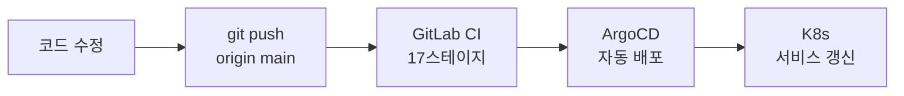

# RummiArena 운영자 매뉴얼

- **대상**: 시스템 운영 담당자
- **수준**: 초보 운영자도 따라할 수 있도록 작성
- **작성일**: 2026-05-10

---

## 빠른 참조 (Quick Reference)

| 목적 | 명령어 |
|------|--------|
| 전체 서비스 상태 | `kubectl get pods -n rummikub` |
| 서비스 재시작 | `kubectl rollout restart deployment/<이름> -n rummikub` |
| 로그 확인 | `kubectl logs -n rummikub deployment/<이름> --tail=100` |
| 게임 서버 헬스체크 | `curl http://localhost:30080/health` |
| PostgreSQL 접속 | `kubectl exec -n rummikub deployment/postgres -- psql -U rummikub` |
| Redis 상태 | `kubectl exec -n rummikub deployment/redis -- redis-cli PING` |

---

## 1. 시스템 시작 및 종료

### 1.1 시스템 시작 절차

RummiArena는 Kubernetes 위에서 동작합니다. Docker Desktop이 실행되고 Kubernetes가 활성화되면 서비스는 자동으로 시작됩니다.

**Step 1**: Docker Desktop 시작
- Windows 트레이에서 Docker Desktop 아이콘 확인
- 고래 아이콘이 초록색이면 정상 동작 중

**Step 2**: Kubernetes 활성화 확인

```bash
kubectl cluster-info
# 출력 예: Kubernetes control plane is running at https://127.0.0.1:6443
```

**Step 3**: 서비스 상태 확인

```bash
kubectl get pods -n rummikub
```

정상 출력 예시:
```
NAME                           READY   STATUS    RESTARTS   AGE
frontend-7d4f8b9c6-xk2p9      1/1     Running   0          2h
admin-6b5d8c7f4-mn3r8         1/1     Running   0          2h
game-server-5c9b7d8f6-pq4s7   1/1     Running   0          2h
ai-adapter-8f6d4c9b7-rs5t8    1/1     Running   0          2h
postgres-6d4b8c9f7-tu6v9      1/1     Running   0          2h
redis-5b7c9d8f6-wx7y8         1/1     Running   0          2h
ollama-9d8c7f6b5-yz9w0        1/1     Running   0          2h
```

모든 Pod의 STATUS가 `Running`이고 READY가 `1/1`이면 정상입니다.

**Step 4**: 접속 확인

```bash
# 게임 서버 헬스체크
curl http://localhost:30080/health

# 정상 응답:
# {"status":"ok","redis":"connected","timestamp":"2026-05-10T..."}
```

브라우저에서 `http://localhost:30000` 접속하여 게임 화면이 나오면 완료입니다.

### 1.2 시스템 종료 절차

보통 Docker Desktop을 종료하면 K8s도 함께 멈춥니다. 데이터는 PVC(영구 볼륨)에 저장되므로 안전합니다.

**권장 종료 순서** (데이터 안전을 위해):

```bash
# 1. 진행 중인 게임이 없는지 확인
curl http://localhost:30080/admin/games?status=playing

# 2. 서비스 종료 (프론트 → 백엔드 → DB 순서)
kubectl scale deployment frontend -n rummikub --replicas=0
kubectl scale deployment admin -n rummikub --replicas=0
kubectl scale deployment game-server -n rummikub --replicas=0
kubectl scale deployment ai-adapter -n rummikub --replicas=0

# 3. PostgreSQL은 마지막에 종료
kubectl scale deployment postgres -n rummikub --replicas=0

# 4. Docker Desktop 종료
```

---

## 2. 일상 모니터링

### 2.1 매일 확인 체크리스트

```bash
#!/bin/bash
# daily-check.sh — 매일 아침 실행 권장

echo "=== 1. Pod 상태 ==="
kubectl get pods -n rummikub

echo "=== 2. 게임 서버 헬스 ==="
curl -s http://localhost:30080/health | python3 -m json.tool

echo "=== 3. 최근 에러 로그 (1시간) ==="
kubectl logs -n rummikub deployment/game-server --since=1h 2>&1 | grep -i "error\|panic\|fatal" | tail -20

echo "=== 4. AI Adapter 타임아웃 현황 ==="
kubectl logs -n rummikub deployment/ai-adapter --since=1h 2>&1 | grep -i "timeout\|fallback" | tail -10

echo "=== 5. Redis 메모리 ==="
kubectl exec -n rummikub deployment/redis -- redis-cli INFO memory | grep used_memory_human

echo "=== 6. AI API 비용 현황 ==="
curl -s http://localhost:30080/admin/stats/ai | python3 -m json.tool
```

### 2.2 모니터링 지표 설명

**Pod 상태**
- `Running`: 정상
- `Pending`: 리소스 부족 또는 이미지 다운로드 중
- `CrashLoopBackOff`: 반복 충돌 — 로그 즉시 확인 필요
- `Error`: 오류 종료 — 로그 확인

**게임 서버 헬스체크 응답**

```json
{
  "status": "ok",       // ok = 정상, degraded = 일부 문제, error = 장애
  "redis": "connected", // connected = Redis 정상
  "timestamp": "..."
}
```

**AI API 비용 현황**

일일 한도($20) 대비 사용량을 확인합니다. 한도에 근접하면 AI 게임 참가를 제한하거나 Ollama 전용 방으로 유도합니다.

### 2.3 SonarQube 품질 확인 (코드 변경 시)

```
URL: http://localhost:9001
계정: admin / RummiAdmin2026!
```

- rummiarena-game-server: Quality Gate PASSED 유지
- rummiarena-ai-adapter: Quality Gate PASSED 유지
- rummiarena-frontend: Quality Gate PASSED 유지

---

## 3. 배포 절차

### 3.1 정상 배포 흐름 (GitOps)



1. 코드를 수정하고 main 브랜치에 push
2. GitLab CI가 자동 실행 (빌드 → 테스트 → 보안 스캔 → 배포)
3. ArgoCD가 Helm chart image tag를 업데이트하고 K8s에 반영
4. 배포 완료 확인

```bash
# 배포 상태 확인
kubectl rollout status deployment/frontend -n rummikub
# 출력: deployment "frontend" successfully rolled out
```

### 3.2 수동 배포 (긴급 시)

```bash
# 특정 서비스만 이미지 업데이트
helm upgrade frontend helm/charts/frontend -n rummikub \
  --set image.tag=새_이미지_태그

# 또는 직접 이미지 변경
kubectl set image deployment/frontend \
  frontend=rummikub-frontend:새_태그 \
  -n rummikub
```

### 3.3 배포 후 검증

```bash
# 1. Pod가 정상 기동됐는지 확인
kubectl get pods -n rummikub | grep frontend
# Running이고 RESTARTS가 늘지 않으면 정상

# 2. 게임 서버 연동 확인
curl http://localhost:30080/health

# 3. 프론트엔드 접속
# 브라우저에서 http://localhost:30000 열어서 화면 정상 출력 확인
```

### 3.4 롤백 절차

```bash
# 직전 버전으로 즉시 롤백
kubectl rollout undo deployment/frontend -n rummikub

# 롤백 확인
kubectl rollout status deployment/frontend -n rummikub
```

---

## 4. 장애 대응 Runbook

### 4.1 장애 분류

| 레벨 | 설명 | 예시 | 대응 시간 |
|------|------|------|---------|
| P0 | 전체 서비스 중단 | 모든 Pod CrashLoop | 즉시 |
| P1 | 핵심 기능 장애 | 게임 진행 불가 | 30분 내 |
| P2 | 부분 기능 장애 | AI 대전만 불가 | 2시간 내 |
| P3 | 경미한 오류 | 특정 UI 표시 오류 | 24시간 내 |

### 4.2 Frontend 장애 (P1)

**증상**: http://localhost:30000 접속 시 흰 화면 또는 에러 페이지

```bash
# 진단
kubectl get pod -n rummikub -l app=frontend
kubectl logs -n rummikub deployment/frontend --tail=50

# 해결: 재시작
kubectl rollout restart deployment/frontend -n rummikub
kubectl rollout status deployment/frontend -n rummikub

# 재시작 후에도 오류 시: 이전 버전으로 롤백
kubectl rollout undo deployment/frontend -n rummikub
```

### 4.3 Game Server 장애 (P0)

**증상**: API 호출 실패, WebSocket 연결 불가, 게임 진행 중단

```bash
# 진단
kubectl describe pod -n rummikub -l app=game-server
kubectl logs -n rummikub deployment/game-server --tail=100

# 일반적인 원인 확인
kubectl logs -n rummikub deployment/game-server --tail=100 | grep -E "panic|fatal|FATAL"

# Redis 연결 확인
kubectl exec -n rummikub deployment/game-server -- curl localhost:8080/health

# 해결: 재시작
kubectl rollout restart deployment/game-server -n rummikub
```

### 4.4 AI Adapter 장애 (P2)

**증상**: AI 차례에서 오래 기다리다가 강제 드로우됨

```bash
# LLM 오류 확인
kubectl logs -n rummikub deployment/ai-adapter --tail=100 | \
  grep -E "error|Error|INVALID|timeout|Timeout"

# API 키 만료 여부 확인 (오류 메시지: "401 Unauthorized" 또는 "invalid api key")
kubectl logs -n rummikub deployment/ai-adapter --tail=100 | grep -i "401\|unauthorized\|invalid"

# 해결: 재시작
kubectl rollout restart deployment/ai-adapter -n rummikub

# API 키 갱신이 필요한 경우:
# → '7. 시크릿 갱신' 섹션 참고
```

### 4.5 Ollama 느림/무응답 (P2)

**증상**: Ollama AI 차례에서 수십 초 이상 대기

```bash
# Ollama 모델 목록 확인
kubectl exec -n rummikub deployment/ollama -- ollama list
# qwen2.5:3b가 목록에 있어야 함

# 모델이 없는 경우 재다운로드
kubectl exec -n rummikub deployment/ollama -- ollama pull qwen2.5:3b
# (약 2GB 다운로드, 5~10분 소요)

# CPU 사용률 확인 (K8s 메트릭 서버 있는 경우)
kubectl top pod -n rummikub -l app=ollama
```

**근본 원인**: qwen2.5:3b는 CPU 추론이라 응답에 25~60초 걸립니다. 이는 정상입니다.

### 4.6 PostgreSQL 장애 (P0)

**증상**: 로그인 불가, 방 목록 로드 실패

```bash
# 상태 확인
kubectl get pod -n rummikub -l app=postgres
kubectl logs -n rummikub deployment/postgres --tail=50

# 접속 테스트
kubectl exec -n rummikub deployment/postgres -- psql -U rummikub -c "SELECT COUNT(*) FROM users;"

# PVC 상태 확인 (데이터 보존 여부)
kubectl get pvc -n rummikub

# 재시작 (PVC가 있으면 데이터 보존됨)
kubectl rollout restart deployment/postgres -n rummikub
sleep 15
# 재시작 후 game-server, ai-adapter도 재시작 (연결 풀 재초기화)
kubectl rollout restart deployment/game-server -n rummikub
kubectl rollout restart deployment/ai-adapter -n rummikub
```

---

## 5. 정기 유지보수

### 5.1 데이터베이스 백업 (주 1회 권장)

```bash
#!/bin/bash
# weekly-backup.sh

BACKUP_DIR="/mnt/backup/rummiarena"
DATE=$(date +%Y%m%d)
mkdir -p $BACKUP_DIR

echo "PostgreSQL 백업 시작..."
kubectl exec -n rummikub deployment/postgres -- \
  pg_dump -U rummikub rummikub > $BACKUP_DIR/postgres-$DATE.sql

gzip $BACKUP_DIR/postgres-$DATE.sql
echo "완료: $BACKUP_DIR/postgres-$DATE.sql.gz"

# 30일 이상 된 백업 삭제
find $BACKUP_DIR -name "*.sql.gz" -mtime +30 -delete
echo "오래된 백업 정리 완료"
```

### 5.2 Redis 정리

Redis는 게임 진행 중 상태를 저장합니다. 종료된 게임의 키는 TTL(만료 시간)로 자동 정리됩니다.

```bash
# 현재 키 수 확인
kubectl exec -n rummikub deployment/redis -- redis-cli DBSIZE

# 특정 패턴의 키 수 확인
kubectl exec -n rummikub deployment/redis -- redis-cli KEYS "game:*" | wc -l

# 메모리 사용량
kubectl exec -n rummikub deployment/redis -- redis-cli INFO memory | grep used_memory_human
```

### 5.3 로그 정리

```bash
# Docker 로그 크기 확인
docker system df

# 사용하지 않는 이미지/컨테이너 정리
docker system prune -f

# K8s 이전 ReplicaSet 정리
kubectl get replicaset -n rummikub | grep "0/0/0" | awk '{print $1}' | \
  xargs kubectl delete replicaset -n rummikub
```

### 5.4 AI API 비용 월간 리포트

```bash
# 월간 통계 조회 (Admin API)
curl http://localhost:30080/admin/stats/ai?period=monthly | python3 -m json.tool
```

---

## 6. 보안 점검

### 6.1 API 키 정기 점검 (분기별)

각 LLM 서비스의 API 키 만료일을 확인하고 갱신합니다.

- OpenAI: platform.openai.com → API Keys
- Anthropic: console.anthropic.com → API Keys
- DeepSeek: platform.deepseek.com → API Keys

갱신 절차는 [운영 이관 계획 §7](../07-closure/02-operation-handover-plan.md#7-시크릿-갱신-절차) 참조.

### 6.2 보안 스캔 확인

GitLab CI 파이프라인의 Trivy 스캔 결과를 정기적으로 확인합니다.

```
GitLab CI → 최근 파이프라인 → scan 스테이지 → trivy 잡 → 결과 확인
기준: Critical/High CVE = 0건 유지
```

### 6.3 SonarQube 확인

```
http://localhost:9001 (admin / RummiAdmin2026!)
3개 프로젝트 모두 Quality Gate: PASSED 유지
```

---

## 7. Traefik 관리

Traefik은 L7 라우팅을 담당합니다.

```bash
# Traefik Pod 상태
kubectl get pod -n kube-system -l app=traefik

# Traefik Dashboard (활성화된 경우)
# http://localhost:9000/dashboard/
```

---

*작성일: 2026-05-10 | 관련 문서: [사용자 매뉴얼](./11-user-manual.md) | [운영환경 구성](./12-production-environment-guide.md)*
