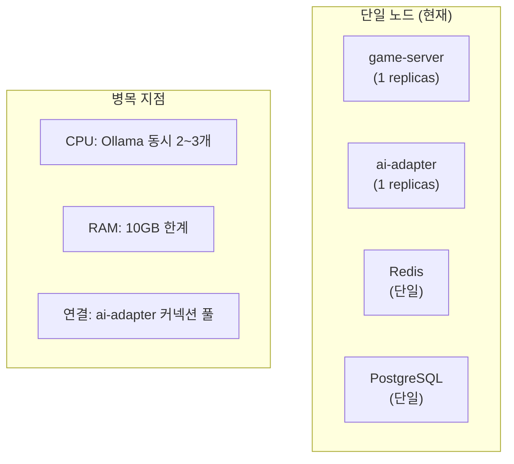

# RummiArena 운영환경 구성 가이드

- **목적**: 완전히 새로운 환경에서 RummiArena를 처음부터 구성하는 절차
- **대상**: 새 운영 환경을 구축하는 담당자 (초보자 포함)
- **작성일**: 2026-05-10

> 이 문서를 따라가면 빈 컴퓨터에서 RummiArena 7개 서비스를 모두 실행할 수 있습니다.

---

## 1. 사전 요구사항

### 1.1 하드웨어 사양

| 항목 | 최소 | 권장 |
|------|------|------|
| CPU | 4코어 (i5급) | 8코어 (i7급) |
| RAM | 16GB | 32GB |
| 저장공간 | SSD 100GB | SSD 200GB |
| 네트워크 | 100Mbps | 1Gbps |
| GPU | 불필요 | NVIDIA (Ollama 가속용) |

> **주의**: RAM 16GB에서 모든 서비스 + Istio 사이드카 실행 시 여유 메모리 1~2GB 수준입니다. 안정적인 운영을 위해 32GB를 권장합니다.

### 1.2 소프트웨어 목록

| 소프트웨어 | 버전 | 용도 | 다운로드 |
|-----------|------|------|----------|
| Docker Desktop | 4.x 이상 | K8s 컨테이너 런타임 | docker.com |
| kubectl | 1.28+ | K8s 클러스터 제어 | kubernetes.io |
| Helm | 3.x | K8s 패키지 매니저 | helm.sh |
| Go | 1.24+ | game-server 빌드 | go.dev |
| Node.js | 20+ | frontend/ai-adapter 빌드 | nodejs.org |
| Git | 2.x | 소스 코드 관리 | git-scm.com |

---

## 2. 환경 구성 단계별 가이드

### Step 1: Docker Desktop + Kubernetes 설정

**설치:**
1. [docker.com/products/docker-desktop](https://docker.com/products/docker-desktop) 에서 OS에 맞는 버전 다운로드
2. 설치 후 Docker Desktop 실행
3. 우측 하단 트레이 아이콘 클릭 → Settings

**Kubernetes 활성화:**
1. Settings → Kubernetes 탭
2. "Enable Kubernetes" 체크박스 체크
3. "Apply & Restart" 클릭
4. 좌측 하단에 초록색 Kubernetes 아이콘이 생기면 완료

**메모리 설정 (Windows WSL2 환경):**

`%UserProfile%\.wslconfig` 파일 생성/수정:
```ini
[wsl2]
memory=10GB
processors=4
swap=2GB
```

변경 후 PowerShell에서: `wsl --shutdown` 후 Docker Desktop 재시작

**확인:**
```bash
kubectl cluster-info
# 출력: Kubernetes control plane is running at https://127.0.0.1:6443

kubectl get nodes
# 출력: docker-desktop   Ready   ...
```

### Step 2: kubectl + Helm 설치

**kubectl (이미 Docker Desktop에 포함)**:
```bash
kubectl version --client
# Client Version: v1.28.x 이상이면 OK
```

**Helm 설치**:
```bash
# Windows (winget)
winget install Helm.Helm

# macOS
brew install helm

# Linux
curl https://raw.githubusercontent.com/helm/helm/main/scripts/get-helm-3 | bash

# 확인
helm version
# version.BuildInfo{Version:"v3.x.x", ...}
```

### Step 3: 소스 코드 클론

```bash
# GitHub에서 클론
git clone https://github.com/k82022603/RummiArena.git
cd RummiArena

# 디렉토리 구조 확인
ls
# CLAUDE.md  README.md  docs/  helm/  src/  scripts/  ...
```

### Step 4: 네임스페이스 생성

```bash
kubectl create namespace rummikub

# 확인
kubectl get namespace rummikub
# NAME       STATUS   AGE
# rummikub   Active   5s
```

### Step 5: 시크릿 구성

RummiArena는 여러 외부 서비스의 API 키가 필요합니다. **이 단계는 보안상 중요합니다.**

#### 5-1. Google OAuth 설정

1. [console.cloud.google.com](https://console.cloud.google.com) 접속
2. 프로젝트 생성 (또는 기존 프로젝트 선택)
3. APIs & Services → Credentials → OAuth 2.0 Client IDs 생성
4. Authorized redirect URIs에 추가: `http://localhost:30000/api/auth/callback/google`
5. Client ID와 Client Secret을 복사해 두기

#### 5-2. NextAuth Secret 생성

```bash
# 랜덤 시크릿 생성
openssl rand -base64 32
# 출력 예: K7mP9qR2sT5vX8yZ1aB4cD6eF3gH0iJ...
```

#### 5-3. LLM API 키 준비

| 서비스 | 신청 위치 | 필수 여부 |
|--------|---------|---------|
| OpenAI | platform.openai.com | 선택 |
| Anthropic | console.anthropic.com | 선택 |
| DeepSeek | platform.deepseek.com | 선택 |

> 최소 1개 이상의 LLM API 키가 있어야 AI 대전을 즐길 수 있습니다.
> Ollama는 로컬 실행이라 API 키 불필요.

#### 5-4. 시크릿 K8s에 등록

```bash
# Google OAuth
kubectl create secret generic google-oauth-secret \
  --from-literal=GOOGLE_CLIENT_ID="여기에_구글_클라이언트_ID" \
  --from-literal=GOOGLE_CLIENT_SECRET="여기에_구글_클라이언트_시크릿" \
  -n rummikub

# NextAuth
kubectl create secret generic nextauth-secret \
  --from-literal=NEXTAUTH_SECRET="여기에_위에서_생성한_랜덤_값" \
  --from-literal=NEXTAUTH_URL="http://localhost:30000" \
  -n rummikub

# LLM API 키
kubectl create secret generic llm-api-keys \
  --from-literal=OPENAI_API_KEY="sk-..." \
  --from-literal=ANTHROPIC_API_KEY="sk-ant-..." \
  --from-literal=DEEPSEEK_API_KEY="sk-..." \
  -n rummikub

# PostgreSQL 비밀번호
kubectl create secret generic db-secret \
  --from-literal=POSTGRES_PASSWORD="원하는_비밀번호" \
  -n rummikub

# 시크릿 등록 확인
kubectl get secrets -n rummikub
```

### Step 6: Helm 차트로 서비스 배포

**반드시 순서를 지키세요.** 데이터베이스가 먼저 실행되어야 다른 서비스가 연결할 수 있습니다.

```bash
cd RummiArena/helm

# 1단계: PostgreSQL
helm install postgres charts/postgres -n rummikub
echo "PostgreSQL 시작 대기 (30초)..."
sleep 30
kubectl wait --for=condition=ready pod -l app=postgres -n rummikub --timeout=120s

# 2단계: Redis
helm install redis charts/redis -n rummikub
kubectl wait --for=condition=ready pod -l app=redis -n rummikub --timeout=60s

# 3단계: Ollama
helm install ollama charts/ollama -n rummikub
echo "Ollama 시작 대기 (60초)..."
sleep 60
kubectl wait --for=condition=ready pod -l app=ollama -n rummikub --timeout=300s

# 4단계: Game Server
helm install game-server charts/game-server -n rummikub
kubectl wait --for=condition=ready pod -l app=game-server -n rummikub --timeout=120s

# 5단계: AI Adapter
helm install ai-adapter charts/ai-adapter -n rummikub
kubectl wait --for=condition=ready pod -l app=ai-adapter -n rummikub --timeout=120s

# 6단계: Frontend
helm install frontend charts/frontend -n rummikub
kubectl wait --for=condition=ready pod -l app=frontend -n rummikub --timeout=120s

# 7단계: Admin
helm install admin charts/admin -n rummikub
kubectl wait --for=condition=ready pod -l app=admin -n rummikub --timeout=120s

echo "전체 배포 완료!"
kubectl get pods -n rummikub
```

### Step 7: Ollama 모델 다운로드

Ollama AI가 사용할 언어 모델을 다운로드합니다.

```bash
# qwen2.5:3b 모델 다운로드 (약 2GB, 5~10분 소요)
kubectl exec -n rummikub deployment/ollama -- ollama pull qwen2.5:3b

# 다운로드 진행 상황 확인
kubectl logs -n rummikub deployment/ollama --follow

# 완료 확인
kubectl exec -n rummikub deployment/ollama -- ollama list
# NAME           ID              SIZE      MODIFIED
# qwen2.5:3b    ...             1.9 GB    ...
```

### Step 8: DB 마이그레이션 확인

game-server는 시작 시 자동으로 DB 테이블을 생성합니다 (GORM AutoMigrate).

```bash
# game-server 로그에서 마이그레이션 완료 확인
kubectl logs -n rummikub deployment/game-server | grep -i "migrat\|table"

# PostgreSQL에서 직접 확인
kubectl exec -n rummikub deployment/postgres -- \
  psql -U rummikub -c "\dt"
# users, rooms, games, elo_histories 등의 테이블이 보이면 정상
```

### Step 9: 최종 접속 확인

```bash
# 1. 게임 서버 헬스체크
curl http://localhost:30080/health
# {"status":"ok","redis":"connected",...}

# 2. AI Adapter 헬스체크
curl http://localhost:30081/health
# {"status":"UP"}

# 3. 브라우저에서 접속
# http://localhost:30000 → 게임 화면
# http://localhost:30001 → 관리자 대시보드
```

---

## 3. 동시접속 100~200명 운영 방안

### 3.1 현재 단일 노드 환경에서의 한계



### 3.2 즉시 적용 가능한 최적화 (단일 노드)

**game-server 수평 확장** (Stateless이므로 즉시 가능):
```bash
kubectl scale deployment game-server -n rummikub --replicas=3
```

**ai-adapter 수평 확장**:
```bash
kubectl scale deployment ai-adapter -n rummikub --replicas=2
```

**Ollama 리소스 증가**:
```bash
helm upgrade ollama helm/charts/ollama -n rummikub \
  --set resources.limits.cpu=8 \
  --set resources.requests.cpu=4
```

### 3.3 시나리오별 예상 처리 능력

| 시나리오 | 동시 사용자 | 가능 여부 | 비고 |
|---------|-----------|---------|------|
| Human vs Human | 200명 = 50개 방 | ✅ 가능 | game-server 3개로 충분 |
| API LLM 포함 (GPT/DeepSeek/Claude) | 50명 = 10개 AI방 | ✅ 가능 | 비용 주의 ($20/일 한도) |
| Ollama 포함 | ~10명 = 2~3개 Ollama방 | ⚠️ 제한적 | CPU 병목 |
| 전부 AI 대전 | 200명 전원 | ❌ 불가 | API 비용 + Ollama 병목 |

### 3.4 클라우드 이관 권장 구성 (100~200명 안정 운영)

**Google GKE 기준** (월 $180~280 예상):

```yaml
# 노드 구성
node-pool-general:
  machine-type: n2-standard-4  # 4 vCPU, 16GB RAM × 3대
  min-nodes: 2
  max-nodes: 5

node-pool-gpu:  # Ollama 전용
  machine-type: n1-standard-4 + NVIDIA T4
  min-nodes: 0
  max-nodes: 2

# 서비스별 replicas
game-server: 3
ai-adapter: 2
frontend: 2
redis: 1 (또는 Redis Cluster)
postgres: 1 (또는 Cloud SQL)
ollama: 1 (GPU 노드)
```

**주요 변경사항 (NodePort → LoadBalancer)**:
```bash
# Helm values.yaml 수정
service:
  type: LoadBalancer  # NodePort에서 변경
  port: 80
```

**도메인 + HTTPS 설정** (GKE 예시):
```bash
# cert-manager 설치
helm install cert-manager jetstack/cert-manager \
  --namespace cert-manager --create-namespace \
  --set installCRDs=true

# Let's Encrypt ClusterIssuer 생성
kubectl apply -f - <<EOF
apiVersion: cert-manager.io/v1
kind: ClusterIssuer
metadata:
  name: letsencrypt-prod
spec:
  acme:
    email: admin@example.com
    server: https://acme-v02.api.letsencrypt.org/directory
    privateKeySecretRef:
      name: letsencrypt-prod-key
    solvers:
    - http01:
        ingress:
          class: nginx
EOF
```

---

## 4. ArgoCD 설정 (선택 — GitOps 자동화)

ArgoCD를 사용하면 코드 push 시 자동으로 K8s에 배포됩니다.

### 4.1 ArgoCD 설치

```bash
kubectl create namespace argocd
kubectl apply -n argocd \
  -f https://raw.githubusercontent.com/argoproj/argo-cd/stable/manifests/install.yaml

# 포트 포워딩 (UI 접속)
kubectl port-forward svc/argocd-server -n argocd 8080:443

# 초기 비밀번호 확인
kubectl -n argocd get secret argocd-initial-admin-secret \
  -o jsonpath="{.data.password}" | base64 -d
```

접속: https://localhost:8080 (admin / 위 비밀번호)

### 4.2 Application 등록

```bash
argocd app create rummiarena \
  --repo https://github.com/k82022603/RummiArena.git \
  --path helm \
  --dest-server https://kubernetes.default.svc \
  --dest-namespace rummikub \
  --sync-policy automated \
  --auto-prune \
  --self-heal
```

---

## 5. GitLab CI 설정 (선택 — 자동 빌드/테스트)

### 5.1 GitLab Runner 등록

```bash
# GitLab Runner 설치 (Linux)
curl -L "https://packages.gitlab.com/install/repositories/runner/gitlab-runner/script.deb.sh" | bash
apt-get install gitlab-runner

# Runner 등록
gitlab-runner register \
  --url https://gitlab.example.com \
  --registration-token "프로젝트_등록_토큰" \
  --executor kubernetes \
  --kubernetes-namespace rummikub \
  --description "RummiArena Runner"
```

### 5.2 CI 환경변수 설정

GitLab 프로젝트 → Settings → CI/CD → Variables:

| 변수명 | 값 | 보호 여부 |
|--------|-----|---------|
| REGISTRY_USER | DockerHub 사용자명 | Yes |
| REGISTRY_PASSWORD | DockerHub 비밀번호 | Yes (masked) |
| KUBECONFIG | K8s config 파일 내용 | Yes |
| SONAR_TOKEN | SonarQube 토큰 | Yes (masked) |

---

## 6. SonarQube 설정 (선택 — 코드 품질)

```bash
# SonarQube 실행 (Docker)
docker run -d --name sonarqube \
  -p 9001:9000 \
  -e SONAR_ES_BOOTSTRAP_CHECKS_DISABLE=true \
  sonarqube:community

# 초기 접속: http://localhost:9001
# 기본 계정: admin / admin → 변경 필요
```

### 프로젝트 생성

SonarQube UI에서:
1. "Create Project" → "Manually"
2. Project Key: `rummiarena-game-server`, `rummiarena-ai-adapter`, `rummiarena-frontend`
3. 토큰 생성 후 GitLab CI 환경변수에 `SONAR_TOKEN`으로 등록

---

## 7. 이관 후 최종 검증 체크리스트

```bash
# 1. 전체 Pod Running 확인
kubectl get pods -n rummikub
# 모든 Pod STATUS=Running, READY=1/1

# 2. 헬스체크
curl http://localhost:30080/health

# 3. 게임 시작 테스트
# 브라우저에서 방 생성 → AI 추가 → 게임 시작 → 2~3턴 진행 → 정상 동작 확인

# 4. WebSocket 연결 테스트
# 브라우저 콘솔에서 오류 없이 WS 연결 유지 확인

# 5. AI 대전 테스트 (DeepSeek 권장 - 빠르고 저렴)
# AI vs AI 방 생성 → 5턴 정도 진행 → AI가 정상 배치하는지 확인

# 6. 보안 스캔
# GitLab CI 파이프라인 실행 → Trivy 스캔 결과 Critical/High=0 확인

# 7. DB 백업 테스트
kubectl exec -n rummikub deployment/postgres -- \
  pg_dump -U rummikub rummikub | wc -l
# 0보다 큰 숫자면 백업 가능
```

---

*작성일: 2026-05-10 | 관련 문서: [운영자 매뉴얼](./10-operator-manual.md) | [운영 이관 계획](../07-closure/02-operation-handover-plan.md)*
