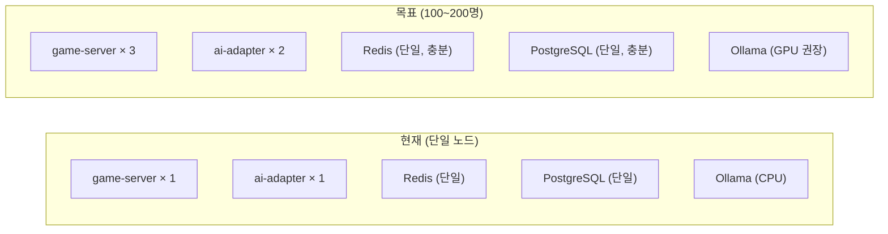

# RummiArena 운영 이관 계획

- **문서 목적**: 현재 운영 환경 현황 파악 및 신규 운영자 인계 가이드
- **작성일**: 2026-05-10
- **대상 독자**: 운영 인계받는 개발자 또는 운영자 (초보자 포함)

> 이 문서를 읽고 나면 현재 운영 중인 시스템의 전체 구성을 파악하고, 새 환경에 동일하게 재현할 수 있어야 합니다.

---

## 1. 현재 운영 환경 현황

### 1.1 환경 사양

| 항목 | 현재 값 |
|------|---------|
| 호스트 OS | Windows 11 + WSL2 (Ubuntu 22.04) |
| 컨테이너 런타임 | Docker Desktop 4.x (Kubernetes 활성화) |
| K8s 버전 | Docker Desktop K8s (단일 노드) |
| WSL2 메모리 | 10GB (.wslconfig) |
| 하드웨어 | LG Gram 15Z90R, i7-1360P, RAM 16GB, SSD |

### 1.2 K8s 서비스 현황

```bash
# 전체 서비스 확인
kubectl get all -n rummikub
```

| 서비스 | 이미지 | NodePort | 상태 |
|--------|--------|----------|------|
| frontend | `rummikub-frontend:lobby-fix-e7222d0` | 30000 | Running |
| admin | `rummiarena/admin:latest` | 30001 | Running |
| game-server | `rummiarena/game-server:day5-8dc0999` | 30080 | Running |
| ai-adapter | `rummiarena/ai-adapter:v9-ollama-place-8631831` | 30081 | Running |
| postgres | `postgres:16-alpine` | 30432 | Running |
| redis | `redis:7-alpine` | — | Running |
| ollama | `ollama/ollama:latest` | — | Running |

### 1.3 접속 주소

| 서비스 | URL |
|--------|-----|
| 게임 (플레이어) | http://localhost:30000 |
| 관리자 대시보드 | http://localhost:30001 |
| Game Server API | http://localhost:30080 |
| AI Adapter API | http://localhost:30081 |
| PostgreSQL | localhost:30432 |

### 1.4 핵심 설정값

```yaml
# ConfigMap 주요 값
AI_ADAPTER_TIMEOUT_SEC: "1000"
GAME_MAX_TURNS_LIMIT: "200"
OLLAMA_PROMPT_VARIANT: "v9-ollama-place"
USE_V2_PROMPT: "true"
OPENAI_PROMPT_VARIANT: ""        # v2 베이스라인 사용
CLAUDE_PROMPT_VARIANT: ""        # v2 베이스라인 사용
DEEPSEEK_PROMPT_VARIANT: ""      # v2 베이스라인 사용
```

### 1.5 시크릿 목록

```bash
# 현재 등록된 시크릿 확인
kubectl get secrets -n rummikub
```

| 시크릿 이름 | 포함 키 | 설명 |
|-----------|---------|------|
| `google-oauth-secret` | GOOGLE_CLIENT_ID, GOOGLE_CLIENT_SECRET | Google OAuth 2.0 |
| `nextauth-secret` | NEXTAUTH_SECRET | NextAuth.js JWT 서명 키 |
| `llm-api-keys` | OPENAI_API_KEY, ANTHROPIC_API_KEY, DEEPSEEK_API_KEY | LLM API 키 |
| `db-secret` | POSTGRES_PASSWORD | PostgreSQL 비밀번호 |
| `kakao-secret` | KAKAO_REST_API_KEY | 카카오톡 알림 (선택) |

---

## 2. 이관 전 체크리스트

### 2.1 시크릿 이관

```bash
# 현재 시크릿 백업 (인계 전 반드시 수행)
kubectl get secret google-oauth-secret -n rummikub -o yaml > backup-google-oauth.yaml
kubectl get secret nextauth-secret -n rummikub -o yaml > backup-nextauth.yaml
kubectl get secret llm-api-keys -n rummikub -o yaml > backup-llm-keys.yaml
kubectl get secret db-secret -n rummikub -o yaml > backup-db-secret.yaml

# 주의: 백업 파일은 암호화 없이 평문 저장됨. 보안에 주의할 것.
```

### 2.2 데이터베이스 백업

```bash
# PostgreSQL 전체 백업
kubectl exec -n rummikub deployment/postgres -- \
  pg_dump -U rummikub rummikub > backup-$(date +%Y%m%d).sql

# 백업 파일 크기 확인
ls -lh backup-$(date +%Y%m%d).sql
```

### 2.3 Redis 상태 확인

```bash
# Redis는 게임 진행 중 상태를 저장함 (영속 데이터 아님)
# 이관 시 진행 중인 게임이 없는지 확인
kubectl exec -n rummikub deployment/redis -- redis-cli KEYS "game:*"
```

### 2.4 이미지 레지스트리 접근

현재 이미지들은 로컬 Docker 또는 DockerHub에 저장됨:
- `rummikub-frontend:*` → 로컬 빌드
- `rummiarena/*` → DockerHub (rummiarena 계정)

새 환경에서는 GitLab CI를 통해 재빌드하거나, 이미지를 tar로 추출해 이전:

```bash
# 이미지 추출 (오프라인 이전)
docker save rummikub-frontend:lobby-fix-e7222d0 | gzip > frontend-image.tar.gz

# 새 환경에서 로드
docker load < frontend-image.tar.gz
```

---

## 3. 동시접속 100~200명을 위한 확장 방안

### 3.1 현재 아키텍처 한계 분석



### 3.2 시나리오별 확장 방안

#### 시나리오 A: Human vs Human 위주 (LLM 최소 사용)

동시접속 200명 = 최대 50개 4인 방 동시 진행

**필요 조치:**
```bash
# game-server 수평 확장 (stateless이므로 즉시 가능)
kubectl scale deployment game-server -n rummikub --replicas=3

# 리소스 요청/제한 조정 (values.yaml)
# game-server: cpu 200m→500m, memory 256Mi→512Mi
helm upgrade game-server helm/charts/game-server -n rummikub \
  --set resources.requests.cpu=500m \
  --set resources.requests.memory=512Mi
```

**예상 리소스 사용량:**
- game-server 3개: CPU 1.5코어, RAM 1.5GB
- Redis: RAM 500MB (50개 방 × 10MB)
- PostgreSQL: RAM 500MB
- 합계: RAM ≈ 3GB → 현재 10GB WSL2에서 가능

#### 시나리오 B: AI 대전 포함 (API 기반 LLM)

동시 AI 게임 10개 기준 (DeepSeek/GPT/Claude 사용)

**병목**: ai-adapter의 동시 커넥션
```bash
# ai-adapter 확장
kubectl scale deployment ai-adapter -n rummikub --replicas=2

# 타임아웃 1000초 × 동시 10게임 = 10,000초 커넥션 점유
# ai-adapter 인스턴스당 HTTP Keep-Alive Pool 최대 100개
# 10개 동시 게임은 안전권 (20개 이상부터 모니터링 필요)
```

**비용 주의:**
- DeepSeek: 동시 10게임 × $0.039 × 8시간 × 3게임/시간 = 하루 $9.36
- GPT: 동시 10게임 × $0.15 × 8시간 × 3게임/시간 = 하루 $36 → 한도 초과

#### 시나리오 C: Ollama AI 대전 포함

Ollama는 CPU 기반. **현실적 한계: 동시 2~3 게임**

```bash
# Ollama 리소스 현황
kubectl describe pod -n rummikub -l app=ollama | grep -A5 Resources

# CPU 제한 조정 (현재 4코어 → 최대 활용)
helm upgrade ollama helm/charts/ollama -n rummikub \
  --set resources.limits.cpu=8 \
  --set resources.requests.cpu=4
```

**GPU 도입 시 개선 폭:**
- qwen2.5:3b + NVIDIA T4: 응답 25초 → 약 3초
- 동시 처리 능력: 2~3개 → 10개+ 가능

#### 시나리오 D: 클라우드 이관 (최종 권장)

| 클라우드 | 구성 | 월간 비용 |
|---------|------|---------|
| GKE Autopilot | 2 vCPU 4GB × 3 + T4 GPU 1개 | $180~280 |
| EKS Fargate | 유사 구성 | $200~320 |
| Azure AKS | 유사 구성 | $190~300 |

**GKE 이관 시 주요 변경사항:**
1. NodePort → LoadBalancer 서비스 타입 변경
2. PVC StorageClass: `standard` → `standard-rwo`
3. Ollama: CPU 노드 → GPU 노드(taint/toleration 추가)
4. 도메인 + HTTPS 인증서 설정 (Let's Encrypt)

---

## 4. 일상 운영 절차

### 4.1 매일 확인 사항

```bash
# 1. 전체 Pod 상태
kubectl get pods -n rummikub

# 2. 에러 로그 확인 (최근 1시간)
kubectl logs -n rummikub deployment/game-server --since=1h | grep -i error

# 3. AI Adapter 타임아웃 현황
kubectl logs -n rummikub deployment/ai-adapter --since=1h | grep -i timeout

# 4. Redis 메모리 사용량
kubectl exec -n rummikub deployment/redis -- redis-cli INFO memory | grep used_memory_human
```

### 4.2 주간 유지보수

```bash
# PostgreSQL 백업 (매주 일요일 권장)
kubectl exec -n rummikub deployment/postgres -- \
  pg_dump -U rummikub rummikub | gzip > backup-$(date +%Y%m%d).sql.gz

# 오래된 게임 데이터 정리 (30일 이상)
kubectl exec -n rummikub deployment/postgres -- psql -U rummikub -c \
  "DELETE FROM games WHERE created_at < NOW() - INTERVAL '30 days' AND status = 'finished';"

# Docker 이미지 정리
docker image prune -f
```

### 4.3 API 비용 모니터링

```bash
# 현재 비용 통계 (Admin API)
curl http://localhost:30080/admin/stats/ai

# 응답 예시:
# {
#   "today_cost_usd": 1.23,
#   "daily_limit_usd": 20.0,
#   "remaining_usd": 18.77,
#   "model_breakdown": { "deepseek": 0.83, "openai": 0.40 }
# }
```

---

## 5. 장애 대응 절차

### 5.1 frontend Pod 장애

**증상**: http://localhost:30000 접속 불가

```bash
# 1. Pod 상태 확인
kubectl get pod -n rummikub -l app=frontend

# 2. 로그 확인
kubectl logs -n rummikub deployment/frontend --tail=50

# 3. 재시작
kubectl rollout restart deployment/frontend -n rummikub

# 4. 대기 (약 30초)
kubectl rollout status deployment/frontend -n rummikub
```

### 5.2 game-server 장애

**증상**: API 호출 실패, WebSocket 연결 불가

```bash
# 1. 상태 확인
kubectl describe deployment game-server -n rummikub

# 2. 환경변수 확인 (DB/Redis 연결 설정)
kubectl exec -n rummikub deployment/game-server -- env | grep -E "DB_|REDIS_"

# 3. Redis 연결 테스트
kubectl exec -n rummikub deployment/game-server -- curl localhost:8080/health

# 4. 재시작
kubectl rollout restart deployment/game-server -n rummikub
```

### 5.3 ai-adapter 응답 없음

**증상**: AI 차례에서 진행 멈춤, 타임아웃 후 강제 드로우

```bash
# 1. 로그에서 LLM 에러 확인
kubectl logs -n rummikub deployment/ai-adapter --tail=100 | grep -E "error|timeout|INVALID"

# 2. LLM API 키 유효성 확인
kubectl get secret llm-api-keys -n rummikub -o jsonpath='{.data.OPENAI_API_KEY}' | base64 -d

# 3. Ollama 상태 확인
kubectl exec -n rummikub deployment/ollama -- ollama list

# 4. ai-adapter 재시작
kubectl rollout restart deployment/ai-adapter -n rummikub
```

### 5.4 PostgreSQL 연결 실패

**증상**: 로그인 불가, 방 목록 오류

```bash
# 1. PostgreSQL Pod 상태
kubectl get pod -n rummikub -l app=postgres

# 2. 접속 테스트
kubectl exec -n rummikub deployment/postgres -- psql -U rummikub -c "SELECT 1;"

# 3. PVC 상태 확인
kubectl get pvc -n rummikub

# 4. 재시작 (주의: 재시작 시 데이터 유지됨, PVC가 보호)
kubectl rollout restart deployment/postgres -n rummikub
```

### 5.5 Redis 장애

**증상**: 게임 상태 손실, 타이머 오작동

```bash
# 1. Redis 접속 테스트
kubectl exec -n rummikub deployment/redis -- redis-cli PING
# 정상: PONG

# 2. 현재 키 수 확인
kubectl exec -n rummikub deployment/redis -- redis-cli DBSIZE

# 3. 재시작 (진행 중인 게임 상태 손실 주의)
kubectl rollout restart deployment/redis -n rummikub
```

### 5.6 전체 시스템 재시작 순서

```bash
# 의존성 순서 준수 (DB → 캐시 → 백엔드 → 프론트)
kubectl rollout restart deployment/postgres -n rummikub
sleep 10
kubectl rollout restart deployment/redis -n rummikub
sleep 5
kubectl rollout restart deployment/ollama -n rummikub
sleep 5
kubectl rollout restart deployment/game-server -n rummikub
sleep 5
kubectl rollout restart deployment/ai-adapter -n rummikub
sleep 5
kubectl rollout restart deployment/frontend -n rummikub
kubectl rollout restart deployment/admin -n rummikub

# 전체 상태 확인
kubectl get pods -n rummikub
```

---

## 6. 배포 절차 (신규 버전)

### 6.1 ArgoCD를 통한 GitOps 배포 (정상 경로)

```bash
# 1. GitHub에 코드 push
git push origin main

# 2. GitLab CI 파이프라인 확인 (17스테이지)
# http://gitlab.local/rummiarena/RummiArena/-/pipelines

# 3. 파이프라인 성공 시 ArgoCD 자동 동기화
# ArgoCD가 Helm chart의 image tag를 업데이트하고 K8s에 배포

# 4. ArgoCD 배포 상태 확인
kubectl get application -n argocd
# 또는 ArgoCD UI: http://localhost:30087
```

### 6.2 수동 이미지 태그 업데이트

```bash
# values.yaml의 tag 직접 수정 후 helm upgrade
helm upgrade frontend helm/charts/frontend -n rummikub \
  --set image.tag=새태그값

# 배포 상태 확인
kubectl rollout status deployment/frontend -n rummikub
```

### 6.3 롤백

```bash
# 이전 버전으로 즉시 롤백
kubectl rollout undo deployment/frontend -n rummikub

# 특정 리비전으로 롤백
kubectl rollout history deployment/frontend -n rummikub
kubectl rollout undo deployment/frontend -n rummikub --to-revision=3
```

---

## 7. 시크릿 갱신 절차

### 7.1 Google OAuth 시크릿 갱신

Google Cloud Console에서 새 Client Secret 발급 후:

```bash
kubectl create secret generic google-oauth-secret \
  --from-literal=GOOGLE_CLIENT_ID="새_클라이언트_ID" \
  --from-literal=GOOGLE_CLIENT_SECRET="새_클라이언트_시크릿" \
  -n rummikub \
  --dry-run=client -o yaml | kubectl apply -f -

# 적용을 위해 프론트엔드 재시작
kubectl rollout restart deployment/frontend -n rummikub
```

### 7.2 LLM API 키 갱신

```bash
kubectl create secret generic llm-api-keys \
  --from-literal=OPENAI_API_KEY="새_키" \
  --from-literal=ANTHROPIC_API_KEY="새_키" \
  --from-literal=DEEPSEEK_API_KEY="새_키" \
  -n rummikub \
  --dry-run=client -o yaml | kubectl apply -f -

kubectl rollout restart deployment/ai-adapter -n rummikub
```

---

*작성일: 2026-05-10 | 관련 문서: [종료 보고서](./01-project-closure-report.md) | [운영자 매뉴얼](../06-operations/10-operator-manual.md)*
