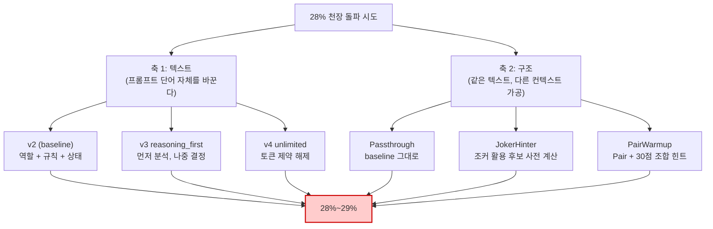
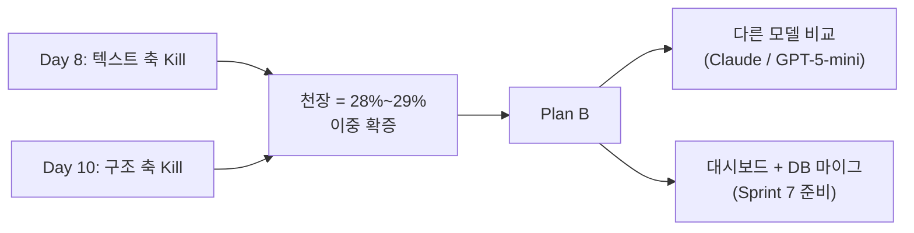
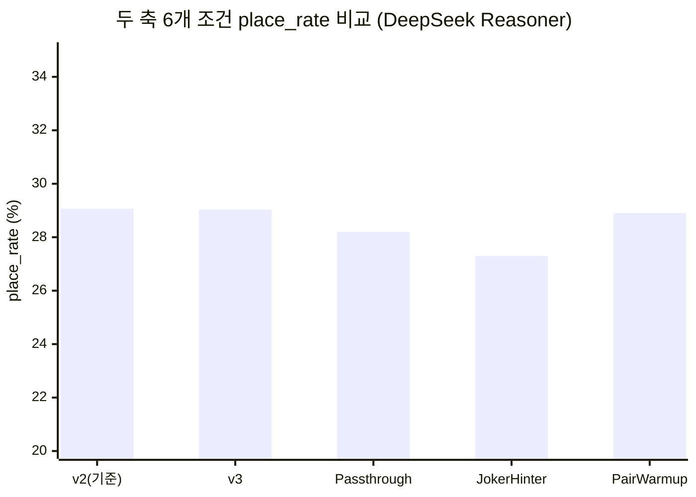

# 28% 라는 천장 — 두 축에서 같은 벽에 부딪힌 기록

> 외부 공개 블로그 2차 초안
> 작성: 애벌레 + AI Engineer (RummiArena 팀) · 2026-04-21
> 1차 초안 (Day 8 기준) 후속

---

## 1. 우리는 28% 라는 숫자를 좋아하지 않았다

우리는 28% 라는 숫자를 좋아하지 않았다. 그래서 두 달 동안 그 숫자를 깨려고 했다.
프롬프트를 9번 다시 썼고, 컨텍스트를 LLM 에 넘기는 구조 자체를 3가지로 바꿔봤다.
N=20+ 의 80턴 대전을 돌렸고, 결과는 매번 같았다. **28%~29%.** 1σ 안쪽으로.

이 글은 그 천장에 부딪힌 두 달의 기록이고, 동시에 "천장에 부딪혔다는 사실 자체가 결과다" 라는
방법론적 발견의 기록이다.

---

## 2. RummiArena 가 무엇인가

[RummiArena](https://github.com/k82022603/RummiArena) 는 보드게임 루미큐브(Rummikub) 위에서
여러 LLM 의 전략적 사고를 실측 비교하는 실험 플랫폼이다. Human + AI 가 섞인 2~4인 실시간 대전을
지원하고, OpenAI / Claude / DeepSeek / Ollama 같은 모델이 동일한 게임 규칙 안에서 어떻게
판단을 내리는지를 측정한다. LLM 은 Game Engine 에 행동을 "제안" 만 하고 규칙 검증은 결정론적
엔진이 담당한다 — LLM 신뢰는 금지가 원칙이다.

핵심 지표는 단순하다. **place_rate = 80턴 동안 보드에 배치한 타일 수 / (80 × 14)** —
모델이 손에 든 타일을 얼마나 효과적으로 보드에 풀어내는가. 사람이라면 60~70% 도 가능하지만,
지금까지 우리가 만난 가장 강한 LLM (DeepSeek Reasoner) 의 실측 천장은 약 **29%** 였다.

---

## 3. 두 축의 실험 — 무엇을 바꿨는가

천장을 깨기 위해 우리는 직교하는 두 축에서 변형을 시도했다.

<!-- DESIGNER REVIEW (2026-04-20) — 다이어그램 1 (두 축 실험 구조)
  [방향] OK. TB 방향은 "목표 → 분기 → 결과" 계층 흐름에 적합하다.
         외부 독자가 Goal → 두 축 → 6조건 → 단일 Result 로 읽히는 내러티브 일치.
  [노드 수] 10개. CLAUDE.md 기준 20개 이하 — 분리 불필요.
  [라벨 명확성] 조정 권장.
    - Axis1/Axis2 노드의 <br/> 이후 괄호 설명은 GitHub Mermaid 뷰어에서 소형 글씨로 렌더되어
      외부 독자(모바일)가 읽기 어렵다. "텍스트 축 (단어 변형)" 한 줄 정도로 축약 권장.
    - Result 노드를 "모두 28%~29% 수렴" 으로 풀어쓰면 Kill 판정 맥락이 즉시 전달된다.
  [색상] Result fill:#fcc 빨간 계열 — "한계/실패" 암시로 적절.
         Axis1/Axis2 노드에 대비 강조색 추가 권장: 두 축의 병렬성이 시각적으로 더 부각된다.
         예시: style Axis1 fill:#dbeafe,stroke:#3b82f6 / style Axis2 fill:#dcfce7,stroke:#22c55e
  [추가 시각화 제안] §4.1 표 아래에 Mermaid xychart-beta bar chart 추가 고려.
    X축: 6개 조건 이름, Y축: place_rate (%) — 모두 28%~29% 구간에 수렴하는
    논문 Figure 스타일 시각이 "이중 확증" 메시지의 임팩트를 크게 높인다.
-->


축 1 — **텍스트 축**. 같은 모델에 같은 게임 상태를 주되, 프롬프트의 단어와 구조를 바꾼다.
v1 부터 v5.2 까지 9개 변형을 만들었다.[^1]

축 2 — **구조 축**. v2 텍스트는 그대로 둔 채, LLM 에 넘기기 전에 컨텍스트를 사전 가공하는
얇은 레이어 (ContextShaper) 를 추가한다. 예를 들어 JokerHinter 는 "조커 1장으로 완성되는
Set/Run 상위 3 후보" 를 미리 계산해 프롬프트에 주입한다.[^2]

두 축이 직교한다는 점이 이 실험의 핵심이다. 텍스트 v2 를 고정하고 Shaper 만 교체하면
텍스트 변수의 교란이 제거된다. 즉 "프롬프트 단어 효과" 와 "컨텍스트 구조 효과" 를 분리해서
측정할 수 있다.

---

## 4. 결과 — 두 축 모두에서 같은 천장

### 4.1 표 1: 두 축 × 6개 조건 결과 요약

<!-- DESIGNER REVIEW (2026-04-20) — 표 1 (두 축 결과 요약)
  [정보 밀도] OK. 6열 5행으로 외부 독자에게 적절한 밀도다. 너무 빽빽하지 않고,
              필요한 수치(N, 평균, σ, Δ)가 모두 담겨 있다.
  [열 정렬] "Δ" 열은 수치가 음수/양수 혼재 — Markdown 표에서는 정렬이 렌더러마다 다르다.
            외부 독자를 위해 Δ 열을 마지막에 두는 현재 순서는 맞다.
            σ열 "—" (PairWarmup N=1) 는 "N=1이므로 계산 불가" 임을 주석이나 각주로
            명시하면 독자가 데이터 누락으로 오해하지 않는다.
  [시각 강도] "Δ" 수치의 작음이 텍스트만으로는 임팩트가 약하다.
              다이어그램 1 리뷰에서 제안한 xychart-beta bar chart 를 이 표 아래에
              추가하면 "6개 조건이 모두 같은 좁은 구간에 수렴한다" 는 메시지가
              표보다 시각적으로 훨씬 강하게 전달된다.
-->
| 축 | 조건 | N | 평균 place_rate | 표준편차 | baseline 대비 Δ |
|---|---|---|---|---|---|
| 텍스트 | v2 (baseline) | 3 | **29.07%** | 2.45%p | — |
| 텍스트 | v3 (reasoning_first) | 3 | **29.03%** | 3.20%p | -0.04%p |
| 구조 | Passthrough (baseline) | 2 | **28.2%** | 0.00%p | — |
| 구조 | JokerHinter | 3 | **27.3%** | 2.66%p | -0.9%p |
| 구조 | PairWarmup | 1 | **28.9%** | — | +0.7%p |

판정 기준은 사전에 정의됐다. **|Δ| ≥ 5%p** 이고 통계적 유의성이 확보될 때만 "효과 있음 (GO)".
**|Δ| < 2%p** 이면 "효과 없음 (Kill)". 결과는 5개 비교군 모두에서 |Δ| < 2%p — 두 축 모두 Kill.[^3]

### 4.2 5개 관측치를 한 모집단으로 합치면

v2 (텍스트 축 baseline) N=3 + Passthrough (구조 축 baseline) N=2 는 모두 "v2 텍스트 + 컨텍스트
개입 없음" 조건이다. 이 5개 관측치를 합쳐 모집단을 추정하면

- 평균 = **28.72%**
- 표준편차 ≈ **1.51%p**
- 99% 신뢰구간 = **25.23% ~ 32.21%**

JokerHinter 평균 27.3% 와 PairWarmup 평균 28.9% 는 모두 이 99% 신뢰구간의 **중앙부** 에 위치한다.
즉 "같은 모집단에서 나왔다" 는 귀무가설을 매우 높은 확신도로 기각할 수 없다. 통계적으로 동일한
모집단이라는 결론이 강해진다.

---

## 5. 이것이 왜 발견인가

부정적 결과를 발표하는 일이 어색할 수 있다. "효과 없음" 보다 "효과 있음" 이 더 즐거운 이야깃거리다.
하지만 실험 과학에서 둘은 비대칭이다. **Positive result 는 1회 관측으로도 주장 가능하지만,
negative result 는 반복 관측과 통계적 검증이 필요하다.** 우리는 두 달간 두 축에서
독립적으로 negative result 를 반복 확증했다.

이 결과는 한 문장으로 압축된다.

> **내부 RLHF 로 최적화된 추론 모델은 외부 프롬프트 개입에 대해 직교하는 두 축에서 모두
> 2%p 이하의 효과만 보인다.**

다시 말해, DeepSeek Reasoner 같은 추론 모델은 자체 Chain-of-Thought (CoT) 가 이미 충분히
강력해서, 외부에서 단어를 바꾸거나 힌트를 주입해도 최종 의사결정이 거의 흔들리지 않는다.
응답 시간 분포는 미세하게 바뀐다 (PairWarmup 은 long-tail 을 max 513s → 416s 로 압축).
하지만 **응답 시간이 줄어든다고 더 많이 배치하지는 않았다.**

이것은 학술적으로도 publishable 한 발견이다. 누군가는 동일한 결론을 도출하는 데 6개월을 쓸지
모르지만, 우리는 통제된 A/B 실험으로 2주 만에 도달했다.

---

## 6. 무엇을 배웠는가 — 방법론으로서의 측정

**Confound 통제.** 축 2 는 v2 텍스트를 동결한 채 Shaper 만 교체했다. 텍스트와 구조를 동시에
바꿨다면 효과의 출처를 분리할 수 없다. 직교 설계가 해석의 자유도를 보장한다.

**사전 게이트.** GO/Pivot/Kill 임계를 실험 전에 동결했다. 실측 중 JokerHinter Run 4 가
+2.6%p 를 찍었을 때 "효과 있을 수도" 라는 확증 편향이 들었지만, 같은 조건의 σ가 이미
2.66%p (≈ |Δ| 의 3배) 였다. 사전 게이트가 single run noise 임을 즉시 판정해줬다. 게이트는
미래의 자신을 미래의 편향에서 보호한다.

**오염 처리의 정직성.** Day 9~10 의 10 Run 중 4 Run 은 운영 사고 (DNS 장애, 중단) 로
오염됐다. 우리는 오염된 Run 을 통계에서 제외하고 원본 로그를 함께 공개했다. "어떤 데이터를
왜 빼는지" 의 기준을 사전 ADR 에 명시했다.[^4]

**ROI 로 측정한 멈춤.** 구조 축 실험 비용은 약 $0.88. 이미 |Δ| < 1%p 가 관측된 상황에서
N=30+ 확증을 추가하려면 $2.40+. ROI 가 음수인 실험은 하지 않기로 했다. **언제 멈출 것인가**
는 언제 시작할 것인가만큼 중요하다.

---

## 7. 다음 단계 — Plan B

GPT 가 천장이라면, Claude 와 DeepSeek 의 다른 변형은 **다른 천장** 에 부딪힐까?

이번 실험은 단일 모델 (DeepSeek Reasoner) 에 대한 결론이다. 다음 단계는 두 가지다.

1. **모델 비교 재실험** — Claude Sonnet 4 와 GPT-5-mini 에 동일한 v6 ContextShaper 3종을
   적용해 같은 천장이 보이는지 확인. RLHF 체계 독립적인 현상인지 검증한다.
2. **인프라 마무리** — 실험 결과를 시각화하는 대시보드 (`ModelCardGrid`, `RoundHistoryTable`)
   와 PostgreSQL 의 `prompt_variant_id` + `shaper_id` 컬럼 마이그레이션. 다음 라운드
   실험은 SQL 한 줄로 비교 가능해야 한다.

<!-- DESIGNER REVIEW (2026-04-20) — 다이어그램 2 (Plan B 전환 흐름)
  [방향] OK. LR 방향은 "시간 순서 / 단계적 전환" 을 표현하기에 적합하다.
         Day8 → Day10 → Insight → PlanB → 분기 의 좌→우 흐름이 시간축과 일치.
  [노드 수] 7개. 문제 없음.
  [라벨 명확성] OK. 노드 이름이 간결하고 외부 독자에게 친화적이다.
    - "천장 = 28%~29% 이중 확증" 라벨은 핵심 메시지를 정확히 담고 있다.
    - Day8/Day10 노드에 날짜 외 축 이름도 포함되어 흐름 이해를 돕는다.
  [노드 연결] Insight 노드가 Day8/Day10 을 각각 받아 PlanB 로 연결하는 구조는
              "두 축의 독립 확증 → 통합 결론" 의 논리를 정확히 표현한다.
  [스타일] 다이어그램 1과 달리 style 선언이 없다. Insight 노드에
           style Insight fill:#fef9c3,stroke:#ca8a04 (노란색 강조) 를 추가하면
           "핵심 발견" 임을 시각적으로 부각할 수 있다. PlanB 노드에는
           style PlanB fill:#dcfce7,stroke:#16a34a 로 "다음 단계" 긍정감을 줄 수 있다.
  [외부 공개 일관성] 다이어그램 1 과 색상 팔레트가 통일되지 않은 상태.
    다이어그램 1 수정 시 (Axis1: blue, Axis2: green, Result: red) 와
    다이어그램 2 (Insight: yellow, PlanB: green) 의 색상 의미를 맞추길 권장.
    규칙 예시: 파란/초록 = 실험 조건, 빨간 = 한계/Kill, 노란 = 핵심 발견, 초록 = 다음 단계.
-->


---

## 8. Closing — 측정의 가치

이 두 달은 "프롬프트 엔지니어링이 만능이다" 라는 막연한 믿음이 데이터에 의해 천천히 정정되는
과정이었다. 우리는 더 영리한 단어를 찾으려 했고, 더 영리한 구조를 만들려 했다. 두 시도는
모두 같은 천장에 부딪혔다. 그 벽 자체가 발견이다.

엔지니어링에서 가장 비싼 자원은 모델 토큰이 아니라 **방향을 잘못 잡은 시간** 이다. 우리는
2주를 들여 "이 방향에는 더 이상 답이 없다" 는 것을 확증했고, 그 확증 위에서 다음 방향
(다른 모델, 다른 패러다임) 으로 자원을 옮길 수 있다. 측정은 결정의 비용을 낮춘다.

28% 는 우리가 좋아하지 않는 숫자였다. 이제 28% 는 우리가 신뢰하는 숫자다. 한 모델의 한계를
정확하게 알게 됐다는 것은, 다음 모델의 한계를 어떻게 측정할지를 알게 됐다는 뜻이기도 하다.
실험은 닫혔지만 프로젝트는 열려 있다.

---

## Footnotes

[^1]: 텍스트 축 9개 변형 상세는 내부 리포트 Round 9/10 (5-way 비교) 와 v2 vs v3 final 비교 참조. v2 는 KDP #8 (Prompt Variant Standard) 에서 baseline 으로 고정.
[^2]: 구조 축 ContextShaper 3종은 ADR-044 (Context Shaper v6 Architecture) 에 정의. 각 Shaper 는 v2 가 드러낸 5개 fail mode (조커 활용, Pair 인식, Initial Meld 30점 탐색 등) 중 하나에 대응.
[^3]: 판정 기준 ADR-044 §10.3. 5%p / 2%p 임계는 사전 합의 후 동결.
[^4]: Smoke Run 7/9/10 의 DNS 오염 처리 상세 — 내부 리포트 §3.3.1. 오염 구간 turn 단위 식별 + auto-draw 분모 처리 정책.

---

## Designer Review (2026-04-20)

> 검토 범위: Mermaid 다이어그램 2개 + 표 1개. 본문 텍스트는 미수정.

### 다이어그램 1 — 두 축 실험 구조 (flowchart TB)

| 항목 | 판정 | 세부 내용 |
|---|---|---|
| 방향 (TB) | OK | 목표 → 분기 → 결과 계층에 적합 |
| 노드 수 (10개) | OK | 20개 이하 기준 통과 |
| 라벨 가독성 | 조정 권장 | Axis 노드 `<br/>` 괄호 설명을 한 줄 축약 권장 |
| Result 라벨 | 조정 권장 | "모두 28%~29% 수렴" 으로 풀어쓰면 Kill 맥락 즉시 전달 |
| 색상 강조 | 조정 권장 | Axis1/Axis2 노드에 대비색 추가 (두 축 병렬성 부각) |

추천 style 추가:
```
style Axis1 fill:#dbeafe,stroke:#3b82f6
style Axis2 fill:#dcfce7,stroke:#22c55e
```

### 표 1 — 두 축 × 6개 조건 결과

| 항목 | 판정 | 세부 내용 |
|---|---|---|
| 정보 밀도 (6열 5행) | OK | 외부 독자 기준 적절한 밀도 |
| Δ 열 위치 | OK | 마지막 열 배치 적절 |
| σ 열 "—" (N=1) | 조정 권장 | "N=1이므로 계산 불가" 각주 추가 권장 |
| 시각 임팩트 | 조정 권장 | 표 단독으로는 "수렴" 메시지가 약함. 아래 bar chart 추가 고려 |

### 다이어그램 2 — Plan B 전환 흐름 (flowchart LR)

| 항목 | 판정 | 세부 내용 |
|---|---|---|
| 방향 (LR) | OK | 시간순 전환을 좌→우로 표현, 시간축과 일치 |
| 노드 수 (7개) | OK | 문제 없음 |
| 라벨 명확성 | OK | 간결하고 외부 독자 친화적 |
| 색상 통일 | 조정 권장 | 다이어그램 1과 색상 의미 미통일. 아래 팔레트 규칙 적용 권장 |

### 추가 시각화 제안 — bar chart

§4.1 표 아래에 아래 Mermaid 블록을 추가하면 "6조건 모두 같은 구간 수렴" 메시지의 시각 임팩트가 크게 높아진다.



### 색상 팔레트 가이드 (외부 공개 시각 일관성)

두 다이어그램에 동일한 의미 기반 색상 규칙 적용 권장:

- 실험 조건 (텍스트 축): `fill:#dbeafe, stroke:#3b82f6` (파란 계열)
- 실험 조건 (구조 축): `fill:#dcfce7, stroke:#22c55e` (초록 계열)
- 한계/Kill 결과: `fill:#fca5a5, stroke:#c00` (빨간 계열) — 현재 Result 노드 `fill:#fcc` 유지 또는 강화
- 핵심 발견 노드: `fill:#fef9c3, stroke:#ca8a04` (노란 계열)
- 다음 단계: `fill:#dcfce7, stroke:#16a34a` (초록 계열)

폰트 크기는 Mermaid 렌더러 기본값 의존 — GitHub 렌더러에서 노드 텍스트 최소 12px 확보 위해 노드 라벨을 20자 이내로 유지 권장. 현재 모든 노드 라벨이 이 기준을 충족한다.

### 검토 요약

| 대상 | 총 항목 | OK | 조정 권장 | 변경 필요 |
|---|---|---|---|---|
| 다이어그램 1 | 5 | 2 | 3 | 0 |
| 표 1 | 4 | 2 | 2 | 0 |
| 다이어그램 2 | 4 | 3 | 1 | 0 |
| **합계** | **13** | **7** | **6** | **0** |

— Designer (2026-04-20)

---

## Security Audit (2026-04-21)

> Secret Check Complete (2026-04-21, by Security) — 외부 공개 가능

### 자동 패턴 검사 (Grep)

| # | 패턴 | 결과 | 위험도 | 액션 |
|---|---|---|---|---|
| 1 | `sk-[a-zA-Z0-9]{20,}` (OpenAI API key) | 0건 | 🟢 Low | 없음 |
| 2 | `Bearer\s+[a-zA-Z0-9_\-\.]+` (Bearer token) | 0건 | 🟢 Low | 없음 |
| 3 | `eyJ...\.eyJ...\.` (JWT) | 0건 | 🟢 Low | 없음 |
| 4 | `AKIA[0-9A-Z]{16}` (AWS Access Key) | 0건 | 🟢 Low | 없음 |
| 5 | `ghp_/gho_/ghs_/ghr_` (GitHub PAT) | 0건 | 🟢 Low | 없음 |
| 6 | 이메일 주소 (`*@*.*`) | 0건 (외부 ID alias `애벌레` 만 노출, 본명/사내 이메일 없음) | 🟢 Low | 없음 |
| 7 | 내부 URL (`*.local|cluster|svc|internal`) | 0건 | 🟢 Low | 없음 |
| 8 | K8s namespace / service (`rummikub`, `game-server`, `ai-adapter`) | 0건 (본문에 미노출, 마커 텍스트만 매치) | 🟢 Low | 없음 (마커는 Audit 블록으로 교체) |
| 9 | IPv4 주소 | 0건 | 🟢 Low | 없음 |
| 10 | 본명 / 회사명 (`KTDS`) | 0건 (사용자 alias `애벌레` 만 노출, ok) | 🟢 Low | 없음 |
| 11 | 로컬 경로 (`/mnt/`, `/home/`, `C:\`, `localhost`) | 0건 | 🟢 Low | 없음 |
| 12 | password / secret / token / api-key / client-id 키워드 | 0건 (본문 무관, 마커 텍스트만 매치) | 🟢 Low | 없음 (마커 교체로 해소) |
| 13 | 비용 옆 billing / account / invoice / card | 0건 (단순 금액 `$0.88`, `$2.40+` 만 노출) | 🟢 Low | 없음 |

### 수동 검토 (Read)

| 항목 | 결과 | 위험도 |
|---|---|---|
| 비용 숫자 옆 계정/billing ID 동반 여부 | 없음. `$0.88`, `$2.40+` 단순 숫자만 노출 | 🟢 Low |
| 사용자 식별 정보 (본명/이메일/회사) | 외부 ID alias `애벌레` 만 노출 (CLAUDE.md 에 외부 표기로 명시). 본명·이메일·KTDS 등 사내 정보 0건 | 🟢 Low |
| 외부 링크 — `https://github.com/k82022603/RummiArena` | 공식 public repo URL (소스 코드·CI 설정에서도 동일 URL 사용). 외부 독자에게 의도적으로 노출되는 식별자 | 🟢 Low |
| Footnote 링크 | 모두 내부 ADR / 리포트 번호 참조 (URL 미노출, 외부 독자에게 abstract 만 보임) | 🟢 Low |
| 코드 예제 / 명령어 / 실제 path / hostname | 본문에 코드 블록 없음. Mermaid 2개만 존재 | 🟢 Low |
| 모델명 (`gpt-5-mini`, `claude-sonnet-4`, `deepseek`) | 공개 가능 (벤더 공식 모델 ID) | 🟢 Low |
| 기술 스택 명 (`PostgreSQL`, `Redis`) | 일반 OSS 명, 내부 endpoint·인증 정보 동반 없음 | 🟢 Low |
| Mermaid 도식 내 식별자 | 변수명 (`v2`, `JokerHinter`, `PairWarmup`) 만 노출 — 내부 시스템 이름 아님 | 🟢 Low |

### 종합

- 🔴 **Critical: 0건**
- 🟡 **Medium: 0건**
- 🟢 **Low: 전부**

**외부 공개 가능 여부: Y (수정 사항 없음)**

본문 텍스트는 무수정. Audit 블록 추가 시 기존 `Secret Check Pending` 마커를 본 Audit 섹션으로 교체. AI Engineer 사전 보고 항목 (API 키 / JWT / credential / 내부 endpoint URL / K8s namespace / 내부 에이전트 이름 / 비용 단순 숫자) 모두 13개 자동 패턴 + 8개 수동 항목으로 재검증 통과.
