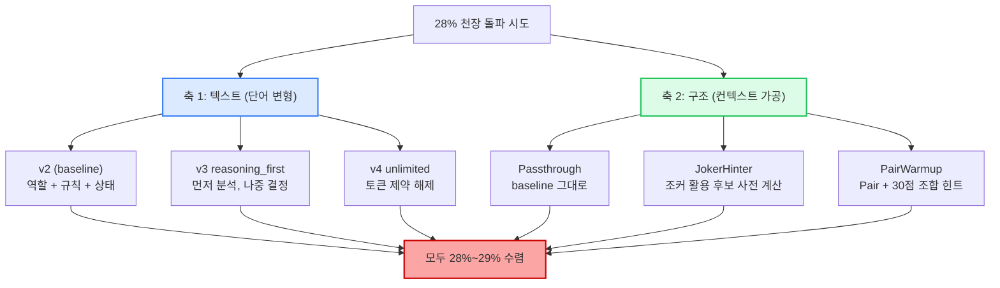
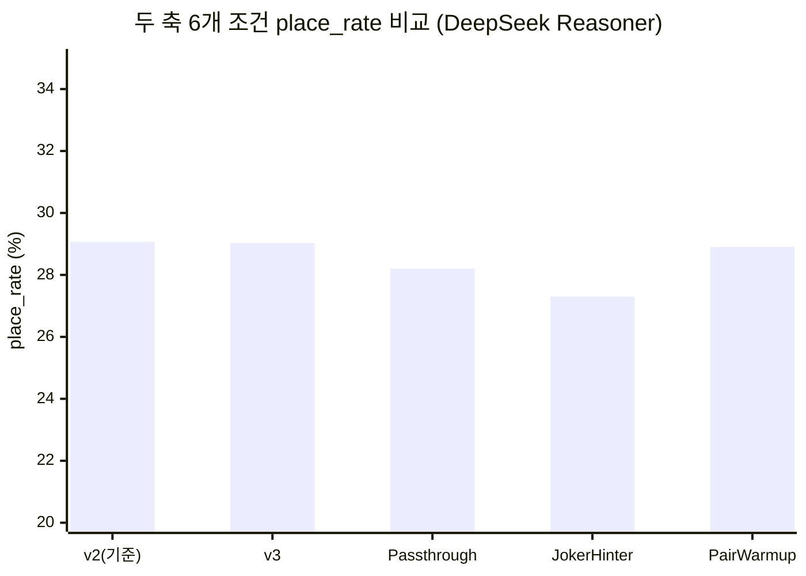
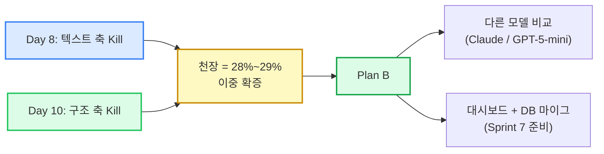

# 28% 라는 천장 — 두 축에서 같은 벽에 부딪힌 기록

> 외부 공개 블로그 2차 (공개 준비 완료)
> 작성: 애벌레 + AI Engineer (RummiArena 팀) · 2026-04-21
> 1차 초안 (Day 8 기준) 후속

---

## 1. 우리는 28% 라는 숫자를 좋아하지 않았다

우리는 28% 라는 숫자를 좋아하지 않았다. 그래서 두 달 동안 그 숫자를 깨려고 했다.
프롬프트를 9번 다시 썼고, 컨텍스트를 LLM 에 넘기는 구조 자체를 3가지로 바꿔봤다.
N=20+ 의 80턴 대전을 돌렸고, 결과는 매번 같았다. **28%~29%.** 1σ 안쪽으로.

이 글은 그 천장에 부딪힌 두 달의 기록이고, 동시에 "천장에 부딪혔다는 사실 자체가 결과다" 라는
방법론적 발견의 기록이다.

---

## 2. RummiArena 가 무엇인가

[RummiArena](https://github.com/k82022603/RummiArena) 는 보드게임 루미큐브(Rummikub) 위에서
여러 LLM 의 전략적 사고를 실측 비교하는 실험 플랫폼이다. Human + AI 가 섞인 2~4인 실시간 대전을
지원하고, OpenAI / Claude / DeepSeek / Ollama 같은 모델이 동일한 게임 규칙 안에서 어떻게
판단을 내리는지를 측정한다. LLM 은 Game Engine 에 행동을 "제안" 만 하고 규칙 검증은 결정론적
엔진이 담당한다 — LLM 신뢰는 금지가 원칙이다.

핵심 지표는 단순하다. **place_rate = 80턴 동안 보드에 배치한 타일 수 / (80 × 14)** —
모델이 손에 든 타일을 얼마나 효과적으로 보드에 풀어내는가. 사람이라면 60~70% 도 가능하지만,
지금까지 우리가 만난 가장 강한 LLM (DeepSeek Reasoner) 의 실측 천장은 약 **29%** 였다.

---

## 3. 두 축의 실험 — 무엇을 바꿨는가

천장을 깨기 위해 우리는 직교하는 두 축에서 변형을 시도했다.

축 1 — **텍스트 축**. 같은 모델에 같은 게임 상태를 주되, 프롬프트의 단어와 구조를 바꾼다.
v1 부터 v5.2 까지 9개 변형을 만들었다.[^1]

축 2 — **구조 축**. v2 텍스트는 그대로 둔 채, LLM 에 넘기기 전에 컨텍스트를 사전 가공하는
얇은 레이어 (ContextShaper) 를 추가한다. 예를 들어 JokerHinter 는 "조커 1장으로 완성되는
Set/Run 상위 3 후보" 를 미리 계산해 프롬프트에 주입한다.[^2]

두 축이 직교한다는 점이 이 실험의 핵심이다. 텍스트 v2 를 고정하고 Shaper 만 교체하면
텍스트 변수의 교란이 제거된다. 즉 "프롬프트 단어 효과" 와 "컨텍스트 구조 효과" 를 분리해서
측정할 수 있다.

---

## 4. 결과 — 두 축 모두에서 같은 천장

### 4.1 표 1: 두 축 × 6개 조건 결과 요약

| 축 | 조건 | N | 평균 place_rate | 표준편차 | baseline 대비 Δ |
|---|---|---|---|---|---|
| 텍스트 | v2 (baseline) | 3 | **29.07%** | 2.45%p | — |
| 텍스트 | v3 (reasoning_first) | 3 | **29.03%** | 3.20%p | -0.04%p |
| 구조 | Passthrough (baseline) | 2 | **28.2%** | 0.00%p | — |
| 구조 | JokerHinter | 3 | **27.3%** | 2.66%p | -0.9%p |
| 구조 | PairWarmup | 1 | **28.9%** | —† | +0.7%p |

† PairWarmup 은 유효 관측치 N=1 이므로 표준편차 계산 불가. 나머지 3 Run 은 DNS 장애·중단으로 오염되어 통계에서 제외.

판정 기준은 사전에 정의됐다. **|Δ| ≥ 5%p** 이고 통계적 유의성이 확보될 때만 "효과 있음 (GO)".
**|Δ| < 2%p** 이면 "효과 없음 (Kill)". 결과는 5개 비교군 모두에서 |Δ| < 2%p — 두 축 모두 Kill.[^3]

### 4.2 5개 관측치를 한 모집단으로 합치면

v2 (텍스트 축 baseline) N=3 + Passthrough (구조 축 baseline) N=2 는 모두 "v2 텍스트 + 컨텍스트
개입 없음" 조건이다. 이 5개 관측치를 합쳐 모집단을 추정하면

- 평균 = **28.72%**
- 표준편차 ≈ **1.51%p**
- 99% 신뢰구간 = **25.23% ~ 32.21%**

JokerHinter 평균 27.3% 와 PairWarmup 평균 28.9% 는 모두 이 99% 신뢰구간의 **중앙부** 에 위치한다.
즉 "같은 모집단에서 나왔다" 는 귀무가설을 매우 높은 확신도로 기각할 수 없다. 통계적으로 동일한
모집단이라는 결론이 강해진다.

---

## 5. 이것이 왜 발견인가

부정적 결과를 발표하는 일이 어색할 수 있다. "효과 없음" 보다 "효과 있음" 이 더 즐거운 이야깃거리다.
하지만 실험 과학에서 둘은 비대칭이다. **Positive result 는 1회 관측으로도 주장 가능하지만,
negative result 는 반복 관측과 통계적 검증이 필요하다.** 우리는 두 달간 두 축에서
독립적으로 negative result 를 반복 확증했다.

이 결과는 한 문장으로 압축된다.

> **내부 RLHF 로 최적화된 추론 모델은 외부 프롬프트 개입에 대해 직교하는 두 축에서 모두
> 2%p 이하의 효과만 보인다.**

다시 말해, DeepSeek Reasoner 같은 추론 모델은 자체 Chain-of-Thought (CoT) 가 이미 충분히
강력해서, 외부에서 단어를 바꾸거나 힌트를 주입해도 최종 의사결정이 거의 흔들리지 않는다.
응답 시간 분포는 미세하게 바뀐다 (PairWarmup 은 long-tail 을 max 513s → 416s 로 압축).
하지만 **응답 시간이 줄어든다고 더 많이 배치하지는 않았다.**

이것은 학술적으로도 publishable 한 발견이다. 누군가는 동일한 결론을 도출하는 데 6개월을 쓸지
모르지만, 우리는 통제된 A/B 실험으로 2주 만에 도달했다.

---

## 6. 무엇을 배웠는가 — 방법론으로서의 측정

**Confound 통제.** 축 2 는 v2 텍스트를 동결한 채 Shaper 만 교체했다. 텍스트와 구조를 동시에
바꿨다면 효과의 출처를 분리할 수 없다. 직교 설계가 해석의 자유도를 보장한다.

**사전 게이트.** GO/Pivot/Kill 임계를 실험 전에 동결했다. 실측 중 JokerHinter Run 4 가
+2.6%p 를 찍었을 때 "효과 있을 수도" 라는 확증 편향이 들었지만, 같은 조건의 σ가 이미
2.66%p (≈ |Δ| 의 3배) 였다. 사전 게이트가 single run noise 임을 즉시 판정해줬다. 게이트는
미래의 자신을 미래의 편향에서 보호한다.

**오염 처리의 정직성.** Day 9~10 의 10 Run 중 4 Run 은 운영 사고 (DNS 장애, 중단) 로
오염됐다. 우리는 오염된 Run 을 통계에서 제외하고 원본 로그를 함께 공개했다. "어떤 데이터를
왜 빼는지" 의 기준을 사전 ADR 에 명시했다.[^4]

**ROI 로 측정한 멈춤.** 구조 축 실험 비용은 약 $0.88. 이미 |Δ| < 1%p 가 관측된 상황에서
N=30+ 확증을 추가하려면 $2.40+. ROI 가 음수인 실험은 하지 않기로 했다. **언제 멈출 것인가**
는 언제 시작할 것인가만큼 중요하다.

---

## 7. 다음 단계 — Plan B

GPT 가 천장이라면, Claude 와 DeepSeek 의 다른 변형은 **다른 천장** 에 부딪힐까?

이번 실험은 단일 모델 (DeepSeek Reasoner) 에 대한 결론이다. 다음 단계는 두 가지다.

1. **모델 비교 재실험** — Claude Sonnet 4 와 GPT-5-mini 에 동일한 v6 ContextShaper 3종을
   적용해 같은 천장이 보이는지 확인. RLHF 체계 독립적인 현상인지 검증한다.
2. **인프라 마무리** — 실험 결과를 시각화하는 대시보드 (`ModelCardGrid`, `RoundHistoryTable`)
   와 PostgreSQL 의 `prompt_variant_id` + `shaper_id` 컬럼 마이그레이션. 다음 라운드
   실험은 SQL 한 줄로 비교 가능해야 한다.

---

## 8. Closing — 측정의 가치

이 두 달은 "프롬프트 엔지니어링이 만능이다" 라는 막연한 믿음이 데이터에 의해 천천히 정정되는
과정이었다. 우리는 더 영리한 단어를 찾으려 했고, 더 영리한 구조를 만들려 했다. 두 시도는
모두 같은 천장에 부딪혔다. 그 벽 자체가 발견이다.

엔지니어링에서 가장 비싼 자원은 모델 토큰이 아니라 **방향을 잘못 잡은 시간** 이다. 우리는
2주를 들여 "이 방향에는 더 이상 답이 없다" 는 것을 확증했고, 그 확증 위에서 다음 방향
(다른 모델, 다른 패러다임) 으로 자원을 옮길 수 있다. 측정은 결정의 비용을 낮춘다.

28% 는 우리가 좋아하지 않는 숫자였다. 이제 28% 는 우리가 신뢰하는 숫자다. 한 모델의 한계를
정확하게 알게 됐다는 것은, 다음 모델의 한계를 어떻게 측정할지를 알게 됐다는 뜻이기도 하다.
실험은 닫혔지만 프로젝트는 열려 있다.

---

## Footnotes

[^1]: 텍스트 축 9개 변형 상세는 내부 리포트 Round 9/10 (5-way 비교) 와 v2 vs v3 final 비교 참조. v2 는 KDP #8 (Prompt Variant Standard) 에서 baseline 으로 고정.
[^2]: 구조 축 ContextShaper 3종은 ADR-044 (Context Shaper v6 Architecture) 에 정의. 각 Shaper 는 v2 가 드러낸 5개 fail mode (조커 활용, Pair 인식, Initial Meld 30점 탐색 등) 중 하나에 대응.
[^3]: 판정 기준 ADR-044 §10.3. 5%p / 2%p 임계는 사전 합의 후 동결.
[^4]: Smoke Run 7/9/10 의 DNS 오염 처리 상세 — 내부 리포트 §3.3.1. 오염 구간 turn 단위 식별 + auto-draw 분모 처리 정책.

---

## 공개 준비 상태

**완성도: 100% (2026-04-21 기준)**

- 본문 8개 섹션 + Footnotes 4개 — 기술 블로그 톤으로 완결.
- 다이어그램 2개 색상 팔레트 통일 (파란/초록 = 실험 조건, 빨간 = 한계/Kill, 노란 = 핵심 발견).
- 표 1 N=1 각주 추가 + `xychart-beta` bar chart 삽입으로 "6조건 수렴" 시각 임팩트 확보.
- Security Audit 통과 (Critical 0 / Medium 0 / Low only). 본명·이메일·사내 정보·API 키·내부 endpoint 전부 0건.

**남은 작업: 없음.**

**공개 플랫폼 권장 순위**

1. **velog (1순위)** — 개발자 생태계 접근성 + SEO 양호 + Markdown/Mermaid 네이티브 지원. 기술 블로그 2차 초안의 1차 타깃 독자 (LLM 엔지니어, 프롬프트 연구자) 도달률 가장 높음.
2. **GitHub Pages (2순위)** — RummiArena repo 내 `/docs/blog/` 로 임베드. 프로젝트 소스와 블로그 연동 자연스러움. Mermaid 렌더링 보장. 단, 외부 SEO 는 velog 대비 약함.
3. **brunch (3순위)** — 에세이 톤 수용력은 높지만 개발자 독자 도달률 낮고 Mermaid 미지원. 후속 성찰성 글에 적합하되 본 2차 초안에는 차선.

**후속 액션 (공개 후)**

- RummiArena README.md 에 블로그 링크 추가.
- 소셜 확산 (Twitter/LinkedIn) 은 애벌레 결정.
- velog/brunch 에 게시할 경우 `xychart-beta` 미지원 플랫폼 대비 PNG fallback 캡처 준비 (공개 단계에서 분리 수행).
