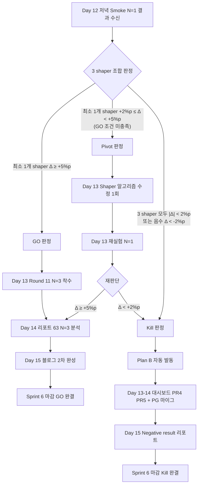

# Decision Prep — Day 12 v6 Shaper 1차 실측 GO/Kill/Pivot 미팅 선제 준비

- **작성일**: 2026-04-19 (Sprint 6 Day 9 저녁)
- **작성자**: PM (Opus 4.7 xhigh)
- **대상 미팅**: 2026-04-22 (Day 12) 저녁, Task #20 Phase 5 Smoke Run 결과 판정
- **문서 성격**: **선제 작성 템플릿** — Day 12 실측 수신 시 §5 결정문에 숫자만 채워 즉시 종료 가능
- **연관 문서**:
  - `work_logs/decisions/2026-04-19-task20-task21-roadmap.md` — Task #20/#21 로드맵 (오늘 PM 본인 작성)
  - `docs/02-design/44-context-shaper-v6-architecture.md` — v6 ContextShaper ADR (Architect + AIE 초안, QA §10 보강 중)
  - `docs/02-design/39-prompt-registry-architecture.md` — Registry orthogonal 확장 근거
  - `docs/02-design/41-timeout-chain-breakdown.md` — Timeout Chain SSOT (CLAUDE.md KDP #7)
  - `docs/02-design/42-prompt-variant-standard.md` — Prompt Variant SSOT (CLAUDE.md KDP #8)
  - `docs/04-testing/60-round9-5way-analysis.md` — Round 9 5-way 통합 분석 (575줄)
  - `docs/04-testing/62-deepseek-gpt-prompt-final-report.md` — DeepSeek/GPT 프롬프트 최종 리포트 (1039줄)

---

## 1. 배경 및 목적

### 1.1 왜 Day 12 에 GO/Kill/Pivot 결정이 필요한가

Task #20 로드맵 §3.2 Phase 5 에 따라 Day 12 (2026-04-22) 에는 다음이 수신된다.

- DeepSeek Reasoner × v2 variant × 3 shaper (passthrough / joker-hinter / board-compact) 각 N=1, 80턴
- 총 3 run, 예상 비용 $0.12, 순차 실행 ~7h
- 산출: `work_logs/battles/r11-v6-smoke/*.json` + `docs/04-testing/63-v6-smoke-r11.md` 초안 (AIE)

이 데이터 기반으로 다음을 판정해야 한다.

1. **Task #21 A안 (Round 11 N=3 + 블로그 2차) 를 Day 13 에 착수할 것인가**
2. 착수한다면 3개 shaper 전부인가, 특정 shaper 만 선별인가
3. 착수하지 않는다면 Plan B (D안 + B안) 로 자동 전환할 것인가

결정을 미루면 Sprint 6 종료일 (Day 15) 압박이 누적되어 Sprint 7 계획까지 왜곡된다. 따라서 **Day 12 저녁 30분 미팅에서 결정문 1장 완결** 이 본 문서의 운영 목표.

### 1.2 Smoke N=1 데이터로 판단하는 한계 + 대안

**한계**
- N=1 의 표준편차 σ 추정 불가 → 통계적 유의성 주장 불가
- 루미큐브 특성상 초기 랙/셔플 seed 에 따라 ±3~5%p 변동 가능 (리포트 60번 §4.2 variance 분석 근거)
- Δ 의 절대값만으로 판단 시 outlier 오분류 위험

**대안 (QA ADR 44 §10 보강 방향과 일치)**
- 절대값이 아닌 **3단 스레시홀드** 로 구간 판정 (GO/Pivot/Kill)
- Pivot 구간은 N=3 보강으로 재판단 (A안 Phase 1 이 곧 이 보강 역할)
- Kill 기준은 `|Δ| < 2%p` 로 보수적 설정 (false negative 감수, false positive 회피)
- N=1 에서 직접 Kill 판정은 **최소 3 shaper 중 2개 이상** 이 `|Δ| < 2%p` 일 때만 허용 (단일 shaper outlier 방지)

### 1.3 ADR 44 §10 과의 임계치 일관성

| 기준 | ADR 44 §10 초안 (Architect) | 본 PM 문서 (로드맵과 일치) | QA 보강 방향 |
|------|--------------------------|---------------------------|--------------|
| Phase 4 pilot | `Δ > 2%p` → Phase 5 진입 | (해당 없음, 본 문서는 Phase 5 판정) | — |
| Phase 5 GO | `N=3 평균 Δ > 2%p` 이고 σ < Δ | **N=1 기준 `Δ ≥ 5%p`** | 보강 중 |
| Kill | `Δ < 1%p` (No-Go §10.4) | **`|Δ| < 2%p` 또는 `Δ < -2%p`** | 보강 중 |

**일관성 확보 전략**
- 본 문서는 **N=1 Smoke 기준** 임계치 (Δ ≥ 5%p / 2~5%p / <2%p). ADR 44 §10.3 은 **N=3 기준** 임계치 (Δ > 2%p 이고 σ < Δ).
- **N=1 의 불확실성** 을 반영하여 GO 컷오프를 ADR §10.3 보다 **+3%p 상향** 설정. Pivot 구간은 "ADR §10.3 N=3 기준에 도달 가능성이 있는 영역" 으로 정의.
- QA 가 Day 9~10 에 §10 보강 완료 시 본 문서 §2 매트릭스와 cross-reference 재확인 (Day 12 미팅 전).

---

## 2. 판정 매트릭스

### 2.1 3×4 매트릭스 (판정 × 트리거/즉시/1~3일/Task)

| 판정 | 트리거 (Δ = treatment - baseline, N=1 Smoke) | 즉시 액션 (Day 12 저녁) | 1~3일 액션 (Day 13~15) | 관련 Task |
|------|---------------------------------------------|-------------------------|------------------------|-----------|
| **GO** | `Δ ≥ +5%p` (3 shaper 중 최소 1개) | ADR 44 §10.2 Phase 5 N=3 배치 스크립트 준비 | Day 13~14 Round 11 N=3 실측 + Day 14 리포트 63 §N=3 확장 + Day 15 블로그 2차 | Task #21 A안 |
| **Pivot** | `+2%p ≤ Δ < +5%p` (3 shaper 중 최소 1개, GO 조건 미충족) | Shaper 알고리즘 수정 1회 (AIE 주도, ADR 44 §7 참조) | Day 13 재실험 N=1 → Day 14 최종 판단 (GO 또는 Kill) | Task #20 Phase 4.5 (신설) |
| **Kill** | 3 shaper 모두 `|Δ| < 2%p` 또는 `Δ < -2%p` | Task #21 A안 Kill 선언 + Plan B 자동 발동 | Day 13~14 Plan B 병행 (D안 대시보드 + B안 PG 마이그) + Day 15 v6 Negative result 리포트 | Task #21 B안 전환 |

### 2.2 임계치 선택 근거

- **`Δ ≥ 5%p` GO**: Round 4 에서 DeepSeek 30.8% → Round 5 Run 3 동일 30.8% 재현성 확인 (MEMORY.md 근거). ±3%p 자연 변동 을 넘어 **의미 있는 효과** 로 간주 가능한 구간.
- **`+2%p ≤ Δ < +5%p` Pivot**: ADR 44 §10.2 의 Phase 4 pilot 기준 `Δ > 2%p` 통과 구간. N=3 보강 시 통계적 유의성 확보 가능성 있음.
- **`|Δ| < 2%p` Kill**: 자연 variance 범위 내. Shaper 효과와 노이즈 구분 불가.
- **`Δ < -2%p` Kill**: 역효과 명확. 즉시 중단.

### 2.3 3 shaper 조합 판정 규칙

| passthrough (baseline) | joker-hinter (Δ_j) | board-compact (Δ_b) | 종합 판정 |
|------------------------|--------------------|--------------------|----|
| ref | `≥ +5%p` | any | **GO** (joker-hinter 채택) |
| ref | any | `≥ +5%p` | **GO** (board-compact 채택) |
| ref | `+2~+5%p` | `+2~+5%p` | **Pivot** (둘 다 보강 후보) |
| ref | `+2~+5%p` | `< +2%p` | **Pivot** (joker-hinter 만 보강) |
| ref | `< +2%p` | `< +2%p` | **Kill** |
| ref | any 음수 `< -2%p` | any 음수 `< -2%p` | **Kill** (구조 축 역효과) |

---

## 3. 시나리오별 체크리스트

### 3.1 시나리오 A: GO (`Δ ≥ +5%p` 최소 1개 shaper)

**Day 12 저녁 (결정 직후 30분 내)**
- [ ] PM 결정문 §5 서명 완료 후 Task #21 A안 공식 착수 선언
- [ ] AIE — Phase 5 N=3 배치 스크립트 준비 (Day 13 오전 실행 예정)
  - 대상 shaper: GO 조건 충족한 shaper 만 (최소 1개, 최대 2개)
  - 항상 passthrough 포함 (baseline 재확인)
- [ ] DevOps — 비용 한도 재확인 (`kubectl get configmap` → DAILY_COST_LIMIT_USD=$20, HOURLY_USER_COST_LIMIT_USD=$5)

**Day 13 (실측 Day 1)**
- [ ] AIE — Round 11 N=3 실측 착수 (야간 배치 가능, DevOps 협업)
- [ ] DevOps — timeout 체인 불변 선언 재검증 (ADR 44 §8 참조, KDP #7)
- [ ] Frontend Dev — 대시보드 RoundHistoryTable 에 v6 데이터 컬럼 신규 추가 (`shaper_id` 표시)
- [ ] Node Dev — Smoke Run 에서 발견된 minor bug 핫픽스 (있을 시)

**Day 14 (실측 Day 2 + 분석)**
- [ ] AIE — `docs/04-testing/63-v6-shaper-round11-results.md` 초안 작성 시작 (§N=3 분석 섹션)
- [ ] QA — ADR 44 §10.3 기준 재적용 (N=3 평균 Δ > 2%p 이고 σ < Δ 충족 여부)
- [ ] PM — Day 14 저녁 Task #21 Phase 2 게이트 체크 (리포트 63 초안 품질)

**Day 15 (블로그 2차 + Sprint 6 마감)**
- [ ] AIE + PM — `docs/03-development/19-deepseek-variant-ablation.md` §v6 structural axis 섹션 추가 (600~800줄 목표)
- [ ] PM — Sprint 6 회고 문서 작성 (`docs/01-planning/` 또는 `work_logs/retrospectives/`)
- [ ] PM — Sprint 7 킥오프 아젠다 초안 (PostgreSQL 마이그 + DashScope + DeepSeek v3-tuned A/B)

---

### 3.2 시나리오 B: Pivot (`+2%p ≤ Δ < +5%p`)

**Day 12 저녁**
- [ ] AIE — 어느 shaper 가 Pivot 구간인지 + 어느 fail mode (리포트 60번 §6) 가 미해결인지 diagnose
- [ ] Architect + AIE — Shaper 알고리즘 수정 방향 합의 (ADR 44 §7 알고리즘 update 제안)
- [ ] Node Dev — 패치 작업 범위 확인 (24h 내 완료 가능 여부)

**Day 13 (패치 + 재실측)**
- [ ] Node Dev — Shaper 알고리즘 수정 (1회 한정, ADR 44 §7 section update + commit)
- [ ] QA — 수정된 shaper unit test regression 0건 확인
- [ ] AIE — 재실측 N=1 (passthrough + 수정된 shaper 만, 2 run, ~5h, $0.08)

**Day 14 (재판단)**
- [ ] AIE — 재실측 결과 기반 §2.1 매트릭스 재적용
  - Δ ≥ 5%p → **GO 전환** (Day 14~15 압축 일정으로 Round 11 N=3 착수)
  - Δ < 2%p → **Kill 자동 전환** (Plan B 발동, Pivot 종료)
- [ ] PM — Day 14 저녁 결정문 `2026-04-22-v6-gokill-pivot-result.md` §Pivot 섹션 update

**Pivot 횟수 제한 (무한 루프 방지)**
- **최대 1회** 의 알고리즘 수정만 허용
- 1회 Pivot 후에도 Δ < 5%p 면 **자동 Kill** (재Pivot 금지)
- 이 규칙은 Sprint 6 마감 (Day 15) 압박 하에서 리소스 bleed 차단 목적

---

### 3.3 시나리오 C: Kill (`|Δ| < 2%p` 또는 `Δ < -2%p`)

**Day 12 저녁 (즉시)**
- [ ] PM — Task #21 A안 Kill 선언. **Plan B 자동 발동** (애벌레 재승인 불요, 로드맵 §4.4 위임 확인)
- [ ] AIE — Kill 사유 3줄 결정문 §5 에 기록 (shaper 별 Δ + 자연 variance 설명)

**Day 13~14 (Plan B 병행)**
- [ ] Frontend Dev (Sonnet 4.6) — **D안**: 대시보드 PR 4 ModelCardGrid 100% 완성 (현 90% → 100%)
- [ ] Frontend Dev — **D안**: PR 5 RoundHistoryTable 신규 착수 (Sprint 6 내 완료 목표)
- [ ] Go Dev — **B안**: PostgreSQL 마이그레이션 (`ALTER TABLE battle_runs ADD COLUMN prompt_variant_id TEXT, shaper_id TEXT` + index)
- [ ] Designer (Sonnet 4.6) — 대시보드 컴포넌트 스펙 `docs/02-design/33` 기반 최종 검토

**Day 15 (Sprint 6 마감)**
- [ ] AIE — `docs/04-testing/63-v6-smoke-r11.md` 를 **"Negative result" 리포트** 로 정리 (300~400줄)
  - 핵심 결론: "텍스트 축 (v2/v3/v4) + 구조 축 (joker-hinter/board-compact) 모두 DeepSeek Reasoner 에서 통계적 구분 불가"
  - Sprint 7 블로그 재료로 확보 ("Negative result 도 가치 있다" 서사)
- [ ] PM — Sprint 6 retrospective 에 "텍스트 축 + 구조 축 모두 구분 불가" 교훈 반영
- [ ] PM — Sprint 7 계획 재조정 (블로그 2차 범위 축소 또는 재정의, PostgreSQL 마이그 완료 → DashScope 착수 가능)

---

## 4. Day 12 미팅 아젠다 (30분, 저녁)

**일시**: 2026-04-22 (Day 12) 21:00~21:30 KST
**장소**: Agent Teams 세션 (비동기 가능, Critical decision 이므로 동기 권장)
**참석**: PM, Architect, AIE, QA, Node Dev, DevOps, 애벌레

| 순서 | 시간 | 담당 | 내용 |
|------|------|------|------|
| 1 | 5분 | AIE | Smoke N=1 결과 브리핑 — 3 shaper 각 Δ 절대값 + 신뢰도 해석 (N=1 caveat 명시) |
| 2 | 5분 | QA | ADR 44 §10 + 본 문서 §2 매트릭스 대비 **1차 판정 권고** (GO/Pivot/Kill 중 하나) |
| 3 | 10분 | Architect + Node Dev | 판정 시나리오 A/B/C 중 기술적 실현 가능성 확인 — 특히 Pivot 시 패치 24h 가능 여부, GO 시 timeout 체인 불변 재검증 |
| 4 | 5분 | DevOps | 인프라 영향 체크 — DAILY_COST_LIMIT, Istio VS timeout (현 710s), K8s Pod 상태, 배치 스케줄 |
| 5 | 5분 | PM + 애벌레 | 최종 판정 + §5 결정문 서명 + 다음 게이트 (Day 13 오전 착수 또는 Day 14 재판단) 확정 |

**미팅 전 사전 배포 (Day 12 오후)**
- AIE: Smoke 결과 JSON 3개 + 초안 분석 표 (15분 요약)
- QA: ADR 44 §10 최종본 (Day 10 보강 완료 가정)
- PM: 본 문서 링크

---

## 5. 결정문 템플릿 (빈 양식, Day 12 저녁 채움)

> **저장 경로**: `work_logs/decisions/2026-04-22-v6-gokill-pivot-result.md` (신규, 본 템플릿 복사하여 숫자만 채워 사용)

```markdown
# Decision — Day 12 v6 Shaper 1차 실측 GO/Kill/Pivot 결정문

- **날짜**: 2026-04-22 (Sprint 6 Day 12 저녁)
- **참석**: PM, Architect, AIE, QA, Node Dev, DevOps, 애벌레
- **대상**: Task #20 Phase 5 Smoke Run N=1 결과 (passthrough / joker-hinter / board-compact)
- **연관**: `work_logs/decisions/2026-04-19-day12-gokill-pivot-prep.md` (선제 준비 문서)

## 1. 실측 요약

| Shaper | place_rate | fallback_count | avg_latency | max_latency | 비용 |
|--------|-----------|----------------|-------------|-------------|------|
| passthrough (baseline) | ___% | ___ | ___s | ___s | $___ |
| joker-hinter | ___% | ___ | ___s | ___s | $___ |
| board-compact | ___% | ___ | ___s | ___s | $___ |

- Δ_joker = ___%p (joker-hinter - passthrough)
- Δ_board = ___%p (board-compact - passthrough)

**신뢰도 해석 (N=1 caveat)**
- 루미큐브 자연 variance ±3~5%p 반영 시 Δ 해석 유의
- ___ (AIE 추가 코멘트)

## 2. 판정

- [ ] **GO** — Task #21 A안 Phase 1 Round 11 N=3 착수 (Day 13 오전)
- [ ] **Pivot** — Shaper `___` 알고리즘 수정 후 Day 13 재실험 (1회 한정)
- [ ] **Kill** — Plan B 발동 (D안 대시보드 + B안 PG 마이그)

## 3. 근거 3줄

1. ___
2. ___
3. ___

## 4. 즉시 액션 (24시간 내)

| Owner | 액션 | 기한 |
|-------|------|------|
| ___ | ___ | Day 13 __:__ |
| ___ | ___ | Day 13 __:__ |

## 5. 다음 게이트

- Day ___: ___ (담당: ___)
- Day 15 저녁: Sprint 6 종료 회고 (담당: PM)

## 6. 서명

- PM: 애벌레 대리 (Opus 4.7 xhigh)
- 애벌레: ___ (동의 여부)
```

---

## 6. 비용 시뮬레이션

| 시나리오 | 내용 | 비용 | DeepSeek 잔액 비율 |
|---------|------|------|---------------------|
| **A (GO)** | Round 11 N=3 × 3 shaper = 9 run × $0.04 | **$0.36** | 11.7% (/$3.08) |
| **B (Pivot)** | 재실험 N=1 × 2 run (passthrough + 수정 shaper) × $0.04 | **$0.08** | 2.6% |
| **C (Kill)** | 즉시 종료, 추가 v6 실험 비용 0 | **$0** | 0% |
| **B → A 전환** | Pivot 재실험 후 GO 판정 시 압축 N=3 (Day 14~15) | $0.08 + $0.36 = **$0.44** | 14.3% |

**DAILY_COST_LIMIT_USD=$20 대비**
- 최악 시나리오 (B→A 전환): 2.2% 소진
- HOURLY_USER_COST_LIMIT_USD=$5 는 DeepSeek $0.013/hr 기준 안전 (MEMORY.md 근거)

**결론**: 모든 시나리오에서 비용 안전. 완화 조치 불필요.

---

## 7. 리스크 + 완화

### 7.1 R1 — Pilot N=1 이 outlier 로 판정 왜곡

- **확률**: 중
- **영향**: 상 (잘못된 GO → Phase 5 N=3 $0.36 낭비 / 잘못된 Kill → 유망 shaper 폐기)
- **완화책**:
  1. QA §10.2 의 "Phase 5 N=3 최소 요구사항" 으로 보정 (GO 후 N=3 에서 Δ < 2%p 시 재Kill 허용)
  2. §2.3 3 shaper 조합 판정 규칙 적용 — 단일 shaper outlier 만으로 GO 판정 방지
  3. AIE 의 Smoke 결과 브리핑에 "seed 분포 + 랙 초기값 + 턴 별 place 분포" 포함 요구

### 7.2 R2 — Shaper 버그가 실험 오염

- **확률**: 낮~중 (Node Dev 의 Day 11 구현 단계에서 QA unit test GREEN 확인 필수)
- **영향**: 상
- **완화책**:
  1. QA §10.5 체크리스트 적용 (ADR 44 §10 보강본 기준)
  2. Phase 4 Day 11 의 Smoke fixture (`scripts/smoke-v6.ts`) 로 각 shaper output determinism 사전 검증
  3. Day 12 미팅 에서 QA 가 "구현 규약 준수" 를 명시적으로 signoff

### 7.3 R3 — 시간 지연 (Day 12 연기)

- **확률**: 중 (Day 11 Node Dev 구현이 밀릴 경우)
- **영향**: 상 (Sprint 6 종료일 Day 15 압박 증가)
- **완화책**:
  1. **Pivot 허용 횟수 1회로 제한** (§3.2 무한 루프 방지)
  2. Day 11 Phase 3~4 에 Node Dev 집중 배치 (타 작업 off-load, 로드맵 §6.3 R3 참조)
  3. Day 12 지연 시 Day 13 오전 으로 1일 슬립 허용. 단 Task #21 A안 Phase 2/3 은 하루 압축 (Day 14 리포트 + Day 15 블로그 병행)

### 7.4 R4 — Agent Teams 병렬 작업 파일 충돌

- **확률**: 낮 (오늘 파일 단위 직렬화 규칙 도입)
- **영향**: 중 (rebase 충돌, commit 순서 꼬임)
- **완화책**: commit 전 `git pull --rebase origin main` 필수 (본 문서 작업 지침)

---

## 8. 부록: Plan B 구체 일정 (Kill 발동 시)

### 8.1 Day 13~14 (Plan B Phase 1)

| 일자 | Owner | 작업 | 산출물 |
|------|-------|------|--------|
| Day 13 오전 | Frontend Dev (Sonnet 4.6) | ModelCardGrid 90%→100% 완성 | `src/frontend/src/components/dashboard/ModelCardGrid.tsx` finalize |
| Day 13 오후 | Frontend Dev | PR 5 RoundHistoryTable draft 착수 | `src/frontend/src/components/dashboard/RoundHistoryTable.tsx` skeleton |
| Day 13 | Go Dev | PostgreSQL 마이그 스크립트 작성 | `src/game-server/db/migrations/20260423_add_variant_shaper.sql` |
| Day 13 | Designer | 대시보드 컴포넌트 스펙 최종 검토 | `docs/02-design/33-dashboard-component-spec.md` update |
| Day 14 오전 | Go Dev | 마이그 로컬 PostgreSQL 적용 + 테스트 | migration validated |
| Day 14 오후 | Frontend Dev | RoundHistoryTable 완성 | test-results passing |

### 8.2 Day 15 (Sprint 6 마감)

| Owner | 작업 | 산출물 |
|-------|------|--------|
| AIE | `docs/04-testing/63-v6-smoke-r11.md` Negative result 리포트 완성 | 300~400줄 |
| PM | Sprint 6 retrospective | `work_logs/retrospectives/sprint-6-retro.md` |
| PM | Sprint 7 계획 (Negative result 반영) | `docs/01-planning/sprint-7-plan.md` |

### 8.3 Plan B 선택 시 Sprint 7 연결

- **블로그 2차 이월**: 범위 축소 (텍스트 축만 종결 서사 → Round 10 기준, v6 Negative 부록 추가)
- **DashScope API 발급**: Sprint 7 첫 주 착수 가능 (리소스 여유)
- **DeepSeek v3-tuned A/B**: v6 Kill 이 v3-tuned 에는 영향 없음 (텍스트 축 보완)

---

## 9. 작업 지침 반영 확인

### 9.1 Agent Teams 협업 (QA ADR 44 §10 cross-reference)

- **§2.2 임계치 선택 근거** 에 ADR 44 §10.2 (N=1 Pivot `Δ > 2%p`) 및 §10.3 (N=3 GO `Δ > 2%p` 이고 σ < Δ) 과의 차이 명시
- **§1.3 일관성 표** 로 세 기준 (ADR 초안 / PM 본 문서 / QA 보강 방향) cross-reference
- QA §10 보강 완료 시 (Day 9~10) 본 문서 §2 매트릭스 재확인 의무 명시 (§1.3 마지막 항)

### 9.2 CLAUDE.md 지침 준수

- **KDP #7 (Timeout SSOT)**: §3.1 GO 시나리오에 "timeout 체인 불변 선언 재검증" 액션 포함 (ADR 44 §8 + `docs/02-design/41` §5 체크리스트 경로 명시)
- **KDP #8 (Variant SSOT)**: 본 문서는 variant 변경을 수반하지 않음 (Registry 의 shaper 축 orthogonal 확장). ADR 44 §6 + `docs/02-design/42` §2 표 B 준수 언급

### 9.3 SKILL 활용

- **mermaid-diagrams**: §10 에 시나리오 분기 flowchart 제공
- **code-modification**: 본 문서는 설계/프로세스 문서이므로 직접 해당 없음. Pivot/GO 시 Node Dev/AIE 가 해당 SKILL 적용

---

## 10. 부록 — 시나리오 분기 Flowchart



---

## 11. 변경 이력

| 일자 | 내용 | 담당 |
|------|------|------|
| 2026-04-19 저녁 | 초판 작성 — 판정 매트릭스 + 3 시나리오 체크리스트 + 결정문 템플릿 + Plan B 일정 | PM (Opus 4.7 xhigh) |
| (예정) 2026-04-22 저녁 | Day 12 미팅 결과 반영 — `2026-04-22-v6-gokill-pivot-result.md` 에 §5 템플릿 사용 | PM |

---

*본 문서는 Day 12 의사결정을 5분 미팅에서 서명 1장으로 종결시키기 위한 선제 준비 템플릿이다. QA ADR 44 §10 보강본 완료 시 §2 매트릭스 임계치 재확인 의무.*
