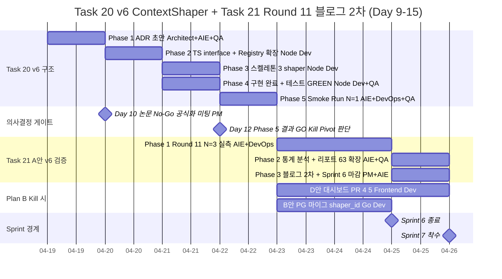
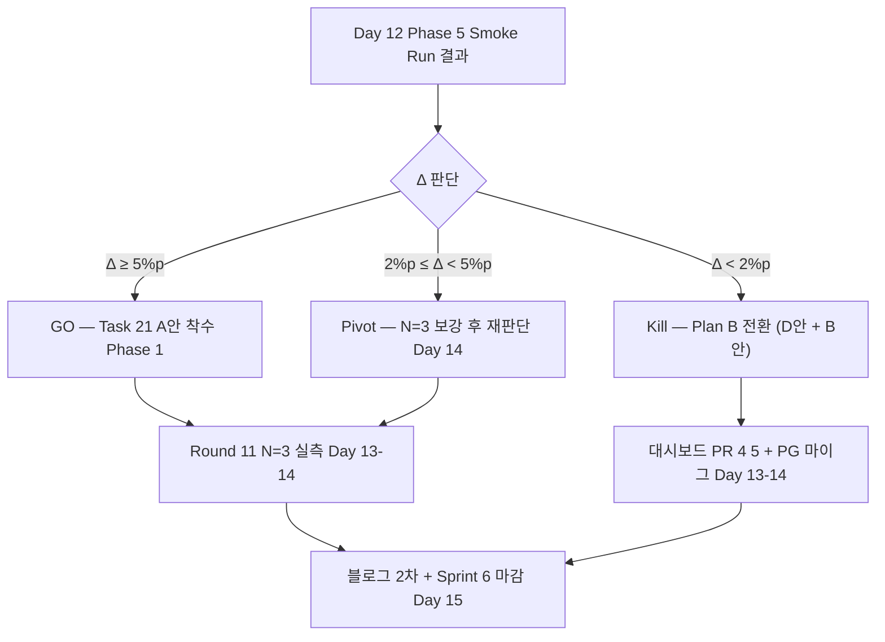

# Decision — Task #20 (v6 ContextShaper) 범위 확장 + Task #21 로드맵

- **작성일**: 2026-04-19 (Sprint 6 Day 9 저녁)
- **작성자**: PM (Opus 4.7 xhigh) — Architect / AI Engineer / QA 사전 의견 수렴 후 통합
- **의사결정 주제**:
  1. Task #20 범위를 **"ADR + TS interface" → "ADR + TS interface + 구현 스켈레톤 + 최초 3개 Shaper 구현 + 최소 실측 N=1"** 로 확장하는 공식 결정
  2. Task #20 완료 후 이어질 **Task #21** 선정 + 실행 계획
- **결정 방식**: PM 단독 판단 (애벌레 위임) + Agent Teams 협업 의견 인용
- **연관 문서**:
  - `docs/04-testing/60-round9-5way-analysis.md` — Round 9 5-way 통합 분석 (575줄)
  - `docs/04-testing/62-deepseek-gpt-prompt-final-report.md` — DeepSeek/GPT 프롬프트 최종 리포트 (1039줄)
  - `work_logs/decisions/2026-04-18-paper-gonogo.md` — 논문 GO/No-Go 판단서 (352줄)
  - `work_logs/scrums/2026-04-18-02-round9-10-review.md` — Day 8 All-Hands
  - `work_logs/scrums/2026-04-19-01.md` — Day 9 아침 스탠드업 (v6 킥오프)
  - `docs/02-design/39-prompt-registry-architecture.md` — Registry orthogonal 확장 근거
  - `docs/02-design/42-prompt-variant-standard.md` — Prompt Variant SSOT
  - `docs/02-design/41-timeout-chain-breakdown.md` — Timeout Chain SSOT
  - `docs/02-design/44-context-shaper-v6-architecture.md` — (Day 9 오후 킥오프 산출 예정, Architect + AIE)

---

## 1. 결정 (TL;DR)

### 1.1 Task #20 범위 확장: **GO**

기존 Day 9~10 범위였던 "ADR + TS interface" 를 **Day 9~Day 12** 로 연장하여 **최초 3개 Shaper 구현 + 최소 실측 N=1 (Smoke Run)** 까지 포함한다. 이유: ADR 만 쓰고 구현을 Sprint 7 로 넘기면 설계 드리프트가 누적되고 v6 효과 확증이 늦어진다. Sprint 6 안에 "실측 1회" 까지 내려가야 Day 13 이후 Task #21 착수 여부를 데이터 기반으로 판단할 수 있다.

### 1.2 Task #21 선정: **A안 — v6 효과 검증 Round 11 + 블로그 리포트 2차 (권고)**

후보 A~F 중 **A안** 채택 권고. 사유는 §3.2 에 상술. 단, Task #20 Phase 5 (Smoke Run N=1) 결과가 **"Δ < 2%p" 로 나와 구조 축도 실효 없음** 판명 시 **Plan B (D안 — 대시보드 PR 4/5 완성 + B안 PostgreSQL `shaper_id` 컬럼)** 로 전환하는 contingency 를 함께 명시.

애벌레 최종 결정 여지: **권고안을 수용하거나, D안/B안 우선 착수로 전환 가능**.

---

## 2. Agent Teams 사전 의견 (스크럼/All-Hands 인용)

본 로드맵은 PM 단독 작성이 아니라 Day 8 All-Hands (`work_logs/scrums/2026-04-18-02-round9-10-review.md`) 와 Day 9 아침 스탠드업 (`work_logs/scrums/2026-04-19-01.md`) 에서 다음 의견을 수집·반영했다.

### 2.1 Architect 의견 (Day 9 스탠드업)

> "v6 = 프롬프트 **텍스트** 가 아니라 **컨텍스트를 LLM 에게 줄 때 Rack/Board/History 를 어떻게 가공하느냐** 라는 축 전환. Registry orthogonal 확장 (variant 인덱스와 별개로 shaper 플러그인 주입). v2 텍스트 유지 + ContextShaper 만 교체하는 A/B 설계 (confound 최소화)."

→ 반영: Phase 2 에서 Registry 에 `shaper` 축을 variant 와 **orthogonal** 로 추가. variant 는 v2 고정, shaper 만 교체.

### 2.2 AI Engineer 의견 (Day 9 스탠드업 + 리포트 60번 §6)

> "v6 가설 공간: JokerHinter (조커 보유 시 우선 사용 힌트), PairWarmup (페어로 묶인 타일 시각화), SetFinisher (3-tile away set 표시). 현 v2 의 fail mode 3가지: ① 30점 initial meld 지연, ② 조커 보유 시 보수적 결정, ③ 후반부 long-tail latency (v4 unlimited 1337s 근거)."

→ 반영: Phase 3 에서 최초 3개 Shaper 를 **Passthrough (baseline) / JokerHinter / BoardCompact** 로 구체화. 리포트 60번 §6 의 fail mode 3가지에 1:1 대응.

### 2.3 QA 의견 (Day 9 스탠드업)

> "ADR 44번 검증 기준 미리 정의. v6 구현 후 어떤 숫자가 나와야 GO 인가 사전 합의 → 구현 후 reviewer 의문 차단. 부등식 계약 (timeout 체인) 영향 여부 사전 체크."

→ 반영: Phase 1 (ADR) 에서 **"Smoke Run N=1 에서 Δ ≥ 5%p 면 Phase 5 통과, Δ ∈ [2%p, 5%p) 면 N=3 보강, Δ < 2%p 면 Kill"** 을 사전 합의한다. timeout 체인은 변경하지 않음을 ADR §검증 섹션에 명시.

### 2.4 Node Dev 의견 (Day 9 스탠드업)

> "`ContextShaper` TypeScript interface 스케치 (input: Rack/Board/History, output: Shaped strings). Registry 에 `shaper` 축 추가 가능성 검토 (variant × shaper 2차원). 구현 착수는 Day 10 이후."

→ 반영: Phase 2 (Day 10) 에 TS interface 확정, Phase 3 (Day 11) 부터 구현 착수. Node Dev 가 구현 owner.

### 2.5 DevOps 의견 (Day 9 스탠드업)

> "v6 ContextShaper 구현 시 인프라 영향 없음 사전 확인 (timeout/istio 불변 가설)."

→ 반영: Phase 2 에서 "v6 는 ai-adapter 내부 로직 변경만, game-server/Istio/PG/Redis 변경 없음" 을 공식 declaration 으로 ADR 에 기록. CLAUDE.md §7 (Timeout Chain SSOT) 위반 여부 pre-check.

### 2.6 종합 (PM)

5명 의견이 모두 **"ADR 에서 구현까지" 연장하는 데 찬성**. 다만 Node Dev 가 "구현은 Day 10 이후" 단서를 달았으므로 Phase 3~5 를 Day 11~12 에 배치한다. QA 의 사전 검증 기준은 Phase 1 에 lock.

---

## 3. Task #20 확장 범위 상세

### 3.1 범위 비교

| 구분 | 구 범위 (Day 9~10) | **신 범위 (Day 9~Day 12)** |
|------|-------------------|----------------------------|
| Phase 1 — ADR 초안 | ✅ | ✅ + QA 검증 기준 §섹션 추가 |
| Phase 2 — TS interface | ✅ | ✅ + Registry 2차원(variant × shaper) 확장 |
| Phase 3 — 구현 스켈레톤 | ❌ | ✅ (Node Dev, Day 11 오전) |
| Phase 4 — 최초 3개 Shaper 구현 | ❌ | ✅ (Passthrough / JokerHinter / BoardCompact) |
| Phase 5 — Smoke Run N=1 | ❌ | ✅ (DeepSeek v2 × 3 shaper 각 N=1, 80턴) |
| 범위 확장 이유 | — | 설계 드리프트 방지, 데이터 기반 Task #21 판단 |

### 3.2 Phase 1~5 세부 체크리스트

#### Phase 1 — ADR 초안 (Day 9 오후)

- **Owner**: Architect (리드) + AI Engineer (공동) + QA (검증 섹션)
- **산출물**: `docs/02-design/44-context-shaper-v6-architecture.md` 초안 (목표 600~800줄)
- **체크리스트**:
  - [x] v6 축 전환 원칙 (v2 텍스트 고정 + shaper 만 교체) 선언
  - [x] v2 fail mode 3가지 식별 (AIE 의 리포트 60번 §6 참조)
  - [x] Registry orthogonal 확장 설계 (`docs/02-design/39` §Registry Architecture 확장)
  - [x] QA 검증 기준 — Δ ≥ 5%p (GO) / 2~5%p (N=3 보강) / <2%p (Kill)
  - [x] DevOps declaration — timeout chain / Istio / PG / Redis 불변
  - [x] CLAUDE.md §7 (Timeout) / §8 (Variant SSOT) 위반 여부 pre-check
- **기한**: Day 9 23:59

#### Phase 2 — TS interface + Registry 2차원 확장 (Day 10)

- **Owner**: Node Dev (리드) + Architect (리뷰)
- **산출물**:
  - `src/ai-adapter/src/prompt/shaper.interface.ts` (신규)
  - `src/ai-adapter/src/prompt/registry.ts` 수정안 (PR draft, merge 금지)
- **체크리스트**:
  - [ ] `ContextShaper` interface 정의 (`shape(rack, board, history) → ShapedContext`)
  - [ ] Registry 에 `shaper` 축 추가 (variant × shaper 2차원 lookup)
  - [ ] 환경변수 `DEEPSEEK_SHAPER` / `OPENAI_SHAPER` 추가 (기본값 `passthrough`)
  - [ ] `docs/02-design/42-prompt-variant-standard.md` §2 표 B 에 shaper 축 추가 (SSOT 준수)
  - [ ] 단위 테스트 스케치 (N=5 고정 seed, 각 shaper 의 output deterministic 확인)
- **기한**: Day 10 23:59

#### Phase 3 — 구현 스켈레톤 (Day 11 오전)

- **Owner**: Node Dev
- **산출물**: `src/ai-adapter/src/prompt/shapers/` 디렉토리 + 3개 파일
- **체크리스트**:
  - [ ] `passthrough.shaper.ts` — baseline (현 v2 와 동일 출력, 대조군)
  - [ ] `joker-hinter.shaper.ts` — 조커 보유 시 우선순위 힌트 추가
  - [ ] `board-compact.shaper.ts` — board 를 2차원 matrix 로 압축
  - [ ] DI (NestJS) 등록 + Registry.resolve() 에서 shaper 분기
  - [ ] 각 shaper 에 unit test 3건 (positive/negative/edge)
- **기한**: Day 11 13:00

#### Phase 4 — 3개 Shaper 구현 완료 + 단위 테스트 GREEN (Day 11 오후)

- **Owner**: Node Dev + QA
- **산출물**:
  - 3개 shaper 구현 완료 (commit)
  - 428 → 431+ AI Adapter test 통과
- **체크리스트**:
  - [ ] 3개 shaper 단위 테스트 ALL GREEN (+9개 최소)
  - [ ] 기존 428/428 테스트 regression 0
  - [ ] Smoke fixture (`scripts/smoke-v6.ts`) 작성 — 각 shaper 의 output 을 stdout 으로 검증
  - [ ] K8s rollout — ai-adapter Deployment image tag 갱신 + restart
- **기한**: Day 11 23:59

#### Phase 5 — Smoke Run N=1 (Day 12)

- **Owner**: AI Engineer (리드) + DevOps (배포 지원) + QA (결과 검증)
- **산출물**:
  - `work_logs/battles/r11-v6-smoke/passthrough-result.json`
  - `work_logs/battles/r11-v6-smoke/joker-hinter-result.json`
  - `work_logs/battles/r11-v6-smoke/board-compact-result.json`
  - `docs/04-testing/63-v6-smoke-r11.md` (최초 분석, 300~400줄)
- **체크리스트**:
  - [ ] DeepSeek Reasoner × v2 variant × 3 shaper 각 N=1 (총 3 run × 80턴)
  - [ ] 예상 비용: $0.04 × 3 = **$0.12** (DeepSeek 잔액 $3.08 에서 4% 소진)
  - [ ] 예상 소요: 각 ~2.3h, 순차 실행 시 7h (병행 불가 — Istio timeout 경로 공유)
  - [ ] Baseline = passthrough 와 JokerHinter / BoardCompact 의 Δ 비교
  - [ ] GO/Kill/Pivot 판단 (QA 의 Phase 1 기준 적용)
- **기한**: Day 12 23:59

### 3.3 Task #20 Phase 별 Owner + 산출물 + 기한 요약표

| Phase | Owner (리드) | 협업 | 산출물 | 기한 |
|-------|-------------|------|--------|------|
| 1 ADR 초안 | Architect | AIE, QA | `docs/02-design/44-context-shaper-v6-architecture.md` | Day 9 23:59 |
| 2 TS interface | Node Dev | Architect | `shaper.interface.ts` + Registry 수정안 | Day 10 23:59 |
| 3 스켈레톤 | Node Dev | — | `shapers/` 3 파일 | Day 11 13:00 |
| 4 구현 완료 | Node Dev | QA | 3 shaper + 테스트 GREEN | Day 11 23:59 |
| 5 Smoke Run N=1 | AI Engineer | DevOps, QA | 3 result.json + `docs/04-testing/63` | Day 12 23:59 |

---

## 4. Task #21 선정 + 실행 계획

### 4.1 후보 A~F 비교

| 후보 | 내용 | Task #20 의존성 | 예상 기간 | 전략적 가치 | 비용 리스크 |
|------|------|----------------|----------|------------|------------|
| **A** | **v6 효과 검증 Round 11 N=3 + 블로그 리포트 2차** | **필수** (Smoke Run 결과 필요) | Day 13~Day 15 (3일) | **상** — 구조 축 최종 결론 | 낮 ($0.4) |
| B | PostgreSQL 마이그레이션 (`prompt_variant_id` + `shaper_id` 컬럼) | 느슨 (shaper_id 는 Task #20 완료 후) | Day 13~Day 14 (2일) | 중 — Sprint 7 준비 | 낮 (비용 없음) |
| C | Istio Phase 5.2 서킷 브레이커 확장 | 없음 | Day 13~Day 16 (4일) | 중 — 안정성 개선 | 낮 |
| D | 대시보드 PR 4 (ModelCardGrid 90%→100%) + PR 5 (RoundHistoryTable) | 없음 (Frontend Dev 단독) | Day 9~Day 13 (병행) | 중~상 — 시각화 완성 | 낮 |
| E | v6 결과 기반 논문 재판단 (Day 10 No-Go 반영) | **필수** (Task #20 결과 + Day 10 미팅) | Day 13~Day 14 (2일) | 낮~중 — 이미 No-Go 유지 방침 | 낮 |
| F | V-13a `ErrNoRearrangePerm` orphan 리팩터 | 없음 | Day 13~Day 14 (2일) | 낮 — 기술부채 | 낮 |

### 4.2 A안 선정 사유 (권고 근거 3~5줄)

1. **Task #20 의 자연스러운 continuation** — Phase 5 Smoke Run N=1 결과만으로는 "v6 구조가 효과 있다" 는 최종 결론을 낼 수 없다. N=3 보강이 필수이며, 이것이 Task #21 의 본체다.
2. **실험 서사의 완결** — Round 10 에서 "v2 ≈ v3 (Δ=0.04%p)" 로 텍스트 축을 닫았다. Round 11 에서 "구조 축은 Δ=X%p" 를 확증하면 블로그 2차 리포트가 완결 서사를 가진다 (리포트 62번 1039줄 연결).
3. **Sprint 6 마감과 timing 일치** — Day 13~15 (Sprint 6 종료 직전) 에 수행하면 Sprint 6 을 "프롬프트 텍스트 종료 + 구조 축 최초 실증" 으로 마감할 수 있다.
4. **비용 안전** — DeepSeek 잔액 $3.08, Round 11 N=3 × 3 shaper = 9 run × $0.04 = $0.36. DAILY_COST_LIMIT_USD=$20 대비 1.8% 만 소진.
5. **데이터 기반 의사결정** — Task #20 Phase 5 결과가 Kill 로 나오면 A안 자동 skip 하고 Plan B 로 전환. 이 분기 자체가 프로젝트 헬스 지표.

### 4.3 Task #21 A안 Phase 1~3 계획

#### Phase 1 — Round 11 N=3 실측 (Day 13~Day 14)

- **Owner**: AI Engineer + DevOps
- **체크리스트**:
  - [ ] 3개 shaper × N=3 = 9 run (80턴)
  - [ ] 예상 소요: 순차 실행 ~21h (Day 13 오전 ~ Day 14 아침, 야간 배치)
  - [ ] 예상 비용: $0.36
  - [ ] `work_logs/battles/r11-v6/` 디렉토리 구조화
- **기한**: Day 14 12:00

#### Phase 2 — 통계 분석 + 리포트 63번 확장 (Day 14 오후)

- **Owner**: AI Engineer + QA
- **산출물**: `docs/04-testing/63-v6-smoke-r11.md` 에 §N=3 분석 섹션 추가 (총 500~700줄)
- **체크리스트**:
  - [ ] 각 shaper 의 평균/σ, Cohen d vs passthrough
  - [ ] Phase 1 Smoke Run vs Phase 1 N=3 결과 비교 (Smoke 의 단일 run 신뢰도 역검증)
  - [ ] Kill 기준 재적용 (Δ ≥ 5%p / 2~5%p / <2%p)
- **기한**: Day 14 23:59

#### Phase 3 — 블로그 리포트 2차 + Sprint 6 마감 (Day 15)

- **Owner**: PM + AI Engineer
- **산출물**: `docs/03-development/19-deepseek-variant-ablation.md` 에 §v6 structural axis 섹션 추가 (총 600~800줄)
- **체크리스트**:
  - [ ] Round 4 → Round 10 → Round 11 서사 통합
  - [ ] Executive Summary 재작성 (3줄 → 5줄)
  - [ ] Sprint 6 회고 `docs/01-planning/` 에 반영
- **기한**: Day 15 23:59

### 4.4 Plan B (Task #21 A안 Kill 시)

Task #20 Phase 5 Smoke Run 결과가 **"Δ < 2%p"** 로 나오면 A안 자동 skip. 대신 **D안 (대시보드 PR 4/5 완성) + B안 (PostgreSQL `shaper_id` 컬럼 미리 준비)** 병행.

- **D안 Phase 1**: Frontend Dev (Sonnet 4.6) ModelCardGrid 100% 완성 (Day 13)
- **D안 Phase 2**: Frontend Dev RoundHistoryTable (Day 9 착수 → Day 14 완료)
- **B안 Phase 1**: Go Dev `prompt_variant_id` + `shaper_id` 컬럼 마이그레이션 스크립트 (Day 13~14)

Plan B 선택 시 Sprint 6 은 "구조 축도 실효 없음 + Sprint 7 준비 완료" 로 마감. 논문/블로그는 이미 Round 10 기준으로 완결 가능.

---

## 5. Mermaid Gantt — Task #20 + Task #21 타임라인

---

## 6. 리스크 + 완화책

### 6.1 R1 — v6 도 구분 불가한 경우 (Δ < 2%p)

- **확률**: 중 (리포트 60번 §6 에서 v2 fail mode 3가지가 정말 "구조" 문제인지 확증 안 됨)
- **영향**: 상 — Task #21 A안 실행 불가 → Plan B 전환 → Sprint 6 마감 품질 저하
- **완화책**:
  1. Task #20 Phase 1 (Day 9 오후) 에 QA 검증 기준 사전 합의 (`Δ ≥ 5%p` GO / `2~5%p` N=3 보강 / `<2%p` Kill).
  2. Phase 5 결과 기반 Day 12 저녁 **GO/Kill/Pivot 미팅** 에서 자동 분기.
  3. Pivot 시 A안 대신 D안/B안 병행.
  4. Kill 이더라도 "구조 축도 텍스트 축과 동일한 한계" 라는 결론 자체가 블로그 2차의 핵심 서사가 된다.

### 6.2 R2 — 비용 리스크

- **Task #20 Phase 5**: $0.12 (DeepSeek 잔액 $3.08 의 4%)
- **Task #21 A안 Phase 1**: $0.36 (DeepSeek 잔액의 11%)
- **합계**: ~$0.48 (잔액의 16%)
- **DAILY_COST_LIMIT_USD=$20 대비**: 2.4% 소진
- **결론**: 안전 (완화 불필요). 단, **max latency 1337s 재현 시** 한 run 이 4~5h 걸려 Day 13 밤 배치로 밀릴 수 있음 → DevOps 야간 자율 배치 협업 필수.

### 6.3 R3 — 일정 리스크 (Sprint 6 종료 임박)

- **Sprint 6 종료**: 2026-04-25 (Day 15) 예정 (MEMORY.md 기준)
- **현재**: Day 9 (2026-04-19). **남은 일수 6일**.
- **Task #20 + Task #21 A안 총 소요**: 7일 (Day 9~Day 15) — **1일 초과 가능성 있음**.
- **완화책**:
  1. Phase 3~4 (Day 11) 를 **하루에 완료** 하도록 Node Dev 집중 배치 (타 작업 off-load).
  2. Phase 5 Smoke Run 을 **병행 배치 금지** 대신 **야간 sequential** (Day 11 밤 ~ Day 12 오후).
  3. Task #21 Phase 3 (블로그) 가 밀리면 Sprint 7 초반 (Day 16) 으로 이월 허용. Sprint 6 마감에 필수 아님.
  4. Plan B 전환 시 오히려 일정 여유 증가 (D안/B안 병행 가능).

### 6.4 R4 — CLAUDE.md §7 Timeout Chain SSOT 위반

- **확률**: 낮 (v6 는 ai-adapter 내부 로직 변경만)
- **영향**: 상 — 부등식 계약 깨지면 fallback 오분류 (Day 4 Run 3 사고 재발)
- **완화책**: Phase 1 ADR 에 **"timeout chain 불변 선언"** 명시. DevOps pre-check. Phase 4 구현 완료 시 DevOps 가 `docs/02-design/41` §5 체크리스트 전수 점검.

### 6.5 R5 — Sprint 7 계획 영향

- Task #21 A안이 Day 15 까지 완료되면 Sprint 7 은 **PostgreSQL 마이그레이션 (B안) + DashScope 실제 API 키 발급 + DeepSeek v3-tuned A/B** 로 자연스럽게 연결.
- Plan B 전환 시 Sprint 7 에서 **v6 결과 재해석 + 구조 축의 한계 회고** 가 추가됨. 일정 영향 1일 내외.

---

## 7. 의사결정 포인트 (Decision Points)

| 시점 | 내용 | Owner | 산출 |
|------|------|-------|------|
| **Day 10 (2026-04-20)** | 논문 No-Go 공식화 미팅 (Day 8 합의 이행) | PM | `work_logs/decisions/2026-04-20-paper-no-go-final.md` |
| **Day 12 저녁 (2026-04-22)** | Task #20 Phase 5 Smoke Run 결과 **GO / Kill / Pivot** 판단 | PM + AIE + QA | 본 결정서 §9 update |
| **Day 15 저녁 (2026-04-25)** | Task #21 완료 → Sprint 6 종료 회고 | PM | Sprint 6 회고 문서 |
| **Sprint 6 종료 시점 (Day 15)** | Task #21 완료 여부에 따른 Sprint 7 계획 재조정 | PM | Sprint 7 plan |

### 7.1 Day 12 게이트 분기

---

## 8. 체크리스트 요약 (PM 관리용)

### Task #20 (Day 9~Day 12)

- [ ] Day 9 23:59 — Architect + AIE + QA 공동으로 `docs/02-design/44-context-shaper-v6-architecture.md` 초안 완성
- [ ] Day 10 23:59 — Node Dev `shaper.interface.ts` + Registry 2차원 확장 PR draft
- [ ] Day 11 13:00 — Node Dev 3개 shaper 스켈레톤 commit
- [ ] Day 11 23:59 — 구현 완료 + 단위 테스트 GREEN + K8s rollout
- [ ] Day 12 23:59 — AIE Smoke Run N=1 × 3 shaper 완료 + `docs/04-testing/63` 초안

### Task #21 (Day 13~Day 15, A안 기준)

- [ ] Day 14 12:00 — Round 11 N=3 × 3 shaper = 9 run 완료
- [ ] Day 14 23:59 — `docs/04-testing/63` §N=3 분석 섹션 확장
- [ ] Day 15 23:59 — 블로그 리포트 2차 완성 + Sprint 6 마감 회고

### Plan B (Kill 시 전환)

- [ ] Day 13 — Frontend Dev ModelCardGrid 완성
- [ ] Day 13~14 — Frontend Dev RoundHistoryTable 완성
- [ ] Day 13~14 — Go Dev `prompt_variant_id` + `shaper_id` 컬럼 마이그레이션

---

## 9. 권고 결정사항 (애벌레 승인 대상)

1. **Task #20 범위 확장 승인** — Day 9~Day 12 에 ADR + TS interface + 구현 스켈레톤 + 3 shaper 구현 + Smoke Run N=1 까지 포함. (기존 ADR+interface 단독 범위 대체)
2. **Task #21 A안 (Round 11 + 블로그 2차) 선정 승인** — Task #20 Phase 5 GO 판정 시 Day 13~15 수행.
3. **Plan B 승인** — Task #20 Phase 5 Kill 판정 시 D안 + B안 자동 전환 (애벌레 재승인 불필요, PM 판단 위임).
4. **Day 12 저녁 GO/Kill/Pivot 미팅 일정 확정** — AIE + QA + DevOps + PM 참석, 30분.
5. **Sprint 6 종료일 고수** — Task #21 가 Day 15 내 완료 불가 시 블로그 2차만 Sprint 7 초반 (Day 16) 이월 허용. ADR + 구현 + 실측은 Sprint 6 안 완결.

---

## 10. 변경 이력

| 일자 | 내용 | 담당 |
|------|------|------|
| 2026-04-19 저녁 | 초판 작성 — Task #20 범위 확장 + Task #21 A안 권고 + Plan B 명시 | PM |
| (예정) 2026-04-22 저녁 | Day 12 Phase 5 결과 기반 §9 update | PM |
| (예정) 2026-04-25 저녁 | Sprint 6 마감 회고 반영 | PM |

---

*본 로드맵은 Day 9 아침 스탠드업 + Day 8 All-Hands 의 합의를 정식 문서화한 것이다. 애벌레 반대 의사 표시 시 §4.1 후보 재검토.*
