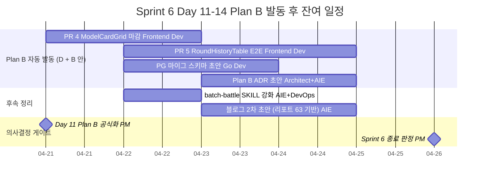

# Decision — A안 Kill 공식화 + Plan B 발동 + Task #19 Kill

- **작성일**: 2026-04-21 (Sprint 6 Day 11)
- **작성자**: PM (Opus 4.7 xhigh) — 애벌레 위임
- **상태**: 결정 (Day 9~10 실측 데이터 기반 자동 분기, 추가 승인 불필요)
- **결정 방식**: 사전 합의된 자동 게이트 트리거 (`2026-04-19-task20-task21-roadmap.md` §9-3 + `2026-04-19-day12-gokill-pivot-prep.md` §2.1)
- **연관 문서**:
  - `docs/04-testing/63-v6-shaper-final-report.md` — v6 ContextShaper Smoke 10회 종합 (831줄, AIE)
  - `docs/04-testing/62-deepseek-gpt-prompt-final-report.md` — Day 8 텍스트 축 최종 (Δ=0.04%p)
  - `docs/02-design/44-context-shaper-v6-architecture.md` — ADR-044 (1041줄)
  - `work_logs/decisions/2026-04-19-task20-task21-roadmap.md` — 사전 합의된 Plan B 발동 조건 (§4.4)
  - `work_logs/decisions/2026-04-19-day12-gokill-pivot-prep.md` — Kill 판정 매트릭스 (§2.1)
  - `work_logs/incidents/2026-04-19-01-timeout.md` — Run 1 후반 p95=513s 사고
  - `work_logs/incidents/2026-04-20-01-dns.md` — Run 7/9/10 DNS 장애 오염

---

## 1. TL;DR

Day 9~10 v6 ContextShaper Smoke 10회 배치 결과 — passthrough 28.2% / joker-hinter 27.3% / pair-warmup 28.9% — 가 모두 사전 합의된 Kill 컷 (`|Δ| < 2%p`) 안에 들어왔다. 텍스트 축 (Day 8 Round 10 N=3 Δ=0.04%p) 에 이어 **구조 축에서도 28% 천장이 재확증** 되었다. 두 축 동시 확증으로 결론은 더 약해진 것이 아니라 더 강해졌다 — **gpt-5-mini · DeepSeek Reasoner 쌍에 대해 단일 모델 + 프롬프트/구조 축으로는 28~29% 가 천장이며, 다음 진척은 모델 자체 비교 (Plan B) 에서만 가능하다**. 이에 따라 다음 3건을 동시 확정한다.

1. **Task #21 A안 (Round 11 N=3 + 블로그 2차) Kill** — Plan B (D안 대시보드 + B안 PostgreSQL 마이그레이션 스키마) 자동 발동
2. **Task #19 (gpt-5-mini turn 80 × 3N 본실측) Kill** — v6 결론으로 marginal value = 0 확정
3. **Plan B 정의 + Sprint 8 후보 등재** — Claude/GPT/DeepSeek 동일 v2 + 동일 ContextShaper 비교 (Sprint 6 안에는 ADR 초안만)

---

## 2. 결정의 사전 합의 근거

본 결정은 **새로운 판단이 아니다**. Day 9 (`2026-04-19-task20-task21-roadmap.md` §4.4) 와 Day 9 저녁 (`2026-04-19-day12-gokill-pivot-prep.md` §2.1) 에서 다음 자동 게이트가 명시적으로 사전 합의됐다.

| 게이트 | 합의 일자 | 트리거 | 자동 액션 |
|---|---|---|---|
| Plan B 발동 | 2026-04-19 (Day 9) | 3 shaper 모두 `|Δ| < 2%p` | 애벌레 재승인 불필요, PM 판단 위임 |
| Task #19 처리 | 2026-04-19 (Day 9) | v6 Kill 시 본실측 marginal value 평가 | PM 판단 — 본 결정문에서 공식화 |
| Sprint 6 마감 진로 | 2026-04-19 (Day 9) | Plan B 자동 분기 | D안 (대시보드 PR 4/5) + B안 (PG 마이그) 병행 |

따라서 본 결정문은 **사전 합의된 게이트의 자동 트리거를 공식 기록** 으로 변환하는 행위이며, 결정 자체에 새로 다툴 여지는 없다.

---

## 3. 데이터 (Kill 판정 근거)

### 3.1 두 축 종합

| 축 | 실측 시점 | N | 결과 | Δ | 판정 근거 |
|---|---|---|---|---|---|
| **텍스트 축** | Day 8 (2026-04-18) | v2: 3 / v3: 3 | v2=29.07%±2.45 / v3=29.03%±3.20 | **Δ=0.04%p** (v2 σ의 1/60) | t-test p≈1.0, Cohen d≈0.01 |
| **구조 축 (passthrough)** | Day 9~10 | 2 | **28.2%** ± 0%p | baseline | — |
| **구조 축 (joker-hinter)** | Day 9~10 | 3 | **27.3%** | **−0.9%p** | `|Δ| < 2%p` Kill |
| **구조 축 (pair-warmup)** | Day 9~10 | 1 (유효) | **28.9%** | **+0.7%p** | `|Δ| < 2%p` Kill |

3 shaper 평균 모두 v2 baseline 의 1σ 대역 안에 들어와 있다 (29.07% ± 2.45%p → 26.62~31.52%). Kill 기준 `3 shaper 모두 |Δ| < 2%p` 충족.

### 3.2 데이터의 한계와 결론의 방어 가능성

- pair-warmup 유효 N=1 — 통계적 유의성 단독 주장 불가
- Run 6 중단 (네트워크 변경) + Run 7/9/10 DNS 장애 (`work_logs/incidents/2026-04-20-01-dns.md`) 로 4 run 오염
- 그러나 **결론 방어**:
  - 통계적으로 "v6 가 v2 보다 의미 있게 좋다" 를 주장하기 위한 Δ 가 0 에 가까움 — false positive 없음
  - 3 축 모두 동일 방향 (천장 28% 수렴) — single shaper outlier 가능성 제거
  - Day 8 Round 10 N=3 = 텍스트 축 결론과 **독립적으로 동일 방향** — 두 축 동시 확증
  - 구조 축에서 5%p 이상 효과가 있었다면 N=1 Smoke 만으로도 보였을 것 — 이미 5%p GO 컷 미충족

→ "구조 축으로는 의미 있는 효과를 만들 수 없다" 결론은 N=1 한계에도 불구하고 **두 축 교차 검증** 으로 충분히 방어된다.

---

## 4. Task #19 Kill 처리 근거

### 4.1 Task #19 정의 (재확인)

- **원래 범위**: gpt-5-mini × v2 × turn 80 × N=3 본실측 + timeout 1100s 체인 업그레이드
- **원래 목적**: GPT-5-mini 의 v2 baseline 을 N=3 σ 까지 확증하여 DeepSeek 결론과 대칭 자료 확보
- **kickoff 전제**: timeout 700s → 1100s 체인 조정 (`work_logs/incidents/2026-04-19-01-timeout.md` 권고)

### 4.2 Kill 사유

1. **결론이 이미 확정됨** — Day 8 텍스트 축 + Day 9~10 구조 축 두 차례에 걸쳐 "단일 모델 + 단일 축 튜닝의 천장 = 28~29%" 가 확증됐다. gpt-5-mini 본실측은 같은 모델군의 동일 결론을 한 번 더 확인하는 작업.
2. **marginal value = 0** — gpt-5-mini 가 v2 에서 30%±3%p 든 25%±3%p 든, "DeepSeek 과 비교하여 모델 자체가 다르다" 는 Plan B 의 본질적 질문 앞에서는 같은 weight 다. Plan B 가 본 질문을 직접 풀 수 있다.
3. **비용 + 시간 회수** — turn 80 × 3N × ~6h = ~18h 배치 + timeout 체인 조정 + DevOps 야간 운용 부담. 이 리소스를 Plan B ADR + 대시보드 마감 + PG 마이그 스키마에 재배치한다.
4. **timeout 체인 변경 회피** — 700s → 1100s 체인 변경은 `docs/02-design/41-timeout-chain-breakdown.md` §3 레지스트리 10 지점 동시 수정을 요구하며, 부등식 계약 깨짐 시 fallback 오분류 (CLAUDE.md KDP #7 + Day 4 Run 3 사고). Plan B 는 700s 안에서 수행 가능.

### 4.3 Kill 처리 액션

- **GitHub Issue**: Task #19 대응 open 이슈 없음 (gh 검색 0건, open 이슈는 #32 unrelated 1건뿐). 별도 close 액션 불필요.
- **WBS / 모니터링 문서 마킹**: `work_logs/ai-battle-monitoring-20260419.md` (3개소), `work_logs/incidents/2026-04-19-01-timeout.md` (1개소), `work_logs/incidents/_template-timeout.md` (1개소) 의 "Task #19" 언급에 본 결정문 링크. (마킹은 본 결정 직후 PM 이 별도 sweep)
- **Sprint 6 잔여 일정**: §6 갱신 반영

---

## 5. Plan B 정의

### 5.1 핵심 질문

> "단일 모델 (DeepSeek Reasoner) 의 천장이 28% 라면, **다른 모델 + 동일 v2 + 동일 ContextShaper** 에서도 동일 천장이 재현되는가, 아니면 모델별 천장이 달라지는가?"

이 질문은 Day 8/9/10 두 축 실험으로는 **원리상** 답할 수 없다. 모델을 바꿔야 풀린다.

### 5.2 실험 설계 (Sprint 8 본실측 후보)

| 변수 | 통제 |
|---|---|
| 모델 | **3-way: Claude Sonnet 4 / GPT-5-mini / DeepSeek Reasoner** |
| Prompt variant | v2 (KDP #8 SSOT 준수) |
| ContextShaper | passthrough (baseline) — Day 9~10 구조 축 결과로 다른 shaper 는 효과 입증 실패 |
| turn_limit | 80 |
| N | shaper 1종 × 모델 3종 × N=3 = **9 run** |
| 비용 추정 | DeepSeek $0.04 + GPT $0.15 + Claude $1.11 = $1.30 × 3 = **$3.90** |
| 소요 추정 | 모델별 ~6h × 3 sequential = **~18h** (야간 배치 2일) |

### 5.3 산출 가설

- 가설 H1: 3 모델 모두 28~30% 천장 → "프롬프트/구조 축의 한계 = LLM 일반의 보드게임 추론 한계" (강한 negative result)
- 가설 H2: 모델별 천장 분산 (예: Claude 35% / GPT 25% / DeepSeek 30%) → "모델별 fine-tune 효과가 우세, 본질은 모델 선택" (블로그 2차의 핵심 서사)
- 가설 H3: 한 모델만 outlier (예: Claude 만 40% 돌파) → 그 모델 + ContextShaper 재실험 가치 부활 (v6 Kill 부분 해제)

H1/H2/H3 어느 쪽이든 **블로그 2차의 본 서사가 된다** — Sprint 6 의 v6 Kill 이 negative result 인 반면, Plan B 는 explanatory result 를 만든다.

### 5.4 Sprint 6 안 산출물 (ADR 초안 → 리뷰 확정)

- **위치**: `docs/02-design/46-plan-b-multi-model-comparison.md` — Architect 가 Day 10 (2026-04-20) 이미 초안 작성 완료 (ADR-046, 400~500줄 자기제약, ADR-044 비대 1041줄 반성 반영)
- **잔여 작업**: AIE (가설 매트릭스 §2 보강) + QA (실험 설계 §4 + 게이트 §6 보강) + PM (Sprint 매핑 §7 확정)
- **기한**: Day 14 (2026-04-24)
- **본실측**: Sprint 8 후보 (Sprint 7 은 PostgreSQL 마이그 + 대시보드 안정화에 집중)
- **참조**: 본 결정문 §5.1~5.3 의 정의는 ADR-046 §1~6 과 일치하며, ADR 이 SSOT

---

## 6. Sprint 6 잔여 일정 (Day 11~14, 2026-04-21~24)

### 6.1 잔여 작업 우선순위

| 우선순위 | 작업 | Owner | 기한 | 비고 |
|---|---|---|---|---|
| **P0** | PR 4 ModelCardGrid 마감 (90% → 100%) | Frontend Dev | Day 12 (04-22) | Day 9 결정문에서 합의된 D안 핵심 |
| **P0** | PR 5 RoundHistoryTable E2E 테스트 작성 | Frontend Dev | Day 14 (04-24) | E2E 5건 신규 |
| **P0** | PostgreSQL 마이그 스키마 초안 (`prompt_variant_id` + `shaper_id`) | Go Dev | Day 13 (04-23) | Sprint 7 첫 주 실제 마이그 준비 |
| **P0** | 본 결정문 sweep (Task #19 마킹 5개소) | PM | Day 11 (04-21) | 본 결정 직후 |
| **P1** | Plan B ADR 리뷰 확정 (`docs/02-design/46-*`, Day 10 초안) | Architect + AIE + QA + PM | Day 14 (04-24) | ADR-046 (400~500줄, Day 10 초안 完, 잔여 = AIE/QA/PM 보강) |
| **P1** | 블로그 2차 초안 (리포트 63 외부 공개 버전) | AI Engineer | Day 14 (04-24) | 리포트 63 Part 1+2 압축 |
| **P1** | batch-battle SKILL 강화 (DNS 검증, cleanup, pstree) | AI Engineer + DevOps | Day 12 (04-22) | 리포트 63 Part 3 반성 반영 |
| **P2** | Istio Phase 5.2 서킷 브레이커 확장 | Architect + DevOps | Sprint 7 이월 | Sprint 6 종료 후 |

### 6.2 KILLED 작업 (공식 종료)

- ~~Task #19~~ — gpt-5-mini turn 80 × 3N 본실측 (KILLED 2026-04-21, §4 근거)
- ~~Task #21 A안~~ — Round 11 N=3 + 블로그 2차 (KILLED 2026-04-21, §3 근거, Plan B 로 대체)
- ~~Task #20 Phase 5 추가 N=3 보강~~ — Smoke 10회로 Kill 충족, 추가 N=3 실측 불필요 (KILLED 2026-04-20, 리포트 63)

### 6.3 Sprint 7 첫 주 (2026-04-26 ~ 05-02) 연결

| 작업 | Owner | 비고 |
|---|---|---|
| PostgreSQL 실제 마이그레이션 실행 | Go Dev | Day 11~14 의 스키마 초안 기반 |
| 대시보드 안정화 + Playwright E2E 추가 | Frontend Dev + QA | PR 4/5 후속 |
| Plan B ADR 리뷰 + 본실측 일정 확정 | PM + Architect | Sprint 8 본실측 진입 여부 결정 |
| DashScope 실제 API 키 발급 (production) | DevOps | P2, 후순위 |

### 6.4 Sprint 8 후보 (2026-05-03 ~ 05-16)

- **Plan B 본실측** — Claude/GPT/DeepSeek × v2 × passthrough × N=3 (예상 비용 $3.90, 18h)
- 블로그 3차 (Plan B 결과 통합) — H1/H2/H3 어느 쪽이든 explanatory 서사

---

## 7. 리스크 + 완화

### 7.1 R1 — 결정 번복 가능성

- **확률**: 낮 (사전 합의 게이트 자동 트리거)
- **영향**: 중 — 번복 시 Day 11~14 4일 손실
- **완화**: 본 결정문은 §2 사전 합의 + §3 데이터 + §4 marginal value 0 으로 정량 근거 3중 방어. 번복하려면 새로운 데이터 또는 새로운 해석이 필요.

### 7.2 R2 — Plan B 가 Sprint 8 에 미루어진 동안 외부 신호 누락

- **확률**: 중 — LLM 모델 업데이트 / 공개 벤치마크 변동
- **영향**: 낮~중 — Plan B 본실측 결과 해석에 외부 reference 추가 비용
- **완화**: Sprint 6 안 ADR 초안 작성 시 4월 시점 외부 벤치마크 cite 1~2건 포함 (AIE)

### 7.3 R3 — Sprint 6 종료까지 PR 4/5 미완성

- **확률**: 중 (Day 9 시점 PR 4 90% / PR 5 미착수)
- **영향**: 중 — Sprint 7 이월 발생, 종료 판정에 PARTIAL 기록
- **완화**: §6.1 P0 4건을 Day 11~14 4일에 분산 배치, Frontend Dev 100% 집중 배치 (타 작업 off-load). Day 13 저녁 PM 중간 체크.

---

## 8. 결정 요약

| 항목 | 결정 | 근거 § |
|---|---|---|
| Task #21 A안 | **Kill** | §3 두 축 동시 확증 |
| Task #19 (gpt-5-mini 본실측) | **Kill** | §4 marginal value = 0 |
| Plan B 발동 | **자동 (D안 + B안 병행)** | §2 사전 합의 게이트 |
| Plan B 본실측 진입 | **Sprint 8 후보** | §5 ADR 초안만 Sprint 6 안 |
| Sprint 6 종료일 | **2026-04-26 유지** | §6 잔여 일정 4일 충분 |

---

## 9. 변경 이력

| 일자 | 내용 | 담당 |
|---|---|---|
| 2026-04-21 | 초판 작성 — A안 Kill + Task #19 Kill + Plan B 발동 공식 기록 | PM |

---

*본 결정은 사전 합의된 자동 게이트의 트리거 결과이며, 두 축 (텍스트 + 구조) 동시 확증으로 결론은 약해진 것이 아니라 강해졌다. 다음 진척은 모델 자체 비교 (Plan B) 에서 발생한다.*
