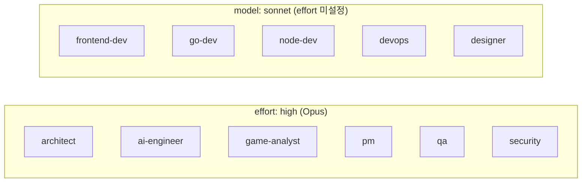

# ADR-062: 에이전트 Effort 파라미터 high 표준화

- **상태**: 확정
- **일자**: 2026-04-27
- **결정자**: 애벌레 (Owner)
- **근거 문서**: [Claude Code effort 파라미터 완전 가이드](https://k82022603.github.io/posts/claude-code-effort-%ED%8C%8C%EB%9D%BC%EB%AF%B8%ED%84%B0-%EC%99%84%EC%A0%84-%EA%B0%80%EC%9D%B4%EB%93%9C/)

---

## 배경

CLAUDE.md Agent Model Policy(2026-04-17 갱신)에서 추론·전략 에이전트 6개(architect, ai-engineer, game-analyst, pm, qa, security)의 목표를 "Opus 4.7 xhigh"로 명시했으나, 실제 `.claude/agents/*.md` frontmatter에는 `model: opus`만 설정되어 있었고 `effort` 필드는 누락되어 있었다.

Claude Code v2.1.117부터 에이전트 frontmatter에 `effort` 필드를 지원하며, 5단계(low / medium / high / xhigh / max)를 선택할 수 있다.

## 결정

**모든 Opus 에이전트 6개에 `effort: high`를 설정한다.**

`effort: xhigh`가 아닌 `effort: high`를 선택한 이유는 아래 분석에 기반한다.

## 선택지 비교

| 선택지 | 토큰 소비 (상대치) | 적합 대상 | 리스크 |
|--------|-------------------|----------|--------|
| **medium** | ~200 | 단순 수정, 오타, 조건문 변경 | 복잡한 분석에서 추론 부족 |
| **high (채택)** | ~400 | 단일 파일 분석, 기존 패턴 기능 추가, 일상 개발 | 없음 (Opus 4.7 API 기본값) |
| **xhigh** | ~650 | 여러 파일 리팩토링, 모듈 간 의존성, 에이전틱 루프 | 집중력 분산, 토큰 낭비 |
| **max** | ~1000 | 미해결 디버깅, 아키텍처 트레이드오프, 보안 감사 | 런어웨이 토큰, 비용 폭증 |

## 근거

### 실증 사례 (블로그 기반)

> "단순 작업에 과도한 사고 용량을 투입하면 집중력이 분산되고 토큰이 낭비되며 결과가 나빠질 수 있다."

블로그의 실측 사례에서 `effort: xhigh`로 설정된 에이전트가 요청된 작업 외의 불필요한 분석에 토큰을 소비하여 정작 핵심 수정이 지연되었고, `effort: medium`으로 낮추자 "해당 기능만 딱 수정이 완벽하게 진행"된 경험이 보고되었다.

### 에이전트별 업무 특성 분석

| 에이전트 | 주요 업무 | 복잡도 수준 |
|----------|----------|-----------|
| architect | 설계 문서 분석, ADR 작성, 구조 리뷰 | 단일~소수 파일 분석 → **high** 충분 |
| ai-engineer | 프롬프트 엔지니어링, 모델 비교, 룰-UX SSOT | 단일 도메인 분석 → **high** 충분 |
| game-analyst | 게임룰 열거, 행동 매트릭스, 상태 전이 | 정밀하지만 단일 도메인 → **high** 충분 |
| pm | 스프린트 계획, 진행률, 스크럼 | 조율 중심 → **high** (medium도 가능) |
| qa | 테스트 전략, RED spec 작성, E2E 검증 | 엣지 케이스 탐색 → **high** 충분 |
| security | 보안 리뷰, 취약점 분석, ADR | 분석 중심 → **high** 충분 |

6개 에이전트 모두 "여러 파일 간 리팩토링"이나 "복잡한 에이전틱 루프"를 수행하지 않으므로 xhigh가 필요하지 않다. 각 에이전트는 자신의 도메인 내에서 분석·문서화를 수행하며, 이는 high의 "거의 항상 사고 활성화" 수준으로 충분히 커버된다.

### 비용 최적화

- xhigh → high 전환 시 에이전트당 토큰 소비 약 **38% 절감** (~650 → ~400)
- 하루 평균 15회 dispatch 기준, 일일 절감량 유의미

## 적용 범위

Sonnet 에이전트 5개는 `effort` 미설정 (모델 기본값 사용). Opus 에이전트 6개만 `effort: high` 명시.

## 변경 파일

| 파일 | 변경 |
|------|------|
| `.claude/agents/architect-agent.md` | `effort: high` 추가 |
| `.claude/agents/ai-engineer-agent.md` | `effort: high` 추가 |
| `.claude/agents/game-analyst-agent.md` | `effort: high` 추가 |
| `.claude/agents/pm-agent.md` | `effort: high` 추가 |
| `.claude/agents/qa-agent.md` | `effort: high` 추가 |
| `.claude/agents/security-agent.md` | `effort: high` 추가 |
| `CLAUDE.md` Agent Model Policy | "Opus 4.7 xhigh" → "Opus + effort: high" 갱신 필요 |

## 예외 정책

특정 작업에서 higher effort가 필요하면, dispatch 시점에 `model` 파라미터로 override하거나 별도 에이전트 정의를 생성한다. frontmatter 기본값은 high로 유지한다.

## 이력

| 일자 | 변경 | 사유 |
|------|------|------|
| 2026-03-30 | 전 에이전트 sonnet → opus 승격 | 추론 품질 향상 |
| 2026-04-17 | 구현 5개 opus → sonnet 다운시프트 | 비용 최적화 |
| **2026-04-27** | **Opus 6개 effort: high 명시** | **블로그 실증 + 토큰 절감** |
