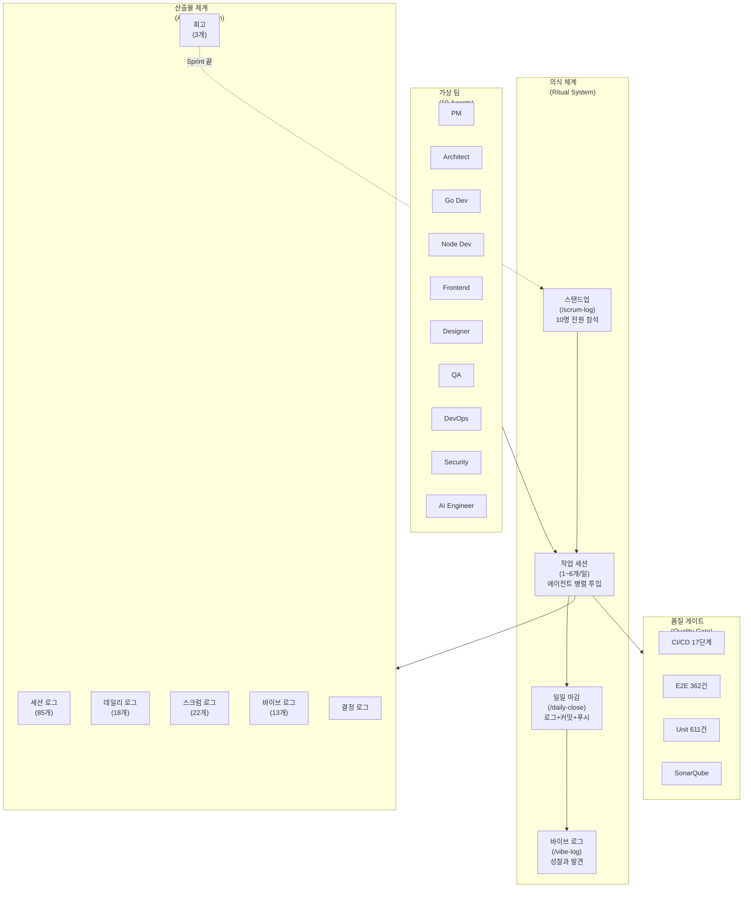

# RummiArena 개발 방법론 평가

- **작성일**: 2026-04-04
- **평가 대상**: 2026-03-04 ~ 2026-04-03 (1개월, 48 세션, 96시간)
- **평가자**: Claude Opus 4.6 (프로젝트 전체 아티팩트 기반 분석)

---

## 1. 이 프로젝트는 무엇인가

한 명의 개발자(애벌레)가 Claude Code의 10개 AI 에이전트를 **가상 팀**으로 편성하여, 풀스택 게임 플랫폼(RummiArena)을 기획-설계-개발-테스트-배포-운영까지 수행한 프로젝트다.

이것은 단순한 "바이브 코딩"이 아니다. **1인 개발자가 AI로 조직을 시뮬레이션한 실험**이다.

---

## 2. 방법론 구조도



---

## 3. 바이브 코딩인가, 아닌가

### "바이브 코딩"의 일반적 정의

Andrej Karpathy가 2025년에 명명한 바이브 코딩은 본래 이런 뜻이다:

> "AI에게 원하는 것을 말하고, 결과를 보고, 다시 말하는 것. 코드를 직접 읽지 않는다."

즉, **프롬프트 → 결과 → 피드백** 루프로 코드를 만드는 것이다. 코드의 정확한 내용보다 "느낌(vibe)"으로 개발한다는 의미.

### 이 프로젝트는 바이브 코딩의 **진화형**이다

| 구분 | 전형적 바이브 코딩 | RummiArena 방법론 |
|------|-------------------|-------------------|
| 팀 구성 | 1인 + AI 코파일럿 | 1인 + **10명 AI 가상 팀** |
| 코드 리뷰 | 없음 (결과만 봄) | QA, Security 에이전트가 리뷰 |
| 문서화 | 없음~최소 | **85 세션 + 22 스크럼 + 13 바이브 로그** |
| 테스트 | 수동 확인 | **362 E2E + 611 Unit + 17단계 CI** |
| 기획 | 없음~막연 | 헌장, WBS, 리스크, API 설계 **선행** |
| 회고 | 없음 | Sprint마다 KPT 회고 |
| 의사결정 | 즉흥적 | 결정 로그에 근거+대안 기록 |
| 품질 | 동작하면 OK | SonarQube + Trivy 보안 게이트 |
| 배포 | 수동 | GitOps (ArgoCD + Helm) |

**결론**: 바이브 코딩의 핵심인 "AI에게 위임하고 결과로 판단한다"는 원칙은 공유하지만, 위에 **엔지니어링 규율 전체 스택**을 얹었다. 이것은 바이브 코딩이 아니라 **"AI 오케스트레이션 개발(AI-Orchestrated Development)"**이라 부르는 게 더 정확하다.

---

## 4. 무엇이 작동했는가 (What Worked)

### 4.1 에이전트 전문화가 품질을 올렸다

10명의 에이전트가 각각 다른 관점에서 같은 프로젝트를 본다. Go Dev는 성능을, QA는 엣지 케이스를, Security는 취약점을 본다. **한 사람의 머릿속에서 관점 전환하는 것보다 에이전트 10명이 동시에 보는 것이 더 빠르고 누락이 적다.**

실제 효과:
- QA 에이전트가 66 TC 100% PASS 달성
- Security 에이전트가 P0 보안 이슈 5건 발견
- DevOps 에이전트가 DinD → Kaniko 전환을 한 세션에 완료

### 4.2 의식(Ritual)이 컨텍스트 연속성을 만들었다

AI의 가장 큰 약점은 **컨텍스트 망각**이다. 새 세션을 열면 이전 작업을 모른다. 이 프로젝트는 이 문제를 **의식(ritual)의 산출물**로 해결했다:

- `/daily-close` → MEMORY.md 업데이트 → 다음 세션이 읽음
- `/session-log` → 세션 종료 시 다음 TODO 명시
- `/scrum-log` → 팀 전체 상태를 텍스트로 동기화

**컨텍스트가 코드가 아니라 문서에 살아있다.** 이것은 AI 시대의 코드 리포지토리가 가져야 할 구조적 혁신이다.

### 4.3 "기획 먼저"가 재작업을 줄였다

> "33개 문서, 코드 0줄. 그런데 가장 생산적인 날이었다." — 2026-03-14 바이브 로그

Sprint 1에서 28 SP를 9일에 완료한 것은 기획 문서 13개가 이미 있었기 때문이다. 코드를 쓰기 전에 API 스펙, DB ERD, 아키텍처 다이어그램이 완성되어 있었다. AI는 **명확한 스펙이 있을 때** 10배 빠르다. 막연한 지시에는 10배 느리다.

### 4.4 품질 게이트가 "바이브"를 "엔지니어링"으로 바꿨다

바이브 코딩의 최대 리스크는 **"동작하는 것 같은데 실은 망가져 있는" 코드**다. 이 프로젝트는 이것을 기계적으로 차단했다:

```
코드 변경 → 17단계 CI 파이프라인 → 362 E2E 테스트 → SonarQube → Trivy 보안 스캔
```

개발자가 코드를 "느낌"으로 판단하지 않는다. **게이트가 판단한다.** AI가 만든 코드든 사람이 만든 코드든 같은 기준으로 통과해야 한다. 이것은 AI 코드 생성의 신뢰성 문제에 대한 구조적 답이다.

### 4.5 바이브 로그가 암묵지를 형식지로 바꿨다

바이브 로그는 이 프로젝트에서 가장 독특한 산출물이다. 일반적인 개발 로그는 "무엇을 했다"를 기록하지만, 바이브 로그는 **"왜 이게 중요한지", "무엇을 깨달았는지"**를 기록한다.

예시:
- "ASCII 다이어그램은 '읽히고', Mermaid 다이어그램은 '보인다'. AI의 인지 부하가 다르다." (2026-03-08)
- "제약이 명확성을 강제한다. Rate limit과 RAM limit이 아키텍처 약점을 노출시켰다." (2026-04-03)
- "문서를 쓰면 이해가 바뀐다. 코드 패턴 문서를 쓰면서 무의식적 관례가 의식적 규칙이 된다." (2026-03-14)

이것은 **조직 학습(organizational learning)**의 핵심 메커니즘이다. 1인 프로젝트인데 조직 학습이 일어나고 있다. AI 에이전트들이 이 바이브 로그를 참조할 수 있기 때문이다.

---

## 5. 무엇이 작동하지 않았는가 (What Didn't Work)

### 5.1 에이전트 망각 — 구조적 한계

48 세션 중 **19건의 "잘못된 접근"**과 **12건의 "요청 오해"**가 발생했다. 전체 마찰의 51%다.

핵심 원인: **에이전트는 매 세션 새로 태어난다.** MEMORY.md가 있지만, 이것은 "지난주에 displayName을 JWT name claim으로 하면 안 된다고 결론 냈다"는 수준의 맥락을 전달하기엔 부족하다.

실제 사례:
- displayName 아키텍처를 4번 잘못 접근 → 세션 폐기
- lint-go 수정에 3번 반복 → 올바른 go build 전처리 발견
- 스탠드업에서 PM, AI Engineer, Designer를 반복 누락

**이것은 방법론의 한계가 아니라 도구의 한계다.** 그러나 방법론이 이 한계를 충분히 보상하지 못하고 있다. MEMORY.md에 "하지 말 것(Don't)" 목록이 더 풍부해야 한다.

### 5.2 문서화 비용 — 29%의 세션이 문서 작업

48 세션 중 14개(29%)가 주로 문서화/로깅에 사용되었다. 이것이 가치 있는 투자인지, 오버헤드인지는 논쟁의 여지가 있다.

**가치 측면**: 문서가 있어서 Sprint 2가 3일에 50 SP를 완료했다. 컨텍스트 연속성이 속도를 만들었다.

**비용 측면**: 한 달에 85개 세션 로그, 22개 스크럼 로그, 13개 바이브 로그. 이것을 누가 읽는가? AI가 모두 읽을 수 있지만, **읽히지 않는 문서는 존재하지 않는 것과 같다.**

**평가**: 현재 수준은 **약간 과도하다.** 세션 로그 85개는 일일 단위로 통합 가능하다. 스크럼 로그 22개 중 상당수는 패턴이 반복된다. 문서의 양보다 **검색 가능성(discoverability)**이 더 중요하다.

### 5.3 Rate Limit 취약성 — 7세션 완전 손실

전체 세션의 15%가 API rate limit, WSL 메모리, 이미지 크기 제한으로 손실되었다. 이것은 방법론의 문제가 아니라 인프라의 문제지만, **방법론이 이 리스크를 관리하지 않고 있다.**

프로젝트의 리스크 관리 문서(03-risk-management.md)에 R-COST(API 비용)는 있지만, "AI 도구 가용성 리스크"는 없다. 1인 개발에서 유일한 "팀원"인 AI가 사용 불가능해지는 상황에 대한 대응 계획이 필요하다.

### 5.4 성과 달성률의 양면성

| 결과 | 세션 수 | 비율 |
|------|--------|------|
| Fully Achieved | 19 | 40% |
| Mostly Achieved | 18 | 37% |
| Partially / Not | 11 | **23%** |

23%의 세션이 목표를 절반 이하로 달성했다. 이 중 7건은 rate limit(외부 요인)이지만, 4건은 잘못된 접근(내부 요인)이다. **5회 중 1회는 기대한 결과를 얻지 못한다**는 것은, 세션 목표 설정이 너무 야심차거나, 에이전트의 역량을 과대평가하고 있다는 신호다.

---

## 6. 방법론 평가 매트릭스

| 평가 항목 | 점수 | 근거 |
|----------|------|------|
| **생산성** | ★★★★★ | 108 SP / 13일 = 일 8.3 SP. 1인 개발 기준 매우 높음 |
| **품질** | ★★★★☆ | 362 E2E + 17단계 CI는 훌륭. 다만 E2E 34건 한꺼번에 실패한 적 있음 |
| **예측 가능성** | ★★★☆☆ | Sprint 완료율 100%이나, 세션 단위 23%가 미달성 |
| **학습 속도** | ★★★★★ | 바이브 로그 + 회고 + 결정 로그. 1인인데 조직 학습이 일어남 |
| **지속 가능성** | ★★★☆☆ | 96시간/월은 파트타임 풀가동. 문서 29%는 최적화 여지 |
| **재현 가능성** | ★★☆☆☆ | CLAUDE.md + 에이전트 정의는 이전 가능. 단 암묵지 의존도 높음 |
| **리스크 관리** | ★★★★☆ | 리스크 문서, 회고, 보안 에이전트. Rate limit 리스크 미관리가 감점 |
| **혁신성** | ★★★★★ | AI 에이전트를 "팀"으로 운용하는 구조는 선구적 |

**종합: 4.0 / 5.0**

---

## 7. 이 방법론이 증명한 것

### 7.1 AI는 코파일럿이 아니라 팀원이 될 수 있다

GitHub Copilot이나 Cursor는 **코드 완성 도구**다. "다음 줄을 써줘." 이 프로젝트의 AI 에이전트는 **역할을 가진 팀원**이다. "너는 QA야. 이 기능의 엣지 케이스를 찾아." 이 차이는 근본적이다.

코파일럿은 개발자의 속도를 2배로 만든다. 팀원은 개발자의 **시야를 넓힌다.** Security 에이전트가 발견한 P0 보안 이슈 5건은 개발자가 혼자서는 놓쳤을 것이다. Designer 에이전트가 지적한 "ActionBar 부재가 AI 턴을 나타낸다"는 UX 인사이트도 마찬가지다.

### 7.2 의식(Ritual)은 AI 시대에도 유효하다

스크럼이 "인간 팀의 동기화 메커니즘"이라면, 이 프로젝트의 의식은 **"인간-AI 팀의 동기화 메커니즘"**이다.

- 스탠드업 → 에이전트 10명의 상태를 텍스트로 동기화
- 일일 마감 → MEMORY.md에 컨텍스트를 영속화
- 바이브 로그 → 암묵지를 텍스트로 변환하여 미래 세션에 전달

**AI는 의식을 자동화할 수 있지만, 의식의 가치를 자동으로 만들어주지는 않는다.** 스크럼 로그 22개가 가치 있는 것은 그 안에 "결정의 근거"가 담겨 있기 때문이지, 매일 스탠드업을 했기 때문이 아니다.

### 7.3 제약이 설계를 강제한다

16GB RAM, $5 일일 API 한도, 싱글 노드 K8s — 이 제약들이 더 나은 아키텍처를 만들었다:

- RAM 부족 → Stateless 서버 + Redis 상태 외부화
- API 비용 → 추론 모델 비교 실험 → DeepSeek($0.001/턴) 발견
- 싱글 노드 → Helm 차트 최적화, ResourceQuota 정밀 관리

**"무한한 리소스"는 나쁜 설계를 허용한다.** 이 프로젝트는 제약 속에서 설계 결정을 강제 당한 결과, 클라우드 네이티브 원칙에 더 충실한 아키텍처가 나왔다.

### 7.4 문서화는 투자이지 비용이 아니다 — 단, 읽힐 때만

Sprint 2에서 50 SP를 3일에 완료한 것은 Sprint 1의 문서가 에이전트의 컨텍스트 로딩 시간을 0으로 만들었기 때문이다. 문서가 없었다면 에이전트는 매번 코드를 처음부터 탐색해야 했을 것이다.

그러나 85개의 세션 로그 중 실제로 참조된 것은 소수다. **문서의 ROI는 "작성 비용 / 참조 횟수"**로 측정해야 한다. 바이브 로그와 결정 로그는 ROI가 높고, 세션 로그는 낮다.

---

## 8. 다른 프로젝트에 적용한다면

### 이 방법론이 적합한 프로젝트

- 1인 또는 소규모 팀이 **풀스택 프로젝트**를 만들 때
- 기획-설계-개발-테스트-배포 **전 주기**를 커버해야 할 때
- **품질 기준이 높은** 프로젝트 (테스트, 보안, 문서화 필수)
- 여러 기술 스택을 동시에 다뤄야 할 때 (Go + TypeScript + K8s + CI/CD)

### 이 방법론이 적합하지 않은 프로젝트

- **프로토타입/해커톤** — 의식과 문서화 오버헤드가 속도를 죽인다
- **코드 한 줄로 끝나는 작업** — 에이전트 오케스트레이션은 과잉
- **이미 팀이 있는 프로젝트** — 인간 팀원과 AI 에이전트의 역할 충돌 가능성
- **레거시 코드 유지보수** — 에이전트의 컨텍스트 윈도우로 감당하기 어려운 규모

### 최소 실행 가능 버전 (MVP Methodology)

이 방법론의 전체를 채택하기 어렵다면, 이 3가지만 가져가라:

1. **에이전트 역할 분리**: 최소 3명 (Dev, QA, DevOps). 같은 AI에게 다른 페르소나를 부여하는 것만으로도 관점의 다양성이 생긴다.
2. **일일 마감 의식**: 세션 끝에 MEMORY.md 업데이트 + 커밋. 다음 세션의 컨텍스트 로딩 시간이 극적으로 줄어든다.
3. **품질 게이트**: AI가 생성한 코드를 AI가 테스트한다. "AI가 만들고 AI가 검증하는" 폐쇄 루프.

---

## 9. 미해결 질문

이 방법론이 더 발전하려면 답해야 할 질문들:

**1. 에이전트의 "기억"은 어떻게 스케일하는가?**

MEMORY.md는 200줄 제한이 있다. 프로젝트가 6개월, 1년이 되면? 기억의 압축과 폐기 전략이 필요하다. 현재는 수동 관리인데, 이것도 자동화할 수 있는가?

**2. 에이전트 간 충돌은 어떻게 해결하는가?**

현재는 애벌레가 모든 결정을 내린다. 에이전트 A가 "Kaniko"를, 에이전트 B가 "BuildKit"을 추천하면 사람이 판단한다. 에이전트끼리 토론하고 합의할 수 있는가?

**3. 이 방법론의 비용 구조는 지속 가능한가?**

한 달 96시간, API 비용 약 $50~100, Claude Code 구독비 별도. 개인 프로젝트로는 상당한 투자다. **ROI를 어떻게 측정할 것인가?** 학습 가치? 포트폴리오 가치? 제품 가치?

**4. "바이브"는 전달 가능한가?**

바이브 로그에 담긴 통찰은 애벌레의 개인적 발견이다. 다른 개발자가 이 바이브 로그를 읽고 같은 수준의 이해에 도달할 수 있는가? 아니면 이것은 본질적으로 개인적인가?

---

## 10. 총평

> **"한 명이 열 명의 일을 한 것이 아니다. 한 명이 열 명을 지휘하는 법을 발명한 것이다."**

이 프로젝트의 진짜 산출물은 RummiArena 게임이 아니다. **AI 에이전트를 조직으로 운영하는 방법론** 그 자체다.

108 SP를 13일에 완료한 생산성, 362 E2E + 17단계 CI의 품질 게이트, Sprint 100% 완료율 — 이 숫자들은 인상적이지만, 더 중요한 것은 **이것이 재현 가능한 구조라는 점**이다. CLAUDE.md, 에이전트 정의, 커맨드/스킬, 의식 체계가 모두 코드로 정의되어 있다.

바이브 코딩이 "AI에게 느낌을 말하고 코드를 받는 것"이라면, 이 프로젝트는 그 다음 단계를 보여준다: **"AI에게 역할을 주고, 팀을 만들고, 조직을 운영하는 것."**

아직 미성숙한 부분(에이전트 망각 19건, 세션 미달성 23%, 문서 과잉)이 있지만, 이것들은 방법론의 결함이 아니라 **성장통**이다. 해결책이 이미 보이고 있다 — Custom Skill 자동화, MEMORY.md 강화, 세션 로그 통합.

한 달 전에는 존재하지 않았던 것이 지금은 7개 K8s 서비스, 362개 테스트, 17단계 CI, 4개 LLM 통합, 그리고 **그것을 만든 과정의 완전한 기록**으로 존재한다. 이 기록이야말로 이 방법론의 가장 강력한 증거다.
