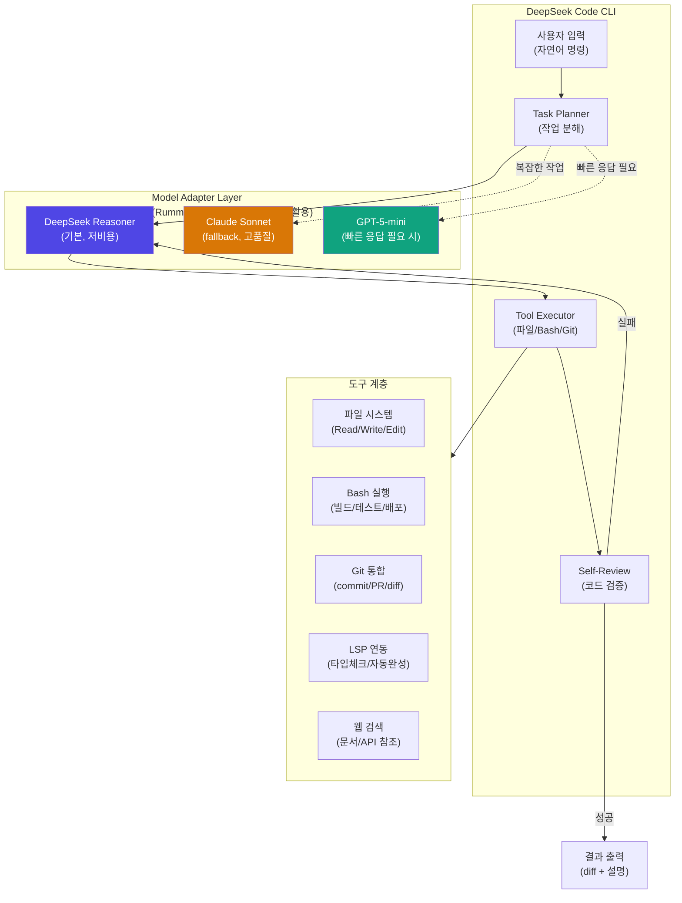
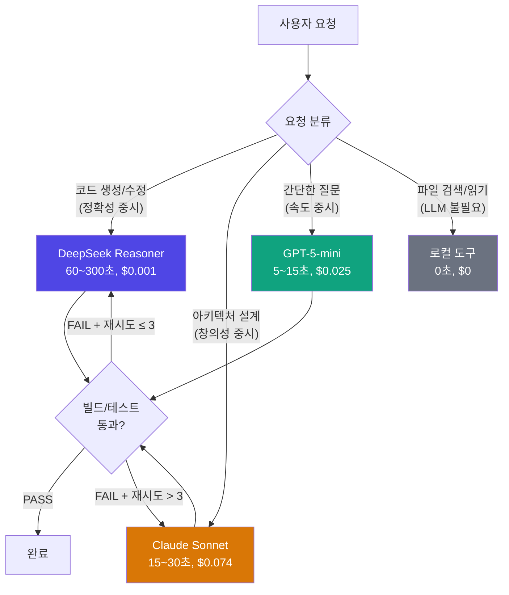

# 다음 프로젝트 구상 — DeepSeek Code (터미널 코딩 에이전트)

- **구상일**: 2026-04-16 (Sprint 6 Day 5, 점심 떡볶이 후)
- **기원**: RummiArena Round 6~7 에서 DeepSeek Reasoner 의 성능 특성을 실측하면서 "이 모델로 코딩 에이전트를 만들면 어떨까?" 라는 자연스러운 발상
- **상태**: 아이디어 단계 (RummiArena Sprint 6~7 완료 후 착수)

---

## 1. 왜 DeepSeek Code 인가

### 1.1 RummiArena 에서 배운 것

Sprint 6 Day 4~5 (2026-04-15~16) 의 12시간 마라톤 세션에서 밝혀진 사실들:

| 발견 | 근거 | 함의 |
|------|------|------|
| **DeepSeek Reasoner 의 비용 효율** | Claude $0.074/turn vs DeepSeek $0.001/turn (**74배** 차이) | 동일 예산으로 74배 더 많은 추론 가능 |
| **"Don't tell a reasoner to think harder"** | v4 Thinking Budget 지시 추가 시 latency +60%, place rate -4.85%p regression. 제거(v4.1) 시 latency -60% 즉시 복귀 | 추론 모델은 자체 CoT 최적화가 있으므로 **외부 지시로 간섭하면 역효과**. 프롬프트는 최소화 |
| **충분한 시간 → 최고 품질** | verify fixture 에서 v4 tiles=7.00 > v2 6.33 (시간 제약 없을 때 v4 가 최고) | DeepSeek 에게 시간을 주면 **품질이 올라감**. 코딩에서도 "빠른 응답" 보다 "정확한 코드" 가 가치 |
| **Deterministic consistency** | Phase 2 Run 1, Run 2 가 Place 10/Tiles 34 로 완전 동일 | 같은 프롬프트 → 일관된 품질. 코딩 에이전트에서 **재현 가능한 출력** 이 중요 |
| **추론 모델 간 행동 차이** | GPT-5-mini: V4_IGNORED (reasoning tokens -25%). DeepSeek: reasoning 확장 (+17%). Claude: Extended Thinking 별도 경로 | 모델마다 **추론 메커니즘이 전혀 다름** → 단일 프롬프트 = 단일 동작이 아님 |

### 1.2 시장 분석 — 코딩 에이전트 지형 (2026-04 기준)

| 제품 | 기반 모델 | 특징 | 비용 모델 |
|------|----------|------|----------|
| **Claude Code** (Anthropic) | Claude Opus/Sonnet | 터미널 CLI, 파일 편집, Bash 실행, MCP 연동 | 구독 (Pro/Max) 또는 API |
| **Codex CLI** (OpenAI) | GPT-5 계열 + Codex | 터미널 CLI, sandbox 실행, multi-turn | API pay-per-use |
| **Cursor** | Claude/GPT 스위칭 | IDE 통합, 파일 컨텍스트, Tab completion | 구독 |
| **GitHub Copilot** | GPT-4o + Codex | IDE 통합, PR 리뷰, CLI (공개 예정) | 구독 |
| **Aider** (오픈소스) | 다양 (Claude, GPT, DeepSeek 등) | 터미널 CLI, git 통합, 오픈소스 | 사용자 API 키 |
| **없음 (DeepSeek 전용)** | DeepSeek Reasoner | **존재하지 않음** | - |

**기회**: DeepSeek Reasoner 를 기반으로 한 **전용 코딩 에이전트가 없다**. 비용 효율 74x + 추론 품질 (시간 허용 시 최고) 의 조합은 독특한 가치 제안.

### 1.3 DeepSeek Code 의 차별화

핵심 차별점:
1. **"Think slow, code right"** — 빠른 응답 대신 **정확한 코드** 에 집중. 60~300초 기다리되 버그 없는 코드
2. **비용 1/74** — 개인 개발자/학생도 부담 없이 사용 가능
3. **추론 과정 실시간 스트리밍** — DeepSeek 의 `reasoning_content` 를 터미널에 실시간 표시. "AI 가 어떻게 생각하는지" 투명하게 보여줌
4. **최소 프롬프트 원칙** — RummiArena 에서 증명한 "추론 모델에게 생각하라고 말하지 마라" 원칙 적용. 시스템 프롬프트 최소화

---

## 2. 아키텍처 초안

### 2.1 전체 구조

### 2.2 핵심 설계 원칙 (RummiArena 에서 이전)

| 원칙 | RummiArena 근거 | DeepSeek Code 적용 |
|------|----------------|-------------------|
| **모델 신뢰 금지** | LLM 응답은 Game Engine 검증 | 생성된 코드는 반드시 **빌드/테스트/타입체크** 로 검증 |
| **Adapter 분리** | 5개 LLM 공통 인터페이스 | DeepSeek 기본 + Claude/GPT fallback 멀티모델 |
| **최소 프롬프트** | v4 → v4.1 Thinking Budget 제거 교훈 | 시스템 프롬프트 최소화, 모델 자율 추론 존중 |
| **Stateless 서버** | Redis 게임 상태 | 세션 상태는 파일 시스템 (git worktree) |
| **SSOT 문서** | 41 (timeout) + 42 (variant) | 설정/프롬프트/도구 정의 모두 단일 문서 |

### 2.3 모델 라우팅 전략

**핵심**: 대부분의 요청은 **DeepSeek (저비용)** 로 처리하고, 실패 시에만 **Claude (고비용 fallback)** 로 에스컬레이션. RummiArena 의 "maxRetries 3회 → fallback 드로우" 패턴과 동일 구조.

---

## 3. 기술 스택 (잠정)

| 계층 | 기술 | 근거 |
|------|------|------|
| **CLI 프레임워크** | Node.js + TypeScript (또는 Rust) | RummiArena ai-adapter 코드베이스 재활용 가능 (NestJS/TS). Rust 는 배포 용이성 |
| **터미널 UI** | Ink (React for CLI) 또는 blessed | 실시간 reasoning 스트리밍 + 진행 상태 표시 |
| **LLM 통신** | OpenAI-compatible API (DeepSeek, Claude, GPT 모두 호환) | ai-adapter 패턴 재활용, 어댑터별 분리 |
| **도구 실행** | 자체 sandbox (Docker 또는 nsjail) | Claude Code 의 sandbox 참조, 안전한 Bash 실행 |
| **파일 편집** | unified diff 기반 Edit 도구 | Claude Code 의 Edit 도구 UX 참조 |
| **Git 통합** | simple-git (Node) 또는 libgit2 (Rust) | 자동 커밋, PR 생성, diff 기반 리뷰 |
| **컨텍스트 관리** | 파일 트리 + grep 기반 (ripgrep) | 전체 코드베이스 인덱싱 없이 on-demand 검색 |
| **설정** | YAML/JSON 설정 파일 + 환경변수 | Claude Code 의 settings.json 구조 참조 |

### 3.1 왜 TypeScript (NestJS 아님)

- RummiArena 의 ai-adapter 는 NestJS 기반이지만, CLI 에이전트에 NestJS 는 과도
- **standalone TypeScript** + minimal framework (Commander.js 등) 이 적합
- ai-adapter 의 핵심 코드 (어댑터 패턴, 프롬프트 빌더, 응답 파서) 는 **라이브러리로 추출** 가능
- 또는 Rust 로 작성하면 단일 바이너리 배포 가능 (설치 간편)

### 3.2 DeepSeek API 특성 활용

| DeepSeek 특성 | 코딩 에이전트 활용 |
|--------------|------------------|
| `reasoning_content` 필드 (사고 과정 노출) | 터미널에 **실시간 스트리밍** — "AI 가 지금 무엇을 생각하는지" 표시 |
| 긴 reasoning (60~300초) | "thinking..." 상태 UI + 예상 소요 시간 표시 |
| 저비용 ($0.14/1M input, $0.28/1M output) | **무제한 재시도** 가능 — 코드 생성 실패 시 비용 부담 없이 반복 |
| JSON 구조 응답 (훈련됨) | 도구 호출 (function calling) 안정적 |
| max_tokens 16384 | 긴 코드 파일 생성 가능 |

---

## 4. MVP 로드맵 (잠정)

### Phase 0: 준비 (RummiArena 완료 후 1주)
- [ ] ai-adapter 핵심 코드 라이브러리 추출 (어댑터 패턴, 프롬프트 빌더, 응답 파서)
- [ ] DeepSeek Code 레포지토리 생성
- [ ] CLI 프레임워크 선정 (TypeScript vs Rust 결정)
- [ ] DeepSeek API 키 관리 방안 (환경변수 / keychain)

### Phase 1: 기본 REPL (2주)
- [ ] 터미널 REPL 인터페이스 (입력 → DeepSeek 호출 → 출력)
- [ ] 파일 Read/Write/Edit 도구
- [ ] Bash 명령 실행 (sandbox 없이, 신뢰 모드)
- [ ] `reasoning_content` 실시간 스트리밍 표시
- [ ] 기본 시스템 프롬프트 (최소화 원칙)

### Phase 2: 도구 확장 (2주)
- [ ] Git 통합 (commit, diff, PR 생성)
- [ ] 코드 검색 (ripgrep 기반 Grep 도구)
- [ ] 파일 탐색 (glob 패턴 Glob 도구)
- [ ] 빌드/테스트 자동 실행 (PostToolUse 훅 패턴)
- [ ] 멀티모델 라우팅 (DeepSeek 기본 → Claude fallback)

### Phase 3: 품질 강화 (2주)
- [ ] Sandbox 실행 환경 (Docker 기반)
- [ ] Self-review 루프 (생성 → 빌드 → 테스트 → 재시도)
- [ ] 컨텍스트 윈도우 관리 (자동 compaction)
- [ ] 설정 파일 (settings.json 구조)
- [ ] 플러그인/MCP 서버 연동

### Phase 4: 배포 (1주)
- [ ] npm 패키지 배포 (`npx deepseek-code`)
- [ ] 또는 단일 바이너리 배포 (Rust 의 경우)
- [ ] README + 설치 가이드
- [ ] 데모 비디오

**총 예상: 7~8주** (RummiArena 완료 후)

---

## 5. 예상 비용 구조

### 5.1 개발 비용
- DeepSeek API: $5~10 (개발 + 테스트, 극저비용)
- Claude API: $20~30 (fallback 테스트, 비교 벤치마크)
- 인프라: $0 (로컬 개발, 배포는 npm/GitHub)

### 5.2 사용자 비용 (DeepSeek Code 운영 시)

| 사용 패턴 | 예상 비용 | Claude Code 대비 |
|----------|----------|----------------|
| 가벼운 사용 (하루 50 요청) | **~$0.05/일** | 74x 저렴 |
| 중간 사용 (하루 200 요청) | **~$0.20/일** | 74x 저렴 |
| 헤비 사용 (하루 500 요청) | **~$0.50/일** | 74x 저렴 |
| 월간 헤비 | **~$15/월** | Claude Code Max $100/월 대비 85% 절감 |

---

## 6. 리스크 및 고려사항

| 리스크 | 영향 | 완화 |
|--------|------|------|
| DeepSeek 응답 속도 (60~300초) | 사용자 경험 저하 | reasoning 스트리밍 UI + "생각 중..." 상태 표시 + 간단한 요청은 GPT 로 라우팅 |
| DeepSeek API 안정성 (중국 서버) | 간헐적 연결 실패 | Claude/GPT fallback + 재시도 로직 (RummiArena maxRetries 패턴) |
| 코드 품질 vs Claude/GPT | DeepSeek 이 코딩에서 Claude 만큼 좋은지 미검증 | MVP Phase 1 에서 벤치마크 (HumanEval, SWE-bench 등) |
| 보안 (Bash 실행) | 악의적 코드 실행 | Sandbox 필수 (Phase 3), 초기에는 신뢰 모드 + 확인 프롬프트 |
| DeepSeek API TOS 변경 | 서비스 중단 가능성 | 멀티모델 아키텍처로 단일 모델 의존 제거 |

---

## 7. RummiArena 에서 가져갈 자산

| 자산 | 파일/위치 | 재사용 방법 |
|------|----------|-----------|
| **어댑터 패턴** | `src/ai-adapter/src/adapter/*.adapter.ts` | DeepSeek/Claude/GPT 통합 인터페이스 |
| **프롬프트 레지스트리** | `src/ai-adapter/src/prompt/registry/` | 코딩 프롬프트 버저닝 + A/B 테스트 |
| **비용 추적** | `src/ai-adapter/src/cost/` | 사용량 모니터링 + 일일 한도 |
| **응답 파서** | `src/ai-adapter/src/adapter/deepseek.adapter.ts` | `reasoning_content` 추출, JSON 수리 |
| **empirical 검증 스크립트** | `src/ai-adapter/scripts/verify-*.ts` | 프롬프트 변형 A/B 테스트 자동화 |
| **batch-battle SKILL** | `.claude/skills/batch-battle/` | 벤치마크 배치 실행 + 모니터링 패턴 |
| **SSOT 문서 패턴** | `docs/02-design/41, 42` | 설정/프롬프트/도구 정의 단일 진실 소스 |

---

## 8. 영감의 순간

> 2026-04-16 점심, 떡볶이를 먹으면서 애벌레가 말했다.
> "이번 프로젝트 끝나고, 모델은 DeepSeek를 사용하는 Claude Code와 유사한 DeepSeek Code 만드는 프로젝트 하자...터미널 코드도 만들어보고...재미있을 듯..."
>
> 12시간 마라톤 세션에서 DeepSeek Reasoner 의 성능을 손으로 만져본 직후의 발상.
> 프롬프트 19줄 추가/삭제로 latency 가 ±60% 변동하는 걸 보면서,
> "이 모델의 추론 능력을 코딩에 쓰면 어떨까" 는 자연스러운 다음 질문이었다.
>
> RummiArena 가 가르쳐준 것: **추론 모델에게 생각하라고 말하지 마라. 그냥 문제를 주고 기다려라.**
> 이 원칙이 코딩 에이전트에서도 통한다면, DeepSeek Code 는 Claude Code 의 1/74 비용으로
> 동등하거나 더 나은 코드를 생성할 수 있다.

---

*이 문서는 RummiArena Sprint 6 Day 5 에 작성된 아이디어 단계 구상서입니다. 구체적인 기술 결정과 일정은 RummiArena 프로젝트 완료 후 확정됩니다.*
