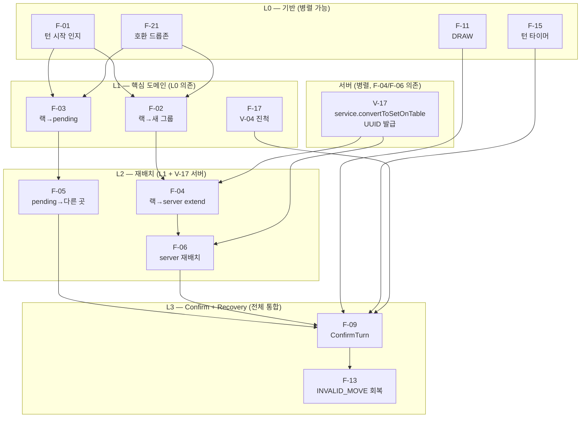

# 2026-04-25 — Phase C 구현 Dispatch 명령서 (Phase D 시작)

- **작성**: 2026-04-25, pm (본 sprint 최종 의사결정자)
- **상위**: `docs/02-design/61-phase-b-synthesis.md` (PM 종합 보고서) §6 결단 9건
- **사용자 GO 사인**: 2026-04-25 "승인함" — Phase A+B 8 산출물 모두 승인
- **목적**: Phase D (구현) 의 sprint 정의 + F-NN P0 12개 의존성 그래프 + 4 담당자 병렬 dispatch + G1~G5 게이트 활성화

---

## 1. Phase D 정의

### 1.1 마일스톤

| 항목 | 값 |
|------|------|
| **명칭** | Phase D — Sprint 7 W2 통합 구현 (UI 재설계 + 서버 V-17 + 테스트 재작성) |
| **시작** | 2026-04-25 (본 명령서 발행 즉시) |
| **마감** | 2026-05-02 (T+7 일, 사용자 사고 3건 회귀 방지 보장) |
| **owner** | 애벌레 (PM 본인) |
| **dispatch 대상** | frontend-dev / go-dev / designer / qa (4명 병렬) |

### 1.2 success criteria

Phase D 종료 (2026-05-02) 시점에 다음 모두 GREEN:

1. **F-NN P0 12개 모두 구현** — 60 §6 acceptance criteria 34건 자동 검증
2. **self-play harness 28 시나리오 GREEN** (88 §5.3, G4 게이트)
3. **신규 단위/property 테스트 200건 작성 + GREEN** (88 §7)
4. **폐기 라인 107 + 폐기 케이스 806 git rm 완료**
5. **V-17 서버 구현 + V-19 미구현은 Sprint 8 이관 명시**
6. **사용자 실측 사고 3건 회귀 방지 자동화** (G2 grep + G4 harness)
7. **G1~G5 게이트 위반 PR 0건 머지**

### 1.3 fail 시 escalation

- success criteria 1~3 중 1건이라도 RED → **사용자에게 일정 연장 1차례 보고** (PM 책임)
- 사용자 사고 3건 회귀 발생 → **즉시 임시 스탠드업 + 24시간 내 핫픽스 PR**

### 1.4 사용자 신뢰 회복 약속 (재확인)

- **본 sprint 동안 사용자에게 "테스트해 주세요" 요청 0회**
- **G5 GREEN 후에만 사용자 배포 + 사용자가 자율적으로 플레이**

---

## 2. F-NN P0 12개 구현 순서 + 의존성 그래프

### 2.1 의존성 그래프



### 2.2 병렬 가능 그룹

| 그룹 | F-NN | 담당자 | 병렬 가능? | 마감 |
|------|------|-------|----------|------|
| **G-A** (L0 기반) | F-01, F-11, F-15, F-21 | frontend-dev + designer | ✅ 4 동시 | Day 2 (2026-04-26) |
| **G-B** (L1 핵심) | F-02, F-03, F-17 | frontend-dev | ✅ 3 동시 | Day 3 (2026-04-27) |
| **G-C** (서버 V-17) | (V-17) | go-dev | ✅ G-A/B/D 병렬 | Day 3 (2026-04-27) |
| **G-D** (테스트 base) | 폐기 806 + A1~A21 단위 60 | qa | ✅ G-A/B/C 병렬 | Day 4 (2026-04-28) |
| **G-E** (L2 재배치) | F-04, F-05, F-06 | frontend-dev | ⚠ V-17 GREEN 후 | Day 5 (2026-04-29) |
| **G-F** (L3 Confirm) | F-09, F-13 | frontend-dev | ⚠ G-E GREEN 후 | Day 6 (2026-04-30) |
| **G-G** (harness) | self-play 28 | qa | ⚠ G-F GREEN 후 | Day 7 (2026-05-01) |
| **G-H** (사용자 배포 + 마감) | (전체 통합 + designer 시각 회귀) | pm + designer | ⚠ G-G GREEN 후 | Day 8 (2026-05-02) |

### 2.3 critical path

`G-A → G-B → V-17 (G-C) → G-E → G-F → G-G → G-H` = **8 일** (2026-04-25 ~ 2026-05-02)

**buffer**: 0.5 일 (실제 작업 7.5일, 0.5일 PM 검수)

### 2.4 daily milestone

| Day | 일자 | 마일스톤 |
|-----|------|---------|
| Day 1 | 2026-04-25 | Phase C 발행 + Phase D dispatch + G-A 착수 |
| Day 2 | 2026-04-26 | G-A 4 PR GREEN (F-01/F-11/F-15/F-21) |
| Day 3 | 2026-04-27 | G-B 3 PR GREEN (F-02/F-03/F-17) + G-C V-17 PR GREEN |
| Day 4 | 2026-04-28 | G-D 폐기 + A1~A21 단위 60 GREEN |
| Day 5 | 2026-04-29 | G-E 3 PR GREEN (F-04/F-05/F-06) — INC-T11-DUP/IDDUP 회귀 방지 |
| Day 6 | 2026-04-30 | G-F 2 PR GREEN (F-09/F-13) + property/invariant 40 GREEN |
| Day 7 | 2026-05-01 | G-G self-play harness 28 GREEN (G4 게이트 통과) |
| Day 8 | 2026-05-02 | G-H 사용자 배포 + Phase D 마감 회고 |

---

## 3. 담당자 dispatch 명령서

### 3.1 frontend-dev dispatch

**모델**: `claude-sonnet-4-6` (구현 작업)

**작업 범위**: F-NN P0 12개 클라이언트 구현 + 폐기 107라인 + dragEndReducer 통합

**PR 분할 정책 (worktree 격리 의무)**:

| PR # | 제목 | 담당 F-NN | 마감 |
|------|------|----------|------|
| **PR-D01** | F-01 턴 시작 인지 + F-21 호환 드롭존 (L0 시각 토큰 통합) | F-01, F-21 | Day 2 |
| **PR-D02** | F-11 DRAW + F-15 턴 타이머 (L0 ActionBar 분리) | F-11, F-15 | Day 2 |
| **PR-D03** | F-02 랙→새 그룹 + dragEndReducer A1 셀 정합 | F-02 | Day 3 |
| **PR-D04** | F-03 랙→pending + A2 셀 호환성 검사 | F-03 | Day 3 |
| **PR-D05** | F-17 V-04 진척 표시 + InitialMeldBanner 분리 | F-17 | Day 3 |
| **PR-D06** | F-04 랙→server extend + V-17 클라 매핑 (V-17 서버 GREEN 후) | F-04 | Day 5 |
| **PR-D07** | F-05 pending→다른 곳 (atomic transfer 보장) — INC-T11-DUP 회귀 방지 | F-05 | Day 5 |
| **PR-D08** | F-06 server 재배치 (split/merge/move) — INC-T11-IDDUP 회귀 방지 | F-06 | Day 5 |
| **PR-D09** | F-09 ConfirmTurn + clientPreValidation 분리 | F-09 | Day 6 |
| **PR-D10** | F-13 INVALID_MOVE 회복 + UR-21 토스트 카피 통일 | F-13 | Day 6 |
| **PR-D11** | 폐기 107라인 일괄 + band-aid 토스트 956-964/1053-1061 제거 | (폐기) | Day 6 |
| **PR-D12** | 4 계층 분리 ESLint 강제 (architect ADR §3.1 적용) + GameClient 1830 → 5+4 분할 | (구조) | Day 7 |

**worktree 명령**:
```bash
git worktree add /tmp/phase-d-fe-pr-D{NN} HEAD
cd /tmp/phase-d-fe-pr-D{NN}
git checkout -b feature/phase-d-fe-D{NN}
# 작업 후
git push origin feature/phase-d-fe-D{NN}
```

**RED→GREEN 의무 (G3 게이트)**:
- 모든 PR 은 RED commit 선행 → CI RED 확인 → 구현 → GREEN commit
- RED commit SHA + GREEN commit SHA 모두 PR description 첨부

**참조 SSOT**:
- 55 룰 enumeration (V-/UR-/D-/INV-)
- 56 매트릭스 (A1~A21 셀)
- 56b 상태 머신 (S0~S10 + invariant 16)
- 60 F-NN 카탈로그 + acceptance criteria
- 26 architect ADR 4 계층 분리
- 26b 라인 레벨 폐기/보존/수정 분류
- 57 디자인 토큰

**정합성 의무**:
- commit message 에 V-/UR-/D-/F-NN 룰 ID 매핑 (G1)
- band-aid 토스트 / source guard 신규 도입 금지 (G2)

---

### 3.2 go-dev dispatch

**모델**: `claude-sonnet-4-6` (구현 작업)

**작업 범위**: V-17 서버 구현 + 모듈화 7원칙 위반 부분 수정 + AI/Human 경로 통일

**PR 분할 정책**:

| PR # | 제목 | 담당 룰 | 마감 |
|------|------|--------|------|
| **PR-D-S01** | V-17 service.convertToSetOnTable UUID 발급 (Human + AI 통일) | V-17, D-12 | Day 3 |
| **PR-D-S02** | processAIPlace ID 누락 수정 + JokerReturnedCodes 보존 | V-17, V-07, AUDIT-01 | Day 3 |
| **PR-D-S03** | tileScoreFromCode handler 중복 제거 → engine.tile.go 통일 | (모듈화 §6) | Day 4 |
| **PR-D-S04** | (Sprint 8 이관) V-19 seq 단조성 — 본 sprint 미포함, ADR 만 작성 | V-19 | Day 7 (ADR only) |

**worktree 명령**: 동일 패턴

**RED→GREEN 의무**:
- PR-D-S01: 88 §2.3 V-17 5 케이스 RED → 구현 → GREEN
- PR-D-S02: 88 §4.2 INC-T11-IDDUP 서버 단위 3건 RED → 구현 → GREEN

**참조 SSOT**:
- 55 V-17 정의
- 87 §2 V-17 위반 라인 단위 분석
- 88 §2.3, §4.2 신규 테스트
- 89 SEC-DEBT-001 보안 부채

**정합성 의무**:
- 87 §6 폐기/보존/수정 분류 표 따름
- engine 패키지는 보존 (구조 변경 금지)
- handler/service 계층 경계 위반 수정 (Phase D 핵심)

---

### 3.3 designer dispatch

**모델**: `claude-sonnet-4-6` (UI 작업)

**작업 범위**: 시각 토큰 적용 + 드롭존 3상태 + 토스트 카피 통일 + 시각 회귀 테스트

**PR 분할 정책**:

| PR # | 제목 | 담당 UR-* | 마감 |
|------|------|----------|------|
| **PR-D-D01** | 디자인 토큰 30종 CSS 변수화 (57 §1.1) | UR-01~UR-36 base | Day 2 |
| **PR-D-D02** | 드롭존 3상태 적용 (Idle/Allow/Block) — UX-004 계승 | UR-10/UR-14/UR-18/UR-19 | Day 3 |
| **PR-D-D03** | 토스트 카피 통일 (UR-21/UR-29/UR-30/UR-31) — 룰 ID prefix 강제 | UR-21~UR-33 | Day 4 |
| **PR-D-D04** | 색약 보조 심볼 (♦♠♣♥★) 적용 | (접근성) | Day 5 |
| **PR-D-D05** | 시각 회귀 테스트 (storybook + screenshot diff) | UR-* 36 | Day 6 |

**참조 SSOT**:
- 57 visual language SSOT
- 26 §4.5 토큰 prop 좌표
- 60 F-NN ↔ UR-* 매핑

**정합성 의무**:
- band-aid 카피 신규 도입 금지 (UR-34 정책)
- aria-label 누락 검증 의무 (Day 3 PR #79 사고 재발 방지)

---

### 3.4 qa dispatch

**모델**: `claude-opus-4-7` Opus xhigh (검증 게이트)

**작업 범위**: 폐기 806 git rm + 신규 228 단위/property + self-play harness 28 + G1~G5 게이트 자동화

**PR 분할 정책**:

| PR # | 제목 | 담당 카테고리 | 마감 |
|------|------|------------|------|
| **PR-D-Q01** | 폐기 테스트 git rm (88 §1.2 폐기 806 일괄) | (폐기) | Day 4 |
| **PR-D-Q02** | A1~A21 단위 테스트 90건 신규 작성 (88 §2.1) | A-* 21 | Day 4 |
| **PR-D-Q03** | mergeCompatibility/jokerSwap 단위 48건 (88 §2.2, §2.4) | V-14/15/16, V-13e | Day 4 |
| **PR-D-Q04** | 상태 전이 24 + invariant 16 property test (fast-check) (88 §3) | INV-G1~G5 + S0~S10 | Day 5 |
| **PR-D-Q05** | 사용자 사고 9건 직접 회귀 (88 §4) | INC-T11-DUP/IDDUP/FP-B10 | Day 5 |
| **PR-D-Q06** | self-play harness 28 시나리오 (88 §5) | S-N/I/R/S/E | Day 6 |
| **PR-D-Q07** | G1~G5 게이트 자동화 스크립트 (88 §6) — pre-commit + CI lint | (게이트 자동화) | Day 6 |
| **PR-D-Q08** | CI self-play stage 신설 (devops 협업) | (CI) | Day 7 |

**참조 SSOT**:
- 88 (자기 산출물 — 본인 책임)
- 60 §6 acceptance criteria 54
- 56b invariant 16
- 89 SEC-DEBT-001 ↔ V-17 단위 검증

**정합성 의무**:
- describe/it 명에 룰 ID 명시 (G1 강제)
- band-aid 검증 테스트 신규 작성 금지 (G2)
- RED→GREEN 분리 commit (G3)

---

### 3.5 4명 협업 매트릭스

| Day | frontend-dev | go-dev | designer | qa |
|-----|------------|-------|---------|-----|
| Day 1 | dispatch 수신 | dispatch 수신 | dispatch 수신 | dispatch 수신 |
| Day 2 | PR-D01, D02 | (V-17 RED 작성) | PR-D-D01 | (RED 준비) |
| Day 3 | PR-D03, D04, D05 | PR-D-S01, S02 | PR-D-D02 | (RED 준비) |
| Day 4 | (대기 — V-17 GREEN) | PR-D-S03 | PR-D-D03 | PR-D-Q01, Q02, Q03 |
| Day 5 | PR-D06, D07, D08 | (Sprint 8 ADR PR-D-S04) | PR-D-D04 | PR-D-Q04, Q05 |
| Day 6 | PR-D09, D10, D11 | (검증 + 회귀 추적) | PR-D-D05 | PR-D-Q06, Q07 |
| Day 7 | PR-D12 (구조 분할) | (회귀 fix) | (시각 회귀 검수) | PR-D-Q08 (CI 통합) |
| Day 8 | (G4 GREEN 확인) | (G4 GREEN 확인) | (사용자 배포 검수) | (G1~G5 모두 GREEN 확인) |

**의존 관계**:
- Day 5 frontend-dev PR-D06/D07/D08 는 Day 3 go-dev PR-D-S01 GREEN 의존
- Day 7 qa PR-D-Q08 는 Day 6 frontend-dev PR-D11 GREEN 의존
- Day 8 사용자 배포는 Day 7 self-play 28 GREEN 의존

---

## 4. PR 머지 게이트 G1~G5 활성화

본 sprint 부터 즉시 강제. 상세는 `docs/03-development/20-pr-merge-gate-policy.md` 참조.

### 4.1 게이트 5개 요약

| 게이트 | 검증 | 자동화 | 차단 권한 |
|-------|------|--------|---------|
| **G1** | commit message 룰 ID (V-/UR-/D-/F-NN) grep | pre-commit + CI | PM |
| **G2** | band-aid 패턴 0 hit (source guard / invariant validator / unmapped toast) | CI lint | PM |
| **G3** | RED commit + GREEN commit 분리 + 양쪽 SHA PR 첨부 | MR 템플릿 + CI | PM |
| **G4** | self-play harness 28 GREEN | CI new stage | PM |
| **G5** | 모듈화 7원칙 self-check 7/7 ✓ | MR 템플릿 | PM |

### 4.2 게이트 위반 시 PM 자동 거절

- **위반 발견 즉시**: PR 코멘트 거절 + 사유 명시 (어느 게이트, 어느 항목)
- **재제출**: 위반 사유 해소 commit 추가 후 PR 재요청
- **반복 위반**: 3회 이상 동일 사유 → 임시 스탠드업 소집

### 4.3 게이트 강제 발효 시점

- **G1, G2, G3, G5**: 본 명령서 발행 즉시 (2026-04-25)
- **G4**: qa PR-D-Q08 (Day 7) GREEN 후 — 그 전에는 manual 검증

---

## 5. self-play harness 28 시나리오 GREEN 의무

### 5.1 사용자 배포 약속

- **본 sprint 의 모든 빌드는 self-play harness 가 GREEN 일 때만 사용자에게 배포** (60 §7.1, 88 §5.6)
- **사용자 테스트 요청 0회** — 사용자 명령 100% 반영

### 5.2 28 시나리오 카테고리 (88 §5.3)

| 카테고리 | 시나리오 ID | 건수 |
|---------|------------|------|
| S-Normal (정상 게임 진행) | S-N01 ~ S-N06 | 6 |
| S-Incident (사용자 사고 회귀) | S-I01 ~ S-I06 | 6 |
| S-Reject (V-* 서버 거부) | S-R01 ~ S-R08 | 8 |
| S-State (UI 상태 머신) | S-S01 ~ S-S05 | 5 |
| S-Edge (timeout / 예외) | S-E01 ~ S-E03 | 3 |

### 5.3 GREEN 기준

- 28/28 PASS
- 평균 시나리오 시간 30~120초
- 전체 28건 약 25~40분 (CI 단일 실행)
- DOM invariant + WS trace + 상태 trace + screenshot diff + 콘솔 로그 5축 검증

### 5.4 RED 1건 발견 시

- **즉시 PR 머지 차단** (G4)
- **24시간 내 핫픽스 PR** + 재실행 GREEN 확인
- **사용자 배포 보류**

---

## 6. 다음 스탠드업 (2026-04-26 09:00) 안건

### 6.1 정기 안건

1. **Phase D Day 1 마감 보고** (2026-04-25 18:00)
   - frontend-dev/go-dev/designer/qa 4명 dispatch 수신 확인
   - Day 2 PR (G-A 4건 + 디자인 토큰 1건) RED commit 진척
2. **G1~G5 게이트 발효 확인**
   - pre-commit hook 설치 여부
   - CI lint stage 추가 PR (devops 협업) 진척
3. **Day 2 마감 목표 확정** (2026-04-26 18:00)
   - PR-D01 (F-01 + F-21) GREEN
   - PR-D02 (F-11 + F-15) GREEN
   - PR-D-D01 (디자인 토큰) GREEN
   - V-17 RED commit 작성 완료
   - 폐기 806 git rm 준비 완료

### 6.2 회고 안건

1. **PM 결단 9건 (61 §6) 후속 조치**
   - 결단 #1 (A-N 분모 통일) — 26b 다음 PR 정정 책임 (frontend-dev)
   - 결단 #2 (V-17 위치) — 87 §2.6 적용 진척 (go-dev)
   - 결단 #3 (INC-T11-DUP 본질) — 55 §5 표 갱신 (game-analyst, 이번 sprint 외 위임)
   - 결단 #6 (harness 28) — 60 §7.2 정렬 (pm 본인)
   - 결단 #7 (P0 12 확정) — 60 §1.1 정정 (pm 본인)
2. **band-aid 잔존 R-RESID-01~06 모니터링**
   - 새 PR 에 잔존 추가 발견 시 즉시 보고
3. **사용자 사고 신규 발생 여부**
   - 24시간 내 발생 시 임시 스탠드업 소집 + 88 §4 에 INC-NN 추가 + qa PR 신규 작성

### 6.3 위험 추적 안건

1. **Critical Path 지연 위험**
   - V-17 (Day 3 go-dev) 지연 시 Day 5 frontend-dev PR-D06/D07/D08 시작 지연
   - mitigation: V-17 우선순위 P0 + go-dev 단독 작업
2. **PR 묶음 머지 재발 위험**
   - Day 3 PR #81 (F1~F5 통합) 사고 교훈 — 본 sprint 는 PR 분할 강제
   - mitigation: PM 직접 검토 (G5 self-check 의 SRP 항목)
3. **테스트 폐기 시 회귀 위험**
   - 폐기 806 중 일부가 실제 보호하던 의도가 흡수 안 될 가능성
   - mitigation: 88 Appendix B 흡수 매핑표 1:1 추적, qa Day 4 PR-D-Q01 에서 명시

### 6.4 사용자 보고 안건

- **2026-04-25 본 명령서 발행 시점**: PM 이 사용자에게 **단 1회** Phase D dispatch 완료 보고
- **2026-04-30 Day 6 마감**: 중간 점검 보고 (G-F 완료 시점)
- **2026-05-02 Day 8**: Phase D 마감 보고 + self-play 28 GREEN 결과 + 사용자 배포 GO 사인 요청

---

## 7. 본 명령서 자체 self-check (모듈화 7원칙)

| 원칙 | 본 명령서 적용 |
|------|------------|
| **SRP** | 본 명령서 = "Phase D 구현 dispatch" 단일 책임. 게이트 정책은 별도 산출물 (`20-pr-merge-gate-policy.md`) |
| **순수 함수 우선** | 입력 (61 종합 보고서 §6 결단) → 출력 (4명 dispatch + 마일스톤) 결정론적 |
| **의존성 주입** | SSOT 55/56/56b/60/26/26b/87/88/57/89 모두 명시 인용 |
| **계층 분리** | §1 Phase 정의 / §2 의존성 그래프 / §3 dispatch / §4 게이트 / §5 harness / §6 다음 스탠드업 — 6 계층 |
| **테스트 가능성** | 12 PR + 8 server PR + 5 designer PR + 8 qa PR = **33 PR 모두 acceptance 검증 가능** |
| **수정 용이성** | dispatch 변경 시 §3 1 표 + 의존성 변경 시 §2.1 그래프 1 노드 |
| **band-aid 금지** | 모든 PR 에 룰 ID + RED/GREEN 분리 commit + G2 검증 |

**self-check**: 7/7 ✅

---

## 8. 변경 이력

- **2026-04-25 v1.0**: 본 명령서 발행. Phase C 종합 보고서 §6 결단 9건 입력. 4명 33 PR dispatch + 의존성 그래프 + Daily milestone + G1~G5 활성화 + harness 28 GREEN 의무. Phase D 시작.

---

**서명**: pm (애벌레 GO 사인 인수)
**Phase D 시작**: 2026-04-25 본 명령서 발행 즉시
**다음 단계**: `docs/03-development/20-pr-merge-gate-policy.md` 발행 후 4명 병렬 실행
