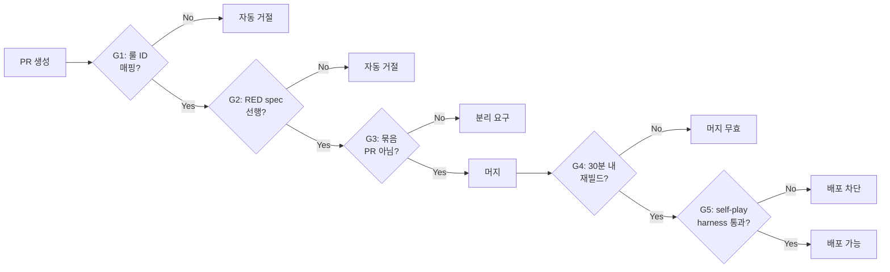

# UI 전면 재설계 — 스탠드업 운영 계획 (Cadence Plan)

- **작성**: pm (본인)
- **작성일**: 2026-04-25 12:30 KST
- **적용 범위**: Sprint 7 Week 2 (UI 전면 재설계, 2026-04-25 ~ 2026-05-02)
- **연계 문서**:
  - `work_logs/standups/2026-04-25-01-rebuild-kickoff.md` (본 sprint 착수 회의록)
  - `docs/01-planning/01-project-charter.md` §9 (회고 모드 운영 규칙)
  - `docs/04-testing/84-ui-turn11-duplication-incident.md` (사고 1차)
  - `docs/04-testing/86-ui-2nd-incident-2026-04-25.md` (사고 2차)

---

## 1. 본 계획의 목적

24시간 동안 사용자 실측 사고 3건이 발생했고, 사용자 신뢰 위기가 임계점에 도달했다. 본 PM 이 본 sprint 부터 PM 역할을 직접 인수했고, 다음 두 가지를 동시에 보장해야 한다:

1. **속도** — 사용자가 게임을 다시 할 수 있게 하는 self-play harness + 룰 기반 UI 재설계 빠른 도달
2. **품질 게이트** — 동시에 묶음 PR / 재빌드 누락 / RED spec 미선행 등 Day 3 패턴 재발 방지

본 cadence plan 은 이 둘을 양립시키기 위한 **회의 운영 규약**이다.

---

## 2. 정례 스탠드업 일정

### 2-1. 일일 스탠드업 (의무)

| 항목 | 값 |
|------|---|
| 시간 | **매일 09:00 KST** (모든 작업일) |
| 시작일 | 2026-04-26 (토) — 주말 포함 본 sprint 동안 |
| 주재 | pm (본인) |
| 참석 | 8명 (pm, architect, game-analyst, frontend-dev, go-dev, designer, qa, security) |
| 형식 | 데일리 모드 (어제 / 오늘 / 블로커) |
| 시간 제한 | 15분 권장 (블로커 토론은 별도 세션) |
| 로그 위치 | `work_logs/scrums/YYYY-MM-DD-01.md` |
| 결석 정책 | 본 PM 결석 0회 자기 강제. 다른 agent 결석 시 PM 이 발언 대체 작성 |

### 2-2. 회고 모드 스크럼 (주 1회)

| 항목 | 값 |
|------|---|
| 시간 | **매주 금요일 09:00 KST** (첫 회: 2026-05-01 금) |
| 부주제 | **부주제 3 — 놓친 회귀** 고정 (본 sprint 동안) |
| 질문 프레임 | 헌장 §9.3 부주제 3 표 인용 |
| 발언 분량 | 250~400자 필수 (헌장 §9.4) |
| 로테이션 | 본 sprint 의 부주제 고정으로 §9.5 로테이션 일시 정지 |
| 로그 위치 | `work_logs/scrums/2026-05-01-01.md` (회고 모드 명시) |

**부주제 3 고정 이유**: 본 sprint 의 직접 트리거가 "사용자 실측에서 회귀 검출" 이므로, 매주 회고가 그 패턴을 직접 다뤄야 한다. PM 이 사전 공지 (헌장 §9.6 체크리스트) 를 회고 3일 전 (2026-04-29 수) 발신.

### 2-3. 임시 스탠드업 (사용자 실측 사고 발생 시)

| 트리거 | 조치 |
|--------|------|
| 사용자가 실제 게임 중 게임 진행 불가 (FORFEIT 강제) | **24시간 내** 임시 스탠드업 소집 |
| Critical 보안 이슈 발견 | 즉시 (1시간 내) 임시 스탠드업 |
| game-analyst SSOT 와 구현 충돌 발견 | 4시간 내 임시 스탠드업 |
| 사용자 명시적 호출 ("팀원 다 모아라") | 즉시 |

임시 스탠드업 소집권은 본 PM 에게 있음. Claude main 은 dispatcher 역할로 PM 에게 트리거 보고만.

---

## 3. SSOT 발행 후 24시간 내 후속 산출물 마감

본 sprint 의 단일 critical path 는 **game-analyst SSOT 3종 발행** 이다. 본 PM 이 SSOT 3종 도착 알림 수신 즉시 다음을 직접 dispatch 한다:

### 3-1. SSOT 3종 도착 즉시 dispatch (T0 = SSOT 마지막 문서 머지 시점)

| Agent | 산출물 | 마감 (T0 기준) |
|-------|--------|---------------|
| architect | `docs/02-design/58-ui-component-decomposition.md` 본문 (스켈레톤 → 본격) | T0 + 18h |
| go-dev | `docs/04-testing/87-server-rule-audit.md` + AI placement ID 부여 fix PR | T0 + 24h |
| qa | `docs/04-testing/88-test-strategy-rebuild.md` + 폐기 대상 테스트 목록 | T0 + 24h |
| designer | `docs/02-design/57-game-rule-visual-language.md` 본문 (구조 → 비주얼) | T0 + 24h |
| frontend-dev | 인벤토리 ↔ 룰 매핑표 + 폐기/보존 분류 | T0 + 18h |
| security | `docs/04-testing/89-state-corruption-security-impact.md` | T0 + 12h (대부분 SSOT 무관 진행 가능) |

### 3-2. T0 + 24h 게이트

T0 + 24h 시점에 본 PM 이 임시 스탠드업 소집해 6명 산출물 검증. 미달 시 다음 조치:

- 1명 미달: PM 직접 면담 + 12h 추가
- 2명 이상 미달: SSOT 문서 자체에 게임룰 누락 가능성 의심 → game-analyst 재검토 요청

---

## 4. 본 PM 이 직접 추적할 핵심 지표

| 지표 | 목표 | 측정 방법 |
|------|------|----------|
| PR commit message 룰 ID 매핑 비율 | 100% | `git log --grep` |
| PR 머지 후 30분 내 재빌드 성공률 | 100% | CI 로그 + image SHA |
| 사용자 실측 사고 발생 빈도 | 0 / sprint | 사용자 발언 + 임시 스탠드업 트리거 횟수 |
| 일일 스탠드업 출석률 | 본 PM 100%, agent 평균 95%+ | 스크럼 로그 발언 수 |
| game-analyst SSOT 매핑 안 된 코드 라인 수 | 0 | qa 의 매핑표 |
| Self-play harness 통과 후 사용자 배포 비율 | 100% | 배포 로그 |

본 PM 이 매일 09:00 스탠드업 후 본 표를 업데이트해 `work_logs/scrums/YYYY-MM-DD-01.md` 메모에 기록.

---

## 5. PR 머지 게이트 (스탠드업과 직접 연동)

본 PM 이 모든 PR 을 다음 절차로 검증:

위반 사례는 매일 09:00 스탠드업에서 본 PM 이 호명 + 사유 + 재발 방지책을 발언자에게 요구.

---

## 6. 본 sprint 종료 조건

본 PM 이 다음 모두 충족 시 sprint 종료 선언:

1. **사용자 실기 테스트** — 사용자가 1게임 (최소 11턴) 끝까지 진행 + FORFEIT 0건
2. **game-analyst SSOT 3종 발행** + 7명 후속 산출물 100% 매핑
3. **PR 머지 게이트 G1~G5** 100% 강제 1주일 무위반
4. **회고 모드 스크럼** 1회 이상 실시 + 액션 아이템 추적표 가동

미충족 시 sprint 연장 결정은 본 PM + 사용자 합의.

---

## 7. 본 계획의 개정 정책

본 PM 이 일주일에 한 번 (매주 금 회고 모드 스크럼 직후) 본 계획서 개정:

- 측정 지표 추가/제거
- 임시 스탠드업 트리거 조건 조정
- 본 sprint 종료 조건 재평가

개정 시 본 문서 §8 개정 이력에 추가.

---

## 8. 개정 이력

| 버전 | 일자 | 작성자 | 변경 |
|------|------|--------|-----|
| v1.0 | 2026-04-25 | pm (본인) | 최초 발행. UI 전면 재설계 sprint 운영 규약 명문화. |

---

**서명**: pm (본인), 2026-04-25 12:30 KST
