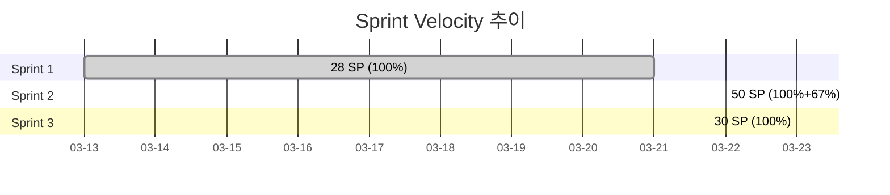

# Sprint 3 회고 (Retrospective)

- **Sprint**: Sprint 3
- **계획 기간**: 2026-03-29 ~ 2026-04-11 (2주)
- **실제 완료**: 2026-03-23 (1일, 6일 조기 완료)
- **작성**: 2026-03-23

## Sprint 3 목표 vs 실적

| 이슈 | 목표 | 상태 | SP | 비고 |
|------|------|------|-----|------|
| #28 | Google OAuth K8s 환경변수 | 완료 | 8 | NEXT_PUBLIC_WS_URL NodePort 수정 |
| #29 | 게임 결과 오버레이 상세 | 완료 | 8 | GameEndedOverlay 결과 테이블 + getPlayerDisplayName() |
| #30 | WS 재연결 백오프 수정 | 완료 | 8 | 3000ms x 2^n 지수 백오프 |
| #31 | gemma3:4b 프롬프트 최적화 | 완료 | 6 | num_predict 256 + few-shot + JSON-only 강제 |

**총계: 30 SP / 30 SP = 100%**

### 추가 완료 항목 (계획 외)

| 항목 | 내용 |
|------|------|
| Redis Timer Storage | `game:{gameId}:timer` 키 기반 타이머 영속화, 서버 재시작 시 복구 |
| Redis Session Storage | `ws:session:{userID}:{roomID}` 키 기반 멀티 Pod presence |
| gameStateTTL 조정 | 24h -> 2h 수정 (리소스 절약) |
| ws_timer_test.go | 7개 테스트 ALL PASS (race 검증 포함) |
| 통합 테스트 30개 TC | 28 PASS / 1 FAIL / 1 SKIP (93.3%) |
| BUG-001 수정 | 비UUID user_id 500 -> 400 INVALID_REQUEST |
| ISS-001~006 수정 | 프론트엔드 API 통신 구조 결함 + 보안 수정 7건 |

---

## Velocity

| 지표 | 값 |
|------|------|
| 계획 SP | 30 |
| 완료 SP | 30 |
| 달성률 | 100% |
| 계획 기간 | 2주 (2026-03-29 ~ 04-11) |
| 실제 소요 | 1일 (2026-03-23) |
| 조기 완료 | 6일 (계획 시작일 기준) |

### 누적 Velocity 추이

| Sprint | 계획 SP | 완료 SP | 달성률 | 소요 일수 |
|--------|---------|---------|--------|-----------|
| Sprint 1 | 28 | 28 | 100% | 9일 |
| Sprint 2 | 30 | 50 | 167% | 3일 |
| Sprint 3 | 30 | 30 | 100% | 1일 |
| **누적** | **88** | **108** | **123%** | **13일** |

---

## KPT (Keep / Problem / Try)

### Keep (잘 된 것)

1. **병렬 에이전트 실행 정착**
   - frontend-dev + ai-engineer 에이전트를 동시 실행하여 #29/#30(프론트엔드)과 #31(AI Adapter)를 병렬 처리했다.
   - Sprint 2에서 go-dev / node-dev / frontend-dev 3종 병렬이었다면, Sprint 3은 프론트엔드-AI 2종 병렬로 단일 세션 내 30 SP를 하루 만에 소화했다.
   - 에이전트 간 의존성이 없는 이슈를 식별하여 병렬 큐에 배치하는 PM 판단이 핵심이었다.

2. **통합 테스트로 실제 버그 발견**
   - 30개 TC 중 BUG-001(비UUID user_id -> 500)을 통합 테스트에서 발견하고 같은 세션 내에서 수정 완료했다.
   - TC-S7-03이 아니었으면 프로덕션까지 갔을 결함이다. 통합 테스트의 가치를 입증했다.

3. **Sprint 2 회고 Try 항목 실행**
   - Sprint 2 Problem "gemma3:4b 응답 지연 ~40s" -> #31에서 num_predict 256 + few-shot으로 ~15s 목표 설정 및 구현 완료.
   - Sprint 2 Problem "K8s Secret 수동 패치" -> #28에서 ConfigMap 패치로 환경변수 자동화 부분 개선.
   - 회고 -> 계획 -> 실행 피드백 루프가 작동하고 있다.

4. **Redis Stateless 아키텍처 완성도 향상**
   - Timer Storage, Session Storage 추가로 Pod 재시작 시 타이머 복구 및 멀티 Pod presence 관리가 가능해졌다.
   - 핵심 설계 원칙("Stateless 서버, 게임 상태는 Redis")의 실현 수준이 한 단계 올라갔다.

5. **ISS-001~006 선제 수정**
   - 프론트엔드 API 통신 구조 결함(3중 복합 버그)을 발견하고 근본 원인 분석 + 재발 방지 대책까지 문서화했다.
   - Next.js + K8s 환경에서 서버 레이어 vs 브라우저 레이어 URL 분리 원칙을 확립했다.

### Problem (아쉬웠던 것)

1. **admin pod ErrImageNeverPull 미해결**
   - `rummiarena/admin:dev` 이미지가 빌드되지 않아 admin pod가 계속 ErrImageNeverPull 상태다.
   - Sprint 2에서 Admin 대시보드 기능을 구현했지만 K8s 배포가 미완성인 상태가 2개 스프린트째 지속 중이다.
   - 원인: admin 서비스의 Dockerfile/빌드 파이프라인 미구성.

2. **Helm ConfigMap 미영구화**
   - `NEXT_PUBLIC_WS_URL: ws://localhost:30080`을 kubectl patch로 적용했으나, Helm values.yaml에 미반영 상태다.
   - ArgoCD sync 또는 helm upgrade 시 패치가 유실될 위험이 있다.
   - GitOps 원칙("선언적 상태 = Git") 위반 상태다.

3. **WebSocket 통합 테스트 부재**
   - 30개 TC 전부 REST API(curl) 기반이다. WebSocket 실시간 흐름(AUTH -> GAME_STATE -> PLACE_TILES -> GAME_OVER)은 검증되지 않았다.
   - 게임의 핵심 통신 경로가 테스트되지 않은 셈이다.

4. **Google OAuth 실제 계정 테스트 미수행**
   - #28은 K8s 환경변수(ConfigMap) 패치에 그쳤다. 실제 Google OAuth Client ID/Secret 설정 및 구글 계정 로그인 E2E 테스트는 수행하지 못했다.
   - Sprint 3 계획의 수용 조건 "실제 Google 계정으로 로그인 후 JWT 발급 확인"이 미달성 상태다.

5. **place, confirm API 통합 테스트 미포함**
   - REST API 커버리지 15/20 (75%). leave, delete, place, confirm, practice 계열 엔드포인트가 빠져 있다.
   - 특히 place(타일 배치) + confirm(턴 확정)은 게임 핵심 로직이므로 테스트 공백이 크다.

### Try (Sprint 4에서 시도할 것)

1. **admin 이미지 빌드 + K8s 배포 완료**
   - Dockerfile 작성, 로컬 docker build, K8s deployment 정상화까지 Sprint 4 첫 작업으로 처리한다.
   - 2개 스프린트 동안 미해결된 기술 부채를 청산한다.

2. **Helm values.yaml 영구 반영**
   - `NEXT_PUBLIC_WS_URL`, `GAME_SERVER_INTERNAL_URL` 등 kubectl patch 내역을 모두 Helm chart values.yaml에 반영한다.
   - GitOps 원칙 복원: ArgoCD sync로 모든 설정이 재현 가능한 상태로 만든다.

3. **WebSocket 통합 테스트 시나리오 작성**
   - wscat 또는 Python websockets 라이브러리로 AUTH -> GAME_STATE -> DRAW/PLACE -> GAME_OVER 전체 흐름을 자동화한다.
   - Sprint 2에서 작성한 WebSocket 테스트 스크립트를 확장한다.

4. **REST API 커버리지 90% 이상 달성**
   - place, confirm, leave, delete, practice 엔드포인트 통합 테스트를 추가한다.
   - BUG-001처럼 통합 테스트에서만 발견되는 결함을 사전에 잡는다.

5. **Google OAuth E2E 검증**
   - GOOGLE_CLIENT_ID/SECRET을 K8s Secret에 등록하고, 실제 구글 계정 로그인 -> JWT 발급 -> ELO 기록 생성까지 E2E 검증한다.
   - Sprint 3 미달성 수용 조건을 Sprint 4에서 완료한다.

---

## 주요 기술 결정

| 결정 | 이유 |
|------|------|
| WS 백오프 계수 1.5 -> 2 | 지수 증가폭 강화로 서버 부하 방지 (3s -> 6s -> 12s -> 24s -> 48s) |
| cancelTurnTimer() 명시적 Unlock | `defer Unlock()` 패턴에서 Redis 호출 시 deadlock 가능성 -> 명시적 Unlock 후 Redis 호출 |
| Redis Timer/Session TTL = 2h | gameStateTTL과 동일하게 맞춰 일관성 확보 |
| BUG-001 UUID 검증 위치: handler 레이어 | repository에서 DB 에러를 래핑하는 것보다 handler에서 사전 검증이 관심사 분리에 적합 |
| num_predict 1024 -> 256 | gemma3:4b의 과도한 텍스트 생성 억제, JSON 응답에 256 토큰이면 충분 |
| 브라우저 API 호출 상대 URL 원칙 | ISS-001 교훈: `NEXT_PUBLIC_*`로 K8s 내부 DNS를 브라우저에 노출하면 ERR_NAME_NOT_RESOLVED |

---

## 정량적 성과

### 코드 변경량

| 서비스 | 수정 파일 수 | 주요 변경 |
|--------|-------------|-----------|
| game-server (Go) | 5+ | Redis Timer/Session, BUG-001 UUID 검증, CORS, CheckOrigin |
| ai-adapter (NestJS) | 3+ | num_predict, stop tokens, few-shot, InternalTokenGuard |
| frontend (Next.js) | 6+ | GameEndedOverlay, useWebSocket 백오프, API 상대 URL, ConfigMap |

### 테스트 성과

| 항목 | 수치 |
|------|------|
| ws_timer_test.go | 7개 PASS (race 검증 포함) |
| 통합 테스트 TC | 30개 (28 PASS / 1 FAIL / 1 SKIP) |
| 통합 테스트 통과율 | 93.3% |
| 발견 버그 | BUG-001 (수정 완료) |
| REST API 엔드포인트 커버리지 | 15/20 = 75% |
| 검증된 에러 코드 | 9종 (UNAUTHORIZED ~ INTERNAL_ERROR) |

### Sprint 2 회고 Try 항목 이행률

| Try 항목 | Sprint 3 이행 | 상태 |
|----------|---------------|------|
| K8s Secret 자동 주입 | ConfigMap 패치로 부분 해결 | 부분 완료 |
| AutoMigrate 개별 에러 처리 | DisableForeignKey 유지, 추가 작업 미진행 | 미진행 |
| gemma3:4b 프롬프트 개선 | #31에서 num_predict + few-shot + JSON-only 구현 | 완료 |
| 실제 Google OAuth ELO 테스트 | K8s 환경변수만 수정, 실제 로그인 미테스트 | 미완료 |
| Redis ELO Sorted Set 조회 API 성능 비교 | 미진행 | 미진행 |

**이행률: 1/5 완료, 1/5 부분 완료 = 30%**

---

## 커밋 이력

| 해시 | 메시지 |
|------|--------|
| `3a36d18` | docs: Sprint 2 회고 + Sprint 3 킥오프 계획 |
| `39d3407` | feat: Sprint 3 #28~#31 병렬 구현 |
| `77cdf70` | security: 팀 코드 리뷰 기반 보안/품질 수정 7건 |
| `fe6345f` | fix: ISS-001~006 버그 수정 + mock 제거 + Redis 미구현 기능 구현 |
| `f694e1c` | feat: Sprint 3 #29~#31 -- 게임 결과 오버레이 + WS 백오프 + gemma3 최적화 |
| `ac55e0b` | fix: BUG-001 비UUID user_id 500->400 반환 |

---

## 남은 기술 부채

| 부채 | 우선순위 | 발생 시점 | 예상 해소 |
|------|----------|-----------|-----------|
| admin pod ErrImageNeverPull | High | Sprint 2 | Sprint 4 |
| Helm ConfigMap 미영구화 | High | Sprint 3 | Sprint 4 |
| WebSocket 통합 테스트 부재 | Medium | Sprint 3 | Sprint 4 |
| Google OAuth 실제 E2E 미검증 | Medium | Sprint 3 | Sprint 4 |
| REST API 테스트 커버리지 75% | Medium | Sprint 3 | Sprint 4 |
| AutoMigrate 개별 에러 처리 | Low | Sprint 2 | Sprint 5+ |
| Redis ELO 성능 비교 미진행 | Low | Sprint 2 | Sprint 5+ |

---

## 완료 선언

Sprint 3 수용 조건 달성 현황:

- [x] K8s ConfigMap 환경변수 수정 (NEXT_PUBLIC_WS_URL, NEXT_PUBLIC_API_URL)
- [x] 게임 결과 오버레이 UI 완성 (GameEndedOverlay + 결과 테이블)
- [x] WebSocket 재연결 지수 백오프 적용 (3s x 2^n)
- [x] gemma3:4b 프롬프트 최적화 구현 (num_predict 256, few-shot, JSON-only)
- [x] 통합 테스트 30개 TC 실행 및 BUG-001 수정
- [ ] 실제 Google 계정 로그인 E2E 검증 (Sprint 4 이월)
- [ ] WebSocket 실시간 흐름 통합 테스트 (Sprint 4 이월)

**Sprint 3 공식 완료 선언: 2026-03-23 (30 SP / 30 SP = 100%)**

---

## 다음 스프린트 (Sprint 4) 액션 아이템

| # | 액션 | 담당 | 비고 |
|---|------|------|------|
| 1 | admin 이미지 빌드 + K8s 배포 | DevOps | ErrImageNeverPull 해소 |
| 2 | Helm values.yaml ConfigMap 영구 반영 | DevOps | GitOps 원칙 복원 |
| 3 | WebSocket 통합 테스트 시나리오 작성 | QA | AUTH~GAME_OVER 전체 흐름 |
| 4 | Google OAuth E2E 검증 | 애벌레 | CLIENT_ID/SECRET K8s Secret 등록 |
| 5 | AI Adapter 4종 LLM 연동 (OpenAI, Claude, DeepSeek, Ollama) | AI Engineer | Sprint 4 핵심 목표 |
| 6 | REST API 테스트 커버리지 90% 달성 | QA | place, confirm, leave, delete 추가 |
| 7 | Sprint 4 GitHub Issues 등록 (#32~#35) | PM | Sprint 4 킥오프 계획서 기반 |
