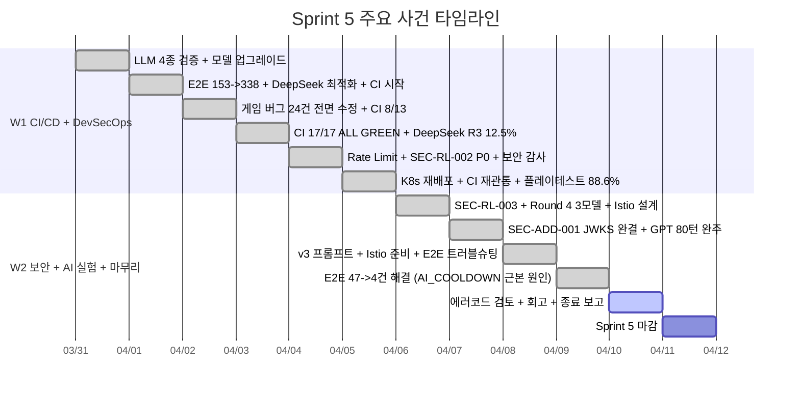

# Sprint 5 회고 (Retrospective)

- **기간**: 2026-03-31 ~ 2026-04-11 (2주, 12일)
- **목표**: "코드 품질 게이트를 자동화하고, 서비스 메시로 내부 통신을 보호한다"
- **계획 SP**: 24 SP (P0 16 + P1 8)
- **실제 완료 SP**: ~67 SP (2.8배 초과 달성)
- **진행률**: **95%** (P0 100%, P1 설계 100% / 구현 Sprint 6 이월, 추가 보안 80%)

---

## 잘한 점 (Keep)

### K1. CI/CD 17/17 ALL GREEN -- 3일 만에 전 파이프라인 관통

DinD 실패에서 Kaniko 전환까지 Pipeline #94~#96, 3회 시행착오로 빠르게 대안을 찾았다. lint 4 + test 2 + quality 2 + build 4 + scan 4 + gitops 1 = 17개 Job이 전부 GREEN인 상태를 04-03(Day 3)에 달성한 것은 인프라 작업의 불확실성을 고려하면 매우 빠른 속도였다. 이후 Pipeline #113까지 7회 재실행에서도 ALL GREEN을 유지했다.

**수치**: 8/13(04-02) -> 17/17(04-03), SonarQube 93초, Trivy 42초

### K2. 10명 에이전트 Wave/Phase 병렬 투입 패턴 정착

Sprint 5에서 10명 에이전트를 Wave 1/2/3 순차 + Phase 내 병렬로 투입하는 패턴이 정착되었다. 의존성이 있는 작업도 하루 안에 "설계 -> 구현 -> 검증 -> 배포"까지 완결하는 리듬이 확립되었다.

**수치**: 일일 Velocity 6.1 SP/일 (Sprint 4: 3.3 SP/일 대비 1.85배)

### K3. AI 대전 실험 체계화 -- 4모델 비교 데이터 확보

Round 2(04-01)부터 Round 4(04-06~07)까지 10회 이상의 대전을 실행하여 Claude Sonnet 4(33.3%) > GPT-5-mini(30.8%) = DeepSeek Reasoner(30.8%) >> Ollama(0%) 순위를 정량적으로 확정했다. v2 프롬프트 크로스모델 실험으로 모델 간 공정 비교가 가능해졌고, ai-battle-multirun.py(766줄) 자동화 스크립트를 구축하여 다회 실행 통계를 체계화했다.

**수치**: DeepSeek 5%(Round 2) -> 30.8%(Round 4), 성장률 6.2배

### K4. 보안 8건 당일 해결 -- P0 LLM 비용 공격 즉시 대응

Security 감사에서 P0-Critical(SEC-RL-002: 5분에 $20 예산 소진 가능)을 발견한 당일에 Go Dev + Node Dev 즉시 재투입하여 해결했다. SEC-ADD-001(JWKS RS256 서명 검증)도 하루 만에 설계-구현-테스트-배포를 완결했다. Sprint 5 종료 시 Critical 0, High 0 상태를 달성했다.

**수치**: 보안 항목 8/10 완료 (22 SP), 잔여 3건(Medium)은 Sprint 6 이관

### K5. 테스트 817 -> 1,498건 성장 (1.83배)

Sprint 4 종료 시 817건에서 Sprint 5 종료 시 1,498건으로 681건이 증가했다. Go 유닛(680), NestJS 유닛(428), Playwright E2E(390)의 3계층 테스트가 균형 있게 성장했다. conservation 테스트(24건), DnD E2E(24건), 보안 E2E(15건) 등 품질 검증의 깊이도 확보했다.

**수치**: Go +334, NestJS +110, E2E +237 / 0 FAIL 상태 유지

### K6. 게임 버그 24건 하루 만에 전면 수정 (04-02)

스크린샷 21장 기반으로 Critical 7 + Major 7 + Minor 10건을 식별하고, 6명 에이전트 병렬 투입으로 당일 전량 수정을 완료했다. 근본 원인(INVALID_MOVE 후 랙 미복원)을 정확히 짚어낸 것이 핵심이었다.

### K7. E2E 47건 실패 근본 원인 추적 -- AI_COOLDOWN 발견 (04-09)

3일간 E2E 실패의 원인을 rate limit 설정으로 오진하다가, 04-09에 실제 원인이 SEC-RL-002의 AI 게임 생성 5분 쿨다운(AI_COOLDOWN)이 rate_limiter와 동일한 HTTP 429를 반환하는 것임을 발견했다. AI_COOLDOWN_SEC 환경변수 외부화로 dev=0 설정하여 47건 -> 4건으로 해결했다.

---

## 개선할 점 (Problem)

### P1. E2E 실패 원인 오진 -- 3일간 rate limit 설정 탓으로 돌림

04-06~08 동안 E2E 47건 실패를 rate limit 설정 문제로 분류하여 RATE_LIMIT_LOW_MAX를 10 -> 60 -> 200으로 올리는 시행착오를 반복했다. 실제 원인은 동일 HTTP 429를 반환하는 AI_COOLDOWN이었다. "서버 로그에서 실제 429 발생 여부를 먼저 확인"하는 grep-first debugging 원칙이 지켜지지 않았다.

**교훈**: 증상이 아닌 실제 서버 로그를 먼저 확인할 것. 동일 HTTP 상태 코드를 다른 의미로 재사용하는 것은 위험하다.

### P2. Istio 구현 Sprint 6 이월 -- 설계만 완료

킥오프 시 P1(8 SP)으로 계획했던 Istio Service Mesh 구현이 설계(ADR-020, 사전 점검 781줄, 스크립트 3개, CRD 4개)만 완료되고 실제 설치는 Sprint 6으로 밀렸다. 보안 항목과 AI 대전 실험이 예상보다 많은 시간을 소비했기 때문이다.

**교훈**: P1 항목이 추가 P0 발생(보안 감사 P0)에 밀리는 것은 자연스럽지만, 초기에 "Istio는 Sprint 6"로 빠르게 재분류했어야 한다.

### P3. Docker Desktop K8s 교대 실행 부담

16GB RAM 제약으로 K8s와 개발 환경을 교대 실행해야 하는 상황이 지속되었다. 특히 AI 대전 테스트 시 K8s 7개 서비스 + LLM API 호출이 메모리를 압박하여, 배틀 스크립트 실행과 코드 개발을 동시에 할 수 없었다.

**교훈**: 메모리 압박이 예상되는 대전 테스트는 별도 시간 블록으로 분리하여 일정에 반영할 것.

### P4. 문서 폭증 -- Sprint 5 기간 중 30건+ 신규 문서

설계 12건, 테스트 보고서 10건 등 총 30건 이상의 문서가 생성되었다. 각 문서의 품질은 높지만 (평균 600줄+), 전체적인 문서 구조와 상호 참조 관계를 체계적으로 관리하지 못했다.

**교훈**: 문서 생성 시 "이 문서가 기존 어떤 문서를 갱신/보완하는지" 명시적으로 추적할 것.

### P5. v2 다회 실행 배틀 미완료

ai-battle-multirun.py 스크립트(766줄)는 완성되었으나, 실제 다회 실행(GPT/DeepSeek 각 3회, Claude 1회, 약 4.7시간 소요)은 K8s 교대 실행 + 시간 부족으로 Sprint 5 내에 완료하지 못했다. 통계적 유의성 확보를 위한 반복 실험이 Sprint 6으로 이월된다.

### P6. SonarQube OOM Kill 3단계 수정 (04-01~02)

SonarQube Scanner가 JVM -Xmx512m으로 Pod 메모리를 초과하여 OOM Kill되는 문제를 해결하는 데 3단계의 시행착오가 필요했다. 첫째 JVM 힙 축소, 둘째 GC 충돌 해결, 셋째 Xms=Xmx=256m 고정. 인프라 도구의 메모리 프로파일을 사전에 검토했어야 한다.

### P7. 에러 코드 일관성 부재 -- AI_COOLDOWN 429 vs Rate Limit 429

SEC-RL-002(AI_COOLDOWN)가 rate_limiter와 동일한 HTTP 429를 반환하면서 클라이언트와 E2E 테스트가 구분할 수 없었다. 에러 코드 레지스트리(29번 문서, 38개 코드)가 사후적으로 작성되었지만, 코드 작성 시점에 에러 코드 설계가 선행되었어야 한다.

---

## 시도할 점 (Try)

### T1. grep-first debugging 원칙 팀 규칙화

E2E 실패 등 문제 발생 시, 가설을 세우기 전에 반드시 서버 로그(kubectl logs, grep)를 먼저 확인한다. "증상 -> 가설 -> 코드 수정"이 아닌 "증상 -> 로그 확인 -> 근본 원인 -> 코드 수정" 흐름을 강제한다.

### T2. HTTP 상태 코드 + 에러 코드 분리 원칙

동일 HTTP 상태 코드(429)를 다른 의미로 사용하지 않는다. 에러 코드 레지스트리를 코드 작성 전에 설계하고, 새로운 에러 상황마다 고유 에러 코드를 부여한다. AI_COOLDOWN은 429 대신 403 또는 별도 에러 코드를 사용하도록 Sprint 6에서 수정한다.

### T3. Sprint 내 문서 인덱스 자동 생성

Sprint 기간 중 생성된 문서를 자동으로 인덱싱하는 스크립트를 만들어, 종료 시점에 문서 목록과 상호 참조 관계를 한눈에 파악할 수 있게 한다.

### T4. 대전 테스트 시간 블록 사전 배정

AI 대전 테스트(~4.7시간)는 별도 시간 블록으로 Sprint 일정에 미리 배정한다. K8s 교대 실행 전환 시간(~15분)도 계산에 포함한다.

### T5. Istio 점진적 적용 전략 실행

Sprint 6 W1에서 Istio Phase 5.0~5.3을 게이트 기반으로 단계 실행한다. 사전 점검 문서(781줄)와 스크립트 3개가 준비되어 있으므로, 실행 시작 후 예상 소요 시간은 2~3일이다.

### T6. 반성문 + 교훈 DB 축적

Sprint 5 Day 4에서 팀원 10명 개별 반성문을 작성한 것이 근본 원인 추적의 전환점이 되었다. Sprint 6에서도 중대 이슈 발생 시 개별 반성문 -> 교훈 -> 팀 규칙 전환 사이클을 유지한다.

---

## 핵심 지표

| 지표 | 목표 | 달성 | 판정 |
|------|------|------|------|
| CI 파이프라인 | 5단계 GREEN | **17/17 ALL GREEN** | PASS |
| 테스트 커버리지 | Go >=80%, Node >=75% | SonarQube PASS | PASS |
| 품질 게이트 | 0 Blocker | **0 Blocker** | PASS |
| 컨테이너 스캔 | 0 CRITICAL | **0 CRITICAL** | PASS |
| Istio 사이드카 | 전 Pod 2/2 Ready | 설계 완료, 구현 Sprint 6 | DEFERRED |
| mTLS | East-West 암호화 | Sprint 6 이관 | DEFERRED |
| 문서 발행 | 3건 | **30건+** (10배) | PASS |
| 테스트 수 | 증가 | **817 -> 1,498** (+83%) | PASS |
| 보안 Critical/High | 0건 | **0건** | PASS |
| AI Place Rate 최고 | 15%+ | **33.3%** (Claude Sonnet 4) | PASS |
| SP 달성 | 24 SP | **~67 SP** (2.8배) | EXCEED |

---

## 주요 사건 타임라인

---

## 교훈

### 1. "동일 HTTP 상태 코드를 다른 의미로 재사용하지 말라"

SEC-RL-002(AI_COOLDOWN)와 Rate Limit이 모두 HTTP 429를 반환하면서 3일간의 디버깅 오진이 발생했다. 에러 코드는 설계 단계에서 레지스트리를 만들고, 각 의미에 고유 코드를 부여해야 한다. 이 교훈은 에러코드 레지스트리(29번 문서)로 제도화되었다.

### 2. "인프라 도구의 메모리 프로파일을 사전 검토하라"

SonarQube JVM, Istio sidecar, Kaniko 빌더 등 인프라 도구가 16GB 환경에서 예상보다 많은 메모리를 소비했다. 새로운 도구 도입 시 반드시 메모리 예산 검증을 선행해야 한다.

### 3. "추론 모델(reasoning model)은 전략 게임 AI에 필수적이다"

비추론 모델(Ollama qwen2.5:3b)은 place rate 0%, 추론 모델(Claude Sonnet 4 thinking)은 33.3%로 극단적인 차이를 보였다. LLM 기반 게임 AI는 반드시 추론 기능을 갖춘 모델을 사용해야 한다.

### 4. "프롬프트 한 줄의 변경이 2등급 상승을 만든다"

03-31 프롬프트 1차 최적화에서 초기등록 30점 규칙 강화 한 줄로 OpenAI D->A, DeepSeek C->B 등급 상승을 달성했다. 프롬프트 엔지니어링은 코드 변경 대비 ROI가 극도로 높다.

### 5. "병렬 에이전트 투입은 Wave 단위로 의존성을 관리해야 한다"

10명을 동시에 투입하면 충돌이 발생한다. Wave 1(구현) -> Wave 2(검증) -> Wave 3(배포) 순차 실행 + Wave 내 병렬의 조합이 최적이다. 이 패턴으로 일일 Velocity가 6.1 SP/일까지 상승했다.

### 6. "반성문은 근본 원인 추적의 촉매제다"

04-09의 E2E 근본 원인 발견은 전날 작성된 팀원 10명 반성문에서 "왜 로그를 먼저 확인하지 않았는가"라는 자기 성찰이 방향 전환의 계기가 되었다.

---

## Sprint 5 -> Sprint 6 인계 사항

| 항목 | 상태 | Sprint 6 기한 |
|------|------|--------------|
| Istio Phase 5.0~5.3 구현 | 설계+준비 100% 완료, 실행만 남음 | 04-17 |
| SEC-REV Medium 3건 (002/008/009) | 영향도 분석 완료, 수정 대기 | 04-20 |
| v3 프롬프트 실전 적용 | 텍스트 초안+33 테스트 완료 | 04-17 |
| v2 다회 실행 통계 | 스크립트(766줄) 완료, 실행 대기 | 04-14 |
| DashScope API 연동 | 설계 완료 (25번 문서) | 04-20 |
| AI 토너먼트 대시보드 | 와이어프레임 완료 (23번 문서) | 04-24 |
| AI_COOLDOWN 429->403 에러코드 변경 | P1 권고, 검토 대기 | 04-14 |

---

*작성: PM (2026-04-10)*
*Sprint 5 회고 참석: 애벌레, PM, Architect, Go Dev, Node Dev, Frontend Dev, DevOps, QA, Security, AI Engineer, Designer (11명)*
