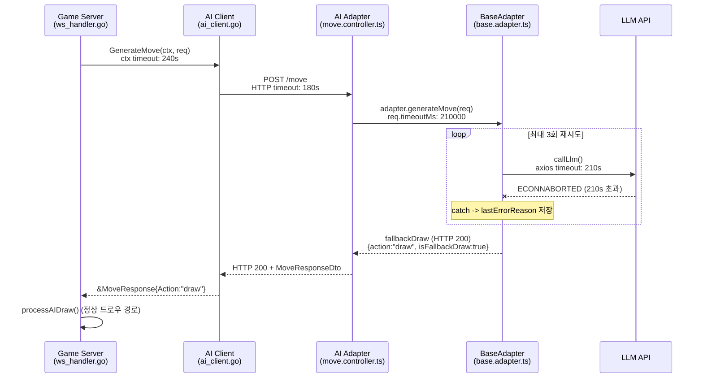
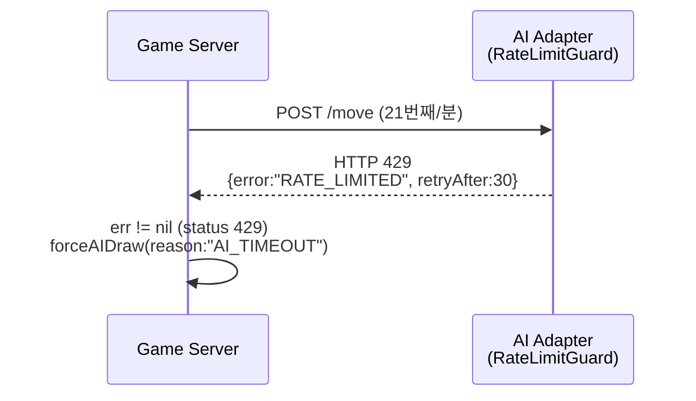
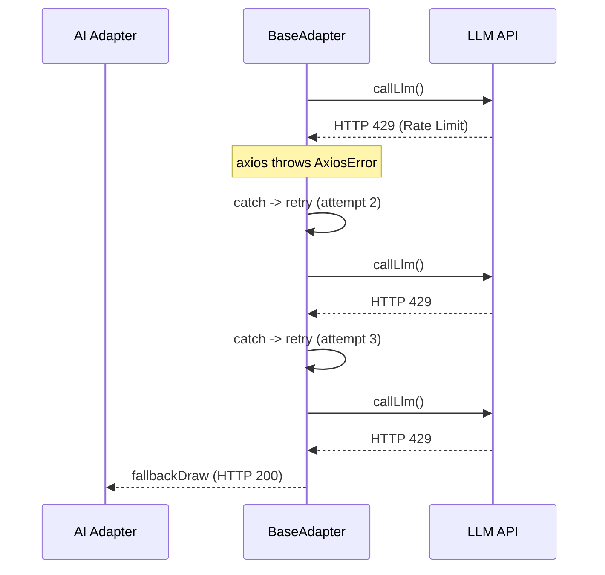
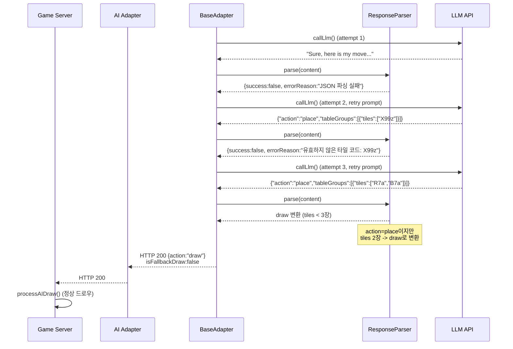
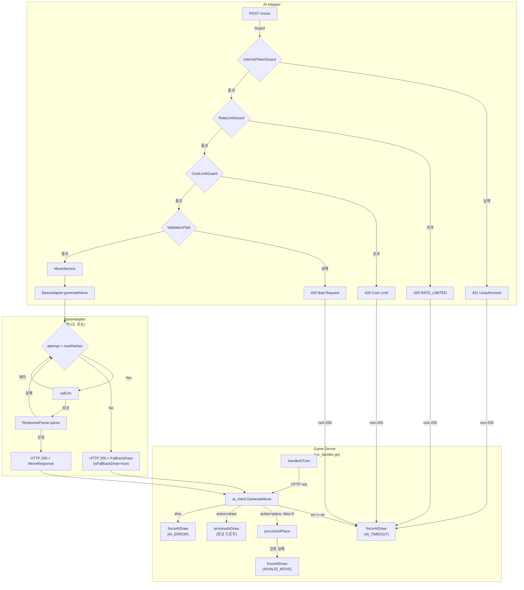

# AI Adapter 소스코드 리뷰 (2026-04-10)

> **리뷰 범위**: `src/ai-adapter/src/` 전체 (57개 .ts 파일)  
> **연계 범위**: `src/game-server/internal/client/ai_client.go`, `ws_handler.go` (AI Turn Orchestrator)  
> **기준 문서**: `docs/02-design/29-error-code-registry.md`

---

## 1. 에러코드 감사

### 1.1 레지스트리 vs 코드 불일치

29번 에러코드 레지스트리는 **game-server 전용** 문서로, ai-adapter의 에러코드는 등록되어 있지 않다.
ai-adapter가 자체적으로 반환하는 HTTP 에러 응답을 전수 조사한 결과:

| 발생 위치 | HTTP Status | 에러 코드/메시지 | 레지스트리 등록 |
|-----------|:-----------:|------------------|:--------------:|
| `ValidationPipe` (NestJS 내장) | **400** | `{"statusCode":400,"message":[...validation errors],"error":"Bad Request"}` | 미등록 |
| `MoveService.selectAdapter()` | **400** | `BadRequestException: 지원하지 않는 모델입니다: "..."` | 미등록 |
| `InternalTokenGuard` | **401** | `UnauthorizedException: Invalid internal token` | 미등록 |
| `RateLimitGuard` | **429** | `{"error":"RATE_LIMITED","message":"Too many requests","retryAfter":30}` | 미등록 |
| `CostLimitGuard` (일일 한도) | **429** | `{"statusCode":429,"error":"Daily Cost Limit Exceeded","message":"...","allowedModels":["ollama"]}` | 미등록 |
| `CostLimitGuard` (시간당 한도) | **429** | `{"statusCode":429,"error":"Hourly User Cost Limit Exceeded","message":"...","allowedModels":["ollama"]}` | 미등록 |
| LLM API 호출 실패 (unhandled) | **500** | NestJS 기본 Internal Server Error | 미등록 |

**불일치 1: ai-adapter 에러코드가 레지스트리에 전혀 없다.**
29번 문서 범위가 game-server로 한정되어 있어 ai-adapter의 6가지 에러 유형이 누락되었다.

**불일치 2: ai-adapter의 429 응답이 game-server의 429 응답과 혼재 가능.**
game-server의 RATE_LIMITED(429)와 ai-adapter의 RATE_LIMITED(429)가 동일 코드명을 사용하나, 응답 경로가 다르다(프론트엔드 직접 접근 vs 내부 서비스간 통신). 현재 ai-adapter는 game-server만 호출하므로 프론트엔드에 직접 노출되지 않지만, 향후 admin 대시보드에서 직접 호출 시 혼란 가능.

### 1.2 LLM 에러 -> HTTP 상태 변환 맵

ai-adapter의 핵심 설계: **LLM API 에러는 HTTP 에러로 변환하지 않고, 내부적으로 재시도 후 fallback draw를 HTTP 200으로 반환한다.**

```
LLM API 에러 (axios error)
  --> BaseAdapter.generateMove() catch 블록
    --> lastErrorReason에 저장
    --> for-loop 재시도 (최대 maxRetries)
    --> 전부 실패 시 ResponseParserService.buildFallbackDraw()
    --> HTTP 200 + MoveResponseDto { action:"draw", metadata.isFallbackDraw:true }
```

| LLM 에러 유형 | axios 에러 | ai-adapter 내부 처리 | 최종 HTTP 응답 |
|---------------|-----------|---------------------|:-------------:|
| 타임아웃 (ECONNABORTED) | `AxiosError: timeout of Nms exceeded` | catch -> retry -> fallback draw | **200** |
| API rate limit (HTTP 429) | `AxiosError: Request failed with status code 429` | catch -> retry -> fallback draw | **200** |
| 인증 실패 (HTTP 401) | `AxiosError: Request failed with status code 401` | catch -> retry -> fallback draw | **200** |
| 네트워크 에러 | `AxiosError: Network Error` | catch -> retry -> fallback draw | **200** |
| JSON 파싱 실패 | ResponseParser.parse() -> success:false | retry -> fallback draw | **200** |
| 유효하지 않은 수 | ResponseParser.parse() -> 타일 검증 실패 | retry -> fallback draw | **200** |

**핵심 발견: ai-adapter는 LLM 에러를 절대 상위로 전파하지 않는다.**
모든 LLM 에러는 재시도 + fallback draw로 흡수되어 HTTP 200을 반환한다.
game-server가 HTTP 200 이외의 응답을 받을 수 있는 경우는 ai-adapter 자체의 가드/파이프 에러뿐이다.

---

## 2. 에러 전파 경로

### 2.1 타임아웃 경로



**타임아웃 계층 (바깥->안쪽)**:
1. game-server context: **240s** (`aiTurnTimeout`, ws_handler.go:829)
2. AI Client HTTP: **180s** (`AI_ADAPTER_TIMEOUT_SEC`, config.go:84)
3. ai-adapter LLM 호출: **210s** (`req.TimeoutMs`, ws_handler.go:847)

**문제점 (Medium): 타임아웃 역전 현상**
- AI Client HTTP 타임아웃(180s) < LLM 호출 타임아웃(210s)
- ai-adapter 내부에서 LLM 210s 대기 중에 game-server HTTP 클라이언트가 180s에 먼저 타임아웃
- 결과: ai-adapter는 아직 재시도 중인데 game-server는 `forceAIDraw(reason:"AI_TIMEOUT")`을 호출
- ai-adapter의 재시도 로직과 fallback draw가 무의미해짐
- ai-adapter는 응답을 보내지만 game-server는 이미 연결을 끊은 상태

**타임아웃 역전의 실제 영향**:
- 첫 번째 LLM 호출이 210s 걸리면, 재시도 없이 180s에서 game-server가 먼저 포기
- game-server는 forceAIDraw(AI_TIMEOUT)로 강제 드로우 + FallbackInfo 브로드캐스트
- ai-adapter는 뒤늦게 fallback draw 응답을 보내지만, 이미 HTTP 연결은 닫혀 있음
- 결과적으로 동일 턴에 대해 이중 드로우 발생은 없음 (game-server가 먼저 처리하므로)
- 단, ai-adapter 측에서 불필요한 LLM 재시도 비용이 발생할 수 있음

### 2.2 Rate Limit 경로

#### 경로 A: ai-adapter 자체 Rate Limit (RateLimitGuard)



**문제점**: game-server의 ai_client.go(라인 131)는 `resp.StatusCode != http.StatusOK`만 확인하고 에러 본문을 파싱하지 않는다. 429/401/400 모두 동일하게 `"unexpected status %d"` 에러로 변환되어 `forceAIDraw("AI_TIMEOUT")`으로 처리된다. 실제로는 rate limit이지만 AI_TIMEOUT으로 기록된다.

#### 경로 B: LLM API Rate Limit



LLM API rate limit은 ai-adapter 내부에서 3회 재시도 후 fallback draw로 흡수된다. game-server에는 HTTP 200이 도달한다.

**잠재적 문제**: LLM API rate limit에 대해 재시도 간 백오프(backoff) 전략이 없다. 3회 모두 동일 간격으로 재시도하므로 rate limit 윈도우 내에서 계속 실패할 가능성이 높다.

#### 경로 C: CostLimitGuard (일일/시간당 비용 한도)

```
game-server -> POST /move -> CostLimitGuard 거부 -> HTTP 429
  -> ai_client.go: "unexpected status 429" -> forceAIDraw("AI_TIMEOUT")
```

CostLimitGuard의 429 응답도 ai_client.go에서 AI_TIMEOUT으로 오분류된다.

### 2.3 Invalid Response 경로



**주목할 동작**: ResponseParser는 `action:"place"`인데 타일이 3장 미만이면 자동으로 `action:"draw"`로 변환하고 `isFallbackDraw:false`를 설정한다. 이것은 정상 성공 응답으로 반환되므로 game-server에서는 AI가 자발적으로 draw를 선택한 것으로 처리된다.

---

## 3. 재시도/폴백 로직

### 3.1 재시도 로직 검증

**BaseAdapter.generateMove()** (base.adapter.ts:64-143):

```
for (attempt = 0; attempt < request.maxRetries; attempt++)
  try:
    callLlm() -> parse()
    if parse.success -> return response (성공)
    else -> lastErrorReason 저장 (파싱 실패)
  catch:
    lastErrorReason 저장 (LLM 호출 에러)

// 루프 종료 -> fallback draw
```

| 검증 항목 | 결과 | 비고 |
|-----------|:----:|------|
| maxRetries 범위 제한 | OK | DTO에서 @Min(1) @Max(5) 검증 |
| 재시도 시 에러 피드백 | OK | `buildRetryUserPrompt(request, lastErrorReason, attempt)` |
| 재시도 카운터 정확성 | OK | attempt는 0-based, metadata.retryCount에 정확히 전달 |
| 재시도 간 백오프 | **없음** | 즉시 재시도. LLM rate limit 시 불리 |
| 재시도 시 temperature 변경 | **없음** | 동일 temperature로 재시도 |
| 파싱 실패 vs LLM 에러 구분 | OK | 둘 다 catch하지만 lastErrorReason에 각각 저장 |

**V2 프롬프트 사용 시 코드 중복 문제 (Medium)**:
OpenAI, Claude, DeepSeek 어댑터 모두 `generateMove()`를 오버라이드하여 동일한 재시도 로직을 복사했다 (openai.adapter.ts:81-163, claude.adapter.ts:88-170, deepseek.adapter.ts:75-154). BaseAdapter의 재시도 로직과 완전히 동일한 구조이나 프롬프트만 다르다. 이 복사본들이 향후 불일치 위험이 있다.

### 3.2 Fallback Draw 검증

| 검증 항목 | 결과 | 비고 |
|-----------|:----:|------|
| fallback draw 구조 | OK | `{action:"draw", isFallbackDraw:true, retryCount:maxRetries}` |
| 총 지연시간 포함 | OK | `totalLatencyMs = Date.now() - totalStartTime` |
| promptTokens/completionTokens | **0으로 설정** | fallback시 토큰 0 (마지막 시도 토큰 무시됨) |
| reasoning 메시지 | OK | "유효한 수를 생성하지 못하여 강제 드로우를 선택합니다." |

**game-server 측 fallback 처리 (ws_handler.go)**:

| ai-adapter 응답 | game-server 분기 | 처리 함수 |
|-----------------|-----------------|-----------|
| `{action:"draw", isFallbackDraw:false}` | `resp.Action == "draw"` | `processAIDraw()` -- 정상 드로우 |
| `{action:"draw", isFallbackDraw:true}` | `resp.Action == "draw"` | `processAIDraw()` -- **정상 드로우로 처리** |
| `{action:"place", tilesFromRack:[]}` | `else` (place인데 tiles 비어있음) | `forceAIDraw("AI_ERROR")` |
| HTTP 에러 | `err != nil` | `forceAIDraw("AI_TIMEOUT")` |

**발견 (Medium): game-server는 isFallbackDraw 플래그를 무시한다.**
ai-adapter가 `isFallbackDraw:true`로 응답해도 game-server의 ws_handler.go:878 분기에서 `resp.Action == "draw"`로만 판단하여 `processAIDraw()`(정상 드로우)를 호출한다. 결과적으로 fallback draw가 정상 draw와 구분 없이 처리된다. WS 브로드캐스트에서 `FallbackInfo`가 전송되지 않아 프론트엔드에서 "AI가 유효한 수를 찾지 못했습니다" 같은 안내를 표시할 수 없다.

### 3.3 비용 추적 검증

**MoveService.recordCostAndMetrics()** (move.service.ts:76-105):

```typescript
// fire-and-forget: 응답 반환 후 비동기 기록
this.recordCostAndMetrics(model, request.gameId, response).catch(err => {
  this.logger.warn(`비용/메트릭 기록 실패: ${err.message}`);
});
```

| 검증 항목 | 결과 | 비고 |
|-----------|:----:|------|
| 성공한 요청 비용 기록 | OK | 응답의 metadata.promptTokens/completionTokens 기준 |
| 실패 후 fallback draw 비용 | **부분적** | fallback draw는 tokens=0으로 기록. 재시도 중 소비된 토큰은 기록 안됨 |
| LLM 에러 시 비용 | **누락** | axios 에러로 catch되면 토큰 정보 없음 -> 비용 0으로 기록 |
| 비용 기록 실패 시 영향 | OK | fire-and-forget, 서비스 응답에 영향 없음 |
| Redis 연결 실패 시 | OK | catch 내에서 warn 로그만 남김, 서비스 정상 |

**비용 추적 정확도 문제 (Low)**:
BaseAdapter의 재시도 루프에서 각 시도의 토큰 사용량은 개별로 추적되지 않는다. 성공한 마지막 시도의 토큰만 MoveResponseDto.metadata에 포함된다. 실패한 시도들의 토큰은 영구 손실된다. 3회 재시도 후 fallback draw면 3회분 토큰 비용이 모두 누락된다.

---

## 4. 에러 관리 개선 권고

### R1 (Critical): 타임아웃 계층 정렬

```
현재:
  game-server context: 240s
  AI Client HTTP:      180s  <-- 여기서 먼저 타임아웃
  ai-adapter LLM:      210s  <-- 이 타임아웃이 무의미

권고:
  game-server context: 700s  (= LLM 210s x 3회 + 버퍼 70s)
  AI Client HTTP:      660s  (= context - 40s)
  ai-adapter LLM:      210s  (유지)
```

또는 더 현실적인 접근:

```
권고 (현실적):
  ai-adapter LLM:      210s (유지, 단일 호출)
  AI Client HTTP:      660s (= 210s x 3 + 30s)
  game-server context: 700s
```

현재 180s HTTP 타임아웃은 첫 LLM 호출 하나도 완주할 수 없다. ai-adapter의 재시도 로직이 사실상 사장된 상태이다.

### R2 (High): ai_client.go 에러 응답 파싱

현재 ai_client.go:131에서 모든 non-200 응답을 `"unexpected status %d"`로 변환한다.

```go
// 현재
if resp.StatusCode != http.StatusOK {
    return nil, fmt.Errorf("ai_client: unexpected status %d from POST /move", resp.StatusCode)
}

// 권고: 에러 응답 본문 파싱
if resp.StatusCode != http.StatusOK {
    var errBody map[string]interface{}
    json.NewDecoder(resp.Body).Decode(&errBody) // best-effort
    return nil, fmt.Errorf("ai_client: status %d from POST /move: %v", resp.StatusCode, errBody)
}
```

forceAIDraw의 reason도 세분화:
- 429 RATE_LIMITED -> `"AI_RATE_LIMITED"`
- 429 Cost Limit -> `"AI_COST_LIMIT"`
- 401 Unauthorized -> `"AI_AUTH_ERROR"`
- 400 Validation -> `"AI_INVALID_REQUEST"`
- 기타 -> `"AI_ERROR"`

### R3 (High): ai-adapter 에러코드 레지스트리 확장

29번 문서에 ai-adapter 섹션을 추가:

| Code | HTTP Status | 파일 | 설명 |
|------|:-----------:|------|------|
| (ValidationPipe) | 400 | main.ts | DTO 필드 검증 실패 (자동) |
| `INVALID_MODEL` | 400 | move.service.ts | 지원하지 않는 모델 타입 |
| `UNAUTHORIZED` | 401 | internal-token.guard.ts | 내부 토큰 불일치 |
| `RATE_LIMITED` | 429 | rate-limit.guard.ts | 요청 빈도 초과 |
| `DAILY_COST_LIMIT` | 429 | cost-limit.guard.ts | 일일 비용 한도 초과 |
| `HOURLY_COST_LIMIT` | 429 | cost-limit.guard.ts | 시간당 비용 한도 초과 |

### R4 (Medium): ai-adapter 에러 응답 포맷 통일

현재 3가지 서로 다른 에러 응답 포맷이 혼재:

```json
// 1. NestJS ValidationPipe (자동)
{"statusCode":400,"message":["model must be one of..."],"error":"Bad Request"}

// 2. NestJS HttpException (BadRequestException, UnauthorizedException)
{"statusCode":400,"message":"지원하지 않는 모델입니다...","error":"Bad Request"}

// 3. RateLimitGuard (커스텀)
{"error":"RATE_LIMITED","message":"Too many requests","retryAfter":30}

// 4. CostLimitGuard (커스텀)
{"statusCode":429,"error":"Daily Cost Limit Exceeded","message":"...","allowedModels":["ollama"]}
```

권고: 공통 에러 응답 포맷 통일

```json
// 통일안
{
  "error": {
    "code": "RATE_LIMITED",
    "message": "Too many requests"
  },
  "retryAfter": 30
}
```

NestJS `@Catch()` ExceptionFilter를 구현하여 모든 예외를 통일된 포맷으로 변환.

### R5 (Medium): isFallbackDraw 플래그 활용

game-server ws_handler.go에서 ai-adapter의 `isFallbackDraw` 플래그를 확인하여:
1. `isFallbackDraw:true`면 `forceAIDraw(reason)` 경로로 처리
2. WS 브로드캐스트에 FallbackInfo를 포함하여 프론트엔드에 안내

```go
// 권고
if resp.Action == "draw" && resp.Metadata.IsFallbackDraw {
    h.forceAIDraw(roomID, gameID, player.SeatOrder, "AI_FALLBACK")
} else if resp.Action == "draw" {
    h.processAIDraw(roomID, gameID, player.SeatOrder)
}
```

### R6 (Medium): 재시도 간 지수 백오프

LLM API rate limit 에러 시 즉시 재시도하면 동일 윈도우에서 반복 실패한다.

```typescript
// 권고: BaseAdapter에 백오프 추가
const backoffMs = attempt > 0 ? Math.min(1000 * Math.pow(2, attempt - 1), 10000) : 0;
if (backoffMs > 0) {
  await new Promise(resolve => setTimeout(resolve, backoffMs));
}
```

### R7 (Low): V2 프롬프트 generateMove 중복 제거

OpenAI, Claude, DeepSeek 어댑터에 복사된 generateMove() 재시도 로직을 BaseAdapter로 통합.
프롬프트 빌더만 교체 가능하도록 템플릿 메서드 패턴 적용:

```typescript
// BaseAdapter에 추가
protected getSystemPrompt(request: MoveRequestDto): string {
  return this.promptBuilder.buildSystemPrompt(request);
}
// V2 어댑터에서 오버라이드
protected getSystemPrompt(request: MoveRequestDto): string {
  return V2_REASONING_SYSTEM_PROMPT;
}
```

### R8 (Low): 실패한 재시도의 비용 누적 추적

재시도 루프 내에서 각 시도의 토큰 사용량을 누적하여 fallback draw에도 총 토큰을 포함:

```typescript
let totalPromptTokens = 0;
let totalCompletionTokens = 0;

for (let attempt = 0; ...) {
  const llmResult = await this.callLlm(...);
  totalPromptTokens += llmResult.promptTokens;
  totalCompletionTokens += llmResult.completionTokens;
  // ...
}

// fallback draw에 누적 토큰 반영
return this.responseParser.buildFallbackDraw(..., totalPromptTokens, totalCompletionTokens);
```

---

## 5. 발견사항 요약

### Critical (1건)

| ID | 제목 | 위치 | 설명 |
|----|------|------|------|
| C-1 | **타임아웃 역전** | ai_client.go, ws_handler.go, base.adapter.ts | AI Client HTTP 타임아웃(180s) < LLM 호출 타임아웃(210s). ai-adapter의 재시도 로직이 무의미. 첫 LLM 호출에서 180s 초과 시 game-server가 먼저 연결 종료. |

### High (2건)

| ID | 제목 | 위치 | 설명 |
|----|------|------|------|
| H-1 | **ai_client.go 에러 미분류** | ai_client.go:131 | 모든 non-200을 동일 에러로 처리. 429(rate limit), 401(인증), 400(검증) 구분 불가. forceAIDraw reason이 항상 "AI_TIMEOUT". |
| H-2 | **ai-adapter 에러코드 미등록** | 29-error-code-registry.md | ai-adapter의 6가지 에러 유형이 레지스트리에 누락. game-server와의 에러 계약이 문서화되지 않음. |

### Medium (4건)

| ID | 제목 | 위치 | 설명 |
|----|------|------|------|
| M-1 | **에러 응답 포맷 불일치** | rate-limit.guard.ts, cost-limit.guard.ts, NestJS 기본 | 4가지 서로 다른 에러 JSON 포맷. ExceptionFilter 부재. |
| M-2 | **isFallbackDraw 무시** | ws_handler.go:878 | ai-adapter의 fallback draw가 정상 draw와 동일하게 처리. FallbackInfo 미전송. |
| M-3 | **재시도 백오프 부재** | base.adapter.ts | LLM rate limit 시 즉시 재시도로 반복 실패 가능. |
| M-4 | **V2 generateMove 중복** | openai/claude/deepseek.adapter.ts | 3개 어댑터에 동일 재시도 로직 복사. 유지보수 리스크. |

### Low (2건)

| ID | 제목 | 위치 | 설명 |
|----|------|------|------|
| L-1 | **재시도 비용 누락** | base.adapter.ts, move.service.ts | 실패한 재시도의 토큰 비용이 추적되지 않음. fallback draw 시 비용 0으로 기록. |
| L-2 | **CostLimitGuard 429 혼재** | cost-limit.guard.ts | 일일 한도와 시간당 한도가 모두 429. 에러 코드명으로 구분 가능하나, game-server에서 파싱하지 않으므로 구분 불가. |

---

## 부록: 전체 에러 경로 매핑


