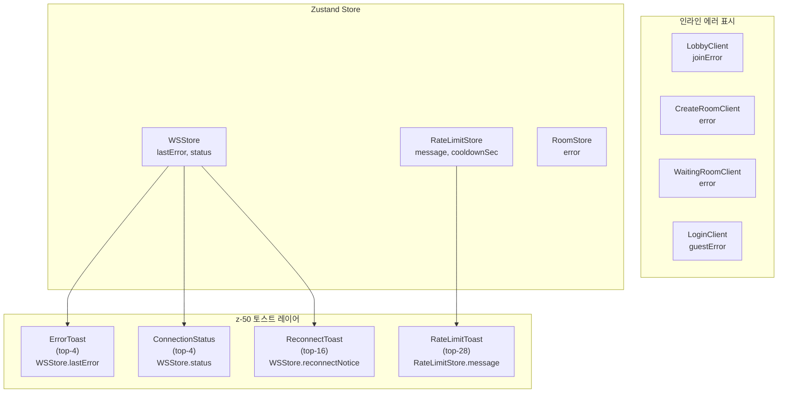

# Frontend 소스코드 리뷰 (2026-04-10)

> **리뷰 범위**: `src/frontend/src/` 전체 (62개 파일) + `src/admin/src/` (17개 파일)
> **기준 문서**: `docs/02-design/29-error-code-registry.md`
> **리뷰어**: Frontend Developer Agent

---

## 1. API 에러 핸들링 감사

### 1.1 레지스트리 vs 프론트엔드 처리 매핑

레지스트리에 정의된 모든 에러 코드를 프론트엔드 처리 현황과 대조한 결과:

#### HTTP Status 기반 처리

| HTTP Status | 레지스트리 코드 | 프론트엔드 처리 | 처리 위치 | 표시 방식 |
|:-----------:|----------------|:--------------:|-----------|-----------|
| 400 | `INVALID_REQUEST`, `GAME_NOT_PLAYING`, `NOT_ENOUGH_PLAYERS`, `INVALID_TIER`, `OAUTH_CODE_INVALID` | 부분 | `api.ts` L129-141 | `error.message` fallback 또는 하드코딩 |
| 401 | `UNAUTHORIZED`, `INVALID_ID_TOKEN` | 부분 | `api.ts` L129-141 | 서버 메시지 사용 |
| 403 | `FORBIDDEN` | 부분 | `api.ts` L129-141 | 서버 메시지 사용 |
| 404 | `NOT_FOUND` | 부분 | `api.ts` L129-141 | 서버 메시지 사용 |
| 409 | `GAME_ALREADY_STARTED`, `ALREADY_JOINED`, `ROOM_FULL`, `ALREADY_IN_ROOM` | 부분 | `api.ts` L129-141 | 서버 메시지 사용 |
| 422 | `NOT_YOUR_TURN`, `ERR_*` (14종) | WS에서 처리 | `useWebSocket.ts` L46-80 | 한글 매핑 + ErrorToast |
| **429** | **`AI_COOLDOWN`** | **명시적 분기** | `api.ts` L83-127 | RateLimitToast + 300초 쿨다운 |
| **429** | **`RATE_LIMITED`** | **명시적 분기** | `api.ts` L83-127 | RateLimitToast + 자동 재시도 |
| 500 | `INTERNAL_ERROR` | 간접 | `api.ts` L129-141 | 서버 메시지 또는 `API 오류: 500` |
| 503 | `OAUTH_DISABLED`, `JWKS_UNAVAILABLE` | 미처리 | - | 일반 에러 fallback |

#### WebSocket 에러 코드 기반 처리

| WS 코드 | 레지스트리 코드 | 프론트엔드 처리 | 처리 위치 |
|---------|----------------|:--------------:|-----------|
| S2C `ERROR` | `RATE_LIMITED` / `RATE_LIMIT` / `ERR_RATE_LIMIT` | 명시적 | `useWebSocket.ts` L429-458 |
| S2C `ERROR` | `INVALID_MESSAGE` | 간접 (일반 에러) | `useWebSocket.ts` L458 |
| S2C `INVALID_MOVE` | `ERR_*` 14종 | 명시적 매핑 | `useWebSocket.ts` L46-80 |
| WS Close 4001 | 인증 실패 | 명시적 | `useWebSocket.ts` L534 |
| WS Close 4002 | 방 없음 | 명시적 | `useWebSocket.ts` L535 |
| WS Close 4003 | 인증 시간 초과 | 명시적 | `useWebSocket.ts` L536 |
| WS Close 4004 | 중복 접속 | 명시적 | `useWebSocket.ts` L537 |
| WS Close 4005 | Rate Limit 종료 | 명시적 | `useWebSocket.ts` L538 |

### 1.2 미처리 에러코드

다음 에러 코드들은 프론트엔드에서 **명시적으로 분기 처리하지 않고** 일반 fallback에 의존한다:

| 코드 | HTTP | 미처리 영향도 | 설명 |
|------|:----:|:----------:|------|
| `OAUTH_DISABLED` | 503 | **Low** | 로그인 페이지에서 `hasGoogleProvider` 분기로 간접 처리됨. 503 응답은 일반 에러 fallback |
| `JWKS_UNAVAILABLE` | 503 | **Medium** | 인증 실패 시 사용자에게 "API 오류: 503 Service Unavailable" 표시. 기술적 메시지 |
| `INVALID_ID_TOKEN` | 401 | **Low** | next-auth JWT callback 내부에서 처리, fallback으로 access_token 사용 |
| `OAUTH_CODE_INVALID` | 400 | **Low** | next-auth 내부 처리. 사용자에게는 로그인 실패로 표시 |
| `ALREADY_IN_ROOM` | 409 | **Medium** | 서버 메시지에 의존하지만, 한글 안내가 보장되지 않음 |
| `INVALID_MESSAGE` (WS) | S2C ERROR | **Low** | 일반 에러 핸들러에서 `setLastError(payload.message)` 처리 |
| `ERR_NO_REARRANGE_PERM` | 422 (WS) | **Medium** | `INVALID_MOVE_MESSAGES`에 매핑 있으나 게임 엔진에서만 발생 |

### 1.3 하드코딩된 에러 메시지

프론트엔드에서 서버 응답을 사용하지 않고 직접 하드코딩한 에러 메시지 목록:

| 파일 | 위치 | 하드코딩 메시지 | 평가 |
|------|------|----------------|:----:|
| `api.ts` L59 | showRateLimitToast | `요청이 너무 빨랐습니다. {N}초 후 다시 시도합니다.` | 적절 |
| `api.ts` L103-108 | AI_COOLDOWN 분기 | `AI 게임은 5분에 1회만 생성할 수 있습니다.` | 적절 |
| `api.ts` L124-126 | 429 재시도 초과 | `요청이 너무 많습니다. {N}초 후에 다시 시도해주세요.` | 적절 |
| `api.ts` L137 | 일반 에러 fallback | `API 오류: {status} {statusText}` | **기술적** |
| `rankings-api.ts` L168 | 일반 에러 fallback | `API 오류: {status} {statusText}` | **기술적** |
| `useWebSocket.ts` L534-539 | WS Close 코드 | 5종 한글 메시지 | 적절 |
| `useWebSocket.ts` L580 | 재연결 최종 실패 | `서버와의 연결이 끊어졌습니다. 페이지를 새로고침하세요.` | 적절 |
| `useWebSocket.ts` L588 | WS onerror | `WebSocket 연결 오류가 발생했습니다.` | 적절 |
| `useWebSocket.ts` L441-445 | WS Rate Limit 단계별 | 3종 단계별 메시지 | 적절 |
| `GameClient.tsx` L642 | 클라이언트 검증 | `세트는 최소 3개 타일이 필요합니다` | 적절 |
| `GameClient.tsx` L654 | 클라이언트 검증 | `같은 색상 타일이 중복됩니다` | 적절 |
| `GameClient.tsx` L662 | 클라이언트 검증 | `유효하지 않은 조합입니다 (연속된 숫자가 아닙니다)` | 적절 |
| `GameClient.tsx` L667 | 클라이언트 검증 | `유효하지 않은 세트입니다` | 적절 |
| `LobbyClient.tsx` L244 | joinRoom 실패 | `방 참가에 실패했습니다.` | 적절 (fallback) |
| `CreateRoomClient.tsx` L92 | createRoom 실패 | `알 수 없는 오류가 발생했습니다.` | 적절 (fallback) |
| `WaitingRoomClient.tsx` L196 | getRoom 실패 | `방 정보를 불러올 수 없습니다.` | 적절 (fallback) |
| `WaitingRoomClient.tsx` L238 | startGame 실패 | `게임 시작에 실패했습니다.` | 적절 (fallback) |
| `LoginClient.tsx` L47 | 게스트 로그인 실패 | `게스트 로그인에 실패했습니다. 게임 서버 연결을 확인하세요.` | 적절 |

### 1.4 API 클라이언트 중복 코드 (rankings-api.ts)

`rankings-api.ts`에 `apiFetch` 함수가 `api.ts`와 **별도로 중복 구현**되어 있다:

- `api.ts`의 `apiFetch`: AI_COOLDOWN/RATE_LIMITED 분기, 쿨다운 시작, isRetrying 추적 포함
- `rankings-api.ts`의 `apiFetch`: 429 기본 처리만, AI_COOLDOWN 분기 **없음**, isRetrying **없음**, 서버 error.message 파싱 **없음**

**위험**: rankings-api에서 429 발생 시 AI_COOLDOWN과 RATE_LIMITED를 구분하지 못한다. rankings 관련 API에서 AI_COOLDOWN이 발생할 가능성은 낮지만, Rate Limiter 미들웨어의 429는 모든 엔드포인트에서 발생할 수 있다.

---

## 2. WebSocket 에러 핸들링

### 2.1 Close Code 처리

`useWebSocket.ts` L529-582에서 WebSocket close 이벤트를 처리한다:

| Close Code | 메시지 | 재연결 여부 | 평가 |
|:----------:|--------|:----------:|:----:|
| 1000 | (클라이언트 정상 종료) | N/A | 적절 |
| 4001 | `인증에 실패했습니다. 다시 로그인해주세요.` | 재연결 시도 | **주의** |
| 4002 | `게임 방을 찾을 수 없습니다.` | 재연결 시도 | **주의** |
| 4003 | `인증 시간이 초과되었습니다.` | 재연결 시도 | **주의** |
| 4004 | `다른 탭에서 같은 게임에 접속 중입니다.` | 재연결 시도 | **주의** |
| 4005 | `메시지를 너무 빠르게 보내서 연결이 제한되었습니다.` | 재연결 시도 | 적절 |
| 기타 | `서버와의 연결이 끊어졌습니다. 페이지를 새로고침하세요.` (5회 초과) | 재연결 시도 (5회) | 적절 |

**발견사항 [FE-WS-001]**: Close 4001/4002/4003/4004에서도 재연결을 시도하는데, 이 코드들은 재연결해도 동일 실패가 반복될 가능성이 높다:
- 4001 (인증 실패): 토큰이 유효하지 않으므로 재연결 무의미
- 4002 (방 없음): 방이 삭제되었으므로 재연결 무의미
- 4003 (인증 시간 초과): 재연결 시 새 인증을 시도하므로 의미 있을 수 있음
- 4004 (중복 접속): 다른 탭이 열려있으면 재연결해도 다시 4004

### 2.2 재연결 로직

```
reconnect 전략:
- 최대 5회 재시도 (MAX_RECONNECT_ATTEMPTS = 5)
- 지수 백오프: 3s, 6s, 12s, 24s, 48s (INITIAL_RECONNECT_DELAY_MS = 3000, 2x)
- 재연결 성공 시: reconnectAttemptCount 초기화, wsViolationCount 초기화
- 재연결 진행: ConnectionStatus 배너에 시도 횟수 + 카운트다운 표시
- 최종 실패: status = "disconnected", 에러 메시지 표시
```

**구현 품질**: 우수. 지수 백오프, 카운트다운 UI, 재연결 성공 시 상태 초기화가 모두 구현됨.

**보완점 [FE-WS-002]**: 재연결 중 네트워크 복구 감지(`navigator.onLine`, `online` 이벤트)를 사용하지 않는다. 오프라인 상태에서 불필요한 재연결 시도를 방지할 수 있다.

### 2.3 WS 메시지 파싱 실패 처리

`useWebSocket.ts` L127-131:
```typescript
try {
  msg = JSON.parse(event.data as string) as WSEnvelope;
} catch {
  console.warn("[WS] JSON parse error:", event.data);
  return;
}
```

**평가**: 파싱 실패 시 `console.warn`만 출력하고 무시한다. 사용자에게 알리지 않으며, 단순히 메시지를 드롭한다. 이는 적절한 전략이다 -- 단일 메시지 파싱 실패가 전체 세션에 영향을 주지 않아야 한다.

### 2.4 WS ERROR 메시지 처리

`useWebSocket.ts` L429-461에서 서버 S2C `ERROR` 메시지를 처리:

1. **Rate Limit 에러 (`RATE_LIMIT`, `ERR_RATE_LIMIT`, `RATE_LIMITED`)**: 3종 코드 모두 매칭, 위반 횟수 추적(max 2), 단계별 메시지, 스로틀 활성화
2. **일반 에러**: `setLastError(payload.message)` -- ErrorToast로 5초간 표시

**발견사항 [FE-WS-003]**: WS ERROR 코드가 3종(`RATE_LIMIT`, `ERR_RATE_LIMIT`, `RATE_LIMITED`)을 모두 체크하고 있는데, 레지스트리에 따르면 서버는 `RATE_LIMITED`만 사용한다. 나머지 2종은 레거시 호환 코드이다. 코드 정리 시 주석을 추가하여 의도를 명확히 하면 좋겠다.

---

## 3. 사용자 경험 관점

### 3.1 에러 메시지 품질

| 카테고리 | 메시지 품질 | 비고 |
|---------|:----------:|------|
| WS INVALID_MOVE (14종) | **우수** | 모든 엔진 에러 코드를 한글로 매핑 |
| WS Close Code (5종) | **우수** | 사용자 친화적 한글 메시지 |
| WS Rate Limit (3단계) | **우수** | 단계별 경고 강도 조절 |
| HTTP 429 AI_COOLDOWN | **우수** | 명확한 비즈니스 메시지 + 300초 쿨다운 시각화 |
| HTTP 429 RATE_LIMITED | **양호** | 자동 재시도 + 카운트다운 |
| HTTP 비-429 에러 | **미흡** | `api.ts`는 `error.message` 사용, `rankings-api.ts`는 `API 오류: {status}` 기술적 메시지 |
| 게임 클라이언트 검증 | **우수** | 직관적 한글 메시지 |
| 로그인/로비/대기실 | **양호** | fallback 메시지 사용 |

**기술적 메시지 노출 위치**:

1. `api.ts` L137: `API 오류: {status} {statusText}` -- 서버가 에러 바디를 보내지 않을 때 발생. 예: `API 오류: 500 Internal Server Error`
2. `rankings-api.ts` L168: 동일 패턴 -- 서버 에러 바디 파싱 없이 HTTP status만 표시

### 3.2 AI_COOLDOWN vs RATE_LIMITED 구분

#### api.ts (메인 API 클라이언트) -- 적절히 구분됨

```
429 수신
  -> JSON body 파싱
  -> body.code === "AI_COOLDOWN"?
     YES -> "AI 게임은 5분에 1회만 생성할 수 있습니다." + 300초 쿨다운
     NO  -> Rate Limit 처리 + 자동 재시도 (최대 2회)
```

**주의점 [FE-RL-001]**: `api.ts` L88-97에서 429 body 파싱 시, 서버 응답 포맷 불일치를 대비한다:
- ServiceError (`AI_COOLDOWN`): `{"error": {"code": "AI_COOLDOWN", "message": "..."}}`
- Middleware (`RATE_LIMITED`): `{"error": "RATE_LIMITED", "message": "...", "retryAfter": N}`

코드에서 `body.code ?? body.error`로 양쪽 포맷을 모두 처리하지만, 실제 ServiceError 포맷은 `{"error": {"code": ...}}`인 nested 구조다. 현재 코드의 타입 `body.code ?? body.error`는 flat 파싱만 하므로 **ServiceError의 `error.code`를 올바르게 추출하지 못할 가능성이 있다**.

그러나 실제 동작을 확인하면: ServiceError의 JSON이 `{"error": {"code": "AI_COOLDOWN", "message": "..."}}` 형태이므로, `body.error`는 `{"code": "AI_COOLDOWN", ...}` 객체가 되고 문자열이 아니다. `body.code`는 undefined이므로 `body.error`가 사용되는데, 이는 객체이므로 `errorCode`가 `"AI_COOLDOWN"` 문자열과 일치하지 않게 된다.

**이것은 잠재적 버그다**: ServiceError 포맷의 429 응답에서 `AI_COOLDOWN`을 올바르게 감지하려면 `body.error?.code`를 확인해야 한다. 현재 코드가 실제로 동작하는 이유는 아마도 서버가 `AI_COOLDOWN`일 때 flat 포맷으로 보내기 때문일 수 있으나, 레지스트리 문서와 일치하지 않는다.

**서버 코드 검증 완료 -- 버그 확인**:

- `room_handler.go` L306-313: `handleServiceError`는 `AI_COOLDOWN`을 `{"error": {"code": "AI_COOLDOWN", "message": "..."}}` (nested) 포맷으로 반환
- `rate_limiter.go` L182-186: `RATE_LIMITED`는 `{"error": "RATE_LIMITED", "message": "...", "retryAfter": N}` (flat) 포맷으로 반환

프론트엔드 코드에서 `body.error`는 AI_COOLDOWN 시 **객체** `{"code": "AI_COOLDOWN", ...}`이 되므로, `errorCode === "AI_COOLDOWN"` 비교가 **항상 false**다. 즉 AI_COOLDOWN이 RATE_LIMITED로 처리된다.

현재 개발 환경에서 `AI_COOLDOWN_SEC=0`이므로 이 코드 경로가 실행되지 않아 발견되지 않았다. 프로덕션(AI_COOLDOWN_SEC=300)에서 재현된다.

#### rankings-api.ts -- 구분 안 됨

`rankings-api.ts`의 `apiFetch`는 429에서 AI_COOLDOWN/RATE_LIMITED 구분 없이 일률적으로 Rate Limit 메시지를 표시한다. Rankings API에서 AI_COOLDOWN이 발생할 일은 없으므로 실질적 위험은 낮다.

#### useWebSocket.ts (WS) -- 적절히 구분됨

WS ERROR에서는 `RATE_LIMIT` / `ERR_RATE_LIMIT` / `RATE_LIMITED` 코드만 특별 처리하며, AI_COOLDOWN은 WS 채널로 전달되지 않으므로 해당 없다.

### 3.3 에러 복구 UX

#### 게임 중 에러 발생 시 복구 흐름

| 에러 상황 | 복구 가능 | UX 흐름 |
|----------|:--------:|---------|
| INVALID_MOVE | O | ErrorToast 5초 + pending 상태 자동 롤백 + RESET_TURN 전송 |
| WS 연결 끊김 (일시적) | O | ConnectionStatus 배너 + 자동 재연결 (5회) + 재연결 성공 시 GAME_STATE 수신 |
| WS 연결 끊김 (영구) | X | ConnectionStatus 배너 + "페이지를 새로고침하세요" |
| WS Rate Limit (1~2회) | O | 스로틀 활성화 + ThrottleBadge + 10초 후 자동 해제 |
| WS Rate Limit (3회=Close 4005) | 부분 | 연결 끊김 + 자동 재연결 시도 |
| HTTP 429 (RATE_LIMITED) | O | RateLimitToast + 자동 재시도 (2회) + 쿨다운 카운트다운 |
| HTTP 429 (AI_COOLDOWN) | 부분 | RateLimitToast + 300초 쿨다운 (재시도 안 함) |
| 턴 타임아웃 | O | 서버가 자동 드로우 처리, 클라이언트는 TURN_END로 상태 갱신 |
| 상대 기권/이탈 | O | PLAYER_DISCONNECTED 카운트다운 + PLAYER_FORFEITED + GAME_OVER |
| BUG-WS-001: TURN_START 미전송 | O | 2초 fallback 타이머로 자체 턴 시작 처리 |

#### 로딩 스피너 멈춤 문제 점검

| 컴포넌트 | 로딩 상태 | 해제 조건 | 무한 스피너 위험 |
|----------|----------|-----------|:---------------:|
| `LobbyClient` | `isLoading` | `finally` 블록에서 해제 | 없음 |
| `WaitingRoomClient` | `isLoading` | `finally` 블록에서 해제 | 없음 |
| `CreateRoomClient` | `submitting` | catch에서 해제, 성공 시 페이지 이동 | 없음 |
| `WaitingRoomClient` | `isStarting` | catch에서 해제, 성공 시 페이지 이동 | 없음 |
| `RankingsClient` | `isLoading` | `finally` 블록에서 해제 | 없음 |
| `UserRatingClient` | `isLoading` | `finally` 블록에서 해제 | **주의** |
| `LoginClient` | `loading` / `guestLoading` | signIn 후 redirect, catch에서 해제 | **주의** |

**[FE-UI-001]**: `UserRatingClient.tsx` L134-148: `Promise.all`에서 `getUserRating` 또는 `getRatingHistory` 중 하나가 실패하면 둘 다 실패하여 `rating`이 null인 채 "플레이어를 찾을 수 없습니다" 표시. 히스토리만 실패해도 전체 페이지가 에러 상태가 된다. `Promise.allSettled`를 사용하면 개별 실패를 처리할 수 있다.

**[FE-UI-002]**: `LoginClient.tsx` L21-24: `handleGoogleLogin`에서 `setLoading(true)` 후 `signIn("google")`을 호출하는데, 이 함수가 redirect를 수행하므로 `loading` 상태가 해제되지 않는다. 정상 흐름에서는 문제없지만, signIn이 에러를 throw하면 `loading`이 true인 채로 멈출 수 있다. try/catch가 없다.

---

## 4. 에러 관리 개선 권고

### P1: api.ts 429 body 파싱 버그 수정 (Critical)

**파일**: `src/frontend/src/lib/api.ts` L83-97

현재 코드:
```typescript
const body = (await res.clone().json()) as {
  error?: string;
  code?: string;
  message?: string;
};
errorCode = body.code ?? body.error ?? "RATE_LIMITED";
```

**문제**: ServiceError 포맷 `{"error": {"code": "AI_COOLDOWN", ...}}`에서 `body.error`는 객체이므로 `errorCode === "AI_COOLDOWN"` 비교가 실패한다.

**수정 제안**:
```typescript
const body = await res.clone().json();
const nested = body?.error;
errorCode =
  (typeof nested === "object" && nested?.code) ?? // ServiceError: {"error": {"code": ...}}
  body?.code ??                                    // flat: {"code": ...}
  (typeof nested === "string" ? nested : null) ??  // middleware: {"error": "RATE_LIMITED"}
  "RATE_LIMITED";
errorMessage =
  (typeof nested === "object" && nested?.message) ??
  body?.message ??
  "";
```

### P2: rankings-api.ts apiFetch 통합 (High)

**파일**: `src/frontend/src/lib/rankings-api.ts` L131-172

`api.ts`의 `apiFetch`와 중복 코드이며, AI_COOLDOWN 분기, isRetrying 추적, 서버 error.message 파싱이 누락되어 있다. 공통 `apiFetch`를 `api.ts`에서 export하여 재사용해야 한다.

### P3: 재연결 불가 Close Code 분류 (Medium)

**파일**: `src/frontend/src/hooks/useWebSocket.ts` L529-582

Close 4001(인증 실패), 4002(방 없음)에서 재연결을 시도해도 동일 에러가 반복된다. 이 코드들은 재연결 대신 즉시 사용자를 로비나 로그인으로 안내해야 한다.

**수정 제안**: 재연결 불가 코드 목록을 정의하고, 해당 코드면 재연결 시도를 건너뛴다:
```typescript
const NON_RECOVERABLE_CODES = new Set([4001, 4002]);
if (NON_RECOVERABLE_CODES.has(e.code)) {
  setStatus("disconnected");
  setLastError(closeMessage ?? "연결할 수 없습니다.");
  return; // 재연결 시도 안 함
}
```

### P4: UserRatingClient Promise.allSettled 적용 (Medium)

**파일**: `src/frontend/src/app/rankings/[userId]/UserRatingClient.tsx` L137-142

`Promise.all` 대신 `Promise.allSettled`를 사용하여 개별 API 실패를 독립적으로 처리해야 한다.

### P5: 에러 메시지 한글화 일관성 (Low)

`api.ts` L137과 `rankings-api.ts` L168에서 `API 오류: {status} {statusText}` 기술적 메시지를 사용한다. HTTP status별 한글 fallback 메시지를 추가하면 좋겠다:

```typescript
const STATUS_MESSAGES: Record<number, string> = {
  400: "요청이 올바르지 않습니다.",
  401: "로그인이 필요합니다.",
  403: "권한이 없습니다.",
  404: "요청한 정보를 찾을 수 없습니다.",
  409: "이미 처리된 요청입니다.",
  500: "서버에 일시적인 문제가 발생했습니다. 잠시 후 다시 시도해주세요.",
  503: "서비스가 일시적으로 중단되었습니다.",
};
```

### P6: 에러 토스트 겹침 방지 (Low)

현재 토스트 레이아웃:
- ErrorToast: `fixed top-4` (z-50)
- ReconnectToast: `fixed top-16` (z-50)
- RateLimitToast: `fixed top-28` (z-50)
- ConnectionStatus: `fixed top-4` (z-50)

**[FE-UI-003]**: ErrorToast와 ConnectionStatus가 **동일한 위치** (`top-4 left-1/2`)에 배치되어 있어 동시 표시 시 겹친다. ConnectionStatus가 표시되는 상태(connecting/reconnecting/disconnected/error)에서 ErrorToast도 함께 뜰 수 있으며, 이 때 두 요소가 겹쳐 가독성이 떨어진다.

### P7: LoginClient Google 로그인 에러 핸들링 (Low)

**파일**: `src/frontend/src/app/login/LoginClient.tsx` L21-24

`handleGoogleLogin`에서 `signIn("google")`에 대한 try/catch가 없다. signIn 호출 자체가 실패하면(네트워크 오류 등) 로딩 상태가 해제되지 않는다.

---

## 5. 발견사항 요약 (Critical/High/Medium/Low)

### Critical (1건)

| ID | 설명 | 파일 | 영향 |
|----|------|------|------|
| **FE-RL-001** | api.ts 429 body 파싱: 서버 AI_COOLDOWN 응답이 nested 포맷(`{"error":{"code":"AI_COOLDOWN"}}`)이므로 `body.error`가 객체가 되어 `=== "AI_COOLDOWN"` 비교가 항상 실패. **서버 코드 검증 완료, 버그 확정**. 개발 환경에서 AI_COOLDOWN_SEC=0이라 미발견 | `api.ts` L83-97 | AI_COOLDOWN이 RATE_LIMITED로 오인됨 (프로덕션 영향) |

### High (2건)

| ID | 설명 | 파일 | 영향 |
|----|------|------|------|
| **FE-DUP-001** | rankings-api.ts에 apiFetch 중복 구현: AI_COOLDOWN 분기, isRetrying 추적, 서버 error.message 파싱 누락 | `rankings-api.ts` L131-172 | Rankings API 429 시 사용자 경험 저하 |
| **FE-WS-001** | Close 4001/4002에서 불필요한 재연결 시도: 인증 실패/방 없음은 재연결해도 동일 에러 반복 | `useWebSocket.ts` L548-576 | 불필요한 대기 시간, 사용자 혼란 |

### Medium (4건)

| ID | 설명 | 파일 | 영향 |
|----|------|------|------|
| **FE-UI-001** | UserRatingClient Promise.all: 히스토리 API만 실패해도 전체 페이지가 에러 상태 | `UserRatingClient.tsx` L137-142 | 부분 데이터 표시 불가 |
| **FE-UI-003** | ErrorToast와 ConnectionStatus 위치 겹침 (둘 다 top-4 left-1/2) | `ErrorToast.tsx`, `ConnectionStatus.tsx` | 동시 표시 시 가독성 저하 |
| **FE-MSG-001** | HTTP 에러 fallback 메시지 "API 오류: 500 Internal Server Error" 기술적 메시지 노출 | `api.ts` L137, `rankings-api.ts` L168 | 사용자 혼란 |
| **FE-WS-002** | 오프라인 상태에서 불필요한 재연결 시도 (navigator.onLine 미활용) | `useWebSocket.ts` | 리소스 낭비 |

### Low (4건)

| ID | 설명 | 파일 | 영향 |
|----|------|------|------|
| **FE-WS-003** | WS ERROR 코드 3종(RATE_LIMIT, ERR_RATE_LIMIT, RATE_LIMITED) 중 서버 사용분은 1종(RATE_LIMITED)만. 레거시 코드 정리 필요 | `useWebSocket.ts` L432 | 코드 가독성 |
| **FE-UI-002** | LoginClient handleGoogleLogin에 try/catch 없음: signIn 실패 시 로딩 스피너 멈춤 | `LoginClient.tsx` L21-24 | 드문 에지케이스 |
| **FE-AUTH-001** | JWKS_UNAVAILABLE(503) 에러 시 "API 오류: 503" 기술적 메시지 노출 | `api.ts` fallback | 서비스 불가 시에만 발생 |
| **FE-ADMIN-001** | Admin API fetchApi: 에러 시 `HTTP {status}: {path}` 기술적 메시지이나, 관리자 전용이므로 수용 가능 | `admin/lib/api.ts` L76-85 | 관리자 전용 |

---

## 부록 A: 에러 표시 컴포넌트 아키텍처



## 부록 B: 에러 코드 전체 커버리지 매트릭스

| 에러코드 | HTTP/WS | 프론트 명시적 처리 | 한글 메시지 | 토스트/인라인 |
|---------|:-------:|:----------------:|:----------:|:------------:|
| NOT_FOUND | 404 | 서버 메시지 사용 | 서버 의존 | 인라인 |
| INVALID_REQUEST | 400 | 서버 메시지 사용 | 서버 의존 | 인라인 |
| UNAUTHORIZED | 401 | 서버 메시지 사용 | 서버 의존 | 인라인 |
| FORBIDDEN | 403 | 서버 메시지 사용 | 서버 의존 | 인라인 |
| NOT_YOUR_TURN | 422 | WS INVALID_MOVE | O | ErrorToast |
| GAME_NOT_PLAYING | 400 | 서버 메시지 사용 | 서버 의존 | 인라인 |
| NOT_ENOUGH_PLAYERS | 400 | 서버 메시지 사용 | 서버 의존 | 인라인 |
| GAME_ALREADY_STARTED | 409 | 서버 메시지 사용 | 서버 의존 | 인라인 |
| ALREADY_JOINED | 409 | 서버 메시지 사용 | 서버 의존 | 인라인 |
| ROOM_FULL | 409 | 서버 메시지 사용 | 서버 의존 | 인라인 |
| ALREADY_IN_ROOM | 409 | 서버 메시지 사용 | 서버 의존 | 인라인 |
| AI_COOLDOWN | 429 | **명시적 분기** | O | RateLimitToast |
| RATE_LIMITED (HTTP) | 429 | **명시적 분기** | O | RateLimitToast |
| RATE_LIMITED (WS) | WS ERROR | **명시적 분기** | O | RateLimitToast + ThrottleBadge |
| INTERNAL_ERROR | 500 | 서버 메시지/fallback | 부분 | 인라인 |
| OAUTH_DISABLED | 503 | 미처리 | X | fallback |
| JWKS_UNAVAILABLE | 503 | 미처리 | X | fallback |
| OAUTH_CODE_INVALID | 400 | next-auth 내부 | X | 로그인 실패 |
| INVALID_ID_TOKEN | 401 | next-auth 내부 | X | 로그인 실패 |
| INVALID_TIER | 400 | 서버 메시지/fallback | 부분 | 기술적 메시지 |
| ERR_INVALID_SET | 422 WS | **한글 매핑** | O | ErrorToast |
| ERR_SET_SIZE | 422 WS | **한글 매핑** | O | ErrorToast |
| ERR_GROUP_NUMBER | 422 WS | **한글 매핑** | O | ErrorToast |
| ERR_GROUP_COLOR_DUP | 422 WS | **한글 매핑** | O | ErrorToast |
| ERR_RUN_COLOR | 422 WS | **한글 매핑** | O | ErrorToast |
| ERR_RUN_SEQUENCE | 422 WS | **한글 매핑** | O | ErrorToast |
| ERR_RUN_RANGE | 422 WS | **한글 매핑** | O | ErrorToast |
| ERR_RUN_DUPLICATE | 422 WS | **한글 매핑** | O | ErrorToast |
| ERR_RUN_NO_NUMBER | 422 WS | **한글 매핑** | O | ErrorToast |
| ERR_NO_RACK_TILE | 422 WS | **한글 매핑** | O | ErrorToast |
| ERR_TABLE_TILE_MISSING | 422 WS | **한글 매핑** | O | ErrorToast |
| ERR_JOKER_NOT_USED | 422 WS | **한글 매핑** | O | ErrorToast |
| ERR_INITIAL_MELD_SCORE | 422 WS | **한글 매핑** | O | ErrorToast |
| ERR_INITIAL_MELD_SOURCE | 422 WS | **한글 매핑** | O | ErrorToast |
| ERR_NO_REARRANGE_PERM | 422 WS | **한글 매핑** | O | ErrorToast |
| INVALID_MESSAGE (WS) | WS ERROR | 일반 처리 | 서버 의존 | ErrorToast |

**커버리지**: 36개 에러코드 중 명시적 한글 매핑 20개 (56%), 서버 메시지 의존 12개 (33%), 미처리/기술적 fallback 4개 (11%)
