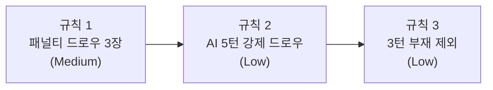

# 미구현 게임룰 3건 수정 계획서

> **작성**: Architect (Phase 1)
> **일자**: 2026-04-10
> **근거 문서**: `docs/02-design/06-game-rules.md`, `docs/02-design/31-game-rule-traceability.md` S2

---

## 규칙 1: 패널티 드로우 3장 (Medium)

### 문서 근거

`docs/02-design/06-game-rules.md` S6.1:

> "실패 시 스냅샷으로 복원 + 패널티 드로우 3장"

S6.4 재배치 검증 플로우 다이어그램에서도 스냅샷 롤백 + 패널티 드로우 3장이 명시되어 있다.

### 현재 동작 분석

**`service/game_service.go:321-327` (ConfirmTurn 실패 경로)**

```go
if err := engine.ValidateTurnConfirm(validateReq); err != nil {
    // Stateless 서버 원칙: 검증 실패 시 서버가 자동으로 스냅샷 복원
    if s.restoreSnapshot(state, gameID, req.Seat, playerIdx) {
        _ = s.gameRepo.SaveGameState(state)
    }
    return s.buildValidationFailResult(state, err),
           &ServiceError{Code: extractErrCode(err), Message: err.Error(), Status: 422}
}
```

현재 동작:
1. `engine.ValidateTurnConfirm()` 실패
2. `restoreSnapshot()` 호출 -- 랙과 테이블을 턴 시작 시점으로 복원
3. `SaveGameState()` -- 복원된 상태 영속화
4. HTTP 422 + `INVALID_MOVE` WS 메시지 반환
5. **턴이 종료되지 않는다** -- `CurrentSeat`가 변경되지 않아 해당 플레이어가 재시도 가능
6. **패널티 드로우 없음** -- 드로우 파일에서 타일을 뽑지 않는다

**`handler/ws_handler.go:435-448` (Human ConfirmTurn WS 핸들러)**

검증 실패 시 `S2CInvalidMove` 메시지만 전송하고 턴을 유지한다.

**`handler/ws_handler.go:950-961` (AI processAIPlace)**

AI 배치 검증 실패 시 `forceAIDraw()`를 호출하여 1장 강제 드로우 + 턴 종료한다.
패널티 3장이 아닌 일반 1장 드로우다.

**프론트엔드 `useWebSocket.ts:284-296`**

`INVALID_MOVE` 수신 시 `RESET_TURN` 전송 + 로컬 상태 롤백 + 에러 토스트 표시.
재시도를 허용하는 UX다.

### 설계 결정: "패널티 3장" 적용 시점

게임 규칙 문서를 정밀하게 읽으면, S5.1 턴 액션 다이어그램에서는 무효 배치 시 "스냅샷 롤백 + 턴 유지 (재시도)"로 되어 있고, S6.1/S6.4에서만 "패널티 드로우 3장"이 명시된다. 두 섹션의 차이:

- **S5.1 (일반 배치)**: 실패 -> 롤백 + 턴 유지 (재시도 허용)
- **S6.1/S6.4 (재배치 포함 배치, 턴 확정 시)**: 실패 -> 롤백 + 패널티 3장 + 턴 종료

그러나 S6.4 플로우차트를 보면, 모든 ConfirmTurn 실패 경로(랙 타일 미추가, 무효 세트, 타일 유실)가 동일하게 "스냅샷 롤백 + 패널티 드로우 3장"으로 합류한다. 즉, **ConfirmTurn 실패 = 패널티 3장 + 턴 종료**가 규칙의 의도다.

**권고**: 현재의 "재시도 허용" 동작을 **"패널티 3장 + 턴 종료"로 변경**한다. 이는 규칙 준수이자, 무한 재시도 남용 방지 효과도 있다.

### 수정 항목

| 파일:라인 | 현재 동작 | 변경 내용 | 이유 |
|----------|----------|----------|------|
| `service/game_service.go:321-327` | 롤백 후 422 반환, 턴 유지 | 롤백 + 드로우 파일에서 3장 뽑아 랙에 추가 + `advanceToNextTurn()` 호출 | 규칙 S6.1/S6.4 준수 |
| `service/game_service.go:42-48` (GameActionResult) | `ErrorCode` 필드만 존재 | `PenaltyDrawCount int` 필드 추가 | 프론트엔드에 패널티 정보 전달 |
| `handler/ws_handler.go:435-448` (handleConfirmTurn) | `S2CInvalidMove` 전송 후 리턴 | 패널티 적용된 결과를 `TURN_END`로 브로드캐스트 (action="PENALTY_DRAW") + `TURN_START` + 타이머 시작 | 턴이 종료되어야 함 |
| `handler/ws_handler.go:950-961` (processAIPlace) | `forceAIDraw()` -- 1장 드로우 | 별도 `penaltyDraw()` 함수 호출 -- 3장 드로우 + 턴 종료 | AI에게도 동일한 패널티 규칙 적용 |
| `handler/ws_message.go:148-163` (TurnEndPayload) | `IsFallbackDraw`, `FallbackReason` 필드 | `PenaltyDrawCount int` 필드 추가 | 프론트엔드가 패널티 여부를 표시 |
| `handler/ws_message.go:17 부근` (S2C 상수) | 없음 | 기존 `S2CInvalidMove` 유지하되, 패널티 결과는 `S2CTurnEnd`의 action="PENALTY_DRAW"로 전달 | 기존 프로토콜과 일관성 유지 |
| `service/game_service.go` (새 메서드) | 없음 | `penaltyDrawAndAdvance(state, playerIdx, count int)` 추가: DrawPile에서 min(count, len(DrawPile))장 뽑아 랙에 추가 + advanceToNextTurn | 로직 재사용 (Human, AI 공통) |

### 핵심 구현: penaltyDrawAndAdvance

```
func (s *gameService) penaltyDrawAndAdvance(state, gameID, seat, playerIdx, count) (*GameActionResult, error):
  1. drawCount = min(count, len(state.DrawPile))
  2. for i := 0; i < drawCount; i++:
       state.Players[playerIdx].Rack = append(Rack, state.DrawPile[0])
       state.DrawPile = state.DrawPile[1:]
  3. state.ConsecutivePassCount = 0  // 패널티도 게임 진행으로 간주
  4. 스냅샷 삭제 (snapshotKey)
  5. advanceToNextTurn(state)
  6. SaveGameState
  7. return result with PenaltyDrawCount = drawCount
```

### ConfirmTurn 실패 경로 변경

```
현재:
  ValidateTurnConfirm 실패 -> restoreSnapshot -> return 422 (턴 유지)

변경 후:
  ValidateTurnConfirm 실패 -> restoreSnapshot -> penaltyDrawAndAdvance(state, 3) -> return result (턴 종료)
```

### 파급 영향

1. **프론트엔드 (`useWebSocket.ts:284-296`)**:
   - `INVALID_MOVE` 핸들러에서 `RESET_TURN` 전송 + 재시도 UX 제거 필요
   - 대신 `TURN_END` 메시지의 `action="PENALTY_DRAW"` 수신 시 패널티 안내 토스트 표시
   - `TILE_DRAWN` 메시지를 3회 수신하거나, `TURN_END`에 패널티 정보 포함

2. **AI 플레이어 (`ws_handler.go:processAIPlace`)**:
   - `forceAIDraw()` 대신 패널티 3장 로직 호출
   - AI에게 패널티가 적용되면 규칙 2(5턴 연속 강제 드로우)의 카운터에도 영향

3. **기존 테스트 변경 필수**:
   - `TestConfirmTurn_InvalidMove_*` 시리즈 (5개): 현재는 에러 반환 + 턴 유지를 검증하나, 변경 후에는 패널티 3장 + 턴 종료를 검증해야 함
   - `TestConfirmTurn_InvalidMove_AutoRollback_*` (4개): 롤백은 동일하되, 추가로 랙에 3장이 추가되었는지 검증

4. **WS 핸들러 테스트**:
   - Human ConfirmTurn 실패 시 `S2CTurnEnd(action=PENALTY_DRAW)` 전송 검증
   - AI processAIPlace 실패 시 패널티 3장 적용 검증

### 엣지 케이스

| 케이스 | 처리 |
|--------|------|
| 드로우 파일에 3장 미만 (예: 1장) 남은 경우 | `min(3, len(DrawPile))`장만 뽑음. 0장이면 패스 처리 |
| 패널티 드로우 후 드로우 파일 소진 | 교착 판정 로직에 영향 없음 (ConsecutivePassCount는 0으로 리셋) |
| 연습 모드 (Stage 1-5) | 패널티 미적용. 연습 모드에서는 재시도 허용 유지 (practice_handler.go 별도 경로) |
| 교착 상태에서 패널티 드로우 | 드로우 파일 소진 시 패널티 타일은 0장. ConsecutivePassCount 리셋으로 교착 재판정 |

### 테스트 범위

**기존 테스트 수정 (필수)**:
- `game_service_test.go`: `TestConfirmTurn_InvalidMove_BelowThirty` (L315)
- `game_service_test.go`: `TestConfirmTurn_InvalidMove_InvalidSet_DuplicateColor` (L350)
- `game_service_test.go`: `TestConfirmTurn_InvalidMove_NonConsecutiveRun` (L388)
- `game_service_test.go`: `TestConfirmTurn_InvalidMove_TableTileLost` (L420)
- `game_service_test.go`: `TestConfirmTurn_InvalidMove_AutoRollback_RackRestored` (L1374)
- `game_service_test.go`: `TestConfirmTurn_InvalidMove_AutoRollback_TableRestored` (L1414)
- `game_service_test.go`: `TestConfirmTurn_InvalidMove_AutoRollback_NoSnapshot` (L1469)
- `game_service_test.go`: `TestConfirmTurn_InvalidMove_AutoRollback_SnapshotConsumed` (L1497)

**새 테스트 케이스 (추가)**:
- `TestConfirmTurn_InvalidMove_PenaltyDraw_ThreeTiles`: 패널티 3장 뽑기 + 턴 종료
- `TestConfirmTurn_InvalidMove_PenaltyDraw_DrawPileLessThanThree`: 1-2장만 남은 경우
- `TestConfirmTurn_InvalidMove_PenaltyDraw_DrawPileEmpty`: 0장 남은 경우 패스 처리
- `TestConfirmTurn_InvalidMove_PenaltyDraw_AdvanceTurn`: 다음 플레이어로 턴 전환 확인
- `TestConfirmTurn_InvalidMove_PenaltyDraw_AI`: AI processAIPlace 실패 시 패널티 3장

---

## 규칙 2: AI 5턴 연속 강제 드로우 -> 비활성화 (Low)

### 문서 근거

`docs/02-design/06-game-rules.md` S8.1:

> | 5턴 연속 강제 드로우 | 해당 AI 비활성화, 관리자 알림 |

### 현재 동작 분석

**`handler/ws_handler.go:865-892` (handleAITurn 실패 경로)**

```go
resp, err := h.aiClient.GenerateMove(ctx, req)
if err != nil {
    ...
    h.forceAIDraw(roomID, gameID, player.SeatOrder, reason)
    return
}
```

**`handler/ws_handler.go:979-1018` (forceAIDraw)**

```go
func (h *WSHandler) forceAIDraw(roomID, gameID string, seat int, reason string) {
    result, err := h.gameSvc.DrawTile(gameID, seat)
    ...
    h.broadcastTurnEndFromState(roomID, seat, state, "DRAW_TILE", 0, &FallbackInfo{
        IsFallbackDraw: true,
        FallbackReason: reason,
    })
    h.broadcastTurnStart(roomID, state)
    h.startTurnTimer(roomID, gameID, state.CurrentSeat, state.TurnTimeoutSec)
}
```

현재 동작:
1. AI 턴 실패 (타임아웃, 에러, 무효 수 등) -> `forceAIDraw()` 호출
2. 드로우 파일에서 1장 뽑기 (규칙 1 적용 후에는 패널티 3장이 될 수 있음)
3. `TURN_END` + `TURN_START` 브로드캐스트
4. **연속 강제 드로우 횟수를 추적하지 않는다**
5. **AI 비활성화 로직이 없다**

**추적해야 할 데이터**:
- `model/tile.go:62-76` (PlayerState 구조체)에 `ConsecutiveForceDrawCount int` 필드가 없음
- `GameStateRedis` (L38-50)에도 AI별 강제 드로우 카운터가 없음

### 수정 항목

| 파일:라인 | 현재 동작 | 변경 내용 | 이유 |
|----------|----------|----------|------|
| `model/tile.go:62-76` (PlayerState) | 강제 드로우 카운터 없음 | `ConsecutiveForceDrawCount int` 필드 추가 | AI별 연속 강제 드로우 추적 |
| `handler/ws_handler.go:979-1018` (forceAIDraw) | 단순 드로우 + 브로드캐스트 | 카운터 증가 + 5회 도달 시 `ForfeitPlayer()` 호출 + 관리자 알림 로그 | 규칙 S8.1 준수 |
| `handler/ws_handler.go:885-892` (handleAITurn 성공 경로) | 배치 성공 시 아무것도 하지 않음 | AI 배치 성공 시 해당 플레이어의 `ConsecutiveForceDrawCount = 0` 으로 리셋 | 연속 카운터이므로 성공 시 리셋 필수 |
| `handler/ws_handler.go:895-933` (processAIDraw) | 정상 드로우 처리 | 정상 draw도 카운터 리셋 (AI가 자발적으로 draw를 선택한 것은 정상 행동) | 강제(fallback)만 카운트 |
| `handler/ws_handler.go:936-973` (processAIPlace 성공) | 배치 성공 후 턴 진행 | 카운터 리셋 코드 추가 | 배치 성공은 정상 행동 |
| `handler/ws_message.go` (S2C 상수) | 없음 | `S2CAIDeactivated = "AI_DEACTIVATED"` + `AIDeactivatedPayload` 추가 | 프론트엔드에 AI 비활성화 알림 |
| `service/game_service.go:616-683` (ForfeitPlayer) | 기권 처리 | 이미 구현됨. 변경 불필요 | forceAIDraw에서 5회 도달 시 ForfeitPlayer 호출로 재사용 |

### 핵심 구현: forceAIDraw 수정

```
func (h *WSHandler) forceAIDraw(roomID, gameID, seat, reason):
  1. [기존] gameSvc.DrawTile(gameID, seat)
  2. [추가] state에서 해당 seat의 ConsecutiveForceDrawCount++
  3. [추가] gameSvc.SaveGameState(state)  -- 또는 별도 메서드
  4. [추가] if ConsecutiveForceDrawCount >= 5:
       h.logger.Warn("AI deactivated: 5 consecutive force draws")
       h.forfeitAndBroadcast(roomID, gameID, seat, userID, displayName, "AI_FORCE_DRAW_LIMIT")
       h.broadcastAIDeactivated(roomID, seat, reason)
       return  // 턴 종료 + 기권 처리가 이미 다음 턴을 진행함
  5. [기존] broadcastTurnEnd, broadcastTurnStart, startTurnTimer
```

### 카운터 위치 결정

**선택지 A**: `PlayerState.ConsecutiveForceDrawCount` (Redis 영속)
- 장점: Pod 재시작에도 유지, Stateless 원칙 준수
- 단점: Redis I/O 약간 증가

**선택지 B**: `WSHandler` 인메모리 맵 (`map[string]int`, key=gameID+seat)
- 장점: 구현 간단
- 단점: Pod 재시작 시 카운터 소실 (5턴 연속이므로 확률 낮지만 원칙 위반)

**권고**: 선택지 A (`PlayerState` 필드). Stateless 서버 원칙과 일치하고, 이미 PlayerState가 Redis에 직렬화되므로 추가 비용이 미미하다.

### 파급 영향

1. **Redis 직렬화**: `PlayerState`에 필드 추가 시 기존 Redis 데이터와의 하위 호환성 -- Go의 `json:"...,omitempty"` 또는 zero-value 기본값으로 자연 호환
2. **프론트엔드**: `AI_DEACTIVATED` WS 메시지 핸들러 추가 필요 (토스트 또는 플레이어 상태 표시)
3. **관리자 알림**: 현재 로깅만 수행. 카카오톡 API 알림은 Sprint 6 이후 별도 작업 (현재 범위 밖)
4. **processAIPlace 내 forceAIDraw 호출**: `ws_handler.go:961`에서 AI 배치 실패 시에도 forceAIDraw를 호출하므로, 해당 경로도 카운터에 포함됨 (의도된 동작)

### 엣지 케이스

| 케이스 | 처리 |
|--------|------|
| AI 강제 드로우 4회 + 정상 배치 1회 + 강제 드로우 1회 | 정상 배치에서 카운터 리셋. 이후 1회부터 재카운트 |
| AI 5회 도달 시 활성 플레이어 < 2 | `ForfeitPlayer()`가 자동으로 게임 종료 처리 (이미 구현) |
| 드로우 파일 소진 상태에서 강제 드로우 | `DrawTile()`이 패스 처리. 카운터는 증가 (패스도 강제 행동) |
| 규칙 1 적용 후: AI 패널티 3장도 "강제 드로우"인가? | 예. processAIPlace 실패 -> 패널티 3장 경로도 강제 행동이므로 카운터 증가 |

### 테스트 범위

**새 테스트 케이스 (추가)**:
- `TestForceAIDraw_CounterIncrement`: 강제 드로우 시 카운터 증가 확인
- `TestForceAIDraw_CounterReset_OnPlace`: 배치 성공 시 카운터 리셋
- `TestForceAIDraw_CounterReset_OnNormalDraw`: 정상 draw 시 카운터 리셋
- `TestForceAIDraw_FiveConsecutive_Forfeit`: 5회 도달 시 ForfeitPlayer 호출
- `TestForceAIDraw_FiveConsecutive_GameOverIfLastAI`: 비활성화로 활성 < 2 시 게임 종료
- `TestForceAIDraw_FourThenPlace_NoForfeit`: 4회 후 성공 시 비활성화 안 됨

---

## 규칙 3: 끊김 3턴 연속 부재 -> 제외 (Low)

### 문서 근거

`docs/02-design/06-game-rules.md` S8.2:

> | 3턴 연속 부재 | 게임에서 제외 |
> | 제외 후 남은 인원 < 2명 | 게임 자동 종료 (CANCELLED) |

### 현재 동작 분석

**`handler/ws_handler.go:1643-1724` (handleDisconnect + startGraceTimer)**

```go
func (h *WSHandler) handleDisconnect(conn *Connection) {
    // 게임 진행 중: DISCONNECTED 상태로 전환 + Grace Period 시작
    _ = h.gameSvc.SetPlayerStatus(conn.gameID, conn.seat, model.PlayerStatusDisconnected)
    h.startGraceTimer(conn.roomID, conn.gameID, conn.userID, conn.displayName, conn.seat)
}
```

**Grace Timer (`ws_handler.go:1687-1725`)**

```go
func (h *WSHandler) startGraceTimer(...) {
    go func() {
        <-time.After(gracePeriodDuration)  // 60초
        h.forfeitAndBroadcast(roomID, gameID, seat, userID, displayName, "DISCONNECT_TIMEOUT")
    }()
}
```

현재 동작:
1. 플레이어 연결 끊김 -> `DISCONNECTED` 상태 전환
2. 60초 Grace Period 시작
3. 60초 내 재연결 -> Grace Timer 취소, `ACTIVE` 상태 복원
4. 60초 초과 -> **즉시 기권 (FORFEITED)** 처리
5. **턴 기반 부재 추적 없음** -- 재연결되었지만 행동하지 않는 "부재" 상태를 추적하지 않음

**문서의 의도**: "3턴 연속 부재"는 재연결은 되었지만 턴이 올 때마다 타임아웃(아무 행동도 하지 않음)이 되는 상황을 의미한다. 현재는 60초 Grace Period이 유일한 보호 장치이며, 재연결 후 무한정 타임아웃을 반복해도 제외되지 않는다.

그러나 "끊김 후 3턴 연속 부재"를 더 넓게 해석하면: 연결이 끊긴 상태에서 3번의 턴이 해당 플레이어에게 돌아왔지만 부재(DISCONNECTED) 상태로 자동 드로우만 된 경우를 의미할 수도 있다.

**현재 턴 타임아웃 경로** (`ws_handler.go:1042-1099`): `HandleTimeout` -> 강제 드로우 + 턴 진행. 끊김 상태와 무관하게 동작한다.

### 설계 결정: "부재"의 정의

**권고**: `Status == DISCONNECTED`인 플레이어에게 턴이 돌아왔을 때를 "부재 턴"으로 카운트한다. 재연결 시 카운터 리셋.

이유:
- 연결된 상태에서 타임아웃을 반복하는 것은 "부재"가 아닌 "느린 플레이"이며, 이를 제외하면 UX에 악영향
- DISCONNECTED 상태에서 턴이 돌아오면 무조건 타임아웃 -> 자동 드로우이므로, 이것이 "부재"에 해당
- 60초 Grace Period은 1턴 단위 보호이고, 3턴 부재 규칙은 재연결 후에도 반복적으로 끊기는 불안정 연결에 대한 보호

### 수정 항목

| 파일:라인 | 현재 동작 | 변경 내용 | 이유 |
|----------|----------|----------|------|
| `model/tile.go:62-76` (PlayerState) | 부재 턴 카운터 없음 | `ConsecutiveAbsentTurns int` 필드 추가 | 플레이어별 연속 부재 턴 추적 |
| `handler/ws_handler.go:1042-1099` (startTurnTimer 타임아웃 goroutine) | 타임아웃 시 무조건 HandleTimeout 호출 | 타임아웃 발생 시 해당 seat의 Status가 DISCONNECTED이면 AbsentTurns++ 후 3회 도달 시 기권 처리 | 규칙 S8.2 준수 |
| `handler/ws_handler.go:175-177` (HandleWS 재연결 경로) | Grace Timer만 취소 | 재연결 시 `ConsecutiveAbsentTurns = 0`으로 리셋 | 재연결은 활성 복귀 |
| `handler/ws_handler.go:419-478` (handleConfirmTurn/handleDrawTile) | 정상 행동 처리 | Human 플레이어가 정상적으로 행동하면 카운터 리셋 | 정상 행동은 "부재"가 아님 |
| `service/game_service.go:686-706` (SetPlayerStatus) | 상태만 변경 | ACTIVE 전환 시 ConsecutiveAbsentTurns = 0으로 리셋 | Stateless 원칙: 상태 변경은 service에서 |

### 핵심 구현: 타임아웃 시 부재 판정

```
startTurnTimer goroutine 내부 (타임아웃 만료 시):
  1. state := gameRepo.GetGameState(gameID)
  2. playerIdx := findPlayerBySeat(state.Players, seat)
  3. if state.Players[playerIdx].Status == DISCONNECTED:
       state.Players[playerIdx].ConsecutiveAbsentTurns++
       gameRepo.SaveGameState(state)
       if ConsecutiveAbsentTurns >= 3:
         forfeitAndBroadcast(roomID, gameID, seat, ..., "ABSENT_3_TURNS")
         return
  4. [기존] HandleTimeout(gameID, seat)
  5. [기존] broadcastTurnEnd, broadcastTurnStart, startTurnTimer
```

**주의**: 위 로직은 startTurnTimer goroutine 안에서 실행되므로, `state` 읽기와 `HandleTimeout` 사이에 race condition이 없어야 한다. 현재 `HandleTimeout`은 `ResetTurn` + `DrawTile`을 순차 실행하므로, 부재 판정은 HandleTimeout 호출 전에 수행하고, 3턴 도달 시에만 HandleTimeout을 건너뛴다.

### 파급 영향

1. **프론트엔드**: `PLAYER_FORFEITED` 메시지의 `reason` 필드에 `"ABSENT_3_TURNS"` 추가. 기존 핸들러로 처리 가능 (UI 표시만 문구 변경)
2. **AI 플레이어**: AI는 DISCONNECTED 상태가 되지 않으므로 이 규칙에 영향받지 않음 (AI 비활성화는 규칙 2에서 별도 처리)
3. **Grace Period와의 상호작용**: Grace Period(60초)가 먼저 만료되면 즉시 기권. 재연결 후 DISCONNECTED 상태로 돌아가면 다시 카운터 시작. 두 메커니즘은 독립적으로 동작
4. **턴 타임아웃 값에 따른 동작**: 60초 타임아웃 기준, 3턴 부재 = 최대 180초. Grace Period(60초)가 먼저 만료되므로, 이 규칙은 "재연결 -> 다시 끊김 -> 재연결 -> 다시 끊김" 반복 패턴에서만 발동

### 엣지 케이스

| 케이스 | 처리 |
|--------|------|
| 연결 끊김 -> 재연결 -> 다시 끊김 (반복) | 재연결 시 카운터 리셋. 다시 끊기면 0부터 재카운트 |
| 연결 끊김 상태에서 타임아웃 3회 연속 | 3회째 타임아웃에서 기권 처리 (Grace Period보다 이 규칙이 먼저 적용될 가능성은 낮음) |
| Grace Period(60초)와 겹치는 경우 | Grace Period이 먼저 만료되면 그것이 우선. 3턴 부재는 Grace 내에서 턴이 3회 돌아온 경우에만 해당 |
| 2인 게임에서 1명 부재 -> 3턴 제외 -> 활성 < 2 | ForfeitPlayer가 자동 게임 종료 처리 (이미 구현) |
| 연습 모드 | 1인 모드이므로 적용 대상 없음 |

### 테스트 범위

**새 테스트 케이스 (추가)**:
- `TestDisconnectedPlayer_AbsentTurnCounter_Increment`: 타임아웃 시 DISCONNECTED 플레이어 카운터 증가
- `TestDisconnectedPlayer_AbsentTurnCounter_Reset_OnReconnect`: 재연결 시 카운터 리셋
- `TestDisconnectedPlayer_ThreeAbsent_Forfeit`: 3턴 부재 시 기권 처리
- `TestDisconnectedPlayer_ThreeAbsent_GameOver`: 기권으로 활성 < 2 시 게임 종료
- `TestDisconnectedPlayer_ActivePlayer_NoAbsentCount`: 연결된 상태 타임아웃은 카운터 미증가
- `TestDisconnectedPlayer_TwoAbsent_Reconnect_Reset`: 2턴 부재 후 재연결 -> 리셋 확인

---

## 구현 순서 권고



### 순서 근거

1. **규칙 1을 먼저**: `ConfirmTurn` 실패 경로를 근본적으로 변경하기 때문에, 다른 규칙의 기반이 된다. 특히 AI의 `processAIPlace` 실패 시 패널티 3장 적용 여부가 규칙 2의 카운터 동작에 영향을 미친다.

2. **규칙 2는 규칙 1 이후**: 규칙 1에서 AI 패널티 경로가 확정된 후에 "강제 드로우"의 정의가 명확해진다. 패널티 3장도 "강제 행동"으로 카운트할지 여부가 규칙 1의 구현에 따라 결정된다.

3. **규칙 3은 마지막**: 가장 독립적이며, 규칙 1/2와 데이터 의존성이 없다. `PlayerState` 필드 추가는 규칙 2와 함께 한 번에 하는 것이 효율적이다.

### 단계별 작업량 예측

| 규칙 | Go 변경 파일 수 | 테스트 변경/추가 | 프론트엔드 변경 | 예상 작업 시간 |
|------|----------------|----------------|----------------|---------------|
| 규칙 1 | 3 (game_service, ws_handler, ws_message) | 기존 8개 수정 + 5개 추가 | useWebSocket.ts + ErrorToast | 2-3h |
| 규칙 2 | 3 (tile.go, ws_handler, ws_message) | 6개 추가 | 메시지 핸들러 1개 추가 | 1-2h |
| 규칙 3 | 3 (tile.go, ws_handler, game_service) | 6개 추가 | 없음 (기존 PLAYER_FORFEITED 재사용) | 1-2h |

---

## Dev에게 전달할 주의사항

### 1. GameActionResult의 반환 계약 변경 (규칙 1, 가장 중요)

현재 `ConfirmTurn`은 검증 실패 시 `(result, error)` 형태로 반환하며, error가 nil이 아니면 호출자(ws_handler)가 실패로 처리한다. 규칙 1 적용 후에는 **검증 실패도 성공적인 결과 (패널티 적용 + 턴 종료)**가 되므로, 반환 계약이 변경된다.

**방안 A**: `ConfirmTurn`에서 검증 실패 시 패널티를 적용하고 `(result, nil)`을 반환. result에 `ErrorCode`가 남아있으므로 호출자가 패널티 여부를 판별 가능.

**방안 B**: 새로운 메서드 `ConfirmTurnWithPenalty`를 만들고, 기존 `ConfirmTurn`은 유지 (하위 호환). REST API 핸들러에서는 기존 동작 유지.

**권고**: 방안 A. 기존 REST API 핸들러(`game_handler.go`)가 `ConfirmTurn`을 호출하는 곳이 있다면 함께 수정해야 하므로 확인 필수.

### 2. PlayerState 필드 추가 시 Redis 호환성 (규칙 2, 3)

`ConsecutiveForceDrawCount`와 `ConsecutiveAbsentTurns` 필드를 추가할 때 `json:"...,omitempty"`가 아닌 일반 태그로 선언해야 한다. 0값일 때도 명시적으로 직렬화되어야 카운터 리셋이 확실하다. 다만 기존 Redis 데이터에 해당 필드가 없으면 Go의 json.Unmarshal이 0으로 초기화하므로 하위 호환 문제는 없다.

```go
ConsecutiveForceDrawCount int `json:"consecutiveForceDrawCount"`  // omitempty 사용하지 않음
ConsecutiveAbsentTurns    int `json:"consecutiveAbsentTurns"`     // omitempty 사용하지 않음
```

### 3. forceAIDraw에서 state 접근 문제 (규칙 2)

현재 `forceAIDraw`는 `gameSvc.DrawTile()`의 반환값에서 `result.GameState`를 사용한다. 카운터를 증가시키려면 `DrawTile()` 이후의 state에서 해당 playerIdx를 찾아 카운터를 수정하고, 다시 `SaveGameState()`를 호출해야 한다. 이것은 `DrawTile()` 내부에서 이미 `SaveGameState()`를 호출한 후이므로, 중복 저장이 발생한다.

**대안**: `DrawTile()`에 옵션으로 penalty/forceDraw 정보를 전달하거나, `forceAIDraw`에서 DrawTile 호출 후 별도로 카운터만 업데이트하는 경량 메서드를 추가한다.

### 4. broadcastTurnStart와 AI 턴 자동 시작의 상호작용 (규칙 2)

`broadcastTurnStart()`는 다음 턴 플레이어가 AI이면 즉시 `go handleAITurn()`을 시작한다 (`ws_handler.go:760-762`). AI가 비활성화(FORFEITED)되면 `advanceTurn()`이 해당 AI를 건너뛰므로, `broadcastTurnStart`에서 다시 AI 턴을 시작하지 않는다. 이 흐름이 정상 동작하는지 반드시 테스트해야 한다.

### 5. 프론트엔드 INVALID_MOVE 핸들러 제거 주의 (규칙 1)

규칙 1 적용 후 Human의 ConfirmTurn 실패 시 `S2CInvalidMove` 대신 `S2CTurnEnd(action=PENALTY_DRAW)`가 전송된다. 기존 `INVALID_MOVE` 핸들러(`useWebSocket.ts:284-296`)에서 `RESET_TURN` 전송 + 로컬 롤백 로직을 제거하고, 대신 TURN_END 핸들러에서 `action === "PENALTY_DRAW"` 분기를 추가해야 한다.

그러나 **`INVALID_MOVE` 메시지 타입 자체는 제거하지 말 것** -- REST API(`game_handler.go`)에서의 검증 실패 응답에 여전히 사용될 수 있다.

### 6. 기존 E2E 테스트 영향 (규칙 1)

현재 390개 E2E 테스트 중 Human 배치 실패 시나리오가 있다면 깨질 수 있다. 특히 `INVALID_MOVE` 수신을 검증하는 테스트는 `TURN_END(PENALTY_DRAW)` 수신으로 변경해야 한다. 영향 범위를 `grep -r "INVALID_MOVE" src/frontend/e2e/`로 사전 확인할 것.

### 7. 문서 갱신 필수

구현 완료 후 반드시 갱신해야 할 문서:
- `docs/02-design/31-game-rule-traceability.md` S2 "비검증 규칙" -> S1로 이동
- `docs/02-design/29-error-code-registry.md` -- 새 에러 코드/메시지 타입 등록
- `docs/02-design/08-api-design.md` -- ConfirmTurn 응답 스키마 변경 반영
