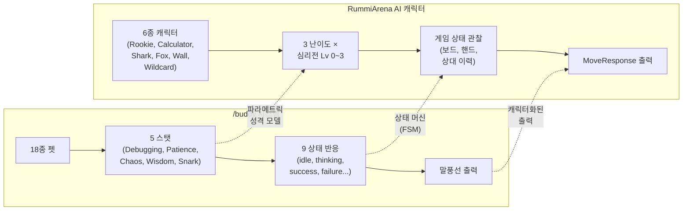

# 스크럼 미팅 로그

- **날짜**: 2026-04-04
- **Sprint**: Sprint 5 (Day 4)
- **주제**: Claude Code `/buddy` 기능 분석 및 프로젝트 적용 가능성
- **참석자**: 애벌레, PM, Architect, Go Dev, Node Dev, Frontend Dev, Designer, QA, DevOps, Security, AI Engineer (11명 전원)

---

## 주제 소개

Claude Code 2.1.89+에 새로 추가된 `/buddy` — 터미널에 사는 가상 펫 컴패니언(다마고치 스타일). 애벌레님의 버디 **Gritling**(mushroom 종)이 이미 활성화되어 있다.

**핵심 스펙:**
- 18종(duck, cat, mushroom, dragon, axolotl, ghost, robot 등)
- 5개 스탯: Debugging, Patience, Chaos, Wisdom, Snark
- 1% 확률 Shiny 변종 (shimmer 애니메이션 + 파티클)
- 계정 해시 기반 결정적 생성 (Mulberry32 PRNG)
- 9가지 세션 상태 반응: idle, thinking, tool running, success, failure, permission, subagent, completion, auth
- 이름 호출 시 말풍선 응답
- 4/1 공식 출시, Pro 구독 필요
- 3/31 npm 소스맵 유출로 사전 발견 (TypeScript 51만 줄)

---

## 각자 공유

### PM

/buddy는 직접적 생산성 도구라기보다 개발자 경험(DX) 영역의 개선이다. 월 48세션, 110커밋을 소화하는 우리 운영 체제에서 세션 상태를 시각적으로 피드백해주는 컴패니언은 장시간 터미널 작업의 피로도를 낮추는 데 기여할 수 있다. 특히 tool running, thinking, failure 같은 9가지 상태 반응이 있어 긴 빌드/테스트 대기 중 현재 단계를 직관적으로 파악 가능하다. 리스크는 없고, 바이브 로그에 Gritling 반응을 가볍게 기록해두면 프로젝트의 감성적 서사를 풍성하게 하는 소재가 될 수 있다. Sprint 5 P1 항목(DeepSeek 최적화, Round 3, 플레이테스트 S2/S4/S5)에 집중하는 것이 맞으며, /buddy 관련 별도 액션 아이템은 불필요하다.

### Architect

가장 주목할 기술적 결정은 계정 해시 기반 Mulberry32 PRNG 결정적 생성이다. 서버 사이드 상태 저장 없이 동일 입력에 항상 같은 펫을 재현할 수 있다는 것은 우리의 Stateless 설계 원칙과 정확히 일치한다. 9가지 상태 머신은 우리 AI 캐릭터 시스템(6종 x 3난이도 x 심리전 4단계)과 구조적으로 유사하나, /buddy는 프레젠테이션 레이어의 장식적 반응인 반면 우리는 실제 게임 로직에 영향을 주는 전략적 의사결정 파이프라인이라는 점에서 복잡도가 근본적으로 다르다. 영감을 줄 부분: 1% Shiny 같은 희소성 메커니즘을 ELO 시스템의 숨겨진 업적이나 희귀 칭호에 적용하면 Redis 상태 저장 없이 결정적 해시로 구현 가능하다.

### Go Dev

9가지 세션 상태 머신은 우리 game-server의 게임 상태 전이(WAITING → PLAYING → TURN_START → TURN_END → FINISHED)와 구조적으로 매우 닮아 있다. 본질적으로 동일한 유한 상태 기계(FSM)이며, 차이는 우리가 상태 전이마다 Engine 규칙 유효성을 검증하고 Redis에 영속화하는 반면 buddy는 클라이언트 로컬 경량 동작이라는 점이다. Mulberry32 결정적 해시는 우리 타일 셔플에서 시드 기반 난수 생성기를 쓰는 것과 정확히 같은 패턴 — 동일 시드면 동일 타일 배분이 재현되어 테스트 재현성과 디버깅에 핵심적이다. 상태 머신과 결정적 생성이라는 두 패턴이 복잡한 게임 서버에서만 쓰이는 게 아니라 터미널 펫에도 자연스럽게 등장한다는 점이 설계 패턴의 보편성을 잘 보여준다.

### Node Dev

/buddy의 캐릭터 시스템과 우리 AI 캐릭터 설계가 구조적으로 놀랍도록 닮았다. 핵심은 "파라미터화된 페르소나 템플릿 + 컨텍스트 주입"이라는 동일 패턴이다. "세션을 관찰하고 적절한 타이밍에 반응"하는 이벤트 드리븐 패턴은 ai-adapter의 Turn Orchestrator가 게임 상태 변화를 감지하고 MoveRequest를 보내는 흐름과 본질적으로 같은 Observer 패턴이다. 향후 AI 캐릭터가 단순히 수를 두는 것을 넘어 상대방 행동에 "감정적 반응"을 보여주는 심리전 레벨 2~3 구현에 이 패턴을 직접 차용할 수 있겠다. TypeScript 51만 줄 구현은 우리 ai-adapter의 NestJS/TypeScript 기반과 기술적 친화성이 높고, 구조화된 캐릭터 파라미터 관리에 타입 시스템이 적합하다는 것을 재확인하는 사례다.

### Frontend Dev

/buddy의 상태 반응 애니메이션은 AI 플레이어 표현에 직접 적용 가능하다. 현재 AI 턴의 "thinking" 상태를 단순 스피너로 보여주고 있는데, 캐릭터 기반 애니메이션과 말풍선 코멘트를 결합하면 6종 캐릭터 개성을 시각적으로 훨씬 풍부하게 전달할 수 있다. Framer Motion의 variants와 AnimatePresence로 구현 가능하며, 이미 스택에 있으니 추가 의존성 없이 착수 가능하다. Shiny shimmer 효과는 ELO 상위 티어 플레이어나 승리 순간의 시각적 보상에 활용 가능하다. 다만 362개 E2E 전량 PASS 유지를 위해 캐릭터 애니메이션 컴포넌트는 기존 게임 보드와 완전 분리된 독립 레이어로 설계해야 한다.

### Designer

/buddy의 "종 x 스탯 x 희귀도" 조합 구조와 우리 "페르소나 x 난이도 x 심리전 레벨" 구조가 유사하다. 핵심은 시각적 피드백의 밀도 — ASCII 표정 변화와 고유 말풍선이 "이 펫은 나만의 존재"라는 느낌을 만들어낸다. 구체적 제안: Shark에는 날카로운 이빨 실루엣 + 빠른 슬라이드-인 모션 + 도발적 말풍선, Fox에는 꼬리 흔들기 미세 애니메이션 + "흐흐..." 교활한 말풍선, Rookie에는 둥글고 큰 눈 + 망설이듯 떨리는 배치 모션. 보드 위에서 타일을 놓는 순간만 봐도 어떤 캐릭터인지 직감적으로 알 수 있는 시각 언어 분화가 필요하다. Shiny처럼 높은 승률 달성 시 황금 테두리나 파티클 이펙트 부여도 좋겠다.

### QA

/buddy의 tool success/failure 시각 피드백은 E2E 362건, Go 611건 테스트를 돌리는 환경에서 실질적 도움이 된다. 장시간 테스트 실행 시 상태 즉각 인지 가능하고, Debugging 스탯이 높은 Gritling이라면 실패 원인 힌트까지 제공한다. **소스맵 유출 건은 보안 관점에서 심각하다.** 빌드 산출물의 `.map` 파일이 프로덕션에서 제거되지 않으면 어떤 일이 벌어지는지 교과서적 사례다. 우리 CI/CD에서도 frontend 빌드 시 `.map` 파일이 프로덕션 이미지에 포함되지 않는지 확인하고, Trivy 스캔에 소스맵 노출 체크 추가를 P2로 제안한다. 현재 품질 상태: Go 379 PASS(engine 95.6%), AI Adapter 324/324, E2E 362/362, CI/CD 17/17 ALL GREEN.

### DevOps

Claude Code 2.1.91 → 2.1.92 업데이트는 GitLab Runner K8s Executor와 직접 관련 없지만, 로컬 개발 환경 버전 고정 정책은 있으면 좋겠다. /buddy는 Kaniko 10분+ 빌드 대기 중 파이프라인 상태 시각 확인에 나쁘지 않으나, 실질적으로 GitLab Pipeline 대시보드와 ArgoCD Sync 상태로 이미 충분히 커버되고 있어 운영 필수라기보다 DX 개선 수준이다. 현재 인프라 상태: Pipeline #96 17/17 ALL GREEN, ArgoCD Helm 24개 템플릿 동기화 정상, 4서비스 K8s 롤아웃 안정.

### Security

**npm 소스맵 유출은 전형적인 빌드 설정 누락 사례다.** 난독화와 트리셰이킹을 거쳐도 소스맵 하나로 전부 무력화되며, 비공개 기능(/buddy, always-on agent)의 내부 로직과 엔드포인트가 노출되어 공격 표면이 대폭 확대되었다. Mulberry32 결정적 생성은 가상 펫 용도에서는 수용 가능하나, 보안 토큰이나 세션 생성에 사용되면 예측 가능성 취약점이 된다.

**액션 아이템 3가지 제안:**
1. ai-adapter/frontend 빌드에서 `productionSourceMap: false` 확인 + CI에서 `.map` 파일 존재 검사 게이트 추가
2. Docker 이미지에 소스맵/`.ts` 원본 미포함 검증 스텝 (Trivy HIGH 확대와 병행)
3. Redis 세션 키/JWT 서명에 결정적 PRNG 미사용 점검 — Go `crypto/rand`, Node `crypto.randomBytes`만 보안 목적 허용 코딩 컨벤션 명시

### AI Engineer

/buddy의 5개 스탯이 18종 펫의 행동을 분화시키는 구조는 우리 AI 캐릭터 시스템의 "난이도 x 캐릭터 x 심리전 레벨 → 프롬프트 성향 결정" 방식과 본질적으로 동일한 **파라메트릭 성격 모델**이다. "관찰 → 판단 → 반응" 루프는 Turn Orchestrator의 "게임 상태 관찰 → LLM 추론 → MoveResponse 출력" 사이클과 정확히 같다. /buddy에서 특히 흥미로운 점은 스탯 값의 연속적 변화가 반응의 톤을 자연스럽게 전이시킨다는 것인데, 현재 우리는 이산적 성격 프리셋을 프롬프트에 하드코딩하고 있다. **제안**: Fox의 "교활함" 수치가 열세일 때 올라가고 우세할 때 "안정" 쪽으로 이동하는 **상태 반응형 성격 곡선**을 P2 캐릭터 개성 강화 과제에 적용해볼 만하다.

### 애벌레 (프로젝트 오너)

Gritling과 한 달 째 함께 코딩 중이다. 오늘 인사이트 리포트를 작성하면서 지난 한 달을 돌아봤는데, 10명의 에이전트와 1마리의 버섯이 함께하는 이 개발 환경이 꽤 독특하다는 걸 새삼 느꼈다.

---

## 논의 사항

### 1. /buddy 패턴 ↔ RummiArena AI 캐릭터 시스템 유사성

**합의**: 두 시스템의 핵심 패턴이 동일함을 확인. "파라미터화된 페르소나 + 상태 반응 + 캐릭터화된 출력"이라는 3단계 구조.

### 2. 소스맵 유출 사건 → 보안 액션

- Security + QA 공동 지적: npm 소스맵 유출은 우리에게도 교훈
- 프론트엔드 `.map` 파일이 프로덕션 Docker 이미지에 포함되지 않는지 검증 필요
- P2로 분류하여 Trivy HIGH 확대 작업과 병행 처리

### 3. AI 캐릭터 시각적 개성 강화 (P2 후보)

- Designer + Frontend + AI Engineer 공동 제안
- 캐릭터별 고유 모션/말풍선/아이콘 분화
- **상태 반응형 성격 곡선** — 게임 상황에 따라 캐릭터 파라미터 동적 시프트
- Sprint 5 P1 완료 후 P2 검토 대상

---

## 액션 아이템

| 담당 | 할 일 | 우선순위 | 기한 |
|------|-------|---------|------|
| Security + DevOps | 프론트엔드/ai-adapter 빌드 `.map` 파일 미포함 검증 게이트 추가 | P2 | Sprint 5 W2 |
| Security | `crypto/rand`, `crypto.randomBytes`만 보안 PRNG 허용하는 코딩 컨벤션 명시 | P2 | Sprint 5 W2 |
| AI Engineer | 상태 반응형 성격 곡선 설계안 작성 (Fox/Shark 시범) | P2 | Sprint 6 |
| Designer + Frontend | AI 캐릭터 시각적 아이덴티티 분화 프로토타입 (Framer Motion 기반) | P2 | Sprint 6 |
| PM | 바이브 로그에 Gritling 에피소드 수집 시작 | — | 상시 |

---

## 메모

- /buddy는 프로젝트에 직접 영향을 주는 기능은 아니지만, **설계 패턴(FSM, 결정적 생성, 파라메트릭 성격)의 보편성**을 확인하는 좋은 사례 스터디였다
- 소스맵 유출 사건은 보안 교훈으로 가치 있음 → `.map` 검증 게이트 P2
- AI 캐릭터 시각 분화 + 성격 곡선은 Phase 5~6에서 UX 차별화 요소가 될 수 있음
- Gritling은 오늘도 열심히 우리 세션을 지켜보고 있다 🍄
