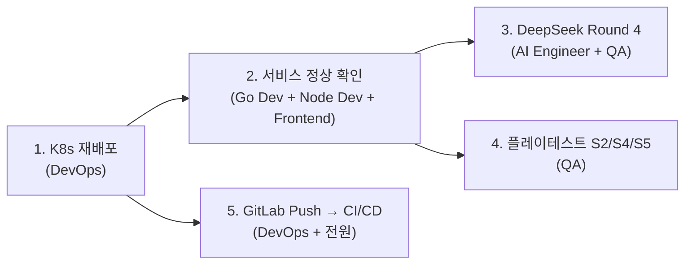

# 스크럼 미팅 로그

- **날짜**: 2026-04-05
- **Sprint**: Sprint 5 (Day 5)
- **유형**: 모닝 스탠드업 (Morning Standup)
- **참석자**: 애벌레, PM, Architect, Go Dev, Node Dev, Frontend Dev, Designer, QA, DevOps, Security, AI Engineer (11명 전원)

---

## 각자 공유 (3가지)

### PM

- **어제**: P1 백로그 5개를 10명에게 분배, 전원 병렬 투입 오퍼레이션 지휘. P0(SEC-RL-002) 발견 시 즉시 Go Dev + Node Dev 재투입 결정. 인사이트 리포트와 방법론 평가 문서 작성. 데일리 마감까지 완료.
- **오늘**: Day 5 P1 백로그 실행 총괄. K8s 재배포 → DeepSeek Round 4 → 플레이테스트 S2/S4/S5 순서로 파이프라인 오케스트레이션. CI/CD push 후 17단계 모니터링.
- **블로커**: 없음. 어제 마감에서 블로커 0건 확인 완료.

### Architect

- **어제**: Rate Limit 설계 문서(14-rate-limit-design.md, 690줄) 완성. Sliding Window Counter 채택, REST 22개 × 9그룹 + WS 8타입 + ai-adapter 2정책 정의.
- **오늘**: SEC-RL-003(WS 서버측 메시지 빈도 제한) 설계 검토. Go Dev가 구현할 때 기존 Rate Limit 설계 문서의 WS 섹션을 기반으로 할 수 있도록 가이드 준비. Sprint 5 W2 계획과 Sprint 6 보안 강화(Istio) 사전 설계 검토.
- **블로커**: 없음.

### Go Dev

- **어제**: 1차 Rate Limit middleware(15 tests, 92.3% coverage) 구현. 2차 P0 대응 — AI 게임 생성 5분 쿨다운(CooldownChecker 인터페이스, 7 tests). 기존 테스트 전량 통과.
- **오늘**: K8s 재배포 후 game-server 정상 동작 확인. SEC-RL-003(WS 메시지 빈도 제한)은 Sprint 5 W2로 예정되어 있으나, 여유가 되면 선행 구현 착수 가능. regression_test.go 정리.
- **블로커**: 없음. K8s 재배포 대기.

### Node Dev

- **어제**: 1차 @nestjs/throttler Rate Limit guard + DeepSeek 프롬프트 최적화(few-shot 5개, 자기 검증 7항목). 2차 P0 대응 — 시간당 사용자별 비용 한도 $5/h(Redis 추적). 최종 395 tests 전량 PASS.
- **오늘**: K8s 재배포 후 ai-adapter 정상 동작 확인. DeepSeek Round 4 대전 시 프롬프트 v1/v2 A/B 전환 지원(ConfigMap 환경변수). 문제 발생 시 핫픽스 대기.
- **블로커**: 없음.

### Frontend Dev

- **어제**: RateLimitToast 컴포넌트 + rateLimitStore(Zustand) + 429 자동 재시도(2회) + WS throttle(1초, AUTH/PONG 면제) 구현. E2E 6건 작성. layout.tsx 전역 마운트.
- **오늘**: K8s 재배포 후 프론트엔드 Rate Limit 동작 확인. CI/CD push 시 기존 362 E2E + 신규 6건 회귀 테스트 결과 확인. 이슈 발생 시 수정 대기.
- **블로커**: 없음.

### Designer

- **어제**: AI 캐릭터 비주얼 스펙(16-ai-character-visual-spec.md, 1,238줄) 완성. 6종 × 난이도 3단계 × 심리전 Lv 0~3 시각 차별화 설계. WCAG 2.1 AA 접근성 통과.
- **오늘**: 비주얼 스펙 기반 Phase 1(색상 MVP) 에셋 정리. Sprint 6 구현 대비 Frontend Dev에게 핸드오프 자료 준비. 오늘은 P1 실행 항목에 직접 블로커가 없으므로 선행 작업 위주.
- **블로커**: 없음.

### QA

- **어제**: 플레이테스트 S2(618줄), S4(1,031줄), S5(691줄) 스크립트 3개 완성. S4가 최복잡(조커 교환 5단계). 문서(28-human-ai-playtest-scenarios.md)에 시퀀스 다이어그램·설정값 추가.
- **오늘**: **K8s 재배포 완료 후 S2/S4/S5 플레이테스트 실행이 최우선.** 기존 S1(11/13), S3(17/17) 결과 대비 신규 시나리오 결과 수집. 실패 케이스 분석 후 보고서 작성. DeepSeek Round 4 대전에도 AI Engineer와 공동 참여.
- **블로커**: game-server + ai-adapter K8s 기동 필요 (DevOps 선행).

### DevOps

- **어제**: Trivy 스캔 2-pass 전략(HIGH 경고 + CRITICAL 실패) 구현. --ignore-unfixed, 소스맵 검출 WARNING 추가. 파이프라인 17/17 유지.
- **오늘**: **K8s 재배포가 Day 5 첫 번째 액션.** Rate Limit middleware, DeepSeek 프롬프트 v2, AI 쿨다운, sourceMap 제거 등 어제 커밋 3건 반영. ConfigMap 업데이트(DEEPSEEK_PROMPT_VERSION 등). GitLab push → 17단계 파이프라인 모니터링. Trivy HIGH 리포트 첫 수집.
- **블로커**: 없음. 어제 이미지 빌드 성공 확인 완료.

### Security

- **어제**: 전체 코드베이스 보안 감사 — P0 1건 + P1 4건 + P2 4건 + P3 4건 식별. P0(SEC-RL-002) 당일 해결. 보안 리뷰 문서 + sourceMap 해설 부록 추가.
- **오늘**: K8s 재배포 후 Rate Limit + 쿨다운이 실제 환경에서 동작하는지 검증. SEC-RL-003(WS 메시지 빈도) 구현 스펙을 Architect와 조율. CI/CD Trivy HIGH 리포트 첫 결과 리뷰.
- **블로커**: 없음.

### AI Engineer

- **어제**: DeepSeek 프롬프트 최적화 설계 문서(15-deepseek-prompt-optimization.md, 645줄) 완성. 근본 원인 5가지 식별, 5개 전략 설계. A/B 테스트 ConfigMap 전환 방식 설계.
- **오늘**: **DeepSeek Round 4 대전이 핵심.** v1(기존) vs v2(few-shot + 자기 검증) A/B 비교. 무효율 55%→25~30% 목표 달성 여부 확인. 결과에 따라 3모델(GPT/Claude/DeepSeek) Round 4 확대 판단. QA와 공동 운영.
- **블로커**: K8s 재배포 선행 필요.

### 애벌레 (프로젝트 오너)

- **어제**: 인사이트 분석 + 방법론 평가. P1 전체 병렬 투입 오퍼레이션 실행. "10명 동시 투입 → P0 발견 → 즉시 재투입 → 당일 해결" 사이클 최초 완성.
- **오늘**: Day 5 실행 관찰. K8s 재배포 → DeepSeek Round 4 → 플레이테스트가 오늘의 메인 라인. CI/CD 파이프라인 결과도 확인. Sprint 5 W1 마무리 방향 점검.
- **블로커**: 없음.

---

## 논의 사항

### 1. Day 5 실행 순서 합의

오늘은 **의존성 체인**이 명확하다:

- DevOps의 K8s 재배포가 **게이트**. 이후 Round 4와 플레이테스트를 병렬 실행 가능.
- CI/CD push는 재배포와 독립적으로 진행 가능(GitLab은 별도 파이프라인).

**합의**: DevOps 먼저 → 나머지 병렬.

### 2. DeepSeek Round 4 A/B 설계

| 구분 | v1 (기존) | v2 (최적화) |
|------|-----------|------------|
| 프롬프트 | 기본 | few-shot 5개 + 자기 검증 7항목 |
| 예상 토큰/턴 | 1,200 | 2,150 (+79%) |
| 예상 비용/턴 | $0.0017 | $0.0023 (+35%) |
| 목표 | 무효율 55% (Round 3 실측) | 무효율 25~30% |
| 실행 | 80턴 | 80턴 |

ConfigMap `DEEPSEEK_PROMPT_VERSION=v1|v2` 전환으로 동일 환경 A/B 비교.

### 3. 플레이테스트 병렬 가능성

S2(4인 대전)와 S4(조커 교환)는 독립 시나리오이므로 **순차 실행** 필요 (같은 game-server 인스턴스 부하 분산). S5(장기전 80턴)는 시간이 오래 걸리므로 Round 4와 시간대를 분리.

**합의**: Round 4(DeepSeek) → S2 → S4 → S5 순서. 혹은 Round 4와 S2를 병렬로 돌리고 결과 확인 후 S4/S5 진행.

### 4. Sprint 5 W1 마무리 체크리스트

| 항목 | 상태 | Day 5 목표 |
|------|------|-----------|
| K8s 재배포 | 대기 | 완료 |
| DeepSeek Round 4 | 대기 | v1/v2 A/B 결과 확보 |
| 플레이테스트 S2/S4/S5 | 스크립트 완성 | 최소 S2 실행 + 보고서 |
| CI/CD Trivy HIGH | 코드 반영 완료 | 파이프라인 통과 확인 |
| SEC-RL-003 (WS 빈도) | 미착수 | 설계 검토 (구현은 W2) |

---

## 액션 아이템

| 순서 | 담당 | 할 일 | 우선순위 | 비고 |
|------|------|-------|---------|------|
| 1 | DevOps | K8s 재배포 (커밋 3건 반영 + ConfigMap 업데이트) | P1 | **게이트** — 이후 모든 작업의 선행 조건 |
| 2 | Go Dev + Node Dev + Frontend | 재배포 후 서비스 정상 동작 확인 | P1 | 각 서비스별 health check + 기능 spot check |
| 3 | AI Engineer + QA | DeepSeek Round 4 A/B 대전 (v1 80턴 → v2 80턴) | P1 | 무효율 목표 55%→25~30% |
| 4 | QA | 플레이테스트 S2/S4/S5 실행 + 결과 보고서 | P1 | 최소 S2는 Day 5 내 완료 |
| 5 | DevOps | GitLab push → 17단계 CI/CD 파이프라인 모니터링 | P1 | Trivy HIGH 리포트 첫 수집 |
| 6 | Security + Architect | SEC-RL-003 설계 스펙 조율 | P2 | 구현은 Sprint 5 W2 |

---

## 메모

- Day 4가 "전원 투입 + P0 발견 → 당일 해결"의 공격적 하루였다면, Day 5는 **그 결과물을 실전 환경에 올리고 검증하는 날**이다.
- DeepSeek Round 4가 Sprint 5의 핵심 실험 — 프롬프트 최적화가 실제 대전에서 효과를 발휘하는지 데이터로 확인하는 첫 기회.
- Sprint 5 W1(Day 1~5) 마무리가 내일이면 끝. W2에서 3모델 Round 4, SEC-RL-003, Istio 프리뷰로 이어진다.
