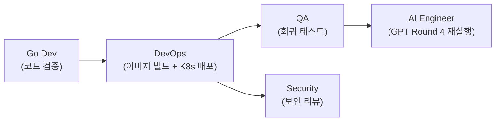

# 스크럼 미팅 로그 — 모닝 스탠드업

- **날짜**: 2026-04-07
- **Sprint**: Sprint 5 (Week 2, Day 2)
- **유형**: 모닝 스탠드업 (Morning Standup)
- **참석자**: 애벌레, PM, Architect, Go Dev, Node Dev, Frontend Dev, Designer, QA, DevOps, Security, AI Engineer (11명 전원)

---

## 각자 공유

### PM (애벌레)

- **어제**: 11명 전원 모닝 스탠드업 퍼실리테이션, Phase 1~3 병렬 실행 조율. P1 보안/버그 4건(SEC-RL-003, BUG-WS-001, SEC-ADD-002, WS_TIMEOUT) 전건 완료 확인. Round 4 토너먼트 결과 정리 및 v2 프롬프트 공통 채택 결정(D02) 기록. Sprint 5 진행률 ~65% → ~75% 갱신
- **오늘**: P1 3건 진행 상태 추적 및 의존성 조율. BUG-GS-004 K8s 반영(Go Dev → DevOps 핸드오프 관리). GPT Round 4 재실행 go/no-go 판단. SEC-ADD-001 착수 범위 결정(설계만 vs 구현까지). Sprint 5 마감(4/11) 대비 잔여 작업 우선순위 재조정
- **블로커**: Claude API 잔액 ~$5 — 다회 통계 실험 예산 부족. GPT Round 4 데이터 부재(14턴 조기 종료)

### Go Dev

- **어제**: SEC-RL-003 WS Rate Limiter 구현(Fixed Window 60msg/min + 타입별 7종, 19 tests, Close 4005). BUG-WS-001 TURN_START 수정(GameStartNotifier, 4 tests). WS_TIMEOUT 경합 해소(cancelTurnTimer, 4 tests). SEC-REV-001 미등록 타입 바이패스 즉시 수정. Go 651 PASS
- **오늘**: BUG-GS-004 processAIDraw K8s 배포 상태 최종 검증(P1). SEC-REV Medium 4건 코드 레벨 영향도 분석. v3 프롬프트 응답 파싱 개선 가능성 검토
- **블로커**: 없음

### Node Dev (AI Adapter)

- **어제**: v2-reasoning-prompt.ts 공통 모듈 완성(3모델 통합). USE_V2_PROMPT ConfigMap 토글 구현. 전 모델 타임아웃 210s 통일. 395 테스트 PASS (19 suites)
- **오늘**: BUG-GS-004 관련 AI Adapter 측 에러 핸들링 점검. GPT Round 4 재실행 시 어댑터 로그 모니터링. v3 프롬프트 설계 초안 착수(어댑터 구조 변경 영향도 분석). DeepSeek max_tokens 16384 설정의 타 모델 적용 검토
- **블로커**: GPT 리밋 제한 지속 시 Round 4 재실행 불가

### Frontend Dev

- **어제**: SEC-ADD-002 보안 헤더 6종 적용(frontend + admin). BUG-WS-001 UI fallback(TURN_END → 2초 타이머 → TURN_START 재요청). 빌드 경고 0건
- **오늘**: Rate Limit 에러 UX 구현(19-rate-limit-ux-spec.md 기반) — HTTP 429 토스트 3단계, WS 4005 재연결 3-step UI, 쿨다운 circular progress. Zustand store rateLimitState 슬라이스 추가. Playwright E2E rate-limit 시나리오 보강
- **블로커**: 없음

### AI Engineer

- **어제**: Round 4 3모델 대전(DeepSeek 30.8% A+, Claude 20.0% A, GPT 33.3% 14턴 종료). v2 크로스모델 실험(GPT 30.8% A+ 첫 완주, Claude 33.3% A+ 역대 최고). BUG-GS-004 발견 및 수정. 문서 2건(21번 867줄, 38번 569줄). D02 결정 기록
- **오늘**: GPT-5-mini Round 4 재실행(BUG-GS-004 배포 후, 80턴 완주 목표, P1). v3 프롬프트 개선안 초안(무효 배치 감소 집중, P2). 다회 실행 통계 유의성 계획(Claude $5.12 제약 고려, P3)
- **블로커**: GPT 재실행은 BUG-GS-004 K8s 배포 완료에 의존. Claude 잔액 $5.12로 다회 실험 제한(최대 4회)

### DevOps

- **어제**: Docker 이미지 3개 빌드 + K8s 재배포. 7 Pod Running RESTARTS=0. 보안 헤더 + Rate Limiter 실배포 검증. ConfigMap USE_V2_PROMPT/DAILY_COST_LIMIT_USD=20 반영
- **오늘**: BUG-GS-004 반영 game-server 이미지 K8s 재배포(P1). CI/CD Pipeline 17/17 ALL GREEN 유지 모니터링. argocd-repo-server 간헐 Error 로그 분석. AI 토너먼트 전 Pod readiness/health probe 점검
- **블로커**: argocd-repo-server 간헐 Error 지속 시 Sync 영향 가능(현재 Minor). 16GB RAM 제약으로 CI 실행 시 교대 종료 필요

### QA

- **어제**: Go 651 + NestJS 395 전수 테스트 검증. WS Rate Limit E2E 7시나리오 신규. 35-sprint5-w2-phase1-test-report.md 작성(204줄). WS 16건 회귀 통과. 총 1,421 테스트 GREEN
- **오늘**: BUG-GS-004 회귀 테스트(processAIDraw 경로 분기 검증). v2 토너먼트 QA 분석(유효 배치율, 무효 수 패턴, 타임아웃 분포). 플레이테스트 90% 달성 계획(현재 88.6%, 미통과 5건 원인 분류)
- **블로커**: GPT Round 4 재실행 보류 시 3모델 비교 데이터 부족. BUG-GS-004 K8s 배포 선행 필요

### Security

- **어제**: Phase 1 보안 코드 리뷰 12건(Critical 0, High 2, Medium 4, Low 3, Info 3). SEC-REV-001 High 즉시 수정 확인. SEC-REV-002 High 수정 검증. 36-security-review-phase1.md 작성
- **오늘**: SEC-ADD-001 JWKS 서명 검증 설계 착수(Google id_token RS256 → JWKS 엔드포인트 검증 구조). SEC-REV Medium 4건 Sprint 분류(5 vs 6). BUG-GS-004 processAIDraw 보안 리뷰(입력 검증, 로그 민감정보)
- **블로커**: 없음

### Architect

- **어제**: ADR-020 Istio 선별 적용 설계 완료(game-server + ai-adapter sidecar, ~280Mi). 20-istio-selective-mesh-design.md 925줄(mTLS, 트래픽 정책, Mermaid 6개). 16GB 제약 적합성 검증
- **오늘**: SEC-ADD-001 아키텍처 리뷰(game-server 인증 흐름 변경점 정리, Go Dev에 구현 가이드 전달). Istio Phase 5.0 착수 최종 권고(Helm values 가이드). v3 프롬프트 아키텍처 영향 리뷰
- **블로커**: 없음

### Designer

- **어제**: Rate Limit 에러 UX 설계 완료(쿨다운 원형 프로그레스, 3단계 토스트, WS 4005 재연결 플로우, 색약 접근성). 19-rate-limit-ux-spec.md(869줄, Mermaid 11개)
- **오늘**: Frontend Dev UX 구현 지원(디자인 토큰 매핑, 애니메이션 타이밍). 플레이테스트 UI 피드백 분류(S1~S5 미통과 5건 중 UI 관련 추출). AI 토너먼트 결과 시각화 대시보드 와이어프레임(Round 2~4 데이터 차트)
- **블로커**: 없음

---

## 논의 사항

### 1. BUG-GS-004 K8s 배포 의존 체인

오늘 P1의 핵심은 BUG-GS-004 배포 → GPT Round 4 재실행의 순차 의존성이다.

- **Go Dev**: processAIDraw 함수 최종 검증 → DevOps에 go 사인
- **DevOps**: game-server 이미지 리빌드 + 롤아웃 → Pod readiness 확인
- **QA + Security**: 병렬로 회귀 테스트 + 보안 리뷰
- **AI Engineer**: 검증 완료 후 GPT Round 4 재실행 착수
- **합의**: 오전 중 배포 완료 목표. 대전 중 재배포 금지 원칙 재확인

### 2. SEC-ADD-001 오늘 완료 (설계+구현+테스트)

- **Security**: JWKS 서명 검증은 현재 토큰 파싱만 수행하고 서명 미검증 상태. P1 수준 보안 이슈
- **Architect**: game-server OAuth 핸들러 구조 변경점을 정리하여 Go Dev에 전달 예정
- **애벌레**: 하루에 끝내자. 설계+구현 분리하지 말고 오늘 완료
- **합의**: Security + Architect 설계(오전) → Go Dev 구현(오후) → QA 테스트(오후). 키 로테이션 대응은 Sprint 6 이월

### 3. Istio Phase 5.0 착수 판단

- **Architect**: 설계 완료, istiod 설치 순서 + PeerAuthentication 정책 확정. 착수 가능 상태
- **DevOps**: 16GB 제약에서 istiod(~280Mi) 추가 시 교대 실행 전략 필수
- **PM**: Sprint 5 잔여 4일에 Istio까지 넣으면 리스크. Sprint 6 초반(4/13~) 착수 권고
- **합의**: Istio는 Sprint 6 Day 1 착수로 확정. Sprint 5에서는 설계 문서 최종 리뷰만 수행

### 4. 비용 리스크 대응

| API | 잔액 | 게임당 비용 | 가능 횟수 |
|-----|:---:|:---:|:---:|
| OpenAI | ~$27 | $0.15 | ~180회 |
| Claude | ~$5 | $1.11 | ~4회 |
| DeepSeek | ~$6.6 | $0.04 | ~165회 |

- **AI Engineer**: 다회 통계는 DeepSeek(3회) + GPT(3회) 우선. Claude는 1회 추가까지만
- **PM**: Claude 충전 없이는 통계적 유의성 확보 불가. 프로젝트 보고서에 "Claude는 단일 실행 기준" 명시
- **합의**: 저비용 모델(DeepSeek/GPT) 중심 다회 실행 → Claude 1회 추가 → 보고서 마감

### 5. v3 프롬프트 방향성

- **AI Engineer**: v2에서 무효 배치 4건이 주요 성능 병목. 자기 검증(self-validation) 단계 강화 방안 초안 예정
- **Node Dev**: 어댑터 구조 변경이 필요하면 MoveResponse 스키마 확장 검토
- **Architect**: AI Adapter 인터페이스 변경 시 game-server 측 영향도 확인 필요
- **합의**: AI Engineer가 초안 → Architect 리뷰 → Node Dev 영향도 판단. 구현은 Sprint 6

---

## 오늘의 실행 계획

### Phase A: P1 배포 + 검증 + SEC-ADD-001 설계 (오전)

| 순서 | 담당 | 작업 | 산정 |
|:---:|------|------|:---:|
| 1 | Go Dev | BUG-GS-004 processAIDraw 최종 코드 확인 | 0.5h |
| 2 | DevOps | game-server 이미지 빌드 + K8s 롤아웃 | 0.5h |
| 3 | QA + Security | 회귀 테스트 + 보안 리뷰 (병렬) | 1h |
| 3 | Security + Architect | SEC-ADD-001 JWKS 서명 검증 설계 (병렬) | 1.5h |
| 4 | AI Engineer | GPT-5-mini Round 4 재실행 | 1.5h |
| 4 | 애벌레 | Claude API $20 충전 | - |

### Phase B: SEC-ADD-001 + P2 병렬 (오후)

| 담당 | 작업 | 우선순위 |
|------|------|:---:|
| Go Dev | SEC-ADD-001 JWKS 서명 검증 **구현** | P1 |
| QA | SEC-ADD-001 검증 테스트 | P1 |
| AI Engineer | Ollama (qwen2.5:3b) 베이스라인 대전 | P2 |
| Frontend Dev | Rate Limit UX 구현 | P2 |
| Designer | UX 구현 지원 + 대시보드 와이어프레임 | P2 |
| Node Dev | v3 프롬프트 어댑터 영향도 분석 | P2 |
| Go Dev | SEC-REV Medium 4건 검토 (SEC-ADD-001 후) | P2 |

---

## 리스크/이슈

| # | 리스크 | 심각도 | 대응 |
|---|--------|:------:|------|
| R1 | ~~Claude API 잔액 ~$5~~ → **$20 충전 예정**, 총 ~$25 확보 | ~~Medium~~ **해소** | 충전 후 다회 실험 가능 (~22게임) |
| R2 | GPT Round 4 14턴 조기 종료 데이터 부재 | Low | 오늘 재실행으로 해소 예정 |
| R3 | argocd-repo-server 간헐 Error | Low | 로그 모니터링, Sync 영향 시 수동 대응 |
| R4 | Sprint 5 마감(4/11) 잔여 4일 | Low | P1 오전 완료 → P2 오후 착수로 여유 확보 |

---

## 스탠드업 중 추가 논의 (애벌레 요청)

### 6. Local LLM (qwen2.5:3b) 대전 테스트

- **애벌레**: 동일 v2 프롬프트로 로컬 LLM 테스트 의미 있는지?
- **결론**: 의미 있음. 비추론 3B 모델이라 Place Rate <5% 예상이나, **베이스라인 비교 데이터**로 가치 있음
  - 비용 $0 → 실험 부담 없음
  - "추론 없이는 이 정도밖에 안 된다"의 정량 근거
  - v2 프롬프트가 비추론 모델에도 효과 있는지 검증
- **조치**: 대전 스크립트(`ai-battle-3model-r4.py`)에 `ollama` 모델 추가 완료
  - `--models ollama` (단독), `--models openai,claude,deepseek,ollama` (4모델 전체) 지원
  - aiType: `AI_LLAMA`, cost_per_turn: $0

### 7. Claude API $20 충전

- **애벌레**: Claude API 충전 예정. 얼마?
- **결론**: **$20 충전** 권장 (총 잔액 ~$25, 약 22게임 가능)
  - 다회 통계(3회) $3.33 + v3 테스트 $3.33 + Round 5+ $5 + 단발 테스트 $3 = ~$15
  - Sprint 5~6 커버에 충분. $10은 Sprint 6 중반 부족, $50은 과잉

### 8. SEC-ADD-001 오늘 완료

- **애벌레**: 설계+구현 하루에 끝내자
- **수정**: Security+Architect 설계(오전) → Go Dev 구현(오후) → QA 테스트(오후) = 오늘 완료
- 구현 범위: `go-jose/v4` 또는 `golang-jwt/jwt/v5` + Google JWKS 캐싱. 복잡하지 않음

### 9. v3 프롬프트 설명

- **애벌레**: v3 프롬프트가 뭔지?
- **설명**: 아직 존재하지 않는 계획 단계의 프롬프트 개선안
  - v2로 Place Rate 5%→33.3% 달성했으나 **무효 배치(invalid placement)가 게임당 ~4건** 잔존
  - v3 목표: 자기 검증 강화, 실전 무효 패턴 few-shot 추가, 테이블 그룹 누락 방지, 배치 최적화
  - 현재: AI Engineer 초안 작성 예정 (설계만 Sprint 5, 구현 Sprint 6)

---

## 액션 아이템 (수정)

| # | 담당 | 할 일 | 우선순위 | 기한 |
|---|------|-------|:-------:|:----:|
| 1 | Go Dev | BUG-GS-004 processAIDraw 최종 검증 | P1 | 04-07 오전 |
| 2 | DevOps | BUG-GS-004 game-server K8s 재배포 | P1 | 04-07 오전 |
| 3 | QA | BUG-GS-004 회귀 테스트 | P1 | 04-07 오전 |
| 4 | AI Engineer | GPT-5-mini Round 4 재실행 | P1 | 04-07 |
| 5 | Security + Architect | SEC-ADD-001 JWKS 서명 검증 **설계** | **P1** | **04-07 오전** |
| 6 | Go Dev | SEC-ADD-001 JWKS 서명 검증 **구현** | **P1** | **04-07 오후** |
| 7 | QA | SEC-ADD-001 **검증 테스트** | **P1** | **04-07 오후** |
| 8 | 애벌레 | **Claude API $20 충전** | **P1** | **04-07** |
| 9 | AI Engineer | **Ollama (qwen2.5:3b) 베이스라인 대전** — `--models ollama` | **P2** | **04-07** |
| 10 | AI Engineer | v3 프롬프트 개선안 초안 | P2 | 04-09 |
| 11 | Frontend Dev | Rate Limit UX 구현 | P2 | 04-09 |
| 12 | QA | v2 대전 QA 분석 + 플레이테스트 90% 계획 | P2 | 04-08 |
| 13 | Designer | 대시보드 와이어프레임 | P2 | 04-09 |
| 14 | Node Dev | v3 프롬프트 어댑터 영향도 분석 | P2 | 04-09 |
| 15 | Go Dev | SEC-REV Medium 4건 검토 | P2 | 04-09 |

---

## 메모

- Sprint 5 마감(4/11)까지 4일. 현재 진행률 ~75%, 오늘 P1 완료 시 ~85% 예상
- Istio Phase 5.0은 Sprint 6(4/13~) 착수로 확정 — Sprint 5 리스크 제거
- v3 프롬프트는 설계만 Sprint 5, 구현은 Sprint 6으로 분리
- 10명 전원 투입 3일 연속 — Phase 직렬(배포→검증→실행) + 병렬(P2) 패턴 유지
- DeepSeek 비용/성능 비율 압도적 — 다회 통계 실행의 주력 모델로 활용
- **대전 스크립트에 ollama 모델 추가** — 4모델 비교 테스트 가능 (클라우드 3 + 로컬 1)
- **Claude $20 충전** 후 잔액 ~$25 → 다회 통계 실험 제약 해소
- **SEC-ADD-001 오늘 완료** — 설계+구현+테스트 하루에 마감 (기존 P2→P1 상향)
