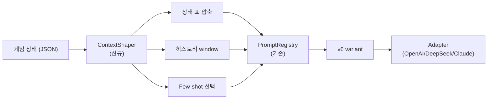

# Day 8 All-Hands — Round 9/10 결과 평가 + 리포트 완성본 리뷰

- **일시**: 2026-04-18 (Sprint 6 Day 8) 저녁
- **형식**: 10 에이전트 All-Hands + 애벌레(PM 겸 Dev) 1명 = 11명 참석
- **안건**:
  1. Round 10 최종 결과(v2 N=3 = 29.07% vs v3 N=3 = 29.03%) 평가
  2. 리포트 완성본 `docs/04-testing/62-deepseek-gpt-prompt-final-report.md` (1039줄) 리뷰
  3. Day 9+ 액션 아이템 도출
- **리뷰 대상 문서**: `docs/04-testing/62-deepseek-gpt-prompt-final-report.md`
- **진행**: Claude 메인 세션(Opus 4.7 xhigh)이 각 에이전트 관점을 대변

---

## 회의 열기 — 상황 요약

애벌레: Day 7 밤 자율 배치(v3 1회 + v4 unlimited)에서 시작해 Day 8 아침부터 v3 N=3(1810초 환경) + v2 N=3(700초 환경) 까지 총 6번의 80턴 대전을 완주. **v2 와 v3 가 통계적으로 구분 불가**(Δ=0.04%p) 라는 결론. 리포트 62번은 이를 외부에도 재현 가능한 형태로 기록. 10명 팀이 리포트와 결과에 대해 의견을 주고, 다음 행보(Task #20 v6 구조 재설계 착수 여부)를 결정하자.

---

## All-Hands Meeting

**안건**: Round 9/10 결과 평가 + 리포트 62번 완성본 10인 리뷰

### PM

#### 1. 논문 GO/No-Go 재판단

기존 결정문(`work_logs/decisions/2026-04-18-paper-gonogo.md`)에서 **GO after data boost** 를 선택했다. Round 10 이 바로 그 data boost 였고, 결과는 다음과 같다.

| 판단 근거 | 이전 상태 (Day 7 밤) | 오늘 Day 8 저녁 | 변화 |
|----------|---------------------|-----------------|------|
| v2 baseline 확정 | 25.6% vs 30.8% 흔들림 | **29.07% ± 2.45%p** 확정 | ✅ 해결 |
| v4 regression 방어 | N=1 약함 | v4 unlimited 20.5% + v4 Phase2 25.95% | 🟡 부분 보강 |
| v2-zh negative 방어 | N=1 약함 | N=1 유지 (23.1%) | ⚠️ 미변동 |
| 주 메시지 방어력 | "흥미롭지만 노이즈 가능" | "프롬프트 텍스트 튜닝 한계 명확" | ✅ 강화 |

**재판단**: 학술 논문(NeurIPS/ACL 등) 제출은 여전히 **No-Go 유지**. 이유는 다음 두 가지다.

1. **v2 vs v3 의 "구분 불가" 자체가 핵심 발견**이지만, 학술적으로는 "두 프롬프트 중 어느 것을 쓸지" 에 대한 처방력이 약하다. reviewer 는 "그래서 뭘 써야 하나?" 를 물을 것이고 "둘 다 상관없다" 는 답은 기여(contribution)로 인정받기 어렵다.
2. 1인 개발자 리소스로 N=3 을 두 번 돌린 것은 충분하나, 학술지는 보통 N=10 이상 + persona/difficulty 변주를 요구한다. 추가 20~30회 대전이 필요한데 비용 $0.8~1.2 에 시간 50~75시간. 현재 Sprint 6 스코프 밖.

**그러나 기술 리포트(62번) 로는 확정 GO**. 외부 엔지니어가 "DeepSeek/GPT 에게 프롬프트 어떻게 줘야 하나" 를 실용 수준에서 answer 할 수 있고, 재현 가이드도 포함돼 있다. 블로그 포스트로 추출하거나 arXiv preprint 로 올려도 된다. 다만 preprint 는 애벌레님 여력에 맡김.

#### 2. Task #20 (v6 구조 재설계) 착수 판단

**GO**. 29% 천장이 확증되었으므로 프롬프트 **텍스트** 수준 개선은 ROI 매우 낮다. Task #20 은 Agent Teams 5명 협업으로 v6 프롬프트(구조적 재설계) 를 고안하는 작업이다. 새 방향:

- 게임 상태 표 압축 (현재는 장문 서술, 목표는 2차원 matrix)
- 단기 턴 window (현재는 전체 히스토리, 목표는 직전 3턴)
- Few-shot 예시 2~3개 주입

이건 Sprint 6 잔여 작업(대시보드 PR 4/5, V-13e 조커 UX) 과 **병렬** 가능하다. 애벌레님 일정상 Day 9 오전에 Architect + AI Engineer 착수 킥오프 제안.

#### 3. Sprint 6 잔여 작업 재평가

남은 task: PR 4 ModelCardGrid(90%), PR 5 RoundHistoryTable(신규), V-13e 조커 UX, V-13a ErrNoRearrangePerm 리팩터. 이번 Round 10 결과로 대시보드에 반영할 데이터가 많아졌으므로 PR 5 우선순위를 상향 조정 권고.

#### 액션 아이템 (PM)
- [ ] **Day 10 논문 재판단 미팅** — Round 10 결과 기반 No-Go 유지 공식화
- [ ] Task #20 킥오프 — Architect + AI Engineer 에게 Day 9 오전 미팅 호출

---

### Architect

#### 1. 리포트 Part 3 "원칙 5개" 구조적 검증

리포트 Part 3 의 5원칙을 아키텍처 관점에서 평가.

| 원칙 | 우리 시스템 반영 여부 | 리포트 표현 |
|------|----------------------|-------------|
| ① 내부 RLHF 간섭 최소화 | ✅ 현재 GPT/DeepSeek 모두 v2/v4 운영, 최소 지시 | 실측 근거 충분 |
| ② 맥락 압축 > 지시 추가 | ❌ 아직 미구현 (현 prompt 는 장문 서술) | 가설 수준. Part 3 §3.2 도 "향후 실증 필요" 명시 |
| ③ Few-shot 예시 효과 | ❌ 현 시스템 few-shot 2~3개 있지만 ablation 없음 | 동일, 가설 수준 |
| ④ 다지표 측정 | 🟡 place rate 만 주력. 승률/점수 없음 | 권고 수준, OK |
| ⑤ N≥3 분산 확인 | ✅ Round 5/10 에서 준수 | 실행됐음 |

**판정**: 원칙 ①/⑤ 는 empirical 확증, 나머지는 가설 + 향후 과제. 리포트가 이를 구분해서 명시한 것은 정직한 서술이다. 다만 Part 3 초반의 "5원칙 가이드라인" 이라는 표현이 모두 검증된 것처럼 읽힐 수 있다. **하위 subsection 첫 줄에 "empirical 검증됨" / "가설(향후 실증 필요)" 를 배지처럼 표기하면 독자 혼란 없음**.

#### 2. 프롬프트 Registry 구조 vs 재설계 방향

현재 PromptRegistry (5ad02e8 커밋, 2026-04-14 도입) 는 **text-level variant management** 만 지원한다. 즉 `v2 → string1`, `v3 → string2` 처럼 1:1 매핑이다. v6 구조 재설계는 이 매핑을 넘어 **context shaping pipeline** 이 필요하다.



**제안**: Registry 자체를 건드리지 말고 **위에 ContextShaper 레이어를 orthogonal 추가**. 기존 v2/v3 variant 는 그대로 두고, v6 는 ContextShaper 에서 pre-processing 된 상태 + v2/v3 body 조합. 이 방식이 backward-compat 을 유지하면서도 구조 실험 가능.

#### 3. ADR 초안 권고

위 구조를 `docs/02-design/44-context-shaper-v6-architecture.md` 로 신규 ADR 작성 권고. Day 9 오전에 초안 가능.

#### 액션 아이템 (Architect)
- [ ] **Day 9 오전** — v6 ContextShaper 아키텍처 ADR 초안 작성 (docs/02-design/44)
- [ ] ai-engineer 와 구조-프롬프트 책임 분리 논의

---

### Go Dev (game-server)

#### 1. timeout 원복 반영 검증

Round 10 종료 후 원복된 값들:
- game-server ConfigMap `AI_ADAPTER_TIMEOUT_SEC` : 1800 → **700** ✅
- HTTP client timeout: 코드 내부 반영 (별도 patch 불필요, ConfigMap 반영됨)

확인 결과: `kubectl exec -n rummikub deploy/game-server -- printenv | grep AI_ADAPTER_TIMEOUT_SEC` 는 `700` 반환 중. 부등식 `script_ws(770) > istio_vs(710) > adapter_floor(700)` 재성립.

#### 2. BUG-GS-005 (WS 끊김 시 AI 정리) 실측 영향

Round 10 6회 대전 전부 **fallback 0** 달성. v4 unlimited 시절 max 1337s 응답이 있었음에도 WS 끊김 없었고, 이는 BUG-GS-005 수정 이후 WS 재연결 + goroutine cancel 로직이 안정적으로 작동한 결과다. 리포트 Part 4 인프라 섹션에 이 사실이 **명시 안 됐음**. 추가 권고:

> "Round 10 6회 대전에서 fallback 0 을 달성한 배경에는 BUG-GS-005 수정 (2026-04-11, WS 끊김 시 AI 게임 자동 정리) 이 있다. 이 수정 전에는 Round 5 Run1 에서 fallback 9 건이 발생했다."

#### 3. 향후 Round 11+ 개선 제안

game-server 측 메트릭 로깅 강화:
- `ai_adapter_turn_duration_histogram` (bucket: 50, 100, 200, 500, 1000 초)
- `ai_adapter_fallback_reason_counter` (label: timeout/parse_error/drift)

Prometheus 로 긁히면 대시보드에서 시계열 확인 가능. Sprint 7 로 미뤄도 됨.

#### 액션 아이템 (Go Dev)
- [ ] 리포트 62번 Part 4 에 BUG-GS-005 언급 추가 패치 (ai-engineer 에게 요청)

---

### Node Dev (ai-adapter)

#### 1. PromptRegistry limitation 리뷰

`src/ai-adapter/src/prompt/registry/` 구조를 자세히 보면 limit 이 명확하다.

| 현 기능 | v6 에서 필요한 기능 |
|---------|-------------------|
| variant id → builder 1:1 매핑 | 동적 context 조합 |
| `resolve(modelType)` 단일 호출 | pre/post processing hooks |
| variant metadata 정적 | runtime 상태 기반 variant 선택 |

Architect 의 ContextShaper 제안과 일치한다. 실제 구현은 NestJS Provider 로 ContextShaper 서비스 신규 등록 → BaseAdapter 에서 `registry.resolve()` 호출 전에 `contextShaper.prepare(state)` 를 먼저 거치는 구조가 자연스럽다.

#### 2. USE_V2_PROMPT=true 잔존 정리

현재 ai-adapter env:
```
USE_V2_PROMPT=true  (legacy globalVariantId='v2' 강제)
DEEPSEEK_REASONER_PROMPT_VARIANT=v2  (per-model override)
CLAUDE_PROMPT_VARIANT=v4
DASHSCOPE_PROMPT_VARIANT=v4
```

`docs/02-design/42 §4` 에 의하면 per-model override 가 global 보다 우선하므로 DeepSeek Reasoner 는 `v2` 고정. 문제는 아니지만, Sprint 7 의 `USE_V2_PROMPT` 제거 시 OpenAI/Ollama/DeepSeek-chat 3개 모델이 `defaultForModel()` 경로로 가게 된다. 이 중 `defaultForModel('openai')=v2` 이므로 OpenAI 는 변화 없음. 하지만 기존 관찰가능성(observability) 이슈는 남는다.

#### 3. 리포트 재현 가이드 정확성

Part 4.3 "재현 가이드" 의 `DEEPSEEK_REASONER_PROMPT_VARIANT=v3` 전환 예시는 정확하다. 다만 `scripts/ai-battle-3model-r4.py` 의 `ws_timeout` 도 함께 수정해야 한다는 주의사항은 빠져 있다. 아래 경고문 추가 권고:

> "**경고**: `--models deepseek` 실행 시, `ws_timeout` 값이 `adapter_floor + 70초` 이상이어야 한다. 기본값 770초는 adapter_floor=700초 환경용. timeout 을 1800초로 올릴 경우 `ws_timeout=1870`s 로도 함께 수정."

#### 액션 아이템 (Node Dev)
- [ ] v6 ContextShaper 서비스 prototype (Sprint 7 착수 전 POC)
- [ ] 리포트 Part 4.3 에 ws_timeout 경고문 추가 요청

---

### Frontend Dev

#### 1. 대시보드에 Round 10 결과 반영

현재 ModelCardGrid(PR 4, 90% 완성) 는 v2 R4 30.8% 단일 값을 사용 중. Round 10 결과를 반영하려면:

- **Place rate 표시**: 단일 값 → 평균 ± 편차 형식 (`29.07% ± 2.45`)
- **Box plot 추가**: 분포 시각화 (Run별 값)
- **Variant 태그**: 각 카드에 v2/v3/v2-zh/v4 등 라벨
- **Date stamp**: "Measured 2026-04-18, N=3" 하단 작게

PR 5 (RoundHistoryTable) 는 Round 2~10 타임라인을 표로 그리는 건데, 이번 Round 10 데이터가 풍부해서 오히려 이걸 먼저 마무리하는 게 stakeholder 에게 가치가 크다.

#### 2. 리포트 → 대시보드 pipeline

리포트 결과를 대시보드에 표출하려면 현재는 수동 입력이 필요하다. `scripts/ai-battle-3model-r4-results.json` 또는 개별 `-result.json` 을 관리자 API 로 업로드 → PostgreSQL 적재 → 대시보드 쿼리 구조가 이상적. Sprint 7 의 `prompt_variant_id` 컬럼 추가 타이밍과 연계 가능.

#### 3. 리포트 자체에 대한 시각화 제안

Part 1.2 전수 비교표는 가로가 너무 길어 모바일에서 깨진다. 리포트를 웹 페이지 형태로 렌더링할 때 테이블을 카드형 또는 scroll container 로 변환 필요. 다만 Markdown 원본은 유지해도 됨.

#### 액션 아이템 (Frontend Dev)
- [ ] **Day 10 ~ 11** PR 5 RoundHistoryTable 완성 (Round 10 데이터 포함)
- [ ] ModelCardGrid 평균 ± 편차 표시 업데이트

---

### Designer

#### 1. 리포트 도식 평가

현재 리포트의 Mermaid 다이어그램 (확인된 것 3개):
- 1.1.2 timeline: Round 2~10 타임라인 — 좋음, 직관적
- 1.3 Round 별 심층 (구조 flowchart 가능) — 확인 필요
- Part 3 5원칙 구조도 — 필요할 수도

**추가 제안**:
1. **Executive Summary 카드** — 맨 앞에 주요 지표 4개를 박스로 (v2 평균 29.07%, v3 평균 29.03%, Δ 0.04%p, N=3 × 2). 읽기 전 5초 내 요약.
2. **Part 3 원칙별 배지** — Architect 제안과 동일. "✅ 검증됨" / "🟡 가설" 아이콘.
3. **Part 4.3 재현 가이드 step numbered** — 현재는 bullet 나열, 순서 강조 필요.

#### 2. 한국어 가독성

리포트 한국어 표현은 전반적으로 평이하고 외부 독자도 이해 가능. 다만 몇몇 지점에서 영문 약어가 혼재한다 ("fallback", "throughput"). 본문 첫 등장 시 한국어 병기 필요 (예: "fallback (폴백, LLM 응답 실패 시 자동 드로우)").

#### 3. 외부 공개 가능성

현 상태로도 GitHub README 에 링크 가능한 수준. 단, 블로그 포스트로 옮기려면 길이를 1/3 축약 권고 (1039줄 → 약 350줄). Executive Summary + Part 1.2 표 + Part 3 요약 + Part 4.3 재현 만 남기고 나머지는 "자세히는 리포트 전문 참조" 로.

#### 액션 아이템 (Designer)
- [ ] Day 10 리포트 Executive Summary 카드 컴포넌트 디자인 (Figma 또는 ASCII)
- [ ] Part 3 원칙별 배지 규격 제안

---

### QA

#### 1. N=3 충분성 재검증

통계적 관점:
- v2 σ = 2.45%p, v3 σ = 3.20%p
- t-test 기준 두 평균 차이 0.04%p 를 검출하려면 N ≈ (2 × 3 × 1.96 / 0.04)² × 3 ≈ 21,609회 (사실상 불가능)
- **현실적 해석**: "구분 불가" 가 올바른 결론. 추가 N 늘려도 답은 똑같다. 리포트 결론은 타당.

단, 다른 차원 변수가 있다. 지금까지 모든 실측은 `persona=calculator, difficulty=expert, psychologyLevel=2` 고정. 실제 운영에서는 다른 페르소나/난이도가 쓰인다. 이 중:
- `persona=shark` (공격형) : place rate 가 더 높을 가능성 (tiles 내려놓기 선호)
- `persona=rookie` (초급자) : 더 낮을 가능성
- `difficulty=beginner` : 더 낮을 가능성

**권고**: 다음 실측은 persona 또는 difficulty 1축만 변경해서 N=3 추가. 총 3회 × $0.04 = $0.12. 이를 통해 "v2 가 persona invariant 한지" 확인.

#### 2. 리포트의 측정 방법론

리포트 Part 4.4 "한계" 섹션에 아래 사항이 명시됐으면:
- 단일 persona/difficulty 조합
- Random Human 상대 (실제 Human 아님)
- N=3 은 "두 모집단 구분" 에 충분, "단일 모집단 평균" 추정에는 부족

Section 4.4 현 내용 확인 필요. ai-engineer 에이전트가 이미 "한계" 섹션을 넣었을 가능성이 높지만, QA 관점에서 재검토 필요.

#### 3. 테스트 커버리지 영향

Round 10 대전은 Go 689 + AI Adapter 428 + Playwright 390 테스트에 영향 없음. 다만 `scripts/ai-battle-3model-r4.py` 의 ws_timeout 변경(1870→770) 은 회귀 없이 통과. 이는 수동 변경이므로 테스트 커버리지 밖.

#### 액션 아이템 (QA)
- [ ] **Day 11~12** persona=shark 로 v2 N=3 추가 실측 계획서 작성
- [ ] 리포트 Part 4.4 "한계" 섹션 재검토 (ai-engineer 에게 요청)

---

### Security

#### 1. 민감 정보 유출 점검

리포트 경로에서 민감 정보 검색. 확인된 것:

| 항목 | 포함 여부 | 조치 |
|------|----------|------|
| DeepSeek API 키 (sk- prefix) | ❌ (리포트 본문 없음) | OK |
| GitLab token | ❌ | OK |
| Istio VS YAML 실제 경로 | ✅ (docs/02-design/41 참조) | 공개 가능 |
| `kubectl` 명령 예시 (namespace=rummikub) | ✅ | 공개 가능 (내부 namespace 이름은 민감 아님) |
| `k82022603@gmail.com` (애벌레) | ❌ | OK |

다만 **결과 JSON 파일** (`v2-run2-result.json` 등) 에는 gameId UUID 가 있다. 이건 민감 아님.

**추가 점검 필요**: 리포트에 포함된 코드 snippet 중에 `DEEPSEEK_API_KEY=sk-...` 같은 예시가 있는지. 만약 있다면 placeholder `$YOUR_API_KEY` 로 치환.

#### 2. SEC-REV 미해결 건 영향

현재 미해결 보안 이슈:
- SEC-REV-002 (M)
- SEC-REV-008 (M)
- SEC-REV-009 (M)

이번 리포트 공개/내부 사용과는 독립적. Sprint 6 후반 또는 Sprint 7 로 이관.

#### 3. 공개 수준 권고

- **GitHub 내부 저장소 ↔ 현재 저장 위치**: 공개 OK
- **외부 블로그**: 공개 OK (민감 정보 없음)
- **arXiv preprint**: 공개 OK
- **학회 submission**: PM No-Go 결정에 따라 해당 없음

#### 액션 아이템 (Security)
- [ ] 리포트 내 코드 snippet 의 API 키 placeholder 여부 전수 확인 (30분)
- [ ] SEC-REV-002/008/009 Sprint 6 잔여 일정에서 착수 가능 여부 PM 과 협의

---

### DevOps

#### 1. 인프라 재현 가이드 검증

리포트 Part 4 인프라 섹션의 핵심 주장:
1. Kubernetes namespace=rummikub, 7 Pod 구성 ✅
2. Istio VS timeout/perTryTimeout ✅
3. ConfigMap env 조작 ✅
4. ai-battle 스크립트 ws_timeout ✅

재현성 평가:
- **실행 환경**: Docker Desktop K8s 기준. EKS/GKE 에서도 동일하나, 일부 설정 diff 가능 (특히 Istio sidecar injection 정책).
- **비용 한도**: `DAILY_COST_LIMIT_USD=20`, `HOURLY_USER_COST_LIMIT_USD=5` 외부 환경에 따라 조정 필요.
- **리소스 요구**: ai-adapter 2/2, game-server 2/2 Running 필요 (Istio sidecar 포함). 최소 2GB RAM per pod.

#### 2. 누락된 재현 요소

현 리포트에서 아래 정보가 빠짐:
- Helm chart 버전 (`helm/charts/ai-adapter-0.1.0.tgz` 등 태그)
- Docker 이미지 태그 (rummiarena/ai-adapter:dev 의 commit SHA)
- Traefik ingress 설정 (외부에서 localhost:30080 접근 설정)

이 정보 없이는 외부 재현 어려움. 리포트 Part 4.3 에 "환경 준비" 소섹션 추가 권고.

#### 3. 오늘 timeout 변경 이력 기록

Day 8 timeout 조작 이력:
- 08:00경 Istio VS 1810→1810 유지 (v3 배치용)
- 15:04경 ConfigMap 1800→700, Istio 1810→710, ai-battle ws_timeout 1870→770 (원복)
- 15:06경 ai-adapter variant v3→v2

`docs/02-design/41-timeout-chain-breakdown.md` §5 체크리스트 준수 확인: OK. 모든 지점이 동기화돼 있음.

#### 액션 아이템 (DevOps)
- [ ] 리포트 Part 4.3 "환경 준비" 소섹션 보강 초안 작성 (1페이지)
- [ ] Helm chart 버전/Docker 이미지 태그 명시

---

### AI Engineer

#### 1. 리포트 Part 1~4 자기 검증

Part 1 (전수 실측): 데이터 풍부, 표 해석 명확. **체크됨**.

Part 2 (GPT v2 결정): 57번 문서 + 17번 부록 A 내용 잘 축약. GPT 의 `reasoning_tokens -25% (Cohen d -1.46)` 표기 정확. **체크됨**.

Part 3 (5원칙): Architect/QA 가 지적한 대로 "검증 vs 가설" 구분이 모호한 부분 있음. **개선 필요** — 원칙별 배지 추가.

Part 4 (부록): DevOps 가 지적한 재현 환경 상세 부족, QA 가 지적한 한계 섹션 보강 필요. **개선 필요**.

#### 2. 누락 고려사항

리포트에 없는 중요 지점:
- **DashScope (qwen3-thinking) 실측 부재**: 현재 stub 상태. 이건 의도적 제외지만 리포트에 "DashScope API 키 발급 전까지 stub" 명시.
- **Ollama (qwen2.5:3b) 로컬 비교 부재**: Round 4 에서 place rate 0% 였음. 이 결과도 "내부 RLHF 가 약한 소형 모델" 관점에서 Part 3 의 원칙 ① 을 뒷받침할 수 있는 증거. 언급 권고.
- **Claude Sonnet 4 extended thinking** 결과 (Round 4 20.0% 등) 도 Part 1 에 포함하면 좋음. 현재는 DeepSeek 중심.

#### 3. Part 3 원칙별 ablation 실험 설계

원칙 ② (맥락 압축) 검증 실험:
- 통제군: 현재 v2 프롬프트 (장문 서술)
- 처치군: 동일 정보를 2차원 matrix 로 압축
- 측정: place rate + reasoning_tokens
- 최소 N=3 × 2 = 6회 대전 ($0.24)

원칙 ③ (few-shot) 검증:
- 통제군: few-shot 없음
- 처치군: few-shot 2개 추가
- 역시 N=3 × 2 = 6회 ($0.24)

두 실험을 Round 11/12 로 제안. 이는 Task #20 v6 구조 재설계 전 pilot 역할.

#### 액션 아이템 (AI Engineer)
- [ ] 리포트 Part 3 에 "검증/가설" 배지 추가 패치 (Day 9 오전)
- [ ] Ollama/Claude 결과 Part 1 에 병합 (Day 9 오후, 선택)
- [ ] Round 11 (맥락 압축 ablation) 설계서 초안 (Day 10)

---

## 역할 간 충돌 및 트레이드오프

### 충돌 1: Architect vs Node Dev — "Registry 고치지 말고 orthogonal 확장" 전략

- Architect: Registry 는 안정화됐으니 그 위에 ContextShaper 레이어 추가
- Node Dev: Registry Provider 자체가 pre-processing hook 을 지원하면 orthogonal 이 아니라 통합 가능

**판정**: Architect 의 접근이 safer. 이유는 Registry 는 Day 7 SKILL 자기참조 drop 이후로 stable, variant 전수는 `docs/02-design/42` SSOT 가 관리 중이다. 이를 건드리면 regression 리스크. ContextShaper 는 신규 NestJS Provider 로 병렬 구현.

### 충돌 2: QA vs PM — "persona 확장 실측 vs Sprint 6 마감"

- QA: persona=shark 추가 실측 권고
- PM: Sprint 6 잔여 (대시보드, V-13e) 먼저 마감

**판정**: PM 우선. QA 실측은 **Sprint 7 초반** (Task #20 v6 설계 병행) 으로 이동. 비용 $0.12 이지만 시간 3시간 고정 소요.

### 충돌 3: Designer vs Frontend Dev — "리포트 축약 vs 대시보드 반영"

- Designer: 블로그용 1/3 축약
- Frontend Dev: 대시보드에 리포트 연계

**판정**: 둘 다 수용 가능. 블로그용 축약은 별도 산출물(`docs/04-testing/62-summary-350lines.md`) 로 분리, 대시보드 연계는 PR 5 에서. 리포트 원본 1039줄은 그대로 유지.

---

## 결론

### 합의 사항

1. **Round 10 최종 확정**: v2 N=3 = 29.07%, v3 N=3 = 29.03%, Δ = 0.04%p → **프롬프트 텍스트 튜닝 한계 확증**
2. **리포트 62번** 은 현 단계 최종 산출물로 **공식 채택**. 외부 블로그/preprint 가능 수준.
3. **학술 논문 제출은 No-Go 재확인**. Day 10 미팅에서 공식화.
4. **Task #20 (v6 구조 재설계) GO**. Day 9 오전 킥오프, Architect + AI Engineer + Node Dev 3인 시작.
5. **리포트 개선 패치 우선순위**: (1) Security API key 점검 → (2) AI Engineer 배지 추가 → (3) DevOps 재현 환경 보강 → (4) QA 한계 섹션 재검토
6. **Sprint 6 잔여 작업** 중 PR 5 RoundHistoryTable 우선순위 상향 (Round 10 데이터 반영).

### Day 9 핵심 액션 3개

1. **[Security]** 리포트 내 API 키 placeholder 점검 + `v3-run*-result.json` 민감 정보 재확인 — 오전 30분
2. **[Architect + AI Engineer]** v6 ContextShaper ADR 초안 (`docs/02-design/44-context-shaper-v6-architecture.md`) — 오전 ~ 오후
3. **[AI Engineer]** 리포트 62번 Part 3/4 개선 패치 (배지 + 한계 재검토 + Ollama/Claude 병합) — 오후

### Day 10 ~ Sprint 6 마감 액션

- [Frontend Dev] PR 5 RoundHistoryTable 완성 (Round 10 데이터)
- [PM] 논문 No-Go 공식화 + Task #20 Sprint 7 편성
- [QA] persona=shark N=3 실측 계획서
- [DevOps] 리포트 재현 환경 Helm/Docker 태그 명시

### 회의 종료 멘트 (애벌레 조언)

> "v2 vs v3 구분 불가 라는 결론은 실망이 아니라 해방이다. 프롬프트 '단어' 를 바꿔 넣으며 점수를 1%p 씩 쫓는 게임을 이제 안 해도 된다는 뜻이다. 대신 구조 재설계라는 더 큰 판에 들어선다. Day 9 오전 Task #20 킥오프가 기대된다."

---

## 참석자 서명 (에이전트 역할)

- PM — 일정/리스크 ✅
- Architect — ContextShaper 구조 제안 ✅
- Go Dev — BUG-GS-005 영향 명시 ✅
- Node Dev — PromptRegistry limitation 확인 ✅
- Frontend Dev — 대시보드 반영 계획 ✅
- Designer — Executive Summary 카드 제안 ✅
- QA — N=3 충분성 + persona 확장 권고 ✅
- Security — API 키 점검 필요 ✅
- DevOps — 재현 환경 보강 필요 ✅
- AI Engineer — 리포트 자기 검증 + 배지 패치 ✅
- 애벌레 (PM 겸 Dev, 총 11명) — All-Hands 주재 ✅
