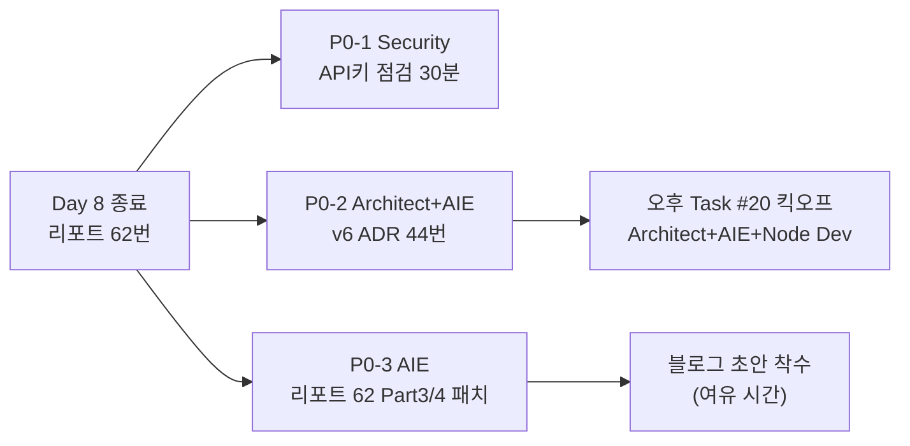

# 스크럼 미팅 로그 (Day 9 아침 — v6 킥오프)

- **날짜**: 2026-04-19 (Day 9 — 토요일)
- **Sprint**: Sprint 6 Day 9 — "프롬프트 단어 튜닝 종료, 구조 재설계의 첫날"
- **참석자 (12명)**: 애벌레 + Claude(main), PM, Architect, AI Engineer, Security, QA, Go Dev, Node Dev, Frontend Dev, DevOps, Designer
- **부주제**: Day 8 All-Hands 합의 이행 + Task #20 (v6 ContextShaper) 공식 킥오프 — 에이전트 10명 오늘의 역할 분담

---

## 오늘의 큰 그림

Day 8 에서 **v2 ≈ v3 (Δ=0.04%p)** 확증으로 "단어 한 개씩 바꾸며 1%p 쫓는 게임" 종료. 오늘부터는 **구조 재설계 (v6 ContextShaper)** 로 축이 이동한다. 어제 All-Hands 에서 확정된 3개 P0 액션 + Task #20 킥오프 세션이 오늘의 뼈대.

---

## 각자 공유

### 애벌레

- **어제 (Day 8)**: Round 10 N=3×2 완료로 v2/v3 구분 불가 확증. 리포트 62번(1039줄) 수신, Task #20 v6 GO 결정. 밤 자율체인 + 데일리 위치 오류 복구까지 마무리 (048e225 커밋).
- **오늘 (Day 9)**: 에이전트 팀 오늘 일감 궁리하는 스탠드업 주재. 오후 Task #20 킥오프 참관 + v6 ADR 초안 리뷰. 논문 No-Go 는 Day 10 에서 공식 정리.
- **블로커**: 없음.

### Claude (main) — Opus 4.7 xhigh

- **어제**: Day 8 Chain 5 오케스트레이션 (Round 10 5회 배치 + 리포트 62 집필 + All-Hands + timeout 원복). 데일리 경계 오류 사후 정리.
- **오늘**: Day 9 3개 P0 병렬 오케스트레이션 → 오후 Task #20 킥오프 진행 → 저녁 Day 9 데일리+바이브 마감.
- **블로커**: 없음.

### PM — Opus 4.7 xhigh

- **어제**: All-Hands 사회 + 논문 No-Go 재확정 + Task #20 GO 판단.
- **오늘**: Task #20 v6 로드맵 초안 (Sprint 6 잔여 일정 vs Sprint 7 넘김 판단). v6 구현 vs 대시보드 PR 4/5 vs 실측 Round 11 우선순위 정리. Day 10 "논문 No-Go 공식화 미팅" 아젠다 준비.
- **블로커**: 없음.

### Architect — Opus 4.7 xhigh

- **어제**: 리포트 62번 리뷰 + Task #20 GO 지지 의견.
- **오늘 (P0-2, 핵심)**: **`docs/02-design/44-context-shaper-v6-architecture.md`** 초안 작성 (AIE 공동).
  - v6 = "프롬프트 텍스트" 가 아니라 **"컨텍스트를 LLM 에게 줄 때 Rack/Board/History 를 어떻게 **가공**하느냐"** 라는 축 전환.
  - Registry orthogonal 확장 (variant 인덱스와 별개로 shaper 플러그인 주입).
  - v2 텍스트 유지 + ContextShaper 만 교체하는 A/B 설계 (confound 최소화).
- **오후**: Task #20 킥오프 사회 (AIE + Node Dev 공동).
- **블로커**: 없음.

### AI Engineer — Opus 4.7 xhigh

- **어제**: 리포트 62번 1039줄 집필.
- **오늘 (P0-3 + P0-2 공동)**:
  - (P0-3) 리포트 62번 Part 3/4 개선 패치 — 배지 추가, "한계" 섹션 재검토, Ollama/Claude 섹션 병합 (Round 4 데이터 재사용).
  - (P0-2) Architect 와 v6 ADR 44번 공동 집필 — "현 v2 의 fail 모드 3가지" + "ContextShaper 가 해결해야 할 구체 문제" 정의.
- **오후**: Task #20 킥오프 참여 (v6 가설 공간 제시 — 예: JokerHinter, PairWarmup, SetFinisher).
- **블로커**: 없음.

### Security — Opus 4.7 xhigh

- **어제**: 대기.
- **오늘 (P0-1)**: **리포트 62번 API 키 placeholder 전수 점검** (30분 예상).
  - 대상: 62 본문 + Part 4 재현 가이드 (curl 예제, env 변수).
  - 기준: `sk-`, `Bearer`, 실제 키 형태 패턴 grep + 수동 검토.
  - 산출: 점검 결과 1줄 요약 (이슈 0 또는 패치 N건) → All-Hands 기록에 append.
- **오후**: SEC-REV-013 의존성 감사 백로그 재검토 (시간 여유 시).
- **블로커**: 없음.

### QA — Opus 4.7 xhigh

- **어제**: Round 10 통계 해석 + All-Hands 검증 게이트.
- **오늘**: v6 ADR 44번 **검증 기준** 미리 정의 (A/B 실험 설계 — N, timeout, variant 고정 축).
  - "v6 구현 후 어떤 숫자가 나와야 GO 인가" 사전 합의 → 구현 후 reviewer 의문 차단.
  - 부등식 계약 (timeout 체인) 영향 여부 사전 체크.
- **오후**: Task #20 킥오프 참여 (검증 가능성 관점 review).
- **블로커**: 없음.

### Go Dev — Sonnet 4.6

- **어제**: timeout 원복 검증 완료.
- **오늘**: 휴식 — game-server 쪽 Day 9 P0 없음.
  - 대기성 백업 업무: BUG-GS-005 cleanup 테스트 9개 재확인, game-server ConfigMap 최종 상태 문서화.
- **블로커**: 없음.

### Node Dev — Sonnet 4.6

- **어제**: variant v3 → v2 env 원복 + 배포 검증.
- **오늘**: **Task #20 킥오프 참여 — ai-adapter 측 v6 ContextShaper 인터페이스 초안**.
  - `ContextShaper` TypeScript interface 스케치 (input: Rack/Board/History, output: Shaped strings).
  - Registry 에 `shaper` 축 추가 가능성 검토 (variant × shaper 2차원).
  - 구현 착수는 Day 10 이후.
- **블로커**: 없음.

### Frontend Dev — Sonnet 4.6

- **어제**: PR 4/5 대기.
- **오늘**: **PR 5 RoundHistoryTable 착수** (All-Hands 에서 우선순위 상향 결정).
  - Round 1~10 실측 데이터 테이블화 (v2/v3/v4/v2-zh × Run 1~N 평균/σ).
  - `docs/04-testing/62` 데이터 재활용.
  - 디자인 사양은 Designer 와 오후 30분 맞춰보고 확정.
- **블로커**: 없음.

### DevOps — Sonnet 4.6

- **어제**: timeout 10지점 원복 완료 (1810→710, 1800→700, 1870→770, variant v3→v2).
- **오늘**: 원복 후 안정 상태 관찰 (kubectl events + Istio VS status).
  - v6 ContextShaper 구현 시 **인프라 영향 없음** 사전 확인 (timeout/istio 불변 가설).
  - Sprint 6 잔여 일정 Istio Phase 5.2 (서킷 브레이커 확장) 일정 재검토.
- **블로커**: 없음.

### Designer — Sonnet 4.6

- **어제**: 휴식.
- **오늘**: **PR 5 RoundHistoryTable 디자인 사양** 1차 스케치 (Frontend Dev 요청).
  - Executive Summary 카드 (리포트 62번 요약 5줄) 디자인도 대기.
- **블로커**: 없음.

---

## 오늘의 역할 분담 (한 장 요약)

| 담당 | 우선순위 | 작업 | 산출물 | 예상 소요 |
|------|---------|------|--------|----------|
| Security | **P0-1** | 리포트 62 API 키 placeholder 점검 | 점검 리포트 1줄 | 30분 |
| Architect + AIE | **P0-2** | v6 ContextShaper ADR 초안 | `docs/02-design/44-context-shaper-v6-architecture.md` | 3~4h |
| AI Engineer | **P0-3** | 리포트 62 Part 3/4 개선 패치 | 62번 patch (배지/한계/Ollama·Claude 병합) | 2~3h |
| PM | P1 | v6 로드맵 + Day 10 논문 No-Go 아젠다 | 로드맵 초안 + 아젠다 1장 | 2h |
| QA | P1 | v6 A/B 검증 기준 사전 정의 | ADR 44번 §검증 섹션 공동 집필 | 1h |
| Node Dev | P1 | v6 `ContextShaper` TS interface 스케치 | ai-adapter PR 초안 (merge 금지, review 용) | 2h |
| Frontend Dev | P1 | PR 5 RoundHistoryTable 착수 | PR 초안 (draft) | 4h |
| Designer | P2 | PR 5 디자인 사양 + 62번 Exec Summary 카드 | 스케치 1장 | 2h |
| DevOps | P2 | 원복 후 관찰 + v6 인프라 영향 검토 | 관찰 로그 1줄 | 1h |
| Go Dev | 휴식 | (대기) BUG-GS-005 재확인 가능 | — | — |
| Claude (main) | — | 오케스트레이션 + 오후 Task #20 킥오프 | 스크럼/데일리/바이브 | — |

**오후 15:00~16:30 — Task #20 v6 킥오프** (Architect 사회 + AIE + Node Dev + QA 참관 + 애벌레 결정권)

---

## 논의 사항

1. **v6 의 "Context" 축 전환 개념** — Architect 가 오전 ADR 초안에서 "v2 텍스트는 고정, 컨텍스트 가공만 교체" 원칙 명시. 교란변수 통제 목적.
2. **Task #20 범위** — Sprint 6 안에 구현까지 끝낼지 vs Day 9 ADR + Sprint 7 구현 분리할지. PM 이 오후 킥오프에서 제안 예정. Claude(main) 의견: **ADR + TS interface 만 Day 9~10, 구현은 Day 11+**.
3. **PR 5 우선순위 상향** — Round 10 완료로 데이터 안정화되었으니 대시보드에 반영할 가치 ↑. Frontend Dev 오늘 착수.
4. **논문 No-Go 공식화** — Day 10 미팅에서 결정문 1장 (`work_logs/decisions/2026-04-20-paper-no-go-final.md`) 작성. PM 아젠다 준비.
5. **v6 실험 비용 예상** — Node Dev interface 완료 후 AIE 가 최초 실측 1회 (N=1, ~$0.04) → 효과 크면 N=3 보강. 비용 걱정 없음 ($3+).

---

## 액션 아이템

| 담당 | 할 일 | 기한 |
|------|-------|------|
| Security | 리포트 62 API 키 점검 → 1줄 리포트 | Day 9 오전 |
| Architect + AIE | `docs/02-design/44-context-shaper-v6-architecture.md` 초안 | Day 9 점심 전 |
| AI Engineer | 리포트 62번 Part 3/4 패치 | Day 9 오후 |
| QA | ADR 44번 검증 섹션 공동 집필 | Day 9 오후 |
| Node Dev | `ContextShaper` TS interface 스케치 | Day 9 오후 |
| Frontend Dev | PR 5 RoundHistoryTable draft | Day 9 저녁 |
| Designer | PR 5 디자인 사양 + Exec Summary 카드 | Day 9 오후 |
| DevOps | 원복 후 관찰 + v6 인프라 영향 검토 | Day 9 오전 |
| PM | v6 로드맵 + Day 10 아젠다 | Day 9 저녁 |
| Claude (main) | 15:00 Task #20 킥오프 사회 보조 + Day 9 마감 | Day 9 저녁 |

---

## 블로커

- 없음. Day 8 Chain 5 완전 종료 상태에서 시작.

---

## 메모

- **Day 9 의 성격**: "단어 튜닝 종료, 구조 재설계 시작" 의 과도기 첫날. 구현 압박 없이 **설계/문서/스케치** 에 집중. 실측은 Day 11+.
- **에이전트 병렬성**: P0-1(Security), P0-2(Architect+AIE), P0-3(AIE 후반), PR 5(Frontend+Designer) 4개 트랙이 독립적이므로 오전 병렬 실행 가능.
- **Task #20 킥오프 준비물**: ADR 44번 초안 + TS interface 스케치 + QA 검증 기준 — 3개 문서 동시 제시해야 1회 미팅으로 킥오프 완결.
- 저녁 마감: Day 9 데일리 + 바이브 로그 + 커밋 (daily-close SKILL 로 일괄).
