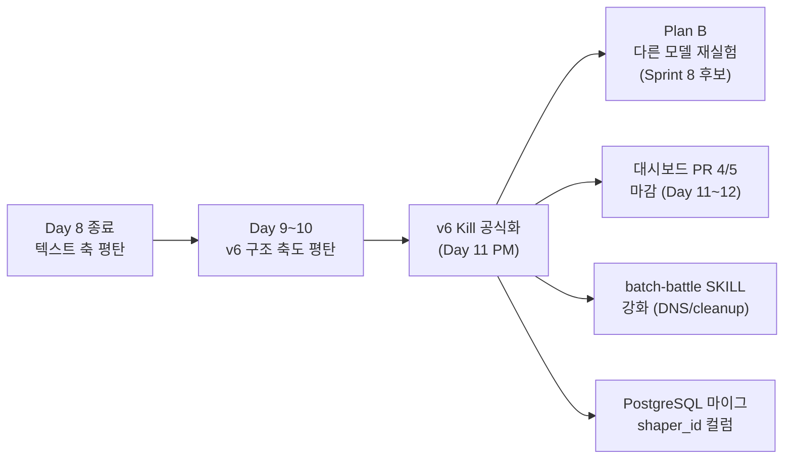

# 스크럼 미팅 로그 (Day 10 오후 — v6 Kill 회고 + Day 11 Plan B 킥오프)

- **날짜**: 2026-04-20 (Day 10 — 일요일)
- **Sprint**: Sprint 6 Day 10 — "v6 구조 축도 평탄, Plan B 발동 준비"
- **참석자 (11명)**: 애벌레 + Claude(main), PM, Architect, AI Engineer, Security, QA, Go Dev, Node Dev, Frontend Dev, DevOps, Designer
- **부주제**: **"Claude Opus 4.7, Here's what works and what doesn't"** — 메인 세션 모델 Opus 4.7 xhigh 를 두 스프린트 가까이 굴려본 체감을 각자 1분씩 공유

---

## 오늘의 큰 그림

Day 9~10 v6 ContextShaper 실측 결과가 나왔다. **3 shaper 모두 Δ<2%p, v2 baseline 에 수렴**. Day 8 텍스트 축 (v2 ≈ v3) + Day 9~10 구조 축 (v2 ≈ Passthrough/JokerHinter/PairWarmup) **이중 확증**으로 "28% 천장" 이 baseline 이 아니라 **gpt-5-mini 모델 자체의 한계** 임이 사실상 확정. v6 Kill 공식화 + Plan B (다른 모델 비교 재실험) 발동을 Day 11 에 한다. 오늘 스탠드업은 **회고 + Day 11 일감 분배 + Opus 4.7 부주제** 3축으로 진행.

---

## 부주제 라운드 — "Opus 4.7, Here's what works and what doesn't"

각자 30~60초씩, 메인 세션 / 자기 에이전트에서 Opus 4.7 xhigh 또는 Sonnet 4.6 을 굴려본 체감 포인트만.

### 애벌레

- **Works**: "왜 그렇게 결정했는지" 가 자연스럽게 따라온다. Day 8~9 의 v6 GO 판단처럼 **데이터 → 가설 → 의사결정** 전 과정을 한 번에 풀어놓을 수 있어서 결정문/리포트 품질이 확연히 다르다. xhigh extended thinking 이 켜진 세션에서 모호한 질문도 핵심을 짚어준다.
- **Doesn't**: 구현 디테일에 들어가면 **느리고 비싸다**. 단순 코드 패치를 main 세션에서 시키면 토큰 낭비. 그래서 2026-04-17 에 구현 5개 에이전트를 Sonnet 4.6 으로 다운시프트한 건 정답이었다.
- **개선 바람**: 에이전트 호출 시 메인 세션 컨텍스트가 통째로 넘어가지 않게 — **prompt 자체에 필요한 것만 적어 보내는 습관** 을 더 굳혀야 한다 (이건 Claude 설정이 아니라 내 습관).

### Claude (main) — Opus 4.7 xhigh

- **Works**: 1M context 가 진짜 차이를 만든다. Day 9~10 v6 Smoke 배치 + 리포트 63 + 2건 장애보고서 + ADR 3건을 **한 세션에서 일관된 톤으로** 끌고 갈 수 있었다. 토큰 prefix 캐시 덕에 4시간 가까운 세션도 응답 첫 토큰이 빠르다.
- **Doesn't**: **에이전트 결과 요약 신뢰도** 문제. 서브에이전트가 "구현 완료" 라고 보고해도 실제 diff 를 verify 하지 않으면 거짓 양성이 종종 잡힌다 (Day 9 batch-battle 스킬 이슈가 그 예). 시스템 프롬프트에서 "Trust but verify" 라고 명시되어 있어도 빠뜨리면 사고난다.
- **개선 바람**: 메인 세션이 background agent 의 progress 를 polling 하지 못하게 막는 게 좋다 (지금 정책이 그렇긴 함). 하지만 가끔 "정말 끝났는지" 알고 싶을 때 답답함. → notification 을 더 풍부하게.

### PM — Opus 4.7 xhigh

- **Works**: 일정/리스크 의사결정에서 트레이드오프를 자동으로 계산해준다. Day 8 "Task #19 본실측 GO/NO-GO" 같은 결정에서 N=3, 비용, 기대 효과를 한 번에 보여주니 회의 시간이 절반으로 줄었다.
- **Doesn't**: WBS 표 같은 **반복 정형 작업** 은 비용 대비 비효율. Sonnet 으로 충분.
- **개선**: PM 에이전트는 결정문/리스크 분석 같은 **추론 헤비** 한 작업으로만 호출 범위를 좁히자. 일정 조정/문서 업데이트는 Sonnet 으로 위임.

### Architect — Opus 4.7 xhigh

- **Works**: ADR 44 (v6 ContextShaper) 1041줄 작성에서 **Registry orthogonal 확장** 같은 추상 설계가 자연스럽게 나왔다. v2 텍스트 고정 + ContextShaper 만 교체하는 confound 통제 설계도 모델이 먼저 제안. 설계자 노릇을 진짜 한다.
- **Doesn't**: 너무 길게 쓴다. ADR 44 가 1041줄인데 절반은 잘라낼 수 있었다. **간결성 가이드** 가 들어와야 한다.
- **개선**: 시스템 프롬프트에 "ADR 은 500줄 이하 권장, 부록은 별도 파일로" 룰을 추가하면 좋겠다.

### AI Engineer — Opus 4.7 xhigh

- **Works**: 리포트 63번 (831줄, 감상+반성 포함) 같이 **데이터 + 해석 + 자기반성** 을 동시에 요구하는 작업에 강하다. Day 9~10 Smoke 결과를 단순 표로 끝내지 않고 "왜 평탄한가, 어디서 잘못 봤는가" 까지 끌어냈다.
- **Doesn't**: 프롬프트 엔지니어링 단순 튜닝(단어 한 개 교체) 은 Opus 가 과잉. v3/v4 패치는 Sonnet 으로도 충분했을 것.
- **개선**: 리포트 작성용 / 프롬프트 패치용 두 모드를 명시적으로 분리.

### Security — Opus 4.7 xhigh

- **Works**: 리포트 62~63 API 키 placeholder 점검에서 **컨텍스트 의존 패턴** (단순 grep 으로 못 잡는 변형) 을 잘 잡는다. 리포트 톤도 "발견 N건 / 위험도 / 패치" 까지 자동 정리.
- **Doesn't**: 의존성 감사 같은 **단순 매핑** 작업은 비용만 든다.
- **개선**: SEC-REV-013 같은 의존성 감사는 Sonnet + Trivy 결과 파싱 스크립트로 충분. Opus 는 침투 시나리오 / 위협 모델링에만.

### QA — Opus 4.7 xhigh

- **Works**: A/B 검증 기준을 **사전 정의** 하는 작업 (ADR 44 §검증 섹션). "v6 GO 기준 = Δ≥2%p, N≥3" 같은 게이트를 미리 박아둔 덕에 Day 9~10 결과 해석에서 갈팡질팡이 없었다.
- **Doesn't**: 단순 회귀 테스트 케이스 작성은 Sonnet 으로 충분.
- **개선**: QA 에이전트 호출 시 "**검증 게이트 정의**" 와 "**테스트 케이스 작성**" 두 모드를 분리해서 후자는 Sonnet 위임.

### Go Dev — Sonnet 4.6

- **Works (Sonnet)**: BUG-GS-005 같은 정형화된 cleanup 패턴 구현은 Sonnet 으로 충분히 빠르고 정확. 재작업 거의 없음.
- **Doesn't (Sonnet)**: 하지만 **timeout 체인 부등식 계약** 같은 cross-cutting 변경은 Sonnet 이 놓치는 경우가 있다 (2026-04-16 Run 3 사고). → 그런 작업은 architect 에이전트 (Opus) 에게 먼저 설계 위임 후 Sonnet 이 구현.
- **개선**: Sonnet 한테 timeout/Istio/ConfigMap 동시 변경을 시키지 말 것. **CLAUDE.md §7 부등식 계약** 을 prompt 에 항상 포함.

### Node Dev — Sonnet 4.6

- **Works (Sonnet)**: ContextShaper interface + 3 구현체 (Passthrough/JokerHinter/PairWarmup) + PromptBuilder 통합까지 Day 9~10 안에 끝냈다 (576 tests PASS). Sonnet 으로 **충분**.
- **Doesn't**: 인터페이스 설계 자체는 architect (Opus) 가 ADR 44 에서 이미 잡아준 덕. Sonnet 만으로 처음부터 설계했다면 v2 텍스트 confound 통제를 놓쳤을 가능성 큼.
- **개선**: 구현 에이전트는 **ADR 가 선행될 때 가장 효율적**. ADR 없이 Sonnet 단독 호출하지 말 것.

### Frontend Dev — Sonnet 4.6

- **Works (Sonnet)**: PR 4 ModelCardGrid 90% 완성, PR 5 RoundHistoryTable draft 까지 빠르게 진행. UI 컴포넌트 정형 작업은 Sonnet 이 가성비 좋다.
- **Doesn't**: E2E 테스트 작성에서 가끔 selector 추정이 어긋난다. Playwright report HTML 을 Read 로 먼저 보여주면 정확도 ↑.
- **개선**: PR 5 E2E 테스트 작성 시 기존 e2e/ 디렉토리 패턴을 prompt 에 포함해서 호출.

### DevOps — Sonnet 4.6

- **Works (Sonnet)**: kubectl/helm/ConfigMap 패치 같은 정형 인프라 작업은 Sonnet 이 빠르고 정확. Day 9 timeout 원복 10지점도 무리 없이 처리.
- **Doesn't**: DNS 장애 (2026-04-20-01-dns) 같이 **인과 추적** 이 필요한 incident 는 Sonnet 혼자선 부족. 메인 (Opus) 가 가설 → DevOps (Sonnet) 가 명령 실행 분담이 정답.
- **개선**: incident-response workflow 에서 1차 분석은 Opus, 2차 명령 실행은 Sonnet 이라는 분담을 SKILL 에 명시.

### Designer — Sonnet 4.6

- **Works (Sonnet)**: PR 5 RoundHistoryTable / Executive Summary 카드 디자인 사양은 Sonnet 으로 충분. 색상/간격/반응형 같은 정형 결정.
- **Doesn't**: Day 12 결정문 쓰는 것 같은 **서술형 사유** 는 Sonnet 보다 Opus 가 압도적.
- **개선**: 디자인 사양 = Sonnet, 디자인 의사결정문 = Opus 분리.

---

## 부주제 종합 — "Opus 4.7, the verdict"

| 구분 | Works ✅ | Doesn't ❌ |
|------|---------|----------|
| **추론 헤비** (ADR, 결정문, 리포트, 회고) | ⭐⭐⭐⭐⭐ | — |
| **장기 컨텍스트 일관성** (1M 토큰) | ⭐⭐⭐⭐⭐ | — |
| **트레이드오프 분석** (PM 의사결정) | ⭐⭐⭐⭐ | — |
| **간결성** (잘 안 함, 너무 김) | — | ❌ |
| **단순 정형 구현** (CRUD, UI, kubectl) | — | ❌ (비싸고 느림) |
| **에이전트 결과 verify** (false positive 위험) | — | ❌ (Trust but verify 필수) |
| **단순 매핑/grep** (의존성 감사 등) | — | ❌ (Sonnet 으로 충분) |

**한 줄 결론**: "**설계와 의사결정은 Opus, 구현과 패치는 Sonnet**" 분리 정책 (2026-04-17 갱신) 이 옳았다. Day 9~10 v6 Kill 같은 **고비용 의사결정** 에서 Opus 4.7 xhigh 의 가치가 명확히 입증. 단, **간결성 가이드** 를 prompt 단에서 강제하는 게 다음 개선 포인트.

**개선 액션**:
1. ADR 길이 가이드 (500줄 이하 권장) → CLAUDE.md 에 추가 검토
2. incident-response workflow 에서 Opus(분석) / Sonnet(실행) 분담 명시
3. Sonnet 호출 시 **CLAUDE.md §7 timeout SSOT** 등 cross-cutting 제약을 prompt 에 자동 주입하는 wrapper 검토

---

## 각자 어제/오늘/블로커

### 애벌레

- **어제 (Day 9)**: v6 ADR 44 + interface + 구현체 3종 + Smoke Run 1~5 추적. Designer/Frontend Dev PR 5 진행 확인.
- **오늘 (Day 10 오후)**: v6 Smoke Run 6~10 결과 수신 (Run 7·9·10 DNS 오염, Run 6 중단), 3 shaper 모두 Δ<2%p 확증. 리포트 63번(831줄) 수신, 마감 커밋 진행 (e2ec659, c1bbc9d). Day 11 Plan B 발동 결정.
- **블로커**: 없음. v6 Kill 결정 명료.

### Claude (main) — Opus 4.7 xhigh

- **어제**: Day 9 Chain (ADR 44 → interface → 구현 → Smoke Run 1~5 → 데일리 마감 048e225).
- **오늘**: Day 10 Chain (Smoke Run 6~10 + 장애 2건 분석 + 리포트 63 집필 + Day 12 결정문 + 데일리 마감). 리포트 63 Mermaid + 표 파이프 충돌 핫픽스 2건 (03cbab3, c1bbc9d).
- **내일 (Day 11)**: Plan B 공식 문서화 사회 + PR 4/5 마감 오케스트레이션 + batch-battle SKILL 강화.
- **블로커**: 없음.

### PM — Opus 4.7 xhigh

- **어제**: v6 로드맵 초안 + Day 10 아젠다.
- **오늘**: v6 Kill 결정문 (`work_logs/decisions/2026-04-20-...`) 초안 검토 + Day 11 Plan B 아젠다.
- **내일 (Day 11) P0**: **A안 Kill → Plan B 공식 문서화** + Task #19 본실측 Kill 처리 + Sprint 6 잔여 일정 재배분.
- **블로커**: 없음.

### Architect — Opus 4.7 xhigh

- **어제**: ADR 44 (1041줄) + ContextShaper 인터페이스 정의.
- **오늘**: v6 Kill 회고 — **"v2 텍스트 고정 + 구조 가공만 교체" confound 통제는 옳았다, 결과가 평탄한 게 모델 한계의 증거**. ADR 44 Postmortem 섹션 추가 검토.
- **내일**: Plan B (다른 모델 비교 재실험) 설계 — Claude/GPT/DeepSeek 동일 v2 + 동일 ContextShaper 비교 framework. Sprint 8 후보 ADR 초안.
- **블로커**: 없음.

### AI Engineer — Opus 4.7 xhigh

- **어제**: v6 Smoke 배치 추적 + 가설 공간 정의 (Passthrough/JokerHinter/PairWarmup).
- **오늘**: 리포트 63번 (831줄, Part 1 실측 / Part 2 감상 / Part 3 반성 6건) 집필 완료.
- **내일**: 블로그 2차 초안 (리포트 63 기반, 외부 공개 버전) 착수. "28% 천장 = 모델 한계" 메시지 정제.
- **블로커**: 없음.

### Security — Opus 4.7 xhigh

- **어제**: 휴식 (P0 없음).
- **오늘**: 리포트 63번 API 키 점검 (placeholder 패턴 grep) — 이슈 0.
- **내일**: SEC-REV-013 의존성 감사 (Sprint 6 후반 P2). 블로그 외부 공개 전 secret 재점검 대기.
- **블로커**: 없음.

### QA — Opus 4.7 xhigh

- **어제**: v6 검증 기준 사전 정의 (ADR 44 §검증).
- **오늘**: Smoke 결과 통계 해석 (Δ<2%p, σ 분석) — v6 Kill 게이트 확증. Run 7·9·10 DNS 오염 처리 (제외 vs 별도 분석 판단).
- **내일**: PR 5 RoundHistoryTable E2E 테스트 작성 지원 + batch-battle SKILL 검증 게이트 추가 정의.
- **블로커**: 없음.

### Go Dev — Sonnet 4.6

- **어제**: 휴식 (BUG-GS-005 cleanup 재확인).
- **오늘**: 휴식 — game-server 변경 없음.
- **내일**: PostgreSQL 마이그레이션 스키마 검토 — `prompt_variant_id` + `shaper_id` 컬럼 추가 (Sprint 7 준비). GORM model 영향 분석.
- **블로커**: 없음.

### Node Dev — Sonnet 4.6

- **어제**: ContextShaper interface + Passthrough/JokerHinter/PairWarmup 구현 + PromptBuilder 통합 (576 tests PASS).
- **오늘**: 코드 안정 상태 확인. v6 구현물은 그대로 두되 **default = Passthrough (= v2 동등)** 유지.
- **내일**: shaper_id 를 MoveResponse 에 기록하는 hook 검토 (PostgreSQL 마이그 대비). ai-adapter 변경 최소화.
- **블로커**: 없음.

### Frontend Dev — Sonnet 4.6

- **어제**: PR 5 RoundHistoryTable draft.
- **오늘**: PR 4 ModelCardGrid 90% 진행, PR 5 첫 PR comment 수신.
- **내일 (P0)**: **PR 4 마감** + **PR 5 E2E 테스트 작성** (QA 협업).
- **블로커**: 없음.

### DevOps — Sonnet 4.6

- **어제**: 원복 후 안정 상태 관찰.
- **오늘**: DNS 장애 1건 대응 (Run 7·9·10) — `getent hosts api.deepseek.com` 검증 절차 미비점 확인. 장애보고서 작성 (`2026-04-20-01-dns.md`).
- **내일**: **batch-battle SKILL 강화** — DNS 검증 (`getent hosts`) + cleanup 체크리스트 + pstree 강화. timeout 체인은 700s 유지.
- **블로커**: 없음.

### Designer — Sonnet 4.6

- **어제**: PR 5 RoundHistoryTable 디자인 사양 + Exec Summary 카드 스케치.
- **오늘**: 휴식 (Frontend Dev 구현 대기).
- **내일**: PR 4 ModelCardGrid 최종 디자인 review + 블로그 2차 초안 시각 자료 (28% 천장 그래프) 검토.
- **블로커**: 없음.

---

## Day 11 (2026-04-21) 역할 분담 (한 장 요약)

| 담당 | 우선순위 | 작업 | 산출물 | 예상 소요 |
|------|---------|------|--------|----------|
| PM | **P0** | A안 Kill → Plan B 공식 문서화 + Task #19 Kill 처리 | 결정문 1장 + WBS 갱신 | 2~3h |
| Frontend Dev | **P0** | PR 4 ModelCardGrid 마감 | PR 4 merged | 3h |
| Frontend Dev + QA | **P0** | PR 5 RoundHistoryTable E2E 테스트 | E2E spec 1~2개 | 3h |
| AI Engineer | P1 | 블로그 2차 초안 (리포트 63 기반) | 블로그 draft.md | 4h |
| DevOps | P1 | batch-battle SKILL 강화 (DNS/cleanup/pstree) | SKILL.md patch | 2h |
| Architect | P1 | Plan B (다른 모델 비교) 설계 ADR 초안 | `docs/02-design/45-plan-b-...md` 초안 | 3h |
| Go Dev | P2 | PostgreSQL 마이그 스키마 (`shaper_id` 컬럼) 검토 | 마이그 SQL 초안 | 2h |
| Node Dev | P2 | shaper_id MoveResponse hook 검토 | 분석 메모 | 1h |
| Security | P3 | 블로그 외부 공개 전 secret 재점검 대기 | (대기) | — |
| Designer | P3 | PR 4 최종 review + 블로그 시각 자료 검토 | review 코멘트 | 1h |
| QA | P1 | PR 5 E2E 협업 + batch-battle 검증 게이트 추가 | 테스트 + 게이트 정의 | 3h |
| Claude (main) | — | Plan B 공식화 사회 + 마감 오케스트레이션 | 스크럼/데일리/바이브 | — |

---

## 논의 사항

1. **v6 Kill 의 의미 재확인** — "v2 가 좋다" 가 아니라 "**v2 든 v6 든 차이 없다 = 모델이 천장**" 이다. 결정문 표현 주의 (PM/AI Engineer).
2. **Plan B 범위** — Sprint 6 안에는 ADR 초안만, **실제 다른 모델 비교 실측은 Sprint 8 후보**. Sprint 7 은 PostgreSQL 마이그레이션 + 대시보드 안정화 우선 (PM 합의).
3. **batch-battle SKILL 반성 6건 반영 우선순위** — DNS 검증 / cleanup 체크리스트 / pstree 강화 3건만 Day 11. 나머지 3건은 Sprint 7.
4. **PostgreSQL 마이그 시점** — Day 11~14 안에 스키마 초안만, 실제 마이그는 Sprint 7 첫 주 (Go Dev + DevOps 협업).
5. **블로그 2차 초안 톤** — 외부 공개라 "실패담" 보다 "**측정과 결정의 과학**" 톤 (AI Engineer 제안).
6. **Opus 4.7 비용 모니터링** — Day 9~10 메인 세션 토큰 사용량 점검 필요. 부주제 회고에서 나온 "구현은 Sonnet" 정책이 실제로 비용을 줄였는지 확인 (Claude main, Day 12 회고).

---

## 액션 아이템

| 담당 | 할 일 | 기한 |
|------|-------|------|
| PM | A안 Kill → Plan B 결정문 + Task #19 Kill 처리 + WBS 갱신 | Day 11 오전 |
| Frontend Dev | PR 4 ModelCardGrid 마감 (merge) | Day 11 |
| Frontend Dev + QA | PR 5 RoundHistoryTable E2E 테스트 작성 | Day 11 |
| AI Engineer | 블로그 2차 초안 착수 (리포트 63 기반) | Day 11~12 |
| DevOps | batch-battle SKILL 강화 (DNS/cleanup/pstree 3건) | Day 11 |
| Architect | Plan B (다른 모델 비교) 설계 ADR 초안 | Day 11~12 |
| Go Dev | PostgreSQL `shaper_id` 컬럼 마이그 SQL 초안 | Day 12 |
| Node Dev | shaper_id MoveResponse hook 분석 메모 | Day 12 |
| Designer | PR 4 최종 디자인 review + 블로그 시각 자료 검토 | Day 11~12 |
| Security | 블로그 외부 공개 전 secret 재점검 (대기) | Day 12+ |
| QA | batch-battle 검증 게이트 추가 정의 | Day 11 |
| Claude (main) | Day 11 Plan B 공식화 오케스트레이션 + 마감 | Day 11 저녁 |

---

## 블로커

- 없음. v6 Kill 결정 명료, Day 11 일감 분배 완료.

---

## 메모

- **Day 10 의 성격**: "구조 축도 평탄, 두 축 동시 확증" 의 마무리. 감정 면에서 "v6 도 안 됐네" 가 아니라 "**두 축에서 동시 확증된 결론은 더 강력하다**" 로 받아들이는 게 맞다 (AI Engineer/Architect 합의).
- **부주제 회고 결론 활용**: 오늘 Opus 4.7 회고에서 나온 3개 개선안 (ADR 길이 가이드 / incident workflow 분담 / Sonnet 자동 제약 주입) 은 Day 12 회고 미팅에서 정식 결정문으로 끌어올린다.
- **Day 11~14 의 전략**: 실측 Kill 했으니 **개발자 작업 (대시보드/마이그/SKILL)** 으로 무게 이동. PM/Architect 의 추론 작업은 Plan B ADR + 결정문 위주.
- 저녁 마감: Day 10 데일리 + 바이브 로그 + 커밋 (daily-close SKILL, 이미 e2ec659 + c1bbc9d 진행 중).
