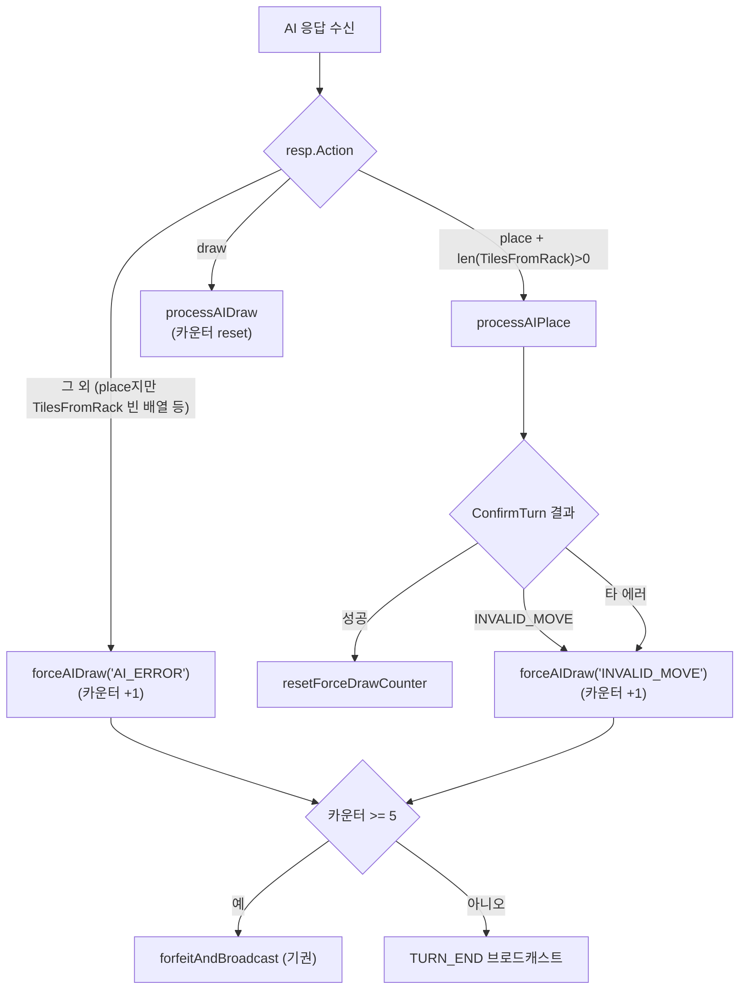

# 2026-05-08 버그 정밀 분석 (BUG-GHOST-002 잔존 + LLaMA 중도 기권)

## 0. TL;DR

| 버그 | 잔존 원인 (가장 유력) | 즉시 수정 위치 |
|------|---------------------|-------------|
| 1+2. 좀비카드 + 상단 미정렬 | `useGameSync` TURN_START 콜백이 `seatChanged \|\| turnNumberChanged` 게이트에 막혀 **AI 턴 직후 GAME_STATE 추가 setState** 시 재호출되지 않음 → `saveTurnStartSnapshot` 미호출 → `draft.groups`에 이전 턴 stale 그룹이 잔존 | `src/frontend/src/hooks/useGameSync.ts:62~117` |
| 1+2. 좀비카드 (보조) | `currentTableGroups`가 `draftPendingTableGroups ?? gameState.tableGroups` fallback인데, 서버가 `tableGroups`에 `tiles=[]`인 그룹을 한 번이라도 보내면 GameBoard line 371 filter는 막아주지만 **상단 placeholder + min-h-[300px]** 때문에 그룹이 작을 때 패들이 아래로 밀린 인상이 시각적으로 좀비처럼 보임 | `src/frontend/src/components/game/GameBoard.tsx:325~336` (`min-h-[300px]` + `flex-1` 조합) |
| 3. LLaMA 중도 기권 | `ResponseParser`가 `action="place" + tilesFromRack=[]` 응답을 **draw로 변환하지 않고 place 그대로 통과**시킴 → ws_handler line 1084의 `&& len(resp.TilesFromRack) > 0` 조건이 false → line 1090 `forceAIDraw("AI_ERROR")` 분기 → 강제드로우 카운터 +1. LLaMA의 v8-ollama-place는 `tilesFromRack`을 자주 빈 배열로 반환 → 5턴이면 forfeit | `src/ai-adapter/src/common/parser/response-parser.service.ts:82~151` 또는 `src/game-server/internal/handler/ws_handler.go:1084~1091` |

---

## 1. 버그 1+2: 좀비카드 + 스크롤/상단정렬

### 1.1 b6fb290이 적용한 수정 재확인

| ID | 파일 | 변경 |
|----|------|------|
| F1 | `pendingStore.ts:198~224` | `saveTurnStartSnapshot`에서 `groups: filtered`로 명시 동기화 |
| F3 | 동일 | `tableGroups.filter(g => g.tiles.length > 0)` |
| F4 | `GameBoard.tsx:371` | 렌더 시점에도 `tableGroups.filter(g => g.tiles.length > 0)` |
| F5 | `GameBoard.tsx:369` | `flex flex-wrap gap-6 content-start` (상단 정렬) |
| F6 | `useGameSync.ts:100` | race window에서 `setState({draft:null})` 강제 |

### 1.2 b6fb290이 못 잡은 잔존 경로 (3가지 가설)

#### 가설 A — `useGameSync` 게이트 누락 (가장 유력)

`useGameSync.ts:62~117`의 TURN_START 콜백은 selector가 `currentSeat / mySeat / myTiles / tableGroups / turnNumber` 5개 필드를 추적하지만, line 67에서 **`seatChanged` 또는 `turnNumberChanged`만 트리거**한다.

```ts
const seatChanged = next.currentSeat !== prev.currentSeat;
const turnNumberChanged = next.turnNumber !== prev.turnNumber;
if (!seatChanged && !turnNumberChanged) return;
```

문제 시나리오:

1. AI 턴 종료 → `broadcastTurnEndFromState`로 GAME_STATE 갱신 (tableGroups에 AI가 새로 놓은 그룹 포함). 이 setState 시점에는 `currentSeat`가 아직 AI seat 그대로 → seatChanged=false.
2. 곧이어 `broadcastTurnStart` → TURN_START 핸들러가 `gameState.currentSeat = 내 seat`로 갱신. seatChanged=true → 콜백 발동. `pending.saveTurnStartSnapshot(next.myTiles, next.tableGroups)` 호출. **여기서는 OK.**
3. 하지만 `useWebSocket.ts`의 GAME_STATE 핸들러는 `setGameState(...)` 후 `setMyTiles(...)`을 분리해 호출한다 (line 71~93 회귀 핫픽스 주석). 두 setState 사이에 zustand subscribe가 두 번 평가된다.
4. 첫 평가에서 `next.tableGroups`는 이미 새 보드. 그러나 `next.myTiles`가 아직 이전 턴 잔여 (race window가 아닐 때, 이전 턴 myTiles 그대로). `seatChanged=true` → saveTurnStartSnapshot(이전 myTiles, 새 tableGroups) 호출. draft.myTiles가 이전 값으로 고정됨.
5. 두 번째 평가에서 `setMyTiles` 후. 이번에는 seatChanged/turnNumberChanged 둘 다 false → early return. **myTiles 업데이트가 draft에 반영 안 됨.**
6. line 134의 백필 effect는 `prev.myTilesLength !== 0`이면 트리거 안 됨 (line 144). AI 턴 진행 중에도 내 myTiles는 0이 아니므로 백필 못 함.

→ **draft.myTiles와 draft.groups 사이의 시간 불일치**가 생기고, 사용자가 드래그 시작 직후 stale draft.groups가 보드를 차지한다. 이것이 b6fb290 이후에도 좀비카드가 잔존하는 1차 원인으로 보인다.

#### 가설 B — gameState.tableGroups의 빈 그룹이 fallback으로 노출

`GameClient.tsx:540`:

```ts
const currentTableGroups = useMemo(
  () => draftPendingTableGroups ?? gameState?.tableGroups ?? [],
  ...
);
```

`draftPendingTableGroups`는 `s.draft ? s.draft.groups : null` (line 382~384). draft가 없는 시점(예: 게임 진입 직후, race window)에는 `gameState.tableGroups`로 fallback. **서버가 tableGroups에 `tiles=[]`인 그룹을 한 번이라도 보내면**, `gameState.tableGroups`에는 빈 그룹 포함된 채 보존된다 (gameStore에는 별도 필터 없음). GameBoard line 371 `filter(g => g.tiles.length > 0)`가 차단해서 화면에는 안 나오지만, **`min-h-[300px]` + `flex-1` (line 326, 330)** 때문에 그룹이 1~2개일 때 보드 컨테이너가 세로로 stretch되고, `content-start`가 상단정렬은 시켜주지만 패들이 시각적으로 가운데~아래로 밀린 인상.

→ 사용자가 "빈 박스가 보드 상단에 있다"고 말한 부분은 **실제 빈 그룹이 아니라**, 보드 컨테이너 자체의 큰 영역(`flex-1` + `min-h-[300px]`)에 그룹들이 wrap되어 있고 그 외 여백이 빈 박스처럼 인식된 가능성이 있다. `padding p-4` + `border-2`도 빈 박스 효과를 강화.

#### 가설 C — `tiles` 안에 빈 문자열/invalid code가 들어가서 GroupBlock 자체는 렌더되나 안의 Tile이 빈 박스

`Tile.tsx:62`의 `parseTileCode(code)`는 빈 문자열에 대한 가드가 없다. `tiles=["R7a", ""]`처럼 invalid code가 섞이면 group.tiles.length>0이라 GameBoard filter는 통과하고, 그 안의 빈 Tile 박스가 렌더된다. 빈도는 낮지만 가능.

→ 이 가설은 **dragEndReducer 또는 서버 응답 변환 어딘가에서 빈 문자열이 끼어든다**는 전제가 필요. 현재 코드 정적 검사로는 발견 못 했으나, 사용자 테스트 환경에서 한 번이라도 발생했으면 기록상 좀비카드로 보인다.

### 1.3 수정 방향

#### 옵션 1 (권장): useGameSync 게이트 보강 + 보드 컨테이너 height 정정

- `useGameSync.ts:67`의 게이트를 `seatChanged || turnNumberChanged || tableGroupsChanged` 또는 **myTilesChanged**까지 확장.
  - 단, race window 핫픽스(line 94~104)와 충돌하지 않도록, `next.myTiles.length === 0 && draft.groups가 비어있지 않은 경우`만 추가 트리거.
- 또는 더 안전하게, **TURN_START 콜백을 두 단계로 분리**:
  - Stage 1: seat/turnNumber 변경 시 `pendingStore.setState({draft: null})` (강제 초기화)
  - Stage 2: `myTiles + tableGroups` 둘 다 채워진 시점에 백필 effect (line 134~164)에서 `saveTurnStartSnapshot` 호출. 현재 백필 effect의 게이트(`prev.myTilesLength !== 0` line 144)도 함께 완화 필요.
- `GameBoard.tsx:330`의 `min-h-[300px]`를 `min-h-0` 또는 그룹 개수에 따라 동적으로 조정. `flex-1`만 유지하면 main의 flex-col이 자연스럽게 분배.
- 서버 측: `gameState.tableGroups` 응답 직전에 `len(g.Tiles) > 0` 필터 1회 보강 (방어).

**트레이드오프**:
- 장점: 좀비 그룹의 근본 원인(stale draft.groups) + 시각적 빈 박스 두 측면 모두 차단.
- 단점: useGameSync 콜백 게이트 변경 시 회귀 위험. 04-28 race window 핫픽스가 깨지지 않도록 단위 테스트 추가 필수.

#### 옵션 2: currentTableGroups 계산 통합 + 빈 그룹 strict 필터

- `GameClient.tsx:539~542`의 useMemo 안에서 빈 그룹을 한 번 더 필터: `(draftPendingTableGroups ?? gameState?.tableGroups ?? []).filter(g => g.tiles.length > 0)`.
- 모든 fallback 경로에서 빈 그룹 차단 보장.
- pendingStore의 dragEndReducer + applyMutation 단계에서도 추가로 strict 검사: `tiles` 배열 내 빈 문자열/undefined 제거.

**트레이드오프**:
- 장점: 가설 B/C를 동시 차단. 변경 범위 작음.
- 단점: 가설 A(stale draft.groups 자체)는 그대로 — draft.groups가 이전 턴 그룹을 보존하면 GameBoard에 그게 그대로 표시됨. 시각적 좀비카드는 막을 수 있어도, **확정 시 INVALID_MOVE가 나는 부수 버그**가 잔존할 수 있음.

#### 옵션 3: pendingStore.draft 무효화 트리거를 gameState.tableGroups 변화에 결합

- `useGameSync`에 별도 effect 추가: `gameState.tableGroups`의 deep 변경(또는 ID 집합 변경) 감지 시, `draft.pendingGroupIds.size === 0`이면 `pendingStore.setState({draft: null})`로 무효화.
- 사용자가 드래그 중이 아니면(pending 0) 항상 서버 truth로 동기화.

**트레이드오프**:
- 장점: 어떤 race도 결국 한 박자 후 정정됨.
- 단점: deep equality 비용. `tableGroups.length`만 본다면 그룹 추가/삭제는 잡지만 그룹 내부 변경(타일 추가)은 못 잡음. zustand selector가 reference equality를 쓰므로 매 setState마다 재계산 가능 — 성능 영향 측정 필요.

### 1.4 권장: 옵션 1 + 옵션 2 조합

- 가설 A를 옵션 1로 (근본 원인), 가설 B/C를 옵션 2로 (방어 레이어). 옵션 3은 회귀 안전망으로 차후 도입 검토.
- 이유: 사용자가 b6fb290 이후에도 동일 증상 보고 → b6fb290이 saveTurnStartSnapshot 시점만 패치했을 뿐, **그 시점이 호출되지 않는 race**(가설 A)는 그대로 살아 있다. 옵션 2만으로는 시각만 가려지고 실제 데이터 정합성은 깨진 채.

### 1.5 수정 파일 목록 (옵션 1+2)

| 파일 | 변경 요약 |
|------|---------|
| `src/frontend/src/hooks/useGameSync.ts` | TURN_START 콜백 게이트 확장 + 백필 effect 게이트 완화 |
| `src/frontend/src/app/game/[roomId]/GameClient.tsx` | line 539~542 `currentTableGroups` useMemo에 strict filter 추가 |
| `src/frontend/src/components/game/GameBoard.tsx` | `min-h-[300px]` 재검토 (필요 시 `min-h-0`로 완화) |
| `src/frontend/src/store/pendingStore.ts` | applyMutation의 nextGroups에 빈 문자열 tile code 제거 1줄 보강 |
| `src/frontend/src/hooks/__tests__/useGameSync.test.ts` (신규) | AI 턴 → 내 턴 전환 시 myTiles race + tableGroups 동기화 회귀 테스트 |
| `src/game-server/internal/service/game_service.go` (선택) | `tableGroups` 직렬화 직전 `len(Tiles) > 0` 필터 (방어) |

---

## 2. 버그 3: LLaMA 중도 기권

### 2.1 강제드로우 카운터 흐름 정리



핵심 위치:
- `ws_handler.go:1084` `if resp.Action == "place" && len(resp.TilesFromRack) > 0` ← **가장 결정적인 분기**
- `ws_handler.go:1086` `else if resp.Action == "draw"`
- `ws_handler.go:1090` 그 외 → `forceAIDraw(reason="AI_ERROR")` ← **카운터 +1**
- `ws_handler.go:1213` `incrementForceDrawCounter` 5회 시 forfeit

### 2.2 LLaMA 응답 변환 경로

`response-parser.service.ts:82~151`:

```ts
// action === 'place' 처리
const tileGroupsRaw = obj.tableGroups as ...;
const tilesFromRack = obj.tilesFromRack as string[] | undefined;

// tableGroups가 비어있으면 → draw로 변환  (line 90~106)
if (!tileGroupsRaw || ... tileGroupsRaw.length === 0) {
  return { action: 'draw', ... };
}

// 그룹 내부 tiles < 3이면 → draw로 변환  (line 109~126)
for (const group of tileGroupsRaw) {
  if (... group.tiles.length < 3) return { action: 'draw', ... };
  ...
}

// !!! tilesFromRack 빈 배열에 대한 draw 변환은 없음
return {
  action: 'place',
  tableGroups,
  tilesFromRack: tilesFromRack ?? [],  // line 147 — 빈 배열 그대로 통과
  ...
};
```

→ **LLaMA가 `{action:"place", tableGroups:[{tiles:[A,B,C]}], tilesFromRack:[]}` 같은 응답을 내면**:
- 파서는 그대로 `place + tilesFromRack=[]`로 통과시킴.
- ws_handler line 1084 조건 `len(resp.TilesFromRack) > 0`가 false → line 1090 `forceAIDraw("AI_ERROR")`. 카운터 +1.

이게 LLaMA에서 자주 발생하는 시나리오인 이유:
- v8-ollama-place 프롬프트는 사전 계산된 멜드 후보를 주입하여 LLaMA가 선택만 하도록 유도. 작은 모델(qwen2.5:3b)은 종종 tableGroups에 멜드를 넣지만 tilesFromRack을 빠뜨림(또는 빈 배열로 채움).
- place rate 15.8%란 통계는 **"성공적으로 place로 분류된 비율"**. 그 외 84.2%는 "draw로 변환됨" + "place + tilesFromRack 빈 배열로 forceAIDraw" 두 부류로 나뉨. **후자가 누적되면 5회 도달 시 forfeit**.

### 2.3 보조 의심 지점: INVALID_MOVE 경로 (`ws_handler.go:1141~1176`)

만약 LLaMA가 `tilesFromRack`을 정상 채워 보내도, 사전 계산된 멜드와 실제 게임 상태가 어긋나면(예: 다른 플레이어가 그 사이 보드를 변경했는데 LLaMA가 stale snapshot 기반 멜드를 만들면) `ConfirmTurn` → `INVALID_MOVE` → `forceAIDraw("INVALID_MOVE")` → 카운터 +1. v8-ollama-place의 사전 계산이 어떤 보드 시점을 기준으로 하는지 확인 필요.

또한 `ResponseParser`가 `tableGroups` 검증을 통과시킨 응답이라도, **실제 게임 엔진의 V-* 룰**(런/그룹 유효성, 30점 초기 등록, 조커 회수 등)을 위반하면 INVALID_MOVE로 떨어진다.

### 2.4 수정 방향

#### 옵션 1 (권장): ResponseParser에서 `place + tilesFromRack 빈 배열` → draw 변환

- 한 줄짜리 정상화. 다른 모델(GPT, Claude, DeepSeek)에도 안전함 — 정상 모델은 이 케이스를 거의 안 만듦.
- `response-parser.service.ts:135~141`의 tilesFromRack 검증 직전에:
  ```ts
  if (!tilesFromRack || !Array.isArray(tilesFromRack) || tilesFromRack.length === 0) {
    return {
      success: true,
      response: { action: 'draw', reasoning: '랙에서 옮길 타일이 없어 드로우합니다.', metadata: fullMetadata },
    };
  }
  ```
- 이렇게 하면 ws_handler line 1090의 "AI_ERROR" 분기가 더 이상 정상 LLaMA 응답에서 발화하지 않는다.

**트레이드오프**:
- 장점: 카운터 누적 차단. 기권 빈도 급감 예상. 변경 범위 최소.
- 단점: 사전 계산된 멜드 일부가 "사용 가능"이었어도 draw로 떨어뜨림 (보드에 있는 타일만으로 재배치하는 경우 — 예: V-09 멜드 분할/연장 — `tilesFromRack` 비어 있음이 정상). **이 케이스를 고려해야 함**: tableGroups가 비어있지 않은데 tilesFromRack만 비어있으면 server-side 재배치(V-09)일 수 있다. 무조건 draw 변환하면 합법적인 재배치까지 막힘.

→ 보완: `tilesFromRack=[] && tableGroups에 새 그룹(서버에 없던 것)이 1개도 없음` 조건일 때만 draw 변환. 새 그룹이 있으면 합법 재배치로 간주하고 place 유지.

#### 옵션 2: ws_handler에서 `place + tilesFromRack=[]`을 INVALID_MOVE 대신 처리

- `ws_handler.go:1084~1091`을 명시적으로 분기:
  ```go
  if resp.Action == "place" && len(resp.TilesFromRack) > 0 {
      h.processAIPlace(...)
  } else if resp.Action == "place" && len(resp.TilesFromRack) == 0 {
      // server-side 재배치 시도 — TableGroups만으로 검증
      if hasNewGroup(resp.TableGroups, currentState) {
          h.processAIPlace(...)  // 합법 재배치
      } else {
          h.processAIDraw(...)  // 카운터 reset (자발적 draw로 간주)
      }
  } else if resp.Action == "draw" { ... }
  ```
- `processAIPlace`는 이미 INVALID_MOVE 처리 분기를 가짐 → 무효면 `forceAIDraw("INVALID_MOVE")` → 카운터 +1 (정당함).

**트레이드오프**:
- 장점: V-09 합법 재배치를 살림. 카운터 누적 정확히 INVALID 시에만.
- 단점: ws_handler 복잡도 증가. `hasNewGroup` 헬퍼 추가 + 단위 테스트 필요.

#### 옵션 3: 카운터 게이트 자체를 완화 (5회 → 8회 또는 모델별)

- LLaMA에 한해 `incrementForceDrawCounter` 임계치 상향. 또는 isFallbackDraw 사유별로 가중치 차등(AI_ERROR=1, INVALID_MOVE=2 등).
- 임계치만 조정하므로 가장 빠름.

**트레이드오프**:
- 장점: 즉시 반영. 다른 모델 영향 없음.
- 단점: **근본 원인을 가림**. 실제로 LLaMA가 매 턴 의미 있는 draw를 내보내지 못하고 있다는 신호를 무시. 게임 진행은 살리지만 LLaMA 품질이 그대로.

### 2.5 권장: 옵션 1의 보완형(tableGroups에 신규 그룹 유무로 분기) + 운영 모니터링

- 우선 ResponseParser에서 분기:
  - `tilesFromRack=[]` && `tableGroups`에 서버 보드에 없던 신규 그룹 0개 → draw 변환
  - `tilesFromRack=[]` && 신규 그룹 ≥ 1 → place 유지 (V-09 재배치)
  - `tilesFromRack>0` → 기존 흐름
- 신규 그룹 판정은 currentBoardState 비교가 필요. 어댑터 입력 `MoveRequestDto`에 보드 스냅샷 포함되어 있어야 가능. `prompt-builder.service.ts`/`base.adapter.ts` 입력 구조 확인 후 판단.
- 만약 어댑터 입력으로 보드 스냅샷이 없다면, 신규 그룹 판정을 **game-server 측**(옵션 2 형태)으로 이전. ws_handler가 currentState를 갖고 있으므로 자연스러움.

### 2.6 수정 파일 목록 (권장안)

| 파일 | 변경 요약 |
|------|---------|
| `src/ai-adapter/src/common/parser/response-parser.service.ts` | `tilesFromRack=[]` && `tableGroups`에 신규 그룹 0개일 때 draw 변환 (또는 어댑터에 보드 스냅샷 없을 시 ws_handler에서 처리) |
| `src/game-server/internal/handler/ws_handler.go` | line 1084 분기 명시화: `place + tilesFromRack=[] + 신규 그룹 없음 = processAIDraw` (옵션 2 채택 시) |
| `src/ai-adapter/src/common/parser/response-parser.service.spec.ts` | place + tilesFromRack 빈 배열 케이스 테스트 추가 |
| `src/game-server/internal/handler/ws_handler_test.go` | LLaMA 응답 패턴(빈 tilesFromRack)에 대한 카운터 reset 테스트 추가 |
| `docs/02-design/55-game-rules-enumeration.md` | V-09 server-side 재배치 룰에 "tilesFromRack=[] 허용 조건" 명시 (현재 명시되어 있다면 ID 참조 추가) |

### 2.7 사이드 이슈 — v8-ollama-place 프롬프트 점검

place rate 15.8%는 v8-ollama-place 도입 후 측정값(2026-05-01 핫픽스). 사전 계산된 멜드가 LLaMA에 정상 주입되고 있다면, LLaMA는 그 후보를 선택만 하면 된다. 그런데 `tilesFromRack` 항목을 LLaMA가 자주 빠뜨린다면 — 프롬프트에 **`tilesFromRack` 필드를 `tableGroups`에서 자동 도출하라**는 명시적 지시가 빠졌거나, JSON schema 예시가 부족할 가능성. 이는 ai-engineer에 후속 위임.

---

## 3. 작업 우선순위 (제안)

| 순위 | 작업 | 영향 | 예상 공수 |
|------|------|------|---------|
| P0 | 버그 3 옵션 1 보완형 — ResponseParser 또는 ws_handler 분기 | LLaMA 게임 진행 가능 | 0.5d |
| P0 | 버그 1+2 옵션 1 — useGameSync 게이트 보강 + 회귀 테스트 | 좀비카드 근본 차단 | 1d |
| P1 | 버그 1+2 옵션 2 — currentTableGroups strict filter | 시각 결함 방어층 | 0.25d |
| P1 | GameBoard `min-h-[300px]` 재검토 | 패들 위치 정상화 | 0.25d |
| P2 | server-side `tableGroups` 빈 그룹 필터 (방어) | 회귀 안전망 | 0.25d |
| P2 | v8-ollama-place 프롬프트 ai-engineer 위임 | place rate 향상 | 별도 |

---

## 4. 검증 시나리오 (구현 후)

1. **Self-play harness G4**: LLaMA × 3 + Human 1, 50턴 지속, forfeit 0회 확인.
2. **E2E**: AI 턴 → 내 턴 전환 후 보드에 빈 그룹 없는지 + 패들이 보드 직하단에 위치 + 스크롤바 부재 (Playwright assertion).
3. **Jest 회귀**: `useGameSync` race window 테스트 + ResponseParser tilesFromRack 빈 배열 변환 테스트.
4. **수동 시각 확인**: K8s `ghost-fix-v2-{sha}` 배포 후, 내 턴 진입 시 보드 패들 위치 스크린샷.

---

## 5. 확인 필요 사항 (분석 한계)

- 사용자 스크린샷 실물을 직접 보지 못함 — "빈 박스"가 GroupBlock 외곽선인지, 보드 컨테이너 내부 여백인지 시각 확인 필요.
- LLaMA 실측 응답 JSON 샘플(`tilesFromRack` 필드 형태) 확보 시 가설 3.2 확정 가능.
- `gameState.tableGroups`에 빈 그룹이 실제로 들어오는지 — Redis snapshot 또는 game-server 로그에서 확인 필요(가설 B 확정용).
