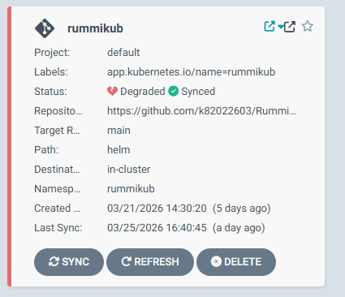
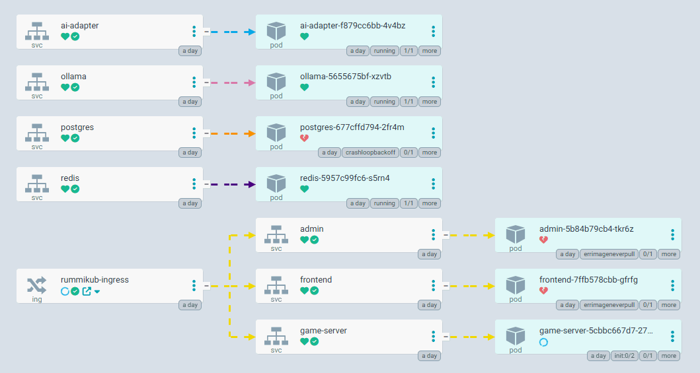

# k8s Containers 




```bash
claude@DESKTOP-JE4TNAH:~$ kubectl get all -n rummikub
NAME                               READY   STATUS              RESTARTS         AGE
pod/admin-5b84b79cb4-tkr6z         0/1     ErrImageNeverPull   0                20h
pod/ai-adapter-f879cc6bb-4v4bz     1/1     Running             1 (137m ago)     20h
pod/frontend-7ffb578cbb-gfrfg      0/1     ErrImageNeverPull   0                20h
pod/game-server-5cbbc667d7-277gt   0/1     Init:0/2            0                20h
pod/ollama-5655675bf-xzvtb         1/1     Running             1 (137m ago)     20h
pod/postgres-677cffd794-2fr4m      0/1     CrashLoopBackOff    41 (3m21s ago)   20h
pod/redis-5957c99fc6-s5rn4         1/1     Running             1 (137m ago)     20h

NAME                  TYPE        CLUSTER-IP       EXTERNAL-IP   PORT(S)          AGE
service/admin         NodePort    10.110.87.76     <none>        3001:30001/TCP   20h
service/ai-adapter    NodePort    10.102.239.195   <none>        8081:30081/TCP   20h
service/frontend      NodePort    10.109.172.182   <none>        3000:30000/TCP   20h
service/game-server   NodePort    10.103.247.150   <none>        8080:30080/TCP   20h
service/ollama        ClusterIP   10.105.49.1      <none>        11434/TCP        20h
service/postgres      NodePort    10.98.251.57     <none>        5432:30432/TCP   20h
service/redis         ClusterIP   10.100.96.244    <none>        6379/TCP         20h

NAME                          READY   UP-TO-DATE   AVAILABLE   AGE
deployment.apps/admin         0/1     1            0           20h
deployment.apps/ai-adapter    1/1     1            1           20h
deployment.apps/frontend      0/1     1            0           20h
deployment.apps/game-server   0/1     1            0           20h
deployment.apps/ollama        1/1     1            1           20h
deployment.apps/postgres      0/1     1            0           20h
deployment.apps/redis         1/1     1            1           20h

NAME                                     DESIRED   CURRENT   READY   AGE
replicaset.apps/admin-5b84b79cb4         1         1         0       20h
replicaset.apps/ai-adapter-f879cc6bb     1         1         1       20h
replicaset.apps/frontend-7ffb578cbb      1         1         0       20h
replicaset.apps/game-server-5cbbc667d7   1         1         0       20h
replicaset.apps/ollama-5655675bf         1         1         1       20h
replicaset.apps/postgres-677cffd794      1         1         0       20h
replicaset.apps/redis-5957c99fc6         1         1         1       20h
claude@DESKTOP-JE4TNAH:~$ kubectl get all -A
NAMESPACE       NAME                                         READY   STATUS              RESTARTS         AGE
argocd          pod/argocd-application-controller-0          1/1     Running             9 (137m ago)     14d
argocd          pod/argocd-redis-f4bd97dc6-j69pv             1/1     Running             8 (137m ago)     14d
argocd          pod/argocd-repo-server-98455c678-9wnjm       1/1     Running             2 (137m ago)     25h
argocd          pod/argocd-server-67858c7d7c-tp6d2           1/1     Running             9 (137m ago)     13d
gitlab-runner   pod/gitlab-runner-5cf549486b-vl9dd           1/1     Running             6 (137m ago)     10d
kube-system     pod/coredns-66bc5c9577-fdzpj                 1/1     Running             18 (137m ago)    17d
kube-system     pod/coredns-66bc5c9577-wcvgr                 1/1     Running             18 (137m ago)    17d
kube-system     pod/etcd-docker-desktop                      1/1     Running             17 (137m ago)    17d
kube-system     pod/kube-apiserver-docker-desktop            1/1     Running             17 (137m ago)    17d
kube-system     pod/kube-controller-manager-docker-desktop   1/1     Running             17 (137m ago)    17d
kube-system     pod/kube-proxy-wd79z                         1/1     Running             17 (137m ago)    17d
kube-system     pod/kube-scheduler-docker-desktop            1/1     Running             22 (137m ago)    17d
kube-system     pod/metrics-server-5b57c547cb-5tdb7          1/1     Running             7 (137m ago)     11d
kube-system     pod/storage-provisioner                      1/1     Running             24 (137m ago)    17d
kube-system     pod/vpnkit-controller                        1/1     Running             18 (137m ago)    17d
rummikub        pod/admin-5b84b79cb4-tkr6z                   0/1     ErrImageNeverPull   0                20h
rummikub        pod/ai-adapter-f879cc6bb-4v4bz               1/1     Running             1 (137m ago)     20h
rummikub        pod/frontend-7ffb578cbb-gfrfg                0/1     ErrImageNeverPull   0                20h
rummikub        pod/game-server-5cbbc667d7-277gt             0/1     Init:0/2            0                20h
rummikub        pod/ollama-5655675bf-xzvtb                   1/1     Running             1 (137m ago)     20h
rummikub        pod/postgres-677cffd794-2fr4m                0/1     CrashLoopBackOff    41 (3m33s ago)   20h
rummikub        pod/redis-5957c99fc6-s5rn4                   1/1     Running             1 (137m ago)     20h
traefik         pod/traefik-b4949fbdd-zjwhz                  1/1     Running             8 (137m ago)     14d

NAMESPACE     NAME                                              TYPE           CLUSTER-IP       EXTERNAL-IP   PORT(S)                                     AGE
argocd        service/argocd-applicationset-controller          ClusterIP      10.109.247.192   <none>        7000/TCP,8080/TCP                           14d
argocd        service/argocd-dex-server                         ClusterIP      10.97.201.90     <none>        5556/TCP,5557/TCP,5558/TCP                  14d
argocd        service/argocd-metrics                            ClusterIP      10.96.165.133    <none>        8082/TCP                                    14d
argocd        service/argocd-notifications-controller-metrics   ClusterIP      10.102.77.183    <none>        9001/TCP                                    14d
argocd        service/argocd-redis                              ClusterIP      10.105.135.174   <none>        6379/TCP                                    14d
argocd        service/argocd-repo-server                        ClusterIP      10.108.213.83    <none>        8081/TCP,8084/TCP                           14d
argocd        service/argocd-server                             ClusterIP      10.97.55.96      <none>        80/TCP,443/TCP                              14d
argocd        service/argocd-server-metrics                     ClusterIP      10.106.89.79     <none>        8083/TCP                                    14d
default       service/kubernetes                                ClusterIP      10.96.0.1        <none>        443/TCP                                     17d
kube-system   service/kube-dns                                  ClusterIP      10.96.0.10       <none>        53/UDP,53/TCP,9153/TCP                      17d
kube-system   service/metrics-server                            ClusterIP      10.107.57.3      <none>        443/TCP                                     11d
rummikub      service/admin                                     NodePort       10.110.87.76     <none>        3001:30001/TCP                              20h
rummikub      service/ai-adapter                                NodePort       10.102.239.195   <none>        8081:30081/TCP                              20h
rummikub      service/frontend                                  NodePort       10.109.172.182   <none>        3000:30000/TCP                              20h
rummikub      service/game-server                               NodePort       10.103.247.150   <none>        8080:30080/TCP                              20h
rummikub      service/ollama                                    ClusterIP      10.105.49.1      <none>        11434/TCP                                   20h
rummikub      service/postgres                                  NodePort       10.98.251.57     <none>        5432:30432/TCP                              20h
rummikub      service/redis                                     ClusterIP      10.100.96.244    <none>        6379/TCP                                    20h
traefik       service/traefik                                   LoadBalancer   10.98.22.34      localhost     80:32483/TCP,443:30265/TCP,9000:30844/TCP   14d

NAMESPACE     NAME                        DESIRED   CURRENT   READY   UP-TO-DATE   AVAILABLE   NODE SELECTOR            AGE
kube-system   daemonset.apps/kube-proxy   1         1         1       1            1           kubernetes.io/os=linux   17d

NAMESPACE       NAME                                               READY   UP-TO-DATE   AVAILABLE   AGE
argocd          deployment.apps/argocd-applicationset-controller   0/0     0            0           14d
argocd          deployment.apps/argocd-dex-server                  0/0     0            0           14d
argocd          deployment.apps/argocd-notifications-controller    0/0     0            0           14d
argocd          deployment.apps/argocd-redis                       1/1     1            1           14d
argocd          deployment.apps/argocd-repo-server                 1/1     1            1           14d
argocd          deployment.apps/argocd-server                      1/1     1            1           14d
gitlab-runner   deployment.apps/gitlab-runner                      1/1     1            1           10d
kube-system     deployment.apps/coredns                            2/2     2            2           17d
kube-system     deployment.apps/metrics-server                     1/1     1            1           11d
rummikub        deployment.apps/admin                              0/1     1            0           20h
rummikub        deployment.apps/ai-adapter                         1/1     1            1           20h
rummikub        deployment.apps/frontend                           0/1     1            0           20h
rummikub        deployment.apps/game-server                        0/1     1            0           20h
rummikub        deployment.apps/ollama                             1/1     1            1           20h
rummikub        deployment.apps/postgres                           0/1     1            0           20h
rummikub        deployment.apps/redis                              1/1     1            1           20h
traefik         deployment.apps/traefik                            1/1     1            1           14d

NAMESPACE       NAME                                                         DESIRED   CURRENT   READY   AGE
argocd          replicaset.apps/argocd-applicationset-controller-974d64569   0         0         0       14d
argocd          replicaset.apps/argocd-dex-server-66fc67645                  0         0         0       14d
argocd          replicaset.apps/argocd-notifications-controller-5474d4cbb6   0         0         0       14d
argocd          replicaset.apps/argocd-redis-6888c8c66f                      0         0         0       14d
argocd          replicaset.apps/argocd-redis-f4bd97dc6                       1         1         1       14d
argocd          replicaset.apps/argocd-repo-server-6c4975f4ff                0         0         0       14d
argocd          replicaset.apps/argocd-repo-server-745f59454b                0         0         0       12d
argocd          replicaset.apps/argocd-repo-server-74698bbcb7                0         0         0       14d
argocd          replicaset.apps/argocd-repo-server-98455c678                 1         1         1       25h
argocd          replicaset.apps/argocd-server-5f7ff864d5                     0         0         0       14d
argocd          replicaset.apps/argocd-server-67858c7d7c                     1         1         1       13d
argocd          replicaset.apps/argocd-server-7b4b9498ff                     0         0         0       14d
gitlab-runner   replicaset.apps/gitlab-runner-5cf549486b                     1         1         1       10d
gitlab-runner   replicaset.apps/gitlab-runner-6974cf6f7d                     0         0         0       10d
kube-system     replicaset.apps/coredns-66bc5c9577                           2         2         2       17d
kube-system     replicaset.apps/metrics-server-5b57c547cb                    1         1         1       11d
kube-system     replicaset.apps/metrics-server-7cfb66fcc                     0         0         0       11d
rummikub        replicaset.apps/admin-5b84b79cb4                             1         1         0       20h
rummikub        replicaset.apps/ai-adapter-f879cc6bb                         1         1         1       20h
rummikub        replicaset.apps/frontend-7ffb578cbb                          1         1         0       20h
rummikub        replicaset.apps/game-server-5cbbc667d7                       1         1         0       20h
rummikub        replicaset.apps/ollama-5655675bf                             1         1         1       20h
rummikub        replicaset.apps/postgres-677cffd794                          1         1         0       20h
rummikub        replicaset.apps/redis-5957c99fc6                             1         1         1       20h
traefik         replicaset.apps/traefik-b4949fbdd                            1         1         1       14d

NAMESPACE   NAME                                             READY   AGE
argocd      statefulset.apps/argocd-application-controller   1/1     14d
```