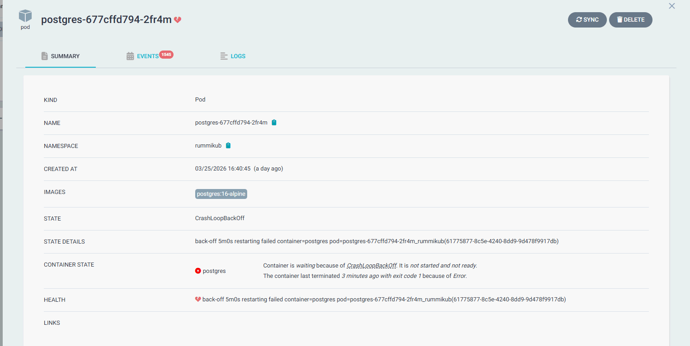
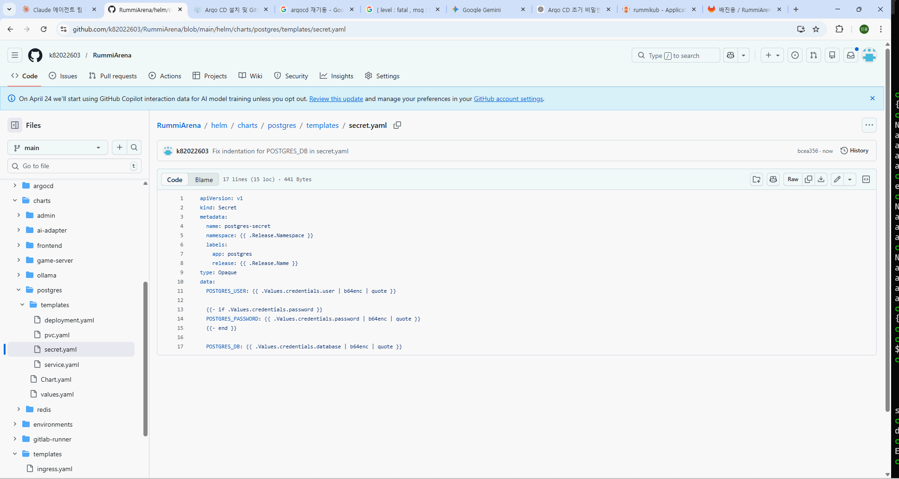

# 🐘 PostgreSQL CrashLoopBackOff 해결 가이드 (Kubernetes + Helm + ArgoCD)

## 📌 개요




Kubernetes 환경에서 PostgreSQL Pod가 다음과 같은 에러로 인해 기동되지 않는 문제가 발생했다.

```bash
Error: Database is uninitialized and superuser password is not specified.
```

본 문서는 해당 문제의 원인 분석부터 해결까지의 전체 과정을 정리한다.

---

## 🚨 문제 상황

### 증상

* Pod 상태: `CrashLoopBackOff`
* 로그:

```bash
kubectl logs -n rummikub -l app=postgres
```

```text
Error: Database is uninitialized and superuser password is not specified.
```

---

## 🔍 원인 분석

### 1. Secret 확인

```bash
kubectl get secret postgres-secret -n rummikub -o yaml
```

결과:

```yaml
data:
  POSTGRES_USER: cnVtbWlrdWI=
  POSTGRES_PASSWORD: ""
  POSTGRES_DB: cnVtbWlrdWI=
```

👉 문제:

* `POSTGRES_PASSWORD` 값이 **빈 문자열**
* PostgreSQL은 초기화 시 반드시 비밀번호 필요

---

### 2. Helm values.yaml 확인

```yaml
credentials:
  user: rummikub
  password: ""
  database: rummikub
```

👉 문제:

* Helm에서도 password가 비어 있음

---

### 3. Helm Secret 템플릿 구조

```yaml
data:
  POSTGRES_USER: {{ .Values.credentials.user | b64enc | quote }}

  {{- if .Values.credentials.password }}
  POSTGRES_PASSWORD: {{ .Values.credentials.password | b64enc | quote }}
  {{- end }}

  POSTGRES_DB: {{ .Values.credentials.database | b64enc | quote }}
```

👉 핵심 포인트:

* password가 없으면 **아예 필드 생성 안됨**
* 결과적으로 컨테이너 환경변수 미주입

---

## ⚙️ 해결 전략

### 🎯 목표

* values.yaml에는 password를 넣지 않음 (보안)
* Kubernetes Secret으로만 주입

---

## ✅ 해결 과정

### 1. Secret 재생성

```bash
kubectl create secret generic postgres-secret \
  -n rummikub \
  --from-literal=POSTGRES_USER=rummikub \
  --from-literal=POSTGRES_PASSWORD=rummikub123 \
  --from-literal=POSTGRES_DB=rummikub \
  --dry-run=client -o yaml | kubectl apply -f -
```

---

### 2. PVC 초기화 (중요)

기존 DB 초기화 상태 제거:

```bash
kubectl delete pvc -n rummikub --all
```

⚠️ 이유:

* PostgreSQL은 기존 데이터가 있으면 초기화 로직 실행 안함

---

### 3. stuck PVC 강제 제거

```bash
kubectl patch pvc rummikub-pgdata -n rummikub -p '{"metadata":{"finalizers":null}}'
```

---

### 4. Pod 재시작

```bash
kubectl delete pod -n rummikub -l app=postgres
```

---

## 🎉 결과 확인

```bash
kubectl logs -n rummikub -l app=postgres
```

정상 로그:

```text
PostgreSQL init process complete; ready for start up.
database system is ready to accept connections
```

👉 ✅ PostgreSQL 정상 기동 완료

---

## 🧠 핵심 정리

### ❌ 잘못된 구조

| 항목          | 상태               |
| ----------- | ---------------- |
| values.yaml | password 없음      |
| Secret      | password 없음      |
| 결과          | CrashLoopBackOff |

---

### ✅ 올바른 구조

| 구성 요소         | 역할                  |
| ------------- | ------------------- |
| values.yaml   | password 없음 (보안 유지) |
| Secret        | 실제 password 주입      |
| Helm template | 조건부 생성              |
| Pod           | 정상 환경변수 주입          |

---

## ⚠️ ArgoCD 이슈

### 증상

```text
postgres-secret OutOfSync
```

### 원인

* Git에는 password 없음
* 클러스터에는 password 존재

👉 즉, **Drift 발생**

---

## 🛠 해결 옵션

### 옵션 1 (추천 - 개발환경)

ArgoCD에서 Secret 무시:

```yaml
ignoreDifferences:
  - kind: Secret
    name: postgres-secret
```

---

### 옵션 2 (운영환경)

* External Secret (Vault, AWS Secrets Manager 등)
* GitOps 완전 적용

---

## 🔥 트러블슈팅 체크리스트

| 항목          | 확인 방법                   |            |
| ----------- | ----------------------- | ---------- |
| Secret 값 존재 | `kubectl get secret ... | base64 -d` |
| env 주입 여부   | `kubectl describe pod`  |            |
| PVC 초기화 여부  | PVC 삭제 여부               |            |
| Pod 재시작     | delete pod              |            |
| Helm 조건문    | password 필드 생성 여부       |            |

---

## 📌 결론

* PostgreSQL CrashLoopBackOff의 핵심 원인은 **비밀번호 미설정**
* Helm + Secret 구조에서는:

  * **values.yaml ≠ 민감정보 저장소**
  * **Secret = 실제 credential source**
* PVC 초기화 여부가 매우 중요

